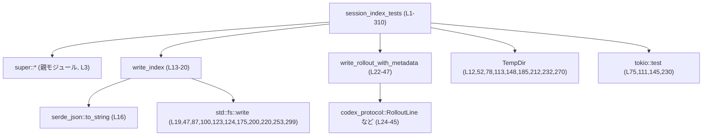
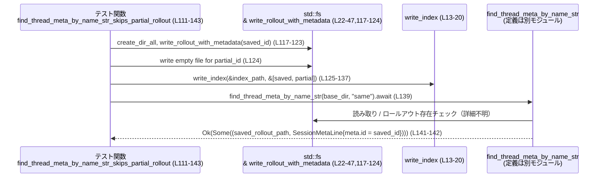

# rollout/src/session_index_tests.rs

## 0. ざっくり一言

`session_index` モジュールのインデックス検索ロジック（スキャン順序・スレッド名／ID 解決・メタ情報の存在確認・リネーム処理など）を検証するテスト群と、そのための補助関数を定義したファイルです（`session_index_tests.rs:L13-310`）。

---

## 1. このモジュールの役割

### 1.1 概要

- このモジュールは、セッションインデックスとロールアウトファイルに関する以下の挙動を検証します。
  - インデックスを「末尾から」スキャンして、最新の一致エントリを選ぶこと（`scan_index_from_end`, `scan_index_from_end_by_id` の契約、`session_index_tests.rs:L50-73,183-208,268-309`）。
  - スレッド名からメタ情報を引く際に、**ロールアウトがまだ存在しない／部分的なロールアウト**をスキップすること（`session_index_tests.rs:L75-143`）。
  - スレッド名のリネーム履歴を考慮し、「現在の名前」でのみ解決すること（`session_index_tests.rs:L145-181`）。
  - 複数 ID に対して、最新のスレッド名マッピングを返すこと（`find_thread_names_by_ids`, `session_index_tests.rs:L230-266`）。

### 1.2 アーキテクチャ内での位置づけ

このテストモジュールは `use super::*;` により、親モジュールの公開 API をテストしています（`session_index_tests.rs:L3`）。

主な依存関係は以下の通りです。

- 親モジュール（パス名はこのチャンクからは不明）
  - 型: `SessionIndexEntry`, `ThreadId`（フィールド利用より、少なくとも `id`, `thread_name`, `updated_at` フィールドを持つことが分かります。`session_index_tests.rs:L56-67,188-199,274-283`）
  - 関数:  
    - `session_index_path(base_dir, ...)`（インデックスファイルのパスを生成、`session_index_tests.rs:L53,79,114,149,186,213,233,271`）
    - `scan_index_from_end(path, predicate)`（末尾から条件一致を検索、`session_index_tests.rs:L70,222,301`）
    - `scan_index_from_end_by_id(path, &ThreadId)`（ID ベース検索、`session_index_tests.rs:L202,225,304,307`）
    - `find_thread_meta_by_name_str(base_dir, &str)`（非同期でメタ情報検索、`session_index_tests.rs:L102,139,177`）
    - `find_thread_names_by_ids(base_dir, &HashSet<ThreadId>)`（非同期で複数 ID の名前解決、`session_index_tests.rs:L263`）

- 外部クレート:
  - `codex_protocol::protocol` の型群  
    `RolloutItem`, `RolloutLine`, `SessionMeta`, `SessionMetaLine`, `SessionSource` を利用し、テスト用のロールアウト JSONL を構築しています（`session_index_tests.rs:L4-8,24-45`）。
  - `tempfile::TempDir` により、テストごとに一時ディレクトリを作成し、ファイル I/O を隔離しています（`session_index_tests.rs:L12,52,78,113,148,185,212,232,270`）。
  - `pretty_assertions::assert_eq` により、テスト失敗時の差分表示を改善しています（`session_index_tests.rs:L9,71,106,141,179,205,223,226,264,302,305,308`）。

依存関係の概略図（ノード名に行範囲を付与）:



### 1.3 設計上のポイント

- **責務の分離**
  - ファイル書き出しは `write_index` / `write_rollout_with_metadata` に切り出し、各テストでは「インデックス内容」や「ロールアウト有無」のパターン構成に集中しています（`session_index_tests.rs:L13-20,22-47`）。
- **テストごとの完全隔離**
  - 各テストは `TempDir::new()` で独立した一時ディレクトリを作成し、その中でインデックス・ロールアウトファイルを生成します（`session_index_tests.rs:L52,78,113,148,185,212,232,270`）。
- **解決順序を append order に固定**
  - コメントに明示的に「Resolution is based on append order (scan from end), not updated_at.」とあり、インデックスの `updated_at` ではなく、**ファイル末尾からのスキャン順**で最新エントリを決める契約を確認しています（`session_index_tests.rs:L284-284`）。
- **エラーハンドリング**
  - テスト関数はすべて `std::io::Result<()>` を返し、`?` 演算子で I/O エラーを上位（テストランナー）に伝播します（`session_index_tests.rs:L51,76,112,146,184,211,231,269`）。
  - `write_index` 内で `serde_json::to_string(entry).unwrap()` を使用しており、シリアライズ失敗時にはパニックしますが、これはテスト環境前提の簡略化です（`session_index_tests.rs:L16`）。

---

## 2. 主要な機能一覧（コンポーネントインベントリー）

### 2.1 コンポーネント（関数）一覧

| 名前 | 種別 | 行範囲 | 役割 / 用途 |
|------|------|--------|-------------|
| `write_index` | 補助関数 | `session_index_tests.rs:L13-20` | `SessionIndexEntry` のスライスを JSON Lines 形式でインデックスファイルに書き出すテスト用ユーティリティです。 |
| `write_rollout_with_metadata` | 補助関数 | `session_index_tests.rs:L22-47` | 単一の `RolloutLine::SessionMeta` を含むロールアウト JSONL ファイルを生成します。 |
| `find_thread_id_by_name_prefers_latest_entry` | テスト | `session_index_tests.rs:L50-73` | `scan_index_from_end` が同じ `thread_name` に対して末尾のエントリ（最新）を返すことを検証します。 |
| `find_thread_meta_by_name_str_skips_newest_entry_without_rollout` | 非同期テスト | `session_index_tests.rs:L75-109` | ロールアウトファイルが存在しない最新エントリは、古いが保存済みのロールアウトを持つエントリより優先されないことを検証します。 |
| `find_thread_meta_by_name_str_skips_partial_rollout` | 非同期テスト | `session_index_tests.rs:L111-143` | 空ファイル（部分的なロールアウト）をスキップし、完全なロールアウトを持つエントリを選ぶことを検証します。 |
| `find_thread_meta_by_name_str_ignores_historical_name_after_rename` | 非同期テスト | `session_index_tests.rs:L145-181` | リネームされた ID について、古い名前では解決せず、現在の名前でのみ解決されることを検証します。 |
| `find_thread_name_by_id_prefers_latest_entry` | テスト | `session_index_tests.rs:L183-208` | `scan_index_from_end_by_id` が同一 ID の複数エントリから最新の名前を返すことを検証します。 |
| `scan_index_returns_none_when_entry_missing` | テスト | `session_index_tests.rs:L210-228` | 未登録の名前／ID に対して `None` が返ることを検証します。 |
| `find_thread_names_by_ids_prefers_latest_entry` | 非同期テスト | `session_index_tests.rs:L230-266` | 複数 ID に対して、各 ID の最新の名前マッピングを返すことを検証します。 |
| `scan_index_finds_latest_match_among_mixed_entries` | テスト | `session_index_tests.rs:L268-309` | 名前／ID が混在するインデックスに対して、append order に基づき正しいエントリが選ばれることを検証します。 |

### 2.2 外部 API（親モジュール）の観測された機能

このファイルには定義がありませんが、テストから観測できる契約を列挙します（すべて `super::*` 経由のインポート、`session_index_tests.rs:L3`）。

- `session_index_path(base_dir, ...)`  
  - 役割: セッションインデックスファイルのパスを返す関数と推測されます（`session_index_tests.rs:L53,79,114,149,186,213,233,271`）。
  - テストでは戻り値を `write_index(&path, ...)` や `scan_index_from_end(&path, ...)` の第1引数として使用しており、`&Path` に参照変換可能な型であることが分かります（`session_index_tests.rs:L68,100,137,175,200,220,253,299`）。

- `scan_index_from_end(path, predicate)`  
  - 役割: インデックスファイルを末尾からスキャンし、クロージャ `predicate(&SessionIndexEntry) -> bool` を満たす最後のエントリを返します（`session_index_tests.rs:L70,222,301`）。
  - 戻り値は `io::Result<Option<SessionIndexEntry>>` であると観測できます（`found` に直接 `Option` を返し、`?` で I/O エラーを伝播しているため、`session_index_tests.rs:L51,70-72`）。

- `scan_index_from_end_by_id(path, &ThreadId)`  
  - 役割: 指定された ID に対応する最後のエントリを返します（`session_index_tests.rs:L202,225,304,307`）。
  - 戻り値も `io::Result<Option<SessionIndexEntry>>` と見なせます（`session_index_tests.rs:L183-208,210-228,268-309`）。

- `find_thread_meta_by_name_str(base_dir, &str)`  
  - 役割: 名前からスレッドメタ情報とロールアウトパスを探索します（`session_index_tests.rs:L102,139,177`）。
  - 戻り値は `io::Result<Option<(PathBuf, SessionMetaLine)>>` 相当と推測されます。テストでは `found.map(|(path, session_meta)| ...)` として使用されているためです（`session_index_tests.rs:L104-107`）。

- `find_thread_names_by_ids(base_dir, &HashSet<ThreadId>)`  
  - 役割: 複数 ID からそれぞれのスレッド名を取得して `HashMap<ThreadId, String>` を返します（`session_index_tests.rs:L259-265`）。
  - 戻り値は `io::Result<HashMap<ThreadId, String>>` と観測できます（`session_index_tests.rs:L230-266`）。

> これらの関数の**内部実装**はこのチャンクには存在しないため、処理手順やデータ構造の詳細は分かりません。

---

## 3. 公開 API と詳細解説

### 3.1 型一覧（構造体・列挙体など）

このファイル内で新しく定義されている型はありませんが、利用されている主要な型を整理します。

| 名前 | 種別 | 参照箇所 | 役割 / 用途 |
|------|------|----------|-------------|
| `SessionIndexEntry` | 構造体（定義は親モジュール） | `session_index_tests.rs:L56-67,88-99,125-136,158-174,188-199,215-219,237-252,274-283,286-293` | セッションインデックスの1行を表すエントリ。少なくとも `id`, `thread_name`, `updated_at` フィールドを持つことがテストから分かります。 |
| `ThreadId` | 構造体／新型ラッパーと推測 | `session_index_tests.rs:L54-55,80-81,115-116,150-151,187,214,234-235,272-273,287,291,293,295` | セッションスレッドを一意に識別する ID。`ThreadId::new()` で生成され、ロールアウトファイル名にも埋め込まれます。 |
| `RolloutLine` | 構造体（`codex_protocol::protocol`） | `session_index_tests.rs:L24-45` | ロールアウトファイルの1行を表します。ここでは `RolloutItem::SessionMeta` バリアントとして使用されています。 |
| `RolloutItem` | 列挙体（`codex_protocol::protocol`） | `session_index_tests.rs:L26` | ロールアウトファイルの行種別を表します。ここでは `SessionMeta` バリアントのみ使用されています。 |
| `SessionMetaLine` | 構造体（`codex_protocol::protocol`） | `session_index_tests.rs:L26-44` | セッションメタ情報と Git 情報をまとめた1行分のデータです。ここでは `git: None` で固定されています。 |
| `SessionMeta` | 構造体（`codex_protocol::protocol`） | `session_index_tests.rs:L27-42` | セッションのメタ情報（id, timestamp, cwd, originator, cli_version, source, その他のオプションフィールド）を保持します。 |
| `SessionSource` | 列挙体（`codex_protocol::protocol`） | `session_index_tests.rs:L34` | セッションの起点（CLI など）を表す列挙体。ここでは `SessionSource::Cli` 固定です。 |
| `TempDir` | 構造体（`tempfile`） | `session_index_tests.rs:L12,52,78,113,148,185,212,232,270` | テスト専用の一時ディレクトリ。スコープを抜けると自動で削除されます。 |

### 3.2 関数詳細（7件）

#### `write_index(path: &Path, lines: &[SessionIndexEntry]) -> std::io::Result<()>`

**概要**

- `SessionIndexEntry` のスライスを JSON 文字列にシリアライズし、1 行 1 エントリのテキストファイルとして `path` に書き出すテスト用ユーティリティです（`session_index_tests.rs:L13-20`）。

**引数**

| 引数名 | 型 | 説明 |
|--------|----|------|
| `path` | `&Path` | 出力先インデックスファイルのパス（`session_index_tests.rs:L13`）。 |
| `lines` | `&[SessionIndexEntry]` | 書き出すインデックスエントリのスライス（`session_index_tests.rs:L13`）。 |

**戻り値**

- `std::io::Result<()>`  
  - `Ok(())`: 書き込みに成功した場合（`session_index_tests.rs:L19-20`）。  
  - `Err(e)`: ファイル I/O でエラーが発生した場合。

**内部処理の流れ**

1. 空の `String` を生成します（`session_index_tests.rs:L14`）。
2. `lines` を順に走査し、各 `SessionIndexEntry` を `serde_json::to_string` で JSON 文字列に変換し、文字列バッファに追加します（`session_index_tests.rs:L15-17`）。
3. 各 JSON の後に改行文字 `\n` を追加します（`session_index_tests.rs:L17`）。
4. 最後に `std::fs::write(path, out)` でファイルに書き込みます（`session_index_tests.rs:L19`）。

**Examples（使用例）**

テストコード内での典型的な使用例です（`session_index_tests.rs:L56-68`）。

```rust
// temp ディレクトリを作成する（L52）
let temp = TempDir::new()?;
// 親モジュールのヘルパーからインデックスファイルパスを取得（L53）
let path = session_index_path(temp.path());

// テスト用のエントリを作成（L56-67）
let lines = vec![
    SessionIndexEntry {
        id: ThreadId::new(),
        thread_name: "same".to_string(),
        updated_at: "2024-01-01T00:00:00Z".to_string(),
    },
];

// JSONL ファイルとして出力（L68）
write_index(&path, &lines)?;
```

**Errors / Panics**

- `Errors`
  - `std::fs::write` が失敗した場合（ディスクフル、パーミッションなど）、`Err(std::io::Error)` を返します（`session_index_tests.rs:L19-20`）。
- `Panics`
  - `serde_json::to_string(entry).unwrap()` により、`SessionIndexEntry` のシリアライズが失敗した場合にパニックになります（`session_index_tests.rs:L16`）。

**Edge cases（エッジケース）**

- `lines` が空スライスの場合  
  → 空文字列が書き込まれます（ループが一度も回らず、そのまま `std::fs::write` に渡されるため、`session_index_tests.rs:L15-19`）。
- 非 UTF-8 データは関与しません。`SessionIndexEntry` がどのようなフィールドを持つかによりますが、このチャンクからは判別できません。

**使用上の注意点**

- 本関数はテスト専用であり、シリアライズエラーを `unwrap` で扱っているため、本番コードには直接利用しない前提の構造になっています（`session_index_tests.rs:L16`）。
- 書き出すフォーマット（1 行 1 JSON）は、親モジュールの読み取りロジックが依存する契約である可能性が高く、変更する場合は `scan_index_from_end` などの実装を合わせて確認する必要があります。

---

#### `write_rollout_with_metadata(path: &Path, thread_id: ThreadId) -> std::io::Result<()>`

**概要**

- 指定された `thread_id` を持つ `SessionMeta` を含んだ `RolloutLine` を JSON にシリアライズし、改行付きでファイルに書き出すテスト用ユーティリティです（`session_index_tests.rs:L22-47`）。

**引数**

| 引数名 | 型 | 説明 |
|--------|----|------|
| `path` | `&Path` | 出力先ロールアウトファイルのパス（`session_index_tests.rs:L22`）。 |
| `thread_id` | `ThreadId` | セッションメタ情報の `id` に設定するスレッド ID（`session_index_tests.rs:L22,28`）。 |

**戻り値**

- `std::io::Result<()>`  
  - `Ok(())`: 書き込みに成功した場合。  
  - `Err(e)`: シリアライズまたはファイル I/O でエラーが発生した場合。

**内部処理の流れ**

1. 固定のタイムスタンプ `"2024-01-01T00-00-00Z"` を `String` として生成します（`session_index_tests.rs:L23`）。
2. `RolloutLine` 構造体を構築し、その中に `RolloutItem::SessionMeta(SessionMetaLine { meta: SessionMeta { ... } })` を設定します（`session_index_tests.rs:L24-45`）。
3. `serde_json::to_string(&line)` で JSON 文字列にシリアライズし、失敗した場合は `std::io::Error::other` に変換します（`session_index_tests.rs:L46`）。
4. 末尾に改行を付けてファイルに書き込みます（`session_index_tests.rs:L47`）。

**Examples（使用例）**

ロールアウトファイルを作成してからインデックスを検索するテストで使われています（`session_index_tests.rs:L82-88`）。

```rust
let saved_id = ThreadId::new();                                      // L80
let saved_rollout_path = temp
    .path()
    .join("sessions/2024/01/01")
    .join(format!("rollout-2024-01-01T00-00-00-{saved_id}.jsonl"));  // L82-85

std::fs::create_dir_all(saved_rollout_path.parent().expect("rollout parent"))?; // L86

// saved_id 用のメタ情報付きロールアウト JSONL を作成（L87）
write_rollout_with_metadata(&saved_rollout_path, saved_id)?;
```

**Errors / Panics**

- `Errors`
  - `serde_json::to_string(&line)` が失敗した場合、`std::io::Error::other` でラップされたエラーが返ります（`session_index_tests.rs:L46`）。
  - `std::fs::write` が失敗した場合も同様に `Err(std::io::Error)` を返します（`session_index_tests.rs:L47`）。
- `Panics`
  - この関数内では明示的な `unwrap` は使用していないため、上記以外のパニック要因は見当たりません（`session_index_tests.rs:L22-47`）。

**Edge cases（エッジケース）**

- `path` の親ディレクトリが存在しない場合  
  → 呼び出し側で `create_dir_all` を行っているため、通常は問題ありませんが、未作成の場合 write 時に `Err` が返ります（呼び出し側の `create_dir_all` はテストコードで確認できます: `session_index_tests.rs:L86,122,156`）。
- `thread_id` はそのまま `SessionMeta::id` に保存され、ロールアウトファイル名にも埋め込まれるため、ID とファイル名の整合性が前提になります（`session_index_tests.rs:L28,85,119,121,155`）。

**使用上の注意点**

- テストでは「メタ情報行のみを含むロールアウトファイル」という極端に簡素な形を使用しています。本番ロールアウトファイルが複数行構造である場合、この関数はあくまでメタ行の存在確認専用のシナリオをテストしていることになります。
- 部分的なロールアウト（空ファイル）はテストで明示的に作られ、`find_thread_meta_by_name_str` がスキップすることを検証しています（`session_index_tests.rs:L120-124,139-142`）。

---

#### `find_thread_id_by_name_prefers_latest_entry() -> std::io::Result<()>`

**概要**

- 同じ `thread_name` を持つ複数の `SessionIndexEntry` が存在する場合に、`scan_index_from_end` が**末尾のエントリ**（append order 上の最新）を返すことを検証する同期テストです（`session_index_tests.rs:L50-73`）。

**引数**

- なし（テスト関数であり、グローバル状態も使用していません）。

**戻り値**

- `std::io::Result<()>`  
  - `Ok(())`: テストが成功した場合。  
  - `Err(e)`: 一時ディレクトリ作成やファイル書き込みが失敗した場合。

**内部処理の流れ**

1. `TempDir::new()` により一時ディレクトリを作成します（`session_index_tests.rs:L52`）。
2. `session_index_path(temp.path())` でインデックスファイルパスを取得します（`session_index_tests.rs:L53`）。
3. 2 つの異なる `ThreadId` を生成し（`id1`, `id2`）、両方に `thread_name: "same"` を設定したエントリを作成します（`session_index_tests.rs:L54-67`）。
4. `write_index` でエントリを書き出します（`session_index_tests.rs:L68`）。
5. `scan_index_from_end` を `entry.thread_name == "same"` というプレディケートで呼び出します（`session_index_tests.rs:L70`）。
6. 返ってきた `Option<SessionIndexEntry>` の `id` が `id2`（後に追加した方）であることを `assert_eq` で検証します（`session_index_tests.rs:L71`）。

**Examples（使用例）**

このテスト自体が `scan_index_from_end` の使用例になっています。

```rust
let found = scan_index_from_end(&path, |entry| entry.thread_name == "same")?; // L70
assert_eq!(found.map(|entry| entry.id), Some(id2));                            // L71
```

**Errors / Panics**

- I/O エラー発生時は `?` 演算子により `Err(std::io::Error)` としてテストから返されます（`session_index_tests.rs:L51,52,68,70`）。
- `scan_index_from_end` の内部でのパニックがあるかどうかは、このチャンクでは不明です。

**Edge cases（エッジケース）**

- 同名エントリが一つだけの場合  
  → そのエントリが返されるはずですが、このテストでは明示的に検証していません。
- 名前が見つからない場合の挙動は、別テスト `scan_index_returns_none_when_entry_missing` で検証されています（`session_index_tests.rs:L210-228`）。

**使用上の注意点**

- 解決順序は `updated_at` ではなく「ファイルの append order（末尾からスキャン）」であることが、このテスト群全体の前提です（`session_index_tests.rs:L284`）。  
  `updated_at` が必ずしも単調増加しない場合でも、末尾に近いエントリが優先されます。

---

#### `find_thread_meta_by_name_str_skips_newest_entry_without_rollout() -> std::io::Result<()>`（非同期）

**概要**

- 同じ `thread_name` を持つエントリが複数存在し、そのうち**新しい方に対応するロールアウトファイルが存在しない**場合に、`find_thread_meta_by_name_str` が古いがロールアウトを持つエントリを優先することを検証します（`session_index_tests.rs:L75-109`）。

**引数**

- なし。

**戻り値**

- `std::io::Result<()>`（`#[tokio::test]` により非同期テストとして実行、`session_index_tests.rs:L75-76`）。

**内部処理の流れ**

1. 一時ディレクトリとインデックスパスを準備します（`session_index_tests.rs:L78-80`）。
2. 2 つの ID (`saved_id`, `unsaved_id`) を生成します（`session_index_tests.rs:L80-81`）。
3. `saved_id` 用のロールアウトファイルパスを `sessions/2024/01/01` 配下に組み立て、ディレクトリを作成した上で `write_rollout_with_metadata` を呼び出します（`session_index_tests.rs:L82-88`）。
4. `SessionIndexEntry` のリストとして、以下 2 エントリを作成しインデックスに書き込みます（`session_index_tests.rs:L88-100`）。
   - 古いエントリ: `id = saved_id`, `thread_name = "same"`, `updated_at = "2024-01-01..."`（ロールアウトあり）。
   - 新しいエントリ: `id = unsaved_id`, `thread_name = "same"`, `updated_at = "2024-01-02..."`（ロールアウトなし）。
5. `find_thread_meta_by_name_str(temp.path(), "same").await?` を呼び出し、結果を `found` に格納します（`session_index_tests.rs:L102`）。
6. 返ってきた `Option<(PathBuf, SessionMetaLine)>` から `(path, session_meta.meta.id)` のタプルを取り出し、`(saved_rollout_path, saved_id)` と一致することを `assert_eq` で検証します（`session_index_tests.rs:L104-107`）。

**Examples（使用例）**

```rust
// 名前 "same" に対して、ロールアウトが存在する saved_id を選ぶことを確認（L102-107）
let found = find_thread_meta_by_name_str(temp.path(), "same").await?;
assert_eq!(
    found.map(|(path, session_meta)| (path, session_meta.meta.id)),
    Some((saved_rollout_path, saved_id)),
);
```

**Errors / Panics**

- 一時ディレクトリ作成、ディレクトリ生成、ファイル書き込み、シリアライズ、`find_thread_meta_by_name_str` 内の I/O などで発生した `std::io::Error` が `?` により伝播します（`session_index_tests.rs:L76-88,100,102`）。
- `find_thread_meta_by_name_str` 内部のパニック可能性はこのチャンクからは分かりません。

**Edge cases（エッジケース）**

- 同名エントリのうち、**新しい方のロールアウトが存在しない**ケースを扱っています（`session_index_tests.rs:L95-98`）。
  - この場合、古いがロールアウトを持つエントリが優先される契約がテストされています。
- 同名エントリが多数存在し、複数がロールアウトを持っている場合の挙動は、このチャンクからは不明です。

**使用上の注意点**

- `find_thread_meta_by_name_str` を使用する場合、インデックスだけでなくロールアウトファイルの存在も結果に影響することが分かります。  
  「インデックスはあるがロールアウトがまだ保存されていない」状態のエントリは無視されます。
- テストでは `sessions/年/月/日` 配下のファイルレイアウトを前提にしていますが、これは親モジュールの仕様であり、このチャンクからは変更可否は判断できません（`session_index_tests.rs:L82-85`）。

---

#### `find_thread_meta_by_name_str_skips_partial_rollout() -> std::io::Result<()>`（非同期）

**概要**

- ロールアウトファイルが存在しても、**中身が空のファイル（部分的／不完全なロールアウト）**は無効とみなされ、完全なロールアウトを持つエントリを優先することを検証します（`session_index_tests.rs:L111-143`）。

**引数 / 戻り値**

- 先ほどのテストと同様に、引数なし・戻り値 `std::io::Result<()>` の非同期テストです（`session_index_tests.rs:L111-112`）。

**内部処理の流れ**

1. 一時ディレクトリとインデックスパスを準備（`session_index_tests.rs:L113-115`）。
2. `saved_id`（完全ロールアウトあり）と `partial_id`（部分ロールアウト）の 2 つの ID を生成（`session_index_tests.rs:L115-116`）。
3. `sessions/2024/01/01` をベースとしたロールアウトディレクトリと 2 つのファイルパスを構築（`session_index_tests.rs:L117-121`）。
4. ディレクトリを生成し、`saved_id` 用には `write_rollout_with_metadata` を呼び出し、`partial_id` 用には中身が空のファイルを作成（`std::fs::write(&partial_rollout_path, "")`）（`session_index_tests.rs:L122-124`）。
5. インデックスには両方の ID を同名 `"same"` で登録し、`partial_id` の方を新しい `updated_at` として書き込む（`session_index_tests.rs:L125-136`）。
6. `find_thread_meta_by_name_str(temp.path(), "same").await?` を呼び出し（`session_index_tests.rs:L139`）、返ってきたパスが `saved_rollout_path` であることを検証（`session_index_tests.rs:L141-142`）。

**Examples（使用例）**

```rust
// 部分的なロールアウトを空ファイルで表現（L124）
std::fs::write(&partial_rollout_path, "")?;

// 名前 "same" のメタ解決は saved_rollout_path を指すべき（L139-142）
let found = find_thread_meta_by_name_str(temp.path(), "same").await?;
assert_eq!(found.map(|(path, _)| path), Some(saved_rollout_path));
```

**Edge cases**

- ロールアウトファイルが存在しても、中身が不完全な場合は「存在しないもの」とみなされる契約がテストから読み取れます（`session_index_tests.rs:L124,139-142`）。
- 中身が不正 JSON であるケースは明示的にテストされていません。

**使用上の注意点**

- `find_thread_meta_by_name_str` を使用する際、「ファイルが存在するかどうか」だけでなく、「内容が完全であるかどうか」も検証される前提があります。  
  ロールアウト書き込みの途中でクラッシュしたファイルなどは自動的にスキップされる仕様と整合します。

---

#### `find_thread_meta_by_name_str_ignores_historical_name_after_rename() -> std::io::Result<()>`（非同期）

**概要**

- スレッドがリネームされた場合、古い名前でのインデックスエントリは「歴史的情報」として保持されていても、現在の名前による検索では古い ID を返さず、**現在の名前と現在の ID の組み合わせを優先**することを検証します（`session_index_tests.rs:L145-181`）。

**内部処理の流れ**

1. 一時ディレクトリとインデックスパスを準備（`session_index_tests.rs:L148-150`）。
2. `renamed_id`（リネームされた ID）と `current_id`（現在使用中の ID）を生成（`session_index_tests.rs:L150-151`）。
3. `current_id` 用のロールアウトファイルを作成し、`write_rollout_with_metadata` でメタ情報行を書き込む（`session_index_tests.rs:L152-157`）。
4. インデックスには 3 つのエントリを追加（`session_index_tests.rs:L158-174`）。
   - `renamed_id` / `"same"` / 2024-01-01
   - `current_id` / `"same"` / 2024-01-02
   - `renamed_id` / `"different"` / 2024-01-03（リネーム後の名前）
5. `find_thread_meta_by_name_str(temp.path(), "same").await?` を呼び出し、返ってきたパスが `current_rollout_path` であることを検証（`session_index_tests.rs:L177-180`）。

**Examples（使用例）**

```rust
// "same" という名前からは current_id のロールアウトのみを見つける（L177-180）
let found = find_thread_meta_by_name_str(temp.path(), "same").await?;
assert_eq!(found.map(|(path, _)| path), Some(current_rollout_path));
```

**Edge cases**

- 同じ名前 `"same"` を過去に使用していた ID (`renamed_id`) があっても、最新の `"same"` の所有者である `current_id` が選ばれる契約です（`session_index_tests.rs:L158-168,177-180`）。
- `renamed_id` の最新の名前 `"different"` に対して検索したときの挙動はこのテストでは扱っていません。

**使用上の注意点**

- 名前ベースの解決では、「ID の最新の名前」が重要であり、古い名前でヒットさせるべきではない、というドメインルールを反映していると解釈できます（根拠: インデックスの並びとアサーション、`session_index_tests.rs:L158-174,177-180`）。
- インデックスには「履歴としての名前変更情報」が残るが、検索結果は現在の状態に基づく、という設計前提が読み取れます。

---

#### `find_thread_names_by_ids_prefers_latest_entry() -> std::io::Result<()>`（非同期）

**概要**

- 複数の `ThreadId` に対する名前解決 API `find_thread_names_by_ids` が、各 ID について**最後のエントリ（append order 上の最新）**の `thread_name` を返すことを検証するテストです（`session_index_tests.rs:L230-266`）。

**内部処理の流れ**

1. 一時ディレクトリとインデックスパスを準備（`session_index_tests.rs:L232-234`）。
2. `id1`, `id2` の 2 つの ID を生成（`session_index_tests.rs:L234-235`）。
3. インデックスエントリを 3 つ作成して書き出す（`session_index_tests.rs:L236-252`）。
   - `id1` / `"first"` / 2024-01-01
   - `id2` / `"other"` / 2024-01-01
   - `id1` / `"latest"` / 2024-01-02（`id1` の最新名）
4. 検索対象 ID の `HashSet` を作成し `id1`, `id2` を挿入（`session_index_tests.rs:L255-257`）。
5. 期待される結果の `HashMap` を作成: `{ id1 => "latest", id2 => "other" }`（`session_index_tests.rs:L259-261`）。
6. `find_thread_names_by_ids(temp.path(), &ids).await?` を呼び出し、その戻り値が期待値と等しいことを検証（`session_index_tests.rs:L263-265`）。

**Examples（使用例）**

```rust
let mut ids = HashSet::new();   // L255-257
ids.insert(id1);
ids.insert(id2);

let found = find_thread_names_by_ids(temp.path(), &ids).await?; // L263
assert_eq!(found, expected);                                    // L264
```

**Edge cases**

- 指定した ID がインデックスに存在しない場合の挙動はこのテストでは扱っていませんが、別途 `scan_index_returns_none_when_entry_missing` により単一 ID の場合の `None` が確認されています（`session_index_tests.rs:L210-228`）。
- `ids` に同一 ID が重複していても `HashSet` が重複を排除するため、API 側では単一回の探索になる設計が想定されます。

**使用上の注意点**

- 複数 ID 解決 API であっても、**順序**ではなく ID→名前のマッピングが戻り値となるため、呼び出し側は結果の順序に依存すべきではありません（戻り値が `HashMap` であることを `assert_eq` から読み取れる、`session_index_tests.rs:L259-261,263-265`）。
- 結果に含まれる ID の集合が入力の `ids` と完全に一致するかどうか（存在しない ID の扱い）は、このテストからは判断できません。

---

### 3.3 その他の関数（テストケース一覧）

| 関数名 | 行範囲 | 役割（1 行） |
|--------|--------|--------------|
| `find_thread_name_by_id_prefers_latest_entry` | `session_index_tests.rs:L183-208` | `scan_index_from_end_by_id` が同一 ID の複数エントリから最新の `thread_name` を返すことを確認します。 |
| `scan_index_returns_none_when_entry_missing` | `session_index_tests.rs:L210-228` | 存在しない名前／ID を検索した場合に `None` が返されることを確認します。 |
| `scan_index_finds_latest_match_among_mixed_entries` | `session_index_tests.rs:L268-309` | 名前と ID が混在するインデックスで、append order に基づき正しいエントリが選択されることを確認します（`session_index_tests.rs:L284` のコメント参照）。 |

---

## 4. データフロー

ここでは、代表的なシナリオとして  
**「名前からメタ情報を解決するが、最新のインデックス行が未保存／部分ロールアウトである」**ケースを取り上げます。

対象は `find_thread_meta_by_name_str_skips_partial_rollout (L111-143)` です。

### 4.1 処理の要点

- テストコードはロールアウトディレクトリとインデックスファイルを構築し、  
  - 完全なロールアウト (`saved_id`)  
  - 部分的ロールアウト（空ファイル, `partial_id`）  
  を用意します（`session_index_tests.rs:L117-124`）。
- インデックス上では `partial_id` の方が新しいエントリとして登録されますが（`session_index_tests.rs:L125-136`）、`find_thread_meta_by_name_str` はこのエントリをスキップし、`saved_id` のロールアウトを返す必要があります（`session_index_tests.rs:L139-142`）。

### 4.2 シーケンス図



> `API` 内部の具体的な処理（インデックスファイルの読み方やロールアウトファイルの検査方法）は、このチャンクには書かれていないため「詳細不明」としています。

---

## 5. 使い方（How to Use）

このファイル自体はテストモジュールですが、親モジュールの API の典型的な使い方が示されています。

### 5.1 基本的な使用方法

**パターン: インデックスファイルを構築し、名前から最新の ID を取得する**

```rust
use tempfile::TempDir;

// 1. テスト用ディレクトリとインデックスパスの準備（session_index_tests.rs:L52-53）
let temp = TempDir::new()?;
let index_path = session_index_path(temp.path());

// 2. インデックス内容の準備（session_index_tests.rs:L56-67）
let id1 = ThreadId::new();
let id2 = ThreadId::new();
let lines = vec![
    SessionIndexEntry {
        id: id1,
        thread_name: "same".to_string(),
        updated_at: "2024-01-01T00:00:00Z".to_string(),
    },
    SessionIndexEntry {
        id: id2,
        thread_name: "same".to_string(),
        updated_at: "2024-01-02T00:00:00Z".to_string(),
    },
];

// 3. JSONL 形式でインデックスファイルに書き出し（session_index_tests.rs:L68）
write_index(&index_path, &lines)?;

// 4. 親モジュール API を使って末尾から検索（session_index_tests.rs:L70-71）
let found = scan_index_from_end(&index_path, |entry| entry.thread_name == "same")?;
assert_eq!(found.map(|entry| entry.id), Some(id2));
```

### 5.2 よくある使用パターン

1. **ID から最新のスレッド名を得る**

   ```rust
   // session_index_tests.rs:L183-208 より
   let found = scan_index_from_end_by_id(&index_path, &id)?;
   let name = found.map(|entry| entry.thread_name);
   ```

2. **複数 ID からまとめて名前を解決する（非同期）**

   ```rust
   // session_index_tests.rs:L255-265 より
   let mut ids = HashSet::new();
   ids.insert(id1);
   ids.insert(id2);

   let names = find_thread_names_by_ids(base_dir, &ids).await?;
   // names: HashMap<ThreadId, String>
   ```

3. **名前からロールアウトメタを解決する（非同期）**

   ```rust
   // session_index_tests.rs:L102-107 より
   if let Some((rollout_path, meta_line)) = find_thread_meta_by_name_str(base_dir, "same").await? {
       // rollout_path: ロールアウトファイルの PathBuf
       // meta_line.meta.id: ThreadId
   }
   ```

### 5.3 よくある間違い

テストから推測できる誤用パターンと、その対策です。

```rust
// 誤り例: インデックスだけ書いてロールアウトを作成しない
write_index(&index_path, &[
    SessionIndexEntry {
        id: unsaved_id,
        thread_name: "same".to_string(),
        updated_at: "2024-01-02T00:00:00Z".to_string(),
    },
])?;
let found = find_thread_meta_by_name_str(base_dir, "same").await?;
// found が None になったり、古いエントリにフォールバックする可能性がある（L75-109）


// 正しい例: メタ解決の対象にしたい ID についてはロールアウトも保存する
write_rollout_with_metadata(&rollout_path, saved_id)?;        // L82-88
write_index(&index_path, &[
    SessionIndexEntry {
        id: saved_id,
        thread_name: "same".to_string(),
        updated_at: "2024-01-01T00:00:00Z".to_string(),
    },
])?;
let found = find_thread_meta_by_name_str(base_dir, "same").await?;
```

### 5.4 使用上の注意点（まとめ）

- **append order 優先**  
  - `scan_index_from_end` 系の API は `updated_at` ではなくファイルの append order に依存して最新エントリを決定します（`session_index_tests.rs:L284`）。
- **ロールアウトの存在・完全性**  
  - 名前からメタ情報を検索する API は、ロールアウトファイルの存在と内容の完全性を考慮します。空ファイルや未保存のロールアウトは無視されます（`session_index_tests.rs:L75-143`）。
- **名前の履歴より現在の名前を優先**  
  - リネーム履歴が残っていても、検索は「現在の名前」と「現在の ID」の組み合わせに基づいて行われます（`session_index_tests.rs:L158-174,177-180`）。
- **非同期 API の実行環境**  
  - `find_thread_meta_by_name_str` と `find_thread_names_by_ids` は非同期関数であり、`#[tokio::test]` のような非同期ランタイム上で `await` する必要があります（`session_index_tests.rs:L75,111,145,230`）。

---

## 6. 変更の仕方（How to Modify）

### 6.1 新しい機能を追加する場合（テスト観点）

- **新しい検索条件やフィルタロジックを API に追加**する場合:
  1. 親モジュール（`super::*`）側で新しい API を定義（このチャンクには定義がないため詳細不明）。
  2. 本ファイルに対応するテスト関数を追加し、`TempDir` ＋ `write_index` ＋ `write_rollout_with_metadata` のパターンで必要なファイル状態を構築します。
  3. 期待する挙動（どのエントリが選ばれるべきか）を `assert_eq` で検証します。

- **インデックスフォーマットを拡張**する場合:
  - `SessionIndexEntry` にフィールドを追加した場合、ここでのリテラル構築箇所（`session_index_tests.rs:L56-67,88-99,125-136,158-174,188-199,215-219,237-252,274-283,286-293`）も更新する必要があります。

### 6.2 既存の機能を変更する場合

- **解決順序（append order vs updated_at）を変更する**場合:
  - `scan_index_finds_latest_match_among_mixed_entries` の前提コメントとアサーション（`session_index_tests.rs:L268-309,284`）に影響します。
  - 仕様変更ならばテストの期待値も一緒に変更する必要があります。

- **ロールアウトの扱い（部分ロールアウトの扱いなど）を変更する**場合:
  - `find_thread_meta_by_name_str_skips_newest_entry_without_rollout` および `find_thread_meta_by_name_str_skips_partial_rollout` のテストが失敗する可能性があります（`session_index_tests.rs:L75-143`）。
  - 「どの程度の不完全さまで許容するか」という仕様に合わせて、テストケースを追加／調整することが望まれます。

- 変更時に注意すべき契約:
  - 「名前からの検索は現在の状態に基づく」という契約（`session_index_tests.rs:L145-181`）。
  - 「存在しない名前や ID には `None` を返す」という契約（`session_index_tests.rs:L210-228`）。

---

## 7. 関連ファイル

| パス | 役割 / 関係 |
|------|------------|
| 親モジュール（`use super::*` の対象。具体的なパスはこのチャンクには現れない） | `SessionIndexEntry`, `ThreadId`, `session_index_path`, `scan_index_from_end`, `scan_index_from_end_by_id`, `find_thread_meta_by_name_str`, `find_thread_names_by_ids` など、本テストが対象としているコアロジックを提供します（`session_index_tests.rs:L3`）。 |
| `codex_protocol::protocol`（外部クレート） | `RolloutLine`, `RolloutItem`, `SessionMetaLine`, `SessionMeta`, `SessionSource` 等を提供し、ロールアウトファイルのフォーマットを定義します（`session_index_tests.rs:L4-8,24-45`）。 |
| `tempfile` クレート | `TempDir` による一時ディレクトリ機能を提供し、テストごとのファイルシステム状態を隔離します（`session_index_tests.rs:L12,52,78,113,148,185,212,232,270`）。 |

---

### Bugs / Security / Contracts / Edge Cases（まとめ）

- **潜在的なバグ要因**
  - `write_index` の `serde_json::to_string(...).unwrap()` によるパニック（`session_index_tests.rs:L16`）。ただしテスト専用コードであり、実害は限定的です。
- **セキュリティ**
  - テスト用コードはすべて一時ディレクトリ下のファイル I/O に限定されており、外部からの入力はありません。  
    ファイル権限やパス操作についての明示的なチェックはありませんが、`TempDir` によりパスインジェクション等のリスクは低く抑えられています。
- **契約**
  - 「append order による解決」「ロールアウトの存在・完全性を必須」「名前の履歴ではなく現在の名前を優先」「存在しない場合は `None`」といった契約がテストで明示的に検証されています（`session_index_tests.rs:L75-143,145-181,210-228,268-309`）。
- **エッジケース**
  - 未登録の名前／ID (`scan_index_returns_none_when_entry_missing`)、部分的ロールアウト、未保存ロールアウト、リネーム後の古い名前など主要なエッジケースがテストされており、これらを破る変更は慎重に検討する必要があります。
