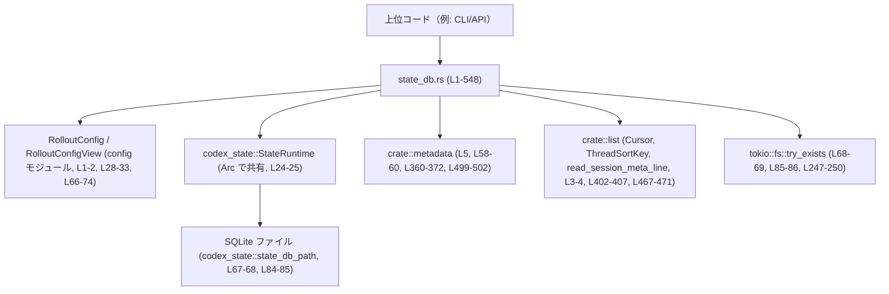
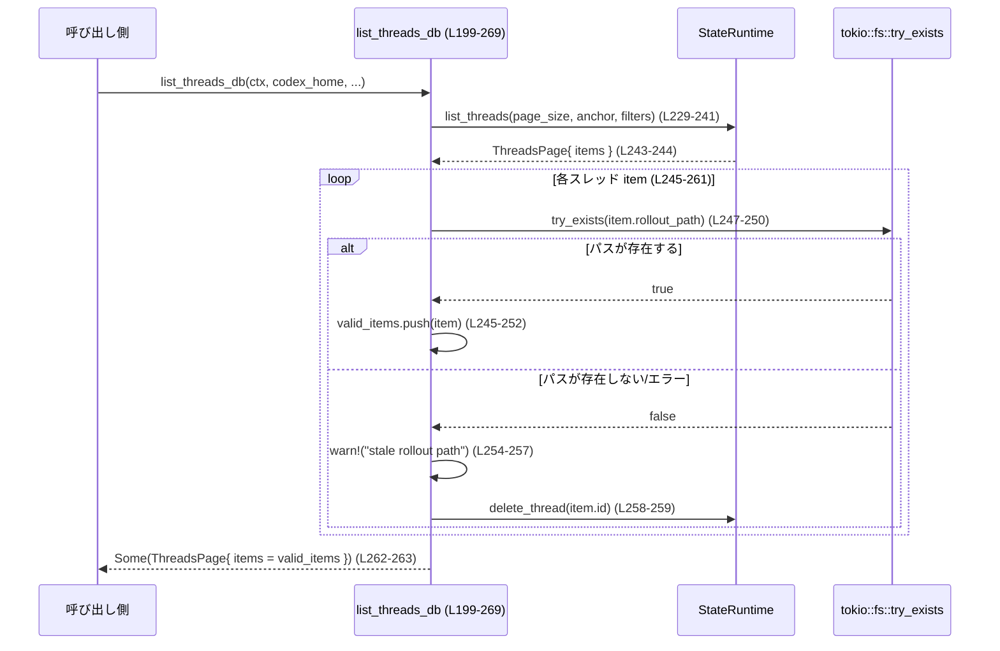

# rollout/src/state_db.rs

## 0. ざっくり一言

SQLite バックエンドの `codex_state::StateRuntime` をラップし、  
スレッド一覧・メタデータ更新・ロールアウトファイル（セッションログ）との整合性維持を行うモジュールです。

---

## 1. このモジュールの役割

### 1.1 概要

- このモジュールは **スレッド状態を SQLite に永続化しつつ、ロールアウトファイルとの整合性を取る問題** を扱います。
- 具体的には、以下の機能を提供します。
  - `codex_state::StateRuntime` の初期化とバックフィル状態チェック（state_db.rs:L28-63, L95-117）
  - スレッド ID / メタデータのページングクエリ（L145-195, L199-269）
  - ロールアウトファイルからのメタデータ抽出・同期（L333-416, L419-481, L486-524）
  - ダイナミックツールやメモリモードなど、スレッドに付随する追加状態の読み書き（L288-330）

### 1.2 アーキテクチャ内での位置づけ

このモジュールは、アプリケーションコードと `codex_state::StateRuntime`（SQLite DB）およびロールアウトファイル群の「仲介レイヤ」です。



- 呼び出し側は `StateDbHandle`（`Arc<StateRuntime>`）を使って非同期に DB 操作を行います（L24-25）。
- ファイルシステム上のロールアウトファイルは `metadata` / `list` モジュールを経由して読み書きされます（L58-60, L360-372, L402-407, L467-471）。
- SQLite の場所は `RolloutConfig` から決まり、`codex_state::state_db_path` でファイルパスに変換されます（L67-68, L84-85）。

### 1.3 設計上のポイント

- **状態管理の分離**
  - DB 側の実装詳細は `codex_state::StateRuntime` に委譲し、このモジュールはそのラッパ兼アダプタです（L24-25, L30-37, L71-76, L88-91）。
- **バックフィルの扱い**
  - 初期化時にバックフィル状態を確認し、未完了であれば非同期タスクでバックフィルを実行します（L45-61）。
  - DB に接続する他の API は `require_backfill_complete` を経由して、バックフィル完了を保証してから利用します（L65-78, L83-93, L95-117）。
- **オプションな依存（feature gating 相当）**
  - 多くの関数が `Option<&StateRuntime>` を受け取り、`None` の場合は何もせず `None` / `false` を返すようになっています（例: L145-157, L199-210, L273-280, L305-313, L319-326, L419-427, L486-498, L526-537）。
- **I/O エラー耐性**
  - ファイル存在チェックは `tokio::fs::try_exists(...).await.unwrap_or(false)` のように、エラー時は「存在しない」とみなす設計です（L68-69, L85-86, L247-250）。
- **並行性**
  - ランタイムは `Arc` で共有され、操作はすべて `async` 関数経由で非同期に行われます（L24-25, ほぼ全関数）。
  - バックフィルは `tokio::spawn` でデタッチされたタスクとして並行実行されます（L58-60）。
- **観測性**
  - すべてのエラー・不整合は `tracing::warn!` でロギングされます（例: L38-42, L48-52, L101-107, L109-115, L169-173, L189-193 など）。

---

## 2. 主要な機能一覧

- SQLite バックエンドの初期化とバックフィル起動: `init`（L28-63）
- 既存 SQLite DB の条件付きオープン: `get_state_db`, `open_if_present`（L65-78, L80-93）
- バックフィル完了の検証: `require_backfill_complete`（L95-117）
- ページング付きスレッド ID 一覧取得: `list_thread_ids_db`（L145-195）
- ページング付きスレッドメタデータ一覧取得＋ロールアウトファイルとの整合性チェック: `list_threads_db`（L199-269）
- スレッド ID からロールアウトパス取得: `find_rollout_path_by_id`（L273-286）
- ダイナミックツールの取得・保存: `get_dynamic_tools`, `persist_dynamic_tools`（L288-317）
- スレッドのメモリモード汚染フラグ設定: `mark_thread_memory_mode_polluted`（L319-329）
- ロールアウトファイルから SQLite への同期（reconcile）: `reconcile_rollout`, `apply_rollout_items`（L333-416, L486-524）
- ロールアウトパスの read-repair（DB の欠損・不整合修復）: `read_repair_rollout_path`（L418-481）
- スレッドの `updated_at` タイムスタンプ更新: `touch_thread_updated_at`（L526-544）

### 2.1 コンポーネントインベントリー

| 名前 | 種別 | 役割 / 用途 | 定義位置 |
|------|------|-------------|----------|
| `LogEntry` | 再エクスポート | `codex_state::LogEntry` を外部に公開 | state_db.rs:L14-14 |
| `StateDbHandle` | 型エイリアス | `Arc<codex_state::StateRuntime>`、DB ランタイムへの共有ハンドル | state_db.rs:L24-25 |
| `init` | `pub async fn` | Rollout 設定から `StateRuntime` を初期化し、バックフィル状態を確認・必要ならバックグラウンド実行 | state_db.rs:L28-63 |
| `get_state_db` | `pub async fn` | SQLite ファイルが存在し、バックフィル完了時のみ `StateRuntime` を返す | state_db.rs:L65-78 |
| `open_if_present` | `pub async fn` | フィーチャーフラグなしで SQLite ファイルがあればオープン（主にマイグレーション用） | state_db.rs:L80-93 |
| `require_backfill_complete` | `async fn` | バックフィル状態が `Complete` のときのみランタイムを返す内部ヘルパ | state_db.rs:L95-117 |
| `cursor_to_anchor` | `fn` | `Cursor`（JSON 文字列）から `codex_state::Anchor`（タイムスタンプ＋UUID）を構築 | state_db.rs:L119-137 |
| `normalize_cwd_for_state_db` | `pub fn` | パス比較用に CWD を正規化（失敗時は元のパス） | state_db.rs:L139-141 |
| `list_thread_ids_db` | `pub async fn` | フィルタとカーソル付きでスレッド ID のページを取得 | state_db.rs:L145-195 |
| `list_threads_db` | `pub async fn` | フィルタと検索語付きでスレッドメタデータを取得し、存在しないロールアウトパスを掃除 | state_db.rs:L199-269 |
| `find_rollout_path_by_id` | `pub async fn` | スレッド ID からロールアウトパスを取得 | state_db.rs:L273-286 |
| `get_dynamic_tools` | `pub async fn` | スレッドに紐づくダイナミックツール一覧を取得 | state_db.rs:L288-301 |
| `persist_dynamic_tools` | `pub async fn` | スレッドにダイナミックツールを保存（コンテキストが `Some` の場合のみ） | state_db.rs:L305-317 |
| `mark_thread_memory_mode_polluted` | `pub async fn` | スレッドのメモリモードを「汚染済み」にマーク | state_db.rs:L319-329 |
| `reconcile_rollout` | `pub async fn` | ロールアウトファイル内容と SQLite のメタデータを同期し、必要ならダイナミックツールも保存 | state_db.rs:L333-416 |
| `read_repair_rollout_path` | `pub async fn` | ファイルシステムから得たロールアウトパスを DB に反映し、不足時は `reconcile_rollout` で修復 | state_db.rs:L419-481 |
| `apply_rollout_items` | `pub async fn` | 一連の `RolloutItem` を SQLite にインクリメンタル適用 | state_db.rs:L486-524 |
| `touch_thread_updated_at` | `pub async fn` | スレッドの更新時刻を上書きし、成功可否を返す | state_db.rs:L526-544 |
| `tests` | `mod` | テストモジュール（実体は `state_db_tests.rs` に委譲） | state_db.rs:L546-548 |

---

## 3. 公開 API と詳細解説

### 3.1 型一覧（構造体・列挙体など）

| 名前 | 種別 | 役割 / 用途 | 定義位置 |
|------|------|-------------|----------|
| `StateDbHandle` | 型エイリアス | `Arc<codex_state::StateRuntime>`。非同期かつスレッドセーフに DB ランタイムを共有するためのハンドルです。 | state_db.rs:L24-25 |
| `LogEntry` | 再エクスポート | ロールアウト／スレッドに紐づくログ行を表す型（詳細は `codex_state` 側）。 | state_db.rs:L14-14 |

※ `Anchor` や `ThreadsPage` などはこのモジュールでは定義されず、`codex_state` 側の型です。

### 3.2 関数詳細（最大 7 件）

#### `init(config: &impl RolloutConfigView) -> Option<StateDbHandle>`

**概要**

- Rollout 設定から `codex_state::StateRuntime` を初期化し、バックフィル状態を確認します（state_db.rs:L28-63）。
- バックフィルが未完了の場合はバックグラウンドタスクで `metadata::backfill_sessions` を起動します（L55-60）。
- 初期化やバックフィル状態読み取りに失敗した場合は `None` を返します。

**引数**

| 引数名 | 型 | 説明 |
|--------|----|------|
| `config` | `&impl RolloutConfigView` | `sqlite_home` や `model_provider_id` 等を提供する設定ビュー（L28-33）。 |

**戻り値**

- `Option<StateDbHandle>`  
  - `Some(handle)` : SQLite ランタイムの初期化に成功した場合（L30-37, L62）。  
  - `None` : 初期化エラー、またはバックフィル状態の取得に失敗した場合（L37-43, L47-53）。

**内部処理の流れ**

1. `RolloutConfig::from_view(config)` で具体的な設定を構築（L29）。
2. `StateRuntime::init(config.sqlite_home.clone(), config.model_provider_id.clone()).await` を実行（L30-37）。
   - 失敗時は `warn!` ログを出し `None` を返す（L38-43）。
3. `runtime.get_backfill_state().await` でバックフィル状態を取得（L45-54）。
   - 失敗時はログを出し `None` を返す（L48-53）。
4. 状態が `Complete` でなければ、クローンしたランタイムと設定を用いて `tokio::spawn` でバックフィルを非同期実行（L55-60）。
5. 最終的に `Some(runtime)` を返す（L62）。

**Examples（使用例）**

```rust
use rollout::state_db::{init, StateDbHandle};
use rollout::config::RolloutConfig; // RolloutConfigView を実装していると仮定

async fn setup_state_db(cfg: &RolloutConfig) -> Option<StateDbHandle> {
    // SQLite の StateRuntime を初期化（バックフィルも必要なら起動）
    init(cfg).await
}
```

**Errors / Panics**

- `StateRuntime::init` が `Err` を返すと `warn!` ログを出して `None` を返します（state_db.rs:L30-37, L38-43）。
- `get_backfill_state` が `Err` の場合も、ログを出して `None` を返します（L45-48, L49-53）。
- この関数内には `unwrap` / `expect` によるパニック箇所はありません。

**Edge cases（エッジケース）**

- `sqlite_home` が存在しないディレクトリを指す場合  
  → `StateRuntime::init` の挙動次第ですが、ここでは `None` を返すだけでパニックはしません（L30-37, L38-43）。
- バックフィル状態が `Complete` 以外の場合でも、ランタイム自体は `Some` で返され、バックフィルはバックグラウンドで動き続けます（L55-62）。

**使用上の注意点**

- 戻り値が `Option` なので、必ず `if let Some(handle) = init(...).await` のような形で存在確認が必要です。
- バックフィルは `tokio::spawn` でデタッチされるため、完了を待たずに処理が進行します（L58-60）。  
  バックフィル完了を前提とする処理には、`get_state_db` / `open_if_present` を使う方が安全です。

---

#### `get_state_db(config: &impl RolloutConfigView) -> Option<StateDbHandle>`

**概要**

- SQLite ファイルの存在を確認し、存在する場合のみ `StateRuntime` を初期化します（state_db.rs:L65-78）。
- さらに `require_backfill_complete` でバックフィルが完了済みであることを確認します（L77-78）。

**引数**

| 引数名 | 型 | 説明 |
|--------|----|------|
| `config` | `&impl RolloutConfigView` | `sqlite_home`, `model_provider_id` を提供する設定。 |

**戻り値**

- `Option<StateDbHandle>`  
  - `Some(handle)` : SQLite ファイルが存在し、バックフィルも完了している場合。  
  - `None` : SQLite ファイルが存在しない、初期化失敗、バックフィル未完了、バックフィル状態取得失敗のいずれか。

**内部処理の流れ**

1. `codex_state::state_db_path(config.sqlite_home())` で DB ファイルパスを取得（L67-68）。
2. `tokio::fs::try_exists(&state_path).await.unwrap_or(false)` で存在確認し、存在しなければ `None`（L68-70）。
3. 存在する場合、`StateRuntime::init(...).await.ok()?` でランタイムを初期化（L71-76）。
4. `require_backfill_complete(runtime, config.sqlite_home()).await` を呼び出し、バックフィル完了時のみ `Some(runtime)` を返す（L77-78）。

**Examples（使用例）**

```rust
use rollout::state_db::{get_state_db, StateDbHandle};
use rollout::config::RolloutConfigView;

async fn maybe_open_state_db(cfg: &impl RolloutConfigView) -> Option<StateDbHandle> {
    // SQLite ファイルが既にあり、バックフィルが完了していれば Some(handle)
    get_state_db(cfg).await
}
```

**Errors / Panics**

- `try_exists` のエラーは `unwrap_or(false)` で「存在しない」と扱われ、ログは出ません（state_db.rs:L68-69）。
- `StateRuntime::init` が失敗した場合は `ok()?` により `None` を返します（L71-76）。
- `require_backfill_complete` 内でバックフィル状態取得に失敗すると警告ログを出し、`None` を返します（L95-117）。

**Edge cases**

- パーミッションなどで `try_exists` が失敗した場合も、「ファイルがない」とみなされます（L68-69）。  
  その結果 DB が利用不可と判断されることがあります。
- バックフィルが未完了の場合は、DB ファイルが存在していても `None` が返ります（L100-107）。

**使用上の注意点**

- 「DB 機能が有効で、かつバックフィルが完了しているか」を確かめる用途に向いています。
- バックフィル開始も含めて初期化したい場合は `init` の方を使います。

---

#### `list_thread_ids_db(...) -> Option<Vec<ThreadId>>`

```rust
pub async fn list_thread_ids_db(
    context: Option<&codex_state::StateRuntime>,
    codex_home: &Path,
    page_size: usize,
    cursor: Option<&Cursor>,
    sort_key: ThreadSortKey,
    allowed_sources: &[SessionSource],
    model_providers: Option<&[String]>,
    archived_only: bool,
    stage: &str,
) -> Option<Vec<ThreadId>>
```

**概要**

- SQLite DB から、指定したフィルタとソート条件でスレッド ID のページを取得します（state_db.rs:L145-195）。
- `context` が `None` の場合や DB クエリが失敗した場合は `None` を返します。

**引数**

| 引数名 | 型 | 説明 |
|--------|----|------|
| `context` | `Option<&codex_state::StateRuntime>` | DB ランタイム。`None` の場合は何もせず `None` を返す（L156-157）。 |
| `codex_home` | `&Path` | 期待される codex ルートパス。ランタイムの `codex_home` と比較される（L157-163）。 |
| `page_size` | `usize` | 1ページあたりの最大スレッド数（L148）。 |
| `cursor` | `Option<&Cursor>` | ページング用カーソル。内部で `cursor_to_anchor` により Anchor に変換（L149, L165）。 |
| `sort_key` | `ThreadSortKey` | ソートキー（作成日時 or 更新日時）（L150, L179-182）。 |
| `allowed_sources` | `&[SessionSource]` | 許可するセッションソース一覧。JSON 文字列に変換して渡される（L151, L166-173）。 |
| `model_providers` | `Option<&[String]>` | フィルタ対象のモデルプロバイダ ID（L152, L174-175）。 |
| `archived_only` | `bool` | アーカイブ済みのみを対象にするかどうか（L153, L185）。 |
| `stage` | `&str` | ログ用のステージ名（L154, L191）。 |

**戻り値**

- `Option<Vec<ThreadId>>`  
  - `Some(vec)` : クエリ成功時。  
  - `None` : `context` が `None`、`list_thread_ids` が `Err` など、失敗時。

**内部処理の流れ**

1. `let ctx = context?;` で、`context` が `None` なら早期に `None` を返します（L156-157）。
2. `ctx.codex_home()` と `codex_home` を比較し、違っていれば警告ログ（L157-163）。
3. `cursor_to_anchor(cursor)` でカーソルを Anchor に変換（L165, L119-137）。
4. `allowed_sources` を JSON 文字列にシリアライズして `Vec<String>` に変換（L166-173）。
5. `model_providers.map(<[String]>::to_vec)` で `Option<Vec<String>>` に変換（L174-175）。
6. `ctx.list_thread_ids(...)` を呼び出し、結果を `match` で処理（L175-188）。
   - 成功時は `Some(ids)`（L189）。
   - 失敗時は警告をログ出力し `None`（L190-193）。

**Examples（使用例）**

```rust
use rollout::state_db::list_thread_ids_db;
use codex_protocol::protocol::SessionSource;
use rollout::list::ThreadSortKey;
use std::path::Path;

async fn list_ids(
    ctx: Option<&codex_state::StateRuntime>,
    codex_home: &Path,
) -> Option<Vec<codex_protocol::ThreadId>> {
    list_thread_ids_db(
        ctx,
        codex_home,
        50,                    // page_size
        None,                  // cursor なし（最初のページ）
        ThreadSortKey::UpdatedAt,
        &[],                   // allowed_sources なし（全て）
        None,                  // model_providers なし
        false,                 // archived_only = false
        "api_list_ids",
    )
    .await
}
```

**Errors / Panics**

- `context` が `None` の場合はエラーではなく単に `None` を返します（L156-157）。
- `ctx.list_thread_ids(..).await` が `Err` を返した場合、`warn!` ログを出し `None` を返します（L190-193）。
- パニックを起こす `unwrap` / `expect` はこの関数内にはありません。

**Edge cases**

- `cursor` 文字列のフォーマットが期待通りでない場合、`cursor_to_anchor` が `None` を返し、「カーソルなし」と同等の挙動になります（L119-137, L165）。
- `allowed_sources` のシリアライズが失敗した要素は空文字列として扱われます（L169-173）。DB 側の解釈によってはフィルタが意図通り動かない可能性があります。

**使用上の注意点**

- `codex_home` ミスマッチは警告のみで、処理は続行されます（L157-163）。  
  異なるインスタンスの DB に誤ってアクセスしていないか、ログで確認する必要があります。
- 非同期関数なので、Tokio などのランタイム上で `.await` する必要があります。

---

#### `list_threads_db(...) -> Option<codex_state::ThreadsPage>`

```rust
pub async fn list_threads_db(
    context: Option<&codex_state::StateRuntime>,
    codex_home: &Path,
    page_size: usize,
    cursor: Option<&Cursor>,
    sort_key: ThreadSortKey,
    allowed_sources: &[SessionSource],
    model_providers: Option<&[String]>,
    archived: bool,
    search_term: Option<&str>,
) -> Option<codex_state::ThreadsPage>
```

**概要**

- スレッドメタデータのページを SQLite から取得し、対応するロールアウトファイルが存在しないエントリを削除・除外します（state_db.rs:L199-269）。
- よりリッチな情報（パス・アーカイブ状態・検索語）に対応する一覧 API です。

**引数**

`list_thread_ids_db` とほぼ同様ですが、`archived` と `search_term` の扱いが異なります。

| 引数名 | 型 | 説明 |
|--------|----|------|
| `archived` | `bool` | アーカイブ済みのみ／未アーカイブのみ／両方のどれを取得するか（実際の挙動は `codex_state` 側定義、L207, L239）。 |
| `search_term` | `Option<&str>` | 検索語。`None` の場合は検索なし（L208, L240）。 |

**戻り値**

- `Option<codex_state::ThreadsPage>`  
  - `Some(page)` : クエリ成功時。`page.items` から存在しないロールアウトファイルに対応する項目は削除済みです（L244-263）。  
  - `None` : `context` が `None`、もしくは `list_threads` が失敗した場合（L210, L266-268）。

**内部処理の流れ**

1. `context` の存在チェックと `codex_home` ミスマッチ警告は `list_thread_ids_db` と同様（L210-217）。
2. `cursor_to_anchor` で Anchor を構築（L219）。
3. `allowed_sources` / `model_providers` を文字列ベクタに変換（L220-228）。
4. `ctx.list_threads(...)` を呼び出し、結果を `match` で処理（L229-242）。
5. 成功時:
   - `page.items` を走査し、`tokio::fs::try_exists(&item.rollout_path)` でファイル存在チェック（L245-250）。
   - 存在するものだけ `valid_items` に残す（L245-252）。
   - 存在しない場合は「stale rollout path」として警告ログを出し（L254-257）、DB のエントリを `ctx.delete_thread(item.id).await` で削除（L258-259）。
   - フィルタ後の `page.items` を返す（L262-263）。
6. 失敗時: 警告ログの後 `None`（L265-268）。

**Examples（使用例）**

```rust
use rollout::state_db::list_threads_db;
use rollout::list::ThreadSortKey;
use codex_protocol::protocol::SessionSource;
use std::path::Path;

async fn list_threads_page(
    ctx: Option<&codex_state::StateRuntime>,
    codex_home: &Path,
) -> Option<codex_state::ThreadsPage> {
    list_threads_db(
        ctx,
        codex_home,
        20,
        None,
        ThreadSortKey::UpdatedAt,
        &[],      // ソース指定なし
        None,     // モデルプロバイダ指定なし
        false,    // archived = false
        None,     // search_term なし
    )
    .await
}
```

**Errors / Panics**

- `try_exists` のエラーは `unwrap_or(false)` で「ファイルなし」と扱われます（L247-250）。この場合もログは「stale rollout path」となり、`delete_thread` が呼ばれます（L254-259）。
- `delete_thread` の失敗はログに残さず、結果も無視されています（L258-259）。
- `list_threads` が失敗すると `warn!` ログを出して `None` を返します（L265-268）。
- パニックを引き起こす `unwrap` / `expect` は使用されていません。

**Edge cases**

- 権限エラーなどで `try_exists` が失敗した場合でも、`unwrap_or(false)` により「存在しない」と扱われ、  
  実際には存在しているロールアウトファイルに対応する DB 行が削除される可能性があります（L247-250, L254-259）。
- `delete_thread` が失敗してもエラーは無視されるため、DB に残骸が残る場合があります（L258-259）。

**使用上の注意点**

- この関数の呼び出しによって「ロールアウトファイルに対応しない DB 行」は自動的に削除されます。  
  監査やデバッグの観点では、`warn!` ログを必ず収集することが重要です。
- `search_term` の解釈（どのフィールドに対して検索されるか）は `codex_state` 側に依存します。

---

#### `reconcile_rollout(...) -> ()`

```rust
pub async fn reconcile_rollout(
    context: Option<&codex_state::StateRuntime>,
    rollout_path: &Path,
    default_provider: &str,
    builder: Option<&ThreadMetadataBuilder>,
    items: &[RolloutItem],
    archived_only: Option<bool>,
    new_thread_memory_mode: Option<&str>,
)
```

**概要**

- ロールアウトファイルと SQLite 上のスレッドメタデータを同期します（state_db.rs:L333-416）。
- すでに `builder` や `items` がある場合はそれを用いたインクリメンタル更新、どちらもない場合はロールアウトファイルをフルスキャンしてメタデータを再構築します。

**引数**

| 引数名 | 型 | 説明 |
|--------|----|------|
| `context` | `Option<&StateRuntime>` | DB ランタイム。`None` の場合は何もしない（L342-344）。 |
| `rollout_path` | `&Path` | 対象ロールアウトファイルのパス（L334-336）。 |
| `default_provider` | `&str` | メタデータ抽出時に使うデフォルトモデルプロバイダ（L336, L360-361）。 |
| `builder` | `Option<&ThreadMetadataBuilder>` | 既に構築済みのメタデータビルダ（あれば利用、なければロールアウトから抽出）（L337, L345-352）。 |
| `items` | `&[RolloutItem]` | ロールアウトアイテム群。空でなければ `apply_rollout_items` 経由で処理（L338, L345-355）。 |
| `archived_only` | `Option<bool>` | アーカイブ状態の調整方針（L339, L376-383）。 |
| `new_thread_memory_mode` | `Option<&str>` | 新規スレッドのメモリモード指定（`apply_rollout_items` 経由、または `set_thread_memory_mode` で設定）（L340, L371-372, L392-399）。 |

**戻り値**

- 戻り値はなく、副作用として SQLite DB にスレッドメタデータが書き込まれます。  
  失敗時は `warn!` ログのみを残します（例: L363-368, L385-391, L392-400）。

**内部処理の流れ**

1. `context` が `None` なら即 return（L342-344）。
2. `builder.is_some() || !items.is_empty()` の場合:
   - `apply_rollout_items` を `stage = "reconcile_rollout"` で呼び出し、終了したら return（L345-357）。
3. 上記以外（builder がなく、items も空）の場合:
   - `metadata::extract_metadata_from_rollout(rollout_path, default_provider).await` を実行（L359-363）。
   - 失敗時はログを出して return（L363-368）。
4. 抽出された `metadata` と `memory_mode` を取得し、`cwd` を `normalize_cwd_for_state_db` で正規化（L370-373）。
5. 既存のメタデータがあれば `prefer_existing_git_info` で Git 情報を引き継ぎ（L373-375）。
6. `archived_only` に応じて `metadata.archived_at` を調整（L376-383）。
7. `ctx.upsert_thread(&metadata).await` でメタデータを upsert（L385-390）。
8. `ctx.set_thread_memory_mode(metadata.id, memory_mode.as_str()).await` でメモリモード設定（L392-399）。
9. `crate::list::read_session_meta_line(rollout_path).await` からダイナミックツールを読み、`persist_dynamic_tools` で保存（L402-409）。
   - 取得に失敗した場合は警告ログ（L410-415）。

**Examples（使用例）**

```rust
use rollout::state_db::reconcile_rollout;
use codex_state::ThreadMetadataBuilder;
use codex_protocol::protocol::RolloutItem;
use std::path::Path;

async fn reconcile_after_edit(
    ctx: Option<&codex_state::StateRuntime>,
    rollout_path: &Path,
    builder: &ThreadMetadataBuilder,
    items: &[RolloutItem],
) {
    reconcile_rollout(
        ctx,
        rollout_path,
        "",                   // default_provider（不要なら空文字でもよい）
        Some(builder),
        items,
        None,                 // archived_only
        None,                 // new_thread_memory_mode
    )
    .await;
}
```

**Errors / Panics**

- `extract_metadata_from_rollout` 失敗時はログを出し、そのスレッドの同期を中止します（L359-368）。
- `upsert_thread` / `set_thread_memory_mode` のエラーはログ後に return（L385-391, L392-400）。
- メタデータ行が存在しない／不正でも、ロールアウトファイルからの再構築により修復される設計です。

**Edge cases**

- `archived_only == Some(true)` で `metadata.archived_at` が `None` の場合、`updated_at` を使ってアーカイブ日時が埋められます（L377-380）。
- `read_session_meta_line` が失敗すると、メタデータ自体は upsert 済みでもダイナミックツールは保存されず、警告ログだけが残ります（L402-415）。

**使用上の注意点**

- この関数は **ロールアウトファイルの中身を真実とみなしつつ、既存 DB 情報も一部（Git 情報）尊重する** 形で同期を行います（L373-375）。
- `stage` は固定文字列 `"reconcile_rollout"` で `apply_rollout_items` に渡されるため、ログ分析時にはこのステージ名でフィルタできます（L345-352, L493-493）。

---

#### `read_repair_rollout_path(...) -> ()`

```rust
pub async fn read_repair_rollout_path(
    context: Option<&codex_state::StateRuntime>,
    thread_id: Option<ThreadId>,
    archived_only: Option<bool>,
    rollout_path: &Path,
)
```

**概要**

- ファイルシステムベースの探索などでロールアウトパスが判明した際に、SQLite 側のメタデータを「読み取り修復（read repair）」するための関数です（state_db.rs:L419-481）。
- 既存のメタデータ行があればそこにパスを反映する「高速パス」、無い場合はロールアウトファイルからメタデータを再構築して同期する「低速パス」を持ちます。

**引数**

| 引数名 | 型 | 説明 |
|--------|----|------|
| `context` | `Option<&StateRuntime>` | DB ランタイム。`None` の場合は何もしない（L425-427）。 |
| `thread_id` | `Option<ThreadId>` | 既知のスレッド ID。`None` の場合でも低速パスで修復される可能性があります（L432-434, L467-471）。 |
| `archived_only` | `Option<bool>` | アーカイブ状態の調整に利用（L439-446）。 |
| `rollout_path` | `&Path` | 正しいロールアウトファイルのパス（L423, L437）。 |

**戻り値**

- 戻り値はなく、副作用として DB のメタデータを更新します。

**内部処理の流れ**

1. `context` が `None` なら return（L425-427）。
2. `saw_existing_metadata` を `false` に初期化（L431）。
3. 「高速パス」:
   - `if let Some(thread_id) = thread_id && let Ok(Some(metadata)) = ctx.get_thread(thread_id).await` で既存メタデータ取得を試みる（L432-434）。
   - 成功した場合:
     - `repaired` を `metadata.clone()` から始め、`rollout_path` と正規化した `cwd` を反映（L436-439）。
     - `archived_only` に応じて `archived_at` を調整（L439-446）。
     - 変更がなければ return（L448-449）。
     - 警告ログを出しつつ `upsert_thread(&repaired)` を実行（L451-456）。
     - upsert 成功なら return、失敗なら低速パスにフォールバック（L452-459）。
4. 「低速パス」:
   - 高速パスでメタデータを見つけられなかった場合、`saw_existing_metadata` に応じて警告ログ（L464-466）。
   - `read_session_meta_line(rollout_path)` から `model_provider` を取得し、失敗時はデフォルト空文字（L467-471）。
   - `reconcile_rollout` を呼び出して、ロールアウトファイルからメタデータを再構築・同期（L472-480）。

**Examples（使用例）**

```rust
use rollout::state_db::read_repair_rollout_path;
use std::path::Path;

async fn repair_on_filesystem_hit(
    ctx: Option<&codex_state::StateRuntime>,
    thread_id: Option<codex_protocol::ThreadId>,
    found_path: &Path,
) {
    read_repair_rollout_path(
        ctx,
        thread_id,
        None,       // archived_only
        found_path,
    )
    .await;
}
```

**Errors / Panics**

- `get_thread` / `upsert_thread` / `read_session_meta_line` / `reconcile_rollout` のエラーはすべて `warn!` ログに記録されます（L451-456, L464-466, L467-471, L472-480）。
- パニックを発生させる箇所はありません。

**Edge cases**

- `thread_id` が `None` でも低速パスは必ず動き、ロールアウトファイルからメタデータを再構築します（L432-434, L467-480）。
- `read_session_meta_line` から `model_provider` が取得できなかった場合、空文字が `default_provider` として使われます（L467-471）。

**使用上の注意点**

- この関数は **不整合修正用** であり、通常の read パスで毎回呼ぶような設計ではありません。  
  典型的には「DB にパスがないが、ファイルシステム検索でパスが見つかった」といった状況で利用されます。
- 高速パスで `upsert_thread` が失敗した場合は、必ず低速パスにフォールバックします（L451-459, L462-466）。

---

#### `apply_rollout_items(...) -> ()`

```rust
pub async fn apply_rollout_items(
    context: Option<&codex_state::StateRuntime>,
    rollout_path: &Path,
    _default_provider: &str,
    builder: Option<&ThreadMetadataBuilder>,
    items: &[RolloutItem],
    stage: &str,
    new_thread_memory_mode: Option<&str>,
    updated_at_override: Option<DateTime<Utc>>,
)
```

**概要**

- 一連の `RolloutItem` を既存のメタデータビルダ、もしくは `metadata::builder_from_items` を通じて構築されるビルダに適用し、SQLite に反映します（state_db.rs:L486-524）。
- `reconcile_rollout` の内部からも利用されるコアロジックです（L345-355）。

**引数**

| 引数名 | 型 | 説明 |
|--------|----|------|
| `context` | `Option<&StateRuntime>` | DB ランタイム。`None` の場合は何もしない（L496-498）。 |
| `rollout_path` | `&Path` | 対象ロールアウトファイル（L487, L513）。 |
| `_default_provider` | `&str` | 現状未使用（名前の先頭に `_` が付いている, L489）。 |
| `builder` | `Option<&ThreadMetadataBuilder>` | 既存ビルダ。なければ `builder_from_items` で新規生成（L490-502）。 |
| `items` | `&[RolloutItem]` | 適用対象のロールアウトアイテム（L491, L515-517）。 |
| `stage` | `&str` | ログに含めるステージ名（L492, L505-508, L519-523）。 |
| `new_thread_memory_mode` | `Option<&str>` | 新しいスレッドのメモリモード指定（L493, L516-517）。 |
| `updated_at_override` | `Option<DateTime<Utc>>` | 更新日時の上書き指定（L494, L516-517）。 |

**戻り値**

- 戻り値はなく、副作用として DB に対する更新を行います。

**内部処理の流れ**

1. `context` が `None` の場合は何もしない（L496-498）。
2. `builder` が `Some` ならクローンし、`None` の場合は `metadata::builder_from_items(items, rollout_path)` から生成（L499-502）。
   - `builder_from_items` が `None` を返す場合は警告ログを出し、ディスクリパンシーログも残して return（L503-510）。
3. `builder.rollout_path` と `builder.cwd`（正規化済み）を設定（L513-514）。
4. `ctx.apply_rollout_items(&builder, items, new_thread_memory_mode, updated_at_override).await` を実行（L515-517）。
   - 失敗時は警告ログ（L519-523）。

**Examples（使用例）**

```rust
use rollout::state_db::apply_rollout_items;
use codex_state::ThreadMetadataBuilder;
use codex_protocol::protocol::RolloutItem;
use std::path::Path;

async fn incremental_update(
    ctx: Option<&codex_state::StateRuntime>,
    rollout_path: &Path,
    builder: &ThreadMetadataBuilder,
    new_items: &[RolloutItem],
) {
    apply_rollout_items(
        ctx,
        rollout_path,
        "",              // _default_provider は未使用
        Some(builder),
        new_items,
        "incremental",
        None,
        None,
    )
    .await;
}
```

**Errors / Panics**

- ビルダが得られない場合（`builder` も `None` かつ `builder_from_items` も `None`）はログを出しつつ return（L499-510）。
- `apply_rollout_items` のエラーは警告ログのみで、例外やパニックは発生しません（L515-517, L519-523）。

**Edge cases**

- `items` が空でかつ `builder` も `None` の場合、`builder_from_items` の実装次第では `None` となり、「missing builder」として扱われます（L499-510）。
- `updated_at_override` が `Some` の場合、`ctx.apply_rollout_items` がその値を採用する前提ですが、具体的な適用方法は `codex_state` に依存します。

**使用上の注意点**

- `stage` パラメータを適切に設定しておくと、ログからどの経路での適用かをトレースしやすくなります（L492, L505-508, L519-523）。
- ロールアウト内容とメタデータの不整合があった場合も、この関数は「できる範囲で適用し、問題はログに出す」方針です。

---

#### `touch_thread_updated_at(...) -> bool`

```rust
pub async fn touch_thread_updated_at(
    context: Option<&codex_state::StateRuntime>,
    thread_id: Option<ThreadId>,
    updated_at: DateTime<Utc>,
    stage: &str,
) -> bool
```

**概要**

- 指定したスレッドの `updated_at` タイムスタンプを更新します（state_db.rs:L526-544）。
- 失敗時は `false` を返し、警告ログを残します。

**引数**

| 引数名 | 型 | 説明 |
|--------|----|------|
| `context` | `Option<&StateRuntime>` | DB ランタイム。`None` の場合は単に `false` を返す（L532-534）。 |
| `thread_id` | `Option<ThreadId>` | 対象スレッド ID。`None` の場合も `false`（L535-537）。 |
| `updated_at` | `DateTime<Utc>` | 新しい更新日時（L529）。 |
| `stage` | `&str` | ログ用ステージ名（L530, L541-543）。 |

**戻り値**

- `bool` : 更新が成功したかどうか（L538-543）。

**内部処理の流れ**

1. `context` が `None` なら `false` を返す（L532-534）。
2. `thread_id` が `None` なら `false` を返す（L535-537）。
3. `ctx.touch_thread_updated_at(thread_id, updated_at).await.unwrap_or_else(...)` で更新（L538-543）。
   - 成功時は DB 側の戻り値（`bool`）を返す。
   - 失敗時は警告ログを出し、`false` を返す。

**Examples（使用例）**

```rust
use rollout::state_db::touch_thread_updated_at;
use chrono::Utc;

async fn mark_thread_used(
    ctx: Option<&codex_state::StateRuntime>,
    id: Option<codex_protocol::ThreadId>,
) -> bool {
    touch_thread_updated_at(ctx, id, Utc::now(), "mark_thread_used").await
}
```

**Errors / Panics**

- `ctx.touch_thread_updated_at` のエラーは `unwrap_or_else` で捕捉され、ログとともに `false` が返されます（L538-543）。
- パニックは発生しません。

**Edge cases**

- `context` や `thread_id` が `None` の場合は「失敗」として `false` を返します（L532-537）。
- `updated_at` に過去の値を入れても、特別なチェックは行っていません。

**使用上の注意点**

- 「更新の成否」をブーリアンで知りたいときの補助関数です。  
  エラー理由はログからのみ取得可能であり、プログラム上では区別できません。

---

### 3.3 その他の関数

| 関数名 | 役割（1 行） | 定義位置 |
|--------|--------------|----------|
| `open_if_present` | コード上のフィーチャー判定なしで、SQLite ファイルが存在しバックフィル完了済みなら `StateRuntime` を返す（マイグレーション時の整合性チェック用） | state_db.rs:L83-93 |
| `require_backfill_complete` | バックフィル状態が `Complete` のときだけランタイムを返す内部ヘルパ。未完了やエラー時はログ＋`None` | state_db.rs:L95-117 |
| `cursor_to_anchor` | JSON シリアライズされた `Cursor` を `Anchor { ts, id }` に変換するパーサ。フォーマットエラー時は `None` | state_db.rs:L119-137 |
| `normalize_cwd_for_state_db` | `normalize_for_path_comparison` で CWD を正規化し、失敗時は元のパスを返す | state_db.rs:L139-141 |
| `find_rollout_path_by_id` | スレッド ID からロールアウトパスを取得。内部エラー時はログ＋`None` | state_db.rs:L273-286 |
| `get_dynamic_tools` | スレッドに紐づくダイナミックツール一覧を取得。内部エラー時はログ＋`None` | state_db.rs:L289-301 |
| `persist_dynamic_tools` | スレッドにダイナミックツールを保存。`context` が `None` の場合は何もせず return | state_db.rs:L305-317 |
| `mark_thread_memory_mode_polluted` | スレッドのメモリモードを「汚染済み」に設定。エラー時はログのみ | state_db.rs:L319-329 |

---

## 4. データフロー

ここでは、`list_threads_db` を用いたスレッド一覧取得時のデータフローを示します。

### 4.1 処理の要点

- 呼び出し側は `StateRuntime` と `codex_home` などの条件を渡して `list_threads_db` を呼び出します（state_db.rs:L199-210）。
- `list_threads_db` は `codex_state::StateRuntime::list_threads` を呼び出し、ページングされたスレッド一覧を取得します（L229-241）。
- 取得した各スレッドについて、対応するロールアウトファイルの存在を `tokio::fs::try_exists` で確認し、存在しないエントリは DB から削除して一覧から除外します（L245-263）。

### 4.2 シーケンス図



- ここで `try_exists` のエラーも「false」として扱われる点に注意が必要です（L247-250）。
- `delete_thread` の結果は無視されるため、削除失敗はログに出ません（L258-259）。

---

## 5. 使い方（How to Use）

### 5.1 基本的な使用方法

`init` でランタイムを初期化し、`list_threads_db` でスレッド一覧を取得する典型的な流れです。

```rust
use rollout::config::RolloutConfig;
use rollout::state_db::{
    init, list_threads_db, StateDbHandle,
};
use rollout::list::ThreadSortKey;
use codex_protocol::protocol::SessionSource;
use std::path::Path;

async fn main_flow(cfg: &RolloutConfig) -> anyhow::Result<()> {
    // 1. StateRuntime の初期化（バックフィル状態確認込み）
    let Some(handle): Option<StateDbHandle> = init(cfg).await else {
        // DB が利用できない場合はフォールバック処理を行う
        return Ok(());
    };

    // 2. codex_home を RolloutConfig から取得（RolloutConfigView の想定 API）
    let codex_home: &Path = cfg.sqlite_home(); // 実際の API 名はコードベースに依存

    // 3. スレッド一覧の取得
    let page = list_threads_db(
        Some(handle.as_ref()),
        codex_home,
        20,
        None,
        ThreadSortKey::UpdatedAt,
        &[],     // allowed_sources
        None,    // model_providers
        false,   // archived
        None,    // search_term
    )
    .await;

    if let Some(page) = page {
        for item in page.items {
            println!("thread {} at {}", item.id, item.rollout_path.display());
        }
    }

    Ok(())
}
```

### 5.2 よくある使用パターン

1. **バックフィル完了後のみ DB を開く**

   ```rust
   use rollout::state_db::get_state_db;
   use rollout::config::RolloutConfigView;

   async fn open_if_ready(cfg: &impl RolloutConfigView) {
       if let Some(runtime) = get_state_db(cfg).await {
           // バックフィル完了済みの DB を利用できる
           let _ = runtime; // 実際の処理は別
       }
   }
   ```

2. **ロールアウトファイル更新後の同期**

   ```rust
   use rollout::state_db::reconcile_rollout;
   use codex_state::ThreadMetadataBuilder;
   use codex_protocol::protocol::RolloutItem;
   use std::path::Path;

   async fn on_rollout_changed(
       ctx: Option<&codex_state::StateRuntime>,
       rollout_path: &Path,
       builder: &ThreadMetadataBuilder,
       items: &[RolloutItem],
   ) {
       reconcile_rollout(
           ctx,
           rollout_path,
           "",            // default_provider
           Some(builder),
           items,
           None,          // archived_only
           None,          // new_thread_memory_mode
       )
       .await;
   }
   ```

3. **ファイルシステムで見つけたパスを DB に read-repair**

   ```rust
   use rollout::state_db::read_repair_rollout_path;
   use std::path::Path;

   async fn repair(
       ctx: Option<&codex_state::StateRuntime>,
       thread_id: Option<codex_protocol::ThreadId>,
       rollout_path: &Path,
   ) {
       read_repair_rollout_path(ctx, thread_id, None, rollout_path).await;
   }
   ```

### 5.3 よくある間違い

```rust
// 間違い例: context が None の可能性を無視している
async fn bad(ctx: Option<&codex_state::StateRuntime>) {
    // ctx が None でも list_threads_db は呼べるが、
    // その場合は必ず None が返る。
    let page = rollout::state_db::list_threads_db(
        ctx,
        Path::new("/some/home"),
        10,
        None,
        ThreadSortKey::CreatedAt,
        &[],
        None,
        false,
        None,
    ).await.unwrap(); // ← ここで panic の可能性
}

// 正しい例: Option をそのまま扱い、None を許容する
async fn good(ctx: Option<&codex_state::StateRuntime>) {
    if let Some(page) = rollout::state_db::list_threads_db(
        ctx,
        Path::new("/some/home"),
        10,
        None,
        ThreadSortKey::CreatedAt,
        &[],
        None,
        false,
        None,
    ).await {
        // page を利用する
        println!("got {} threads", page.items.len());
    } else {
        // DB 未利用 or エラー
    }
}
```

### 5.4 使用上の注意点（まとめ）

- **Option ベースのインターフェース**
  - 多くの関数が `Option<&StateRuntime>` や `Option<ThreadId>` を受け取り、`None` の場合は静かに何もしません（例: L156-157, L210, L305-313, L319-326, L425-427, L526-537）。
  - 呼び出し側で `unwrap` などを行うとパニックの原因になるため、`if let` / `match` で確実に分岐する必要があります。
- **I/O エラーとファイル存在チェック**
  - `try_exists(...).await.unwrap_or(false)` により、I/O エラーと「ファイルがない」ケースが区別されません（L68-69, L85-86, L247-250）。
  - `list_threads_db` ではこの結果に基づいて DB 行の削除まで行うため、権限エラーなど環境依存の問題があると誤って削除されるリスクがあります（L254-259）。
- **codex_home の整合性**
  - `list_thread_ids_db` / `list_threads_db` は `ctx.codex_home()` と渡された `codex_home` のミスマッチを警告しますが、処理自体は続行します（L157-163, L211-217）。
  - 複数の codex インスタンスを扱う場合は、このログを監視しておく必要があります。
- **非同期・並行性**
  - すべての主要操作は `async fn` として実装されており、Tokio 等の非同期ランタイム上で `.await` する必要があります。
  - `init` は `tokio::spawn` でバックフィルを並行実行しますが、その完了を待機しません（L58-60）。  
    バックフィル完了後のみ DB を使いたい場合は `get_state_db` / `open_if_present` を利用する必要があります。
- **セキュリティ観点**
  - パスは主に設定・ロールアウトファイルから取得され、ユーザ入力を直接 OS コマンドなどに渡してはいません。
  - ログにはファイルパスやスレッド ID が出力されるため、機密性の高い環境ではログの扱いに注意が必要です。

---

## 6. 変更の仕方（How to Modify）

### 6.1 新しい機能を追加する場合

例: 新しいフィルタ条件付きのスレッド検索 API を追加する場合の流れです。

1. **codex_state 側のサポート確認**
   - まず `codex_state::StateRuntime` に該当するメソッドがあるか、あるいは追加可能か確認します。
2. **state_db.rs にラッパ関数を追加**
   - 既存の `list_thread_ids_db` / `list_threads_db` を参考に、引数に `Option<&StateRuntime>` とフィルタ条件を受け取る関数を追加します。
   - エラー処理はこのモジュールの慣例に従い、`warn!` ログ＋`Option` / `bool` で返す形に揃えると一貫性があります。
3. **カーソルやフィルタの表現**
   - ページングが必要な場合は、`Cursor` と `cursor_to_anchor` の仕組みを再利用します（L119-137, L165, L219）。
4. **パスや CWD の扱い**
   - ロールアウトファイルに依存する場合は `normalize_cwd_for_state_db` を通じて CWD を正規化します（L139-141, L372-373, L438-439, L513-514）。

### 6.2 既存の機能を変更する場合

- **契約（Contracts）の確認**
  - 返り値の `Option` や `bool` は、「エラーと DB 非利用（context = None）が区別されない」設計です。  
    これを変更すると呼び出し側に影響が出るため、互換性維持が必要です。
  - `list_threads_db` が「存在しないロールアウトパスの行を削除する」という副作用を持つ点（L245-263）は重要な契約です。挙動変更には注意が必要です。
- **エッジケースの考慮**
  - `cursor_to_anchor` が想定するカーソルフォーマット（`"<timestamp>|<uuid>"`）を変更する場合は、既存カーソルとの互換性を検討する必要があります（L123-135）。
  - `archived_only` / `archived` フラグの意味を変えるとアーカイブ状態の整合性に影響します（L153, L207, L376-383, L439-446）。
- **テストの確認**
  - このファイルには `#[cfg(test)]` で `state_db_tests.rs` が紐付けられていますが、中身はこのチャンクでは不明です（state_db.rs:L546-548）。  
    仕様変更時には同ファイルのテストを確認し、必要に応じて追加・修正する必要があります。
- **ログと観測性**
  - ほとんどのエラーは `warn!` でログされる前提で運用する設計です。  
    ログメッセージのフォーマットやステージ名（例: `"reconcile_rollout"`, `stage` 引数）を変更する場合は、運用側のログ解析に影響しないか確認が必要です。

---

## 7. 関連ファイル

| パス / モジュール | 役割 / 関係 |
|-------------------|------------|
| `crate::config` (`RolloutConfig`, `RolloutConfigView`) | SQLite のホームディレクトリやモデルプロバイダ ID 等、`init`/`get_state_db` の初期化に必要な設定を提供します（state_db.rs:L1-2, L28-33, L66-74）。 |
| `crate::list` (`Cursor`, `ThreadSortKey`, `read_session_meta_line`) | ページング用カーソル型やスレッドソートキー、ロールアウトファイルからメタ情報を読み取るユーティリティを提供します（L3-4, L402-407, L467-471）。 |
| `crate::metadata` | バックフィル (`backfill_sessions`) と、ロールアウトファイルからメタデータ・ビルダを抽出する機能 (`extract_metadata_from_rollout`, `builder_from_items`) を提供します（L5, L58-60, L359-363, L499-502）。 |
| `codex_state` | 実際の SQLite バックエンド (`StateRuntime`, `ThreadsPage`, `BackfillStatus`, `ThreadMetadataBuilder`, `LogEntry` 等) を提供し、このモジュールのほぼ全ての DB 操作がここに委譲されています（L14-15, L24-25, L30-37, L45-54, L71-76, L88-91, L95-117, L145-195, L199-269, L273-286, L288-301, L305-329, L333-416, L419-481, L486-524, L526-543）。 |
| `codex_protocol` | `ThreadId`, `RolloutItem`, `SessionSource`, `DynamicToolSpec` など、スレッドやロールアウト内容に関するプロトコル型を提供します（L10-13, L11, L12, L151, L338, L491, L592）。 |
| `codex_utils_path::normalize_for_path_comparison` | パスの正規化ユーティリティ。CWD を DB 用に統一するために利用されます（L16, L139-141, L372-373, L438-439, L513-514）。 |
| `state_db_tests.rs` | このモジュールのテストコード。`#[cfg(test)]` で `mod tests;` に紐づけられていますが、このチャンクには内容が含まれていません（L546-548）。 |

この情報をもとに、`state_db.rs` は「SQLite ベースの状態管理」と「ロールアウトファイルベースのセッション管理」の橋渡し役として、  
安全に利用・変更できるよう設計されていることが読み取れます。
