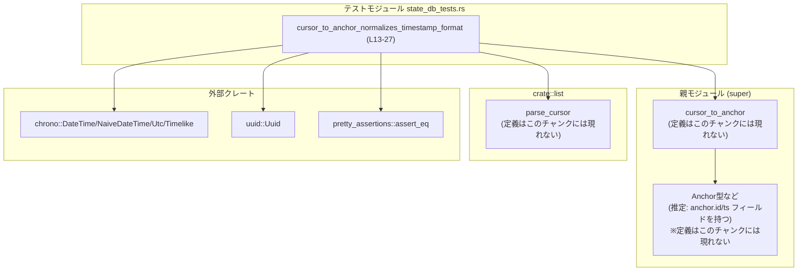
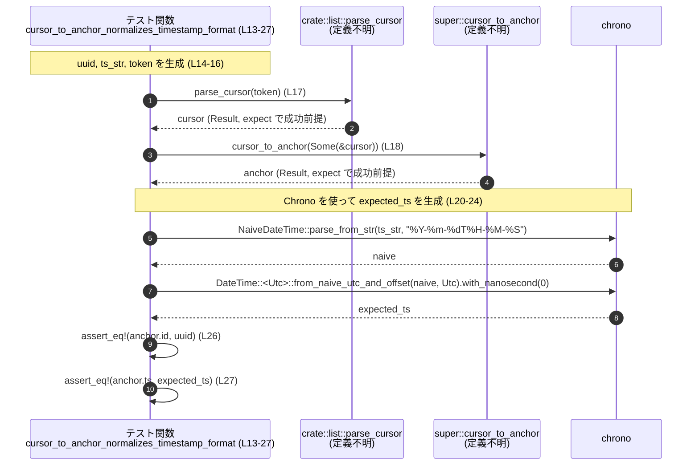

rollout/src/state_db_tests.rs

---

## 0. ざっくり一言

`cursor_to_anchor` 関数が、カーソル文字列に含まれるタイムスタンプを一定のフォーマット（ナノ秒 0 の `DateTime<Utc>`）に正規化していることを検証する単体テストを 1 本だけ定義しているファイルです（`state_db_tests.rs:L12-27`）。

---

## 1. このモジュールの役割

### 1.1 概要

- このテストモジュールは、**カーソル文字列 → アンカー構造体** への変換処理（`cursor_to_anchor`）において、  
  タイムスタンプのフォーマットが期待どおりに正規化されることを検証します（`state_db_tests.rs:L13-24`）。
- 具体的には、`"2026-01-27T12-34-56|<uuid>"` 形式のトークンから生成されるアンカーの
  - `id` フィールドが元の `Uuid`
  - `ts` フィールドがナノ秒 0 の `DateTime<Utc>`
  になっていることを確認します（`state_db_tests.rs:L14-24, L26-27`）。

### 1.2 アーキテクチャ内での位置づけ

このファイルは、親モジュール（`super`）で定義されている `cursor_to_anchor` と、`crate::list::parse_cursor` に依存するテスト専用モジュールです（`state_db_tests.rs:L3-4, L18`）。

依存関係を簡略化して図示すると、以下のようになります。



### 1.3 設計上のポイント

コードから読み取れる設計上の特徴は次のとおりです。

- **責務の分離**
  - 実際の変換ロジックは `cursor_to_anchor` および `parse_cursor` にあり、本ファイルはその挙動を確認するテストのみを持ちます（`state_db_tests.rs:L3-4, L13-18`）。
- **状態を持たない**
  - グローバルな状態や構造体は定義されておらず、テスト関数内のローカル変数だけで完結しています（`state_db_tests.rs:L13-27`）。
- **エラーハンドリング方針**
  - テスト内では `expect` を用いて `Result` のエラーを即座にパニックに変換し、「パースが成功すること」を前提条件として明示しています（`state_db_tests.rs:L17-18, L21`）。
- **タイムスタンプの正規化に着目**
  - `NaiveDateTime::parse_from_str` と `DateTime::<Utc>::from_naive_utc_and_offset`、さらに `.with_nanosecond(0)` を使って期待値を構成し、それと `anchor.ts` を比較しています。
  - これにより、「ナノ秒が 0 に正規化されること」が契約として暗黙に定義されています（`state_db_tests.rs:L20-24, L27`）。
- **並行性**
  - 本ファイル内でスレッドや `async` は一切使用されておらず、並行処理に関する考慮は不要です。

---

## コンポーネントインベントリー

このチャンクに現れる関数・外部依存の一覧です。

| 名前 | 種別 | 定義 or 利用 | 位置 | 役割 / 説明 |
|------|------|--------------|------|-------------|
| `cursor_to_anchor_normalizes_timestamp_format` | 関数（テスト） | 定義 | `state_db_tests.rs:L12-27` | `cursor_to_anchor` がタイムスタンプを正規化していることを検証する単体テスト |
| `cursor_to_anchor` | 関数 | 利用 | `state_db_tests.rs:L18` | カーソルオブジェクトからアンカー（`anchor`）を生成する関数。定義はこのチャンクには現れません |
| `parse_cursor` | 関数 | 利用 | `state_db_tests.rs:L4, L17` | `"timestamp|uuid"` 形式のトークン文字列をカーソル型にパースする関数。定義はこのチャンクには現れません |
| `Uuid::new_v4` | 関数 | 利用 | `state_db_tests.rs:L14` | ランダムな v4 UUID を生成します |
| `NaiveDateTime::parse_from_str` | 関数 | 利用 | `state_db_tests.rs:L20-21` | タイムゾーン情報を持たない日時文字列を `NaiveDateTime` にパースします |
| `DateTime::<Utc>::from_naive_utc_and_offset` | 関数 | 利用 | `state_db_tests.rs:L22` | `NaiveDateTime` を UTC タイムゾーン付き `DateTime<Utc>` に変換します |
| `Timelike::with_nanosecond` | メソッド | 利用 | `state_db_tests.rs:L22-24` | `DateTime` のナノ秒を指定した値に変更した新しい日時を返します |
| `assert_eq!` | マクロ | 利用 | `state_db_tests.rs:L26-27` | 2 つの値が等しいことを検証し、異なればテストを失敗させます |

※ `anchor` の具体的な型定義はこのチャンクには現れませんが、`anchor.id` と `anchor.ts` フィールドが存在することが分かります（`state_db_tests.rs:L26-27`）。

---

## 2. 主要な機能一覧

このファイルが提供する主要な機能は、テスト 1 件です。

- `cursor_to_anchor_normalizes_timestamp_format`:  
  `"2026-01-27T12-34-56|<uuid>"` というトークンから生成されるアンカーが、
  - `id` は元の `Uuid`
  - `ts` はナノ秒 0 の `DateTime<Utc>`
  になっていることを検証します（`state_db_tests.rs:L14-24, L26-27`）。

---

## 3. 公開 API と詳細解説

### 3.1 型一覧（構造体・列挙体など）

このファイル内で新たに定義されている公開型（構造体・列挙体など）はありません。

- 変数 `anchor` の具体的な型はこのチャンクには現れませんが、
  - `anchor.id` が `Uuid` と比較されていることから、`PartialEq<Uuid>` を実装している型であること（`state_db_tests.rs:L26`）
  - `anchor.ts` が `DateTime<Utc>` と比較されていることから、`PartialEq<DateTime<Utc>>` を実装している型であること（`state_db_tests.rs:L27`）
  が分かります。

### 3.2 関数詳細（テスト関数）

#### `cursor_to_anchor_normalizes_timestamp_format()`

**概要**

- `parse_cursor` と `cursor_to_anchor` を組み合わせたときに、タイムスタンプのフォーマットが正規化されることを検証するテストです（`state_db_tests.rs:L13-24`）。
- `"2026-01-27T12-34-56|<uuid>"` というトークンから生成したアンカーの `id` と `ts` が、期待どおりの値と一致することをチェックします（`state_db_tests.rs:L14-24, L26-27`）。

**引数**

- テスト関数なので引数はありません（`state_db_tests.rs:L13`）。

**戻り値**

- 戻り値の型はユニット型 `()` です（Rust のテスト関数は通常 `()` を返します）。

**内部処理の流れ（アルゴリズム）**

1. ランダムな UUID を生成する（`Uuid::new_v4`）（`state_db_tests.rs:L14`）。
2. `"2026-01-27T12-34-56"` というタイムスタンプ文字列を定義する（`state_db_tests.rs:L15`）。
3. `"{ts_str}|{uuid}"` 形式のトークン文字列を組み立てる（`state_db_tests.rs:L16`）。
4. `parse_cursor` を使ってトークン文字列をカーソル型にパースし、`expect` でパース成功を前提にする（`state_db_tests.rs:L17`）。
5. `cursor_to_anchor` を呼び出して、オプションでカーソルを渡し、アンカーを生成する。ここでも `expect` で成功を前提にする（`state_db_tests.rs:L18`）。
6. 同じタイムスタンプ文字列 `ts_str` を `NaiveDateTime::parse_from_str` でパースし、`DateTime::<Utc>::from_naive_utc_and_offset` で UTC タイムゾーン付きに変換する（`state_db_tests.rs:L20-22`）。
7. `.with_nanosecond(0)` でナノ秒を 0 にした日時を期待値 `expected_ts` として得る（`state_db_tests.rs:L22-24`）。
8. `assert_eq!` で `anchor.id` が `uuid` と等しいことを検証する（`state_db_tests.rs:L26`）。
9. `assert_eq!` で `anchor.ts` が `expected_ts` と等しいことを検証する（`state_db_tests.rs:L27`）。

処理フローを簡略なフローチャートで示すと次のようになります。

```mermaid
flowchart TD
    A["start テスト (L13)"] --> B["Uuid::new_v4() で uuid 生成 (L14)"]
    B --> C["ts_str = \"2026-01-27T12-34-56\" (L15)"]
    C --> D["token = format!(\"{ts_str}|{uuid}\") (L16)"]
    D --> E["cursor = parse_cursor(token) ? (L17)"]
    E --> F["anchor = cursor_to_anchor(Some(&cursor)) ? (L18)"]
    F --> G["naive = NaiveDateTime::parse_from_str(ts_str) (L20-21)"]
    G --> H["expected_ts = DateTime::<Utc>::from_naive_utc_and_offset(naive, Utc).with_nanosecond(0) (L22-24)"]
    H --> I["assert_eq!(anchor.id, uuid) (L26)"]
    I --> J["assert_eq!(anchor.ts, expected_ts) (L27)"]
    J --> K["end"]
```

**Examples（使用例）**

このテスト関数自体が、`parse_cursor` と `cursor_to_anchor` の代表的な使用例になっています。

```rust
// ランダムな UUID を生成する                         // ランダムな v4 UUID を生成
let uuid = Uuid::new_v4();                              // state_db_tests.rs:L14

// タイムスタンプ文字列を用意する                    // "YYYY-MM-DDTHH-MM-SS" 形式
let ts_str = "2026-01-27T12-34-56";                    // state_db_tests.rs:L15

// "timestamp|uuid" 形式のトークンを組み立てる        // カーソル用のトークン文字列
let token = format!("{ts_str}|{uuid}");                // state_db_tests.rs:L16

// 文字列トークンをカーソル型にパースする             // parse_cursor は Result を返す前提
let cursor = parse_cursor(token.as_str())              // state_db_tests.rs:L17
    .expect("cursor should parse");

// カーソルからアンカーを生成する                     // cursor_to_anchor も Result を返す前提
let anchor = cursor_to_anchor(Some(&cursor))           // state_db_tests.rs:L18
    .expect("anchor should parse");
```

このコードにより、`cursor` と `anchor` がどのように生成されるかの基本的な呼び出し順が分かります。

**Errors / Panics**

この関数はテスト関数なので、エラーはすべてパニックとして扱われます。具体的には次の条件でパニックが発生します。

- `parse_cursor(token.as_str())` が `Err` を返す場合  
  → `expect("cursor should parse")` によりパニック（`state_db_tests.rs:L17`）。
- `cursor_to_anchor(Some(&cursor))` が `Err` を返す場合  
  → `expect("anchor should parse")` によりパニック（`state_db_tests.rs:L18`）。
- `NaiveDateTime::parse_from_str(ts_str, "%Y-%m-%dT%H-%M-%S")` がエラーを返す場合  
  → `expect("ts should parse")` によりパニック（`state_db_tests.rs:L20-21`）。
- `.with_nanosecond(0)` が `None` を返す場合  
  → `expect("nanosecond")` によりパニック（`state_db_tests.rs:L22-24`）。
- `anchor.id != uuid`、または `anchor.ts != expected_ts` の場合  
  → `assert_eq!` によりテスト失敗（`state_db_tests.rs:L26-27`）。

**Edge cases（エッジケース）**

このテストは特定の正常系のみを扱っています。以下のようなケースは、このチャンクのコードからは挙動が分かりません（いずれも本テストではカバーされていません）。

- `ts_str` のフォーマットが `%Y-%m-%dT%H-%M-%S` から外れる場合
- `token` に `|` 区切りが含まれない、あるいは UUID 部分が不正な文字列である場合
- `cursor_to_anchor` に `None` を渡した場合（このテストでは常に `Some(&cursor)` を渡しています: `state_db_tests.rs:L18`）

本テストから読み取れるのは、「上記の前提が満たされているときに、`anchor.ts` のナノ秒が 0 に正規化されていること」です。

**使用上の注意点**

- テストコード内では `expect` と `assert_eq!` を多用しており、異常系はすべてパニックとして扱われます（`state_db_tests.rs:L17-18, L20-24, L26-27`）。
  - アプリケーション本体で同様の処理を行う場合は、`Result` を適切に伝播させるなど、より穏当なエラーハンドリングが必要です。
- `ts_str` のフォーマットを変更した場合（例: コロン区切り `"2026-01-27T12:34:56"` にするなど）は、`parse_from_str` のフォーマット指定子も合わせて変更する必要があります（`state_db_tests.rs:L15, L20-21`）。
- 並行性・スレッド安全性に関する特別な注意点は、このテストコードには見当たりません。

### 3.3 その他の関数

このファイル内で定義されている関数は、上記のテスト関数 1 つのみです。補助的な関数やラッパー関数は存在しません。

---

## 4. データフロー

### 4.1 代表的な処理シナリオ

このファイルにおける主要なデータフローは、「カーソル文字列 → カーソルオブジェクト → アンカーオブジェクト → 検証」です。

- 入力: タイムスタンプと UUID から構成された文字列トークン `"2026-01-27T12-34-56|<uuid>"`（`state_db_tests.rs:L14-16`）
- 中間: `parse_cursor` によるカーソルオブジェクト、`cursor_to_anchor` によるアンカーオブジェクト（`state_db_tests.rs:L17-18`）
- 出力: アンカーの `id` と `ts` が期待値と一致しているかどうか（`state_db_tests.rs:L26-27`）

これをシーケンス図として示します。



この図から、「`cursor_to_anchor` の出力 `anchor.ts` は、`ts_str` を chrono でパース・正規化した結果と一致するはず」という契約がテストで確認されていることが分かります。

---

## 5. 使い方（How to Use）

### 5.1 基本的な使用方法

このファイル自体はテスト専用であり、通常は `cargo test` から実行されます。

代表的な実行方法:

```bash
# プロジェクト全体のテストを実行
cargo test

# このテスト関数だけを実行
cargo test cursor_to_anchor_normalizes_timestamp_format
```

テストの中身は、`parse_cursor` と `cursor_to_anchor` を次のようなフローで利用しています（`state_db_tests.rs:L14-18`）。

```rust
// UUID を生成                                  // Uuid::new_v4 でランダムな UUID を生成
let uuid = Uuid::new_v4();

// タイムスタンプ文字列を用意                  // "YYYY-MM-DDTHH-MM-SS" 形式
let ts_str = "2026-01-27T12-34-56";

// カーソルトークンを組み立てる                 // "{timestamp}|{uuid}" 形式
let token = format!("{ts_str}|{uuid}");

// トークンをカーソルにパース                   // parse_cursor は Result を返す前提
let cursor = parse_cursor(token.as_str())
    .expect("cursor should parse");

// カーソルからアンカーを生成                   // cursor_to_anchor も Result を返す前提
let anchor = cursor_to_anchor(Some(&cursor))
    .expect("anchor should parse");
```

### 5.2 よくある使用パターン

このチャンクのコードから読み取れる「想定されている使用パターン」は次のとおりです。

1. **文字列トークンからカーソルとアンカーを復元する**

   - トークン形式: `"タイムスタンプ|UUID"`（`state_db_tests.rs:L16`）
   - タイムスタンプのフォーマット: `%Y-%m-%dT%H-%M-%S`（`state_db_tests.rs:L15, L20-21`）

   ```rust
   // token から cursor を得て、さらに anchor を得るパターン
   let cursor = parse_cursor(token.as_str())      // "timestamp|uuid" 形式
       .expect("cursor should parse");

   let anchor = cursor_to_anchor(Some(&cursor))   // Option で包んで渡す
       .expect("anchor should parse");
   ```

2. **日時の期待値を chrono で構築する**

   - `NaiveDateTime` でパース → `DateTime<Utc>` に変換 → ナノ秒を 0 に正規化（`state_db_tests.rs:L20-24`）。

   ```rust
   let naive = NaiveDateTime::parse_from_str(
       ts_str,
       "%Y-%m-%dT%H-%M-%S",                      // ts_str と対応するフォーマット
   ).expect("ts should parse");

   let expected_ts = DateTime::<Utc>::from_naive_utc_and_offset(naive, Utc)
       .with_nanosecond(0)                      // ナノ秒を 0 に設定
       .expect("nanosecond");
   ```

### 5.3 よくある間違い

このチャンクのコードから推測できる、誤用の例とその影響を示します。

```rust
// 誤り例: トークン形式がテスト前提と異なる
let token = format!("{uuid}|{ts_str}"); // "uuid|timestamp" の順
let cursor = parse_cursor(token.as_str())
    .expect("cursor should parse");     // ← parse_cursor が Err を返す場合、ここでパニック
```

```rust
// 正しい例: テストコードと同じ "{timestamp}|{uuid}" の順序を守る
let token = format!("{ts_str}|{uuid}");
let cursor = parse_cursor(token.as_str())
    .expect("cursor should parse");
```

- このテストが前提としているのは、トークンが `"timestamp|uuid"` の順序で構成されていることです（`state_db_tests.rs:L16`）。
- フォーマットや順序を変えた場合の挙動そのものは `parse_cursor` の実装次第であり、このチャンクには現れませんが、このテストと同じ書き方（`expect`）をしていると、`Result::Err` が返った時点でパニックになることは確実です（`state_db_tests.rs:L17`）。

### 5.4 使用上の注意点（まとめ）

- **フォーマット前提**
  - `ts_str` は `%Y-%m-%dT%H-%M-%S` 形式を前提としており、これが変わると `NaiveDateTime::parse_from_str` が失敗します（`state_db_tests.rs:L15, L20-21`）。
- **トークン形式前提**
  - `token` は `"{ts_str}|{uuid}"` 形式であることが前提です（`state_db_tests.rs:L16`）。
- **エラーハンドリング**
  - テストでは `expect` によるパニックベースのエラーハンドリングしか行っていません。  
    本番コードでは `Result` を呼び出し元に返すなど、より安全な扱いが望ましいです（`state_db_tests.rs:L17-18, L20-24`）。
- **並行性**
  - このテストは同期コードのみで構成されており、スレッドや非同期処理は使用していません。  
    並行環境での振る舞いは、このファイルからは読み取れません。

---

## 6. 変更の仕方（How to Modify）

### 6.1 新しい機能（テストケース）を追加する場合

このファイルに新たなテストケースを追加する場合の手順の一例です。

1. **新しいフォーマットや条件を決める**
   - 例: 別のタイムスタンプフォーマット、別の日付、あるいは秒未満の精度など。
2. **テスト関数を追加する**
   - `#[test]` 属性を付けて、新しい関数を定義します（`state_db_tests.rs:L12` を参考）。
3. **入力トークンを構築する**
   - 新しい `ts_str` と `Uuid` を用いて `format!("{ts_str}|{uuid}")` 形式のトークンを生成します（`state_db_tests.rs:L14-16`）。
4. **期待値の日時を chrono で構築する**
   - `NaiveDateTime::parse_from_str` のフォーマット文字列を、テストしたいフォーマットに合わせて変更します（`state_db_tests.rs:L20-21`）。
5. **`cursor_to_anchor` の出力との一致を `assert_eq!` で検証する**
   - `anchor.id` と `anchor.ts`（またはその他のフィールド）について期待値と比較します（`state_db_tests.rs:L26-27`）。

### 6.2 既存の機能を変更する場合

`cursor_to_anchor` の仕様変更に伴い、このテストを変更する場合に注意すべき点です。

- **タイムスタンプ精度の変更**
  - もし `cursor_to_anchor` がナノ秒まで保持する仕様に変わった場合、`.with_nanosecond(0)` を外し、期待値の構築方法を変更する必要があります（`state_db_tests.rs:L22-24`）。
- **トークン形式の変更**
  - `"timestamp|uuid"` 以外の形式に変える場合、トークンの組み立て方と `parse_cursor` の呼び出しを更新する必要があります（`state_db_tests.rs:L16-17`）。
- **Option の扱い**
  - `cursor_to_anchor` が `Option` ではなく直接カーソルを受け取る API に変わる場合、`Some(&cursor)` を撤去し、引数の形を合わせる必要があります（`state_db_tests.rs:L18`）。
- **テストの契約（Contracts）の維持**
  - `anchor.id` が `Uuid` と等しいこと、`anchor.ts` が `DateTime<Utc>` と等しいこと、などの契約が変わる場合は、このテストもそれに合わせて更新する必要があります（`state_db_tests.rs:L26-27`）。

変更後は `cargo test` を実行し、このテストが意図したとおりに成功・失敗することを確認することが重要です。

---

## 7. 関連ファイル

このモジュールと密接に関係する外部モジュール・関数です（コードから読み取れる範囲）。

| パス / モジュール | 役割 / 関係 |
|------------------|------------|
| `super` モジュール | `cursor_to_anchor` 関数や `anchor` 型など、本テストが対象とする実装が含まれていると考えられます（`state_db_tests.rs:L3, L18, L26-27`）。具体的なファイルパスはこのチャンクには現れません。 |
| `crate::list` モジュール | `parse_cursor` 関数を提供し、カーソル文字列を内部表現に変換する役割を持ちます（`state_db_tests.rs:L4, L17`）。 |
| 外部クレート `chrono` | 日時型 `NaiveDateTime`, `DateTime<Utc>` と、そのパース・変換ロジックを提供します（`state_db_tests.rs:L5-8, L20-24`）。 |
| 外部クレート `uuid` | UUID 型と `Uuid::new_v4` を提供します（`state_db_tests.rs:L10, L14`）。 |
| 外部クレート `pretty_assertions` | 視認性の高い差分を表示する `assert_eq!` マクロを提供します（`state_db_tests.rs:L9, L26-27`）。 |

---

## Bugs / Security / Performance の観点（まとめ）

- **Bugs**
  - テストは固定の日時文字列とランダム UUID を使用しており、実行時の環境に依存する要素はありません。そのため、テストが不安定になる要因は見当たりません（`state_db_tests.rs:L14-16`）。
  - `with_nanosecond(0)` が `None` を返す可能性は非常に低いですが、その場合にはテストがパニックするようになっています（`state_db_tests.rs:L22-24`）。
- **Security**
  - 入力はコード内で固定されたリテラルとランダム UUID のみであり、外部からの入力を扱っていません。直接的なセキュリティ上の懸念はありません。
- **Performance / Scalability**
  - テスト 1 件のみで、実行されるのも UUID 生成と日時パース程度です。パフォーマンスやスケーラビリティ上の問題はありません。

このファイルはあくまで「`cursor_to_anchor` のタイムスタンプ正規化契約を検証するための小さな単体テスト」であり、その役割に限定して理解・利用すると安全です。
