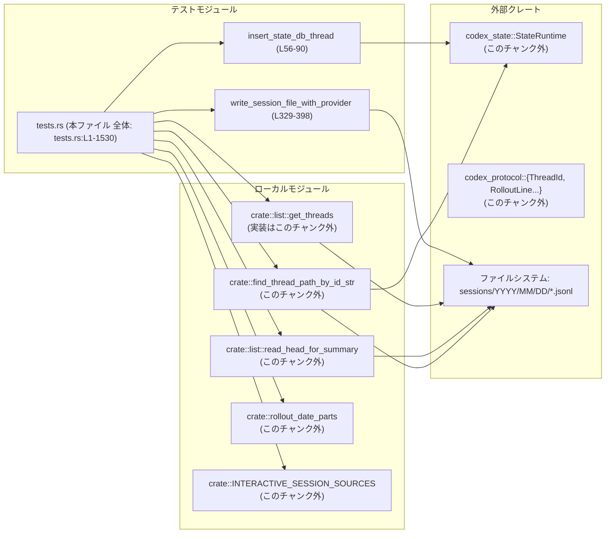

# rollout/src/tests.rs コード解説

## 0. ざっくり一言

`rollout/src/tests.rs` は、**会話スレッド（rollout セッション）一覧 API とメタデータ処理の挙動を検証する統合テスト群**です。  
一時ディレクトリ上に JSONL 形式のセッションファイルを生成し、`get_threads` や `find_thread_path_by_id_str` などの公開 API の契約をテストで固定しています。

---

## 1. このモジュールの役割

### 1.1 概要

このモジュールは、主に次の問題をテストで検証しています。

- **スレッド一覧取得 API (`get_threads`) の動作**  
  - 作成日時 / 更新日時順ソート  
  - カーソル付きページネーション  
  - ソースフィルタ (`SessionSource`) とモデルプロバイダフィルタ  
  - `updated_at` がファイル mtime に基づくこと
- **スレッド ID からファイルパスを解決する API (`find_thread_path_by_id_str`) の挙動**  
  - state DB のパスが古い・欠損している場合のファイルシステム fallback と自己修復
- **セッションメタ情報読み出し (`read_head_for_summary` / `rollout_date_parts`) の契約**  
  - ファイル名から年月日を抽出  
  - `base_instructions` フィールドのデフォルト値 / 保持

これらを確認するために、テスト専用の JSONL ファイル生成ヘルパーと state DB へのセットアップヘルパーを提供しています。

### 1.2 アーキテクチャ内での位置づけ

このファイルは「テストコード」であり、アプリ本体のロジックは他モジュールにあります。依存関係を簡略化すると次のようになります。



- 本ファイルは **テスト専用のコンポーネント** であり、実際のビジネスロジックは `crate::list` や `codex_state`、`codex_protocol` に存在します（実装はこのチャンクには現れません）。

### 1.3 設計上のポイント

コード上から読み取れる特徴を列挙します。

- **責務の分割**
  - セッションファイル作成ロジックは `write_session_file_*` 系ヘルパーに集約（tests.rs:L312-398, L400-497）。
  - state DB の準備は `insert_state_db_thread` / `assert_state_db_rollout_path` に分離（tests.rs:L56-90, L297-310）。
  - 各テストは「1 つの機能シナリオ」を検証する構成になっています（例: ページネーション、フィルタ、mtime 利用など）。

- **状態管理**
  - すべてのテストは `tempfile::TempDir` を使用し、一時ディレクトリ下で完結するため、テスト同士がファイルを共有しません（例: tests.rs:L501-503, L632-633）。
  - state DB も `home`（一時ディレクトリ）配下に作られるため、テストごとに独立した状態を持ちます（tests.rs:L62-64, L272-274）。

- **エラーハンドリング**
  - テストでは `unwrap` / `expect` を多用し、エラーは即座にテスト失敗として扱う方針です（冒頭の `#![allow(...unwrap_used...)]` により lint を抑制, tests.rs:L1-2）。
  - 一部のテストは `anyhow::Result<()>` を返し、`?` 演算子でエラーを伝播させています（tests.rs:L1064-1115, L1117-1207, L1430-1530）。

- **並行性 / 非同期**
  - 多くのテストは `#[tokio::test]` で定義され、内部で `async` 関数 (`get_threads`, `StateRuntime::init` など) を `.await` しています（例: tests.rs:L219, L499, L630）。
  - ファイル I/O と state DB I/O はすべて非同期 API から呼ばれており、Rust の async/await パターンに従っています。

---

## 2. コンポーネント一覧と主要な機能

### 2.1 このファイル内の関数インベントリー

| 名前 | 種別 | async | 役割 / 概要 | 根拠 |
|------|------|-------|-------------|------|
| `provider_vec` | ヘルパー | いいえ | `&[&str]` を `Vec<String>` に変換（プロバイダフィルタ用） | tests.rs:L45-50 |
| `thread_id_from_uuid` | ヘルパー | いいえ | `Uuid` から `ThreadId` を生成 | tests.rs:L52-54 |
| `insert_state_db_thread` | ヘルパー | はい | state DB にスレッドメタデータを挿入（archived フラグ対応） | tests.rs:L56-90 |
| `find_thread_path_falls_back_when_db_path_is_stale` | テスト | はい (`#[tokio::test]`) | DB 内パスが不正なとき、ファイルシステムを使って修復する挙動を検証 | tests.rs:L219-252 |
| `find_thread_path_repairs_missing_db_row_after_filesystem_fallback` | テスト | はい | DB に行がない場合の fallback と修復を検証 | tests.rs:L255-285 |
| `rollout_date_parts_extracts_directory_components` | テスト | いいえ (`#[test]`) | `rollout-YYYY-MM-DD...` 形式ファイル名から年・月・日を抽出することを検証 | tests.rs:L287-295 |
| `assert_state_db_rollout_path` | ヘルパー | はい | state DB に保存された rollout パスが期待通りか検証 | tests.rs:L297-310 |
| `write_session_file` | ヘルパー | いいえ | 標準的なテスト用セッションファイル (JSONL) を作成 | tests.rs:L312-327 |
| `write_session_file_with_provider` | ヘルパー | いいえ | モデルプロバイダを指定してセッションファイルを作成 | tests.rs:L329-398 |
| `write_session_file_with_delayed_user_event` | ヘルパー | いいえ | `session_meta` が複数行続いた後に user イベントが出るファイルを作成 | tests.rs:L400-455 |
| `write_session_file_with_meta_payload` | ヘルパー | いいえ | 任意のメタ payload を持つセッションファイルを作成 | tests.rs:L457-497 |
| `test_list_conversations_latest_first` | テスト | はい | `get_threads` が最新セッションから返すことを検証 | tests.rs:L499-628 |
| `test_pagination_cursor` | テスト | はい | `get_threads` のカーソル付きページネーションを検証 | tests.rs:L630-862 |
| `test_list_threads_scans_past_head_for_user_event` | テスト | はい | user イベントが先頭から離れていても thread_id が取得できることを検証 | tests.rs:L864-889 |
| `test_get_thread_contents` | テスト | はい | 1 スレッドの `ThreadsPage` とファイル内容が期待通りであることを検証 | tests.rs:L891-977 |
| `test_base_instructions_missing_in_meta_defaults_to_null` | テスト | はい | メタに `base_instructions` がない場合に `Null` が補われることを検証 | tests.rs:L979-1017 |
| `test_base_instructions_present_in_meta_is_preserved` | テスト | はい | 既に存在する `base_instructions` はそのまま保持されることを検証 | tests.rs:L1020-1062 |
| `test_created_at_sort_uses_file_mtime_for_updated_at` | テスト | はい（`Result<()>`） | `ThreadSortKey::CreatedAt` でも `updated_at` がファイル mtime に基づくことを検証 | tests.rs:L1064-1115 |
| `test_updated_at_uses_file_mtime` | テスト | はい（`Result<()>`） | `ThreadSortKey::UpdatedAt` ソート時に mtime が `updated_at` として使われることを検証 | tests.rs:L1117-1207 |
| `test_stable_ordering_same_second_pagination` | テスト | はい | 同一秒に作成されたスレッドの安定ソートとカーソル動作を検証 | tests.rs:L1209-1354 |
| `test_source_filter_excludes_non_matching_sessions` | テスト | はい | `SessionSource` フィルタが CLI/Exec を適切にフィルタリングすることを検証 | tests.rs:L1356-1427 |
| `test_model_provider_filter_selects_only_matching_sessions` | テスト | はい（`Result<()>`） | モデルプロバイダフィルタの挙動（`Some` / `None` / 未知プロバイダ）を検証 | tests.rs:L1429-1530 |

※ コメントアウトされた古いテストも存在しますが（tests.rs:L92-217）、`//` で無効化されており、ここでは除外しています。

### 2.2 主な機能（テスト観点）

- スレッドパス解決
  - DB が持つ rollout パスが古い場合でも、実ファイルシステムから正しいパスを見つけて DB を修正する（tests.rs:L219-252）。
  - DB に行がない場合もファイルから復旧し、以降は DB から解決できるようにする（tests.rs:L255-285）。

- セッションファイル生成
  - `session_meta` 行 + `user_message` イベント + 任意件数のレスポンス行を JSONL 形式で生成（tests.rs:L329-398）。
  - mtime（更新時刻）を明示的に設定し、`updated_at` のテストに利用（tests.rs:L395-396, L452-453）。

- スレッド一覧取得 (`get_threads`) の挙動
  - **作成日時降順**で返すこと（tests.rs:L499-628）。
  - カーソル付きページネーションで、重複なく全件を辿れること（tests.rs:L630-862）。
  - `ThreadSortKey::CreatedAt` / `UpdatedAt` に応じて `updated_at` の意味が正しく反映されること（tests.rs:L1064-1115, L1117-1207）。

- フィルタリング
  - `INTERACTIVE_SESSION_SOURCES` に基づき、インタラクティブなセッションのみを抽出する（tests.rs:L1356-1427）。
  - モデルプロバイダフィルタにより、`model_provider` が一致するもの、あるいは未設定（`None`）の扱いを制御（tests.rs:L1434-1461, L1463-1483）。

- メタ情報の扱い
  - `rollout_date_parts` でファイル名から年月日が正しく取り出せること（tests.rs:L287-295）。
  - `read_head_for_summary` で、`base_instructions` が未設定なら `Null` になること、設定済みならその値を保持すること（tests.rs:L979-1017, L1020-1062）。
  - `get_threads` がユーザーメッセージの位置（ファイル先頭から離れていても）を正しく解釈し、`thread_id` を取得できること（tests.rs:L864-889）。

---

## 3. 公開 API と詳細解説

### 3.1 型一覧（このファイル内で主に利用する外部型）

このファイル自身には新しい構造体・列挙体の定義はありませんが、テスト対象として次の外部型を多用しています。

| 名前 | 種別 | 定義元 / 利用箇所 | 役割 / 用途 |
|------|------|-------------------|-------------|
| `ThreadsPage` | 構造体 | `crate::list::ThreadsPage`（利用例: tests.rs:L571-625） | スレッド一覧結果。`items: Vec<ThreadItem>`, `next_cursor`, `num_scanned_files` などを持つページング結果。 |
| `ThreadItem` | 構造体 | `crate::list::ThreadItem`（利用例: tests.rs:L571-620） | 個々のスレッドのメタ情報 (`path`, `thread_id`, `first_user_message`, `created_at`, `updated_at` など)。 |
| `Cursor` | 型（構造体または型エイリアス） | `crate::list::Cursor`（利用例: tests.rs:L710-712, L778-779） | ページネーション用カーソル。テストから `"timestamp|uuid"` 形式の文字列にシリアライズされることが分かります。 |
| `ThreadSortKey` | 列挙体 | `crate::list::ThreadSortKey`（利用例: tests.rs:L540, L689, L757, L825） | 一覧ソートキー。`CreatedAt`, `UpdatedAt` などを指定。 |
| `ThreadId` | 型 | `codex_protocol::ThreadId`（利用例: tests.rs:L31-31, L224-225） | スレッド固有 ID。`Uuid` から `from_string` で生成。 |
| `SessionSource` | 列挙体 | `codex_protocol::protocol::SessionSource`（利用例: tests.rs:L39, L515, L1369） | セッションの発生元（`VSCode`, `Cli`, `Exec` など）。フィルタの対象。 |
| `RolloutLine`, `RolloutItem`, `SessionMeta`, `SessionMetaLine`, `EventMsg`, `UserMessageEvent`, `ContentItem`, `ResponseItem` | 構造体 / 列挙体 | `codex_protocol::protocol` / `models`（利用例: tests.rs:L1130-1179） | rollout JSONL 一行分の型群。テストでは直列化してファイルに書き込み、`get_threads` のパース対象となる。 |

> これらの型の正確な中身（フィールド構成）は、このチャンクには現れませんが、テストコードから上記のような役割が読み取れます。

### 3.2 重要関数詳細（7件）

ここでは、このテストファイル内で **契約を強く規定している** 重要ヘルパー／テストを詳しく説明します。

---

#### `write_session_file_with_provider(root: &Path, ts_str: &str, uuid: Uuid, num_records: usize, source: Option<SessionSource>, model_provider: Option<&str>) -> std::io::Result<(OffsetDateTime, Uuid)>`  

（tests.rs:L329-398）

**概要**

- テスト用の **セッションファイル（rollout-...jsonl）を 1 ファイル生成** します。
- 1 行目に `session_meta`、2 行目に `user_message` イベント、その後に `num_records` 個の簡易レスポンスを JSONL 形式で出力します。
- ファイルの **mtime（更新時刻）をセッションのタイムスタンプに設定** します。

**引数**

| 引数名 | 型 | 説明 |
|--------|----|------|
| `root` | `&Path` | セッションルートディレクトリ（例: テスト内の `home`）。 |
| `ts_str` | `&str` | `"YYYY-MM-DDTHH-MM-SS"` 形式のタイムスタンプ文字列（tests.rs:L337-341）。 |
| `uuid` | `Uuid` | セッション ID として使う UUID。ファイル名・payload 両方に埋め込みます（tests.rs:L349-355）。 |
| `num_records` | `usize` | 出力するレスポンスレコード数。0 の場合はレスポンス行が出ません（tests.rs:L388-394）。 |
| `source` | `Option<SessionSource>` | セッションの `source`。`Some` の場合、JSON payload に追加されます（tests.rs:L362-364）。 |
| `model_provider` | `Option<&str>` | `model_provider` フィールド。`Some` の場合文字列として追加（tests.rs:L365-367）。 |

**戻り値**

- `Ok((dt, uuid))`  
  - `dt`: ファイルのベースとなる `OffsetDateTime`（`ts_str` を UTC として解釈, tests.rs:L339-341）。  
  - `uuid`: 引数で渡された UUID をそのまま返却。
- `Err(e)`  
  - ディレクトリ作成やファイル書き込み、mtime 設定が失敗した場合の I/O エラー。

**内部処理の流れ**

1. `ts_str` を `PrimitiveDateTime::parse` でパースし、UTC に変換（tests.rs:L337-341）。
2. `root/sessions/YYYY/MM/DD` ディレクトリを生成（tests.rs:L342-347）。
3. `rollout-{ts_str}-{uuid}.jsonl` というファイル名でファイルを作成（tests.rs:L349-351）。
4. `payload` オブジェクトを作成。`base_instructions` を明示的に `null` に初期化（tests.rs:L353-360）。
5. `source` と `model_provider` が `Some` の場合、それぞれ payload に追加（tests.rs:L362-367）。
6. `meta` 行（`type: "session_meta"`）として 1 行書き込み（tests.rs:L369-375）。
7. `user_message` イベント行を 1 行書き込み（tests.rs:L377-386）。
8. `0..num_records` で単純な `"record_type": "response"` 行を追加（tests.rs:L388-394）。
9. `FileTimes::new().set_modified(dt.into())` で mtime を `dt` に設定（tests.rs:L395-396）。

**Examples（使用例）**

テスト内での典型的な呼び出し（tests.rs:L643-682）:

```rust
let u1 = Uuid::from_u128(11);                             // 固定 UUID
write_session_file(
    home,                                                 // &Path: 一時ディレクトリ
    "2025-03-01T09-00-00",                                // タイムスタンプ
    u1,                                                   // UUID
    /*num_records*/ 1,                                    // レスポンス 1件
    Some(SessionSource::VSCode),                          // VSCode からのセッション
).unwrap();
```

`write_session_file` 自体は `write_session_file_with_provider(..., Some("test-provider"))` を呼ぶ薄いラッパーです（tests.rs:L312-327）。

**Errors / Panics**

- `std::io::Result` を返しており、ファイル I/O に失敗すると `Err` になります（tests.rs:L347, L351, L374, L386, L393, L396）。
- テスト側はすべて `unwrap()` で使用しているため（tests.rs:L517, L651 など）、実行時エラーはテスト失敗となります。

**Edge cases（エッジケース）**

- `num_records == 0` の場合、レスポンス行が 1 行も出力されません（tests.rs:L388-394）。  
  → `test_created_at_sort_uses_file_mtime_for_updated_at` などで利用されています（tests.rs:L1071-1078）。
- `source == None` の場合、JSON `payload` に `source` フィールドは含まれません（tests.rs:L362-364）。
- `model_provider == None` の場合、`model_provider` フィールドは含まれません（tests.rs:L365-367）。  
  → `test_model_provider_filter_selects_only_matching_sessions` で「未設定の場合の扱い」のテストに利用（tests.rs:L1454-1461）。

**使用上の注意点**

- テスト以外のコードから利用する前提では設計されていません。ディレクトリ構造や JSON 形式は、実装 `get_threads` が依存している **契約そのもの** なので、変更するとテストが失敗するだけでなく、本番コードとの不整合が生じます。
- `ts_str` のフォーマットが正しくないと `parse().unwrap()` でパニックします（tests.rs:L339-341）。テストでは固定文字列のみ使用しています。

---

#### `write_session_file_with_meta_payload(root: &Path, ts_str: &str, uuid: Uuid, payload: serde_json::Value) -> std::io::Result<()>`  

（tests.rs:L457-497）

**概要**

- 任意の `payload` を `session_meta` 行として書き込むためのヘルパーです。
- `base_instructions` の有無とその保持／補完ロジックをテストするために使用されます。

**引数**

| 引数名 | 型 | 説明 |
|--------|----|------|
| `root` | `&Path` | セッションルートパス。 |
| `ts_str` | `&str` | タイムスタンプ文字列（同上）。 |
| `uuid` | `Uuid` | ファイル名に利用する ID。 |
| `payload` | `serde_json::Value` | そのまま `session_meta.payload` として書き込まれる JSON。 |

**戻り値**

- `Ok(())` または I/O エラー。

**内部処理**

1. `ts_str` をパースし、ディレクトリ `root/sessions/YYYY/MM/DD` を作成（tests.rs:L463-473）。
2. `rollout-{ts_str}-{uuid}.jsonl` を作成し、最初の行に `{"timestamp": ts_str, "type": "session_meta", "payload": payload}` を書き込み（tests.rs:L479-485）。
3. 次の行に固定の `user_message` イベントを出力（tests.rs:L486-491）。
4. ファイル mtime を `dt` に設定（tests.rs:L493-494）。

**利用例**

- `test_base_instructions_missing_in_meta_defaults_to_null` で、`base_instructions` を含まない payload を書き込むために使用（tests.rs:L984-995）。
- `test_base_instructions_present_in_meta_is_preserved` で、`base_instructions: {"text": ...}` を含む payload を書き込むために使用（tests.rs:L1025-1038）。

**Edge cases / 契約**

- `payload` に `base_instructions` がない場合、`read_head_for_summary` の返す JSON では `base_instructions: null` に補完されるべき、という契約をこのテストが規定しています（tests.rs:L1010-1017）。
- `payload` に `base_instructions` が含まれている場合、テキストが変化せず保持されるべき（tests.rs:L1053-1061）。

---

#### `insert_state_db_thread(home: &Path, thread_id: ThreadId, rollout_path: &Path, archived: bool)`  

（tests.rs:L56-90）

**概要**

- テスト用に **state DB にスレッドメタデータを登録** するヘルパーです。
- `archived` フラグに応じて、アーカイブ済みとしてマークすることができます。

**引数**

| 引数名 | 型 | 説明 |
|--------|----|------|
| `home` | `&Path` | state DB のホームディレクトリ。テストでは一時ディレクトリを渡します（tests.rs:L221-222）。 |
| `thread_id` | `ThreadId` | 登録するスレッドの ID（tests.rs:L58, L74）。 |
| `rollout_path` | `&Path` | 対応する rollout JSONL ファイルへのパス（tests.rs:L59, L75）。 |
| `archived` | `bool` | `true` の場合、`archived_at` を `created_at` で埋めてアーカイブ扱いにします（tests.rs:L81-83）。 |

**戻り値**

- 戻り値はなく、エラーはすべて `expect("...")` でパニックします。

**内部処理の流れ**

1. `codex_state::StateRuntime::init(home, TEST_PROVIDER)` でランタイムを初期化（tests.rs:L62-64）。
2. `mark_backfill_complete(None)` でバックフィル完了状態にする（tests.rs:L65-68）。
3. 固定日時 `2025-01-03T12:00:00Z` を `created_at` として作成（tests.rs:L69-72）。
4. `ThreadMetadataBuilder::new(thread_id, rollout_path, created_at, SessionSource::Cli)` でビルダーを生成（tests.rs:L73-78）。
5. `model_provider` と `cwd` を設定し、`archived == true` の場合は `archived_at` を設定（tests.rs:L79-83）。
6. `build(TEST_PROVIDER)` でメタデータを構築し、`first_user_message` に固定文字列を入れる（tests.rs:L84-85）。
7. `runtime.upsert_thread(&metadata).await` で DB に upsert（tests.rs:L86-89）。

**Examples**

- `find_thread_path_falls_back_when_db_path_is_stale` で、意図的に間違った `rollout_path` を登録してから `find_thread_path_by_id_str` の修復挙動をテスト（tests.rs:L236-245）。
- （コメントアウトされているが）アーカイブ済みスレッドの除外テストにも使用されていました（tests.rs:L145-163）。

**Edge cases / 使用上の注意点**

- `archived == true` の場合を利用するテストは、現在コメントアウトされています（tests.rs:L136-179）。実装側では「アーカイブ済みスレッドを一覧から除外する」という契約があると推測できますが、このチャンクだけでは断定できません。
- `StateRuntime::init` や `upsert_thread` の実装詳細はこのチャンクには現れません。

---

#### `test_pagination_cursor()`  

（tests.rs:L630-862, `#[tokio::test]`）

**概要**

- `get_threads` の **カーソル付きページネーション契約** をテストします。
- 5 つのセッションを作成し、ページサイズ 2 で 3 ページに分割されること、`next_cursor` が `"timestamp|uuid"` 形式で適切に更新されることを検証します。

**コアとなる外部 API の契約（テストから読み取れる内容）**

このテストから、`get_threads` について次の契約が読み取れます（実装はこのチャンク外）。

1. `get_threads(home, page_size, cursor, ThreadSortKey::CreatedAt, ...)` は **作成日時の降順**（最新→古い）で返す（tests.rs:L696-707, L764-775, L832-837）。
2. `ThreadsPage.next_cursor` は `Cursor` 型で、少なくとも `"timestamp|uuid"` 形式でシリアライズできる（tests.rs:L710-712, L778-779）。
3. `num_scanned_files` はページングのために実際に走査したファイル数を持ち、peeking（次のファイルを覗いて中断する）もカウントに含まれる（tests.rs:L747-749, L815-817, L857-859）。
4. `reached_scan_cap` はこのテストでは常に `false` であり、「スキャン上限に達したかどうか」のフラグであると解釈できます（tests.rs:L748-750, L816-818, L857-860）。

**内部フロー（テスト側）**

1. 時系列順に 5 つのセッションファイルを作る（2025-03-01 〜 03-05, tests.rs:L643-682）。
2. `page1 = get_threads(..., page_size=2, cursor=None, sort=CreatedAt, ...)` を呼び、最新 2 件（03-05, 03-04）が返ることを確認（tests.rs:L684-751）。
3. `page2 = get_threads(..., cursor=page1.next_cursor.as_ref(), ...)` を呼び、次の 2 件（03-03, 03-02）が返ること、`num_scanned_files` が 5 であることを確認（tests.rs:L753-819）。
4. `page3` を同様に取得し、残り 1 件（03-01）のみが返り、`next_cursor` が `None` になることを確認（tests.rs:L821-861）。

**Edge cases / 契約**

- **同一タイムスタンプでないケース** の基本的なページング契約を定めており、同一秒の安定ソートは別テスト（`test_stable_ordering_same_second_pagination`）で扱われます。
- `cursor` に渡すのは `pageN.next_cursor.as_ref()` であることから、`get_threads` の第 3 引数は `Option<&Cursor>` もしくはそれに準じる型と推定されます（tests.rs:L755-757, ただし実装はこのチャンク外）。

---

#### `test_updated_at_uses_file_mtime() -> Result<()>`  

（tests.rs:L1117-1207, `#[tokio::test]`）

**概要**

- ソートキー `ThreadSortKey::UpdatedAt` を与えたとき、`ThreadItem.updated_at` が **ファイル mtime に基づく**ことを検証します。
- ファイル作成後にわざと古い timestamp を埋めるのではなく、「今まさに作ったファイルの mtime が `updated_at` として返る」ことを確認しています。

**テストの流れ**

1. 一時ディレクトリと `ts` / `uuid` を決める（tests.rs:L1119-1123）。
2. `sessions/.../rollout-{ts}-{uuid}.jsonl` を作成し、`RolloutLine` 型を使って `session_meta`, `user_message`, 12 件の `ResponseItem::Message` を JSONL として書き込む（tests.rs:L1124-1180）。
3. ファイルを閉じて（`drop(file)`）、すぐに `get_threads` を `ThreadSortKey::UpdatedAt` で呼び出す（tests.rs:L1181-1193）。
4. 返ってきた `ThreadItem` の `created_at` が `ts` であり、`updated_at` が RFC3339 形式の日時文字列であることを確認（tests.rs:L1194-1201）。
5. `updated_at` を `chrono` でパースし、`Utc::now()` との差が 30 秒未満であることを `assert!`（tests.rs:L1202-1204）。

**言語固有の安全性 / 非同期**

- テスト関数自体は `async fn` + `#[tokio::test]` であり、**非同期コンテキストでファイル I/O & `get_threads` を実行**しています。
- 内部では `anyhow::Result<()>` を返し、`?` 演算子で I/O エラーや `ThreadId::from_string` のエラーを伝播します（tests.rs:L1129-1130, L1185-1193）。
- 最終的に `Ok(())` で終わるため、`tokio::test` が `Result` を解釈し、`Err` の場合はテスト失敗になります。

**エッジケース / 注意点**

- テストは `updated_at` が「ほぼ現在時刻」であることに依存するため、  
  システム時計が大きくズレている環境や、テスト実行が極端に遅延する環境では false negative を起こす可能性があります（ただし 30 秒のバッファあり, tests.rs:L1203-1204）。
- 実装側（`get_threads`）は、ファイル内容の最後のレスポンスレコードの timestamp ではなく、**ファイル mtime を `updated_at` のソースとしている**ことがこのテストから読み取れます。

---

#### `test_source_filter_excludes_non_matching_sessions()`  

（tests.rs:L1356-1427, `#[tokio::test]`）

**概要**

- `get_threads` の `source` フィルタ（第 5 引数）が、与えられた `SessionSource` のみに一致するセッションを返すことを検証します。
- ここでは `INTERACTIVE_SESSION_SOURCES` を使った「インタラクティブなセッションのみの抽出」を確認しています。

**テスト内容**

1. `Cli` ソースのセッション（新しい）と `Exec` ソースのセッション（古い）を 1 つずつ作成（tests.rs:L1361-1379）。
2. `interactive_only = get_threads(..., INTERACTIVE_SESSION_SOURCES.as_slice(), Some(provider_filter.as_slice()), TEST_PROVIDER)` を呼び、結果のパス一覧を取得（tests.rs:L1381-1397）。
3. 結果が 1 件のみであり、ファイル名が `2025-08-02T10-00-00-...0000002a.jsonl`（`42` の 16 進表現）で終わることを確認（tests.rs:L1399-1402）。
4. 今度は `NO_SOURCE_FILTER` を与えて `get_threads` を呼び、2 件とも返ることを確認（tests.rs:L1404-1420, L1421-1426）。

**契約（推論可能な点）**

- `INTERACTIVE_SESSION_SOURCES` は少なくとも `SessionSource::Cli` を含み、`SessionSource::Exec` は含まないことがこのテストから分かります。
- `NO_SOURCE_FILTER: &[SessionSource] = &[]` を渡すと、「ソースフィルタなし」として扱われ、すべてのセッションが対象になります（tests.rs:L42, L1408-1411）。

---

#### `test_model_provider_filter_selects_only_matching_sessions() -> Result<()>`  

（tests.rs:L1429-1530, `#[tokio::test]`）

**概要**

- `get_threads` の **モデルプロバイダフィルタ**（第 6 引数）が期待通りに機能するかを検証します。
- 特に、`model_provider` が `None` のセッションの取り扱いに注目しています。

**テスト内容**

1. 3 種類のセッションを作成（tests.rs:L1434-1461）。
   - `openai_id`: `model_provider = "openai"`
   - `beta_id`: `model_provider = "beta"`
   - `none_id`: `model_provider = None`（フィールド自体が欠落）
2. `openai_filter = vec!["openai"]` を渡して `get_threads` を呼び、`openai` と `none` 両方が返ることを確認（tests.rs:L1463-1483）。
3. `beta_filter = vec!["beta"]` を渡して `get_threads` を呼び、`beta` のみが返ることを確認（tests.rs:L1485-1502）。
4. `unknown_filter = vec!["unknown"]` の場合は 0 件になることを確認（tests.rs:L1504-1515）。
5. モデルプロバイダフィルタ `None` で `get_threads` を呼ぶと、3 件すべてが返ることを確認（tests.rs:L1517-1527）。

**契約（テストから読み取れる仕様）**

- モデルプロバイダフィルタは「**許可リスト**」として機能する。
- `model_provider` が `None` のセッションは、デフォルトプロバイダ（第 7 引数, ここでは `"openai"`）の扱いに合わせて含めることができる。  
  - `openai_filter` で `openai_id` と `none_id` の両方が返ることから推測（tests.rs:L1476-1483）。
- 未知のプロバイダ文字列に対しては一致するセッションがないため、結果は空になる（tests.rs:L1504-1515）。

---

### 3.3 その他の関数（簡易一覧）

詳細解説を省いた関数の役割をまとめます。

| 関数名 | 種別 | 役割（1 行） | 根拠 |
|--------|------|--------------|------|
| `provider_vec` | ヘルパー | `&[&str]` から `Vec<String>` を生成し、プロバイダフィルタ用に使う | tests.rs:L45-50 |
| `thread_id_from_uuid` | ヘルパー | UUID を文字列化して `ThreadId::from_string` に渡す薄いラッパー | tests.rs:L52-54 |
| `find_thread_path_falls_back_when_db_path_is_stale` | テスト | DB 内のパスが存在しない場合に、ファイルシステム検索で正しいパスに修正されることを検証 | tests.rs:L219-252 |
| `find_thread_path_repairs_missing_db_row_after_filesystem_fallback` | テスト | DB に行が存在しないケースで fallback + DB 行追加が行われることを検証 | tests.rs:L255-285 |
| `rollout_date_parts_extracts_directory_components` | テスト | `rollout-2025-03-01T...jsonl` から `"2025","03","01"` が抽出されることを検証 | tests.rs:L287-295 |
| `assert_state_db_rollout_path` | ヘルパー | `StateRuntime::find_rollout_path_by_id` の結果が期待パスかどうかをアサート | tests.rs:L297-310 |
| `write_session_file` | ヘルパー | `write_session_file_with_provider` を `model_provider="test-provider"` で呼ぶラッパー | tests.rs:L312-327 |
| `write_session_file_with_delayed_user_event` | ヘルパー | 先に複数の `session_meta` 行を書き、その後で `user_message` を書く JSONL を生成 | tests.rs:L400-455 |
| `test_list_conversations_latest_first` | テスト | 3 つのセッションが最新から順に返ることを検証 | tests.rs:L499-628 |
| `test_list_threads_scans_past_head_for_user_event` | テスト | メタ行が多くても user イベントを検出して `thread_id` が設定されることを確認 | tests.rs:L864-889 |
| `test_get_thread_contents` | テスト | 1 つのセッションに対する `ThreadsPage` とファイル内容（4 行）の完全一致を検証 | tests.rs:L891-977 |
| `test_base_instructions_missing_in_meta_defaults_to_null` | テスト | `base_instructions` の欠如時に `Null` が補われることを確認 | tests.rs:L979-1017 |
| `test_base_instructions_present_in_meta_is_preserved` | テスト | `base_instructions.text` が変化せず保持されることを確認 | tests.rs:L1020-1062 |
| `test_created_at_sort_uses_file_mtime_for_updated_at` | テスト | 作成日時ソートでも `updated_at` として mtime を利用する契約を検証 | tests.rs:L1064-1115 |
| `test_stable_ordering_same_second_pagination` | テスト | 同一秒タイムスタンプ + 異なる UUID の安定ソートとカーソル挙動を検証 | tests.rs:L1209-1354 |

---

## 4. データフロー

ここでは代表的なシナリオとして、`test_pagination_cursor` におけるデータフローを示します。

### 4.1 `test_pagination_cursor` におけるフロー

- テストは 5 つのセッションファイルを作成し、`get_threads` を 3 回呼び出してページング挙動を確認します。
- JSONL ファイルは `write_session_file`（→ `write_session_file_with_provider`）で生成され、`get_threads` はこれを読み取って `ThreadsPage` を返します。

```mermaid
sequenceDiagram
    participant T as test_pagination_cursor\n(tests.rs:L630-862)
    participant HF as write_session_file\n(tests.rs:L312-327)
    participant HF2 as write_session_file_with_provider\n(tests.rs:L329-398)
    participant FS as ファイルシステム\nsessions/YYYY/MM/DD/*.jsonl
    participant L as crate::list::get_threads\n(実装はこのチャンク外)

    T->>HF: 5日分のセッション作成 (u1..u5)
    HF->>HF2: model_provider="test-provider"
    HF2->>FS: JSONLファイル書き込み & mtime設定

    T->>L: get_threads(home, page_size=2, cursor=None,…)
    L-->>T: ThreadsPage(page1: u5,u4; cursor1)

    T->>L: get_threads(home, page_size=2, cursor=cursor1,…)
    L-->>T: ThreadsPage(page2: u3,u2; cursor2)

    T->>L: get_threads(home, page_size=2, cursor=cursor2,…)
    L-->>T: ThreadsPage(page3: u1; next_cursor=None)
```

**要点**

- データソースはすべて **ローカルファイルシステム上の JSONL ファイル** です（tests.rs:L342-347, L349-351）。
- `get_threads` はファイルの内容と mtime を読み取り、  
  `ThreadItem.created_at` や `ThreadItem.updated_at`、`thread_id` を復元していると考えられます（契約はテストで確認, 例: tests.rs:L571-621）。
- ページングの境界では、「次のファイルを peek してから中断する」という実装が示唆されており、`num_scanned_files` の値に反映されています（tests.rs:L747-749, L815-817, L857-859）。

### 4.2 バグ・セキュリティ観点（このチャンクから見える範囲）

- すべてのテストは `tempfile::TempDir` を使って一時ディレクトリ配下で完結し、既存ファイルを汚染しない設計です（例: tests.rs:L501-503, L632-633）。
- テストは `unwrap` / `expect` で失敗を即時パニックさせるため、**本番コードのエラーハンドリングの堅牢性** 自体はこのチャンクからは評価できません。
- `test_updated_at_uses_file_mtime` はシステム時計に依存するため、時計が大きく進んで／戻っている環境では flakiness の可能性があります（tests.rs:L1202-1204）。
- 外部からの未検証入力は一切扱っておらず、セキュリティ上の懸念はこのテストコード単体からは見当たりません。  
  実際の JSON パースやパス探索の安全性は `crate::list` / `codex_state` 側の実装に依存しており、このチャンクには現れません。

---

## 5. 使い方（How to Use）

このファイルはテストコードですが、**本番コードから `get_threads` などをどう呼ぶか** の実例としても参考になります。

### 5.1 `get_threads` の基本的な呼び出しパターン

テスト内の典型例（tests.rs:L535-545）を元にした簡略版です。

```rust
use std::path::Path;
use crate::list::{get_threads, ThreadSortKey};
use crate::INTERACTIVE_SESSION_SOURCES;

#[tokio::main]
async fn main() -> anyhow::Result<()> {
    let home: &Path = Path::new("/path/to/home");               // セッションルート

    // モデルプロバイダフィルタ: "test-provider" のみ
    let provider_filter: Vec<String> = vec!["test-provider".to_string()];

    let page = get_threads(
        home,                                                   // セッションルート
        10,                                                     // page_size
        None,                                                   // cursor なし（先頭ページ）
        ThreadSortKey::CreatedAt,                               // 作成日時で降順
        INTERACTIVE_SESSION_SOURCES.as_slice(),                 // インタラクティブセッションのみ
        Some(provider_filter.as_slice()),                       // 許可する model_provider
        "test-provider",                                        // デフォルトの provider
    )
    .await?;

    for item in page.items {
        println!("path = {:?}", item.path);
        println!("created_at = {:?}", item.created_at);
        println!("updated_at = {:?}", item.updated_at);
    }

    Ok(())
}
```

> 正確なシグネチャはこのチャンクに定義されていませんが、呼び出し側から上記のような形で利用されていることが分かります（tests.rs:L535-544, L684-693）。

### 5.2 テスト用セッションファイルの生成パターン

`write_session_file` は、テスト以外でも **開発用スクリプト** などから使うと、`get_threads` と整合する JSONL を簡単に生成できます。

```rust
fn create_dummy_session(home: &Path) -> std::io::Result<()> {
    let uuid = uuid::Uuid::new_v4();                            // ランダムな UUID
    let ts = "2025-01-01T12-00-00";                             // 任意のタイムスタンプ
    let _ = write_session_file(
        home,
        ts,
        uuid,
        2,                                                      // レスポンス2件
        Some(SessionSource::Cli),                               // CLI 経由
    )?;
    Ok(())
}
```

このファイル形式を守る限り、本番の `get_threads` でも正しく一覧に乗ることがテストからわかります（tests.rs:L510-533, L571-625）。

### 5.3 よくある誤りと正しい例（推測されるもの）

**誤りの例（推測）**: `user_message` 行が一切ないファイルを作る。

- `test_list_threads_scans_past_head_for_user_event` では、`user_message` が 12 行目にあるケースを検証していますが（tests.rs:L869-872）、  
  少なくとも「1 行は存在する」前提で `get_threads` が動いていると見られます。
- 完全に user イベントがない場合の挙動はこのチャンクには現れず、不明です。

**正しい例**:

- `write_session_file` / `write_session_file_with_delayed_user_event` が出力する JSONL 形式に従うこと。  
  - 1 行目: `session_meta`  
  - 2 行目以降のどこかに `event_msg`（`user_message`）

### 5.4 使用上の注意点（まとめ）

- **ファイル名フォーマット**  
  - `rollout-YYYY-MM-DDTHH-MM-SS-<uuid>.jsonl` 形式であることが `rollout_date_parts` や `get_threads` の契約になっています（tests.rs:L287-295, L349-350）。
- **mtime の意味**  
  - `ThreadItem.updated_at` はファイル mtime を RFC3339 でフォーマットしたものとして扱われます（tests.rs:L1069-1087, L1194-1203）。
  - ファイル内容の最終 timestamp と mtime がズレていると、表示上の「最終更新時刻」と実際の記録時刻が一致しない可能性があります。
- **source / model_provider フィルタ**  
  - source フィルタは、`INTERACTIVE_SESSION_SOURCES` や `NO_SOURCE_FILTER` を通じて制御されます（tests.rs:L42, L1381-1390, L1404-1411）。
  - model_providers フィルタは許可リストであり、`None` の扱いはデフォルトプロバイダ次第です（tests.rs:L1463-1475, L1517-1524）。

---

## 6. 変更の仕方（How to Modify）

### 6.1 新しい機能（API 挙動）をテストで追加する場合

1. **どの機能かを特定**  
   - 例: `get_threads` に新しいソートキーを追加した場合など。
2. **既存テストを参考に、新しいテスト関数を追加**  
   - 同じく `#[tokio::test]` もしくは `#[test]` を付け、`TempDir` + `write_session_file_*` で最小限の入力を構成（tests.rs:L499-628, L630-862 をテンプレートにできます）。
3. **必要に応じてヘルパーを追加／拡張**  
   - 例えば新しい JSON フィールドが必要な場合は、`write_session_file_with_meta_payload` を拡張するか、新しいヘルパーを追加（tests.rs:L457-497）。
4. **テスト名にシナリオを明示**  
   - このファイルでは `test_created_at_sort_uses_file_mtime_for_updated_at` のように、テスト名が仕様そのものを示す命名になっています（tests.rs:L1064）。

### 6.2 既存の契約を変更する場合の注意

- **ファイルフォーマットの変更**  
  - `session_meta` / `event_msg` / `response` の JSON 形式や行順を変えると、`get_threads` や `read_head_for_summary` の実装と整合が取れなくなります。
  - 変更が必要な場合は、まず本体実装を更新し、その後このテストファイルのヘルパーと期待値を合わせて更新する必要があります。

- **フィルタロジックの変更**  
  - `SessionSource` や `model_provider` の扱いを変える場合は、`test_source_filter_excludes_non_matching_sessions` や `test_model_provider_filter_selects_only_matching_sessions` の期待値を慎重に見直す必要があります（tests.rs:L1356-1427, L1429-1530）。

- **mtime 利用の変更**  
  - `updated_at` の定義を「最後のメッセージの timestamp ベース」に変更するなど、大きな仕様変更を行う場合は、`test_created_at_sort_uses_file_mtime_for_updated_at` と `test_updated_at_uses_file_mtime` が必ず失敗します（tests.rs:L1064-1115, L1117-1207）。
  - その際は仕様書レベルで「updated_at の意味」を明示し、テストもそれに合わせて書き換える必要があります。

---

## 7. 関連ファイル

このテストモジュールと密接に関係するモジュール／クレートを一覧します。

| パス / モジュール | 役割 / 関係 |
|-------------------|------------|
| `crate::list`（物理パスはこのチャンク外） | `get_threads`, `ThreadsPage`, `ThreadItem`, `Cursor`, `ThreadSortKey`, `read_head_for_summary` を提供。スレッド一覧とメタ読み出しロジックの本体。テストから集中的に呼ばれています（tests.rs:L27, L536-545 など）。 |
| `crate::find_thread_path_by_id_str` | スレッド ID から rollout ファイルパスを解決する API。state DB とファイルシステムの両方を参照する挙動がテストされています（tests.rs:L22, L247-251, L280-284）。 |
| `crate::rollout_date_parts` | rollout ファイル名から年月日を抽出するユーティリティ。`rollout_date_parts_extracts_directory_components` で検証（tests.rs:L29, L287-295）。 |
| `crate::INTERACTIVE_SESSION_SOURCES` | インタラクティブセッションの `SessionSource` 配列。`get_threads` のソースフィルタに利用（tests.rs:L21, L541, L690, L880, L913）。 |
| `codex_state` クレート | `StateRuntime` や `ThreadMetadataBuilder` など、state DB 操作用の API を提供。`insert_state_db_thread` / `assert_state_db_rollout_path` で利用（tests.rs:L62-89, L302-308）。 |
| `codex_protocol` クレート | `ThreadId`, `RolloutLine`, `RolloutItem`, `SessionMeta`, `SessionMetaLine`, `EventMsg`, `UserMessageEvent`, `ContentItem`, `ResponseItem` など、rollout JSONL のスキーマを定義。テスト用ファイル生成に使用（tests.rs:L31-40, L1129-1179）。 |

このファイルは、これらのモジュールの **契約テスト** として機能しており、実装の詳細は別ファイル（このチャンクには現れない）に存在します。
