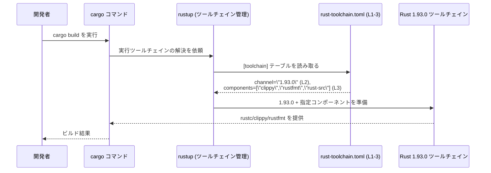

# rust-toolchain.toml コード解説

---

## 0. ざっくり一言

`rust-toolchain.toml` は、このリポジトリで使用する **Rust ツールチェインのバージョンと追加コンポーネント**（clippy・rustfmt・rust-src）を指定する設定ファイルです（`[toolchain]` テーブルとそのキーにより定義されています。`rust-toolchain.toml:L1-3`）。

---

## 1. このモジュールの役割

### 1.1 概要

- このファイルは TOML 形式の設定で、`[toolchain]` テーブルの下に 2 つの設定項目を持っています（`rust-toolchain.toml:L1-3`）。
  - `channel = "1.93.0"` によって、使用する Rust ツールチェインのチャンネル／バージョンとして `1.93.0` が指定されています（`rust-toolchain.toml:L2-2`）。
  - `components = ["clippy", "rustfmt", "rust-src"]` によって、ツールチェインと共に使用したい追加コンポーネントとして `clippy`・`rustfmt`・`rust-src` が列挙されています（`rust-toolchain.toml:L3-3`）。

- 一般的な Rust の仕様として、`rust-toolchain.toml` は Rust のツールチェインマネージャー **rustup** が参照し、そのディレクトリ以下で実行される `cargo` / `rustc` などのコマンドに対して使用するツールチェインを決定するために用いられます。この点は、Rust の公式ツールの挙動に基づく一般知識であり、ファイル内容だけから読み取れるものではありません。

### 1.2 アーキテクチャ内での位置づけ

このファイルは、開発者が `cargo build` などを実行したときに、実際にどのバージョンの `rustc` やどのコンポーネント（clippy / rustfmt / rust-src）が使われるかを **rustup 経由で制御する入力** になります。

ファイルとツールの関係を簡略化して表すと、次のようになります。

```mermaid
graph TD
    Dev["開発者が実行するコマンド<br/>cargo / rustc など"] 
        --> Rustup["rustup ツール"]

    Rustup --> Config["rust-toolchain.toml<br/>[toolchain] (L1-3)"]

    Config --> Channel["channel = \"1.93.0\" (L2-2)"]
    Config --> Components["components = [\"clippy\", \"rustfmt\", \"rust-src\"] (L3-3)"]

    Channel --> Toolchain["Rust 1.93.0 ツールチェイン"]
    Components --> Toolchain

    Toolchain --> Rustc["rustc 1.93.0"]
    Toolchain --> Clippy["clippy コンポーネント"]
    Toolchain --> Rustfmt["rustfmt コンポーネント"]
    Toolchain --> RustSrc["rust-src コンポーネント"]
```

- この図で示している `rustup`・`cargo`・`rustc` などは、Rust 開発環境における一般的なツールであり、このファイル自体には登場しません。Rust の通常の運用に関する知識に基づく補足です。

### 1.3 設計上のポイント

コード（設定）から読み取れる特徴は次のとおりです。

- **単一のテーブル構造**  
  - `rust-toolchain.toml` には `[toolchain]` という 1 つの TOML テーブルのみが定義されています（`rust-toolchain.toml:L1-1`）。
- **明示的なバージョン固定**  
  - `channel` には `"stable"` や `"nightly"` といった抽象チャンネルではなく、具体的なバージョン文字列 `"1.93.0"` が指定されています（`rust-toolchain.toml:L2-2`）。
- **明示的なコンポーネント一覧**  
  - `components` 配列で `["clippy", "rustfmt", "rust-src"]` が明示されており、環境構築時にこれらのコンポーネントが一貫して利用されることを意図していると解釈できます（`rust-toolchain.toml:L3-3`）。
- **状態やロジックを持たない静的設定**  
  - 関数・条件分岐・ループなどの実行ロジックは一切なく、完全に静的な設定値のみで構成されています（`rust-toolchain.toml:L1-3` からコード構造として確認できます）。

---

## 2. 主要な機能一覧（設定項目の一覧）

このファイルは実行コードではないため「機能」というより「設定項目」ですが、実質的に提供している役割は次の 2 つです。

- `toolchain.channel`: 使用する Rust ツールチェインのバージョン／チャンネルを固定する設定です。ここでは `"1.93.0"` に固定されています（`rust-toolchain.toml:L2-2`）。
- `toolchain.components`: 使用するツールチェインと一緒にインストール・利用したいコンポーネント（clippy, rustfmt, rust-src）を列挙する設定です（`rust-toolchain.toml:L3-3`）。

---

## 3. 公開 API と詳細解説

### 3.1 型一覧（構造体・列挙体など）

このファイルは TOML 設定であり、Rust の構造体や列挙体などの「型」は定義されていません。その代わり、設定として重要な「コンポーネント」を一覧として示します。

| 名前 | 種別 | 役割 / 用途 | 定義箇所 |
|------|------|-------------|----------|
| `toolchain` | TOML テーブル | ツールチェイン関連の設定をまとめるルートテーブルです。 | `rust-toolchain.toml:L1-3` |
| `channel` | TOML 文字列キー | 使用する Rust ツールチェインのバージョン（ここでは `"1.93.0"`）を指定します。 | `rust-toolchain.toml:L2-2` |
| `components` | TOML 配列キー | 追加で利用したいコンポーネントを文字列の配列として指定します（`"clippy"`, `"rustfmt"`, `"rust-src"`）。 | `rust-toolchain.toml:L3-3` |

### 3.2 関数詳細（最大 7 件）

- このファイルには **Rust の関数・メソッド・モジュール** は一切定義されていません。
- したがって、関数詳細テンプレートに沿って解説すべき対象は存在しません。

### 3.3 その他の関数

- 設定ファイルのため、補助的な関数やラッパー関数も存在しません。

---

## 4. データフロー

ここでは、「開発者がこのディレクトリで `cargo build` を実行したときに、このファイルの情報がどのように使われるか」を抽象的に説明します。

### 4.1 処理の流れ（概念的な説明）

1. 開発者がプロジェクトのルートディレクトリ（`rust-toolchain.toml` が置かれている場所）で `cargo build` などを実行します。
2. 一般的な Rust 環境では `cargo` は `rustup` によってラップされており、`rustup` はそのディレクトリから `rust-toolchain.toml` を探して読み込みます（一般的な仕様に基づく説明であり、ファイル内容だけからは読み取れません）。
3. `rustup` は `[toolchain]` テーブルの `channel` と `components` を解釈します（`rust-toolchain.toml:L1-3`）。
   - `channel = "1.93.0"` に従って、Rust 1.93.0 のツールチェインを選択またはインストールします（`rust-toolchain.toml:L2-2`）。
   - `components` に列挙されている `clippy`, `rustfmt`, `rust-src` が利用可能であることを確認し、必要ならインストールします（`rust-toolchain.toml:L3-3`）。
4. `cargo` は、選択された Rust 1.93.0 の `rustc` を使ってビルドを行い、必要に応じて `clippy` や `rustfmt` もこのバージョンに対応したものが利用されます。

### 4.2 シーケンス図

この流れをシーケンス図で表現します。



※ `cargo` や `rustup` の存在は Rust ツールチェインの一般的な構成に基づく情報であり、このファイル単体には記述されていません。

---

## 5. 使い方（How to Use）

### 5.1 基本的な使用方法

このファイルを利用した典型的なフローは、次のようになります。

1. プロジェクトのルートディレクトリに `rust-toolchain.toml` を配置する。
2. ファイルに以下のような内容を書く（現在の内容そのものです）。

```toml
# rust-toolchain.toml
[toolchain]                              # ツールチェイン設定テーブル (L1)
channel = "1.93.0"                       # 使用する Rust バージョンを 1.93.0 に固定 (L2)
components = ["clippy", "rustfmt", "rust-src"]  # 追加コンポーネントの一覧 (L3)
```

1. そのディレクトリで `cargo build` や `cargo test`、`cargo fmt`、`cargo clippy` などを実行すると、Rust 1.93.0 のツールチェインと指定されたコンポーネントが使われます（これは一般的な rustup の挙動に基づく説明です）。

### 5.2 よくある使用パターン（一般的な話）

このチャンクには他のパターンは現れていませんが（`rust-toolchain.toml:L1-3`）、一般的には次のような使い方があります。

- **特定バージョンの固定**  
  - このファイルと同様に `channel = "1.93.0"` のように具体的なバージョンを指定して、長期間にわたって同じコンパイラでビルドできるようにする。
- **クラッシュの再現や互換性維持**  
  - バグ報告や古い環境との互換性維持のために、あえて古いバージョンを指定する（例: `"1.70.0"` など）。  
  ※ これらの値は例であり、本ファイル内には現れていません。

### 5.3 よくある間違いと注意点（Bugs / Security 観点を含む）

このファイルから直接読み取れる範囲と一般的な挙動に基づき、起こりそうな問題を整理します。

- **存在しない／古すぎるバージョンを指定する**  
  - `channel` に存在しないバージョン文字列を指定すると、rustup がツールチェインを取得できずエラーになります（一般的仕様）。  
  - セキュリティ観点では、極端に古いバージョンを指定していると、既知の脆弱性やコンパイラバグを含んだ状態でビルドする可能性があります。`1.93.0` が現時点（2024-09 時点の知識）でどのような位置づけかは、Rust のリリースノートを参照する必要があります。
- **コンポーネントの指定ミス**  
  - `components` に誤った名前を入れると、rustup がそのコンポーネントをインストールできず、`cargo clippy` / `cargo fmt` が失敗する可能性があります（一般的仕様）。  
    このファイルでは `"clippy"`, `"rustfmt"`, `"rust-src"` と正しい名前になっているように見えますが、これは Rust の一般的なコンポーネント名に基づく判断です（`rust-toolchain.toml:L3-3`）。
- **CI / 本番環境との不整合**  
  - ローカルの `rust-toolchain.toml` と CI や本番環境のツールチェイン設定が一致していないと、「ローカルでは通るが CI では通らない」といった問題が発生します。  
    これはリポジトリ全体の構成によるため、このチャンクからは実際に CI がどうなっているかは分かりません。

### 5.4 使用上の注意点（まとめ）

- **バージョン固定の影響**  
  - `channel = "1.93.0"` のように固定したまま長期間放置すると、クレートが新しい Rust の機能に依存し始めたときにビルドができなくなる可能性があります（`rust-toolchain.toml:L2-2`）。定期的な見直しが必要です。
- **コンポーネントは最小限に**  
  - `components` で指定したコンポーネントは環境構築時に追加のダウンロード・インストールが必要になります（`rust-toolchain.toml:L3-3`）。不要なコンポーネントを減らすことで、セットアップ時間を短縮できます。
- **スレッド安全性・並行性**  
  - このファイル自体は静的設定であり、スレッド安全性や並行実行に関するロジックは持ちません。並行ビルドやマルチスレッド実行は、`cargo` / `rustc` 側の責務です。

---

## 6. 変更の仕方（How to Modify）

### 6.1 新しい「機能」（設定要素）を追加する場合

このファイルに新しいロジックを追加することはできませんが、設定として拡張する場合の例を挙げます。

- **Rust バージョンを変更する**  
  - `channel` の値を変更します（`rust-toolchain.toml:L2-2`）。  
    例: 新しい安定版に追随したい場合は `"1.94.0"` などに書き換えます（値は例であり、このチャンクには現れません）。
- **追加コンポーネントを増やす**  
  - `components` 配列に要素を追加します（`rust-toolchain.toml:L3-3`）。  
    例: 新たに `rust-analyzer` のようなコンポーネントが公式に追加された場合に、それを追記するなど（存在するかどうかは公式ドキュメント要確認）。

いずれの場合も、**追加したキーや値が rustup の仕様でサポートされているかどうか** は、公式ドキュメントの確認が必要です。このファイルだけからは、他にどのキーが許されているかは分かりません。

### 6.2 既存の設定を変更する場合の注意点

- **`channel` を変更する際の注意**  
  - 既存コードが新しいコンパイラで警告やエラーになる可能性があります。  
  - 変更前後の両バージョンでビルド・テストを実行し、挙動を確認することが推奨されます。
- **`components` を削除する際の注意**  
  - `clippy` や `rustfmt` を `components` から外すと、ローカル開発環境でそれらがインストールされなくなる可能性があり、プロジェクトの開発フロー（lint / フォーマット）が崩れることがあります（`rust-toolchain.toml:L3-3`）。
- **影響範囲の確認**  
  - このチャンクからは他ファイルの存在や CI 設定は分かりませんが、一般には `Cargo.toml`、CI の設定ファイル（GitHub Actions, GitLab CI 等）も同じツールチェインを前提にしているかを確認する必要があります。

---

## 7. 関連ファイル

このチャンクには、他のファイルやディレクトリ構成に関する情報は一切含まれていません（`rust-toolchain.toml:L1-3` には他ファイルの参照がないため）。したがって、「密接に関係するファイル」が実際に何かは、この情報だけからは断定できません。

一般的な Rust プロジェクト構成を前提にすると、次のようなファイルが「関連ファイル」になることが多いですが、**このリポジトリに実在するかどうかは不明** です。

| パス | 役割 / 関係 |
|------|------------|
| `Cargo.toml` | 一般にプロジェクトのルートに存在し、クレート名や依存クレート、ビルド設定などを定義します。`rust-toolchain.toml` で指定したツールチェインでこのプロジェクトをビルドすることが想定されますが、本チャンクから実在は確認できません。 |
| `rust-toolchain.toml` | 本ファイル自身であり、プロジェクトで使用する Rust ツールチェイン（バージョン・コンポーネント）を定義します（`rust-toolchain.toml:L1-3`）。 |

---

### まとめ

- `rust-toolchain.toml` は、Rust ツールチェインの **バージョン固定** と **コンポーネント指定** を行う、非常に小さいが重要な設定ファイルです（`rust-toolchain.toml:L1-3`）。
- 実行ロジックや並行性の問題は含まず、主に `rustup` / `cargo` によるビルド環境の再現性と一貫性を確保するために用いられます。
