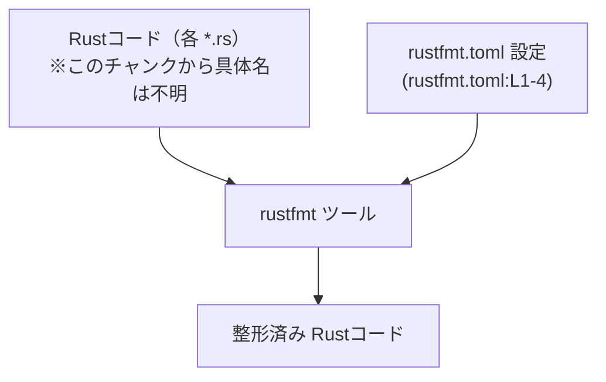
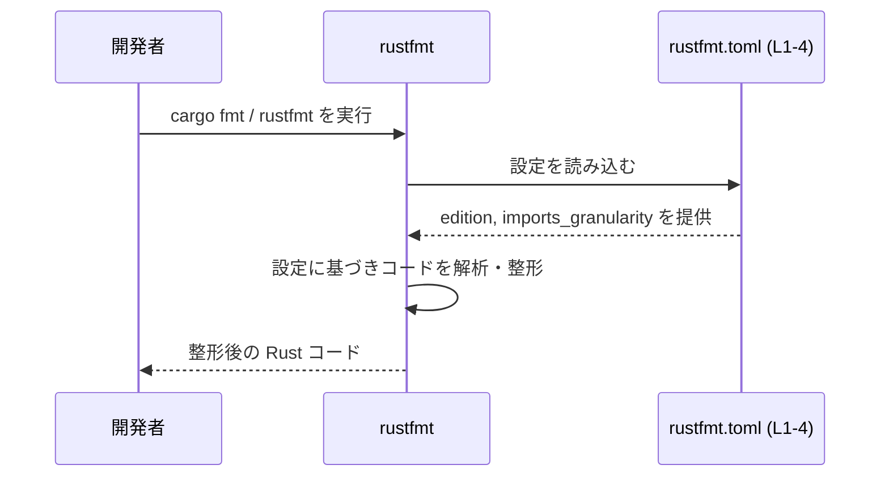

# rustfmt.toml コード解説

## 0. ざっくり一言

`rustfmt.toml` は Rust のコード整形ツール **rustfmt** の挙動を制御するための設定ファイルです（rustfmt.toml:L1-4）。  
このファイルでは、Rust エディションと `use` インポートの整形方針を指定しています（rustfmt.toml:L1, L4）。

---

## 1. このモジュールの役割

### 1.1 概要

- このファイルは **rustfmt の設定** を記述し、プロジェクト内の Rust コードがどのように整形されるかを決めます（rustfmt.toml:L1-4）。
- 具体的には、Rust 言語の **エディション** と、`use` 文の **インポート粒度** を指定しています（rustfmt.toml:L1, L4）。
- コメントから、ある設定により発生する警告は無視してよいという運用方針も示されています（rustfmt.toml:L2-3）。

### 1.2 アーキテクチャ内での位置づけ

この設定ファイルは、Rust コードそのものではなく **開発ツール rustfmt の振る舞い** を制御する「外部設定」として働きます（rustfmt.toml:L1-4）。



- `rustfmt` 実行時に `rustfmt.toml` が読み込まれ（rustfmt.toml:L1-4）、その内容に従ってコードが整形されます。
- `rustfmt.toml` 自身は実行時ロジックを持たず、**状態も持たない静的設定** です（rustfmt.toml:L1-4）。

### 1.3 設計上のポイント

- **静的な TOML 設定のみ**  
  - コード（関数・構造体）は一切なく、すべてキーと値の設定です（rustfmt.toml:L1, L4）。
- **エディション指定**  
  - `edition = "2024"` により、Rust 2024 エディションとしての整形ルールを使うよう明示しています（rustfmt.toml:L1）。
- **インポート整形の粒度指定**  
  - `imports_granularity = "Item"` により、`use` インポートをアイテム単位で扱う設定になっています（rustfmt.toml:L4）。
- **警告の扱いの明示**  
  - コメントで「この設定による警告は無視してよい」と記されており（rustfmt.toml:L2）、さらに GitHub の PR への参照が添えられています（rustfmt.toml:L3）。
- **安全性・エラー・並行性への影響**  
  - このファイルは **整形結果** のみを変えるものであり、Rust プログラムのメモリ安全性・エラー処理・並行実行の挙動を直接変えるコードは含みません（rustfmt.toml:L1-4）。

---

## 2. 主要な機能一覧

この「機能」はすべて rustfmt の設定項目として提供されます。

- `edition` 設定: rustfmt が Rust コードをどのエディションとして解釈し整形するかを指定します（rustfmt.toml:L1）。
- `imports_granularity` 設定: `use` インポートをどの粒度（モジュール単位か、アイテム単位か等）でまとめるかを指定します（rustfmt.toml:L4）。
- 警告に関する運用方針: 特定の設定による警告は無視してよいとコメントで示しています（rustfmt.toml:L2-3）。

---

## 3. 公開 API と詳細解説

### 3.1 型一覧（構造体・列挙体など）

このファイルは **設定ファイル** であり、Rust の構造体・列挙体・関数などのコード定義は含まれていません（rustfmt.toml:L1-4）。

#### 設定項目インベントリー（コンポーネント一覧）

| 設定キー               | 種別   | 役割 / 用途                                                                                         | 根拠 |
|------------------------|--------|------------------------------------------------------------------------------------------------------|------|
| `edition`              | 文字列 | Rust 言語エディションを指定し、rustfmt がどのエディションに基づいて整形するかを決めます。           | rustfmt.toml:L1 |
| `imports_granularity`  | 文字列 | `use` インポートのグルーピング粒度を指定し、インポートの整形スタイルを制御します。                | rustfmt.toml:L4 |

### 3.2 関数詳細（設定項目の詳細）

このファイルには関数は存在しないため（rustfmt.toml:L1-4）、ここでは「外部から制御可能なインターフェース」に相当する **設定項目** を関数と同様の粒度で説明します。

#### `edition = "2024"`

**概要**

- rustfmt がコードを整形する際に、どの Rust エディションのルールを前提にするかを指定する設定です（rustfmt.toml:L1）。

**値**

| キー      | 型       | 値       | 説明                         | 根拠 |
|----------|----------|----------|------------------------------|------|
| `edition` | 文字列   | `"2024"` | Rust 2024 エディションを指定 | rustfmt.toml:L1 |

**内部処理への影響（概念的な流れ）**

- rustfmt 実行時に `rustfmt.toml` の `edition` 値が読み込まれる（rustfmt.toml:L1）。
- 読み込んだエディション値に基づき、rustfmt は対応するエディションの構文・整形ルールを選択します（これは rustfmt の一般仕様に基づく説明であり、このファイル単体から処理詳細は分かりません）。
- そのルールに従ってソースコードを解析・整形します。

**Errors / Panics**

- `edition` にサポートされていない値が書かれていた場合、rustfmt 実行時にエラーや警告が発生する可能性がありますが、このチャンクにはその具体的な動作は記述されていません（rustfmt.toml:L1）。
- コメントから、「この設定による警告は無視してよい」という運用であることが読み取れます（rustfmt.toml:L2）。  
  ただし、実際にどのような警告が出るかはこのファイルからは分かりません（rustfmt.toml:L1-3）。

**Edge cases（エッジケース）**

- このファイルでは `edition` は `"2024"` のみが指定されており（rustfmt.toml:L1）、他の値に対する挙動はコード上には現れていません。
- `edition` キー自体が存在しない場合の挙動は、このファイルからは不明です（このチャンクにはその記述がありません）。

**使用上の注意点**

- コメントにある通り、この `edition` 設定に起因する警告は無視してよいという前提で運用されています（rustfmt.toml:L2-3）。
- エディションは言語機能や構文ルールに関わるため、プロジェクトのコンパイラ設定（`Cargo.toml` 等）と整合していることが望ましいですが、このリポジトリの他ファイルはこのチャンクには示されていません。

#### `imports_granularity = "Item"`

**概要**

- rustfmt における `use` インポートのグルーピング方法（粒度）を指定する設定です（rustfmt.toml:L4）。

**値**

| キー                 | 型       | 値       | 説明                                          | 根拠 |
|----------------------|----------|----------|-----------------------------------------------|------|
| `imports_granularity`| 文字列   | `"Item"` | 各アイテムごとにインポートを扱う設定を指定   | rustfmt.toml:L4 |

**内部処理への影響（概念的な流れ）**

- rustfmt 実行時に `imports_granularity` の値が読み込まれます（rustfmt.toml:L4）。
- `"Item"` が指定されているため、`use` 文を整形する際に、モジュール単位ではなく **個々のアイテム単位** で分割・並べ替えを行うルールが適用されます（この内容は設定名と値からの一般的な解釈であり、具体的な整形スタイルの詳細まではこのファイルからは分かりません）。

**Errors / Panics**

- サポートされない文字列（例: 存在しないモード）が設定されていた場合の挙動は、このファイルからは不明です（rustfmt.toml:L4）。
- 少なくとも `"Item"` は rustfmt が理解できる値として用いられている前提になっています（rustfmt.toml:L4）。

**Edge cases（エッジケース）**

- `imports_granularity` が指定されていない場合のデフォルト挙動は、このファイルからは分かりません（このチャンクには記述がありません）。
- 非 ASCII 文字や空文字列などの異常値に対する挙動も、このファイルからは読み取れません（rustfmt.toml:L4）。

**使用上の注意点**

- この設定は **コードの意味や安全性には影響せず**、インポートの見た目（スタイル）のみを変えます（設定ファイルであるため、実行ロジックは含まれません：rustfmt.toml:L1-4）。
- 多人数開発では、他のメンバーと合意したインポートスタイルに合わせて、この値を変更することが想定されますが、その運用ポリシーはこのファイルからは分かりません。

### 3.3 その他の関数

- このファイルには、補助関数やラッパー関数を含む **いかなる関数定義も存在しません**（rustfmt.toml:L1-4）。

---

## 4. データフロー

この設定ファイルが関わる代表的な処理シナリオは、「開発者が `cargo fmt` や `rustfmt` を実行してコードを整形する」流れです。



- ここで `Config` は `edition` と `imports_granularity` の値を提供するだけで（rustfmt.toml:L1, L4）、実行時状態や並行処理は持ちません（rustfmt.toml:L1-4）。
- エラーや警告が発生した場合の具体的なハンドリングは rustfmt の実装側に依存し、このファイルからは詳細は分かりません。

---

## 5. 使い方（How to Use）

### 5.1 基本的な使用方法

一般的な利用イメージは次のようになります（このチャンクには Rust コード本体は含まれていませんが、概念的な例として示します）。

```rust
// src/main.rs（例）
// rustfmt.toml の設定に従って整形される対象のコード
fn main() {
    println!("Hello, world!");
}
```

```bash
# プロジェクトルートに rustfmt.toml が置かれている前提での例
cargo fmt
```

- `cargo fmt` / `rustfmt` 実行時に、同じディレクトリ階層上で見つかった `rustfmt.toml` が読み込まれ、その設定（`edition`, `imports_granularity`）に従ってコードが整形されます（rustfmt.toml:L1, L4）。
- どのコードファイルに適用されるか、どの階層に配置されているかは、このチャンクからは分かりません。

### 5.2 よくある使用パターン

- **プロジェクト単位のスタイル統一**  
  `rustfmt.toml` をリポジトリのルートに置き、すべての開発者が同じ整形ルールを使うようにします（設定ファイルであることから推測されますが、具体的な配置はこのチャンクには書かれていません）。
- **インポートスタイルの明示**  
  インポートの並び方・まとまり方を統一するために `imports_granularity = "Item"` を指定し、レビュー時の差分を安定させる用途が想定されます（rustfmt.toml:L4）。

### 5.3 よくある間違い

概念的な誤用例と、正しい設定例を対比します。

```toml
# 誤りの例（概念的）: キー名を間違えている
editionn = "2024"      # rustfmt が認識しない可能性が高い

# 正しい例（このファイルと同様）
edition = "2024"       # rustfmt.toml:L1
```

```toml
# 誤りの例（概念的）: 値の綴りを間違える
imports_granularity = "Items"   # 不正な値の可能性（このファイルには現れません）

# 正しい例（このファイルと同様）
imports_granularity = "Item"    # rustfmt.toml:L4
```

- どの値が有効かは rustfmt の仕様によりますが、このファイルには `"2024"` と `"Item"` 以外の例は書かれていません（rustfmt.toml:L1, L4）。

### 5.4 使用上の注意点（まとめ）

- `edition` 設定により警告が出る場合があり、コメントではそれを無視してよいと述べられています（rustfmt.toml:L2-3）。CI などで警告をエラー扱いしている場合は注意が必要です。
- このファイルは **整形結果のスタイルのみ** に影響し、プログラムの実行時の安全性・エラー処理・並行性には直接影響しません（rustfmt.toml:L1-4）。
- 無効なキー名や値を設定した場合の挙動は、このファイルでは定義されていません。実際の動きは rustfmt のバージョンと実装に依存します。

---

## 6. 変更の仕方（How to Modify）

### 6.1 新しい機能を追加する場合（設定項目の追加）

- 新しい整形ルールを使いたい場合、rustfmt がサポートする設定キーを `rustfmt.toml` に追加することになります。
- このチャンクには他の設定キーは書かれていないため（rustfmt.toml:L1, L4）、どのキーが利用可能かは rustfmt のドキュメントを参照する必要があります。
- 追加した設定の影響はすべて **整形結果の見た目** に限定され、実行ロジックは変わらないことが一般的です。

### 6.2 既存の機能を変更する場合

- `edition` を変更する場合  
  - プロジェクトが実際にそのエディションでコンパイルできることを前提にする必要があります（rustfmt.toml:L1）。
  - コメントにあるような警告の有無や内容も変わる可能性がありますが、このファイルからは具体的な内容は分かりません（rustfmt.toml:L2-3）。
- `imports_granularity` を変更する場合  
  - インポートの整形スタイル（まとめ方・改行位置など）が変わり、既存のコードとの差分が大きく発生する可能性があります（rustfmt.toml:L4）。
- 設定変更後は、`cargo fmt` / `rustfmt` を再度実行し、期待通りの整形結果になっているかを確認することが一般的です。

---

## 7. 関連ファイル

このチャンクには `rustfmt.toml` 以外のファイル情報が一切含まれていないため、具体的な関連ファイル名やパスは分かりません（rustfmt.toml:L1-4）。

| パス | 役割 / 関係 |
|------|------------|
| （不明） | このチャンクには他ファイルの情報がなく、どのコードファイルに適用されているかは特定できません。 |

一般的には、`rustfmt.toml` は同じディレクトリ配下にある Rust コード（例: `src/*.rs`）に対して適用されますが、これは Rust エコシステム全体での慣習に基づく説明であり、このリポジトリ固有の構成はこのチャンクだけからは判断できません。
