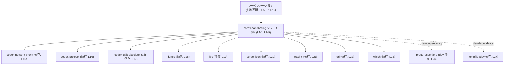
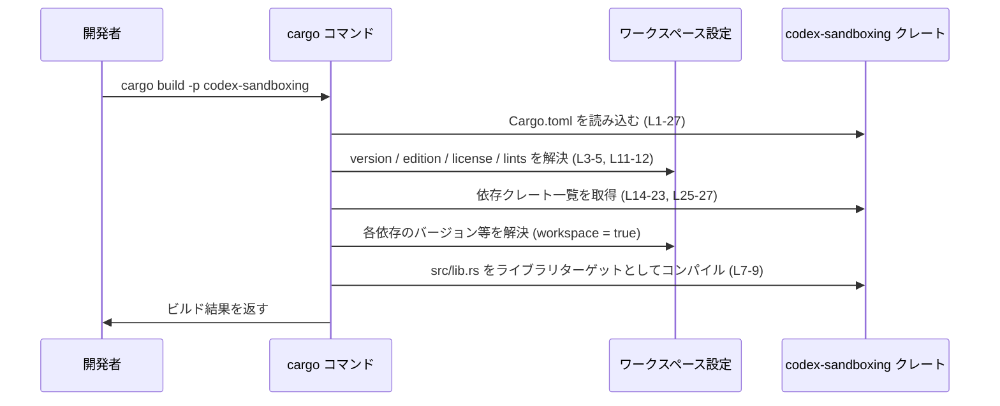

# sandboxing\Cargo.toml

## 0. ざっくり一言

`sandboxing\Cargo.toml` は、Rust ライブラリクレート `codex-sandboxing` の **メタデータと依存関係** を定義するマニフェストファイルです（根拠: `sandboxing\Cargo.toml:L1-9, L14-27`）。  
クレート名からはサンドボックス機能に関するライブラリと推測できますが、**具体的な公開 API やロジックはこのファイルには一切書かれていません**。

---

## 1. このモジュールの役割

### 1.1 概要

- このファイルは、`codex-sandboxing` クレートの
  - パッケージ名
  - ライブラリターゲット（[lib] セクション）
  - ワークスペース共有の設定（version, edition, license, lints）
  - 通常の依存クレート
  - テスト等で使う開発用依存クレート  
  を宣言するために存在します（`sandboxing\Cargo.toml:L1-5, L7-9, L11-12, L14-27`）。
- ここには Rust の関数・構造体・列挙体などの **コードは一切含まれていません**。そのため、公開 API やコアロジックの詳細はこのチャンクだけからは分かりません。

### 1.2 アーキテクチャ内での位置づけ

- `version.workspace = true` や `edition.workspace = true` などから、このクレートは **Cargo ワークスペースの一部**として定義されています（`sandboxing\Cargo.toml:L3-4, L11-12`）。
- ライブラリクレートとしてコンパイルされ、エントリポイントは `src/lib.rs` です（`sandboxing\Cargo.toml:L7-9`）。
- ランタイムで使用され得る依存クレートは `[dependencies]` セクションで、テストや検証のみで使われる依存は `[dev-dependencies]` セクションで指定されています（`sandboxing\Cargo.toml:L14-23, L25-27`）。

以下は、このファイルから読み取れる **コンポーネント（クレートレベル）の依存関係** です。



この図は **コンパイル・リンク単位としてのクレート間依存** を示すだけであり、  
各クレート間でどの関数が呼ばれるか・どのようなデータが渡されるかは、このファイルからは分かりません。

### 1.3 設計上のポイント（このファイルから分かる範囲）

- **ライブラリクレート専用**  
  - `[lib]` セクションのみが定義されており、バイナリターゲット（`[[bin]]`）はありません（`sandboxing\Cargo.toml:L7-9`）。
- **ワークスペース集中管理**  
  - `version.workspace = true`, `edition.workspace = true`, `license.workspace = true`, `[lints] workspace = true` により、バージョン・Edition・ライセンス・Lint 設定をワークスペース側に一元化しています（`sandboxing\Cargo.toml:L3-5, L11-12`）。
- **依存バージョンもワークスペース側に集約**  
  - すべての依存クレートが `{ workspace = true }` として定義されており、バージョン番号はワークスペースルート側に置かれます（`sandboxing\Cargo.toml:L15-23, L26-27`）。
- **テスト用途の明確な分離**  
  - `pretty_assertions` と `tempfile` は `[dev-dependencies]` にあり、本番バイナリにはリンクされない前提です（`sandboxing\Cargo.toml:L25-27`）。

---

## 2. 主要な機能一覧（コンポーネントインベントリー）

この Cargo.toml 自体は実行時機能を提供しませんが、**このクレートが利用しうる外部コンポーネント** と、その役割（このファイルから分かる範囲）をまとめます。

| コンポーネント | 種別 | このファイルから分かること | 根拠 |
|----------------|------|----------------------------|------|
| `codex-sandboxing` | ライブラリクレート | ワークスペース内パッケージ。`src/lib.rs` をルートとするライブラリターゲット。 | `sandboxing\Cargo.toml:L1-2, L7-9` |
| `codex-network-proxy` | 依存クレート | ランタイム依存。バージョン等はワークスペース側で定義。機能詳細は不明。 | `sandboxing\Cargo.toml:L15` |
| `codex-protocol` | 依存クレート | 同上。機能詳細は不明。 | `sandboxing\Cargo.toml:L16` |
| `codex-utils-absolute-path` | 依存クレート | 同上。機能詳細は不明。 | `sandboxing\Cargo.toml:L17` |
| `dunce` | 依存クレート | 同上。 | `sandboxing\Cargo.toml:L18` |
| `libc` | 依存クレート | 同上。C ランタイムとの連携が想定されますが、このファイルからは使用箇所は不明。 | `sandboxing\Cargo.toml:L19` |
| `serde_json` | 依存クレート | 同上。JSON 関連処理に使われることが一般的ですが、このクレート内での用途は不明。 | `sandboxing\Cargo.toml:L20` |
| `tracing` | 依存クレート | ログ機能用と思われるクレートに対して `features = ["log"]` を有効化している点のみ分かる。詳細な使用方法は不明。 | `sandboxing\Cargo.toml:L21` |
| `url` | 依存クレート | 依存であることのみ分かる。 | `sandboxing\Cargo.toml:L22` |
| `which` | 依存クレート | 依存であることのみ分かる。 | `sandboxing\Cargo.toml:L23` |
| `pretty_assertions` | dev 依存クレート | テストなど開発時のみ使用。 | `sandboxing\Cargo.toml:L26` |
| `tempfile` | dev 依存クレート | テストなど開発時のみ使用。 | `sandboxing\Cargo.toml:L27` |

> 補足: 上記の依存クレートが「何をするクレートか」という一般的な知識は Rust のエコシステムに基づくものですが、  
> **このレポートでは「このクレートがそれらをどう使っているか」については Cargo.toml からは分からない**ものとして扱います。

---

## 3. 公開 API と詳細解説

このチャンクには Rust コードが一切含まれていないため、**関数・構造体・列挙体などの公開 API の具体的な一覧や詳細解説は行えません**。

### 3.1 型一覧（構造体・列挙体など）

このファイルだけから分かる公開型は存在しません。

| 名前 | 種別 | 役割 / 用途 | 根拠 |
|------|------|-------------|------|
| （不明） | — | 構造体・列挙体などの型定義は `src/lib.rs` 以降にあり、このチャンクには現れません。 | `sandboxing\Cargo.toml:L9` がライブラリルートへのパスのみを示す |

### 3.2 関数詳細

- Rust の関数定義はこのファイルには存在しないため、**関数ごとの詳細テンプレート適用はできません**。
- 公開関数・メソッド・エラー型などは、`src/lib.rs` およびその配下のソースコードを参照する必要があります（根拠: `sandboxing\Cargo.toml:L9`）。

### 3.3 その他の関数

- 補助関数や内部関数も含め、このチャンクには一切現れていません。

---

## 4. データフロー

ここでは、この Cargo.toml が **ビルド時にどのように使われるか** という「メタレベル」のデータフローを示します。  
ランタイムにおける関数間のデータフローは、このチャンクからは分かりません。

### 4.1 ビルド時のフロー（sequence diagram）



この図から分かるポイント:

- `cargo build -p codex-sandboxing` のように、**パッケージ名 `codex-sandboxing` を指定してビルド対象を選択できる**ことが分かります（`sandboxing\Cargo.toml:L2`）。
- 依存クレートのバージョンや詳細設定はワークスペース側に委譲されており、この Cargo.toml は「どのクレートに依存するか」だけを宣言しています（`sandboxing\Cargo.toml:L14-23, L25-27`）。

---

## 5. 使い方（How to Use）

ここでの「使い方」は、**`codex-sandboxing` クレートの使い方**ではなく、  
この Cargo.toml が示す情報を前提にした **ビルド・依存追加の仕方** に関するものです。

### 5.1 基本的な使用方法（ビルド）

ワークスペース内で `codex-sandboxing` をビルドする基本コマンド例です。

```bash
# ワークスペースルートで実行する想定の例
cargo build -p codex-sandboxing    # パッケージ名は L2 の name に一致
```

- パッケージ名は `[package]` セクションの `name = "codex-sandboxing"` に一致させます（`sandboxing\Cargo.toml:L1-2`）。
- これにより、`[lib]` セクションで指定された `src/lib.rs` がコンパイル対象になります（`sandboxing\Cargo.toml:L7-9`）。

### 5.2 よくある使用パターン

このファイルから読み取れる範囲での「パターン」は主に依存関係の追加・変更です。

1. **ランタイム依存の追加**

   - 新しい依存クレートを追加する場合は、`[dependencies]` セクションに行を追加します（`sandboxing\Cargo.toml:L14-23`）。
   - ワークスペースでバージョン管理するスタイルを踏襲するなら、例として次のように書きます。

   ```toml
   [dependencies]
   # 既存
   codex-network-proxy = { workspace = true }
   # 新規（例）
   some-crate = { workspace = true }  # 実際にはワークスペースルート側でバージョンを定義
   ```

   > ここでの `some-crate` やパスはあくまで一般例であり、実際のワークスペース構成に依存します。

2. **テスト専用依存の追加**

   - テスト用のライブラリは `[dev-dependencies]` に追加します（`sandboxing\Cargo.toml:L25-27`）。

   ```toml
   [dev-dependencies]
   pretty_assertions = { workspace = true }
   tempfile = { workspace = true }
   # 追加例
   test-helper = { workspace = true }
   ```

### 5.3 よくある間違い（想定されるもの）

Cargo.toml の記述として起こりがちな誤りと、このファイルから見える対比です。

```toml
# よくない例: 同一依存について workspace と version を混在
[dependencies]
serde_json = { workspace = true, version = "1.0" }  # 意図が不明瞭になりやすい
```

```toml
# このファイルの方針に沿った例
[dependencies]
serde_json = { workspace = true }  # バージョンはワークスペースルート側に一元化 (L20)
```

- このファイルでは、**すべての依存が `{ workspace = true }` に統一**されているため（`sandboxing\Cargo.toml:L15-23, L26-27`）、
  個々のパッケージ側でバージョンを指定しない方針であると解釈できます。

### 5.4 使用上の注意点（まとめ）

- **ワークスペース設定が前提**  
  - `version.workspace = true` などの指定があるため、ワークスペースルート側に対応する設定がないとビルドに失敗します（`sandboxing\Cargo.toml:L3-5, L11-12`）。
- **依存クレートのバージョンはローカルで勝手に変えない**  
  - このファイルではバージョンを一切記載していないため、ローカルで個別にバージョンを指定すると、プロジェクト全体の一貫性が崩れる可能性があります。
- **dev-dependencies は本番コードでは利用しない前提**  
  - `pretty_assertions` や `tempfile` はテスト用として指定されており（`sandboxing\Cargo.toml:L25-27`）、本番ロジック側で依存する設計かどうかは注意が必要です。

---

## 6. 変更の仕方（How to Modify）

### 6.1 新しい機能を追加する場合（このファイルの観点）

新しい機能自体は `src/lib.rs` などの Rust コード側で実装しますが、  
**その機能に必要な外部クレートを使う場合** は、この Cargo.toml に変更が必要です。

1. 必要な外部クレートを決める  
   - 例: 新機能で JSON 処理が必要なら、既存の `serde_json` を再利用できるか検討（`sandboxing\Cargo.toml:L20`）。
2. 既存の依存に同等機能が無ければ、`[dependencies]` に依存を追加  
   - このプロジェクトでは `{ workspace = true }` で統一されているため、その方針に従います（`sandboxing\Cargo.toml:L14-23`）。
3. ワークスペースルートの Cargo.toml 側に、その依存のバージョン等を追加  
   - ルートファイルはこのチャンクには現れないため、具体的な編集箇所は不明です。
4. 追加したクレートを `src/lib.rs` 側から `use` して機能を実装する  
   - ここもこのファイルからは詳細不明です。

### 6.2 既存の機能を変更する場合（依存関係の観点）

- **依存クレートの差し替え・削除**

  - ある依存を別のクレートに置き換えたい場合、次のような順序になります。

  1. 変更したい依存を `[dependencies]` から特定（例: `libc`、`tracing` など; `sandboxing\Cargo.toml:L19, L21`）。
  2. コード側（`src/lib.rs` など）でどの API を使っているかを調査し、置き換え可能か確認。
  3. 問題なければ、Cargo.toml から不要な依存を削除し、新しい依存を追記。
  4. ワークスペースルートの設定も合わせて更新。

- **注意すべき契約**

  - 依存クレートの API や挙動は、このファイルからは分からないため、  
    削除やバージョンアップに伴う破壊的変更がないかどうかは、該当クレートのドキュメントや変更ログを別途確認する必要があります。

---

## 7. 関連ファイル

この Cargo.toml から直接参照されている、または論理的に密接に関係すると考えられるファイル・設定をまとめます。

| パス / 場所 | 役割 / 関係 | 根拠 |
|-------------|-------------|------|
| `src/lib.rs` | `codex-sandboxing` ライブラリクレートのルート。公開 API やコアロジックはここから始まる。 | `sandboxing\Cargo.toml:L7-9` (`path = "src/lib.rs"`) |
| ワークスペースルートの `Cargo.toml` | `version.workspace`, `edition.workspace`, `license.workspace`, `[lints] workspace = true` および各依存の `{ workspace = true }` の具体値を定義するマニフェスト。 | `sandboxing\Cargo.toml:L3-5, L11-12, L15-23, L26-27` |
| （その他のソースファイル） | `src/lib.rs` から `mod` などで参照されると推測されるが、このチャンクには現れないためパスや役割は不明。 | — |

---

### このチャンクから分からないこと（明示）

- `codex-sandboxing` が提供する **具体的な公開関数・構造体・エラー型・並行処理モデル**  
  → いずれも `src/lib.rs` 以降のソースコードを確認する必要があります。
- 安全性 / エラーハンドリング / 並行性の設計方針  
  → 依存に `libc` や `tracing` が含まれることから、OS やログとのやり取りがある可能性はありますが、  
    **どう使っているかはこの Cargo.toml からは判断できません**。
- テスト内容やカバレッジ、パフォーマンス上の工夫  
  → `pretty_assertions` や `tempfile` が dev 依存にあることから「何らかのテストが存在する」と推測できますが、中身は不明です。

このレポートは、あくまで `sandboxing\Cargo.toml` 単体から読み取れる範囲に限定した説明になっています。
