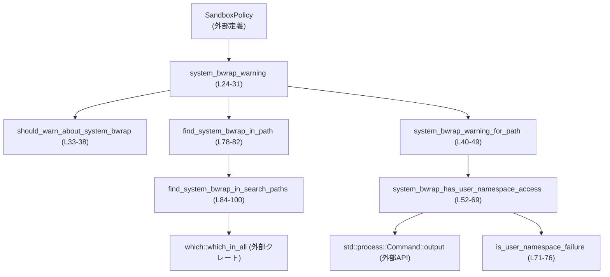
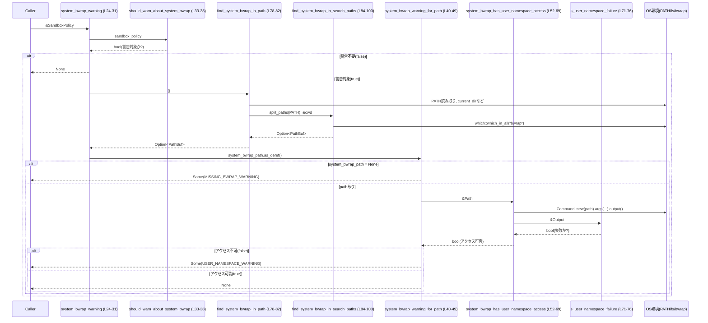

# sandboxing/src/bwrap.rs コード解説

---

## 0. ざっくり一言

Linux サンドボックスで利用する system の `bwrap`（bubblewrap）バイナリを検出し、  
見つからない場合やユーザー名前空間が使えない場合に表示すべき警告メッセージを決める補助モジュールです（`sandboxing/src/bwrap.rs:L7-22, L24-31, L40-50`）。

---

## 1. このモジュールの役割

### 1.1 概要

- このモジュールは **Linux サンドボックスでの bubblewrap 利用状況をチェックし、ユーザー向け警告を生成する** ために存在します。
- 具体的には以下を行います。
  - サンドボックス・ポリシー（`SandboxPolicy`）に応じて、system bubblewrap に関する警告が必要か判定する（`system_bwrap_warning`）。  
   （`sandboxing/src/bwrap.rs:L24-38`）
  - `PATH` から system の `bwrap` バイナリを探し、カレントディレクトリ配下のものは除外して選択する（`find_system_bwrap_in_path` 系）。  
   （`sandboxing/src/bwrap.rs:L78-82, L84-100`）
  - 見つかった `bwrap` がユーザー名前空間を利用できるか、テスト起動して確認する（`system_bwrap_has_user_namespace_access`）。  
   （`sandboxing/src/bwrap.rs:L52-69`）

### 1.2 アーキテクチャ内での位置づけ

このモジュールは「サンドボックス起動前の環境チェック」を行う補助レイヤです。  
外部の `SandboxPolicy` と OS 環境（`PATH`、カレントディレクトリ、`bwrap` コマンド）に依存し、  
呼び出し元に「警告メッセージ（`Option<String>`）」を返します。



### 1.3 設計上のポイント

- **責務分割**
  - 「警告が必要かの判断」（`should_warn_about_system_bwrap`）と、
    「`bwrap` の探索」（`find_system_bwrap_in_*`）、
    「ユーザー名前空間チェック」（`system_bwrap_has_user_namespace_access`）が関数ごとに分割されています。
- **エラーハンドリング方針**
  - 環境依存の失敗（`PATH` 未設定、カレントディレクトリ取得失敗、`which::which_in_all` の失敗など）は `Option` を通じて **静かに None を返す** 形で扱っています（`sandboxing/src/bwrap.rs:L78-82, L84-90`）。
  - user namespace チェックでは、**特定のエラーメッセージにマッチした場合のみ「ユーザー名前空間が使えない」と判定**し、それ以外の失敗は「問題なし」とみなしています（`sandboxing/src/bwrap.rs:L52-69, L71-76`）。
- **安全性（Rust視点）**
  - 明示的な `unwrap` / `expect` を使わず、`?` と `ok()?`、`unwrap_or_else` を組み合わせてパニックを避けています（`sandboxing/src/bwrap.rs:L78-82, L84-100`）。
  - 標準ライブラリの `String::from_utf8_lossy` を使うことで、`stderr` のバイト列が不正な UTF-8 を含んでもパニックしません（`sandboxing/src/bwrap.rs:L71-72`）。
- **並行性**
  - 共有可変状態を持たず、すべて関数スコープ内のローカル変数で完結しています。
  - ただし `PATH` やカレントディレクトリはプロセス全体で共有されるため、他スレッドから変更されると結果が変わる可能性があります（これは Rust の標準 API の性質に由来します）。
- **セキュリティ上の特徴**
  - カレントディレクトリ配下にある `bwrap` バイナリは system 用として採用せず、除外します（`sandboxing/src/bwrap.rs:L93-98`）。  
    これにより、作業ディレクトリ内の `bwrap`（たとえばユーザーが置いたバイナリ）を「system bwrap」と誤認しない設計になっています。

---

## 2. 主要な機能一覧

- system bwrap 警告生成: `SandboxPolicy` と環境に基づき、表示すべき警告文（`Option<String>`）を返す。
- system bwrap 検出: `PATH` とカレントディレクトリから、system の `bwrap` バイナリ（カレントディレクトリ配下を除く）を探す。
- ユーザー名前空間チェック: 見つかった `bwrap` を簡易実行し、ユーザー名前空間が利用可能かどうかを判定する。
- user namespace エラー解析: `bwrap` 実行結果の `stderr` から、ユーザー名前空間関連の典型的な失敗パターンを検出する。

### 2.1 コンポーネントインベントリー（関数・定数）

| 名前 | 種別 | 公開性 | 概要 | 定義位置 |
|------|------|--------|------|----------|
| `SYSTEM_BWRAP_PROGRAM` | 定数 `&'static str` | private | 検索対象のプログラム名 `"bwrap"` | `sandboxing/src/bwrap.rs:L7-7` |
| `MISSING_BWRAP_WARNING` | 定数 `&'static str` | private | `bwrap` が見つからない場合の警告テンプレート | `sandboxing/src/bwrap.rs:L8-14` |
| `USER_NAMESPACE_WARNING` | 定数 `&'static str` | private | user namespace が利用できない場合の警告文 | `sandboxing/src/bwrap.rs:L15-16` |
| `USER_NAMESPACE_FAILURES` | 定数 `[&'static str;4]` | private | user namespace 関連失敗メッセージの候補一覧 | `sandboxing/src/bwrap.rs:L17-22` |
| `system_bwrap_warning` | 関数 | **public** | サンドボックス方針と環境から、system bwrap に関する警告文を返す | `sandboxing/src/bwrap.rs:L24-31` |
| `should_warn_about_system_bwrap` | 関数 | private | `SandboxPolicy` に基づき、警告を出すべきかどうかを判定する | `sandboxing/src/bwrap.rs:L33-38` |
| `system_bwrap_warning_for_path` | 関数 | private | `bwrap` のパスに基づき、警告内容（有無）を決定する | `sandboxing/src/bwrap.rs:L40-50` |
| `system_bwrap_has_user_namespace_access` | 関数 | private | `bwrap` を試しに実行し、user namespace が利用できるか判定する | `sandboxing/src/bwrap.rs:L52-69` |
| `is_user_namespace_failure` | 関数 | private | `bwrap` 実行結果の `stderr` から user namespace 失敗かどうか判定する | `sandboxing/src/bwrap.rs:L71-76` |
| `find_system_bwrap_in_path` | 関数 | **public** | `PATH` とカレントディレクトリから、system の `bwrap` バイナリを探す | `sandboxing/src/bwrap.rs:L78-82` |
| `find_system_bwrap_in_search_paths` | 関数 | private | 任意の検索パス集合から、カレントディレクトリ配下を除外して `bwrap` を探す | `sandboxing/src/bwrap.rs:L84-100` |
| `tests` | モジュール | private（`cfg(test)`） | テストモジュール。中身はこのチャンクには現れない | `sandboxing/src/bwrap.rs:L102-104` |

---

## 3. 公開 API と詳細解説

### 3.1 型一覧（構造体・列挙体など）

このファイル内で **新たに定義される公開型はありません**。

使用している主な外部型:

| 名前 | 種別 | 定義場所（外部） | 用途 |
|------|------|------------------|------|
| `SandboxPolicy` | 列挙体（と推定） | `codex_protocol::protocol` | サンドボックスのポリシーを表現。DangerFullAccess / ExternalSandbox などのバリアントが存在する（`sandboxing/src/bwrap.rs:L24, L33-37` で利用）。 |
| `Path`, `PathBuf` | 標準ライブラリのパス型 | `std::path` | ファイルシステム上のパスを表現（`sandboxing/src/bwrap.rs:L2-3, L40, L52, L78-81, L84-87`）。 |
| `Command`, `Output` | プロセス起動関連 | `std::process` | 外部コマンド（`bwrap`）を実行するために使用（`sandboxing/src/bwrap.rs:L4-5, L52-69, L71-76`）。 |

> `SandboxPolicy` 自体の実装内容（全バリアントなど）は、このチャンクには現れません。

---

### 3.2 関数詳細

#### `system_bwrap_warning(sandbox_policy: &SandboxPolicy) -> Option<String>`

**概要**

- サンドボックス・ポリシーと現在の環境（`PATH` など）をもとに、system bubblewrap に関する警告メッセージを返します（`Some(String)` または `None`）。  
  （`sandboxing/src/bwrap.rs:L24-31`）
- 警告不要と判断された場合や、問題が検出されなかった場合は `None` を返します。

**引数**

| 引数名 | 型 | 説明 |
|--------|----|------|
| `sandbox_policy` | `&SandboxPolicy` | 現在のサンドボックス方針。DangerFullAccess / ExternalSandbox などのバリアントに応じて、警告を出すかどうかが変化します。 |

**戻り値**

- `Option<String>`  
  - `Some(msg)`: ユーザーに表示すべき警告メッセージ。  
  - `None`: 警告不要。

**内部処理の流れ**

1. `should_warn_about_system_bwrap(sandbox_policy)` を呼び出し、そもそも警告を出す対象かどうかを判定します（`sandboxing/src/bwrap.rs:L25`）。
2. 対象外（`false`）なら即座に `None` を返します（`sandboxing/src/bwrap.rs:L25-27`）。
3. `find_system_bwrap_in_path()` で `PATH` から system `bwrap` を探します（`sandboxing/src/bwrap.rs:L29`）。
4. 見つかった `PathBuf` を `Option<&Path>` に変換し、`system_bwrap_warning_for_path` に委譲します（`sandboxing/src/bwrap.rs:L29-30`）。
5. `system_bwrap_warning_for_path` から返ってきた `Option<String>` をそのまま返します。

**Examples（使用例）**

```rust
use codex_protocol::protocol::SandboxPolicy;
use sandboxing::bwrap::system_bwrap_warning; // 実際のモジュールパスはこのチャンクからは不明

fn check_bwrap(policy: &SandboxPolicy) {
    if let Some(msg) = system_bwrap_warning(policy) {
        eprintln!("WARNING: {msg}"); // ユーザー向けに警告を表示する
    }
}
```

※ `SandboxPolicy` の具体的なバリアントはこのファイルからは分からないため、例では外部から受け取る形にしています。

**Errors / Panics**

- この関数自身は `Result` を返さず、内部での失敗はすべて `Option` 経由で「警告内容」に反映されます。
  - `PATH` 未設定やカレントディレクトリ取得失敗などは、最終的に「`bwrap` が見つからない」という警告に収束します（`MISSING_BWRAP_WARNING`）。
- 明示的に `panic!` を呼び出すコードはありません。

**Edge cases（エッジケース）**

- `sandbox_policy` が `DangerFullAccess` または `ExternalSandbox { .. }` の場合:  
  `should_warn_about_system_bwrap` が `false` を返し、必ず `None` になります（`sandboxing/src/bwrap.rs:L33-37`）。
- `PATH` が未設定、`current_dir()` 失敗、`which::which_in_all` 失敗などで `bwrap` のパスを特定できない場合:  
  `system_bwrap_warning_for_path(None)` が呼ばれ、「`bwrap` が見つからない」という警告が `Some(String)` として返ります（`sandboxing/src/bwrap.rs:L40-43, L78-82, L84-90`）。
- `bwrap` は見つかるが、ユーザー名前空間が使えないと判定された場合:  
  `USER_NAMESPACE_WARNING` が返ります（`sandboxing/src/bwrap.rs:L45-47`）。

**使用上の注意点**

- 戻り値が `Option<String>` なので、呼び出し側で `if let Some(msg) = ...` のように必ず分岐処理を行う必要があります。
- 関数内部で環境変数やカレントディレクトリ、`bwrap` コマンドを参照するため、同じ `SandboxPolicy` でも実行環境によって結果が変わります。
- 複数スレッドから同時に呼び出しても内部状態を共有しませんが、`PATH` やカレントディレクトリを他スレッドが変更すると結果が変わる可能性があります。

---

#### `should_warn_about_system_bwrap(sandbox_policy: &SandboxPolicy) -> bool`

**概要**

- 指定された `SandboxPolicy` に対して、system `bwrap` に関する警告を表示すべきかどうかを判定します（`sandboxing/src/bwrap.rs:L33-38`）。

**引数**

| 引数名 | 型 | 説明 |
|--------|----|------|
| `sandbox_policy` | `&SandboxPolicy` | サンドボックスのポリシー。 |

**戻り値**

- `bool`  
  - `true`: system `bwrap` についての警告を考慮すべき。  
  - `false`: 警告を出さない（チェック自体をスキップしてよい）。

**内部処理の流れ**

1. `matches!` マクロで `sandbox_policy` が以下のいずれかかを判定します（`sandboxing/src/bwrap.rs:L34-37`）。
   - `SandboxPolicy::DangerFullAccess`
   - `SandboxPolicy::ExternalSandbox { .. }`
2. 上記のどちらかであれば `false`、それ以外は `true` を返します（`!matches!(...)`）。

**Edge cases**

- `SandboxPolicy` に他のバリアントが追加されても、ここでは自動的に「警告対象」とみなされます（`matches!` のパターンに含まれないため）。

**使用上の注意点**

- この関数は `system_bwrap_warning` の内部ヘルパーであり、外部から直接呼ぶ必要はほとんどありません。

---

#### `system_bwrap_warning_for_path(system_bwrap_path: Option<&Path>) -> Option<String>`

**概要**

- 見つかった system `bwrap` のパス（または未発見）に基づいて、どの警告を返すべきかを決定します（`sandboxing/src/bwrap.rs:L40-50`）。

**引数**

| 引数名 | 型 | 説明 |
|--------|----|------|
| `system_bwrap_path` | `Option<&Path>` | 見つかった system `bwrap` のパス。`None` の場合は未発見を意味します。 |

**戻り値**

- `Option<String>`  
  - `Some(MISSING_BWRAP_WARNING)` または `Some(USER_NAMESPACE_WARNING)`。  
  - `None`: 警告なし。

**内部処理の流れ**

1. `let Some(system_bwrap_path) = system_bwrap_path else { ... }` で、パスが `None` なら `MISSING_BWRAP_WARNING` を返します（`sandboxing/src/bwrap.rs:L41-43`）。
2. `system_bwrap_has_user_namespace_access(system_bwrap_path)` を呼び出して user namespace 利用可否を判定します（`sandboxing/src/bwrap.rs:L45`）。
3. 利用できないと判定された場合は `USER_NAMESPACE_WARNING` を `Some` で返します（`sandboxing/src/bwrap.rs:L45-47`）。
4. それ以外の場合は `None` を返します（`sandboxing/src/bwrap.rs:L49`）。

**Edge cases**

- `system_bwrap_has_user_namespace_access` が、`Command::output()` のエラーや想定外のエラーを「利用可能」とみなす設計になっているため、  
  その場合は警告は出ません（`sandboxing/src/bwrap.rs:L64-66, L68`）。

**使用上の注意点**

- この関数自体は public ではなく、`system_bwrap_warning` からのみ呼ばれます。
- パス `Some` で渡された場合でも、内部のチェック結果によっては警告が出ないことがあります。

---

#### `system_bwrap_has_user_namespace_access(system_bwrap_path: &Path) -> bool`

**概要**

- 指定された `bwrap` バイナリを簡易起動し、ユーザー名前空間（user namespace）が利用可能かどうかを判定します（`sandboxing/src/bwrap.rs:L52-69`）。

**引数**

| 引数名 | 型 | 説明 |
|--------|----|------|
| `system_bwrap_path` | `&Path` | 実行すべき `bwrap` バイナリへのパス。 |

**戻り値**

- `bool`  
  - `true`: user namespace にアクセスできるとみなす。  
  - `false`: user namespace にアクセスできないと判定された。

**内部処理の流れ**

1. `Command::new(system_bwrap_path)` により、指定された `bwrap` を起動するコマンドを構築します（`sandboxing/src/bwrap.rs:L53`）。
2. 以下の引数を付けて実行します（`sandboxing/src/bwrap.rs:L54-61`）。
   - `"--unshare-user"`
   - `"--unshare-net"`
   - `"--ro-bind", "/", "/"`
   - `"/bin/true"`
3. `.output()` でプロセスを実行し、終了まで待ち `Output` を取得します（`sandboxing/src/bwrap.rs:L62-65`）。
   - `Ok(output)` の場合: `output` を保持します。
   - `Err(_)` の場合: **true を返して処理終了** します（`sandboxing/src/bwrap.rs:L64-66`）。
4. `output.status.success()` が `true` なら `true` を返します（`sandboxing/src/bwrap.rs:L68`）。
5. そうでない場合に、`!is_user_namespace_failure(&output)` の結果を返します。  
   - `is_user_namespace_failure` が `true`（user namespace 失敗） → `false` を返す。  
   - そうでなければ `true`（user namespace に問題ないとみなす）。

**Errors / Panics**

- `Command::output()` が `Err` を返した場合でも、エラーを伝搬せず `true` を返します（「警告不要」とみなす）。  
  これは「user namespace に関する確定的な失敗だけを警告対象にする」という方針と解釈できます。
- 関数内部に明示的なパニックはありません。

**Edge cases**

- `bwrap` が存在しない・実行権がないなどで `Command::output()` が失敗した場合:  
  `true` を返すため、**user namespace 問題の警告は出ません**（`sandboxing/src/bwrap.rs:L64-66`）。
- `bwrap` が何らかの理由で失敗し、`stderr` に `USER_NAMESPACE_FAILURES` のいずれかが含まれる場合:  
  `is_user_namespace_failure` が `true` となり、最終的に `false` を返します（`sandboxing/src/bwrap.rs:L68, L71-76`）。
- `stderr` に user namespace とは無関係なエラーしか含まれない場合:  
  `is_user_namespace_failure` が `false` となり、`true` を返します。

**使用上の注意点**

- あくまで「user namespace に関する典型的なエラーメッセージ」を検出しているだけであり、  
  それ以外の失敗は user namespace には問題がないものとして扱われます。
- 外部プロセス実行であるため、呼び出し頻度が高い場面ではパフォーマンスに影響する可能性があります。

---

#### `is_user_namespace_failure(output: &Output) -> bool`

**概要**

- `bwrap` 実行結果の `stderr` を解析し、user namespace に関する典型的な失敗かどうかを判定します（`sandboxing/src/bwrap.rs:L71-76`）。

**引数**

| 引数名 | 型 | 説明 |
|--------|----|------|
| `output` | `&Output` | `Command::output()` が返した実行結果。`stderr` フィールドを使用します。 |

**戻り値**

- `bool`  
  - `true`: user namespace に関連する失敗と判定。  
  - `false`: それ以外。

**内部処理の流れ**

1. `String::from_utf8_lossy(&output.stderr)` により、`stderr` を UTF-8 文字列に変換します（`sandboxing/src/bwrap.rs:L71-72`）。
2. `USER_NAMESPACE_FAILURES` の各エントリが `stderr` に含まれるかどうかを `.iter().any(...)` でチェックします（`sandboxing/src/bwrap.rs:L73-75`）。
3. いずれかが含まれていれば `true`、含まれていなければ `false` を返します（`sandboxing/src/bwrap.rs:L75-76`）。

**Edge cases**

- `stderr` に不正な UTF-8 が含まれている場合でも、`from_utf8_lossy` により � などの置換文字に変換され、パニックにはなりません。
- エラーメッセージの文言が将来変わった場合やローカライズされた場合、`USER_NAMESPACE_FAILURES` に含まれないため `false` になる可能性があります。

**使用上の注意点**

- メッセージの部分一致に依存しているため、環境によっては user namespace エラーを検出できない場合があります。
- 新たなエラーパターンに対応したい場合は `USER_NAMESPACE_FAILURES` に文字列を追加する必要があります（`sandboxing/src/bwrap.rs:L17-22`）。

---

#### `find_system_bwrap_in_path() -> Option<PathBuf>`

**概要**

- 現在の `PATH` 環境変数とカレントディレクトリから、system の `bwrap` バイナリを探します（`sandboxing/src/bwrap.rs:L78-82`）。
- 見つかった場合はそのパスを `Some(PathBuf)` で返します。

**戻り値**

- `Option<PathBuf>`  
  - `Some(path)`: system `bwrap` のパス。  
  - `None`: 見つからなかった、または環境依存の理由で検索できなかった。

**内部処理の流れ**

1. `std::env::var_os("PATH")?` で `PATH` を取得します。未設定なら `None` を返し終了します（`sandboxing/src/bwrap.rs:L79`）。
2. `std::env::current_dir().ok()?` でカレントディレクトリを取得します。失敗した場合も `None` を返します（`sandboxing/src/bwrap.rs:L80`）。
3. `std::env::split_paths(&search_path)` で `PATH` を個々のパスに分割し、`find_system_bwrap_in_search_paths` に渡します（`sandboxing/src/bwrap.rs:L81`）。

**Examples（使用例）**

```rust
use sandboxing::bwrap::find_system_bwrap_in_path; // 実際のパスはこのチャンクからは不明

fn main() {
    match find_system_bwrap_in_path() {
        Some(path) => println!("Found system bwrap at: {}", path.display()),
        None => println!("System bwrap not found in PATH"),
    }
}
```

**Errors / Panics**

- `PATH` 取得失敗、`current_dir` 失敗などはすべて `None` として表現されます。
- 明示的なパニックはありません。

**Edge cases**

- `PATH` に `bwrap` が複数存在し、そのすべてがカレントディレクトリまたはその配下にある場合は、  
  `find_system_bwrap_in_search_paths` のフィルタにより `None` になります（`sandboxing/src/bwrap.rs:L93-97`）。

**使用上の注意点**

- 戻り値が `Option` であるため、呼び出し側で「見つからなかった」ケースを必ず処理する必要があります。

---

#### `find_system_bwrap_in_search_paths(search_paths: impl IntoIterator<Item = PathBuf>, cwd: &Path) -> Option<PathBuf>`

**概要**

- 任意の検索パス集合から `bwrap` を探し、カレントディレクトリ配下のものを除外したうえで 1 つ返します（`sandboxing/src/bwrap.rs:L84-100`）。

**引数**

| 引数名 | 型 | 説明 |
|--------|----|------|
| `search_paths` | `impl IntoIterator<Item = PathBuf>` | 検索対象とするディレクトリの集合。 |
| `cwd` | `&Path` | カレントディレクトリ。ここ配下の `bwrap` は除外対象になります。 |

**戻り値**

- `Option<PathBuf>`  
  - `Some(path)`: 条件を満たす `bwrap` のパス。  
  - `None`: 見つからなかった、または途中でエラーが発生した。

**内部処理の流れ**

1. `std::env::join_paths(search_paths).ok()?` で、検索パス群を `PATH` 形式の `OsString` に結合します。失敗すると `None` を返します（`sandboxing/src/bwrap.rs:L88`）。
2. `cwd` を `std::fs::canonicalize` で正規化し、失敗した場合は元の `cwd` をクローンして使用します（`sandboxing/src/bwrap.rs:L89`）。
3. `which::which_in_all(SYSTEM_BWRAP_PROGRAM, Some(search_path), &cwd)` を呼び出し、指定した `PATH` と `cwd` に基づいて `bwrap` 候補を列挙します（`sandboxing/src/bwrap.rs:L90-91`）。
   - エラーなら `None` を返します（`.ok()?`）。
4. 返されたイテレータに対し `.find_map(...)` を実行します（`sandboxing/src/bwrap.rs:L92-99`）。
   - 各候補パスを `std::fs::canonicalize(path).ok()?` で正規化し、失敗したパスはスキップします（`sandboxing/src/bwrap.rs:L93`）。
   - 正規化されたパスが `cwd` の配下 (`path.starts_with(&cwd)`) であれば `None` を返してスキップします（`sandboxing/src/bwrap.rs:L94-95`）。
   - そうでなければ `Some(path)` を返し、その時点で探索終了します（`sandboxing/src/bwrap.rs:L96-97`）。
5. 適合する候補が 1 つもなければ `None` となります。

**Edge cases**

- `join_paths` が `PATH` 文字列の組み立てに失敗した場合（パスに不正な文字が含まれるなど）、即座に `None` となります（`sandboxing/src/bwrap.rs:L88`）。
- `which::which_in_all` がエラーを返した場合も `None` となり、呼び出し側には「見つからなかった」扱いで伝わります（`sandboxing/src/bwrap.rs:L90-91`）。
- すべての候補パスが `canonicalize` に失敗するか、`cwd` の配下である場合、`None` を返します。

**使用上の注意点**

- `cwd` 配下の `bwrap` を意図的に除外しているため、実行中のプロジェクトディレクトリ内に `bwrap` を置いても system `bwrap` としては検出されません。
- この関数も `Option` ベースの API であり、エラー内容を具体的には返しません。

---

### 3.3 その他の関数

| 関数名 | 役割（1 行） | 定義位置 |
|--------|--------------|----------|
| `is_user_namespace_failure` | `bwrap` 実行結果の `stderr` に特定のエラーメッセージが含まれるかを判定する | `sandboxing/src/bwrap.rs:L71-76` |

（すでに 3.2 で詳細を説明済みです。）

---

## 4. データフロー

### 4.1 代表的な処理シナリオ：警告メッセージ生成

`system_bwrap_warning` を起点に、`SandboxPolicy` と環境から警告メッセージを決定する処理の流れです。



この図から分かる要点:

- `SandboxPolicy` による **早期スキップ** と、環境依存の探索処理が明確に分かれています。
- `bwrap` の検出に失敗した場合には「見つからない」警告が、検出できたうえで user namespace 失敗が明確な場合には「user namespace が必要」という警告が返ります。

---

## 5. 使い方（How to Use）

### 5.1 基本的な使用方法

サンドボックス起動前に system `bwrap` の状態をチェックし、警告を表示する例です。

```rust
use codex_protocol::protocol::SandboxPolicy;
use sandboxing::bwrap::{system_bwrap_warning, find_system_bwrap_in_path}; // 実際のパスは不明

fn main() {
    // 仮にどこかで SandboxPolicy が決まっているとする
    let policy: SandboxPolicy = obtain_policy_somehow();

    // 1. 必要なら bwrap に関する警告メッセージを取得する
    if let Some(msg) = system_bwrap_warning(&policy) {
        eprintln!("WARNING: {msg}"); // ユーザー向けに表示
    }

    // 2. 実際に system bwrap の場所を知りたい場合
    if let Some(path) = find_system_bwrap_in_path() {
        println!("Using system bwrap at: {}", path.display());
    } else {
        println!("No suitable system bwrap in PATH");
    }
}

// この関数の中身はこのファイルからは分からないためダミーです
fn obtain_policy_somehow() -> SandboxPolicy {
    unimplemented!()
}
```

### 5.2 よくある使用パターン

- **UI での事前チェック**
  - アプリケーション起動時に `system_bwrap_warning` を呼び出し、警告があれば設定画面やログに表示する。
- **CLI での環境診断**
  - コマンドラインツールが `--diagnose` のようなサブコマンドで、`find_system_bwrap_in_path` および `system_bwrap_warning` の結果を表示する。

### 5.3 よくある間違い（想定）

```rust
// 間違い例: 戻り値を無視している
fn incorrect(policy: &SandboxPolicy) {
    system_bwrap_warning(policy); // 警告文字列を取得していない
}

// 正しい例: Option<String> を処理する
fn correct(policy: &SandboxPolicy) {
    if let Some(msg) = system_bwrap_warning(policy) {
        eprintln!("WARNING: {msg}");
    }
}
```

### 5.4 使用上の注意点（まとめ）

- **Option ベースの API**
  - どの関数も `Option` や `bool` を使って状態を返し、詳細なエラー内容は返しません。  
    必要であれば、呼び出し側で追加の診断ログを実装する必要があります。
- **外部コマンド実行**
  - `system_bwrap_has_user_namespace_access` は `bwrap` を実際に起動するため、頻繁に呼び出すと起動コストが積み重なります。
- **環境依存の挙動**
  - `PATH`、カレントディレクトリ、OS の権限設定（user namespace の可否）に強く依存します。  
    テストや運用ではこれらの条件を意識する必要があります。
- **セキュリティ観点**
  - カレントディレクトリ配下の `bwrap` を除外する設計により、プロジェクトディレクトリ内のバイナリを誤って「system bwrap」と扱うことを避けています。
  - 一方で、user namespace に関するエラーであっても `USER_NAMESPACE_FAILURES` に列挙されていないメッセージは検出されず、「問題なし」と扱われる点に注意が必要です（`sandboxing/src/bwrap.rs:L17-22, L71-76`）。

---

## 6. 変更の仕方（How to Modify）

### 6.1 新しい機能を追加する場合

- **別のチェックを追加したい場合**
  1. 追加したいチェックが「`bwrap` の存在」「user namespace 以外の権限」など、どのカテゴリか整理します。
  2. 対応するロジックを新たなヘルパー関数として `bwrap.rs` に追加します（例: `system_bwrap_has_network_access` など）。
  3. `system_bwrap_warning_for_path` を拡張し、新たな条件に応じた警告文字列を返すようにします。
  4. 必要に応じて警告メッセージ用の定数を追加します（`MISSING_BWRAP_WARNING` などと同じパターンで定義）。

- **検出対象となるエラーメッセージを増やす場合**
  1. `USER_NAMESPACE_FAILURES` に新たな文字列を追加します（`sandboxing/src/bwrap.rs:L17-22`）。
  2. 追加したメッセージが実際に環境で出力されることをテストで確認します（`bwrap_tests.rs` 側の修正が必要）。

### 6.2 既存の機能を変更する場合

- **影響範囲の確認**
  - `system_bwrap_warning` と `find_system_bwrap_in_path` は public であり、他モジュールから直接呼び出されている可能性があります。  
    シグネチャ変更や戻り値の意味変更は、呼び出し側全体に影響します。
- **契約の確認**
  - `system_bwrap_warning` が「警告がある場合だけ `Some(String)` を返す」という契約を満たし続けるかどうかを確認します。
  - `find_system_bwrap_in_path` が「カレントディレクトリ配下の `bwrap` は採用しない」というセマンティクスを変える場合は、セキュリティ上の意図も含めて検討が必要です。
- **テストの更新**
  - `#[cfg(test)] mod tests;` によって `bwrap_tests.rs` が存在することだけが分かりますが、中身はこのチャンクには現れません。  
    挙動を変更した場合、そこでカバーされているテストケースを更新する必要があります。

---

## 7. 関連ファイル

| パス / モジュール | 役割 / 関係 |
|------------------|------------|
| `sandboxing/src/bwrap.rs` | 本ファイル。system `bwrap` の検出と警告メッセージ生成を担当。 |
| `sandboxing/src/bwrap_tests.rs` | `#[path = "bwrap_tests.rs"] mod tests;` から参照されるテストモジュール。ただし、このチャンクには中身は現れません（`sandboxing/src/bwrap.rs:L102-104`）。 |
| `codex_protocol::protocol::SandboxPolicy` | サンドボックスの方針を表す列挙体。`system_bwrap_warning` と `should_warn_about_system_bwrap` の入力として利用されます（`sandboxing/src/bwrap.rs:L1, L24, L33`）。 |
| `which::which_in_all`（外部クレート） | `bwrap` バイナリ候補を列挙するために利用されます（`sandboxing/src/bwrap.rs:L90-91`）。 |
| 標準ライブラリ `std::process::Command` | `bwrap` を実際に起動して user namespace をテストするために使用されます（`sandboxing/src/bwrap.rs:L4, L52-66`）。 |
| 標準ライブラリ `std::env`, `std::fs` | `PATH` の取得、カレントディレクトリの取得、パスの正規化など、環境とファイルシステムへのアクセスを提供します（`sandboxing/src/bwrap.rs:L78-81, L84-90, L93`）。 |

このチャンクからは、他のサンドボックス関連モジュール（実際に `bwrap` を用いてプロセスを起動する部分など）の構成は分かりません。
