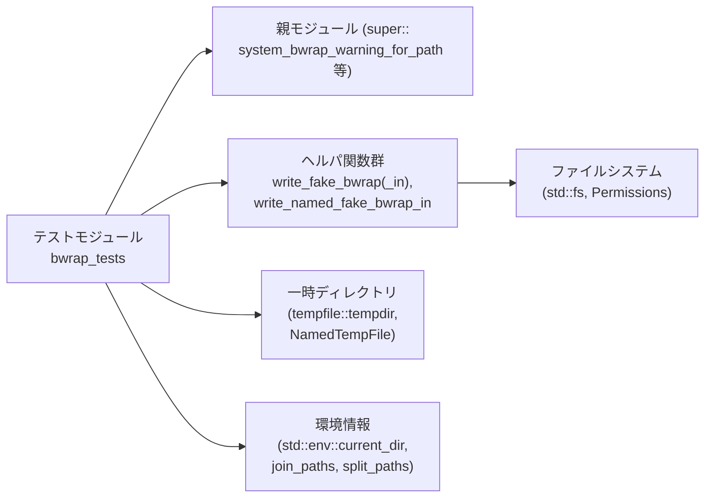
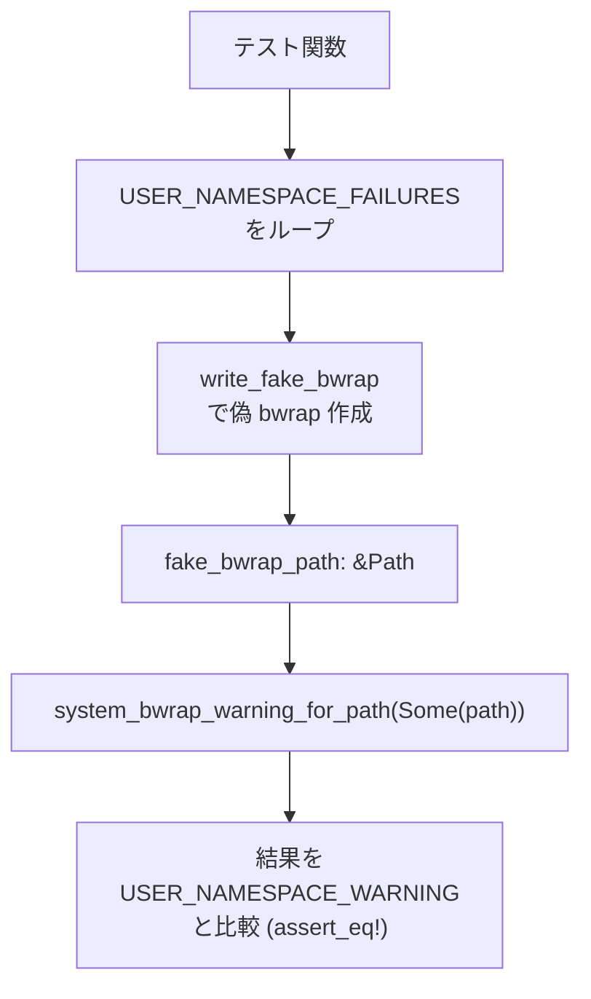
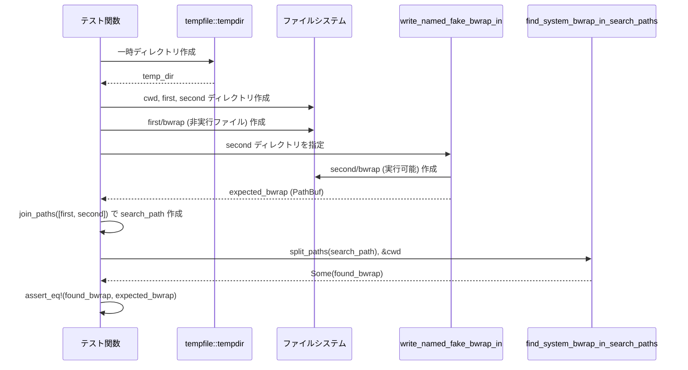
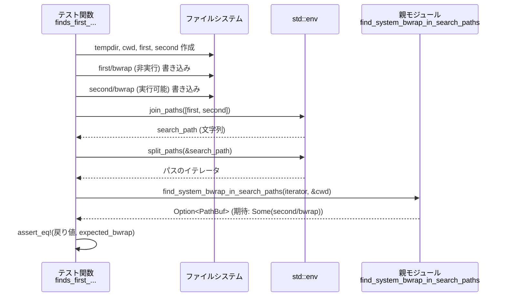

# sandboxing/src/bwrap_tests.rs コード解説

## 0. ざっくり一言

`bubblewrap (bwrap)` 実行ファイルの有無・エラーメッセージ・検索パス処理に関するロジックを検証するテスト群と、そのための「偽 bwrap」シェルスクリプトを作るヘルパ関数をまとめたモジュールです（`sandboxing/src/bwrap_tests.rs:L1-118`）。

---

## 1. このモジュールの役割

### 1.1 概要

- このモジュールは **システムの bwrap 実行ファイル検出と警告生成ロジック** を検証する単体テストを提供します。
- 具体的には、親モジュールに定義された
  - `system_bwrap_warning_for_path`
  - `find_system_bwrap_in_search_paths`
  - `MISSING_BWRAP_WARNING`
  - `USER_NAMESPACE_FAILURES`
  - `USER_NAMESPACE_WARNING`
  をテストします（`super::*` のインポート、`sandboxing/src/bwrap_tests.rs:L1`）。
- テストのために、実際の `bwrap` の代わりに実行可能なシェルスクリプトファイルを生成するヘルパ関数群を定義しています（`write_fake_bwrap*`, `write_named_fake_bwrap_in`、`L83-117`）。

### 1.2 アーキテクチャ内での位置づけ

このモジュールは「テストコード → 親モジュールのロジック → OS/ファイルシステム」という流れで動作します。



- テスト関数は親モジュールの API を呼び出し、その挙動を `pretty_assertions::assert_eq` で検証します（`L7-13`, `L15-32`, `L34-45`, `L47-64`, `L66-80`）。
- ヘルパ関数は一時ファイル／ディレクトリを作成し、そこに実行可能なスクリプトとして「偽 bwrap」を配置します（`L90-107`, `L109-117`）。

### 1.3 設計上のポイント

コードから読み取れる設計上の特徴は次のとおりです。

- **テスト補助ヘルパの切り出し**  
  - 複数のテストで共通する「偽 bwrap スクリプトの生成」を `write_fake_bwrap*` / `write_named_fake_bwrap_in` にまとめています（`L83-88`, `L90-107`, `L109-117`）。
- **実環境依存性の吸収**  
  - Bazel のように `/tmp` が `noexec` でマウントされる環境を考慮し、カレントディレクトリを優先して一時実行ファイルを作成し、失敗時のみ標準のテンポラリにフォールバックします（コメントと `NamedTempFile::new_in` の使用、`L95-100`）。
- **エラーハンドリング方針**  
  - テスト内では `expect` / `assert_eq!` を用い、失敗時にはテストを即座に panic させるスタイルです（例: `tempdir().expect("temp dir")` `L49`, `fs::write(...).expect("write fake bwrap")` `L103`）。
- **プラットフォーム依存の明示的使用**  
  - 実行権限の設定に `std::os::unix::fs::PermissionsExt` を用いており、Unix 系 OS を前提としたテストであることが読み取れます（`L91-93`, `L110-111`）。

---

## 2. 主要な機能一覧（コンポーネントインベントリー）

### 2.1 機能の概要

- bwrap 警告メッセージの検証:
  - bwrap が見つからない場合に適切な警告を返すかをテスト（`L7-13`）。
  - bwrap 実行時にユーザ名前空間関連エラーが出た場合の警告をテスト（`L15-32`）。
  - 関係ないエラーメッセージの場合に警告が出ないことをテスト（`L34-45`）。
- bwrap 実行ファイルの検索ロジック検証:
  - 検索パス中の最初の実行可能 bwrap を選択することをテスト（`L47-64`）。
  - カレントディレクトリ配下（ワークスペースローカル）の `bwrap` をスキップし、信頼ディレクトリのものを選ぶことをテスト（`L66-80`）。
- ヘルパ関数:
  - カレントディレクトリ優先で「偽 bwrap」を作るヘルパ（`write_fake_bwrap`、`L83-88`）。
  - 任意ディレクトリに実行可能な一時ファイルとして「偽 bwrap」を作るヘルパ（`write_fake_bwrap_in`、`L90-107`）。
  - 任意ディレクトリに名前付き `bwrap` 実行ファイルを作るヘルパ（`write_named_fake_bwrap_in`、`L109-117`）。

### 2.2 関数・テスト一覧（行番号付き）

| 名前 | 種別 | シグネチャ（概要） | 役割 / 用途 | 行範囲 |
|------|------|--------------------|-------------|--------|
| `system_bwrap_warning_reports_missing_system_bwrap` | テスト | `fn ()` | `None` を渡したときに `MISSING_BWRAP_WARNING` が返るか検証 | `sandboxing/src/bwrap_tests.rs:L7-13` |
| `system_bwrap_warning_reports_user_namespace_failures` | テスト | `fn ()` | `USER_NAMESPACE_FAILURES` に含まれるエラーメッセージを標準エラーに出す偽 bwrap に対し、`USER_NAMESPACE_WARNING` が返るか検証 | `L15-32` |
| `system_bwrap_warning_skips_unrelated_bwrap_failures` | テスト | `fn ()` | 関係ない bwrap エラー（Unknown option）では警告が `None` となることを検証 | `L34-45` |
| `finds_first_executable_bwrap_in_joined_search_path` | テスト | `fn ()` | PATH 相当の検索パスから最初の「実行可能な」bwrap を選ぶことを検証 | `L47-64` |
| `skips_workspace_local_bwrap_in_joined_search_path` | テスト | `fn ()` | カレントディレクトリ配下の bwrap をスキップし、信頼ディレクトリの bwrap を選ぶことを検証 | `L66-80` |
| `write_fake_bwrap` | ヘルパ | `fn (&str) -> tempfile::TempPath` | カレントディレクトリ優先で、指定したシェルスクリプト内容の偽 bwrap を一時ファイルとして作成 | `L83-88` |
| `write_fake_bwrap_in` | ヘルパ | `fn (&Path, &str) -> tempfile::TempPath` | 指定ディレクトリ（失敗時はデフォルト temp）に実行可能な一時ファイルとして偽 bwrap を作成 | `L90-107` |
| `write_named_fake_bwrap_in` | ヘルパ | `fn (&Path) -> PathBuf` | 指定ディレクトリに `bwrap` という名前で実行可能ファイルを作成し、正規化パスを返す | `L109-117` |

> 行範囲は、このチャンク内での概算です。

---

## 3. 公開 API と詳細解説

本ファイルはテストモジュールであり crate 外向けの「公開 API」は定義していませんが、テストで頻繁に使われるヘルパ関数と、親モジュールのコアロジックを検証するテスト関数について解説します。

### 3.1 型一覧（このファイルで頻出する型）

このファイル自体で新しい構造体・列挙体は定義されていません。主に以下の外部型が使われています。

| 名前 | 定義元 | 種別 | 役割 / 用途 | 使用箇所 |
|------|--------|------|-------------|----------|
| `Path` | `std::path` | 構造体 | パスの借用ビュー。ヘルパ関数への引数や `split_paths` の要素型として使用 | `L3`, `L24`, `L42`, `L90`, `L109` |
| `PathBuf` | `std::path` | 構造体 | パスの所有型。`current_dir` の結果や戻り値として使用 | `L4`, `L85`, `L109-117` |
| `TempPath` | `tempfile` クレート | 構造体 | 一時ファイルのパスで、スコープ終了時に自動削除される所有型 | 戻り値として `write_fake_bwrap`, `write_fake_bwrap_in` から返却（`L83-88`, `L90-107`） |
| `NamedTempFile` | `tempfile` クレート | 構造体 | 名前付き一時ファイル。`into_temp_path` で `TempPath` に変換 | `L93`, `L98-102` |

親モジュールの型・定数（`MISSING_BWRAP_WARNING`, `USER_NAMESPACE_FAILURES`, `USER_NAMESPACE_WARNING` など）は `super::*` 経由でインポートされていますが、定義はこのチャンクには現れません。

### 3.2 関数詳細（主要 7 件）

#### `system_bwrap_warning_reports_user_namespace_failures()`

**概要**

- 親モジュールの `system_bwrap_warning_for_path` 関数が、ユーザ名前空間関連の失敗メッセージを検出して、期待される警告 `USER_NAMESPACE_WARNING` を返すことを検証するテストです（`L15-32`）。

**引数**

なし（Rust のテスト関数の標準形です）。

**戻り値**

- `()`（ユニット型）。テストに成功すれば何も返さず終了し、失敗すれば `assert_eq!` による panic でテストが落ちます。

**内部処理の流れ**

1. 定数 `USER_NAMESPACE_FAILURES` をループします（`for failure in USER_NAMESPACE_FAILURES {` `L17`）。
2. 各 `failure` 文字列をシェルスクリプトに埋め込み、標準エラーにその文字列を出力して `exit 1` するシェルスクリプトを `write_fake_bwrap` で一時ファイルとして作成します（`L18-23`, `L83-88`）。
3. 返ってきた `TempPath` を `as_ref()` で `&Path` に変換します（`L24`）。
4. 親モジュールの `system_bwrap_warning_for_path(Some(fake_bwrap_path))` を呼び出します（`L26-27`）。
5. 戻り値が `Some(USER_NAMESPACE_WARNING.to_string())` と等しいことを `assert_eq!` で検証します（`L26-29`）。メッセージの third 引数に `"{failure}"` を渡し、失敗時にどの failure が原因かが表示されるようになっています（`L29`）。



**Examples（使用例）**

この関数自体はテストランナー（`cargo test` 等）から自動的に呼び出されることを前提としています。外部から直接呼び出す場面は想定されていませんが、テスト内のパターンは次のように再利用できます。

```rust
// USER_NAMESPACE_FAILURES に含まれる一つのメッセージを仮定
let failure = "bwrap: Creating new user namespace failed";        // 想定されるエラーメッセージ

// 偽の bwrap シェルスクリプトを生成
let fake_bwrap = write_fake_bwrap(&format!(
    "#!/bin/sh\n\
     echo '{failure}' >&2\n\
     exit 1\n"
));                                                                // fake_bwrap は TempPath

let fake_bwrap_path: &std::path::Path = fake_bwrap.as_ref();       // TempPath を &Path として借用

// 親モジュールの警告生成ロジックを呼び出す
let warning = system_bwrap_warning_for_path(Some(fake_bwrap_path)); // 戻り値は Option<_> と推測される

assert_eq!(
    warning,
    Some(USER_NAMESPACE_WARNING.to_string())
);                                                                  // ユーザ名前空間警告が得られることを確認
```

> `system_bwrap_warning_for_path` の戻り値型はこのチャンクには定義がありませんが、`Some(…to_string())` との `assert_eq!` から `Option<String>` 互換の型であると考えられます。

**Errors / Panics**

- `write_fake_bwrap` 内部でファイル作成や書き込みに失敗すると `expect("temp file")` / `expect("write fake bwrap")` により panic します（`L98-100`, `L103`）。
- 親モジュールの `system_bwrap_warning_for_path` が `panic` する場合（例えば、ファイル実行失敗の取り扱いによっては）、このテストも同時に失敗します。この挙動の詳細はこのチャンクからは分かりません。
- `assert_eq!` による比較が失敗するとテストが失敗し、詳細な差分が `pretty_assertions::assert_eq` により表示されます（`L2`, `L26-30`）。

**Edge cases（エッジケース）**

- `USER_NAMESPACE_FAILURES` が空配列の場合：ループ本体が一度も実行されず、テストは常に成功します（`L17`）。この場合、実質的に検証が行われなくなります。
- `USER_NAMESPACE_FAILURES` に同じメッセージが複数回含まれている場合：それぞれの要素について同じテストが繰り返されます。
- 偽 bwrap が何らかの理由で実行できない場合：`system_bwrap_warning_for_path` の実装によっては異なるエラー経路に入る可能性がありますが、詳細はこのチャンクにはありません。

**使用上の注意点**

- このテスト関数はファイルシステムとプロセス実行（bwrap 実行）に依存した統合テストに近い性質を持ちます。テスト実行環境に `sh` が必要です（シェルスクリプトを実行するため、`L18-22`）。
- テストの安定性のため、`USER_NAMESPACE_FAILURES` の内容と偽 bwrap スクリプトのフォーマットを同期させる必要があります。

---

#### `system_bwrap_warning_skips_unrelated_bwrap_failures()`

**概要**

- bwrap のエラーメッセージがユーザ名前空間とは無関係なものである場合には、`system_bwrap_warning_for_path` が警告を返さない（`None` を返す）ことを検証するテストです（`L34-45`）。

**引数**

なし。

**戻り値**

- `()`（ユニット型）。テスト成功時は何も返しません。

**内部処理の流れ**

1. 偽の bwrap スクリプトを `write_fake_bwrap` で作成します（`L36-41`）。このスクリプトは標準エラーに `"bwrap: Unknown option --argv0"` と出力し、終了コード 1 で終了します（`L37-40`）。
2. 返った `TempPath` から `&Path` を取得します（`L42`）。
3. `system_bwrap_warning_for_path(Some(fake_bwrap_path))` を呼び出します（`L44`）。
4. 戻り値が `None` であることを `assert_eq!` で検証します（`L44`）。

**Errors / Panics**

- 偽 bwrap ファイルの作成・書き込みが失敗すると `write_fake_bwrap` 内部で panic します（`L98-100`, `L103`）。
- `assert_eq!(…, None)` が失敗した場合、つまり、何らかの警告が返ってきた場合はテストが失敗します。

**Edge cases**

- `system_bwrap_warning_for_path` が、未知のエラーにも何らかの汎用警告を返す実装に変更された場合、このテストは意図的に失敗します。その場合、テスト側も仕様変更に合わせて更新する必要があります。

**使用上の注意点**

- 偽 bwrap のエラーメッセージ `"Unknown option --argv0"` は「ユーザ名前空間とは無関係なエラー」の例として使われています。実際の仕様変更に伴い、「スキップすべきエラー」の条件が変わる場合、このメッセージも見直す必要があります。

---

#### `finds_first_executable_bwrap_in_joined_search_path()`

**概要**

- PATH 相当の検索パスから bwrap 実行ファイルを探すロジック `find_system_bwrap_in_search_paths` が、「最初に見つかった実行可能ファイル」を正しく選択することを検証するテストです（`L47-64`）。

**引数**

なし。

**戻り値**

- `()`（ユニット型）。テスト成功時は何も返しません。

**内部処理の流れ**

1. 一時ディレクトリ `temp_dir` を作成します（`tempdir().expect("temp dir")` `L49`）。
2. その下に `cwd`, `first`, `second` の 3 つのディレクトリを作成します（`L50-55`）。
3. `first` ディレクトリに `bwrap` という名前の **実行不可** なファイル（単に文字列 `"not executable"` を書いたファイル）を作成します（`L56`）。
4. `second` ディレクトリには、`write_named_fake_bwrap_in` を使って実行可能な `bwrap` ファイルを作成し、その正規化パスを `expected_bwrap` として保持します（`L57`, `L109-117`）。
5. `first` と `second` のディレクトリを `std::env::join_paths` で結合し、検索パス文字列 `search_path` を作成します（`L58`）。
6. `std::env::split_paths(&search_path)` で検索パスを `Iterator<Item=PathBuf>` に変換し、`cwd` とともに `find_system_bwrap_in_search_paths` に渡します（`L61-62`）。
7. 戻り値が `Some(expected_bwrap)` であることを検証します（`L60-63`）。



**Errors / Panics**

- 一時ディレクトリや各サブディレクトリの作成に失敗した場合、`expect("temp dir")` や `expect("create cwd")` 等により panic します（`L49-55`）。
- `std::env::join_paths` が失敗すると（パスに不正文字がある等）、`expect("join search path")` により panic します（`L58`）。
- `find_system_bwrap_in_search_paths` が `None` を返したり、別のパスを返した場合、`assert_eq!` によりテストが失敗します（`L60-63`）。

**Edge cases**

- `first` ディレクトリの `bwrap` に実行権限を付けるように変更すると、このテストは `first/bwrap` を選ぶべき仕様になるため、期待値 `expected_bwrap` を変更する必要があります。
- 検索パスが非常に長い場合のパフォーマンスについてはこのテストでは検証していませんが、`split_paths` の使用から、OS の PATH 処理に準じた挙動になると考えられます。

**使用上の注意点**

- `find_system_bwrap_in_search_paths` の挙動を変える（例: 実行不可ファイルも候補に含める）場合、このテストは仕様変更を検出する役割を果たします。実装変更後はテストの期待値も合わせて見直す必要があります。

---

#### `skips_workspace_local_bwrap_in_joined_search_path()`

**概要**

- PATH の先頭にカレントディレクトリ（ワークスペース）を含めつつも、その中の `bwrap` 実行ファイルは信頼できないものとしてスキップし、信頼ディレクトリ（ここでは `trusted`）にある bwrap を選ぶことを検証するテストです（`L66-80`）。

**引数**

なし。

**戻り値**

- `()`（ユニット型）。

**内部処理の流れ**

1. 一時ディレクトリ `temp_dir` を作成します（`L68`）。
2. その下に `cwd` と `trusted` ディレクトリを作成します（`L69-72`）。
3. `cwd` に `write_named_fake_bwrap_in(&cwd)` で bwrap 実行ファイルを作成しますが、戻り値は `_workspace_bwrap` として未使用（意図的に捨てています、`L73`）。
4. `trusted` にも同様に bwrap 実行ファイルを作成し、そのパスを `expected_bwrap` として保持します（`L74`）。
5. PATH 風の検索パスを `[cwd.clone(), trusted_dir]` から `join_paths` で生成します（`L75`）。
6. `split_paths` でイテレータに変換し、`cwd` とともに `find_system_bwrap_in_search_paths` に渡します（`L78`）。
7. 戻り値が `Some(expected_bwrap)` であることを検証します（`L77-80`）。

**Errors / Panics**

- ディレクトリ作成や `write_named_fake_bwrap_in` 内部のファイル作成が失敗すると `expect` によって panic します（`L68-74`, `L109-117`）。
- `join_paths` が失敗すると `expect("join search path")` により panic します（`L75`）。
- `find_system_bwrap_in_search_paths` がワークスペース内の bwrap を選んでしまった場合、または何も見つけられなかった場合は `assert_eq!` によりテストが失敗します（`L77-80`）。

**Edge cases**

- `find_system_bwrap_in_search_paths` が「ワークスペース内の bwrap も信頼する」仕様に変更された場合、このテストは仕様と矛盾するようになります。その際はテストを削除するか、期待値を変更する必要があります。
- `cwd` と `trusted_dir` が実際のファイルシステム上で同じディレクトリを指してしまうような環境（シンボリックリンクなど）があるとテスト結果が影響を受ける可能性がありますが、ここでは `temp_dir` の子ディレクトリとして素直に作っているため通常は問題になりません。

**使用上の注意点**

- 「ワークスペースローカル bwrap をスキップする」という仕様はセキュリティ上の要件に基づいている可能性があります（テスト名からの推測）。この仕様を変える場合は、親モジュールの設計意図を確認した上で慎重に判断する必要があります。

---

#### `write_fake_bwrap(contents: &str) -> tempfile::TempPath`

**概要**

- 現在の作業ディレクトリを優先して、一時的な偽 bwrap 実行ファイルを作成する便利ヘルパです（`L83-88`）。

**引数**

| 引数名 | 型 | 説明 |
|--------|----|------|
| `contents` | `&str` | 作成する偽 bwrap ファイルに書き込むシェルスクリプトなどの文字列 |

**戻り値**

- `tempfile::TempPath`  
  一時ファイルのパスです。`TempPath` の所有権が呼び出し元に移り、スコープを抜けるとファイルが削除されます（tempfile クレートの標準的挙動）。

**内部処理の流れ**

1. `std::env::current_dir()` でカレントディレクトリを取得します（`L84-85`）。
2. 取得に失敗した場合は `"."` を指す `PathBuf::from(".")` を使います（`unwrap_or_else` `L85`）。
3. 上記で得たディレクトリと `contents` を `write_fake_bwrap_in` に渡して実際のファイル作成を行います（`L84-87`）。

**Examples（使用例）**

```rust
// 標準エラーにエラーを出力して終了する偽 bwrap を作る
let fake_bwrap = write_fake_bwrap(
    "#!/bin/sh\n\
     echo 'bwrap: Some error' >&2\n\
     exit 1\n"
);                                                        // fake_bwrap: TempPath

let fake_bwrap_path: &std::path::Path = fake_bwrap.as_ref(); // 実際のパスが必要な場合は &Path として借用する

// 親モジュールのロジックに渡す
let warning = system_bwrap_warning_for_path(Some(fake_bwrap_path));
```

**Errors / Panics**

- `std::env::current_dir()` の失敗は `unwrap_or_else` で捕捉され、 `"."` にフォールバックするため panic にはなりません（`L84-85`）。
- 実際のファイル作成処理は `write_fake_bwrap_in` に委譲されており、そこで `NamedTempFile::new_in` が失敗し、かつ `NamedTempFile::new()` が `expect("temp file")` で panic する可能性があります（`L98-100`）。
- 書き込みや `chmod` に失敗すると `expect("write fake bwrap")` / `expect("chmod fake bwrap")` により panic します（`L103-105`）。

**Edge cases**

- カレントディレクトリが存在しない、またはアクセス権がない場合：`NamedTempFile::new_in(dir)` が `None` を返し、デフォルトのテンポラリディレクトリで再試行されます（`ok().unwrap_or_else(…)` `L98-100`）。
- Bazel などで OS の temp ディレクトリが `noexec` マウントされている場合：コメントにあるように、カレントディレクトリを優先することでこの問題を回避しようとしています（`L95-97`）。

**使用上の注意点**

- この関数はテスト用の偽実行ファイルを作る目的で使用されています。本番コードで使用することは想定されていません。
- 生成されるファイルは実行可能権限を持つため、CWD が不用意に共有されている環境では注意が必要です（セキュリティ観点）。

---

#### `write_fake_bwrap_in(dir: &Path, contents: &str) -> tempfile::TempPath`

**概要**

- 指定されたディレクトリを優先して、実行可能な偽 bwrap ファイルを一時ファイルとして作成するヘルパ関数です（`L90-107`）。

**引数**

| 引数名 | 型 | 説明 |
|--------|----|------|
| `dir` | `&Path` | 一時ファイルを作成したいディレクトリ。ここが `noexec` である可能性も考慮されます。 |
| `contents` | `&str` | 偽 bwrap ファイルの中身（シェルスクリプトなど） |

**戻り値**

- `tempfile::TempPath`  
  作成された一時ファイルのパス。ファイルには実行権限（`0o755`）が付与されます（`L104-105`）。

**内部処理の流れ**

1. モジュールローカルに `std::fs`, `PermissionsExt`, `NamedTempFile` をインポートします（`L91-93`）。
2. コメントの通り、Bazel 等で OS テンポラリディレクトリが `noexec` でマウントされているケースを考慮し、まず `NamedTempFile::new_in(dir)` を試みます（`L95-99`）。
3. `new_in(dir)` が `Err` を返した場合は `ok()` により `None` になり、`unwrap_or_else` 経由で `NamedTempFile::new()` を呼び出し、標準の temp ディレクトリに一時ファイルを作成します（`L98-100`）。
4. 得られた `NamedTempFile` を `into_temp_path()` で `TempPath` に変換し、書き込み中にファイルが開かれた状態で `exec` されることを避けます（`L101-102`）。
5. `fs::write(&path, contents)` で `contents` をファイルに書き込みます（`L103`）。
6. `fs::Permissions::from_mode(0o755)` で実行可能権限を作成し、`fs::set_permissions(&path, permissions)` で付与します（`L104-105`）。
7. `path`（`TempPath`）を返します（`L106`）。

**Examples（使用例）**

```rust
use std::path::Path;

// あるテスト専用ディレクトリに偽 bwrap を作成する例
let dir = Path::new("/tmp/test-bwrap-dir");                       // 実在するディレクトリを想定
std::fs::create_dir_all(dir).expect("create test dir");           // なければ作成

let fake_bwrap = write_fake_bwrap_in(
    dir,
    "#!/bin/sh\n\
     echo 'bwrap: simulated failure' >&2\n\
     exit 1\n"
);                                                                 // dir 内に実行可能な一時ファイルができる

let fake_bwrap_path: &Path = fake_bwrap.as_ref();                  // &Path として利用
```

**Errors / Panics**

- `NamedTempFile::new_in(dir)` が失敗し、かつフォールバックの `NamedTempFile::new()` も失敗した場合、`expect("temp file")` で panic します（`L98-100`）。
- ファイルへの書き込みが失敗した場合は `expect("write fake bwrap")` で panic（`L103`）。
- 権限の設定が失敗した場合は `expect("chmod fake bwrap")` で panic（`L104-105`）。

**Edge cases**

- `dir` が存在しない・権限がない場合：`NamedTempFile::new_in(dir)` が失敗し、標準 temp ディレクトリへのフォールバックが行われます。
- 実行中の OS が Unix 以外（Windows 等）の場合、`PermissionsExt::from_mode` がコンパイルエラーになるため、このコードは Unix 専用であると考えられます。

**使用上の注意点**

- `dir` に `noexec` マウントされたディレクトリを渡しても、ファイルシステム上の制限により最終的に実行できない可能性があります。その場合でもこの関数自体はエラーとして扱わず、作成だけを行います。
- 実行可能権限を付けるため、テスト用とはいえディレクトリの選択には注意が必要です（マルチユーザ環境で共有されるディレクトリなど）。

---

#### `write_named_fake_bwrap_in(dir: &Path) -> PathBuf`

**概要**

- 指定されたディレクトリに `bwrap` という固定ファイル名で実行可能なシェルスクリプトファイルを作り、その正規化されたパスを返すヘルパ関数です（`L109-117`）。

**引数**

| 引数名 | 型 | 説明 |
|--------|----|------|
| `dir` | `&Path` | `bwrap` ファイルを作成したいディレクトリ |

**戻り値**

- `PathBuf`  
  作成された `bwrap` ファイルの正規化されたパス (`fs::canonicalize` の結果) です（`L117`）。

**内部処理の流れ**

1. `std::fs` と `PermissionsExt` をローカルインポートします（`L110-111`）。
2. `dir.join("bwrap")` で `bwrap` というファイル名のパスを構築します（`L113`）。
3. `fs::write(&path, "#!/bin/sh\n")` で、shebang 行のみのシンプルなシェルスクリプトを書き込みます（`L114`）。
4. `Permissions::from_mode(0o755)` で実行可能権限を用意し、`set_permissions` で付与します（`L115`）。
5. `fs::canonicalize(path)` でパスを正規化し、その結果を返します（`L116-117`）。

**Examples（使用例）**

```rust
use std::path::Path;

// second ディレクトリに実行可能な bwrap を作成する
let dir = Path::new("second");
std::fs::create_dir_all(dir).expect("create second dir");

let bwrap_path: std::path::PathBuf = write_named_fake_bwrap_in(dir); // second/bwrap の正規化パス

assert!(bwrap_path.ends_with("bwrap"));                              // ファイル名は bwrap である
```

**Errors / Panics**

- `fs::write` が失敗すると `expect("write fake bwrap")` により panic します（`L114`）。
- `set_permissions` が失敗すると `expect("chmod fake bwrap")` により panic します（`L115`）。
- `fs::canonicalize` が失敗すると `expect("canonicalize fake bwrap")` により panic します（`L116-117`）。

**Edge cases**

- `dir` が存在しない場合：`dir.join("bwrap")` 自体はエラーになりませんが、その後の `fs::write` でディレクトリ不在が原因のエラーとなり、panic に繋がります。通常は呼び出し側で `create_dir_all` 等を行ってから使う想定です（実際に `L52-55`, `L71-72` でそうしています）。
- すでに `dir` に `bwrap` ファイルが存在する場合：上書きが行われます（`fs::write` の挙動）。この点は上書き許容前提のヘルパであると読み取れます。

**使用上の注意点**

- ディレクトリの事前作成が必要です。
- 正規化パスを返すため、シンボリックリンクを含むパス構造に依存している場合には、呼び出し後のパスが元の期待通りか確認する必要があります。

---

#### `find_system_bwrap_in_search_paths` をテストする他の関数

上記で詳細説明した `finds_first_executable_bwrap_in_joined_search_path` と `skips_workspace_local_bwrap_in_joined_search_path` が、この親関数の主要なふるまい（実行可能性チェックとワークスペースのスキップ）をカバーしています。

---

### 3.3 その他の関数

詳細テンプレートは割愛しますが、補助的または単純なテスト関数をまとめます。

| 関数名 | 役割（1 行） | 行範囲 |
|--------|--------------|--------|
| `system_bwrap_warning_reports_missing_system_bwrap` | `system_bwrap_warning_for_path(None)` が `Some(MISSING_BWRAP_WARNING.to_string())` を返すことを検証するテスト | `L7-13` |

---

## 4. データフロー

ここでは、代表的なシナリオとして「検索パスから実行可能な bwrap を見つけて返す」テストのデータフローを説明します（`finds_first_executable_bwrap_in_joined_search_path`, `L47-64`）。

1. テスト関数が一時ディレクトリ配下に `cwd`, `first`, `second` を作成し、`first` に非実行ファイル `bwrap`, `second` に実行可能ファイル `bwrap` を配置します。
2. `join_paths([first, second])` で OS の PATH ライクな文字列を構成します。
3. `split_paths` により PATH 文字列を `Iterator<Item=PathBuf>` に変換します。
4. 親モジュールの `find_system_bwrap_in_search_paths` が、このイテレータと `cwd` を受け取り、内部でファイルの存在・実行可能性・ワークスペースとの関係などを判定して、適切な `PathBuf` を返します。
5. テストはその戻り値が `expected_bwrap`（`second` 内の bwrap）と一致するかどうかを検証します。



このフローから分かるポイント:

- **I/O 境界**: テスト側がファイルシステムを準備し、親モジュールは主に「どのパスを選ぶか」のロジックに集中していると考えられます（実装はこのチャンクにはありません）。
- **安全性**: 実行可能／非実行ファイルを切り分けることで、誤ったバイナリ選択を防ぐロジックの検証が行われています。

---

## 5. 使い方（How to Use）

このファイルはテストコードですが、同様のパターンで新しいテストを追加することができます。

### 5.1 基本的な使用方法（ヘルパ関数の利用）

`write_fake_bwrap` と `write_fake_bwrap_in` を使ったテストの典型的な流れは以下の通りです。

```rust
use std::path::Path;
use tempfile::tempdir;

// 1. テスト用の一時ディレクトリを作る
let temp_dir = tempdir().expect("temp dir");
// 2. その中にテスト用のディレクトリを作る
let dir = temp_dir.path().join("case");
std::fs::create_dir_all(&dir).expect("create case dir");

// 3. そのディレクトリに偽 bwrap を作成する
let fake_bwrap = write_fake_bwrap_in(
    &dir,
    "#!/bin/sh\n\
     echo 'bwrap: some error' >&2\n\
     exit 1\n"
);                                                               // TempPath として返る

// 4. 親モジュールのロジックにパスを渡す
let fake_bwrap_path: &Path = fake_bwrap.as_ref();
let warning = system_bwrap_warning_for_path(Some(fake_bwrap_path));

// 5. 戻り値を検証する
assert_eq!(warning, None);                                       // 期待される挙動を設定
```

### 5.2 よくある使用パターン

- **エラーメッセージに応じた警告のテスト**  
  - 偽 bwrap の `stderr` に異なるメッセージを出力するスクリプトを複数用意し、`system_bwrap_warning_for_path` の戻り値を比較する（`L15-32`, `L34-45` のパターン）。
- **検索パスと CWD に依存した検証**  
  - `tempdir` 配下に複数ディレクトリを作り、それぞれに異なる性質の `bwrap` ファイルを配置して `find_system_bwrap_in_search_paths` の挙動を細かく検証する（`L47-64`, `L66-80`）。

### 5.3 よくある間違いと注意点

```rust
// 間違い例: ディレクトリを作成せずに write_named_fake_bwrap_in を呼ぶ
let dir = std::path::Path::new("/path/does/not/exist");
// パニックの可能性が高い: "write fake bwrap" の expect が失敗する
// let bwrap = write_named_fake_bwrap_in(dir);

// 正しい例: 事前にディレクトリを作っておく
std::fs::create_dir_all(dir).expect("create dir");
let bwrap = write_named_fake_bwrap_in(dir);             // これで成功する想定
```

```rust
// 間違い例: TempPath の寿命が切れた後にパスを使おうとする
let fake_bwrap_path = {
    let fake = write_fake_bwrap("#!/bin/sh\nexit 0\n");
    fake.as_ref().to_path_buf()                         // PathBuf にコピーせず &Path を外に持ち出すと危険
};
// fake のスコープ終了後、ファイルは削除されるため path は無効になっている可能性がある

// 正しい例: 必要なら PathBuf にコピーしておく
let fake = write_fake_bwrap("#!/bin/sh\nexit 0\n");
let fake_bwrap_path = fake.as_ref().to_path_buf();      // 所有権を持った PathBuf にコピー
// fake がドロップされるとファイル自体は削除されるが、テスト内で即座に使うなら問題ない設計かどうか確認が必要
```

> 実際の削除タイミングや `TempPath` の挙動の詳細は tempfile クレートの仕様に依存します。

### 5.4 モジュール全体としての注意点

- **並行実行（tests の並列性）**  
  - `write_fake_bwrap` は `current_dir()` を使用するため、複数テストが同じ CWD を共有しつつ並行実行される場合でも `NamedTempFile` によりファイル名が一意になるよう設計されていますが、CWD 自体をテスト間で変更するコードが存在すると競合の恐れがあります。
- **エラー処理**  
  - すべての I/O エラーが `expect` による panic に変換されているため、「テストが落ちる＝環境問題またはバグ」という前提に基づいた実装です。
- **セキュリティ**  
  - テストとはいえ実行可能ファイルを作成するため、CI 環境や共有マシンでの権限設定には注意が必要です。特に `current_dir()` を使用する `write_fake_bwrap` は、CWD が信頼できるディレクトリである前提があります（`L84-85`）。

---

## 6. 変更の仕方（How to Modify）

### 6.1 新しいテストを追加する場合

1. **シナリオを決める**  
   - 例: 新しい種類の bwrap エラーに対する警告挙動をテストする。
2. **必要なヘルパを選ぶ**  
   - エラーメッセージに応じた偽 bwrap を作りたい場合は `write_fake_bwrap` または `write_fake_bwrap_in` を利用（`L83-88`, `L90-107`）。
   - 固定名 `bwrap` を特定ディレクトリに置きたい場合は `write_named_fake_bwrap_in` を利用（`L109-117`）。
3. **一時ディレクトリ・パスを準備する**  
   - `tempdir` と `create_dir_all` を使ってテスト専用のディレクトリ構造を作る（`L47-55`, `L68-72`）。
4. **親モジュールの関数を呼び出す**  
   - `system_bwrap_warning_for_path` や `find_system_bwrap_in_search_paths` を呼び出し、`assert_eq!` で期待結果を検証する。
5. **エラーメッセージや検索パスの仕様に合わせて調整**  
   - 仕様変更に伴い期待値の文字列等を調整する。

### 6.2 既存の機能を変更する場合（テストの観点）

- **影響範囲の確認**  
  - `system_bwrap_warning_for_path` の仕様変更 → `system_bwrap_warning_*` 系テスト（`L7-45`）に影響。
  - `find_system_bwrap_in_search_paths` の仕様変更 → `finds_first_*` と `skips_workspace_local_*` テスト（`L47-80`）に影響。
- **契約（前提条件・返り値）の確認**  
  - 「どういうエラーメッセージでどの警告を返すか」「どのディレクトリを信頼するか」といった仕様を明文化し、それに合わせてテスト名・アサーションを整合させる必要があります。
- **テストの安定性**  
  - ファイルシステム依存部（パスの正規化、権限設定）を変更する場合は、CI 環境（特に Bazel など）での挙動を確認します。コメントにあるように、`noexec` マウント環境を考慮しているためです（`L95-97`）。

---

## 7. 関連ファイル

このモジュールと密接に関係するコンポーネントは次の通りです。

| パス / クレート | 役割 / 関係 |
|----------------|------------|
| `super`（親モジュール。具体的なファイルパスはこのチャンクからは不明） | `system_bwrap_warning_for_path`, `find_system_bwrap_in_search_paths`, `MISSING_BWRAP_WARNING`, `USER_NAMESPACE_FAILURES`, `USER_NAMESPACE_WARNING` などを提供し、本テストから呼び出される（`L1`, `L7-13`, `L15-32`, `L34-45`, `L47-80`）。 |
| `tempfile` クレート | `tempdir`, `NamedTempFile`, `TempPath` を提供し、一時ディレクトリと偽 bwrap 実行ファイルの生成に利用される（`L5`, `L49`, `L90-107`）。 |
| 標準ライブラリ `std::fs`, `std::os::unix::fs::PermissionsExt` | ファイル作成／書き込みと実行権限の付与に使用される（`L90-93`, `L103-105`, `L110-115`）。 |
| 標準ライブラリ `std::env` | カレントディレクトリ取得、PATH 風の文字列の join/split に使用される（`L84-85`, `L58`, `L75`, `L61`, `L78`）。 |
| `pretty_assertions` クレート | `assert_eq!` を拡張し、テスト失敗時に見やすい差分を表示するために使用される（`L2`, `L7-13`, `L15-32`, `L34-45`, `L47-64`, `L66-80`）。 |

このファイルは、親モジュールの bwrap 関連ロジックが正しく動作することを、ファイルシステムと実行可能ファイル生成を伴う形で検証する役割を持っていると整理できます。
