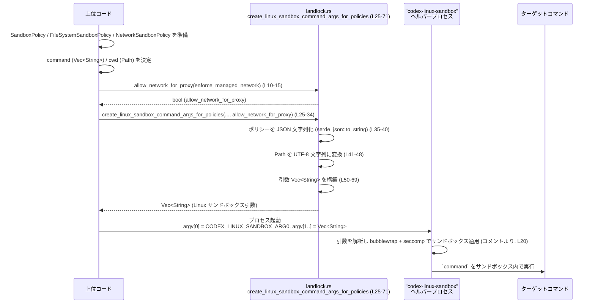

# sandboxing/src/landlock.rs コード解説

## 0. ざっくり一言

Linux 向けサンドボックスヘルパー `codex-linux-sandbox` を起動する際の **コマンドライン引数（`Vec<String>`）を組み立てるモジュール**です。  
サンドボックスポリシー（ファイルシステム／ネットワーク）や実行ディレクトリなどの情報を、ヘルパーの CLI 形式に変換します。

---

## 1. このモジュールの役割

### 1.1 概要

- このモジュールは、Codex のサンドボックスポリシー型（`SandboxPolicy` など）を元に、Linux サンドボックスヘルパー `codex-linux-sandbox` を起動する際の引数リストを生成する役割を持ちます  
  （ドキュメンテーションコメントより: `Converts the sandbox policies into the CLI invocation for codex-linux-sandbox.`  
  `sandboxing/src/landlock.rs:L17-23`）。
- 実際のサンドボックス適用（bubblewrap + seccomp）はヘルパー側で行われ、このモジュールはそのための **設定値のシリアライズと CLI 変換**のみを担当します (`L20-22`)。
- 併せて、「管理されたネットワーク」要件から、プロキシ用のネットワーク許可フラグを導出する薄いラッパ関数も提供します (`L10-15`)。

### 1.2 アーキテクチャ内での位置づけ

コメントおよび依存から読み取れる関係を図示します。

```mermaid
flowchart LR
    A["上位コード（Codex 本体など）"] --> B["landlock::create_linux_sandbox_command_args_for_policies (L25-71)"]
    A --> C["landlock::allow_network_for_proxy (L10-15)"]

    B -->|SandboxPolicy<br>FileSystemSandboxPolicy<br>NetworkSandboxPolicy<br>Path| B
    B --> D["引数ベクタ Vec<String>"]

    A -->|CODEX_LINUX_SANDBOX_ARG0 (L6-8)| E["codex-linux-sandbox プロセス（外部）"]
    D --> E

    E --> F["bubblewrap + seccomp による実サンドボックス適用<br>(コメントより, L20)"]
    E --> G["ターゲットコマンド（`command` 引数で指定）"]
```

- このファイル自身はプロセス起動は行わず、**「引数ベクタを作るだけ」**です。
- `SandboxPolicy` などの型は `codex_protocol` クレートから提供されます (`L1-3`)。
- `codex-linux-sandbox` が実際にどう起動されるか（`Command::new` 等）は、別ファイル（このチャンクには現れない）で実装されていると考えられますが、コードからは詳細は分かりません。

### 1.3 設計上のポイント

コードから読み取れる特徴は次のとおりです。

- **ステートレスな設計**  
  - すべて `pub const`／`fn` であり、グローバルな可変状態や `static mut` はありません (`L6-113`)。
  - 各関数は入力引数だけから出力を決定する純粋関数に近い形で、スレッド間共有の問題を持ちません。

- **エラーハンドリング方針: panic ベース**
  - ポリシーの JSON 変換に失敗した場合は `panic!` します (`serde_json::to_string(...).unwrap_or_else(... panic! ...)`  
    `L35-40`)。
  - パスが UTF-8 で表現できない場合も `panic!` します (`Path::to_str().unwrap_or_else(... panic! ...)`  
    `L41-48`, `L83-90`)。
  - つまり、**戻り値として `Result` などのエラーは返さず、致命的エラーとしてプロセスをクラッシュさせる設計**です。

- **CLI 互換性を重視した引数順・フラグ名**
  - コメントで「Policy JSON flags are emitted before helper feature flags so the argv order matches the helper's CLI shape.」（`L21-22`）と明示されており、
    `--sandbox-policy-cwd` → `--command-cwd` → ポリシー JSON → 機能フラグ → `--` → コマンド、という順に構築しています (`L50-69`)。
  - Landlock に関するフラグ（`--use-legacy-landlock`）とプロキシ向けネットワークフラグ（`--allow-network-for-proxy`）は必要時のみ追加します (`L62-67`, `L98-103`)。

- **Linux 依存・UTF-8 前提**
  - コメントに Linux 固有機能（bubblewrap, seccomp, Landlock）が言及されています (`L20`)。
  - パスとポリシー JSON はすべて UTF-8 文字列で扱われる前提になっており、UTF-8 非対応パスは許容されません (`L41-48`, `L83-90`)。

---

## 2. 主要な機能一覧

- サンドボックスヘルパー名の定数定義: 自己呼び出し時の `arg0` として `"codex-linux-sandbox"` を提供する定数です (`CODEX_LINUX_SANDBOX_ARG0`, `L6-8`)。
- 管理ネットワーク設定からプロキシ用ネットワーク許可フラグを導出: `allow_network_for_proxy` が、管理されたネットワーク要件の有無から `--allow-network-for-proxy` フラグの真偽値を決定します (`L10-15`)。
- ポリシー付きサンドボックスコマンド引数生成:  
  `create_linux_sandbox_command_args_for_policies` が、サンドボックスポリシー（汎用／ファイルシステム／ネットワーク）と実行ディレクトリ等から、`codex-linux-sandbox` 用の CLI 引数 `Vec<String>` を構築します (`L25-71`)。
- ポリシーなし（cwd・オプションのみ）のサンドボックスコマンド引数生成（主にテスト用の可能性）:  
  `create_linux_sandbox_command_args` が、cwd と Landlock/プロキシフラグ、コマンドから最小限の CLI 引数を構築します (`L73-113`)。

### 2.1 コンポーネント一覧（関数・定数）

| 名前 | 種別 | 公開範囲 | 役割 / 用途 | 定義位置 |
|------|------|----------|------------|----------|
| `CODEX_LINUX_SANDBOX_ARG0` | 定数 `&'static str` | `pub` | Codex 実行ファイルが Linux サンドボックスヘルパーとして自己起動する際の `argv[0]` ベース名 (`"codex-linux-sandbox"`) を表す | `sandboxing/src/landlock.rs:L6-8` |
| `allow_network_for_proxy` | 関数 | `pub` | 管理されたネットワーク要件の有無から、サンドボックスヘルパーに渡す `--allow-network-for-proxy` フラグの値を決定する | `sandboxing/src/landlock.rs:L10-15` |
| `create_linux_sandbox_command_args_for_policies` | 関数 | `pub` | サンドボックスポリシー群と cwd 等から、`codex-linux-sandbox` の CLI 引数 `Vec<String>` を構築する | `sandboxing/src/landlock.rs:L17-71` |
| `create_linux_sandbox_command_args` | 関数 | 非公開 (`fn`) | ポリシー JSON を扱わず、cwd とオプション・コマンドから引数ベクタを構築する補助関数。テストから使用される可能性がある（`cfg_attr(not(test), allow(dead_code))` より） | `sandboxing/src/landlock.rs:L73-113` |
| `tests` モジュール | モジュール | `cfg(test)` | テストコードを `landlock_tests.rs` からインクルードする。中身はこのチャンクには現れません | `sandboxing/src/landlock.rs:L115-117` |

外部依存型の一覧（このファイルで利用されるが、定義は別ファイル）:

| 名前 | 所属 | 種別 | 用途 | 出現位置 |
|------|------|------|------|----------|
| `SandboxPolicy` | `codex_protocol::protocol` | 型（詳細不明） | サンドボックス全体のポリシーを表す型。JSON にシリアライズされ CLI 引数として渡される | `sandboxing/src/landlock.rs:L3, L28, L35-36` |
| `FileSystemSandboxPolicy` | `codex_protocol::permissions` | 型（詳細不明） | ファイルシステムに関するサンドボックスポリシー | `sandboxing/src/landlock.rs:L1, L29, L37-38` |
| `NetworkSandboxPolicy` | `codex_protocol::permissions` | 型（詳細不明） | ネットワークに関するサンドボックスポリシー | `sandboxing/src/landlock.rs:L2, L30, L39-40` |
| `Path` | `std::path` | 構造体 | cwd など、ファイルシステム上のパスを扱う | `sandboxing/src/landlock.rs:L4, L27, L31, L45-48, L78-80, L83-90` |

---

## 3. 公開 API と詳細解説

### 3.1 型一覧（構造体・列挙体など）

このファイルには **独自の構造体・列挙体定義はありません**。  
代わりに、公開定数と公開関数が API として提供されています（2.1 参照）。

---

### 3.2 関数詳細

#### `allow_network_for_proxy(enforce_managed_network: bool) -> bool`

**概要**

管理されたネットワーク要件の有無に応じて、Linux サンドボックスヘルパーに渡す `--allow-network-for-proxy` フラグの値を決定します。  
現時点の実装では、単に引数をそのまま返します (`sandboxing/src/landlock.rs:L10-15`)。

```rust
pub fn allow_network_for_proxy(enforce_managed_network: bool) -> bool {
    // When managed network requirements are active, request proxy-only
    // networking from the Linux sandbox helper. Without managed requirements,
    // preserve existing behavior.
    enforce_managed_network
}
```

**引数**

| 引数名 | 型 | 説明 |
|--------|----|------|
| `enforce_managed_network` | `bool` | 「管理されたネットワーク要件が有効かどうか」を表すフラグ。コメントによれば、true の場合に「プロキシ経由のみのネットワーク」を要求する (`L11-13`)。 |

**戻り値**

- 型: `bool`
- 意味: `--allow-network-for-proxy` フラグとしてヘルパーに渡す値。実装では `enforce_managed_network` をそのまま返します (`L14`)。

**内部処理の流れ**

1. コメントに記載された意味付け（管理ネットワーク有効時にプロキシのみ許可）を説明した上で (`L11-13`)、  
2. `enforce_managed_network` をそのまま返します (`L14`)。

条件分岐・副作用はありません。

**Examples（使用例）**

管理されたネットワーク要件の有無から、`create_linux_sandbox_command_args_for_policies` に渡すフラグを導出する例です。

```rust
use codex_protocol::permissions::{FileSystemSandboxPolicy, NetworkSandboxPolicy};
use codex_protocol::protocol::SandboxPolicy;
use std::path::Path;
use sandboxing::landlock::{
    allow_network_for_proxy,
    create_linux_sandbox_command_args_for_policies,
};

fn build_args(
    command: Vec<String>,                                // 実行したいコマンドと引数
    command_cwd: &Path,                                  // コマンドのカレントディレクトリ
    sandbox_policy: &SandboxPolicy,                      // サンドボックスポリシー
    fs_policy: &FileSystemSandboxPolicy,                 // ファイルシステムポリシー
    net_policy: NetworkSandboxPolicy,                    // ネットワークポリシー
    policy_cwd: &Path,                                   // ポリシーの cwd
    enforce_managed_network: bool,                       // 管理ネットワーク要件の有無
) -> Vec<String> {
    let allow_for_proxy = allow_network_for_proxy(enforce_managed_network); // L10-15

    create_linux_sandbox_command_args_for_policies(
        command,
        command_cwd,
        sandbox_policy,
        fs_policy,
        net_policy,
        policy_cwd,
        /* use_legacy_landlock = */ false,
        /* allow_network_for_proxy = */ allow_for_proxy,
    )
}
```

**Errors / Panics**

- この関数内部では `panic!` やエラー生成は行っていません。

**Edge cases（エッジケース）**

- `enforce_managed_network == true` のとき: `true` を返し、ヘルパーに「プロキシ用ネットワーク許可」を要求する値として使えます。
- `enforce_managed_network == false` のとき: `false` を返し、コメントによると「既存の挙動を維持」するための値になります (`L11-13`)。

**使用上の注意点**

- 関数名とコメントから、**引数の意味（管理されたネットワーク要件の有無）をコード上で明示するためのラッパ**として設計されていると解釈できます (`L11-13`)。  
  呼び出し側では、「いつ `true`/`false` にすべきか」をこの意味に基づいて決定するのが自然です。
- 非常に単純な関数であり、スレッドセーフです（共有状態を持ちません）。

---

#### `create_linux_sandbox_command_args_for_policies(...) -> Vec<String>`

```rust
#[allow(clippy::too_many_arguments)]
pub fn create_linux_sandbox_command_args_for_policies(
    command: Vec<String>,
    command_cwd: &Path,
    sandbox_policy: &SandboxPolicy,
    file_system_sandbox_policy: &FileSystemSandboxPolicy,
    network_sandbox_policy: NetworkSandboxPolicy,
    sandbox_policy_cwd: &Path,
    use_legacy_landlock: bool,
    allow_network_for_proxy: bool,
) -> Vec<String> { /* ... */ }
```

**概要**

サンドボックス関連のポリシーと実行ディレクトリ、および Landlock／ネットワークのフラグから、  
Linux サンドボックスヘルパー `codex-linux-sandbox` に渡す **CLI 引数ベクタ (`Vec<String>`)** を生成する関数です (`L17-23`, `L25-71`)。

**引数**

| 引数名 | 型 | 説明 |
|--------|----|------|
| `command` | `Vec<String>` | 実際にサンドボックス内で実行したいコマンドとその引数。`linux_cmd.extend(command)` で `--` の後ろにそのまま連結されます (`L68-69`)。 |
| `command_cwd` | `&Path` | ターゲットコマンドのカレントディレクトリ。UTF-8 文字列に変換され、`--command-cwd` 引数として渡されます (`L45-48`, `L53-54`)。 |
| `sandbox_policy` | `&SandboxPolicy` | サンドボックス全体のポリシー。`serde_json::to_string` で JSON にシリアライズされ、`--sandbox-policy` に渡されます (`L35-36`, `L55-56`)。 |
| `file_system_sandbox_policy` | `&FileSystemSandboxPolicy` | ファイルシステム用サンドボックスポリシー。JSON に変換され、`--file-system-sandbox-policy` に渡されます (`L37-38`, `L57-58`)。 |
| `network_sandbox_policy` | `NetworkSandboxPolicy` | ネットワーク用サンドボックスポリシー。値として受け取り、JSON に変換して `--network-sandbox-policy` に渡します (`L39-40`, `L59-60`)。 |
| `sandbox_policy_cwd` | `&Path` | ポリシーに関連する cwd を表すパス。UTF-8 文字列に変換され、`--sandbox-policy-cwd` として渡されます (`L41-44`, `L51-52`)。 |
| `use_legacy_landlock` | `bool` | true の場合、`--use-legacy-landlock` フラグを追加します (`L62-63`)。 |
| `allow_network_for_proxy` | `bool` | true の場合、`--allow-network-for-proxy` フラグを追加します (`L65-67`)。通常は `allow_network_for_proxy(enforce_managed_network)` の結果が渡される想定です。 |

**戻り値**

- 型: `Vec<String>`
- 内容: `codex-linux-sandbox` ヘルパーに渡す CLI 引数を順序付きで並べたベクタです。  
  基本形は次のようになります（オプションフラグは条件付き）:

  1. `"--sandbox-policy-cwd"`, `sandbox_policy_cwd`
  2. `"--command-cwd"`, `command_cwd`
  3. `"--sandbox-policy"`, `sandbox_policy_json`
  4. `"--file-system-sandbox-policy"`, `file_system_policy_json`
  5. `"--network-sandbox-policy"`, `network_policy_json`
  6. `["--use-legacy-landlock"]` （必要に応じて）
  7. `["--allow-network-for-proxy"]` （必要に応じて）
  8. `"--"` （ヘルパー自身のオプション終端）
  9. その後ろに `command` の中身が続く (`L50-60`, `L62-69`)。

**内部処理の流れ（アルゴリズム）**

```rust
let sandbox_policy_json = serde_json::to_string(sandbox_policy)
    .unwrap_or_else(|err| panic!("failed to serialize sandbox policy: {err}"));
let file_system_policy_json = serde_json::to_string(file_system_sandbox_policy)
    .unwrap_or_else(|err| panic!("failed to serialize filesystem sandbox policy: {err}"));
let network_policy_json = serde_json::to_string(&network_sandbox_policy)
    .unwrap_or_else(|err| panic!("failed to serialize network sandbox policy: {err}"));
```

1. **ポリシーの JSON 文字列化** (`L35-40`)
   - `serde_json::to_string` を用いて、`sandbox_policy`, `file_system_sandbox_policy`, `network_sandbox_policy` を JSON 文字列に変換します。
   - 変換に失敗した場合は `unwrap_or_else` で `panic!("failed to serialize ...")` を発生させます。

```rust
let sandbox_policy_cwd = sandbox_policy_cwd
    .to_str()
    .unwrap_or_else(|| panic!("cwd must be valid UTF-8"))
    .to_string();
let command_cwd = command_cwd
    .to_str()
    .unwrap_or_else(|| panic!("command cwd must be valid UTF-8"))
    .to_string();
```

1. **Path → UTF-8 文字列への変換** (`L41-48`)
   - `Path::to_str()` で `Option<&str>` に変換し、`None`（UTF-8 で表現できない）の場合は `panic!` します。
   - 成功時は `String` に所有権を持つ形でコピーします。

```rust
let mut linux_cmd: Vec<String> = vec![
    "--sandbox-policy-cwd".to_string(),
    sandbox_policy_cwd,
    "--command-cwd".to_string(),
    command_cwd,
    "--sandbox-policy".to_string(),
    sandbox_policy_json,
    "--file-system-sandbox-policy".to_string(),
    file_system_policy_json,
    "--network-sandbox-policy".to_string(),
    network_policy_json,
];
```

1. **基本引数のベクタ生成** (`L50-60`)
   - ポリシー cwd、コマンド cwd、各種ポリシー JSON を、それぞれのフラグ名とセットで `Vec<String>` に詰めます。
   - コメントで「ポリシー JSON フラグが先、機能フラグが後」とされており (`L21-22`)、この順序になっています。

```rust
if use_legacy_landlock {
    linux_cmd.push("--use-legacy-landlock".to_string());
}
if allow_network_for_proxy {
    linux_cmd.push("--allow-network-for-proxy".to_string());
}
linux_cmd.push("--".to_string());
linux_cmd.extend(command);
```

1. **オプションフラグの付与とコマンド連結** (`L62-69`)
   - `use_legacy_landlock` が true なら `--use-legacy-landlock` を追加。
   - `allow_network_for_proxy` が true なら `--allow-network-for-proxy` を追加。
   - 引数終端用の `"--"` を追加し (`L68`)、それ以降に `command` を `extend` で連結します (`L69`)。

**処理フロー簡易図**

```mermaid
flowchart TD
    A["ポリシー & Path 入力 (L25-34)"]
    A --> B["serde_json::to_string で JSON 化 (L35-40)"]
    A --> C["Path::to_str で UTF-8 文字列化 (L41-48)"]
    B & C --> D["基本引数 vec![...] 構築 (L50-60)"]
    D --> E{"use_legacy_landlock ? (L62-63)"}
    E -->|true| F["\"--use-legacy-landlock\" を push"]
    E -->|false| G["何もしない"]
    D --> H{"allow_network_for_proxy ? (L65-66)"}
    H -->|true| I["\"--allow-network-for-proxy\" を push"]
    H -->|false| J["何もしない"]
    F & G & I & J --> K["\"--\" を push (L68)"]
    K --> L["command を extend (L69)"]
    L --> M["Vec<String> を返す (L70)"]
```

**Examples（使用例）**

`codex-linux-sandbox` を起動するための引数を組み立てる基本例です。  
ここではポリシー値は呼び出し元から渡される前提で、省略記法のみ行います。

```rust
use codex_protocol::permissions::{FileSystemSandboxPolicy, NetworkSandboxPolicy};
use codex_protocol::protocol::SandboxPolicy;
use sandboxing::landlock::{
    CODEX_LINUX_SANDBOX_ARG0,
    allow_network_for_proxy,
    create_linux_sandbox_command_args_for_policies,
};
use std::path::Path;
use std::process::Command;

fn run_in_sandbox(
    sandbox_policy: &SandboxPolicy,                 // 呼び出し元で構築されるポリシー
    fs_policy: &FileSystemSandboxPolicy,
    net_policy: NetworkSandboxPolicy,
    enforce_managed_network: bool,
) -> std::io::Result<()> {
    // サンドボックス内で実行したいコマンド
    let command = vec![
        "/usr/bin/my-tool".to_string(),
        "--version".to_string(),
    ];

    // cwd の指定
    let command_cwd = Path::new("/workdir");
    let policy_cwd = Path::new("/policydir");

    // ネットワーク許可フラグの決定
    let allow_for_proxy = allow_network_for_proxy(enforce_managed_network); // L10-15

    // サンドボックスヘルパーへの引数生成
    let args = create_linux_sandbox_command_args_for_policies(
        command,                // L26
        command_cwd,           // L27
        sandbox_policy,        // L28
        fs_policy,             // L29
        net_policy,            // L30
        policy_cwd,            // L31
        /* use_legacy_landlock = */ false,
        /* allow_network_for_proxy = */ allow_for_proxy,
    );

    // 実際に codex-linux-sandbox を起動する例
    Command::new(CODEX_LINUX_SANDBOX_ARG0)          // "codex-linux-sandbox" (L6-8)
        .args(args)
        .status()?;

    Ok(())
}
```

※ `SandboxPolicy` などの具体的な生成方法は、このチャンクには含まれていません。

**Errors / Panics**

この関数は戻り値として `Result` を返さず、以下の条件で `panic!` します。

- **ポリシーの JSON 変換に失敗した場合** (`L35-40`)
  - いずれかの `serde_json::to_string(...)` が `Err(err)` を返したとき、`unwrap_or_else` 内で  
    `panic!("failed to serialize ...: {err}")` が呼ばれます。
  - 具体的な失敗理由（`Serialize` 未実装、循環参照など）はこのファイルからは分かりません。

- **`Path` が UTF-8 で表現できない場合** (`L41-48`)
  - `sandbox_policy_cwd.to_str()` または `command_cwd.to_str()` が `None` を返した場合、  
    `panic!("cwd must be valid UTF-8")` / `panic!("command cwd must be valid UTF-8")` が発生します。
  - Linux ではパスが必ずしも UTF-8 とは限らないため、ここでは「UTF-8 である」という前提を置いていることになります。

**Edge cases（エッジケース）**

- **`command` が空 (`Vec::new()`) の場合**
  - 本関数は特別扱いをせず、`"--"` だけが追加された状態で返します (`L68-69`)。
  - その後 `codex-linux-sandbox` がどう振る舞うかは、このファイルからは分かりません。

- **ポリシーに非常に大きなデータが含まれる場合**
  - JSON シリアライズのコストと、長いコマンドライン引数が生成される可能性があります。  
    性能や OS の引数長制限に影響を与える可能性がありますが、具体的な制限値やサイズはこのファイルからは分かりません。

- **`use_legacy_landlock` / `allow_network_for_proxy` が false の場合**
  - 該当フラグはベクタに追加されません (`L62-67`)。  
    その場合、ヘルパーはデフォルトの Landlock モードおよびネットワークポリシーで動作します（詳細はヘルパー側の実装に依存）。

**使用上の注意点**

- **UTF-8 の前提**  
  - `command_cwd` と `sandbox_policy_cwd` は UTF-8 で表現できるパスである必要があります (`L41-48`)。
  - そうでない場合は `panic!` し、サンドボックスの起動前にプロセスが終了します。

- **エラー処理の設計**  
  - JSON 変換やパス変換の失敗時に `panic!` するため、  
    「ポリシーが正常にシリアライズできること」と「パスが UTF-8 であること」は**前提条件**として扱うべきです。
  - ライブラリ化して外部コードから呼び出す場合は、この挙動を理解した上で利用する必要があります。

- **スレッド安全性**  
  - 関数は引数から新しい `Vec<String>` を生成するだけで、共有状態や `unsafe` を使用していないため、複数スレッドから同時に呼び出しても問題ない構造になっています（コード全体に `unsafe` が存在しないことからの事実: `L1-113`）。

---

#### `create_linux_sandbox_command_args(...) -> Vec<String>`

```rust
#[cfg_attr(not(test), allow(dead_code))]
fn create_linux_sandbox_command_args(
    command: Vec<String>,
    command_cwd: &Path,
    sandbox_policy_cwd: &Path,
    use_legacy_landlock: bool,
    allow_network_for_proxy: bool,
) -> Vec<String> { /* ... */ }
```

**概要**

ポリシー JSON などを扱わず、**cwd と Landlock／ネットワークフラグだけ**から  
`codex-linux-sandbox` の CLI 引数を生成する内部用関数です (`L73-113`)。  

`cfg_attr(not(test), allow(dead_code))` 属性により、テスト以外のビルドで未使用でも警告を抑制しているため、テストコードから利用されている可能性があります (`L75`)。

**引数**

| 引数名 | 型 | 説明 |
|--------|----|------|
| `command` | `Vec<String>` | サンドボックス内で実行したいコマンドと引数 (`L77, L110`)。 |
| `command_cwd` | `&Path` | コマンドのカレントディレクトリ。UTF-8 に変換され `--command-cwd` に渡されます (`L78-79, L83-86, L95-96`)。 |
| `sandbox_policy_cwd` | `&Path` | サンドボックスポリシーに関連する cwd。UTF-8 に変換され `--sandbox-policy-cwd` に渡されます (`L79-80, L87-90, L93-94`)。 |
| `use_legacy_landlock` | `bool` | true なら `--use-legacy-landlock` フラグを追加 (`L98-100`)。 |
| `allow_network_for_proxy` | `bool` | true なら `--allow-network-for-proxy` フラグを追加 (`L101-103`)。 |

**戻り値**

- 型: `Vec<String>`
- 内容: 次の順で構成されます (`L92-103, L107-110`)。

  1. `"--sandbox-policy-cwd"`, `sandbox_policy_cwd`
  2. `"--command-cwd"`, `command_cwd`
  3. `["--use-legacy-landlock"]` （必要条件付き）
  4. `["--allow-network-for-proxy"]` （必要条件付き）
  5. `"--"`
  6. `command` の各要素

**内部処理の流れ**

`create_linux_sandbox_command_args_for_policies` のサブセット版で、ポリシーの JSON 変換部分を持ちません。

1. `command_cwd` と `sandbox_policy_cwd` を UTF-8 文字列に変換 (`L83-90`)。
2. `Vec<String>` に `--sandbox-policy-cwd` と `--command-cwd` を追加 (`L92-97`)。
3. `use_legacy_landlock` / `allow_network_for_proxy` に応じてフラグを条件追加 (`L98-103`)。
4. セパレータ `"--"` を追加 (`L105-107`)。
5. `command` を `extend` で連結 (`L110`)。
6. ベクタを返却 (`L112`)。

**Examples（使用例：テストコード想定の簡易例）**

実際のテストコードはこのチャンクにはありませんが、関数の性質から次のような使い方が考えられます。

```rust
#[test]
fn simple_args_without_policies() {
    use std::path::Path;
    use sandboxing::landlock::tests; // 実際のテストモジュール経由でアクセスしている可能性

    let command = vec!["/bin/true".to_string()];

    let args = crate::landlock::create_linux_sandbox_command_args(
        command,
        Path::new("/workdir"),
        Path::new("/policydir"),
        /* use_legacy_landlock = */ true,
        /* allow_network_for_proxy = */ false,
    );

    // ここで args の内容（順序や値）を検証する、など
}
```

※ 実際にテストモジュールからどのように呼ばれているかは `landlock_tests.rs` がこのチャンクに含まれないため不明です (`L115-117`)。

**Errors / Panics**

- `command_cwd` または `sandbox_policy_cwd` が UTF-8 で表現できない場合に `panic!` します (`L83-90`)。
- それ以外のエラー処理やパニックはありません。

**Edge cases・使用上の注意点**

`create_linux_sandbox_command_args_for_policies` と同様に、UTF-8 前提と `command` が空の扱いに注意が必要です。  
基本的にはテストや内部検証用のヘルパーとして理解すると分かりやすい構造です。

---

### 3.3 その他の関数

- このファイルには、上記 3 つ以外の関数は存在しません。

---

## 4. データフロー

サンドボックスポリシーから `codex-linux-sandbox` の起動までの代表的なデータフローを、コメントと関数の実装に基づいて整理します。

### 4.1 処理の要点

1. 上位コードで `SandboxPolicy` / `FileSystemSandboxPolicy` / `NetworkSandboxPolicy` / cwd / コマンドが決定される。
2. 上位コードが `allow_network_for_proxy`（L10-15）でネットワークフラグを求める。
3. `create_linux_sandbox_command_args_for_policies`（L25-71）がそれらを JSON 文字列＋ CLI 引数へ変換する。
4. 上位コードが `CODEX_LINUX_SANDBOX_ARG0`（L6-8）を `argv[0]` として用い、`codex-linux-sandbox` を起動する。
5. コメントによると、ヘルパーが引数を解析し、bubblewrap + seccomp によって実際のサンドボックス化を行う (`L20`)。

### 4.2 シーケンス図



※ Helper → Target 間の詳細な実行フローは、このファイルではなく `codex-linux-sandbox` 側の実装に依存します。

---

## 5. 使い方（How to Use）

### 5.1 基本的な使用方法

`CODEX_LINUX_SANDBOX_ARG0` と `create_linux_sandbox_command_args_for_policies` を組み合わせて、  
`codex-linux-sandbox` を起動する基本的なコード例です。

```rust
use codex_protocol::permissions::{FileSystemSandboxPolicy, NetworkSandboxPolicy};
use codex_protocol::protocol::SandboxPolicy;
use sandboxing::landlock::{
    CODEX_LINUX_SANDBOX_ARG0,
    allow_network_for_proxy,
    create_linux_sandbox_command_args_for_policies,
};
use std::path::Path;
use std::process::Command;

fn run_tool_in_sandbox(
    sandbox_policy: &SandboxPolicy,
    fs_policy: &FileSystemSandboxPolicy,
    net_policy: NetworkSandboxPolicy,
    enforce_managed_network: bool,
) -> std::io::Result<()> {
    // サンドボックス内で実行したいコマンド
    let command = vec!["/usr/bin/my-tool".to_string(), "--do-work".to_string()];

    // cwd の指定
    let command_cwd = Path::new("/workdir");
    let policy_cwd = Path::new("/policydir");

    // プロキシ用ネットワーク許可フラグの導出 (L10-15)
    let allow_for_proxy = allow_network_for_proxy(enforce_managed_network);

    // サンドボックスヘルパーへの引数ベクタを生成 (L25-71)
    let args = create_linux_sandbox_command_args_for_policies(
        command,
        command_cwd,
        sandbox_policy,
        fs_policy,
        net_policy,
        policy_cwd,
        /* use_legacy_landlock = */ false,
        allow_for_proxy,
    );

    // codex-linux-sandbox を実際に起動
    let status = Command::new(CODEX_LINUX_SANDBOX_ARG0) // "codex-linux-sandbox" (L6-8)
        .args(args)
        .status()?;

    println!("sandbox exit status = {:?}", status);
    Ok(())
}
```

### 5.2 よくある使用パターン

1. **レガシー Landlock を有効化するかどうかの切り替え**

```rust
let args = create_linux_sandbox_command_args_for_policies(
    command,
    command_cwd,
    sandbox_policy,
    fs_policy,
    net_policy,
    policy_cwd,
    /* use_legacy_landlock = */ true,   // ここを true/false で切り替える (L32)
    allow_for_proxy,
);
```

1. **管理ネットワーク要件に応じたネットワーク許可**

```rust
let enforce_managed_network = true; // 例: 設定や環境変数から決定
let allow_for_proxy = allow_network_for_proxy(enforce_managed_network); // L10-15

let args = create_linux_sandbox_command_args_for_policies(
    command,
    command_cwd,
    sandbox_policy,
    fs_policy,
    net_policy,
    policy_cwd,
    false,
    allow_for_proxy,
);
```

1. **テストコードでの簡易引数生成（ポリシーなし）**

`create_linux_sandbox_command_args` は非公開ですが、同様のパターンでテスト用の引数ベクタを生成する用途が考えられます。  
たとえば「ポリシーは使わず、cwd と Landlock フラグだけを検証したい」ケースです (`L76-113`)。

### 5.3 よくある間違い（起こりうる誤用）

コードから推測できる範囲で、次のような誤用が考えられます。

```rust
// 誤りの例: enforce_managed_network を無視してハードコードする
let args = create_linux_sandbox_command_args_for_policies(
    command,
    command_cwd,
    sandbox_policy,
    fs_policy,
    net_policy,
    policy_cwd,
    false,
    /* allow_network_for_proxy = */ true, // 意図せず常にネットワーク許可
);

// 推奨される例: コメントの意味に従い allow_network_for_proxy を使用する
let allow_for_proxy = allow_network_for_proxy(enforce_managed_network);
let args = create_linux_sandbox_command_args_for_policies(
    command,
    command_cwd,
    sandbox_policy,
    fs_policy,
    net_policy,
    policy_cwd,
    false,
    allow_for_proxy,
);
```

- コメント (`L11-13`) から、`allow_network_for_proxy` は「管理されたネットワーク要件が有効なときにのみネットワークを許可する」意図があることが分かります。
- そのため、呼び出し側でこの関数を使わずにハードコードすると、想定と異なるネットワークポリシーが適用される可能性があります。

別の注意点:

```rust
// 誤りの例: UTF-8 ではないパスを渡す (概念上の例)
let command_cwd = Path::new("\u{FFFD}..."); // 実際には OS から渡されるパスに依存

// create_linux_sandbox_command_args_for_policies(...) 呼び出し時に
// command_cwd.to_str() が None を返し panic! する可能性がある (L45-48)
```

- 実際にどういうパスが UTF-8 でないかは OS 上の条件によりますが、**この関数は UTF-8 変換失敗を recover せず panic する**点に注意が必要です (`L41-48`, `L83-90`)。

### 5.4 使用上の注意点（まとめ）

- **前提条件**
  - `SandboxPolicy` / `FileSystemSandboxPolicy` / `NetworkSandboxPolicy` は `serde::Serialize` 可能であり、`serde_json::to_string` が成功する必要があります (`L35-40`)。
  - `command_cwd` / `sandbox_policy_cwd` は UTF-8 で表現できるパスである必要があります (`L41-48`, `L83-90`)。
  - `command` は `Vec<String>` として構築されているため、各要素も UTF-8 文字列である前提です（この関数内では検証しません）。

- **エラー・パニック条件**
  - JSON シリアライズ失敗 → `panic!("failed to serialize ...")` (`L35-40`)。
  - `Path::to_str()` が `None` → `panic!("... must be valid UTF-8")` (`L41-48`, `L83-90`)。

- **セキュリティ・安全性に関する観点**
  - このモジュールは **シェル経由ではなく引数ベクタ (`Vec<String>`) を返すだけ**なので、  
    少なくともこのレイヤーでは「シェルの再解釈」によるコマンドインジェクションは発生しません（`linux_cmd.extend(command)` で単純にベクタへ連結しているのみ: `L68-69`, `L110`）。
  - 一方で、サンドボックス適用前に `panic!` でプロセスが終了する可能性があるため、  
    「ポリシーが不正 → サンドボックスなしで実行される」といった状況はこのモジュールからは起こりません。  
    失敗時はプロセス自体が落ち、サンドボックスヘルパーは起動しない設計です。

- **性能面の注意**
  - 毎回ポリシーを JSON にシリアライズするため、ポリシーが大きい場合・頻繁に呼び出される場合はコストになる可能性があります (`L35-40`)。  
    具体的なボトルネックかどうかはポリシーのサイズと呼び出し頻度に依存し、このファイルからは判断できません。

---

## 6. 変更の仕方（How to Modify）

### 6.1 新しい機能を追加する場合

例: 新しい CLI フラグ `--extra-feature` を `codex-linux-sandbox` に渡したい場合。

1. **関数シグネチャの拡張**
   - `create_linux_sandbox_command_args_for_policies` と（必要なら）`create_linux_sandbox_command_args` に `extra_feature: bool` のような引数を追加します (`L25-34`, `L76-82`)。

2. **引数ベクタへの追加**
   - `linux_cmd` 構築後、他のフラグと同様に条件付きで `linux_cmd.push("--extra-feature".to_string());` を追加します (`L62-67`, `L98-103` 付近に追記)。

3. **CLI 引数順序の確認**
   - コメントにあるように「ポリシー JSON フラグ → 機能フラグ → `--`」という順序を維持する必要があります (`L21-22`, `L50-60`)。
   - 新フラグは機能フラグ群の一部として適切な位置に配置することが望ましいです。

4. **テストの追加・更新**
   - `landlock_tests.rs`（`L115-117`）に新しいフラグを検証するテストケースを追加し、  
     引数の有無、順序などをチェックします。

### 6.2 既存の機能を変更する場合

- **引数名・フラグ名の変更**
  - `--sandbox-policy` などのフラグ名を変更する場合は、`linux_cmd` 構築部分の文字列リテラルを更新します (`L50-60`, `L92-97`)。
  - ヘルパー側の CLI 仕様 (`docs/linux_sandbox.md` 参照: `L22-23`) と整合性が取れているか確認する必要があります。

- **エラー処理を `Result` ベースに変えたい場合**
  - 現在は `panic!` している箇所（JSON シリアライズと UTF-8 変換: `L35-40`, `L41-48`, `L83-90`）を、`Result<Vec<String>, Error>` 型のエラーに変換することになります。
  - それに伴い、呼び出し側すべてでエラーを扱う必要が出てきます。
  - テストコードも `panic!` 前提から `Result` 前提に書き換える必要があります。

- **`command` の型を変更したい場合**
  - 現在は `Vec<String>` ですが、`Vec<OsString>` などに変えたい場合、ヘルパーへの渡し方や既存呼び出しコードへの影響が大きく、  
    専用の変換処理を追加する必要があります（この点は現状コードからは仕様が分からないため、変更時には慎重な調査が必要です）。

---

## 7. 関連ファイル

このモジュールと密接に関係しそうなファイル・コンポーネントをまとめます。

| パス / モジュール | 役割 / 関係 |
|-------------------|------------|
| `sandboxing/src/landlock_tests.rs` | `#[cfg(test)] #[path = "landlock_tests.rs"] mod tests;` によりインクルードされるテストコード (`L115-117`)。`create_linux_sandbox_command_args` を含め、このモジュールの関数を検証している可能性がありますが、内容はこのチャンクには現れません。 |
| `docs/linux_sandbox.md` | コメントで参照されているドキュメント (`L22-23`)。`codex-linux-sandbox` CLI の詳細な仕様（引数の意味・順序・Linux のセマンティクス）が記載されていると考えられますが、本チャンクには内容は含まれていません。 |
| クレート `codex_protocol::permissions` | `FileSystemSandboxPolicy`, `NetworkSandboxPolicy` 型を提供するクレート (`L1-2`)。このモジュールはこれらのインスタンスを JSON にシリアライズして CLI に渡します (`L37-40`)。 |
| クレート `codex_protocol::protocol` | `SandboxPolicy` 型を提供するクレート (`L3`)。サンドボックス全体のポリシーを表すと考えられますが、詳細はこのチャンクには現れません。 |
| 外部バイナリ `codex-linux-sandbox` | コメントに記載された Linux サンドボックスヘルパー (`L17-23`)。このモジュールが構築した引数ベクタを受け取り、bubblewrap + seccomp によるサンドボックス適用を行います。 |

このように、`sandboxing/src/landlock.rs` は「ポリシーとパスを CLI へ変換する薄い変換レイヤー」として、Codex のサンドボックス機構の入口部分を担っていることが分かります。
