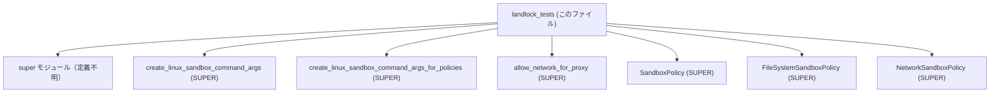
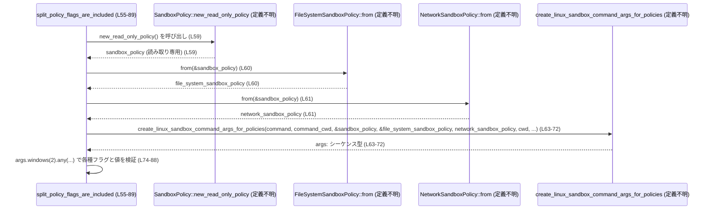

# sandboxing/src/landlock_tests.rs コード解説

## 0. ざっくり一言

Landlock とネットワーク関連の Linux サンドボックス起動コマンドを組み立てる関数群に対して、期待されるフラグが正しく付与されるかどうかを検証するユニットテスト群です（`super::*` で上位モジュールの関数をテストしています, 根拠: `landlock_tests.rs:L1,L5-33,L35-52,L55-89,L91-101`）。

---

## 1. このモジュールの役割

### 1.1 概要

- このテストモジュールは、Linux サンドボックス実行用コマンドライン引数を生成する関数に対し、以下を検証します。
  - レガシー Landlock フラグ `--use-legacy-landlock` が、指定されたときのみ付与されること（`legacy_landlock_flag_is_included_when_requested`, `landlock_tests.rs:L4-33`）。
  - プロキシ向けネットワーク許可フラグ `--allow-network-for-proxy` が、要求されたときだけ付与されること（`proxy_flag_is_included_when_requested`, `landlock_tests.rs:L35-52`）。
  - ファイルシステム／ネットワークサンドボックスのポリシーとカレントディレクトリが、期待どおりのフラグ＋値ペアとして引数に含まれること（`split_policy_flags_are_included`, `landlock_tests.rs:L55-89`）。
  - `allow_network_for_proxy` 関数が、`enforce_managed_network` 引数に応じて boolean を返すこと（`proxy_network_requires_managed_requirements`, `landlock_tests.rs:L91-101`）。

### 1.2 アーキテクチャ内での位置づけ

このファイルは `super::*` を use しており、同一クレート内の上位モジュールが提供するサンドボックス関連 API をテストしています（`landlock_tests.rs:L1`）。

- 上位モジュール側の主な API（定義はこのチャンクには出てきません）:
  - `create_linux_sandbox_command_args`
  - `create_linux_sandbox_command_args_for_policies`
  - `allow_network_for_proxy`
  - `SandboxPolicy`, `FileSystemSandboxPolicy`, `NetworkSandboxPolicy`

これらの関数・型の「契約（どの引数でどのフラグが付くか）」を、このテストが仕様として固定しています。

依存関係を簡略図にすると、次のようになります。



（SUPER 側の具体的なファイルパスや実装は、このチャンクには現れません。）

### 1.3 設計上のポイント

- 各テストは 1 つの振る舞い（フラグ・ポリシーの反映）だけを検証し、責務が分割されています（`landlock_tests.rs:L4-33,L35-52,L55-89,L91-101`）。
- 上位関数の戻り値には `contains` や `windows(2)` を呼んでいることから、「フラグ名と値の並びを持つシーケンス型（`Vec<String>` 等）」を想定しています（`landlock_tests.rs:L17-19,L29-31,L74-88`）。
- エラーハンドリングは Rust 標準のテストスタイルに従い、`pretty_assertions::assert_eq!` によるパニックベースの検証です（`landlock_tests.rs:L2,L17-20,L29-32,L48-51,L74-88,L93-100`）。
- `unsafe` キーワードやスレッド生成等は含まれておらず、このファイルに現れるコードはすべて安全な同期 Rust コードです。

---

## コンポーネント一覧（インベントリー）

このチャンクに現れる関数・型・マクロの一覧です。

| 名称 | 種別 | 定義/利用 | 役割 / 用途 | 根拠 |
|------|------|-----------|-------------|------|
| `legacy_landlock_flag_is_included_when_requested` | 関数（テスト） | 定義 | `--use-legacy-landlock` フラグの有無を検証 | `landlock_tests.rs:L4-33` |
| `proxy_flag_is_included_when_requested` | 関数（テスト） | 定義 | `--allow-network-for-proxy` フラグ付与を検証 | `landlock_tests.rs:L35-52` |
| `split_policy_flags_are_included` | 関数（テスト） | 定義 | ポリシー関連フラグと `--command-cwd` の付与を検証 | `landlock_tests.rs:L54-89` |
| `proxy_network_requires_managed_requirements` | 関数（テスト） | 定義 | `allow_network_for_proxy` の返値契約を検証 | `landlock_tests.rs:L91-101` |
| `create_linux_sandbox_command_args` | 関数 | 利用 | サンドボックス用コマンド引数のシーケンスを生成 | `landlock_tests.rs:L10-16,L22-28,L41-47` |
| `create_linux_sandbox_command_args_for_policies` | 関数 | 利用 | ポリシーと CWD を指定して引数列を生成 | `landlock_tests.rs:L63-72` |
| `allow_network_for_proxy` | 関数 | 利用 | 管理されたネットワーク要件に基づき、プロキシ向けネットワーク許可可否を返す | `landlock_tests.rs:L94-100` |
| `SandboxPolicy` | 型（詳細不明） | 利用 | サンドボックスポリシー（読み取り専用ポリシーを構築） | `landlock_tests.rs:L59` |
| `FileSystemSandboxPolicy` | 型（詳細不明） | 利用 | ファイルシステム用ポリシーを `SandboxPolicy` から生成 | `landlock_tests.rs:L60` |
| `NetworkSandboxPolicy` | 型（詳細不明） | 利用 | ネットワーク用ポリシーを `SandboxPolicy` から生成 | `landlock_tests.rs:L61` |
| `Path` | 型（`std::path::Path` と推定） | 利用 | コマンド実行ディレクトリと CWD を表現 | `landlock_tests.rs:L7-8,L38-39,L57-58` |
| `assert_eq!` | マクロ（`pretty_assertions`） | 利用 | 期待値と実際の値を比較し、相違があればパニック | `landlock_tests.rs:L2,L17-20,L29-32,L48-51,L74-88,L93-100` |
| `vec!` | マクロ | 利用 | `Vec<String>` と思われるコマンド配列の生成 | `landlock_tests.rs:L6,L37,L56` |

※ 型の正確な定義（構造体か列挙体かなど）は、このチャンクには現れていないため「詳細不明」としています。

---

## 2. 主要な機能一覧

このテストファイルがカバーしている主な機能（= 上位 API の契約）は次のとおりです。

- レガシー Landlock フラグ制御: `use_legacy_landlock` 引数に応じて `--use-legacy-landlock` を付ける／付けない（`landlock_tests.rs:L10-20,L22-32`）。
- プロキシ向けネットワーク許可フラグ制御: `allow_network_for_proxy` 引数が `true` のときに `--allow-network-for-proxy` を付ける（`landlock_tests.rs:L41-51`）。
- ポリシー分割フラグ付与:
  - `--file-system-sandbox-policy` に非空の値が続くこと（`landlock_tests.rs:L74-78`）。
  - `--network-sandbox-policy` の値が `"restricted"`（引用符付き文字列）であること（`landlock_tests.rs:L79-83`）。
  - `--command-cwd` の値が `/tmp/link` であること（`landlock_tests.rs:L84-88`）。
- `allow_network_for_proxy` の論理: `enforce_managed_network` が `true` のときのみ `true` を返す（`landlock_tests.rs:L91-101`）。

---

## 3. 公開 API と詳細解説

このファイルで「定義」されているのはテスト関数のみですが、それぞれが上位 API の契約を明確にしています。

### 3.1 型一覧（構造体・列挙体など）

このファイル内で新たに型定義はしていませんが、重要な外部型の利用があります。

| 名前 | 種別 | 役割 / 用途 | 根拠 |
|------|------|-------------|------|
| `SandboxPolicy` | 型（詳細不明） | サンドボックスの基本ポリシー。`new_read_only_policy` により読み取り専用ポリシーを構築していることが分かります。定義は別モジュールです。 | `landlock_tests.rs:L59` |
| `FileSystemSandboxPolicy` | 型（詳細不明） | ファイルシステム専用のサンドボックスポリシー。`SandboxPolicy` から `from` で生成しています。 | `landlock_tests.rs:L60` |
| `NetworkSandboxPolicy` | 型（詳細不明） | ネットワーク専用のサンドボックスポリシー。`SandboxPolicy` から `from` で生成しています。 | `landlock_tests.rs:L61` |
| `Path` | 型（標準ライブラリ） | コマンドの CWD とサンドボックスのベース CWD を表現します。 | `landlock_tests.rs:L7-8,L38-39,L57-58` |

### 3.2 関数詳細（テスト関数）

#### `legacy_landlock_flag_is_included_when_requested()`

**概要**

- `create_linux_sandbox_command_args` が `use_legacy_landlock` 引数の値に応じて `--use-legacy-landlock` フラグを付与／非付与することを検証するテストです（`landlock_tests.rs:L4-33`）。

**引数**

- なし（テスト関数で、外部から引数は受け取りません）。

**戻り値**

- なし（`()`）。失敗時は `assert_eq!` によりパニックします。

**内部処理の流れ**

1. コマンド `["/bin/true"]` を `Vec<String>` と思われる形で生成し、コマンド CWD `/tmp/link` とサンドボックス CWD `/tmp` を `Path` で用意します（`landlock_tests.rs:L6-8`）。
2. `use_legacy_landlock = false`, `allow_network_for_proxy = false` を指定して `create_linux_sandbox_command_args` を呼び、引数列 `default_bwrap` を取得します（`landlock_tests.rs:L10-16`）。
3. `default_bwrap` に `--use-legacy-landlock` という文字列が含まれていないことを `contains` で検証します（`landlock_tests.rs:L17-20`）。
4. つづいて `use_legacy_landlock = true`, `allow_network_for_proxy = false` で再度 `create_linux_sandbox_command_args` を呼び、`legacy_landlock` を取得します（`landlock_tests.rs:L22-28`）。
5. 今度は `legacy_landlock` に `--use-legacy-landlock` が含まれていることを検証します（`landlock_tests.rs:L29-32`）。

**Examples（使用例）**

このテスト自体が `create_linux_sandbox_command_args` の典型的な使用例になっています。

```rust
// コマンドとディレクトリを準備
let command = vec!["/bin/true".to_string()];             // 実行したいコマンド
let command_cwd = Path::new("/tmp/link");                 // コマンドの CWD
let cwd = Path::new("/tmp");                              // サンドボックス環境の CWD

// レガシー Landlock 無効
let default_bwrap = create_linux_sandbox_command_args(
    command.clone(),                                      // コマンド（所有権をクローン）
    command_cwd,                                          // コマンド CWD
    cwd,                                                  // サンドボックス CWD
    /*use_legacy_landlock*/ false,
    /*allow_network_for_proxy*/ false,
);
assert!(
    !default_bwrap.contains(&"--use-legacy-landlock".to_string())
);

// レガシー Landlock 有効
let legacy_landlock = create_linux_sandbox_command_args(
    command,
    command_cwd,
    cwd,
    /*use_legacy_landlock*/ true,
    /*allow_network_for_proxy*/ false,
);
assert!(
    legacy_landlock.contains(&"--use-legacy-landlock".to_string())
);
```

**Errors / Panics**

- `assert_eq!` が失敗した場合（期待値と実際の値が一致しない場合）、テストはパニックします（`landlock_tests.rs:L17-20,L29-32`）。
- `create_linux_sandbox_command_args` 自体のエラー挙動は、このチャンクには現れていません。

**Edge cases（エッジケース）**

- `use_legacy_landlock = false` と `true` の両方をテストしているため、「フラグが常に付く／常に付かない」といった誤実装は検出されます。
- `allow_network_for_proxy` の値を変えた場合の `--use-legacy-landlock` との相互作用は、このテストでは扱っていません（`landlock_tests.rs:L10-16,L22-28`）。

**使用上の注意点**

- このテストにより、「`use_legacy_landlock` が `true` のときだけ `--use-legacy-landlock` が args に含まれる」という契約が暗黙に固定されます。実装変更時はこの仕様を維持するかどうかを意識する必要があります。

---

#### `proxy_flag_is_included_when_requested()`

**概要**

- `create_linux_sandbox_command_args` が `allow_network_for_proxy = true` のときに `--allow-network-for-proxy` フラグを含めることを検証します（`landlock_tests.rs:L35-52`）。

**引数**

- なし。

**戻り値**

- なし（`()`）。

**内部処理の流れ**

1. `["/bin/true"]`、`/tmp/link`、`/tmp` を準備（`landlock_tests.rs:L37-39`）。
2. `use_legacy_landlock = true`, `allow_network_for_proxy = true` で `create_linux_sandbox_command_args` を呼び出し、`args` を取得します（`landlock_tests.rs:L41-47`）。
3. `args` に `--allow-network-for-proxy` が含まれているかを `contains` で検証します（`landlock_tests.rs:L48-51`）。

**Examples（使用例）**

```rust
let command = vec!["/bin/true".to_string()];
let command_cwd = Path::new("/tmp/link");
let cwd = Path::new("/tmp");

// プロキシ用にネットワークを許可したい場合の呼び出し例
let args = create_linux_sandbox_command_args(
    command,
    command_cwd,
    cwd,
    /*use_legacy_landlock*/ true,
    /*allow_network_for_proxy*/ true,
);

// 生成された引数にフラグが含まれていることを確認
assert!(args.contains(&"--allow-network-for-proxy".to_string()));
```

**Errors / Panics**

- 期待するフラグが含まれていない場合、`assert_eq!` によりテストがパニックします（`landlock_tests.rs:L48-51`）。

**Edge cases**

- `allow_network_for_proxy = false` のケースが別途テストされていないため、「常にフラグを付けてしまう」バグはこのテスト単独では検出できません。
  - ただし、`legacy_landlock_flag_is_included_when_requested` など他のテストが `allow_network_for_proxy = false` のパスに対して引数列を生成しているため、そこで追加の検証を行う余地はあります（現在は行っていません, `landlock_tests.rs:L10-16`）。

**使用上の注意点**

- ネットワーク許可はセキュリティ上の影響が大きいため、このテストのように「要求されたときだけフラグを付ける」契約を守ることが重要です。

---

#### `split_policy_flags_are_included()`

**概要**

- ポリシーを明示的に受け取る `create_linux_sandbox_command_args_for_policies` が、ファイルシステム・ネットワークポリシーおよびコマンド CWD を表すフラグと値を正しく引数列に含めるかを検証します（`landlock_tests.rs:L55-89`）。

**引数**

- なし。

**戻り値**

- なし（`()`）。

**内部処理の流れ**

1. コマンドとパスを準備（`landlock_tests.rs:L56-58`）。
2. `SandboxPolicy::new_read_only_policy()` により、読み取り専用のサンドボックスポリシーを生成します（`landlock_tests.rs:L59`）。
3. そのポリシーから `FileSystemSandboxPolicy::from` と `NetworkSandboxPolicy::from` を用いて各分割ポリシーを作成します（`landlock_tests.rs:L60-61`）。
4. これらのポリシーと CWD を引数に `create_linux_sandbox_command_args_for_policies` を呼び出し、`args` というシーケンス型（`Vec<String>` 等）を取得します（`landlock_tests.rs:L63-72`）。
5. `args.windows(2)` でフラグと値のペアを走査し、以下を検証します（`landlock_tests.rs:L74-88`）。
   - どこかに `["--file-system-sandbox-policy", <非空文字列>]` という連続要素が存在すること（`landlock_tests.rs:L75-77`）。
   - どこかに `["--network-sandbox-policy", "\"restricted\""]` が存在すること（`landlock_tests.rs:L80-82`）。
   - どこかに `["--command-cwd", "/tmp/link"]` が存在すること（`landlock_tests.rs:L85-87`）。

**Examples（使用例）**

このテストから、ポリシー付きのサンドボックス起動の呼び出し方法が読み取れます。

```rust
// ベースとなるサンドボックスポリシーを準備
let sandbox_policy = SandboxPolicy::new_read_only_policy();       // 読み取り専用ポリシー
let file_system_sandbox_policy = FileSystemSandboxPolicy::from(&sandbox_policy);
let network_sandbox_policy = NetworkSandboxPolicy::from(&sandbox_policy);

// コマンドとパス
let command = vec!["/bin/true".to_string()];
let command_cwd = Path::new("/tmp/link");
let cwd = Path::new("/tmp");

// 引数列を生成
let args = create_linux_sandbox_command_args_for_policies(
    command,
    command_cwd,
    &sandbox_policy,
    &file_system_sandbox_policy,
    network_sandbox_policy,
    cwd,
    /*use_legacy_landlock*/ true,
    /*allow_network_for_proxy*/ false,
);

// 例: フラグと値の組を確認
assert!(args.windows(2).any(|w| w[0] == "--file-system-sandbox-policy" && !w[1].is_empty()));
assert!(args.windows(2).any(|w| w[0] == "--network-sandbox-policy" && w[1] == "\"restricted\""));
assert!(args.windows(2).any(|w| w[0] == "--command-cwd" && w[1] == "/tmp/link"));
```

**Errors / Panics**

- いずれかの `assert_eq!` が失敗するとテストはパニックします（`landlock_tests.rs:L74-88`）。
- `windows(2)` は最低 2 要素以上あるシーケンスに対しても空で終端する仕様であり、この使い方自体にパニック要因はありません（Rust 標準ライブラリの仕様に基づく）。

**Edge cases**

- テストは `"\"restricted\""` という文字列に厳密一致を求めているため、実装側が引用符の扱いを変更した場合（例: 引用符を含まない `restricted` へ変更）には、このテストが失敗して変更に気づけます（`landlock_tests.rs:L80-82`）。
- `--file-system-sandbox-policy` の値は「非空であること」のみを検証しており、具体的な内容（例: JSON 文字列かどうか）はこのテストからは分かりません（`landlock_tests.rs:L75-77`）。

**使用上の注意点**

- フラグと値を「2 要素のペア」として追加する設計になっており、テストも `windows(2)` に依存してその前提を検証しています。実装を変えて 3 要素以上のグルーピングにすると、このテストも更新が必要になります。

---

#### `proxy_network_requires_managed_requirements()`

**概要**

- `allow_network_for_proxy` 関数が `enforce_managed_network` 引数に応じて `bool` を返すことを検証します（`landlock_tests.rs:L91-101`）。

**引数**

- なし（内部で `allow_network_for_proxy` に引数を渡しています）。

**戻り値**

- なし（`()`）。

**内部処理の流れ**

1. `allow_network_for_proxy(false)` が `false` を返すことを検証（`landlock_tests.rs:L93-96`）。
2. `allow_network_for_proxy(true)` が `true` を返すことを検証（`landlock_tests.rs:L97-100`）。

**Examples（使用例）**

```rust
// 管理されたネットワーク要件を満たさない場合は false
assert_eq!(
    allow_network_for_proxy(/*enforce_managed_network*/ false),
    false
);

// 管理されたネットワーク要件を満たす場合は true
assert_eq!(
    allow_network_for_proxy(/*enforce_managed_network*/ true),
    true
);
```

**Errors / Panics**

- 期待する値と異なる場合、`assert_eq!` によりパニックします（`landlock_tests.rs:L93-100`）。

**Edge cases**

- このテストがカバーするのは `false` と `true` の 2 パターンであり、`bool` の全値を網羅しています。
- このテストから読み取れる契約は「`enforce_managed_network` が `true` のときのみ `true` になる」ことです。実装側で追加の条件（例: 環境変数や設定値）を導入する場合は、それに応じたテストが必要になります。

**使用上の注意点**

- `allow_network_for_proxy` が「セキュリティ要件（managed network の有無）」のスイッチとして使われていることが分かります。セキュリティ上、他の条件で `true` にならないことが重要であり、それをこのテストが保証しています。

---

### 3.3 その他の関数（外部 API 利用）

このファイル内で「定義」はされていませんが、テスト対象となっている外部関数の概要です（いずれも `super` モジュールからインポートされます）。

| 関数名 | 役割（このチャンクから読み取れる範囲） | 根拠 |
|--------|--------------------------------------|------|
| `create_linux_sandbox_command_args` | コマンド・CWD・各種フラグ（`use_legacy_landlock`, `allow_network_for_proxy`）をもとに、フラグ文字列とその値からなるシーケンスを返す関数。戻り値は `contains` と `windows(2)` が利用可能なシーケンス型（`Vec<String>` など）です。 | `landlock_tests.rs:L10-20,L22-32,L41-51,L74-88` |
| `create_linux_sandbox_command_args_for_policies` | コマンド・CWD に加え、`SandboxPolicy` およびその派生ポリシーを受け取り、ポリシーを表現するフラグ（`--file-system-sandbox-policy` 等）を含んだ引数列を返す関数。 | `landlock_tests.rs:L59-72,L74-88` |
| `allow_network_for_proxy` | `enforce_managed_network: bool` を受け取り、プロキシのためにネットワークを許可すべきかどうかを `bool` で返す関数。少なくとも `false → false`, `true → true` の振る舞いが保証されています。 | `landlock_tests.rs:L93-100` |

---

## 4. データフロー

ここでは、最も複雑な `split_policy_flags_are_included` テストを例に、データの流れを示します。

### 処理の要点

- ベースポリシー `SandboxPolicy` からファイルシステム用／ネットワーク用ポリシーを派生させ、それらを使ってサンドボックス起動用の引数列を生成します（`landlock_tests.rs:L59-72`）。
- 生成された引数列を 2 要素ずつスライドしながら見ていき、特定フラグとその値が存在するかを検証します（`landlock_tests.rs:L74-88`）。

### シーケンス図



---

## 5. 使い方（How to Use）

このファイルはテストコードですが、上位 API の実用的な呼び出し例としても利用できます。

### 5.1 基本的な使用方法

1. コマンドと CWD を `Vec<String>` と `Path` で用意する。
2. `create_linux_sandbox_command_args` または `create_linux_sandbox_command_args_for_policies` にパラメータを渡して、サンドボックスを起動するための引数列を構築する。
3. 必要であれば、生成された引数列から特定フラグの有無を検査する。

```rust
// 1. 設定や依存オブジェクトを用意する
let command = vec!["/bin/true".to_string()];              // 実行コマンド
let command_cwd = Path::new("/tmp/link");                  // コマンドの CWD
let cwd = Path::new("/tmp");                               // サンドボックスの CWD

// 2. サンドボックス起動用の引数列を生成する
let args = create_linux_sandbox_command_args(
    command,
    command_cwd,
    cwd,
    /*use_legacy_landlock*/ true,
    /*allow_network_for_proxy*/ false,
);

// 3. 結果の利用: 例として、期待するフラグが含まれているか確認
if args.contains(&"--use-legacy-landlock".to_string()) {
    // レガシー Landlock を有効にして起動する
}
```

### 5.2 よくある使用パターン

1. **レガシー Landlock の on/off を切り替えるパターン**

```rust
let args_without_legacy = create_linux_sandbox_command_args(
    command.clone(),
    command_cwd,
    cwd,
    false,    // use_legacy_landlock
    false,    // allow_network_for_proxy
);

let args_with_legacy = create_linux_sandbox_command_args(
    command,
    command_cwd,
    cwd,
    true,     // use_legacy_landlock
    false,
);
```

1. **プロキシ用にネットワークを許可するパターン**

```rust
let args_for_proxy = create_linux_sandbox_command_args(
    command,
    command_cwd,
    cwd,
    true,   // use_legacy_landlock
    true,   // allow_network_for_proxy
);
assert!(args_for_proxy.contains(&"--allow-network-for-proxy".to_string()));
```

1. **ポリシーを明示して起動引数を生成するパターン**

```rust
let sandbox_policy = SandboxPolicy::new_read_only_policy();
let file_system_sandbox_policy = FileSystemSandboxPolicy::from(&sandbox_policy);
let network_sandbox_policy = NetworkSandboxPolicy::from(&sandbox_policy);

let args = create_linux_sandbox_command_args_for_policies(
    command,
    command_cwd,
    &sandbox_policy,
    &file_system_sandbox_policy,
    network_sandbox_policy,
    cwd,
    true,   // use_legacy_landlock
    false,  // allow_network_for_proxy
);
```

### 5.3 よくある間違い（想定される誤用例）

このチャンクから推測できる、「仕様と異なる呼び出し」の例を挙げます。

```rust
// 誤り例: レガシー Landlock を有効にしたつもりだが、フラグが false
let args = create_linux_sandbox_command_args(
    command,
    command_cwd,
    cwd,
    /*use_legacy_landlock*/ false,  // ← true のつもりで誤って false にしている
    /*allow_network_for_proxy*/ false,
);
// この場合、--use-legacy-landlock は含まれません（テストの契約より, L10-20）


// 誤り例: 管理されたネットワーク要件を満たしていないのに、
// allow_network_for_proxy の戻り値を無条件に信じてネットワークを開放する
let enforce_managed_network = false;
let allow_net = allow_network_for_proxy(enforce_managed_network);
if allow_net {
    // セキュリティ方針としては本来 false であるべき状況です（L93-96）。
}
```

正しい例は、テストの契約に従い、引数の意味を明示することです。

```rust
let enforce_managed_network = true;   // 管理されたネットワーク要件を満たす
let allow_net = allow_network_for_proxy(enforce_managed_network);
assert!(allow_net);                   // L97-100 の契約に合致
```

### 5.4 使用上の注意点（まとめ）

- **フラグと値のペア構造**  
  テストは `args.windows(2)` を使い、フラグとその値が隣接している前提で検証しています（`landlock_tests.rs:L74-88`）。実装側がこのペア構造を崩すとテストが失敗します。
- **セキュリティ関連のフラグ**  
  Landlock とネットワーク許可はセキュリティに直結するため、このテスト群が示す契約（「要求されたときのみ許可フラグを付ける」）を意識する必要があります（`landlock_tests.rs:L10-20,L41-51,L93-100`）。
- **エラー処理**  
  このファイルに現れる限りでは、すべての検証は `assert_eq!` ベースで行われており、エラーはパニックとして扱われます（テストコードとして標準的なスタイルです）。

---

## 6. 変更の仕方（How to Modify）

### 6.1 新しい機能を追加する場合（テスト追加）

新しいフラグやポリシー項目をサンドボックス起動引数に追加する場合、次のステップでこのファイルにテストを追加するのが自然です。

1. **仕様の決定**  
   - 例: 新フラグ `--extra-sandbox-option` が、どの関数のどの引数に応じて追加されるかを設計する（実装側）。
2. **テストケースの作成**  
   - このファイルに `#[test]` 付きの関数を追加し、該当関数を呼び出して生成される `args` を `contains` や `windows(2)` で検証します。
3. **既存テストとの一貫性**  
   - 既存のテストと同様に、「フラグが付くケース」と「付かないケース」があれば両方を分けて検証します（`legacy_landlock_flag_is_included_when_requested` の構造を参照）。

### 6.2 既存の機能を変更する場合（契約変更）

既存フラグの意味や形式を変更する場合は、影響範囲と契約を意識してテストを調整します。

- **フラグ名を変更する場合**
  - 例: `--network-sandbox-policy` → `--net-policy` に変える場合、`split_policy_flags_are_included` 内の文字列リテラルも同時に変更する必要があります（`landlock_tests.rs:L80-82`）。
- **値の形式を変更する場合**
  - 例: `"\"restricted\""` から `restricted` に変更する場合、テストの比較も新形式に合わせて変更します（`landlock_tests.rs:L80-82`）。
- **契約の強化・緩和**
  - 例えば `allow_network_for_proxy` が追加条件で `false` を返すように変更した場合、その条件に応じた新しいテストケースを追加し、既存のテストが矛盾しないか確認します（`landlock_tests.rs:L91-101`）。

---

## 7. 関連ファイル

このファイルと密接に関係するコンポーネントは、`super::*` によってインポートされる上位モジュールの関数・型です。具体的なファイルパスはこのチャンクには現れないため「不明」と記載します。

| パス | 役割 / 関係 |
|------|------------|
| （不明: `super` モジュール） | `create_linux_sandbox_command_args`, `create_linux_sandbox_command_args_for_policies`, `allow_network_for_proxy`, `SandboxPolicy` などサンドボックス構成の本体ロジックを提供し、このテストファイルから呼び出されます。 |
| `pretty_assertions` クレート | `assert_eq!` マクロを提供し、比較失敗時に見やすい差分を表示します（`landlock_tests.rs:L2`）。 |

このファイルはあくまで「テスト」であり、サンドボックス機能のコアロジックはすべて上位モジュールに実装されています。実際の挙動や詳細なエラー処理を把握するには、これらの上位モジュールの実装を併せて確認する必要があります。
