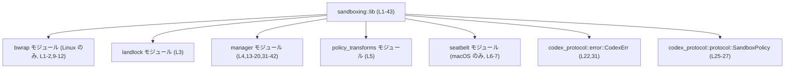
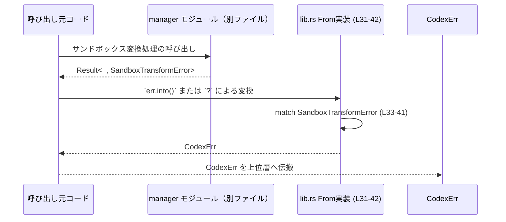
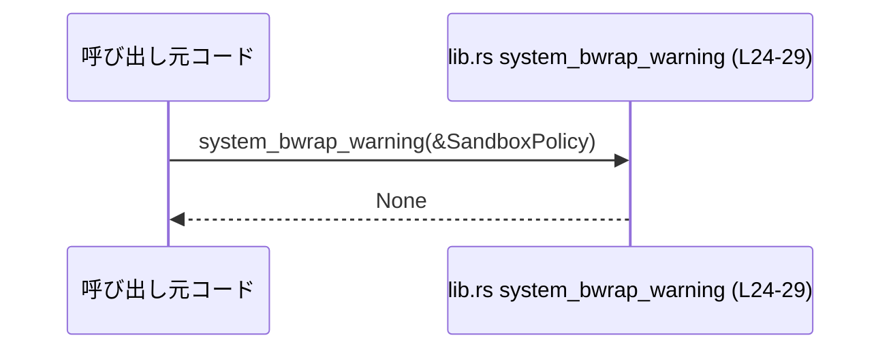

# sandboxing/src/lib.rs コード解説

## 0. ざっくり一言

`sandboxing/src/lib.rs` は、このクレートの「入口」として各種サンドボックス実装モジュール（Linux, macOS 向けなど）と管理用 API をまとめて公開し、サンドボックス変換エラーを共通エラー型 `CodexErr` に変換する役割を持つモジュールです（根拠: `sandboxing/src/lib.rs:L1-7,13-20,22,31-42`）。

---

## 1. このモジュールの役割

### 1.1 概要

- このモジュールは、プラットフォーム毎に異なるサンドボックス機構（bwrap, Landlock, seatbelt など）を隠蔽し、クレート利用者に対して統一されたサンドボックス管理 API を提供するために存在しています（根拠: `pub mod landlock;`, `pub mod policy_transforms;`, `pub mod seatbelt;`, `pub use manager::...` `sandboxing/src/lib.rs:L3-7,13-20`）。
- さらに、内部エラー型 `SandboxTransformError` を外部プロトコル側のエラー型 `CodexErr` に変換する `From` 実装を提供し、エラーハンドリングを一元化しています（根拠: `impl From<SandboxTransformError> for CodexErr` `sandboxing/src/lib.rs:L31-42`）。
- Linux 以外の環境向けには、bwrap 関連の警告用関数 `system_bwrap_warning` のダミー実装もここで定義されています（根拠: `#[cfg(not(target_os = "linux"))] pub fn system_bwrap_warning ...` `sandboxing/src/lib.rs:L24-29`）。

### 1.2 アーキテクチャ内での位置づけ

`lib.rs` はクレートのルートとして、各 OS 向けのモジュールおよびマネージャ API を束ね、外部クレート `codex_protocol` とも接続する位置にあります。



- `bwrap` / `seatbelt` は OS 条件付きコンパイルで有効化・無効化されます（根拠: `#[cfg(target_os = "linux")] mod bwrap;`, `#[cfg(target_os = "macos")] pub mod seatbelt;` `sandboxing/src/lib.rs:L1-2,6-7`）。
- `manager` モジュールに定義された主要な API 型・関数は、`pub use manager::...` によりクレートルートからそのまま利用できるよう再エクスポートされています（根拠: `sandboxing/src/lib.rs:L13-20`）。
- エラー型 `CodexErr` およびサンドボックス設定と思われる `SandboxPolicy` は、別クレート `codex_protocol` に属しています（根拠: `use codex_protocol::error::CodexErr;`, 関数引数 `&codex_protocol::protocol::SandboxPolicy` `sandboxing/src/lib.rs:L22,25-27`）。

### 1.3 設計上のポイント

- **プラットフォーム毎の分岐をコンパイル時に解決**
  - `#[cfg(target_os = "linux")]` / `#[cfg(not(target_os = "linux"))]` などの属性により、OS 毎に異なる実装・再エクスポートを用意しています（根拠: `sandboxing/src/lib.rs:L1,6,9,11,24,37`）。
  - これにより、「使えない機能が実行時に呼ばれて失敗する」のではなく、「そもそもそのコードパスがビルドされない」形で安全性を高めています（Rust のコンパイル時条件分岐の一般的特性に基づく説明）。
- **クレートルートでの再エクスポート**
  - 利用側は `manager` など内部モジュール名を意識せず、`SandboxManager` や `get_platform_sandbox` などをクレートルートから直接利用できます（根拠: `pub use manager::SandboxManager; pub use manager::get_platform_sandbox;` `sandboxing/src/lib.rs:L15,20`）。
- **エラー変換の一元化**
  - `SandboxTransformError` → `CodexErr` の変換ロジックを `From` 実装一箇所に閉じ込めることで、呼び出し側は `?` 演算子や `into()` によって一貫したエラー変換を行えます（根拠: `impl From<SandboxTransformError> for CodexErr { .. }` `sandboxing/src/lib.rs:L31-42`）。
- **状態を持たないモジュール**
  - このファイル内にはグローバル変数や構造体フィールドはなく、関数とトレイト実装のみが定義されているため、共有状態・同期などの並行性問題はここには現れていません（根拠: 全文確認 `sandboxing/src/lib.rs:L1-43`）。

---

## 2. 主要な機能一覧

### 2.1 コンポーネントインベントリー（このチャンクに現れる定義）

| 名称 | 種別 | 公開性 | 説明 | 定義/宣言位置 |
|------|------|--------|------|----------------|
| `bwrap` | モジュール | 非公開 | Linux 向けサンドボックス実装を含むモジュール（詳細は別ファイル。ここでは宣言のみ） | `sandboxing/src/lib.rs:L1-2` |
| `landlock` | モジュール | 公開 | Landlock ベースのサンドボックス機能を提供するモジュール（中身はこのチャンクには現れません） | `sandboxing/src/lib.rs:L3` |
| `manager` | モジュール | 非公開 | サンドボックス管理用の主要 API を定義するモジュール（詳細は別ファイル） | `sandboxing/src/lib.rs:L4` |
| `policy_transforms` | モジュール | 公開 | サンドボックスポリシー変換ロジックを含むモジュールと推測されるが、詳細は不明 | `sandboxing/src/lib.rs:L5` |
| `seatbelt` | モジュール | 公開 (macOS のみ) | macOS の seatbelt サンドボックスを扱うモジュール（中身はこのチャンクには現れません） | `sandboxing/src/lib.rs:L6-7` |
| `find_system_bwrap_in_path` | アイテム（詳細不明） | 公開 (Linux のみ) | `bwrap` モジュールから再エクスポートされる公開アイテム。名称から bwrap 実行ファイルの探索用関数と推測されるが、実体は別ファイル | `sandboxing/src/lib.rs:L9-10` |
| `system_bwrap_warning`（bwrap 版） | アイテム（詳細不明） | 公開 (Linux のみ) | `bwrap` モジュールから再エクスポートされる公開アイテム。Linux ではこちらが使われる | `sandboxing/src/lib.rs:L11-12` |
| `SandboxCommand` ほか多数 | アイテム（詳細不明） | 公開 | `manager` モジュールから再エクスポートされるサンドボックス関連 API。型か関数かはこのチャンクからは判別できません | `sandboxing/src/lib.rs:L13-20` |
| `CodexErr` | 型 | 非公開（ここでは use のみ） | 外部クレート `codex_protocol` が定義する共通エラー型 | `sandboxing/src/lib.rs:L22` |
| `system_bwrap_warning`（非 Linux 版） | 関数 | 公開 (非 Linux のみ) | 非 Linux 環境でコンパイルされるダミー実装。常に `None` を返す | `sandboxing/src/lib.rs:L24-29` |
| `From<SandboxTransformError> for CodexErr` | トレイト実装 | - | サンドボックス変換エラーを `CodexErr` に変換する `From` 実装 | `sandboxing/src/lib.rs:L31-42` |

※ `SandboxCommand` / `SandboxExecRequest` / `SandboxManager` / `SandboxTransformError` / `SandboxTransformRequest` / `SandboxType` / `SandboxablePreference` / `get_platform_sandbox` はすべて `pub use manager::...` で再エクスポートされていますが、ここには定義本体がないため「アイテム（詳細不明）」としています（根拠: `sandboxing/src/lib.rs:L13-20`）。

### 2.2 主要な機能（概要）

- **サンドボックス管理 API の公開**  
  `manager` モジュールに定義された、サンドボックスの種類・実行リクエスト・マネージャ本体などをクレートルートから利用可能にします（根拠: `sandboxing/src/lib.rs:L13-20`）。

- **OS ごとのサンドボックスバックエンドの公開**  
  - Linux: `bwrap` モジュール（bubblewrap と思われる）と `landlock` モジュール（Landlock）  
  - macOS: `seatbelt` モジュール  
  など、OS ごとに異なるバックエンドモジュールを公開します（根拠: `sandboxing/src/lib.rs:L1-7,3`）。

- **bwrap 警告用 API の統一**  
  - Linux では `bwrap::system_bwrap_warning` を再エクスポート  
  - 非 Linux ではダミー実装 `system_bwrap_warning` を提供（常に `None`）  
  により、「`system_bwrap_warning` という名前の公開関数は常に存在する」ことを保証します（根拠: `sandboxing/src/lib.rs:L9-12,24-29`）。

- **エラー型の変換 (`SandboxTransformError` → `CodexErr`)**  
  内部エラーを外部プロトコル用エラー型に変換することで、上位層のエラーハンドリングを単純化します（根拠: `sandboxing/src/lib.rs:L31-42`）。

---

## 3. 公開 API と詳細解説

### 3.1 型一覧（構造体・列挙体など）

このチャンクに型定義そのものは現れませんが、使用される／再エクスポートされる主要な型は以下の通りです。

| 名前 | 種別 | 役割 / 用途 | 定義元 | 根拠 |
|------|------|-------------|--------|------|
| `SandboxTransformError` | 型（詳細不明） | サンドボックス変換に関するエラーを表す型であることが名称と `From` 実装から読み取れます。具体的なバリアントは別ファイル側に定義 | `manager` モジュール（推測: `pub use manager::SandboxTransformError;`） | `sandboxing/src/lib.rs:L16,31-42` |
| `CodexErr` | 列挙体または構造体（詳細不明） | プロトコル側の共通エラー型。ここではサンドボックス関連エラーをマッピングする対象として使われます | 外部クレート `codex_protocol::error` | `sandboxing/src/lib.rs:L22,31-36,38-40` |
| `SandboxCommand` 他の再エクスポート型群 | 型または関数/定数（詳細不明） | サンドボックスの実行コマンド、リクエスト、種類、ユーザ設定などサンドボックス機能に関わる公開 API ですが、具体的な定義は `manager` モジュールにあります | `manager` モジュール（`pub use manager::...`） | `sandboxing/src/lib.rs:L13-20` |

> ※ `CodexErr::LandlockSandboxExecutableNotProvided` や `CodexErr::UnsupportedOperation` は `CodexErr` のバリアントですが、その定義位置はこのチャンクからは分かりません（根拠: パターン `CodexErr::LandlockSandboxExecutableNotProvided` 等の使用 `sandboxing/src/lib.rs:L35-36,38-40`）。

### 3.2 関数詳細（このチャンクで定義されるもの）

#### `system_bwrap_warning(_sandbox_policy: &codex_protocol::protocol::SandboxPolicy) -> Option<String>`

非 Linux 環境でコンパイルされるダミー実装です（根拠: `#[cfg(not(target_os = "linux"))] pub fn system_bwrap_warning ... { None }` `sandboxing/src/lib.rs:L24-29`）。

**概要**

- Linux 以外の OS に対して、bwrap サンドボックスに関する警告メッセージを提供するための関数名を確保しますが、実装は常に `None` を返すダミーです。
- つまり、「bwrap に関する警告は存在しない（or 対象外）」ことを示します。

**引数**

| 引数名 | 型 | 説明 |
|--------|----|------|
| `_sandbox_policy` | `&codex_protocol::protocol::SandboxPolicy` | サンドボックスのポリシーと思われる設定オブジェクトへの参照。ここでは未使用で、引数名先頭の `_` により未使用であることが明示されています（根拠: `sandboxing/src/lib.rs:L25-27`）。 |

**戻り値**

- `Option<String>`  
  - `Some(String)` : Linux 版では警告文が返されることが想定されますが、この非 Linux 版では利用されません。  
  - `None` : 警告メッセージが存在しないことを意味します。この実装では常に `None` です（根拠: `sandboxing/src/lib.rs:L28`）。

**内部処理の流れ**

1. 引数 `_sandbox_policy` は受け取りますが一切使用しません（根拠: 関数本体に参照無し `sandboxing/src/lib.rs:L25-28`）。
2. 直ちに `None` を返して終了します（根拠: `sandboxing/src/lib.rs:L28`）。

**Examples（使用例）**

以下は、クレート内のコードから警告メッセージをログ出力したい場合の概念的な例です。  
（実際の `SandboxPolicy` の中身は不明なため、ここでは型名のみを用いています。）

```rust
use crate::system_bwrap_warning; // 同一クレート内からの呼び出しを想定

fn log_bwrap_warning(policy: &codex_protocol::protocol::SandboxPolicy) {
    // 非 Linux では常に None が返る（このファイルの実装）
    if let Some(msg) = system_bwrap_warning(policy) {
        eprintln!("bwrap 警告: {msg}"); // Linux 版では警告が表示される可能性がある
    } else {
        // 警告なしのケース。非 Linux では必ずこちら
    }
}
```

**Errors / Panics**

- この関数は内部でエラーや panic を発生させません。単に `None` を返すだけです（根拠: 本体が `None` リテラルのみ `sandboxing/src/lib.rs:L27-28`）。

**Edge cases（エッジケース）**

- 任意の `SandboxPolicy` が渡されても、結果は常に `None` です。
- `SandboxPolicy` がどのような設定であっても、この非 Linux 実装からは警告が得られません（根拠: 引数未使用 `sandboxing/src/lib.rs:L25-28`）。

**使用上の注意点**

- Linux 版 `system_bwrap_warning`（`bwrap` モジュール側）の挙動とは異なり、非 Linux では「警告は絶対に出ない」ことに注意が必要です。  
  「`Some` が返ってきたら警告を表示する」というコードはポータブルですが、「`None` なら bwrap が問題なく使える」と解釈すると誤りになります。
- クロスプラットフォームなコードでは、「`None` は『この OS では bwrap 警告が提供されない』ことも意味する」と理解する必要があります。

---

#### `From<SandboxTransformError> for CodexErr::from(err: SandboxTransformError) -> CodexErr`

`SandboxTransformError` を共通エラー型 `CodexErr` に変換するための `From` トレイト実装です（根拠: `impl From<SandboxTransformError> for CodexErr { fn from(err: SandboxTransformError) -> Self { ... } }` `sandboxing/src/lib.rs:L31-42`）。

**概要**

- サンドボックス変換処理で発生した内部エラー `SandboxTransformError` を、外部インターフェイスで利用される `CodexErr` にマッピングします。
- これにより、呼び出し側は `?` 演算子などを使って自動的に `CodexErr` へ変換できます（Rust の `From` / `Into` の一般仕様に基づく）。

**引数**

| 引数名 | 型 | 説明 |
|--------|----|------|
| `err` | `SandboxTransformError` | サンドボックス変換処理中に発生したエラー。具体的なバリアントは別ファイル側に定義されています（根拠: `sandboxing/src/lib.rs:L31-32`）。 |

**戻り値**

- 型: `CodexErr`  
  - プロトコル層など上位レイヤで扱う共通エラー型です（根拠: `impl From<SandboxTransformError> for CodexErr` `sandboxing/src/lib.rs:L31`）。

**内部処理の流れ（アルゴリズム）**

1. `match err { ... }` で `SandboxTransformError` のバリアントごとに分岐します（根拠: `match err {` `sandboxing/src/lib.rs:L33`）。
2. バリアント `MissingLinuxSandboxExecutable` の場合:  
   - `CodexErr::LandlockSandboxExecutableNotProvided` に変換して返します（根拠: `SandboxTransformError::MissingLinuxSandboxExecutable => { CodexErr::LandlockSandboxExecutableNotProvided }` `sandboxing/src/lib.rs:L34-36`）。
3. （非 macOS のみコンパイル）`SeatbeltUnavailable` バリアントの場合:  
   - `"seatbelt sandbox is only available on macOS"` というメッセージを持つ `CodexErr::UnsupportedOperation` に変換して返します（根拠: `#[cfg(not(target_os = "macos"))] SandboxTransformError::SeatbeltUnavailable => CodexErr::UnsupportedOperation("seatbelt sandbox is only available on macOS".to_string()),` `sandboxing/src/lib.rs:L37-40`）。
4. それ以外のバリアントが存在するかどうか、このチャンクからは分かりません。存在する場合は、同じ `match` 内か別の `From` 実装で扱われているはずですが、ここには現れていません。

**簡易フローチャート**

```mermaid
flowchart TD
    A["SandboxTransformError err (L32)"]
    B{"err のバリアント?<br/>(L33-41)"}
    C["CodexErr::LandlockSandboxExecutableNotProvided (L34-36)"]
    D["CodexErr::UnsupportedOperation(\"seatbelt sandbox is only available on macOS\") (L37-40)"]

    A --> B
    B --> C:::case1
    B --> D:::case2

    classDef case1 fill:#eef,stroke:#333,stroke-width:1px;
    classDef case2 fill:#efe,stroke:#333,stroke-width:1px;
```

**Examples（使用例）**

`SandboxTransformError` を返す関数から、`CodexErr` を返す関数へエラーを伝播させる例です。  
※ `SandboxTransformError` の定義はこのチャンクにはないため、ここでは型名のみを使った概念例です。

```rust
use crate::SandboxTransformError;
use codex_protocol::error::CodexErr;

// サンドボックス変換処理を行い、失敗すると SandboxTransformError を返す関数（定義は別ファイル）
fn transform_sandbox() -> Result<(), SandboxTransformError> {
    // 実際の処理はこのチャンクからは不明
    Err(SandboxTransformError::MissingLinuxSandboxExecutable) // 例としてエラーを返す
}

// 呼び出し側: CodexErr を返す公開 API などを想定
fn api_entrypoint() -> Result<(), CodexErr> {
    // ? 演算子により SandboxTransformError が CodexErr に自動変換される
    transform_sandbox()?;
    Ok(())
}
```

- 上記 `transform_sandbox()?;` の部分で、`SandboxTransformError` が `From` 実装に基づき `CodexErr` に変換されます（Rust の `?` 演算子の仕様に基づく）。

**Errors / Panics**

- この `From` 実装自体は、パニックや I/O エラーなどを発生させず、純粋に値変換のみを行います（根拠: 本体が `match` と列挙値構築のみ `sandboxing/src/lib.rs:L33-41`）。
- 新しいバリアントが `SandboxTransformError` に追加された場合、この `match` がコンパイルエラーとなる可能性があり、その際には変換ロジックの追加が必要になります（Rust の「列挙体に対する網羅的 match」の一般的性質）。

**Edge cases（エッジケース）**

- `MissingLinuxSandboxExecutable`  
  - バックエンドの Linux サンドボックス実行ファイルが見つからないケースを表すと推測されますが、ここでは `CodexErr::LandlockSandboxExecutableNotProvided` に一律マッピングされます。  
  - 「Landlock」という名称と「Linux サンドボックス実行ファイルが見つからない」という内容がやや異なって見えますが、仕様として意図されているかどうかはこのチャンクからは判断できません（根拠: それぞれの識別子名 `sandboxing/src/lib.rs:L34-36`）。
- `SeatbeltUnavailable`（非 macOS のみ）  
  - seatbelt サンドボックスが利用できない場合と思われます。非 macOS 環境では「macOS だけで利用可能」という UnsupportedOperation にマッピングされます（根拠: エラーメッセージ文字列 `sandboxing/src/lib.rs:L37-40`）。

**使用上の注意点**

- 上位コードで `SandboxTransformError` を `?` で伝播させると、呼び出し元が期待する `CodexErr` に変換されることを前提に設計されています。そのため、`From` 実装を変更すると、クレート全体のエラー挙動に影響が及びます。
- 新しい `SandboxTransformError` バリアントを追加した場合、この `From` 実装を更新しないとコンパイルエラーになるか、`_` パターン追加などにより意図しない変換が行われる可能性があります。
- セキュリティ観点では、この変換がどの `CodexErr` にマッピングされるかによって、ユーザ側に見えるエラーメッセージや機能制限の扱いが変わるため、意味の一貫性に注意が必要です（例: 実際には bwrap 由来の問題を Landlock 由来のエラーとみなしてよいかどうか）。

---

### 3.3 その他の関数・公開アイテム（このチャンクでは定義なし）

このファイルでは定義されておらず、別モジュールから再エクスポートされているものをまとめます。

| 名前 | 種別 | 役割（1 行） | 定義元 | 根拠 |
|------|------|--------------|--------|------|
| `find_system_bwrap_in_path` | アイテム（詳細不明） | 名称から、システムの `bwrap` 実行ファイルを探索するためのユーティリティであると推測されますが、このチャンクには実装がありません | `bwrap` モジュール | `sandboxing/src/lib.rs:L9-10` |
| `system_bwrap_warning`（Linux 版） | アイテム（詳細不明） | Linux では `bwrap` モジュール側の実装が用いられます。引数や戻り値の詳細はこのチャンクには現れません | `bwrap` モジュール | `sandboxing/src/lib.rs:L11-12` |
| `get_platform_sandbox` | アイテム（詳細不明） | プラットフォームに応じたサンドボックス実装を取得するエントリポイントと推測されますが、シグネチャや内部処理は不明です | `manager` モジュール | `sandboxing/src/lib.rs:L20` |
| `SandboxCommand` 他 | アイテム（詳細不明） | サンドボックス操作に利用する各種公開 API。具体的なフィールドやメソッドは `manager` 側を参照する必要があります | `manager` モジュール | `sandboxing/src/lib.rs:L13-19` |

---

## 4. データフロー

このチャンクが直接関与する代表的なデータフローは、「サンドボックス変換エラーを共通エラー型に変換して上位へ返す流れ」です。呼び出し側や `manager` モジュール内の詳細実装はこのチャンクには現れず、以下は `From` 実装の利用イメージになります。

### 4.1 エラー変換の流れ（概念図）



- `Manager` はここには定義されていませんが、`SandboxTransformError` を返す側として想定されます（根拠: `pub use manager::SandboxTransformError;` `sandboxing/src/lib.rs:L16`）。
- `Lib` の `From` 実装が、具体的なバリアントに応じた `CodexErr` を生成します（根拠: `match err { ... }` `sandboxing/src/lib.rs:L33-41`）。
- 呼び出し元は、`Result<_, CodexErr>` を返す関数内で `?` を用いるだけで、この変換を意識せずに利用できます。

### 4.2 bwrap 警告フロー（非 Linux）

非 Linux 環境における `system_bwrap_warning` のデータフローは非常に単純です。



- どのような `SandboxPolicy` が渡されても `None` が返るため、実質的に「bwrap に関する警告情報は存在しない」ことを示すフラグとして機能します（根拠: `sandboxing/src/lib.rs:L25-28`）。

---

## 5. 使い方（How to Use）

### 5.1 基本的な使用方法（このチャンクに基づく）

#### 非 Linux での `system_bwrap_warning` 利用

非 Linux 環境において、「bwrap に関する警告があればログに出す」というパターンを想定した例です。

```rust
use crate::system_bwrap_warning; // lib.rs で公開される関数

fn log_bwrap_warning(policy: &codex_protocol::protocol::SandboxPolicy) {
    // 非 Linux ではこの関数は常に None を返す（lib.rs の実装）
    if let Some(msg) = system_bwrap_warning(policy) {
        eprintln!("bwrap 警告: {msg}");
    } else {
        // 非 Linux では必ずこちらに来る
        // 「警告がない」のか「この OS では警告 API がダミー」なのかは区別できない
    }
}
```

#### `SandboxTransformError` → `CodexErr` の変換

`SandboxTransformError` を返す内部関数と、それを `CodexErr` に変換して公開するラッパ関数の例です。

```rust
use crate::SandboxTransformError;
use codex_protocol::error::CodexErr;

// 内部処理: サンドボックス変換を行う（詳細は別ファイル）
fn internal_transform() -> Result<(), SandboxTransformError> {
    // ここでエラーが発生したと仮定
    Err(SandboxTransformError::MissingLinuxSandboxExecutable)
}

// 公開 API: CodexErr を返す
fn public_api() -> Result<(), CodexErr> {
    // ? により SandboxTransformError が CodexErr へ変換される
    internal_transform()?;
    Ok(())
}
```

- ここでは `From<SandboxTransformError> for CodexErr` の実装により、`MissingLinuxSandboxExecutable` が `CodexErr::LandlockSandboxExecutableNotProvided` に変換されることになります（根拠: `sandboxing/src/lib.rs:L34-36`）。

### 5.2 よくある使用パターン

- **パターン 1: `Option<String>` による「警告の有無」の確認**
  - `system_bwrap_warning` の戻り値が `Some(msg)` ならログに出す、`None` なら何もしない、という使い方が自然です。
  - 非 Linux では常に `None` のため、「警告機能がそもそも無効」である可能性も含めて処理を設計する必要があります。

- **パターン 2: `From` を前提にしたエラー伝播**
  - 内部関数はドメイン固有のエラー型（ここでは `SandboxTransformError`）を返し、外部公開 API はプロトコル共通エラー型（`CodexErr`）を返す、という分離が行われていると考えられます。
  - その橋渡しを `From` 実装が担う形です。

### 5.3 よくある間違い（想定）

```rust
// 誤り例: 非 Linux でも Some が返る前提で unwrap してしまう
fn wrong_usage(policy: &codex_protocol::protocol::SandboxPolicy) {
    let msg = crate::system_bwrap_warning(policy).unwrap(); // 非 Linux では必ず panic
    eprintln!("bwrap 警告: {msg}");
}

// 正しい例: Option をパターンマッチで扱う
fn correct_usage(policy: &codex_protocol::protocol::SandboxPolicy) {
    if let Some(msg) = crate::system_bwrap_warning(policy) {
        eprintln!("bwrap 警告: {msg}");
    }
}
```

- 非 Linux では `system_bwrap_warning` は必ず `None` を返すため、`unwrap()` は必ず panic を引き起こします（根拠: `sandboxing/src/lib.rs:L24-29`）。

```rust
// 誤り例: SandboxTransformError -> CodexErr の変換を手作業で重複実装
fn manual_mapping(err: crate::SandboxTransformError) -> CodexErr {
    // lib.rs と異なる変換を書いてしまうリスクがある
    CodexErr::UnsupportedOperation("something".to_string())
}

// 正しい例: From 実装を利用
fn use_from(err: crate::SandboxTransformError) -> CodexErr {
    err.into() // or CodexErr::from(err)
}
```

- 変換ロジックを複数箇所に散らすと、一貫性が崩れやすくなります。`From` 実装に集約する設計になっている点に注意します（根拠: `impl From<SandboxTransformError> for CodexErr` `sandboxing/src/lib.rs:L31-42`）。

### 5.4 使用上の注意点（まとめ）

- **プラットフォーム依存挙動**
  - `system_bwrap_warning` は OS によって異なる実装がビルドされます。非 Linux では必ず `None` なので、「`None`=安全」を意味しないことに注意が必要です。
- **エラー意味の一貫性**
  - `MissingLinuxSandboxExecutable` が `LandlockSandboxExecutableNotProvided` にマッピングされるなど、エラー名とメッセージの対応関係がプロトコル側の仕様に依存します。仕様変更時には `From` 実装の見直しが必要です。
- **並行性**
  - このファイルには共有状態やスレッド操作はなく、単純な値変換と関数のみです。並行性に起因する安全性問題はここには現れていません。

---

## 6. 変更の仕方（How to Modify）

### 6.1 新しい機能を追加する場合

- **新しいサンドボックスバックエンドを追加する**
  1. `src/` 以下に新しいモジュール（例: `new_backend.rs`）を追加する（このチャンクには現れません）。
  2. `lib.rs` に `mod new_backend;` または `pub mod new_backend;` を追記し、必要に応じて `#[cfg(...)]` で OS 条件を付けます（パターンは `bwrap` や `seatbelt` と同様、根拠: `sandboxing/src/lib.rs:L1-7`）。
  3. `manager` モジュール内で、そのバックエンドに対応した型や関数を定義し、必要であれば `pub use manager::...` 経由でクレートルートに公開します（パターン: `sandboxing/src/lib.rs:L13-20`）。
  4. バックエンド固有のエラーが `SandboxTransformError` に追加される場合は、次節の手順に従い `From` 実装を更新します。

- **新しい警告関数などを追加する**
  - `system_bwrap_warning` と同様に、OS ごとの `#[cfg]` を利用して、プラットフォーム差分を `lib.rs` の関数で吸収する構造を踏襲できます。

### 6.2 既存の機能を変更する場合

- **`SandboxTransformError` にバリアントを追加する**
  - 影響範囲:
    - `impl From<SandboxTransformError> for CodexErr` の `match` がコンパイルエラーになるか、 `_` パターン追加などにより新バリアントが意図しない形でマッピングされる可能性があります（根拠: `sandboxing/src/lib.rs:L33-41`）。
  - 対応:
    - 新バリアントごとに、どの `CodexErr` にマップすべきか仕様を決め、この `From` 実装に追加します。
    - プロトコルのエラー仕様書やクライアント側の期待するエラー表示と整合しているか確認します。

- **`system_bwrap_warning` の振る舞いを変える**
  - 非 Linux 版において `Some(...)` を返すようにする場合、既存コードは「`None` が通常」という前提で書かれているかもしれないため、呼び出し側のロジックとテストを再確認する必要があります（根拠: 現行実装が常に `None` `sandboxing/src/lib.rs:L24-29`）。
  - Linux 版（`bwrap` モジュール側）との仕様整合性も合わせて検討する必要がありますが、その実装はこのチャンクには現れていません。

- **CodexErr 側の仕様変更**
  - `CodexErr::LandlockSandboxExecutableNotProvided` や `CodexErr::UnsupportedOperation` が削除・変更される場合、この `From` 実装も更新が必要です（根拠: これらのバリアントを直接使用している `sandboxing/src/lib.rs:L35-36,38-40`）。
  - 特にエラーメッセージ文字列（macOS のみ利用可とする文言）は、ユーザ表示や API 仕様に関わるため、変更時には上位利用箇所の確認が重要です。

---

## 7. 関連ファイル

このモジュールと密接に関係するファイル・ディレクトリは次の通りです（いずれもこのチャンクには中身が現れていません）。

| パス | 役割 / 関係 |
|------|------------|
| `sandboxing/src/bwrap.rs` | Linux 向けサンドボックス（bubblewrap と思われる）の実装を提供し、`find_system_bwrap_in_path` や Linux 版 `system_bwrap_warning` を定義していると推測されます（根拠: `mod bwrap;` および `pub use bwrap::...` `sandboxing/src/lib.rs:L1-2,9-12`）。 |
| `sandboxing/src/landlock.rs` | Landlock ベースのサンドボックス機能を実装するモジュール。`lib.rs` から公開されています（根拠: `pub mod landlock;` `sandboxing/src/lib.rs:L3`）。 |
| `sandboxing/src/manager.rs` | `SandboxManager` や `SandboxTransformError` など、サンドボックス管理ロジックの中心となる API を定義するモジュール（根拠: `mod manager;` と `pub use manager::...` `sandboxing/src/lib.rs:L4,13-20`）。 |
| `sandboxing/src/policy_transforms.rs` | サンドボックスポリシーの変換ロジックを含むと推測されるモジュール。`lib.rs` から公開されています（根拠: `pub mod policy_transforms;` `sandboxing/src/lib.rs:L5`）。 |
| `sandboxing/src/seatbelt.rs` | macOS 専用の seatbelt サンドボックス実装を提供するモジュール。`#[cfg(target_os = "macos")]` で条件付き公開されています（根拠: `sandboxing/src/lib.rs:L6-7`）。 |
| `codex_protocol::error` | 外部クレート側のエラー型 `CodexErr` を定義しているモジュール（根拠: `use codex_protocol::error::CodexErr;` `sandboxing/src/lib.rs:L22`）。 |
| `codex_protocol::protocol` | `SandboxPolicy` を定義しているモジュールと推測されます。`system_bwrap_warning` の引数として使用されます（根拠: `&codex_protocol::protocol::SandboxPolicy` `sandboxing/src/lib.rs:L25-27`）。 |

このファイル自体は、主に「公開 API の束ね」と「エラー変換」の役割に特化しており、実際のサンドボックス処理ロジックは上記の関連ファイル側に存在しています。
