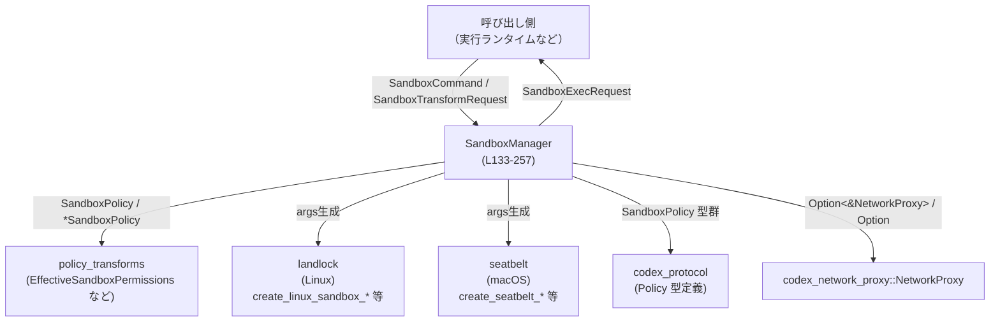

# sandboxing/src/manager.rs コード解説

## 0. ざっくり一言

このモジュールは、各種 OS ごとのサンドボックス機構（macOS Seatbelt / Linux seccomp+Landlock / Windows restricted token など）を抽象化し、  
「どのサンドボックスを使うかの選択」と「実際に起動するコマンドラインの変換」を行う管理コンポーネントです。

---

## 1. このモジュールの役割

### 1.1 概要

- このモジュールは、**サンドボックス付きでコマンドを実行するための事前変換ロジック**を提供します。
- 入力として「元のコマンド」「ファイルシステム／ネットワークのポリシー」「プラットフォーム情報」を受け取り、  
  出力として「実行すべきコマンドライン（サンドボックスラッパー付き）」と「適用済みポリシー」をまとめた `SandboxExecRequest` を生成します。  
- どの OS 上でどのサンドボックス方式を使うかの選択ロジックも `SandboxManager` が担います。

### 1.2 アーキテクチャ内での位置づけ

このファイルは「サンドボックス管理」の中核であり、他のモジュールと次のように連携します。



- 実際のプロセス起動は、このファイルには含まれていません。`SandboxExecRequest` をどこで使うかはこのチャンクからは不明です。
- OS ごとのサンドボックス機構への具体的なシステムコールは、`crate::landlock` や `crate::seatbelt` に委譲されています（`manager.rs:L1-11`）。

### 1.3 設計上のポイント

- **責務分割**
  - このモジュールは「どのサンドボックスを使うか」と「どのようなコマンドラインに変換するか」に集中しています。
  - ポリシーの適用ロジックそのものは `policy_transforms` モジュールに委譲しています（`manager.rs:L4-7, L186-194`）。
- **状態を持たない設計**
  - `SandboxManager` はフィールドを持たないユニット構造体であり（`manager.rs:L130-131`）、メソッドはすべて `&self` で呼び出されるため、スレッド間で安全に共有しやすい構造になっています。
- **プラットフォーム抽象化**
  - `SandboxType` と `SandboxablePreference` を用いて、OS ごとの差異を隠蔽しつつ、呼び出し側は抽象度の高い API でサンドボックス方針を指定できます（`manager.rs:L23-47`）。
- **エラーハンドリング**
  - サンドボックス変換処理は `Result<_, SandboxTransformError>` で表現され、Linux サンドボックスの実行ファイル欠如や非 macOS 環境での seatbelt 指定などを明示的なエラーとして扱います（`manager.rs:L109-128, L218-221, L216-217`）。
- **OS 依存コードのコンパイル時分岐**
  - `#[cfg(target_os = "...")]` と `cfg!` を併用して OS ごとに分岐しており、プラットフォーム依存部分を明示しています（`manager.rs:L8-11, L49-62, L201-217, L237-240`）。
- **文字列／パスの安全性**
  - `OsString` から `String` へ変換する際に `to_string_lossy` を利用し、非 UTF-8 文字列を含む場合でもパニックせずに処理が継続するようにしています（`manager.rs:L265-269`）。

---

## 2. 主要な機能一覧

- サンドボックスタイプ表現: 現在のプロセスに適用されるサンドボックスの種類を `SandboxType` として表現（`manager.rs:L23-29`）。
- サンドボックス使用方針の指定: 自動／必須／禁止の選好を `SandboxablePreference` で表現（`manager.rs:L42-47`）。
- プラットフォームごとのデフォルトサンドボックス選択: `get_platform_sandbox` により OS・設定に応じた `SandboxType` を返却（`manager.rs:L49-63`）。
- 実行コマンド記述: 入力用 `SandboxCommand` と、サンドボックス適用後の `SandboxExecRequest` の定義（`manager.rs:L65-87`）。
- サンドボックス変換リクエスト集約: 多数のオプションパラメータを `SandboxTransformRequest<'a>` にバンドル（`manager.rs:L89-107`）。
- サンドボックス変換エラー型: `SandboxTransformError` により、Linux 実行ファイル欠如や非対応 OS での seatbelt 利用を表現（`manager.rs:L109-128`）。
- サンドボックス選択ロジック: `SandboxManager::select_initial` により、ポリシーとプリファレンスから初期 `SandboxType` を決定（`manager.rs:L138-165`）。
- サンドボックス変換ロジック: `SandboxManager::transform` により、ポリシー適用とコマンドライン変換を実施（`manager.rs:L167-255`）。
- 補助関数:
  - `os_argv_to_strings`: `Vec<OsString>` → `Vec<String>` 変換（`manager.rs:L259-263`）。
  - `os_string_to_command_component`: 非 UTF-8 を許容する文字列変換（`manager.rs:L265-269`）。
  - `linux_sandbox_arg0_override`: Linux サンドボックス用の argv[0] 上書きロジック（`manager.rs:L271-277`）。

---

## 3. 公開 API と詳細解説

### 3.1 型一覧（構造体・列挙体など）

| 名前 | 種別 | 役割 / 用途 | 定義位置 |
|------|------|-------------|----------|
| `SandboxType` | 列挙体 | サンドボックス方式（なし / macOS Seatbelt / Linux seccomp / Windows restricted token）を表現 | `manager.rs:L23-29` |
| `SandboxablePreference` | 列挙体 | 呼び出し側の希望（自動 / 必須 / 禁止）を表現 | `manager.rs:L42-47` |
| `SandboxCommand` | 構造体 | 変換前の「実行したいコマンド」の情報を保持（実行ファイル、引数、環境変数、追加権限など） | `manager.rs:L65-72` |
| `SandboxExecRequest` | 構造体 | 変換後の「サンドボックス付きで実行するための情報一式」を保持 | `manager.rs:L75-87` |
| `SandboxTransformRequest<'a>` | 構造体 | `SandboxCommand` と各種ポリシー・設定値をまとめた、変換処理への入力 | `manager.rs:L89-107` |
| `SandboxTransformError` | 列挙体 | 変換処理におけるエラー種別（Linux 実行ファイル欠如、非 macOS での seatbelt 利用） | `manager.rs:L109-114` |
| `SandboxManager` | 構造体（ユニット） | サンドボックス選択・変換ロジックを提供する stateless マネージャ | `manager.rs:L130-131` |

補足:

- `SandboxTransformRequest.network` は `Option<&'a NetworkProxy>` であり、変換後に `Option<NetworkProxy>` として所有権を持つ形にクローンされます（`manager.rs:L101, L247`）。
- `SandboxExecRequest.arg0` は Linux seccomp の場合のみ `Some(...)` になり、それ以外は `None` です（`manager.rs:L235, L255`）。

---

### 3.2 関数詳細（主要 7 件）

#### `SandboxType::as_metric_tag(self) -> &'static str`

**概要**

- `SandboxType` の値を、メトリクスなどで利用しやすい短いタグ文字列に変換します（`manager.rs:L31-39`）。

**引数**

| 引数名 | 型 | 説明 |
|--------|----|------|
| `self` | `SandboxType` | 変換対象のサンドボックスタイプ |

**戻り値**

- `&'static str`  
  - `"none"`, `"seatbelt"`, `"seccomp"`, `"windows_sandbox"` のいずれか。

**内部処理の流れ**

1. `match self` により 4 つのバリアントに分岐（`manager.rs:L33-38`）。
2. 各バリアントに対応する静的文字列を返す。

**Examples（使用例）**

```rust
use sandboxing::manager::SandboxType; // 仮のモジュールパス

fn record_sandbox_metric(ty: SandboxType) {
    let tag = ty.as_metric_tag(); // "seccomp" などのタグを取得
    // メトリクスレポートに利用する想定
    println!("sandbox_type={}", tag);
}
```

**Errors / Panics**

- エラー／パニックは発生しません（単純な `match` のみ）。

**Edge cases（エッジケース）**

- 列挙体に新しいバリアントが追加された場合、そのバリアントに対応する分岐を追加しないとコンパイルエラーになるため、未対応のケースが実行時に現れることはありません。

**使用上の注意点**

- 返される文字列はメトリクスなどに使われることを前提とした短いタグであり、ユーザー向けの文言としては別途整形が必要な場合があります。

---

#### `get_platform_sandbox(windows_sandbox_enabled: bool) -> Option<SandboxType>`

**概要**

- ビルドされた OS に応じて、そのプラットフォームで利用可能なサンドボックス種別を決定します（`manager.rs:L49-63`）。
- Windows の場合は、引数に応じて Windows サンドボックスを有効／無効にします。

**引数**

| 引数名 | 型 | 説明 |
|--------|----|------|
| `windows_sandbox_enabled` | `bool` | Windows 上で restricted token サンドボックスを使うかどうか（他 OS では無視されます） |

**戻り値**

- `Option<SandboxType>`  
  - macOS: `Some(SandboxType::MacosSeatbelt)`  
  - Linux: `Some(SandboxType::LinuxSeccomp)`  
  - Windows: `Some(SandboxType::WindowsRestrictedToken)` または `None`  
  - その他の OS: `None`

**内部処理の流れ**

1. `cfg!(target_os = "...")` で macOS / Linux / Windows / その他を判定（`manager.rs:L49-55`）。
2. 各 OS ごとに
   - macOS: Seatbelt を返す。
   - Linux: seccomp を返す。
   - Windows: `windows_sandbox_enabled` が `true` のときだけ `WindowsRestrictedToken` を返し、それ以外は `None`（`manager.rs:L55-59`）。
   - その他: `None` を返す。

**Examples（使用例）**

```rust
use sandboxing::manager::{get_platform_sandbox, SandboxType};
use codex_protocol::config_types::WindowsSandboxLevel;

fn decide_default_sandbox(level: WindowsSandboxLevel) -> SandboxType {
    // Windows では設定に応じてサンドボックスの有無を制御
    let enabled = level != WindowsSandboxLevel::Disabled;
    get_platform_sandbox(enabled).unwrap_or(SandboxType::None)
}
```

**Errors / Panics**

- エラー／パニックは発生しません。
- サポートされない OS では `None` が返り、呼び出し側がそれに応じてフォールバックする想定です。

**Edge cases**

- Windows 以外の OS で `windows_sandbox_enabled = true` を渡しても無視されます。
- 将来新しい OS ターゲットにビルドした場合、ここに分岐が追加されない限り常に `None` になります。

**使用上の注意点**

- **Windows での挙動**: `windows_sandbox_enabled` を `false` にすると、`SandboxType::WindowsRestrictedToken` は返されません。この値は通常 `WindowsSandboxLevel` から計算されています（`manager.rs:L143-144, L149, L158`）。
- 戻り値が `None` の可能性があるため、`unwrap_or` などでフォールバックを用意する必要があります。

---

#### `SandboxManager::select_initial(...) -> SandboxType`

**シグネチャ**

```rust
pub fn select_initial(
    &self,
    file_system_policy: &FileSystemSandboxPolicy,
    network_policy: NetworkSandboxPolicy,
    pref: SandboxablePreference,
    windows_sandbox_level: WindowsSandboxLevel,
    has_managed_network_requirements: bool,
) -> SandboxType
```

**概要**

- 呼び出し側の希望 (`SandboxablePreference`) と、ファイルシステム・ネットワークのポリシー、および Windows 設定を元に、**最初に使うべきサンドボックス種別**を選択します（`manager.rs:L138-165`）。

**引数**

| 引数名 | 型 | 説明 |
|--------|----|------|
| `file_system_policy` | `&FileSystemSandboxPolicy` | ファイルシステムのサンドボックスポリシー |
| `network_policy` | `NetworkSandboxPolicy` | ネットワークのサンドボックスポリシー（所有権を移動） |
| `pref` | `SandboxablePreference` | 「自動／必須／禁止」の希望 |
| `windows_sandbox_level` | `WindowsSandboxLevel` | Windows サンドボックスの有効レベル |
| `has_managed_network_requirements` | `bool` | マネージドネットワークが必要かどうか |

**戻り値**

- `SandboxType`  
  - `SandboxType::None` または、プラットフォームに応じた具体的なサンドボックスタイプ。

**内部処理の流れ**

1. `pref` による分岐（`manager.rs:L146-164`）:
   - `Forbid`: 常に `SandboxType::None`。
   - `Require`:
     - `windows_sandbox_level != WindowsSandboxLevel::Disabled` を渡して `get_platform_sandbox` を呼び（`manager.rs:L149`）、`None` の場合は `SandboxType::None` にフォールバック（`unwrap_or`）。
   - `Auto`:
     1. `should_require_platform_sandbox(...)` を呼び出して、ポリシーからプラットフォームサンドボックスが必要か判定（`manager.rs:L153-157`）。
     2. 必要なら `Require` と同じロジックで `get_platform_sandbox` を呼ぶ（`manager.rs:L158-160`）。
     3. 不要なら `SandboxType::None`。

**Examples（使用例）**

```rust
use sandboxing::manager::{SandboxManager, SandboxablePreference, SandboxType};
use codex_protocol::config_types::WindowsSandboxLevel;
use codex_protocol::permissions::{FileSystemSandboxPolicy, NetworkSandboxPolicy};

fn choose_sandbox(
    fs: &FileSystemSandboxPolicy,
    net: NetworkSandboxPolicy,
    windows_level: WindowsSandboxLevel,
) -> SandboxType {
    let manager = SandboxManager::new();
    manager.select_initial(
        fs,
        net,
        SandboxablePreference::Auto,
        windows_level,
        /* has_managed_network_requirements = */ false,
    )
}
```

**Errors / Panics**

- エラー型は返さず、パニックも発生しません。
- プラットフォームでサンドボックスが利用できない場合は自動的に `SandboxType::None` にフォールバックします。

**Edge cases**

- `SandboxablePreference::Require` であっても、サポート外の OS では `SandboxType::None` になる可能性があります（`get_platform_sandbox` が `None` を返すため）。
- `Auto` の場合、`should_require_platform_sandbox` の返り値次第で、同じポリシーでもサンドボックスが有効／無効になる可能性がありますが、その条件はこのチャンクには現れません。

**使用上の注意点**

- 「必ずサンドボックスを使いたい」場合でも、物理的にサポートされていない環境では `SandboxType::None` になる点に注意が必要です。
- `network_policy` は所有権を渡すため、呼び出し後に元の変数は利用できなくなります（Rust の所有権ルール）。

---

#### `SandboxManager::transform(&self, request: SandboxTransformRequest<'_>) -> Result<SandboxExecRequest, SandboxTransformError>`

**概要**

- `SandboxTransformRequest` に含まれるコマンドとポリシーを元に、**実際に実行するためのコマンドラインとポリシー**を構築します（`manager.rs:L167-255`）。
- OS ごとのサンドボックス方式に応じて、ラッパー実行ファイルや引数、`argv[0]` の上書きなどを行います。

**引数**

| 引数名 | 型 | 説明 |
|--------|----|------|
| `request` | `SandboxTransformRequest<'_>` | コマンドとポリシー、サンドボックス設定をまとめた入力 |

（`SandboxTransformRequest` のフィールドは `manager.rs:L92-107` を参照）

**戻り値**

- `Ok(SandboxExecRequest)`:
  - 変換済みのコマンドライン・カレントディレクトリ・環境変数・ネットワークプロキシ・適用されたポリシーを保持。
- `Err(SandboxTransformError)`:
  - Linux サンドボックス実行ファイルの欠如、または非 macOS での macOS seatbelt 指定の場合。

**内部処理の流れ（アルゴリズム）**

1. `request` を分解してローカル変数に展開（`manager.rs:L171-184`）。
2. `command.additional_permissions.take()` で追加権限プロファイルを取り出し（所有権移動）、`command` 側を `None` にする（`manager.rs:L185`）。
3. `EffectiveSandboxPermissions::new` により、`policy` と `additional_permissions` から実効サンドボックスポリシーを生成（`manager.rs:L186-188`）。
4. `effective_file_system_sandbox_policy` / `effective_network_sandbox_policy` を用いて、追加権限を考慮したファイルシステム／ネットワークポリシーを生成（`manager.rs:L189-194`）。
5. `command.program` と `command.args` から `Vec<OsString>` を構築（`manager.rs:L195-197`）。
6. `sandbox` の種類に応じて分岐（`manager.rs:L199-240`）:
   - `None` / WindowsRestrictedToken:
     - `os_argv_to_strings` で `Vec<String>` に変換（`manager.rs:L200, L238-240`）。
   - macOS Seatbelt (`target_os = "macos"`):
     - `create_seatbelt_command_args_for_policies` を呼び、Seatbelt 用の引数列を得る（`manager.rs:L203-210`）。
     - 実行ファイルとして `MACOS_PATH_TO_SEATBELT_EXECUTABLE` を先頭に付加（`manager.rs:L211-213`）。
   - 非 macOS 環境で `MacosSeatbelt` が指定された場合:
     - `Err(SandboxTransformError::SeatbeltUnavailable)` を返す（`manager.rs:L216-217`）。
   - LinuxSeccomp:
     1. `codex_linux_sandbox_exe` が `Some` であることを `ok_or` でチェックし、`None` の場合は `MissingLinuxSandboxExecutable` エラー（`manager.rs:L219-221`）。
     2. `allow_network_for_proxy(enforce_managed_network)` でネットワーク許可方針を決定（`manager.rs:L221`）。
     3. `create_linux_sandbox_command_args_for_policies` を呼んで引数列を生成（`manager.rs:L222-231`）。
     4. `exe` のパス文字列を先頭に付けた `full_command` を構築（`manager.rs:L232-234`）。
     5. `linux_sandbox_arg0_override(exe)` で `arg0_override` を決定（`manager.rs:L235`）。
7. 最終的に `SandboxExecRequest` を構築し、`Ok(...)` で返す（`manager.rs:L243-255`）。
   - `network: network.cloned()` により、`Option<&NetworkProxy>` を `Option<NetworkProxy>` に変換（`manager.rs:L247`）。

**Examples（使用例）**

```rust
use sandboxing::manager::{
    SandboxManager, SandboxCommand, SandboxTransformRequest,
    SandboxType, SandboxablePreference,
};
use codex_protocol::config_types::WindowsSandboxLevel;
use codex_protocol::permissions::{FileSystemSandboxPolicy, NetworkSandboxPolicy};
use codex_protocol::protocol::SandboxPolicy;
use codex_network_proxy::NetworkProxy;
use std::collections::HashMap;
use std::path::Path;

// 実際には適切な値を用意する必要があります。
fn example_transform(
    policy: SandboxPolicy,
    fs_policy: FileSystemSandboxPolicy,
    net_policy: NetworkSandboxPolicy,
    network_proxy: Option<NetworkProxy>,
) {
    let manager = SandboxManager::new();

    let cmd = SandboxCommand {
        program: "my_binary".into(),
        args: vec!["--flag".to_string()],
        cwd: "/tmp".try_into().unwrap(),
        env: HashMap::new(),
        additional_permissions: None,
    };

    let sandbox_type = manager.select_initial(
        &fs_policy,
        net_policy.clone(), // select_initial 用
        SandboxablePreference::Auto,
        WindowsSandboxLevel::Disabled,
        false,
    );

    let request = SandboxTransformRequest {
        command: cmd,
        policy: &policy,
        file_system_policy: &fs_policy,
        network_policy: net_policy,
        sandbox: sandbox_type,
        enforce_managed_network: false,
        network: network_proxy.as_ref(),
        sandbox_policy_cwd: Path::new("/tmp"),
        codex_linux_sandbox_exe: None, // LinuxSeccomp を使うなら Some(...) が必須
        use_legacy_landlock: false,
        windows_sandbox_level: WindowsSandboxLevel::Disabled,
        windows_sandbox_private_desktop: false,
    };

    let exec = manager.transform(request);
    println!("transform result: {:?}", exec);
}
```

**Errors / Panics**

- `Err(SandboxTransformError::MissingLinuxSandboxExecutable)`  
  - 条件: `sandbox == SandboxType::LinuxSeccomp` かつ `codex_linux_sandbox_exe` が `None`（`manager.rs:L219-221`）。
- `Err(SandboxTransformError::SeatbeltUnavailable)`  
  - 条件: 非 macOS ターゲットで `sandbox == SandboxType::MacosSeatbelt`（`manager.rs:L216-217`）。
- パニック:
  - この関数内部には `unwrap` 呼び出しがなく、`to_string_lossy` などもパニックを起こさないため、通常の入力ではパニックしない設計です。

**Edge cases**

- `SandboxType::None` または `WindowsRestrictedToken` の場合、`arg0` は `None` のままです（`manager.rs:L200, L238-240, L254`）。
- `network` が `None` の場合、`SandboxExecRequest.network` も `None` になります（`manager.rs:L247`）。
- `additional_permissions` が `Some` の場合のみ、実効ポリシーに追加権限が反映されますが、その具体的な挙動は `policy_transforms` 側のコードが必要であり、このチャンクには現れません。

**使用上の注意点**

- **LinuxSeccomp を使う場合**は、必ず `codex_linux_sandbox_exe` を `Some(&Path)` として渡す必要があります。そうしないとエラーになります。
- `SandboxTransformRequest.network` は参照 (`&NetworkProxy`) ですが、戻り値の `SandboxExecRequest.network` は所有権を持つ `NetworkProxy` になります。`network.cloned()` が使われているため、`NetworkProxy` は `Clone` を実装している必要があります（`manager.rs:L247`）。
- 引数・コマンドパスは `String` に変換されるため、非 UTF-8 のパス・引数を完全には表現できません（`os_string_to_command_component` の項目参照）。

---

#### `os_argv_to_strings(argv: Vec<OsString>) -> Vec<String>`

**概要**

- 実行引数のリストを `OsString` から `String` に変換します（`manager.rs:L259-263`）。
- 後続の API が UTF-8 ベースの `String` を期待しているためのユーティリティです。

**引数**

| 引数名 | 型 | 説明 |
|--------|----|------|
| `argv` | `Vec<OsString>` | OS 依存の文字列型で表現された引数配列 |

**戻り値**

- `Vec<String>`  
  - 各要素を `os_string_to_command_component` で変換した結果。

**内部処理の流れ**

1. `into_iter()` で `argv` の所有権を消費（`manager.rs:L260`）。
2. 各要素に対して `os_string_to_command_component` を適用（`manager.rs:L261`）。
3. `collect()` で `Vec<String>` として収集（`manager.rs:L262`）。

**Examples（使用例）**

```rust
use std::ffi::OsString;
use sandboxing::manager::os_argv_to_strings; // 実際には同一モジュール内のプライベート関数

fn example() {
    let argv = vec![OsString::from("cmd"), OsString::from("arg1")];
    let strings = os_argv_to_strings(argv);
    assert_eq!(strings, vec!["cmd".to_string(), "arg1".to_string()]);
}
```

※ 実際にはこの関数は `pub` ではなくモジュール内限定です（`manager.rs:L259`）。上の例は同一モジュール内での利用イメージです。

**Errors / Panics**

- パニックは発生しません（`os_string_to_command_component` がパニックしない実装だからです）。

**Edge cases**

- 非 UTF-8 を含む `OsString` が渡された場合、`os_string_to_command_component` 内で `to_string_lossy` により置換文字（`�`）を含む文字列になります。

**使用上の注意点**

- 戻り値は `String` であり、元の `OsString` が持っていたバイト列を完全には復元できない場合があるため、**OS ネイティブなパスや引数を完全に保持する必要がある場面には不向き**です。

---

#### `os_string_to_command_component(value: OsString) -> String`

**概要**

- `OsString` を `String` に変換するヘルパー関数であり、非 UTF-8 の場合でもパニックせずに「可能な限り近い文字列」に変換します（`manager.rs:L265-269`）。

**引数**

| 引数名 | 型 | 説明 |
|--------|----|------|
| `value` | `OsString` | 変換したい OS 依存文字列 |

**戻り値**

- `String`  
  - UTF-8 として解釈可能ならそのまま。
  - そうでない場合は `to_string_lossy` により置換文字付き文字列。

**内部処理の流れ**

1. `value.into_string()` で UTF-8 への変換を試みる（`manager.rs:L266-267`）。
2. 成功した場合はそのまま `String` を返す。
3. 失敗した場合は、`value.to_string_lossy().into_owned()` でロスのある変換結果を返す（`manager.rs:L268`）。

**Examples（使用例）**

```rust
use std::ffi::OsString;
use sandboxing::manager::os_string_to_command_component; // モジュール内の利用イメージ

fn example() {
    let s = OsString::from("hello");
    let result = os_string_to_command_component(s);
    assert_eq!(result, "hello".to_string());
}
```

**Errors / Panics**

- `unwrap_or_else` を用いているため、`into_string()` が失敗してもパニックせず安全にフォールバックします。

**Edge cases**

- 非 UTF-8 のパスや引数は、`to_string_lossy` によって置換文字に変換されるため、元のバイト列とは一致しません。
- この変換により、外部バイナリから見えるパスや引数が変化する可能性があります。

**使用上の注意点**

- セキュリティ上、「文字列が変わる」こと自体が問題になるケース（パスの同一性チェックなど）では、この関数を通すと意図しない結果になる可能性があります。
- ただし、パニックを避けつつログ・メトリクス用に表示する用途には適しています。

---

#### `linux_sandbox_arg0_override(exe: &Path) -> String`

**概要**

- Linux サンドボックス実行ファイルに対して、`argv[0]` として何を渡すかを決定します（`manager.rs:L271-277`）。
- 実行ファイル名が特定の定数（`CODEX_LINUX_SANDBOX_ARG0`）と一致するかどうかで挙動を変えます。

**引数**

| 引数名 | 型 | 説明 |
|--------|----|------|
| `exe` | `&Path` | サンドボックス実行ファイルのパス |

**戻り値**

- `String`  
  - 条件に応じて `exe` のパス文字列、または `CODEX_LINUX_SANDBOX_ARG0` の文字列。

**内部処理の流れ**

1. `exe.file_name().and_then(|name| name.to_str())` でファイル名を UTF-8 文字列として取得（`manager.rs:L272`）。
2. その結果が `Some(CODEX_LINUX_SANDBOX_ARG0)` と一致するか判定。
3. 一致する場合:
   - `exe.as_os_str().to_owned()` を `os_string_to_command_component` に通して `String` に変換（`manager.rs:L273`）。
4. 一致しない場合:
   - `CODEX_LINUX_SANDBOX_ARG0.to_string()` を返す（`manager.rs:L275`）。

**Examples（使用例）**

```rust
use std::path::Path;
use sandboxing::manager::linux_sandbox_arg0_override; // 実際はモジュール内

fn example() {
    let exe = Path::new("/usr/bin/codex-linux-sandbox");
    let arg0 = linux_sandbox_arg0_override(exe);
    // exe のファイル名が CODEX_LINUX_SANDBOX_ARG0 と等しければ、実行ファイルパスに基づく文字列になる
    println!("argv[0] = {}", arg0);
}
```

**Errors / Panics**

- `os_string_to_command_component` がパニックしないため、通常はパニックを起こしません。

**Edge cases**

- `exe.file_name()` が `None` の場合（パスが空、またはルートパスなど）、`file_name().and_then(...). == Some(...)` は `false` になり、`CODEX_LINUX_SANDBOX_ARG0` が返されます。
- ファイル名に非 UTF-8 が含まれている場合、`name.to_str()` が `None` になり、同様に定数文字列が返されます。

**使用上の注意点**

- この関数により、**実際の実行ファイル名とは異なる `argv[0]` が渡される場合があります**。  
  これは、サンドボックス内から見えるプロセス名やコマンド名を一定化するための措置と考えられますが、詳細な意図はこのチャンクからは分かりません。
- `argv[0]` に依存するロジック（プロセス名チェックなど）が存在する場合、その挙動に影響します。

---

### 3.3 その他の関数

| 関数名 | 役割（1 行） | 定義位置 |
|--------|--------------|----------|
| `SandboxManager::new() -> Self` | 状態を持たない `SandboxManager` インスタンスを生成するコンストラクタ | `manager.rs:L133-136` |

---

## 4. データフロー

### 4.1 代表的な処理シナリオ: コマンド実行前のサンドボックス変換

`SandboxManager::transform` を中心に、データがどのように流れるかを示します。

```mermaid
sequenceDiagram
    autonumber
    participant Caller as 呼び出し側
    participant Manager as SandboxManager<br/>transform (L167-255)
    participant PolicyT as policy_transforms<br/>(L4-7, L186-194)
    participant Landlock as landlock<br/>(Linux 分岐, L221-231)
    participant Seatbelt as seatbelt<br/>(macOS 分岐, L203-213)
    participant NetProxy as NetworkProxy

    Caller->>Manager: transform(SandboxTransformRequest)
    activate Manager

    Manager->>Manager: 追加権限を取り出し (L185)
    Manager->>PolicyT: EffectiveSandboxPermissions::new(policy, additional) (L186-188)
    Manager->>PolicyT: effective_file_system_sandbox_policy(...) (L189-192)
    Manager->>PolicyT: effective_network_sandbox_policy(...) (L193-194)
    Manager->>Manager: argv = [program] + args (OsString) (L195-197)

    alt sandbox == None / WindowsRestrictedToken
        Manager->>Manager: os_argv_to_strings(argv) (L200, L238-240)
    else sandbox == MacosSeatbelt (macOS)
        Manager->>Seatbelt: create_seatbelt_command_args_for_policies(...) (L203-210)
        Manager->>Manager: full_command = [MACOS_PATH_TO_SEATBELT_EXECUTABLE] + args (L211-213)
    else sandbox == MacosSeatbelt (非 macOS)
        Manager-->>Caller: Err(SeatbeltUnavailable) (L216-217)
        deactivate Manager
        return
    else sandbox == LinuxSeccomp
        Manager->>Manager: exe = codex_linux_sandbox_exe.ok_or(...) (L219-221)
        Manager->>Landlock: allow_network_for_proxy(...) (L221)
        Manager->>Landlock: create_linux_sandbox_command_args_for_policies(...) (L222-231)
        Manager->>Manager: full_command = [exe] + args (L232-234)
        Manager->>Manager: arg0_override = linux_sandbox_arg0_override(exe) (L235)
    end

    Manager->>NetProxy: network.cloned() (Option<&NetworkProxy> → Option<NetworkProxy>) (L247)
    Manager-->>Caller: Ok(SandboxExecRequest { ... }) (L243-255)
    deactivate Manager
```

要点:

- ポリシーの「実効値」計算は `policy_transforms` モジュールに委譲されています。
- サンドボックス方式ごとの「ラッパーコマンド＋引数」の作成は `landlock` / `seatbelt` モジュールに委譲されています。
- `SandboxExecRequest` は、「実際に起動するコマンドライン」と「適用されたポリシー」「ネットワークプロキシ」などを一括して保持する構造体です（`manager.rs:L75-87, L243-255`）。

---

## 5. 使い方（How to Use）

### 5.1 基本的な使用方法

典型的なフローは次の 3 ステップです。

1. `SandboxCommand` とポリシー類を準備する。
2. `SandboxManager::select_initial` で `SandboxType` を決める。
3. `SandboxManager::transform` で `SandboxExecRequest` を生成し、別モジュールで実行する。

```rust
use sandboxing::manager::{
    SandboxManager, SandboxCommand, SandboxExecRequest,
    SandboxTransformRequest, SandboxablePreference, SandboxType,
};
use codex_protocol::config_types::WindowsSandboxLevel;
use codex_protocol::permissions::{FileSystemSandboxPolicy, NetworkSandboxPolicy};
use codex_protocol::protocol::SandboxPolicy;
use codex_network_proxy::NetworkProxy;
use std::collections::HashMap;
use std::path::Path;

fn run_example(
    policy: SandboxPolicy,
    fs_policy: FileSystemSandboxPolicy,
    net_policy: NetworkSandboxPolicy,
    network_proxy: Option<NetworkProxy>,
) -> Result<SandboxExecRequest, Box<dyn std::error::Error>> {
    let manager = SandboxManager::new();

    // 1. 元のコマンドを構築
    let cmd = SandboxCommand {
        program: "my_tool".into(),              // 実行ファイル名（OsString）
        args: vec!["--verbose".to_string()],   // 引数（Vec<String>）
        cwd: "/tmp".try_into()?,               // カレントディレクトリ
        env: HashMap::new(),                   // 環境変数
        additional_permissions: None,          // 追加権限プロファイル（任意）
    };

    // 2. サンドボックスタイプを選択
    let sandbox_type = manager.select_initial(
        &fs_policy,
        net_policy.clone(),
        SandboxablePreference::Auto,
        WindowsSandboxLevel::Disabled,
        false, // has_managed_network_requirements
    );

    // 3. 変換リクエストを組み立てて transform
    let request = SandboxTransformRequest {
        command: cmd,
        policy: &policy,
        file_system_policy: &fs_policy,
        network_policy: net_policy,
        sandbox: sandbox_type,
        enforce_managed_network: false,
        network: network_proxy.as_ref(),
        sandbox_policy_cwd: Path::new("/tmp"),
        codex_linux_sandbox_exe: None, // LinuxSeccomp を使う場合は Some(path) にする
        use_legacy_landlock: false,
        windows_sandbox_level: WindowsSandboxLevel::Disabled,
        windows_sandbox_private_desktop: false,
    };

    let exec = manager.transform(request)?;
    // ここで exec.command / exec.cwd / exec.env を利用してプロセスを起動する想定（このチャンクには未定義）
    Ok(exec)
}
```

### 5.2 よくある使用パターン

1. **プラットフォーム任せ（Auto）で選択するパターン**

   - `SandboxablePreference::Auto` を指定し、`select_initial` に任せる。  
   - `should_require_platform_sandbox` の判断に従って自動的に `None` / プラットフォーム固有のサンドボックスが選ばれます（`manager.rs:L152-163`）。

2. **必ずサンドボックスを使うパターン**

   ```rust
   let sandbox_type = manager.select_initial(
       fs_policy,
       net_policy,
       SandboxablePreference::Require,
       windows_level,
       has_managed_network_requirements,
   );
   ```

   - サポートされていない環境では `SandboxType::None` になる点に注意。

3. **Linux でのみ seccomp サンドボックスを利用するパターン**

   - `get_platform_sandbox(true)` が `Some(SandboxType::LinuxSeccomp)` を返す環境（Linux）で、`SandboxType::LinuxSeccomp` を明示的に指定し、`codex_linux_sandbox_exe = Some(...)` を渡します（`manager.rs:L218-221`）。

### 5.3 よくある間違い

```rust
// 間違い例: LinuxSeccomp を指定しているのに exe パスを渡していない
let request = SandboxTransformRequest {
    // ...
    sandbox: SandboxType::LinuxSeccomp,
    codex_linux_sandbox_exe: None, // ← ここが None だとエラーになる
    // ...
};

// 結果: Err(SandboxTransformError::MissingLinuxSandboxExecutable)
```

```rust
// 正しい例: LinuxSeccomp の場合は codex_linux_sandbox_exe を指定する
let linux_exe_path = Path::new("/usr/bin/codex-linux-sandbox");
let request = SandboxTransformRequest {
    // ...
    sandbox: SandboxType::LinuxSeccomp,
    codex_linux_sandbox_exe: Some(linux_exe_path),
    // ...
};
```

```rust
// 間違い例: 非 macOS ビルドで MacosSeatbelt を指定している
let request = SandboxTransformRequest {
    // ...
    sandbox: SandboxType::MacosSeatbelt,
    // ...
};

// 非 macOS ターゲットでは:
// Err(SandboxTransformError::SeatbeltUnavailable)
```

### 5.4 使用上の注意点（まとめ）

- **プラットフォーム依存**
  - `SandboxType::MacosSeatbelt` は macOS ビルドでのみ利用できます。非 macOS では `SeatbeltUnavailable` エラーになります（`manager.rs:L216-217`）。
  - `SandboxType::WindowsRestrictedToken` の実際の動作は、このファイルだけでは分かりませんが、少なくとも `transform` 内では `None` と同じくコマンドをラップしません（`manager.rs:L237-240`）。

- **文字コードとパスの扱い**
  - すべてのコマンド名・引数は最終的に `String` に変換されます（`manager.rs:L259-263`）。
  - 非 UTF-8 のパス・引数は `to_string_lossy` でロスのある変換を受けるため、OS ネイティブなパスを完全に再現できない可能性があります（`manager.rs:L265-269`）。

- **並行性**
  - `SandboxManager` はフィールドを持たないため、スレッド間で共有しても内部状態競合は発生しません（`manager.rs:L130-136`）。
  - `SandboxTransformRequest.network` は参照で渡され、`transform` 内でクローンされています。`NetworkProxy` のスレッド安全性自体はこのチャンクからは不明です。

- **エラー条件**
  - Linux サンドボックス実行ファイルが見つからない、または macOS 以外で seatbelt を使おうとした場合に明示的なエラーが返されるため、呼び出し側は `Result` を必ずハンドリングする必要があります（`manager.rs:L219-221, L216-217`）。

---

## 6. 変更の仕方（How to Modify）

### 6.1 新しい機能を追加する場合

#### 例: 新しいサンドボックス方式 `SandboxType::NewSandbox` を追加したい場合

1. **列挙体の拡張**
   - `SandboxType` に新しいバリアントを追加します（`manager.rs:L23-29`）。

2. **メトリクスタグの対応**
   - `SandboxType::as_metric_tag` の `match` に新バリアントを追加し、適切なタグ文字列を返すようにします（`manager.rs:L33-38`）。

3. **選択ロジックの対応**
   - `get_platform_sandbox` で新バリアントを返す条件を追加するか、または `select_initial` 内で `pref` に応じて新バリアントを選択するロジックを追加します（`manager.rs:L49-63, L146-164`）。

4. **transform の対応**
   - `SandboxManager::transform` の `match sandbox { ... }` に新バリアントの分岐を追加し、必要に応じて外部モジュール（例: `crate::newsandbox`）を呼び出して適切な引数列を構築します（`manager.rs:L199-240`）。

5. **テスト追加**
   - `#[cfg(test)] mod tests;` に対応する `manager_tests.rs`（このチャンクには内容が現れていません）にテストケースを追加すると、動作検証しやすくなります（`manager.rs:L279-281`）。

### 6.2 既存の機能を変更する場合

- **影響範囲の確認**
  - `SandboxType` や `SandboxTransformRequest` のフィールドを変更する場合、`transform` および `select_initial` のロジックに直接影響します（`manager.rs:L138-165, L167-255`）。
  - 外部モジュール（`policy_transforms`, `landlock`, `seatbelt`）とのインタフェースも確認が必要です（`manager.rs:L1-7, L203-210, L222-231`）。

- **契約（前提条件）の保持**
  - `SandboxManager::transform` は、LinuxSeccomp の場合に `codex_linux_sandbox_exe` が `Some` であることを前提にしています。前提条件を変える場合は、エラー条件の見直しや呼び出し側の変更が必要です（`manager.rs:L219-221`）。

- **テスト・使用箇所の確認**
  - `SandboxExecRequest` のフィールド追加／変更は、実際にプロセスを起動するモジュールにも影響します。このファイルだけでは使用箇所は分からないため、リポジトリ全体を検索して影響を洗い出す必要があります。

---

## 7. 関連ファイル

| パス / モジュール | 役割 / 関係 |
|-------------------|------------|
| `crate::policy_transforms` | 実効サンドボックスポリシーの計算を提供し、`SandboxManager::transform` から呼び出されます（`manager.rs:L4-7, L186-194`）。 |
| `crate::landlock` | Linux seccomp + Landlock サンドボックスのためのコマンド引数生成・ネットワーク許可判定を提供します（`manager.rs:L1-3, L221-231`）。 |
| `crate::seatbelt` | macOS Seatbelt サンドボックスのための実行ファイルパスとコマンド引数生成を提供します（`manager.rs:L8-11, L203-213`）。 |
| `codex_protocol::permissions` | `FileSystemSandboxPolicy` / `NetworkSandboxPolicy` などのポリシー型定義を提供します（`manager.rs:L15-16`）。 |
| `codex_protocol::protocol` | 高レベルな `SandboxPolicy` 型を提供し、実効ポリシー計算の入力となります（`manager.rs:L17`）。 |
| `codex_network_proxy::NetworkProxy` | マネージドネットワークを表す型で、`SandboxExecRequest.network` に格納されます（`manager.rs:L12, L79, L101, L247`）。 |
| `codex_protocol::config_types::WindowsSandboxLevel` | Windows サンドボックスレベル設定の型で、`select_initial` や `transform` の入力として利用されます（`manager.rs:L13, L143-144, L182, L248-249`）。 |
| `sandboxing/src/manager_tests.rs` | `#[cfg(test)]` で参照されるテストコード。内容はこのチャンクには現れません（`manager.rs:L279-281`）。 |

このレポートは、`sandboxing/src/manager.rs` に記述されたコードのみを根拠としており、他ファイルの実装詳細については「このチャンクには現れない」ため不明です。
