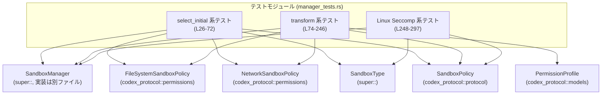
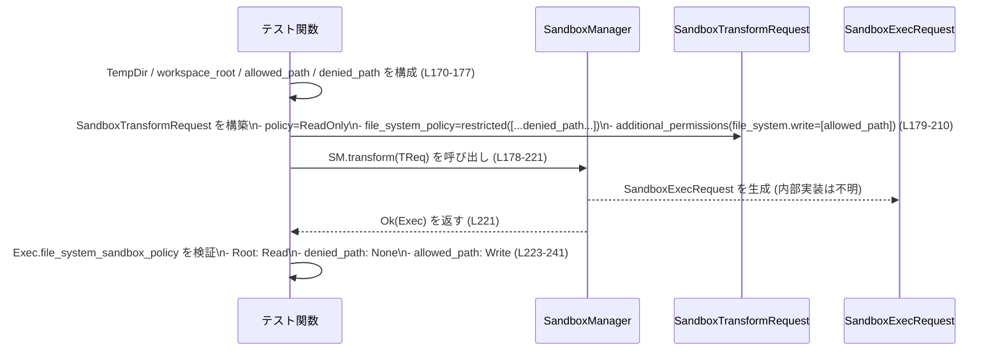

# sandboxing/src/manager_tests.rs コード解説

---

## 0. ざっくり一言

`sandboxing/src/manager_tests.rs` は、`SandboxManager` の **サンドボックス種別選択 (`select_initial`)** と  
**実行リクエスト変換 (`transform`)** の振る舞いを検証するユニットテスト群です  
（行番号は `manager_tests.rs:L…-…` で示します）。

---

## 1. このモジュールの役割

### 1.1 概要

- このモジュールは、`SandboxManager` が
  - ファイルシステム／ネットワークのサンドボックス・ポリシー  
  - ユーザ権限追加 (`PermissionProfile`)  
  - プラットフォーム依存のサンドボックス設定（Linux Seccomp, Windows sandbox level など）  
  に応じて **どのサンドボックスを選び、どのような実行リクエストを生成するか** をテストしています。
- 特に、**危険なフルアクセス** と見なされる設定であっても、  
  ネットワーク要件やファイルシステム制限の有無によってサンドボックスが有効になるか／無効になるか、  
  および `transform` が追加権限をどうマージするかを確認しています  
  （`select_initial` 系テスト: L26-72, `transform` 系テスト: L74-246）。

### 1.2 アーキテクチャ内での位置づけ

このファイルは **テストモジュール** であり、実装はすべて `super` モジュール側にあります。

- 依存関係（テスト視点）:
  - `SandboxManager` / `SandboxType` / `SandboxTransformRequest` / `SandboxCommand`  
    （`super::` からインポート, L1-6）
  - サンドボックス関連ポリシー型 (`FileSystemSandboxPolicy`, `NetworkSandboxPolicy`, `SandboxPolicy` 等, L7-19)
  - パス型・権限型 (`AbsolutePathBuf`, `FileSystemSandboxEntry` など, L11-15, L20)
  - 権限プロファイル (`PermissionProfile` / `FileSystemPermissions` / `NetworkPermissions`, L8-10)

テストから見える依存関係を簡略化すると次のようになります。



> 実際の `SandboxManager` の実装ファイル（例: `sandboxing/src/manager.rs`）はこのチャンクには含まれませんが、  
> `super::SandboxManager` のインポート（L2）とファイル名から、そのような構造であると推測できます（ただし確定はできません）。

### 1.3 設計上のポイント

コードから読み取れるテスト設計上の特徴は次のとおりです。

- **責務の分割**
  - 「サンドボックス種別の初期選択」をテストする関数群（L26-72）と  
    「実行リクエスト変換」をテストする関数群（L74-246）、  
    「Linux Seccomp 用の特殊パス処理」をテストする関数群（L248-297）が分かれています。
- **状態を持たないマネージャ**
  - 各テストごとに `SandboxManager::new()` を新たに生成し（例: L28, L41, L56, L76 など）、  
    共有状態やグローバル状態に依存しないことを前提にしています。
- **エラーハンドリング方針**
  - `transform` は `Result` を返していると推測され、テストでは `.expect("transform")` を使い、  
    成功ケースだけを検証しています（例: L78-101, L122-153, L178-221, L254-275）。
  - 実際にどのような条件で `Err` になるかは、このファイルからは分かりません。
- **プラットフォーム依存分岐**
  - `#[cfg(target_os = "linux")]` で Linux 専用テストが定義されており（L248, L278, L290）、  
    Seccomp サンドボックスにおける `arg0`（実行ファイル名またはエイリアス）の扱いを検証しています。
- **ファイルシステムの実パスを使う**
  - `TempDir` と `canonicalize` を用いて実際のディレクトリ構造を作成し、  
    パス解決を含めた `FileSystemSandboxPolicy` の挙動を間接的に検証しています（L117-121, L171-175）。

---

## 2. 主要な機能一覧

このファイル内の「機能」はすべてテスト関数ですが、  
`SandboxManager` の挙動という観点で整理すると次のシナリオをカバーしています。

- 危険なフルアクセス + ネットワーク要件なし → サンドボックス無効 (`SandboxType::None`) でよいかの検証（L26-37）
- 危険なフルアクセス + ネットワーク要件あり → プラットフォームサンドボックスを使用するかの検証（L39-52）
- ファイルシステム制限あり + ネットワーク要件なし → プラットフォームサンドボックスを使用するかの検証（L54-72）
- 外部サンドボックス + ネットワーク制限あり → `transform` がファイルシステムポリシーを変更しないことの検証（L74-111）
- `PermissionProfile` でネットワーク権限が追加されたとき、  
  `SandboxPolicy::ExternalSandbox` と `NetworkSandboxPolicy` の両方でネットワークが有効になることの検証（L113-165）
- `PermissionProfile` による追加の書き込み権限が、既存の「拒否エントリ」を上書きしないことの検証（L167-246）
- Linux Seccomp サンドボックスで
  - ヘルパー実行ファイルパスがそのまま `arg0` に残るケース（L278-288）
  - ローンチャーパスとヘルパーパスが異なる場合に `"codex-linux-sandbox"` というエイリアスを使うケース（L290-297）
  を検証

---

## 3. 公開 API と詳細解説

このファイルはテストモジュールであり、**公開 API 自体は定義していません**（`exports=0` というメタ情報）。  
ここでは、

- このファイルで新規に定義される関数（テスト／ヘルパー）
- テストを通じて見える `SandboxManager` のコア API の振る舞い

を整理します。

### 3.1 型一覧（構造体・列挙体など）

このファイル内で **新しく定義されている型はありません**。  
代わりに、他モジュールから利用している主要な型を、テストの文脈で整理します。

| 名前 | 種別 | 定義場所（推測を含む） | 役割 / 用途 | 参照行 |
|------|------|------------------------|------------|--------|
| `SandboxManager` | 構造体 | `super` モジュール | サンドボックス種別の選択と実行リクエスト変換を行うマネージャ。各テストで `new()` から生成（L28, L41, L56, L76, L115, L169, L252）。 | manager_tests.rs:L2, L28 など |
| `SandboxType` | 列挙体 | `super` モジュール | `None`, `LinuxSeccomp` など、利用するサンドボックス実装の種別を表現（L36, L71, L92, L266）。 | L4, L36, L71, L266 |
| `SandboxTransformRequest` | 構造体 | `super` モジュール | `transform` に渡す入力。コマンド・ポリシー・追加権限・各種フラグをまとめている（L79-100, L123-152, L179-220, L255-274）。 | L3, L79-100 他 |
| `SandboxCommand` | 構造体 | `super` モジュール | 実行するプログラム、引数、作業ディレクトリ、環境変数などを保持するコマンド記述（L80-86, L124-138, L180-191, L256-262）。 | L1, L80-86 他 |
| `SandboxPolicy` | 列挙体 | `codex_protocol::protocol` | サンドボックス方針の論理レベル表現。`DangerFullAccess` / `ExternalSandbox` / `ReadOnly` など（L87-89, L139-141, L193-196, L263-264）。 | L19, L87-89 他 |
| `FileSystemSandboxPolicy` | 構造体/列挙体的 API | `codex_protocol::permissions` | ファイルシステムのサンドボックス方針。`unrestricted()` / `restricted(vec<...>)` などのコンストラクタを持つ（L30, L60-65, L90, L142, L197-210, L224-240, L264）。 | L14, L30 他 |
| `NetworkSandboxPolicy` | 列挙体 | `codex_protocol::permissions` | ネットワークサンドボックスの有効／無効／制限設定。`Enabled` / `Restricted` 等（L31, L66, L91, L143, L211）。 | L16, L31 他 |
| `PermissionProfile` | 構造体 | `codex_protocol::models` | 追加のネットワーク／ファイルシステム権限をまとめたプロファイル。`transform` の入力として利用（L129-137, L185-191）。 | L10, L129-137 他 |
| `SandboxExecRequest` | 構造体 | `super` モジュール | `transform` の出力。`arg0` や各種ポリシーを含む実行リクエスト（戻り値としてのみ使用, L248-276, L284-287, L296）。 | 型名は L251 の戻り値注釈で登場 |

> これらの型の内部構造や実装は、このチャンクには含まれていません。

### 3.2 関数詳細（最大 7 件）

ここでは、テストがカバーしている「契約」を明らかにするために、代表的な 7 関数を説明します。

---

#### `danger_full_access_defaults_to_no_sandbox_without_network_requirements()`  

- 種別: テスト関数  
- 行範囲: `manager_tests.rs:L26-37`

**概要**

- 「危険なフルアクセス」に相当する状況（`FileSystemSandboxPolicy::unrestricted` + ネットワークサンドボックス有効）であっても、  
  **マネージドネットワーク要件が無い場合** は `SandboxManager::select_initial` が `SandboxType::None` を返すことを検証します（L28-36）。

**引数**

- テスト関数であり、外部からの引数はありません。

**内部処理の流れ**

1. `SandboxManager::new()` で新しいマネージャを生成（L28）。
2. `select_initial` を次のパラメータで呼び出し（L29-35）:
   - ファイルシステム: `FileSystemSandboxPolicy::unrestricted()`（制限なし, L30）
   - ネットワーク: `NetworkSandboxPolicy::Enabled`（L31）
   - ユーザ選好: `SandboxablePreference::Auto`（L32）
   - Windows sandbox level: `WindowsSandboxLevel::Disabled`（L33）
   - `has_managed_network_requirements`: `false`（L34）
3. 戻り値 `sandbox` が `SandboxType::None` であることを `assert_eq!` で確認（L36）。

**戻り値**

- テスト関数自体は `()` を返します。
- 間接的に検証している契約:
  - 上記条件で `select_initial` が `SandboxType::None` を返すこと。

**Errors / Panics**

- `select_initial` 自体は `Result` ではなく、直接 `SandboxType` を返すと見られます（`expect` 等が無い, L29-35）。
- このテストが失敗する唯一の条件は、`sandbox != SandboxType::None` の場合で、そのとき `assert_eq!` がパニックします（L36）。

**Edge cases（エッジケース）**

- 管理されたネットワーク要件フラグ `has_managed_network_requirements` の値のみが  
  このテストでは `false` に固定されているため、`true` のときの挙動は別テストに委ねられています（L39-52）。
- ファイルシステムポリシーは `unrestricted` のみを検証しており、制限付きポリシーは別テストで扱われます（L54-72）。

**使用上の注意点（呼び出し側の前提として読み取れること）**

- 「危険なフルアクセス」状態でも、**マネージドネットワーク要件が無ければサンドボックスが付与されない** 仕様であることを示しています。
- 呼び出し側は「`has_managed_network_requirements == false` で本当に安全かどうか」を別途検討する必要がありますが、  
  それはこのファイルの範囲外です。

---

#### `danger_full_access_uses_platform_sandbox_with_network_requirements()`

- 種別: テスト関数  
- 行範囲: `manager_tests.rs:L39-52`

**概要**

- 危険なフルアクセス + マネージドネットワーク要件ありのとき、  
  `select_initial` が **プラットフォーム依存のサンドボックス**（`get_platform_sandbox` の結果）を使うことを検証します（L41-51）。

**内部処理の流れ**

1. `SandboxManager::new()` を生成（L41）。
2. `get_platform_sandbox(/*windows_sandbox_enabled*/ false)` を呼び出し、  
   `None` の場合は `SandboxType::None` にフォールバックした値を `expected` とする（L42-43）。
3. `select_initial` を以下のパラメータで呼び出し（L44-50）:
   - ファイルシステム: `FileSystemSandboxPolicy::unrestricted()`（L45）
   - ネットワーク: `NetworkSandboxPolicy::Enabled`（L46）
   - ユーザ選好: `SandboxablePreference::Auto`（L47）
   - Windows sandbox level: `WindowsSandboxLevel::Disabled`（L48）
   - `has_managed_network_requirements`: `true`（L49）
4. 戻り値 `sandbox` が `expected` と一致することを `assert_eq!` で確認（L51）。

**Errors / Panics**

- `get_platform_sandbox` が `Err` を返す可能性があるかどうかは不明ですが、ここでは `Option` を返す関数であることだけが分かります（`unwrap_or`, L42-43）。
- `select_initial` のエラーは考慮されていません（直接値を受け取っている, L44-50）。

**Edge cases**

- Windows sandbox が有効であるケース (`windows_sandbox_enabled == true`) の挙動は、このファイルでは検証されていません。
- `get_platform_sandbox` が `None` を返す場合は `SandboxType::None` と同等扱いになることを前提にしています（L42-43）。

**使用上の注意点**

- プラットフォームサンドボックスが取得できない場合でも `SandboxType::None` にフォールバックする仕様を前提に  
  上位コードを設計する必要があります（`unwrap_or(SandboxType::None)`, L42-43）。

---

#### `restricted_file_system_uses_platform_sandbox_without_managed_network()`

- 種別: テスト関数  
- 行範囲: `manager_tests.rs:L54-72`

**概要**

- ファイルシステムに **明示的な制限** が設定されている場合、  
  `has_managed_network_requirements` が `false` であっても、`select_initial` がプラットフォームサンドボックスを選ぶことを検証します（L56-71）。

**内部処理の流れ**

1. `SandboxManager::new()` を生成（L56）。
2. `expected` として `get_platform_sandbox(false).unwrap_or(SandboxType::None)` を計算（L57-58）。
3. ファイルシステムポリシーとして `restricted` を指定し、その中身は:
   - `FileSystemSpecialPath::Root` への `Read` アクセスのみを許可するエントリ（L60-65）。
4. その他のパラメータは:
   - ネットワーク: `NetworkSandboxPolicy::Enabled`（L66）
   - ユーザ選好: `SandboxablePreference::Auto`（L67）
   - Windows sandbox level: `WindowsSandboxLevel::Disabled`（L68）
   - `has_managed_network_requirements`: `false`（L69）
5. `select_initial` の戻り値 `sandbox` が `expected` と一致することを検証（L71）。

**契約として読み取れる点**

- 「ファイルシステムが unrestricted でない場合（= restricted の場合）は、  
  ネットワーク要件の有無にかかわらず、少なくともプラットフォームサンドボックスを利用する」  
  という方針があると解釈できます（ただし実装はこのファイルにはありません）。

**Edge cases**

- `restricted` の中身は最小構成（ルート読み取りのみ）ですが、これ以外のパターン（部分的に許可／拒否など）については  
  別テスト（L167-246）で詳しく検証されています。

---

#### `transform_preserves_unrestricted_file_system_policy_for_restricted_network()`

- 種別: テスト関数  
- 行範囲: `manager_tests.rs:L74-111`

**概要**

- `SandboxManager::transform` が、外部サンドボックス + ネットワーク制限ありのシナリオにおいても、  
  **ファイルシステムポリシーが unrestricted の場合はそれを変更しない** ことを検証します。

**引数（`SandboxTransformRequest` の主なフィールド）**

| フィールド | 型 | 値 | 行 |
|-----------|----|----|----|
| `command.program` | `String` | `"true"`（システムコマンド） | L81 |
| `command.cwd` | `AbsolutePathBuf` | `current_dir()` | L77, L83 |
| `policy` | `&SandboxPolicy` | `ExternalSandbox { network_access: Restricted }` | L87-89 |
| `file_system_policy` | `&FileSystemSandboxPolicy` | `unrestricted()` | L90 |
| `network_policy` | `NetworkSandboxPolicy` | `Restricted` | L91 |
| `sandbox` | `SandboxType` | `None` | L92 |
| `enforce_managed_network` | `bool` | `false` | L93 |
| `additional_permissions` | `Option<PermissionProfile>` | `None` | L85 |

**戻り値**

- `SandboxExecRequest`（`super` モジュール定義）と推測される型のインスタンス（L78-101）。
- テストでは以下のフィールドを検証:
  - `file_system_sandbox_policy` が `unrestricted()` のまま（L103-106）
  - `network_sandbox_policy` が `NetworkSandboxPolicy::Restricted` のまま（L107-110）

**内部処理の流れ（推測を含む）**

1. `transform` が `SandboxTransformRequest` を受け取り、  
   内部で `SandboxExecRequest` に変換する（L78-101）。
2. 入力 `file_system_policy` が unrestricted かつ `additional_permissions.file_system` が `None` なので、  
   ファイルシステムポリシーに変更は加えない。
3. ネットワークポリシーも `NetworkSandboxPolicy::Restricted` のまま保持する。

（2, 3 はテストから読み取れる挙動であり、内部実装は不明です。）

**Errors / Panics**

- `AbsolutePathBuf::current_dir().expect("current dir")` で現在ディレクトリ取得に失敗するとパニックします（L77）。
- `transform(...).expect("transform")` で `transform` が `Err` を返すとパニックします（L100-101）。
- 実際にどういう条件で `Err` となるかは、このファイルからは分かりません。

**Edge cases**

- `additional_permissions` が `Some` のケースは別テストで検証されています（L113-165, L167-246）。
- `sandbox` が `SandboxType::None` のケースのみを扱っており、他のサンドボックス種別については  
  Linux 専用テスト（L248-297）が別途検証します。

**使用上の注意点**

- 「ネットワーク制限を強化しても、ファイルシステム unlimited ポリシーは自動的には制限されない」  
  という設計であることが分かります。呼び出し側がファイルシステム制限を望むなら、  
  明示的に `restricted` を渡す必要があると解釈できます。

---

#### `transform_additional_permissions_enable_network_for_external_sandbox()`

- 種別: テスト関数  
- 行範囲: `manager_tests.rs:L113-165`

**概要**

- 追加権限として `PermissionProfile` に **ネットワーク enabled=true** が指定された場合、  
  - サンドボックス方針 `SandboxPolicy::ExternalSandbox` の `network_access`  
  - `NetworkSandboxPolicy`  
  の両方が **有効 (`Enabled`) に昇格** されることを検証します。

**主な入力**

- `policy`: `SandboxPolicy::ExternalSandbox { network_access: NetworkAccess::Restricted }`（L139-141）
- `network_policy`: `NetworkSandboxPolicy::Restricted`（L143）
- `additional_permissions`:
  - `network.enabled = Some(true)`（L129-132）
  - `file_system.read = Some(vec![path])`（L133-135）
  - `file_system.write = Some(Vec::new())`（L135）

**検証内容**

- `exec_request.sandbox_policy` が  
  `SandboxPolicy::ExternalSandbox { network_access: NetworkAccess::Enabled }` に変わる（L155-160）。
- `exec_request.network_sandbox_policy` が  
  `NetworkSandboxPolicy::Enabled` になる（L161-164）。

**Errors / Panics**

- タイムディレクトリ作成とパス解決で `expect` を使用しているため、  
  ファイルシステム関連の環境依存エラー時にパニックします（L117-121）。
- `transform(...).expect("transform")` のエラー条件は不明です（L122-153）。

**Edge cases**

- `network.enabled = Some(false)` または `None` のケースはテストされていません。
- 追加のファイルシステム権限は「読み取りのみ」であり、書き込み許可の影響は別テスト（L167-246）の対象です。

**使用上の注意点**

- 呼び出し側から `PermissionProfile` を渡すと、  
  **元の高レベルポリシー（`SandboxPolicy` と `NetworkSandboxPolicy`）が上書きされうる** ことを示しています。
- 特にネットワーク権限は、外部サンドボックスの「論理設定」と OS レベルのサンドボックスポリシー双方に影響する点に注意が必要です。

---

#### `transform_additional_permissions_preserves_denied_entries()`

- 種別: テスト関数  
- 行範囲: `manager_tests.rs:L167-246`

**概要**

- 既存の `FileSystemSandboxPolicy::restricted` に **明示的な「拒否エントリ」** がある場合、  
  `PermissionProfile` による追加の書き込み許可がその拒否エントリを上書きしないこと、  
  つまり **「deny は維持したまま allow を追加する」** 合成になることを検証します。

**主な入力**

- 元のファイルシステムポリシー（L197-210）:
  - `/`（`FileSystemSpecialPath::Root`）: `Read`
  - `denied_path`: `None`（アクセス拒否）
- 追加権限 `PermissionProfile`（L185-191）:
  - `file_system.read = None`
  - `file_system.write = Some(vec![allowed_path.clone()])`
- サンドボックス方針 `policy`:
  - `SandboxPolicy::ReadOnly { access: ReadOnlyAccess::FullAccess, network_access: false }`（L193-196）
- ネットワークポリシーは `Restricted`（L211）。

**検証内容**

- `exec_request.file_system_sandbox_policy` が次の 3 エントリを含むことを検証（L223-241）:
  1. `/` : `Read`
  2. `denied_path` : `None`（拒否） ※元の設定を保持（L232-235）
  3. `allowed_path` : `Write` ※新規追加（L236-239）
- ネットワークポリシーは `Restricted` のまま（L242-245）。

**内部処理の契約として読み取れる点**

- `transform` は `PermissionProfile` による追加権限を、既存の `FileSystemSandboxPolicy` に対し:
  - 新しいパスに対してはエントリを **追加**
  - 既に存在するパスの `None`（拒否）を **上書きしない**
  というポリシーでマージしていると解釈できます（L197-210 と L224-240 の比較）。

**Errors / Panics**

- `TempDir` 作成・`canonicalize`・`AbsolutePathBuf::from_absolute_path` のいずれかが失敗するとパニックします（L171-175）。
- `transform(...).expect("transform")` のエラー条件は不明です（L178-221）。

**Edge cases**

- 「既存のエントリが `Read` / `Write` など許可系のときに、追加権限が上書きするかどうか」はテストされていません。
- ここでは `ReadOnly` ポリシーに対して `Write` 権限を追加しており、  
  その結果の整合性（システム全体として矛盾しないか）がどう解決されるかは、このファイルだけでは分かりません。

**使用上の注意点**

- `PermissionProfile` を使ったファイルシステム権限追加は、**deny エントリより弱い**（= deny を上書きしない）  
  という前提で使う必要があります。
- もし「強制的に deny を解除したい」ような仕様が必要であれば、  
  そのための別経路（ポリシー編集など）が必要になると推測されます（本ファイルからは実装不明）。

---

#### `transform_linux_seccomp_request(...) -> super::SandboxExecRequest` （Linux 限定）

- 種別: ヘルパー関数（テスト専用）  
- 行範囲: `manager_tests.rs:L248-276`  
- コンパイル条件: `#[cfg(target_os = "linux")]`

**概要**

- Linux 環境で `SandboxType::LinuxSeccomp` を使用する際の `SandboxExecRequest` を構築するテスト専用ヘルパーです。
- 後続の 2 つのテストでこの関数を用いて、`arg0`（実行ファイル名／パス）の扱いを検証します（L280-288, L292-296）。

**引数**

| 引数名 | 型 | 説明 |
|--------|----|------|
| `codex_linux_sandbox_exe` | `&std::path::Path` | サンドボックスヘルパー実行ファイルと想定されるパス（L249-251）。 |

**内部処理の流れ**

1. `SandboxManager::new()` を生成（L252）。
2. カレントディレクトリを `AbsolutePathBuf::current_dir().expect("current dir")` で取得（L253）。
3. `SandboxTransformRequest` を組み立てて `transform` を呼び出し（L254-275）:
   - `command.program = "true"`（L257）
   - `policy = SandboxPolicy::DangerFullAccess`（L263）
   - `file_system_policy = FileSystemSandboxPolicy::unrestricted()`（L264）
   - `network_policy = NetworkSandboxPolicy::Enabled`（L265）
   - `sandbox = SandboxType::LinuxSeccomp`（L266）
   - `codex_linux_sandbox_exe = Some(codex_linux_sandbox_exe)`（L270）
4. `.expect("transform")` で変換に成功することを前提とし、`SandboxExecRequest` を返す（L275-276）。

**Errors / Panics**

- カレントディレクトリ取得失敗、または `transform` が `Err` を返した場合にパニックします（L253, L275-276）。

**Edge cases**

- `use_legacy_landlock`・`windows_sandbox_level` など、Linux Seccomp と直接関係なさそうなフィールドも指定していますが、  
  これらが実際に無視されるかどうかは、このファイルからは分かりません（L271-273）。

**使用上の注意点**

- この関数はテスト専用であり、**本番コードから直接呼び出すことは想定されていません**。
- Seccomp サンドボックス関連の API 使用例としては参考になります。

---

### 3.3 その他の関数

以下のテスト関数は、上記ヘルパーの振る舞いを確認するための補助的なものです。

| 関数名 | 役割（1 行） | 行範囲 |
|--------|--------------|--------|
| `transform_linux_seccomp_preserves_helper_path_in_arg0_when_available` | `codex_linux_sandbox_exe` が `"codex-linux-sandbox"` を含むパスのとき、`SandboxExecRequest.arg0` にそのフルパス文字列がそのまま入ることを検証します。 | manager_tests.rs:L278-288 |
| `transform_linux_seccomp_uses_helper_alias_when_launcher_is_not_helper_path` | `codex_linux_sandbox_exe` が別のパス（例: `/tmp/codex`）の場合、`arg0` として固定文字列 `"codex-linux-sandbox"` が設定されることを検証します。 | manager_tests.rs:L290-297 |

---

## 4. データフロー

ここでは、**追加権限が既存のファイルシステムポリシーにマージされる流れ**を例に説明します。  
対象は `transform_additional_permissions_preserves_denied_entries`（L167-246）です。

### 4.1 処理の要点

- 入力:
  - もともとの `FileSystemSandboxPolicy::restricted` は
    - `/` への `Read`、
    - `denied_path` への `None`（拒否）
    を含んでいます（L197-210）。
  - `PermissionProfile` で `allowed_path` に対する `Write` 権限を追加します（L185-191）。
- `SandboxManager::transform` はこれらから `SandboxExecRequest` を生成し、  
  その `file_system_sandbox_policy` を返します（L178-221）。
- 返されたポリシーは、**deny エントリ (`denied_path`) を維持しつつ、`allowed_path` の write エントリが追加されたもの**になります（L223-241）。

### 4.2 シーケンス図



この図から分かるポイント:

- テストは **入力ポリシー構築 → `transform` 呼び出し → 出力ポリシー検証** の 3 ステップで構成されています。
- `SandboxManager::transform` 自体は外部からブラックボックスですが、  
  入出力ポリシーから「deny を保持しつつ allow を追加する」合成ルールを持つことが読み取れます。

---

## 5. 使い方（How to Use）

このファイル自体はテスト専用ですが、`SandboxManager` と `SandboxTransformRequest` の実用的な呼び出し例として参考になります。

### 5.1 基本的な使用方法（`transform` の例）

`transform_preserves_unrestricted_file_system_policy_for_restricted_network`（L74-111）を簡略化した例です。

```rust
use std::collections::HashMap;
use codex_protocol::protocol::{SandboxPolicy, NetworkAccess};
use codex_protocol::permissions::{FileSystemSandboxPolicy, NetworkSandboxPolicy};
use codex_protocol::config_types::WindowsSandboxLevel;
use codex_utils_absolute_path::AbsolutePathBuf;
use sandboxing::SandboxManager;
use sandboxing::{SandboxCommand, SandboxTransformRequest, SandboxType};

fn example_transform() {
    // カレントディレクトリを AbsolutePathBuf で取得する（L77 と同様）
    let cwd = AbsolutePathBuf::current_dir().expect("current dir");

    // マネージャを生成（L76 と同様）
    let manager = SandboxManager::new();

    // 変換リクエストを構築（L79-100 を簡略化）
    let request = SandboxTransformRequest {
        command: SandboxCommand {
            program: "true".into(),
            args: Vec::new(),
            cwd: cwd.clone(),
            env: HashMap::new(),
            additional_permissions: None,
        },
        policy: &SandboxPolicy::ExternalSandbox {
            network_access: NetworkAccess::Restricted,
        },
        file_system_policy: &FileSystemSandboxPolicy::unrestricted(),
        network_policy: NetworkSandboxPolicy::Restricted,
        sandbox: SandboxType::None,
        enforce_managed_network: false,
        network: None,
        sandbox_policy_cwd: cwd.as_path(),
        codex_linux_sandbox_exe: None,
        use_legacy_landlock: false,
        windows_sandbox_level: WindowsSandboxLevel::Disabled,
        windows_sandbox_private_desktop: false,
    };

    // 変換を実行（L78-101）
    let exec_request = manager.transform(request).expect("transform");

    // exec_request.file_system_sandbox_policy / network_sandbox_policy などを利用する
    println!("{:?}", exec_request.network_sandbox_policy);
}
```

この例から分かること:

- `transform` は **高レベルポリシー (`SandboxPolicy`) と低レベルポリシー (`FileSystemSandboxPolicy`, `NetworkSandboxPolicy`) をまとめて受け取り**、  
  実行可能なリクエスト (`SandboxExecRequest`) を返す役割を担っています。
- エラー処理は `Result` 経由で行われており、呼び出し側で `?` あるいは `expect` などを利用して扱う必要があります。

### 5.2 よくある使用パターン

テストから見える代表的なパターンは次のとおりです。

1. **初期サンドボックス種別の決定 (`select_initial`)**
   - 引数: ファイルシステムポリシー、ネットワークポリシー、ユーザ選好、Windows sandbox level、ネットワーク要件フラグ（L29-35, L44-50, L59-69）。
   - 出力: `SandboxType`（L36, L51, L71）。
   - 用途: UI や上位ロジックで「どのサンドボックスを使うか」を決める際のデフォルト決定。

2. **追加権限によるポリシー昇格**
   - `PermissionProfile.network.enabled = true` でネットワークサンドボックスを `Enabled` に昇格（L129-132, L155-164）。

3. **ファイルシステム deny/allow のマージ**
   - 既存 `restricted` ポリシーに `write` 権限を追加しても、`None`（deny）は保持（L185-191, L197-210, L223-241）。

### 5.3 よくある間違い（推測されるもの）

コードから推測される「誤用しそうなポイント」とその対比です。

```rust
// 誤りの可能性が高い例（推測）:
// 追加権限が既存ポリシーを完全に上書きすると誤解している
let profile = PermissionProfile {
    file_system: Some(FileSystemPermissions {
        read: None,
        write: Some(vec![allowed_path.clone()]),
    }),
    ..Default::default()
};
// これで denied_path の deny も解除されると期待すると、テストの契約と矛盾する（L197-210, L223-241）。

// 本ファイルが示す正しい前提:
let exec_request = manager.transform(SandboxTransformRequest {
    // ...
    file_system_policy: &original_policy,      // 既存の restricted ポリシー
    command: /* ... */,
    // ...
}).expect("transform");

// exec_request.file_system_sandbox_policy では、
// - denied_path: None が維持され
// - allowed_path: Write が追加されると期待すべき（L223-241）。
```

### 5.4 使用上の注意点（まとめ）

テストから読み取れる、モジュール全体の共通注意点を整理します。

- **エラー処理**
  - `transform` は `Result` を返すため、呼び出し側でエラーを明示的に扱う必要があります（L78-101, L122-153, L178-221, L254-275）。
  - `AbsolutePathBuf::current_dir()` や `canonicalize` など、環境依存 I/O もエラー源になります（L77, L117-121, L171-175）。
- **安全性（セキュリティ）**
  - `DangerFullAccess` であっても `has_managed_network_requirements == false` の場合はサンドボックスが無効 (`SandboxType::None`) となる設計です（L26-37）。
  - 追加権限によってネットワークが有効化される可能性があるため、`PermissionProfile` の内容は慎重に扱う必要があります（L129-132, L155-164）。
- **ファイルシステムポリシーのマージ**
  - deny エントリは追加権限よりも強く、`PermissionProfile` では解除できないことがテストから読み取れます（L197-210, L223-241）。
- **プラットフォーム依存**
  - Linux では Seccomp サンドボックス利用時に `arg0` がヘルパープログラムのフルパスまたは `"codex-linux-sandbox"` になる仕様です（L278-288, L290-297）。
  - Windows 向けの詳細な挙動（`WindowsSandboxLevel` が有効な場合など）は、このファイルでは検証されていません。

---

## 6. 変更の仕方（How to Modify）

このファイルはテストモジュールであるため、「変更」とは主に **テストケースの追加・修正** を意味します。

### 6.1 新しい機能を追加する場合（テスト観点）

1. **対象機能の把握**
   - 追加・変更したい `SandboxManager` のメソッドや振る舞いを特定します  
     （例: `transform` に新しいポリシーフィールドを追加した場合）。
2. **既存テストの参照**
   - 類似するテストパターンを探します。  
     - `select_initial` 用なら L26-72 のテスト群を参照。
     - `transform` + 権限マージ用なら L113-165, L167-246 を参照。
3. **テスト関数の追加**
   - `#[test]` 属性付き関数を作成し、既存と同様に `SandboxManager::new()` から始め、  
     `SandboxTransformRequest`／`select_initial` の入力を構築します。
4. **期待される契約を明示**
   - `assert_eq!` などで、**意図するポリシーの変化／不変** を明示的に検証します。

### 6.2 既存の機能を変更する場合（注意点）

`SandboxManager` の実装を変更する際に、このテストファイルから読み取れる注意点は次のとおりです。

- **契約（前提条件・不変条件）**
  - `has_managed_network_requirements == false` での `SandboxType::None` という挙動を変えると、L26-37 のテストが壊れます。
  - 追加権限によるネットワーク有効化（L113-165）や deny の保持（L167-246）は、仕様として固定されています。
- **影響範囲の確認**
  - `SandboxManager::select_initial` のロジックを変更する場合は、  
    選択される `SandboxType` を期待する 3 つのテスト（L26-72）すべてに影響します。
  - `transform` のマージロジックを触る場合は、`transform_*` 系のすべてのテスト（L74-246, L248-297）を確認する必要があります。
- **テストの更新**
  - 仕様変更が意図的なものであれば、テストの期待値（`assert_eq!` の右側）も合わせて更新する必要があります。

---

## 7. 関連ファイル

このモジュールと密接に関係すると思われるファイル・ディレクトリを整理します。

| パス（推測を含む） | 役割 / 関係 |
|--------------------|------------|
| `sandboxing/src/manager.rs` など（推測） | `super::SandboxManager`, `SandboxCommand`, `SandboxTransformRequest`, `SandboxType`, `SandboxExecRequest` など、本テストで使用している型・メソッドの実装を提供している親モジュールと考えられます。ファイル名と `super::` 参照（L1-4, L248-251）から推測されますが、このチャンクだけでは確定できません。 |
| `codex_protocol::permissions` 系モジュール | `FileSystemSandboxPolicy`, `FileSystemSandboxEntry`, `FileSystemAccessMode`, `FileSystemPath`, `FileSystemSpecialPath`, `NetworkSandboxPolicy` などのサンドボックスポリシー定義を提供します（L11-16, L60-65, L197-210, L224-240）。 |
| `codex_protocol::protocol` 系モジュール | `SandboxPolicy`, `NetworkAccess`, `ReadOnlyAccess` など、上位レベルのサンドボックス方針を表現する型を提供します（L17-19, L87-89, L139-141, L193-196, L263-264）。 |
| `codex_protocol::models` 系モジュール | `PermissionProfile`, `FileSystemPermissions`, `NetworkPermissions` など、追加権限を表現するモデルを提供します（L8-10, L129-137, L185-191）。 |
| `codex_utils_absolute_path` | `AbsolutePathBuf` による絶対パス管理と `current_dir` 取得を提供し、ポリシーで使用するパスの正規化に寄与します（L20, L77, L118-121, L172-175, L253）。 |
| `tests` を実行するビルドスクリプト／CI 設定 | このファイル自体は `#[test]` 関数を提供するだけなので、実際にテストを実行するには `cargo test` などのビルド設定が必要です（このチャンクには現れません）。 |

---

### Bugs / Security / Performance についての補足（まとめ）

- **Bugs**
  - このファイルからのみでは、`SandboxManager` の内部バグの有無は判断できません。
  - ただし、テスト群は特に「dangerous full access」周りの仕様を固定しているため、  
    将来仕様を変更するときにテストが「意図しない挙動」を検出する役割を果たします。
- **Security**
  - `DangerFullAccess` + ネットワーク要件なし → サンドボックスなし（L26-37）という仕様は、  
    安全性より利便性を優先したデフォルトと読むこともできます。  
    これが妥当かどうかはプロジェクト全体の脅威モデルに依存し、このファイルだけでは判断できません。
  - deny を優先するマージ戦略（L197-210, L223-241）は、安全側に倒した設計であると解釈できます。
- **Performance / Scalability**
  - テストでは `TempDir` と `canonicalize` を繰り返し使うため、実行時間はファイルシステムの性能に依存します（L117-121, L171-175）。
  - 本番コードにおいても `transform` がパスの正規化やポリシー構築を行うため、大量の呼び出しがある場合にはプロファイリングが必要になる可能性がありますが、詳細はこのファイルからは分かりません。

以上が、このチャンク（`sandboxing/src/manager_tests.rs`）から読み取れる範囲での解説です。
