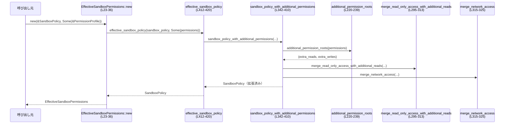

# sandboxing/src/policy_transforms.rs コード解説

## 0. ざっくり一言

Sandbox（サンドボックス）実行に関する **権限プロフィール（PermissionProfile）と各種 SandboxPolicy** を変換・統合し、「最終的に適用されるサンドボックス設定」を計算するモジュールです。  
ネットワーク・ファイルシステムの追加権限を既存ポリシーにマージし、必要に応じてプラットフォームサンドボックスの要否も判定します。  
（根拠: `policy_transforms.rs`:L17-20, L39-61, L63-144, L241-293, L327-340, L342-442）

---

## 1. このモジュールの役割

### 1.1 概要

- このモジュールは、ユーザーや上位レイヤーから渡される **PermissionProfile（追加権限要求）** と、  
  既存の **SandboxPolicy / FileSystemSandboxPolicy / NetworkSandboxPolicy** を組み合わせ、  
  **実際に適用されるサンドボックス権限** を計算する役割を持ちます。  
  （根拠: `policy_transforms.rs`:L17-20, L39-61, L63-144, L241-293, L327-340, L342-420）
- ファイルシステム権限ではパスの正規化・重複除去を行い、  
  ネットワーク権限では base ポリシーと追加権限の OR/制限を行います。  
  （根拠: L39-61, L146-184, L186-218, L241-293, L315-340）

### 1.2 アーキテクチャ内での位置づけ

PermissionProfile（論理的な権限要求）から最終的な Sandbox 設定を作る、変換レイヤーとして機能します。

```mermaid
graph TD
    subgraph Models
        PP["PermissionProfile<br/>(追加権限)"]
        FSP["FileSystemSandboxPolicy"]
        NSP["NetworkSandboxPolicy"]
        SP["SandboxPolicy"]
    end

    subgraph Transforms (policy_transforms.rs)
        NAP["normalize_additional_permissions<br/>(L39-61)"]
        MPP["merge_permission_profiles<br/>(L63-109)"]
        IPP["intersect_permission_profiles<br/>(L111-144)"]
        EFSP["effective_file_system_sandbox_policy<br/>(L275-293)"]
        ENSP["effective_network_sandbox_policy<br/>(L327-340)"]
        ESP["EffectiveSandboxPermissions::new<br/>(L23-36)"]
        SRPS["should_require_platform_sandbox<br/>(L422-442)"]
    end

    PP --> NAP --> PP
    PP --> MPP
    PP --> IPP

    PP --> EFSP
    FSP --> EFSP

    PP --> ENSP
    NSP --> ENSP

    PP --> ESP
    SP --> ESP

    FSP --> SRPS
    NSP --> SRPS
```

※この図は `policy_transforms.rs`:L17-144, L241-293, L327-340, L342-442 をもとにしています。

### 1.3 設計上のポイント

- **ステートレス設計**  
  グローバル状態や内部状態を保持せず、すべての関数は引数だけを元に戻り値を計算します。  
  （根拠: 全関数が `fn ...` / `pub fn ...` で self/state を持たない, L39-442）
- **Option/Result によるエラー・空値表現**  
  - 権限が存在しない・空であるケースは `Option` で表現し、  
    非空かどうかの判定には `is_empty()` メソッドを用いています。  
    （根拠: L39-60, L63-109, L111-144）
  - `normalize_additional_permissions` は `Result` を返しますが、現時点では常に `Ok` を返しています。  
    （根拠: L39-61）
- **ファイルシステムパスの正規化と重複排除**  
  - パスは `canonicalize_preserving_symlinks` で正規化を試み、失敗時は元のパスを利用します。  
  - `HashSet` による重複排除を行います。  
    （根拠: L166-184, L209-218）
- **ネットワーク権限の単純な論理 OR**  
  - base 側または追加権限側のどちらかが「有効」であれば有効にします。  
    （根拠: L73-88, L315-325, L327-340, L352-363）
- **安全性（Rust 的な意味）**  
  - すべての関数は安全関数（`unsafe` 未使用）であり、  
    明示的な `unwrap` や `panic!` も使用していません。  
    （根拠: ファイル全体を通して `unsafe` / `unwrap` / `panic!` が存在しない）

---

## 2. 主要な機能一覧とコンポーネントインベントリ

### 2.1 主要な機能（概要）

- 追加権限プロフィールの正規化:  
  ネットワーク・ファイルシステム権限から空の項目を除去し、パスを正規化する  
  （`normalize_additional_permissions`; L39-61）
- 権限プロフィールのマージ（和集合）:  
  base 権限と追加権限をマージし、ネットワークは論理 OR、  
  ファイルシステムはパスの集合として統合する  
  （`merge_permission_profiles`; L63-109）
- 権限プロフィールの交差（共通部分）計算:  
  requested / granted の両方を満たす権限のみを残す  
  （`intersect_permission_profiles`; L111-144）
- ファイルシステムサンドボックスポリシーの拡張:  
  `FileSystemSandboxPolicy` に追加の read/write roots をマージする  
  （`effective_file_system_sandbox_policy`; L275-293）
- ネットワークサンドボックスポリシーの拡張・制限:  
  `NetworkSandboxPolicy` と追加権限から有効/制限状態を決定する  
  （`effective_network_sandbox_policy`; L327-340）
- 総合 SandboxPolicy の拡張:  
  `SandboxPolicy` と `PermissionProfile` から、実際に使う `SandboxPolicy` を構成する  
  （`effective_sandbox_policy`, `sandbox_policy_with_additional_permissions`; L342-420）
- プラットフォームサンドボックス要否判定:  
  FileSystem/Network の sandbox ポリシーとネットワーク要求から、  
  OS レベルのサンドボックス（例: macOS App Sandbox）の必要性を判定する  
  （`should_require_platform_sandbox`; L422-442）
- これらをまとめて保持する便利型:  
  `EffectiveSandboxPermissions` による `SandboxPolicy` 包装  
  （L17-37）

### 2.2 関数・構造体インベントリ（行番号付き）

| 名前 | 種別 | 公開 | 役割 / 用途 | 行番号 (根拠) |
|------|------|------|-------------|----------------|
| `EffectiveSandboxPermissions` | 構造体 | 公開 | 最終的な `SandboxPolicy` を 1 つにまとめて保持する薄いラッパー | `policy_transforms.rs`:L17-20 |
| `EffectiveSandboxPermissions::new` | 関数（impl メソッド） | 公開 | 既存 `SandboxPolicy` と追加権限から `EffectiveSandboxPermissions` を構築する | L22-36 |
| `normalize_additional_permissions` | 関数 | 公開 | 追加 PermissionProfile 内の空項目除去・パス正規化を行う | L39-61 |
| `merge_permission_profiles` | 関数 | 公開 | base と追加の PermissionProfile をマージし、結合結果を返す | L63-109 |
| `intersect_permission_profiles` | 関数 | 公開 | requested / granted プロファイルの共通部分を計算する | L111-144 |
| `intersect_permission_paths` | 関数 | 非公開 | 2 つの `Vec<AbsolutePathBuf>` の共通要素を計算する | L146-164 |
| `normalize_permission_paths` | 関数 | 非公開 | パスの正規化と重複排除を行う | L166-184 |
| `merge_permission_paths` | 関数 | 非公開 | 2 つのパス集合を結合し、重複を除去する | L186-207 |
| `dedup_absolute_paths` | 関数 | 非公開 | 単一の `Vec<AbsolutePathBuf>` 内の重複を除去する | L209-218 |
| `additional_permission_roots` | 関数 | 非公開 | `PermissionProfile` から read/write のルートパス集合を抽出する | L220-239 |
| `merge_file_system_policy_with_additional_permissions` | 関数 | 非公開 | `FileSystemSandboxPolicy::Restricted` に追加 read/write roots を統合する | L241-273 |
| `effective_file_system_sandbox_policy` | 関数 | 公開 | 追加権限を考慮した最終的な `FileSystemSandboxPolicy` を返す | L275-293 |
| `merge_read_only_access_with_additional_reads` | 関数 | 非公開 | `ReadOnlyAccess` に追加 read roots を統合する | L295-313 |
| `merge_network_access` | 関数 | 非公開 | base のネットワークフラグと追加権限から最終的なネットワーク可否 bool を計算する | L315-325 |
| `effective_network_sandbox_policy` | 関数 | 公開 | 追加権限を反映した `NetworkSandboxPolicy` を決定する | L327-340 |
| `sandbox_policy_with_additional_permissions` | 関数 | 非公開 | 既存 `SandboxPolicy` に追加 PermissionProfile をマージし新しい `SandboxPolicy` を作る | L342-410 |
| `effective_sandbox_policy` | 関数 | 非公開 | Option<&PermissionProfile> に応じて `SandboxPolicy` をそのまま返すか拡張するかを選ぶ | L412-420 |
| `should_require_platform_sandbox` | 関数 | 公開 | ファイルシステム・ネットワークポリシーと要件から OS サンドボックスの必要性を判定 | L422-442 |
| `tests` モジュール | モジュール | 非公開 | このファイル用のテストを `policy_transforms_tests.rs` に切り出して定義 | L444-446 |

---

## 3. 公開 API と詳細解説

### 3.1 型一覧

| 名前 | 種別 | フィールド | 役割 / 用途 | 行番号 |
|------|------|-----------|-------------|--------|
| `EffectiveSandboxPermissions` | 構造体 | `sandbox_policy: SandboxPolicy` | 追加権限を反映した最終的な `SandboxPolicy` を保持する | L17-20 |

### 3.2 公開関数 詳細

以下では、実際に外部から利用される可能性が高い 7 つの公開関数／メソッドについて詳しく説明します。

---

#### `EffectiveSandboxPermissions::new(sandbox_policy: &SandboxPolicy, additional_permissions: Option<&PermissionProfile>) -> Self`

**概要**

- 既存の `SandboxPolicy` と、任意の追加 `PermissionProfile` から、  
  追加権限を反映した最終的な `SandboxPolicy` を計算し、それを `EffectiveSandboxPermissions` として包んで返します。  
  （根拠: L22-36, L412-420）

**引数**

| 引数名 | 型 | 説明 |
|--------|----|------|
| `sandbox_policy` | `&SandboxPolicy` | ベースとなるサンドボックスポリシー |
| `additional_permissions` | `Option<&PermissionProfile>` | 追加で許可したい権限（ない場合は `None`） |

**戻り値**

- `EffectiveSandboxPermissions`  
  - 内部フィールド `sandbox_policy` に、追加権限を反映した `SandboxPolicy` を保持します。  
    追加権限が `None` または空の場合は、元の `sandbox_policy` と等価になります。  
    （根拠: L27-31, L33-35, L346-348, L412-420）

**内部処理の流れ**

1. `additional_permissions` が `None` なら、そのまま `sandbox_policy.clone()` を返す。  
   （根拠: L27-31）
2. `Some` の場合は `effective_sandbox_policy(sandbox_policy, Some(additional_permissions))` を呼び出し、  
   追加権限をマージした `SandboxPolicy` を取得する。  
   （根拠: L33-35, L412-420）
3. それを `EffectiveSandboxPermissions { sandbox_policy: ... }` として返す。  

**Examples（使用例・概略）**

```rust
use codex_protocol::protocol::{SandboxPolicy, ReadOnlyAccess};
use sandboxing::policy_transforms::EffectiveSandboxPermissions;
use codex_protocol::models::{PermissionProfile, NetworkPermissions, FileSystemPermissions};
use codex_utils_absolute_path::AbsolutePathBuf;

// ベースの SandboxPolicy（読み取り専用 + ネットワーク無効）を定義する例
let base_policy = SandboxPolicy::ReadOnly {
    access: ReadOnlyAccess::Restricted {
        include_platform_defaults: true,
        readable_roots: vec![],
    },
    network_access: false,
};

// 追加でネットワークを有効にしたい PermissionProfile（簡略例）
let additional = PermissionProfile {
    network: Some(NetworkPermissions { enabled: Some(true) }),
    file_system: None,
};

let effective = EffectiveSandboxPermissions::new(&base_policy, Some(&additional));
// effective.sandbox_policy には network_access が有効になった ReadOnly ポリシーが格納される
```

※ `PermissionProfile` / `NetworkPermissions` のフィールド構造は、このファイルで参照されるものに基づいた簡略例です（完全な定義は `codex_protocol` 側に依存します）。

**Errors / Panics**

- 明示的な `Err` や panic 経路はありません。  
  内部で呼ぶ `effective_sandbox_policy` も Result を返さず、`clone` と純粋なデータ変換のみを行います。  
  （根拠: L412-420, L342-410）

**Edge cases（エッジケース）**

- `additional_permissions` が `None` の場合  
  - 元の `sandbox_policy` をクローンして返します。  
    （根拠: L27-31）
- `additional_permissions` が `Some` だが `PermissionProfile::is_empty()` な場合  
  - `sandbox_policy_with_additional_permissions` 内で早期 return により、やはり元のポリシーが返ります。  
    （根拠: L346-348）

**使用上の注意点**

- このメソッドは単にラッパーであり、権限ロジック自体は `sandbox_policy_with_additional_permissions` にあります。  
  挙動を変えたい場合はそちらを変更する必要があります。  
  （根拠: L33-35, L342-410）
- スレッドセーフ性: グローバル状態を持たないため、このメソッド自体は並行に呼び出してもデータ競合は発生しません。

---

#### `normalize_additional_permissions(additional_permissions: PermissionProfile) -> Result<PermissionProfile, String>`

**概要**

- 追加の PermissionProfile を正規化します。  
  - ネットワーク: 空の設定は `None` にする。  
  - ファイルシステム: read/write のパスを正規化し、空の場合は `None` とする。  
  （根拠: L39-61, L166-184）

**引数**

| 引数名 | 型 | 説明 |
|--------|----|------|
| `additional_permissions` | `PermissionProfile` | 正規化前の追加権限プロフィール |

**戻り値**

- `Result<PermissionProfile, String>`  
  - 現状の実装では常に `Ok(正規化済み PermissionProfile)` を返します。`Err` 経路はありません。  
    （根拠: L39-61）

**内部処理の流れ**

1. `network` フィールド: `additional_permissions.network` を取得し、`is_empty()` なら `None` にします。  
   （根拠: L42-44）
2. `file_system` フィールド:  
   1. `additional_permissions.file_system` を取り出し `map`。  
   2. その `read` / `write` をそれぞれ `normalize_permission_paths` に通す。  
      - ここでパスの正規化と重複排除が行われます。  
      （根拠: L45-55, L166-184）
   3. 結果の `FileSystemPermissions` について `is_empty()` が true なら `None` にする。  
      （根拠: L55-56）
3. 以上を使って新たな `PermissionProfile { network, file_system }` を構築し `Ok(...)` で返す。  

**Examples（使用例・概略）**

```rust
use codex_protocol::models::{PermissionProfile, NetworkPermissions, FileSystemPermissions};
use codex_utils_absolute_path::AbsolutePathBuf;
use sandboxing::policy_transforms::normalize_additional_permissions;

let profile = PermissionProfile {
    network: Some(NetworkPermissions { enabled: Some(false) }), // is_empty() の実装により空扱いかは定義依存
    file_system: Some(FileSystemPermissions {
        read: Some(vec![
            AbsolutePathBuf::from_absolute_path("/tmp".into()).unwrap(),
            AbsolutePathBuf::from_absolute_path("/tmp/../tmp".into()).unwrap(),
        ]),
        write: None,
    }),
};

let normalized = normalize_additional_permissions(profile).unwrap();
// 読み取りパスは正規化・重複除去され、空なら file_system は None になる
```

**Errors / Panics**

- 戻り値型は `Result` ですが、現実装では `Err` を返すコードがありません。  
  （根拠: L39-61）
- `canonicalize_preserving_symlinks` でのエラーは `ok()` で握りつぶし、元のパスを採用します。  
  これにより OS 側のエラーで panic することはありません。  
  （根拠: L174-177）

**Edge cases**

- パスの正規化に失敗した場合  
  - 元の `AbsolutePathBuf` をそのまま使います。  
    （根拠: L174-177）
- read/write が `Some(vec![])` の場合  
  - `normalize_permission_paths` の結果は `Vec` ですが、空ベクタであってもそのまま保持されます。  
  - それが `FileSystemPermissions::is_empty()` でどう扱われるかは、このファイルからは分かりません。  
    （根拠: L48-55）

**使用上の注意点**

- ファイルシステムパスに対して実際に `canonicalize_preserving_symlinks` が走るため、  
  多数のパスを与えるとファイルシステムアクセスが増え、性能に影響する可能性があります。  
  （根拠: L166-184）
- 結果が `Result` でも `Err` が返らないため、今後の変更で `Err` 経路が追加される可能性があります。  
  呼び出し側では `?` で伝播させる設計にしておくと拡張に対応しやすいです。

---

#### `merge_permission_profiles(base: Option<&PermissionProfile>, permissions: Option<&PermissionProfile>) -> Option<PermissionProfile>`

**概要**

- base 側の PermissionProfile と追加側（permissions）をマージします。  
  - ネットワーク: どちらかが `enabled: Some(true)` なら有効。  
  - ファイルシステム: read/write ごとにパス集合をマージし、重複を除去。  
  - 全体が空なら `None`。  
  （根拠: L63-109, L186-207）

**引数**

| 引数名 | 型 | 説明 |
|--------|----|------|
| `base` | `Option<&PermissionProfile>` | 既存の権限プロフィール |
| `permissions` | `Option<&PermissionProfile>` | 追加でマージする権限プロフィール |

**戻り値**

- `Option<PermissionProfile>`  
  - どちらも空であれば `None`。  
  - いずれかに有効な権限があれば、それらをマージした `Some(PermissionProfile)`。  
    （根拠: L71-107）

**内部処理の流れ**

1. `permissions` が `None` の場合  
   - 単に `base.cloned()` を返す。  
     （根拠: L67-69）
2. `base` の有無で分岐:  
   - `Some(base)` の場合:
     - ネットワーク:
       - `(base.network, permissions.network)` のいずれかが `enabled: Some(true)` なら `enabled: Some(true)` を返す。  
         そうでなければ `None`。  
         （根拠: L73-88）
     - ファイルシステム:
       - 両方 Some ⇒ `merge_permission_paths` で read/write をマージ。  
         （根拠: L90-95, L186-207）
       - どちらかのみ Some ⇒ それをそのまま採用。  
       - 両方 None ⇒ None。  
     - 最後に `PermissionProfile { network, file_system }` を作成し、  
       `is_empty()` なら `None` にフィルタする。  
       （根拠: L101-105）
   - `None` の場合 (`base` なし):
     - `permissions.clone()` を `is_empty()` でフィルタして返す。  
       （根拠: L107）

**Examples（使用例・概略）**

```rust
use codex_protocol::models::{PermissionProfile, NetworkPermissions};
use sandboxing::policy_transforms::merge_permission_profiles;

let base = PermissionProfile {
    network: Some(NetworkPermissions { enabled: Some(false) }),
    file_system: None,
};
let extra = PermissionProfile {
    network: Some(NetworkPermissions { enabled: Some(true) }),
    file_system: None,
};

// base に対して extra をマージ
let merged = merge_permission_profiles(Some(&base), Some(&extra)).unwrap();
// merged.network.enabled は Some(true) になる想定
```

**Errors / Panics**

- panic 経路はありません。  
  `merge_permission_paths` も内部で HashSet と clone のみです。  
  （根拠: L186-207）

**Edge cases**

- `base` も `permissions` も `None` の場合  
  - 戻り値は `None` となります。  
    （根拠: L67-69, L107）
- 双方のネットワークが `enabled: Some(false)` ないし空の場合  
  - `network` フィールドは `None` になります。  
    （根拠: L73-88）

**使用上の注意点**

- ネットワークの enabled が `Some(false)` のときの `is_empty()` の挙動はこのファイルからは分かりません。  
  そのため、「false は明示的な無効」なのか「未設定と同義」なのかは `NetworkPermissions::is_empty` の定義に依存します。
- ファイルシステムのパス数が増えると `HashSet` の構築コストが増加しますが、通常は許容範囲と考えられます。

---

#### `intersect_permission_profiles(requested: PermissionProfile, granted: PermissionProfile) -> PermissionProfile`

**概要**

- 要求された権限（requested）と、実際に許可された権限（granted）の「共通部分」を計算します。  
  - ファイルシステム: パスの共通部分（intersection）。  
  - ネットワーク: requested/granted 両方が `enabled: Some(true)` の場合のみ有効。  
  （根拠: L111-144, L146-164）

**引数**

| 引数名 | 型 | 説明 |
|--------|----|------|
| `requested` | `PermissionProfile` | 要求された権限セット |
| `granted` | `PermissionProfile` | 許可された権限セット |

**戻り値**

- `PermissionProfile`  
  - 各フィールドは共通部分のみを保持します。  
  - 一部フィールドが `None` となる可能性があります。  
    （根拠: L111-144）

**内部処理の流れ**

1. ファイルシステム:
   - `requested.file_system` が `Some` の場合だけ処理する。  
   - `granted.file_system.unwrap_or_default()` を基準とし、  
     `intersect_permission_paths` で read/write ごとの共通部分を計算。  
     （根拠: L115-123, L146-164）
   - 結果の `FileSystemPermissions` が `is_empty()` なら None にする。  
     （根拠: L123-125）
2. ネットワーク:
   - requested/granted の両方が `Some(NetworkPermissions { enabled: Some(true) })` のときだけ  
     `NetworkPermissions { enabled: Some(true) }` を返す。  
   - それ以外は `None`。  
     （根拠: L126-138）
3. 上記をまとめて新しい `PermissionProfile` を返す。  

**Examples（使用例・概略）**

```rust
use sandboxing::policy_transforms::intersect_permission_profiles;
use codex_protocol::models::{PermissionProfile, NetworkPermissions};

let requested = PermissionProfile {
    network: Some(NetworkPermissions { enabled: Some(true) }),
    file_system: None,
};
let granted = PermissionProfile {
    network: Some(NetworkPermissions { enabled: Some(false) }),
    file_system: None,
};

let effective = intersect_permission_profiles(requested, granted);
// effective.network は None になる（両方 true でないため）
```

**Errors / Panics**

- panic 経路はありません。  
  `unwrap_or_default()` は `Default` 実装に依存しますが、panic しません。  
  （根拠: L118）

**Edge cases**

- `requested.file_system` が `None` の場合  
  - ファイルシステム権限は一切付与されません。  
    （根拠: L115-125）
- `requested` 側のパス集合が空ベクタの場合  
  - `intersect_permission_paths` 内で特別扱いされ、`granted` が `Some` なら `Some(Vec::new())` を返します。  
    その後の扱いは `FileSystemPermissions::is_empty` の実装次第です。  
    （根拠: L150-152）

**使用上の注意点**

- 「共通部分」の定義はパスの **完全一致** に基づきます。部分パスや親ディレクトリの包含関係は考慮していません。  
  （根拠: L159-160, `contains(path)` による比較）
- パスの正規化は行っていないため、事前に `normalize_additional_permissions` 等で正規化してから呼び出す方が安全です。

---

#### `effective_file_system_sandbox_policy(file_system_policy: &FileSystemSandboxPolicy, additional_permissions: Option<&PermissionProfile>) -> FileSystemSandboxPolicy`

**概要**

- 既存の `FileSystemSandboxPolicy` に、追加のファイルシステム権限（read/write roots）を統合した  
  「実際に適用するファイルシステムサンドボックスポリシー」を返します。  
  （根拠: L275-293, L220-239, L241-273）

**引数**

| 引数名 | 型 | 説明 |
|--------|----|------|
| `file_system_policy` | `&FileSystemSandboxPolicy` | ベースのファイルシステムサンドボックスポリシー |
| `additional_permissions` | `Option<&PermissionProfile>` | 追加ファイルシステム権限を含む PermissionProfile |

**戻り値**

- `FileSystemSandboxPolicy`  
  - 追加権限の read/write roots を反映したポリシー。  
  - 追加権限がなければ `file_system_policy.clone()` と同一。  

**内部処理の流れ**

1. `additional_permissions` が `None` の場合  
   - `file_system_policy.clone()` を即時返す。  
     （根拠: L279-281）
2. `Some` の場合:
   - `additional_permission_roots` で read/write roots をそれぞれ `Vec<AbsolutePathBuf>` として取得。  
     （根拠: L283, L220-239）
   - 両方とも空なら `file_system_policy.clone()` を返す。  
     （根拠: L284-286）
   - どちらかが非空なら `merge_file_system_policy_with_additional_permissions` で統合し返す。  
     （根拠: L287-292, L241-273）

`merge_file_system_policy_with_additional_permissions` の挙動:

- kind が `Restricted` の場合のみ、追加 read/write roots を entries に追加。  
  すでに同一エントリがある場合は重複追加しない。  
  （根拠: L246-267）
- kind が `Unrestricted` または `ExternalSandbox` の場合は `file_system_policy.clone()` のまま返す。  
  （根拠: L269-271）

**Examples（使用例・概略）**

```rust
use sandboxing::policy_transforms::effective_file_system_sandbox_policy;
use codex_protocol::permissions::{FileSystemSandboxPolicy, FileSystemSandboxKind};
use codex_protocol::models::{PermissionProfile, FileSystemPermissions};
use codex_utils_absolute_path::AbsolutePathBuf;

let base_fs = FileSystemSandboxPolicy {
    kind: FileSystemSandboxKind::Restricted,
    entries: vec![],
};

let extra_profile = PermissionProfile {
    network: None,
    file_system: Some(FileSystemPermissions {
        read: Some(vec![AbsolutePathBuf::from_absolute_path("/data".into()).unwrap()]),
        write: None,
    }),
};

let effective_fs = effective_file_system_sandbox_policy(&base_fs, Some(&extra_profile));
// Restricted ポリシーに /data の Read エントリが追加される
```

**Errors / Panics**

- panic 経路はありません。  
  `clone()` / `push()` / `contains()` のみを利用しています。  

**Edge cases**

- `file_system_policy.kind` が `Unrestricted` または `ExternalSandbox` の場合  
  - 追加権限は無視され、元のポリシーがそのまま返されます。  
    （根拠: L269-271）
- 追加権限に重複するパスがある場合  
  - `additional_permission_roots` 内の `dedup_absolute_paths` によりルートリスト内で重複は除去されます。  
    （根拠: L220-239, L209-218）

**使用上の注意点**

- 追加権限は `Restricted` なポリシーに対してのみ意味を持ちます。  
  すでに `Unrestricted` な場合は変更が反映されません。
- `entries` 内の比較は `FileSystemSandboxEntry` の `PartialEq` 実装に依存します。  
  パスの正規化を行うかどうかはここでは制御していません。

---

#### `effective_network_sandbox_policy(network_policy: NetworkSandboxPolicy, additional_permissions: Option<&PermissionProfile>) -> NetworkSandboxPolicy`

**概要**

- ベースの `NetworkSandboxPolicy` と追加権限から、最終的なネットワークサンドボックス状態を決定します。  
  （根拠: L327-340, L315-325）

**引数**

| 引数名 | 型 | 説明 |
|--------|----|------|
| `network_policy` | `NetworkSandboxPolicy` | 既存のネットワークサンドボックスポリシー |
| `additional_permissions` | `Option<&PermissionProfile>` | 追加ネットワーク権限を含む PermissionProfile |

**戻り値**

- `NetworkSandboxPolicy`  
  - `Enabled` / `Restricted` / その他（元の状態）を返します。  
    実際のバリアント構成は `codex_protocol` 側に依存しますが、本ファイル内では `Enabled` / `Restricted` を使用しています。  
    （根拠: L334-338）

**内部処理の流れ**

1. 追加権限が `Some` かつ `merge_network_access(network_policy.is_enabled(), permissions)` が `true` の場合  
   - `NetworkSandboxPolicy::Enabled` を返す。  
     （根拠: L331-335）
2. 追加権限が `Some` だが上記が `false` の場合  
   - `NetworkSandboxPolicy::Restricted` を返す。  
     （根拠: L335-336）
3. `additional_permissions` が `None` の場合  
   - 元の `network_policy` をそのまま返す。  
     （根拠: L337-338）

`merge_network_access` の挙動:

- `base_network_access || additional_permissions.network.enabled.unwrap_or(false)` を返す。  
  （根拠: L315-325）

**Examples（使用例・概略）**

```rust
use sandboxing::policy_transforms::effective_network_sandbox_policy;
use codex_protocol::permissions::NetworkSandboxPolicy;
use codex_protocol::models::{PermissionProfile, NetworkPermissions};

let base_net = NetworkSandboxPolicy::Restricted;
let extra = PermissionProfile {
    network: Some(NetworkPermissions { enabled: Some(true) }),
    file_system: None,
};

let effective_net = effective_network_sandbox_policy(base_net, Some(&extra));
// 有効化要求があるため NetworkSandboxPolicy::Enabled が返る
```

**Errors / Panics**

- panic 経路はありません。  
  `is_enabled()` と boolean 演算のみです。  

**Edge cases**

- `additional_permissions` が `Some` だが `network` フィールドが `None` または `enabled: None/false` の場合  
  - base が `Enabled` でない限り `Restricted` になります。  
    （根拠: L315-325, L331-336）
- `additional_permissions` が `None` かつ base が `Restricted`/`Enabled` 以外のバリアントだった場合  
  - そのまま返すため、既存の挙動を変更しません。  
    （根拠: L337-338）

**使用上の注意点**

- `additional_permissions` が与えられるだけで、たとえネットワークを要求していなくても、  
  base policy が Enabled でない限り `Restricted` に切り替わる可能性があります。  
  （パターン: base disabled, additional Some(no network) → Restricted）  
  （根拠: L331-336）
- ネットワーク有効化は OR ロジックであり、一度 Enabled になると追加権限側から無効化はできません。

---

#### `should_require_platform_sandbox(file_system_policy: &FileSystemSandboxPolicy, network_policy: NetworkSandboxPolicy, has_managed_network_requirements: bool) -> bool`

**概要**

- ファイルシステムサンドボックス・ネットワークサンドボックスの状態と  
  「マネージドなネットワーク要件」の有無から、プラットフォーム（OS）側のサンドボックス機能を  
  必須とすべきかどうかを判定します。  
  （根拠: L422-442）

**引数**

| 引数名 | 型 | 説明 |
|--------|----|------|
| `file_system_policy` | `&FileSystemSandboxPolicy` | ファイルシステムサンドボクスポリシー |
| `network_policy` | `NetworkSandboxPolicy` | ネットワークサンドボクスポリシー |
| `has_managed_network_requirements` | `bool` | マネージドネットワーク（例えばプロキシ管理など）の要件があるか |

**戻り値**

- `bool`  
  - `true` なら「プラットフォームサンドボックスが必要」。  
  - `false` なら「不要」。  

**内部処理の流れ**

1. `has_managed_network_requirements` が `true` の場合  
   - 直ちに `true` を返す。  
     （根拠: L427-429）
2. ネットワークが有効でない (`!network_policy.is_enabled()`) 場合  
   - `file_system_policy.kind` が `ExternalSandbox` でない限り `true` を返す。  
     （根拠: L431-435）
3. ネットワークが有効な場合  
   - `file_system_policy.kind` ごとに分岐:
     - `Restricted` の場合: `!file_system_policy.has_full_disk_write_access()` を返す。  
       ⇒ 「フルディスク書き込みがない Restricted」はプラットフォームサンドボックスが必要。  
       （根拠: L438-440）
     - `Unrestricted` または `ExternalSandbox` の場合: `false` を返す。  
       （根拠: L438-440）

**Examples（使用例・概略）**

```rust
use sandboxing::policy_transforms::should_require_platform_sandbox;
use codex_protocol::permissions::{FileSystemSandboxPolicy, FileSystemSandboxKind, NetworkSandboxPolicy};

let fs_policy = FileSystemSandboxPolicy {
    kind: FileSystemSandboxKind::Restricted,
    entries: vec![], // has_full_disk_write_access() が false になる想定
};
let net_policy = NetworkSandboxPolicy::Enabled;

let require = should_require_platform_sandbox(&fs_policy, net_policy, false);
// Restricted かつ full disk write なしのため true になる
```

**Errors / Panics**

- panic 経路はありません。

**Edge cases**

- `has_managed_network_requirements` が `true` のケース  
  - 他の条件に関わらず必ず `true`。  
    （根拠: L427-429）
- ネットワーク無効かつ `FileSystemSandboxKind::ExternalSandbox` のケース  
  - 外部で sandbox 済みとみなし `false` を返します。  
    （根拠: L431-435）

**使用上の注意点**

- `has_full_disk_write_access()` の具体的な条件はこのファイルからは分かりません。  
  そのため、プラットフォームサンドボックスが必要かどうかの最終的な基準は  
  `FileSystemSandboxPolicy` 側の実装に依存します。

---

### 3.3 その他の（補助）関数一覧

| 関数名 | 公開 | 役割（1 行） | 行番号 |
|--------|------|--------------|--------|
| `intersect_permission_paths` | 非公開 | 2 つのパスベクタの交差（共通要素）を計算する | L146-164 |
| `normalize_permission_paths` | 非公開 | パスを `canonicalize_preserving_symlinks` で正規化し、重複を除去する | L166-184 |
| `merge_permission_paths` | 非公開 | 2 つのパスベクタを結合し、HashSet で重複を除去する | L186-207 |
| `dedup_absolute_paths` | 非公開 | 単一のパスベクタの重複を除去する | L209-218 |
| `additional_permission_roots` | 非公開 | PermissionProfile から read/write roots を抽出し、それぞれ重複除去する | L220-239 |
| `merge_file_system_policy_with_additional_permissions` | 非公開 | Restricted な FileSystemPolicy に read/write roots を追加する | L241-273 |
| `merge_read_only_access_with_additional_reads` | 非公開 | ReadOnlyAccess::Restricted に追加 read roots を統合する | L295-313 |
| `merge_network_access` | 非公開 | base bool と追加ネットワーク権限から最終ネットワーク可否 bool を計算する | L315-325 |
| `sandbox_policy_with_additional_permissions` | 非公開 | SandboxPolicy 各バリアントに追加権限を反映して新たな SandboxPolicy を作る | L342-410 |
| `effective_sandbox_policy` | 非公開 | Option<&PermissionProfile> に応じて SandboxPolicy をそのまま返すか拡張するかを選択 | L412-420 |

`sandbox_policy_with_additional_permissions` の中では各 `SandboxPolicy` バリアントごとに細かいマージロジックが定義されており、  
読み取り専用ポリシーに write 権限を要求した場合に WorkspaceWrite に昇格させるなどの挙動が含まれます。  
（根拠: L352-407）

---

## 4. データフロー

ここでは、もっとも代表的なシナリオとして  
「`SandboxPolicy` と `PermissionProfile` から `EffectiveSandboxPermissions` を生成する」フローを示します。

### 4.1 フロー概要

1. 呼び出し元が `SandboxPolicy` と `PermissionProfile` を用意し、  
   `EffectiveSandboxPermissions::new` を呼ぶ。  
   （根拠: L22-36）
2. `new` は `effective_sandbox_policy` を呼び出し、追加権限の有無で処理を分岐。  
   （根拠: L33-35, L412-420）
3. 追加権限がある場合、`sandbox_policy_with_additional_permissions` に処理を委譲。  
   （根拠: L417-419, L342-410）
4. `sandbox_policy_with_additional_permissions` は `additional_permission_roots` を通じて  
   read/write roots を抽出し、`merge_read_only_access_with_additional_reads` や  
   `merge_network_access` を使って各バリアントのフィールドを更新する。  
   （根拠: L350-383, L295-313, L315-325）
5. 最終的な `SandboxPolicy` が `EffectiveSandboxPermissions` に格納されて呼び出し元へ返る。

### 4.2 シーケンス図



※この図は `policy_transforms.rs`:L23-36, L220-239, L295-325, L342-420 を元にしています。

---

## 5. 使い方（How to Use）

### 5.1 基本的な使用方法（全体像）

典型的なフローは以下のようになります：

1. ベースとなる `SandboxPolicy` / `FileSystemSandboxPolicy` / `NetworkSandboxPolicy` を構成する。
2. ユーザーやコンフィグから `PermissionProfile` を構築し、必要なら `normalize_additional_permissions` で正規化する。
3. `EffectiveSandboxPermissions::new`、`effective_file_system_sandbox_policy`、`effective_network_sandbox_policy` を用いて  
   実際に適用するポリシーを求める。
4. `should_require_platform_sandbox` で、OS レベルの sandbox 機能が必要かどうかを判定する。

```rust
use codex_protocol::protocol::{SandboxPolicy, ReadOnlyAccess};
use codex_protocol::permissions::{FileSystemSandboxPolicy, FileSystemSandboxKind, NetworkSandboxPolicy};
use codex_protocol::models::{PermissionProfile, NetworkPermissions, FileSystemPermissions};
use codex_utils_absolute_path::AbsolutePathBuf;
use sandboxing::policy_transforms::{
    EffectiveSandboxPermissions,
    normalize_additional_permissions,
    effective_file_system_sandbox_policy,
    effective_network_sandbox_policy,
    should_require_platform_sandbox,
};

// 1. ベースポリシーの用意（簡略例）
let base_sp = SandboxPolicy::ReadOnly {
    access: ReadOnlyAccess::Restricted {
        include_platform_defaults: true,
        readable_roots: vec![],
    },
    network_access: false,
};
let base_fs = FileSystemSandboxPolicy {
    kind: FileSystemSandboxKind::Restricted,
    entries: vec![],
};
let base_net = NetworkSandboxPolicy::Restricted;

// 2. 追加権限プロフィールの構築と正規化
let additional = PermissionProfile {
    network: Some(NetworkPermissions { enabled: Some(true) }),
    file_system: Some(FileSystemPermissions {
        read: Some(vec![AbsolutePathBuf::from_absolute_path("/data".into()).unwrap()]),
        write: None,
    }),
};
let additional = normalize_additional_permissions(additional)?;

// 3. 有効なポリシーの計算
let effective_sp = EffectiveSandboxPermissions::new(&base_sp, Some(&additional));
let effective_fs = effective_file_system_sandbox_policy(&base_fs, Some(&additional));
let effective_net = effective_network_sandbox_policy(base_net, Some(&additional));

// 4. プラットフォームサンドボックス要否の判定
let require_platform = should_require_platform_sandbox(&effective_fs, effective_net, false);
```

### 5.2 よくある使用パターン

1. **base ポリシーに対してユーザーが追加権限を要求するケース**  
   - `merge_permission_profiles` で「想定される最大権限」とユーザー要求をマージし、  
     その結果を `effective_*` 系関数に渡す。

2. **セッションごとに権限を絞り込むケース**  
   - `intersect_permission_profiles(requested, granted)` でセッション単位の要求と  
     システム全体の許可権限の共通部分を計算する。

### 5.3 よくある間違いと正しい例

```rust
use sandboxing::policy_transforms::{
    EffectiveSandboxPermissions,
    effective_file_system_sandbox_policy,
};

// 誤り例: PermissionProfile を正規化せずに直接使う
//   - パスの重複や未正規化パスが残る可能性がある。
// let effective_sp = EffectiveSandboxPermissions::new(&base_sp, Some(&raw_profile));

// 正しい例: normalize_additional_permissions を挟む
use sandboxing::policy_transforms::normalize_additional_permissions;

let normalized_profile = normalize_additional_permissions(raw_profile)?;
let effective_sp = EffectiveSandboxPermissions::new(&base_sp, Some(&normalized_profile));
let effective_fs = effective_file_system_sandbox_policy(&base_fs, Some(&normalized_profile));
```

### 5.4 使用上の注意点（まとめ）

- **前提条件**
  - `PermissionProfile` / `FileSystemPermissions` / `NetworkPermissions` などの構造体は  
    対応する `codex_protocol` クレート側の仕様に従って正しく構築されている必要があります。
- **ファイルシステムパス**
  - `normalize_additional_permissions` を通すと `canonicalize_preserving_symlinks` が実行されます。  
    実在しないパスや権限のないパスでは正規化に失敗し、元のパスが使われます。
- **ネットワーク権限**
  - `effective_network_sandbox_policy` の OR ロジックにより、一度 `Enabled` になったネットワークを  
    追加権限から明示的に `Disabled` に戻すことはできません。
- **セキュリティ上の注意**
  - `SandboxPolicy::ReadOnly` に対し追加 write 権限がある場合、  
    コメントにもある通り、現在は `WorkspaceWrite` に昇格させることで「要求より広いアクセス」を与えています。  
    （根拠: L394-406 のコメント）  
    セキュリティモデルを厳格にしたい場合、この挙動に注意が必要です。
- **並行性**
  - 本モジュールはグローバルな可変状態を持たず、すべての関数は引数・ローカル変数のみを扱うため、  
    引数・戻り値の型がスレッド安全であれば、複数スレッドから同時に呼び出しても  
    データ競合は発生しない構造になっています。

---

## 6. 変更の仕方（How to Modify）

### 6.1 新しい機能を追加する場合

例: 新しい種類の追加権限フィールドを `PermissionProfile` に追加したい場合。

1. **モデル側の更新**  
   - `codex_protocol::models::PermissionProfile` に新フィールドを追加する（このファイル外の作業）。
2. **正規化ロジックの拡張**  
   - `normalize_additional_permissions` に新フィールドの正規化処理を追加する。  
     （根拠: L39-61）
3. **マージ・交差ロジックの拡張**
   - `merge_permission_profiles` / `intersect_permission_profiles` に新フィールドのマージ・交差処理を追加。  
     （根拠: L63-144）
4. **SandboxPolicy への反映**
   - `sandbox_policy_with_additional_permissions` において、  
     新フィールドを各 `SandboxPolicy` バリアントにどう反映するかを設計し実装する。  
     （根拠: L342-410）
5. **テスト追加**
   - `policy_transforms_tests.rs` に新フィールドのテストケースを追加する。  
     （根拠: L444-446）

### 6.2 既存の機能を変更する場合

特に変更の影響が大きいのは次の関数です。

- `sandbox_policy_with_additional_permissions`（SandboxPolicy 全体の挙動）
- `effective_file_system_sandbox_policy`
- `effective_network_sandbox_policy`

変更時の注意点:

- **契約（前提条件・返り値の意味）**
  - `EffectiveSandboxPermissions::new` などの公開 API はこれらの関数の挙動に依存しています。  
    例えば、`additional_permissions.is_empty()` のときに「何も変えない」という契約（L346-348）を  
    変える際は、呼び出し元の期待をすべて見直す必要があります。
- **セキュリティモデル**
  - コメントにある TODO（ReadOnly → WorkspaceWrite 昇格で「要求より広いアクセス」になる点, L394-396）は  
    セキュリティ上の設計判断です。挙動を変更する場合は、テスト・ドキュメントで意図を明示するのが安全です。
- **影響範囲の確認**
  - `grep` 等で `effective_*_sandbox_policy` や `EffectiveSandboxPermissions::new` の使用箇所を洗い出し、  
    仕様変更に伴う影響を確認します。
- **テスト**
  - `policy_transforms_tests.rs` を確認し、既存テストが期待する振る舞いを把握した上で、  
    必要に応じてテストを更新・追加します。

---

## 7. 関連ファイル

| パス | 役割 / 関係 |
|------|------------|
| `sandboxing/src/policy_transforms.rs` | 本ファイル。PermissionProfile と各種 SandboxPolicy を相互変換・統合するロジックを提供。 |
| `sandboxing/src/policy_transforms_tests.rs` | `#[path = "policy_transforms_tests.rs"]` で参照される、このモジュール用のテストコード。`mod tests;` からインクルードされます。（根拠: L444-446） |
| `codex_protocol::models`（外部クレート） | `PermissionProfile`, `FileSystemPermissions`, `NetworkPermissions` など、権限モデルの定義元。 |
| `codex_protocol::permissions`（外部クレート） | `FileSystemSandboxPolicy`, `NetworkSandboxPolicy`, `FileSystemSandboxKind` などサンドボックスポリシーの定義元。 |
| `codex_protocol::protocol`（外部クレート） | `SandboxPolicy`, `ReadOnlyAccess`, `NetworkAccess` など高レベルポリシーの列挙体定義。 |
| `codex_utils_absolute_path`（外部クレート） | `AbsolutePathBuf` と `canonicalize_preserving_symlinks` による絶対パス管理・正規化を提供。 |

---

以上が、`sandboxing/src/policy_transforms.rs` の公開 API・コアロジック・データフロー・使用方法および変更時の注意点の整理です。
