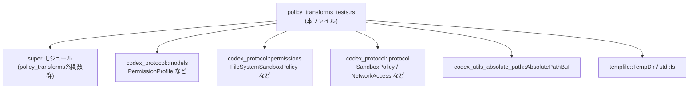
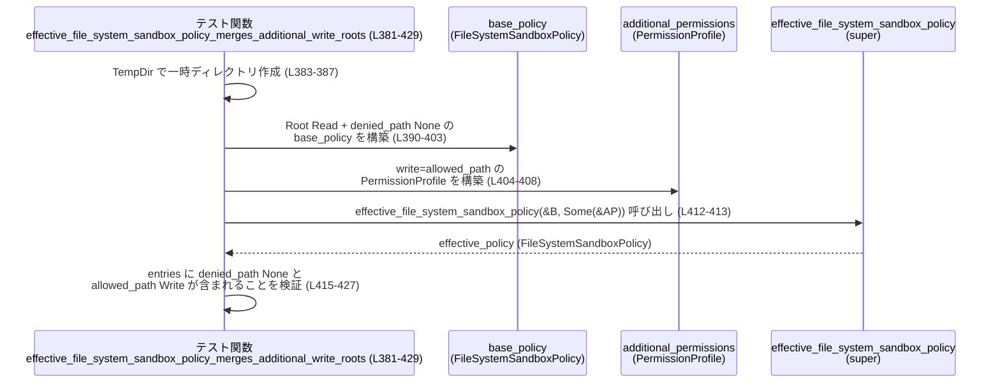

# sandboxing/src/policy_transforms_tests.rs コード解説

## 0. ざっくり一言

このファイルは、**ファイルシステム／ネットワークの追加権限（PermissionProfile）とサンドボックスポリシーの変換ロジック**を検証するユニットテスト群です。  
特に、`should_require_platform_sandbox` や `effective_file_system_sandbox_policy` など、上位モジュール（`super`）にあるコア関数の契約をテストベースで確認しています。

---

## 1. このモジュールの役割

### 1.1 概要

このモジュールは、以下の問題に対する挙動をテストで検証します。

- **OS プラットフォームサンドボックスを要求すべきかどうかの判定**  
  （`should_require_platform_sandbox` の判定条件）  
  例: `full_access_restricted_policy_skips_platform_sandbox_when_network_is_enabled`（L31-48）

- **追加権限プロファイルの正規化と交差（intersection）処理**  
  （`normalize_additional_permissions`, `intersect_permission_profiles`）  
  例: L98-129, L164-176, L178-239

- **ベースのサンドボックスポリシーと追加権限のマージ処理**  
  （`sandbox_policy_with_additional_permissions`,  
  `merge_file_system_policy_with_additional_permissions`,  
  `effective_file_system_sandbox_policy`）  
  例: L242-307, L310-351, L354-429

### 1.2 アーキテクチャ内での位置づけ

このファイル自体は **テストモジュール** であり、実際のロジックは `super` モジュール側にあります。依存関係は次のような構造になっています。



- 実際の変換ロジックは `super::effective_file_system_sandbox_policy` など（L1-6）にあり、このファイルはそれらを呼び出して結果を検証します。
- `codex_protocol` の各型は、**ポリシーや権限を表すデータモデル**として利用されています（L7-18）。
- `AbsolutePathBuf` と `TempDir` を使い、テスト環境で安全にファイルシステムパスを扱っています（L19, L24, 各テスト内）。

### 1.3 設計上のポイント

コードから読み取れる特徴は次のとおりです。

- **シナリオ単位のテスト設計**  
  各テスト関数名が期待シナリオをそのまま表現しており、挙動の契約が読み取りやすくなっています。  
  例: `root_write_policy_with_carveouts_still_uses_platform_sandbox`（L50-77）

- **ファイルシステムの実パスを用いたテスト**  
  - `TempDir` と `dunce::canonicalize` + `AbsolutePathBuf` で実際のディレクトリを作り、  
    パスの正規化も含めてテストしています（例: L100-104, L312-317）。
  - Unix 環境ではシンボリックリンクも利用し、シンボリックパスの扱いを明示的に検証しています（L131-162）。

- **否定的権限（deny）の保持に関するテスト**  
  `merge_file_system_policy_with_additional_permissions` や  
  `effective_file_system_sandbox_policy` のテストで、  
  既存の「アクセス禁止」設定が追加権限で消されないことが検証されています（L320-333, L390-403, L416-421）。

- **明示的な空リスト (`Some(vec![])`) と `None` の扱いの違いをテスト**  
  read パスのリストが空だが `Some` であるケースが、交差処理でどう扱われるかを詳しくチェックしています（L178-239）。

---

## 2. 主要な機能一覧（このテストモジュールで検証している振る舞い）

- プラットフォームサンドボックス要否判定:
  - `should_require_platform_sandbox` が、ファイルシステムポリシー・ネットワークポリシー・追加要件に応じて `true/false` を返すことを検証（L31-96）。
- 追加権限の正規化:
  - `normalize_additional_permissions` が、  
    - ネットワーク有効フラグを保持する（L98-129）。  
    - シンボリックリンク経由の書き込みパスを変形しない（L131-162）。  
    - 空のネストされたプロファイルを削除して `PermissionProfile::default()` に畳み込む（L164-176）。
- 要求・付与権限プロファイルの交差:
  - `intersect_permission_profiles` が、  
    - 明示的な空 read 要求を grant が持っていれば保持する（L178-198）。  
    - grant にないパス要求や空 read 要求は削除する（L200-239）。
- サンドボックスポリシーと追加権限の統合:
  - `sandbox_policy_with_additional_permissions` が、  
    - ReadOnly ポリシーに追加権限でネットワークを有効化できること（L242-278）。  
    - ExternalSandbox ポリシーでネットワークを Enabled に引き上げられること（L280-307）。
- ファイルシステムポリシーのマージ:
  - `merge_file_system_policy_with_additional_permissions` が、  
    許可パスを追加しつつ既存の deny を保持すること（L310-351）。
  - `effective_file_system_sandbox_policy` が、  
    - 追加権限がない場合はベースポリシーをそのまま返す（L354-379）。  
    - 追加の write ルートをベースポリシーにマージしつつ deny を保持する（L381-429）。

### 2.1 コンポーネントインベントリー（このファイル内の関数）

| 名称 | 種別 | 役割 / 用途 | 定義位置 |
|------|------|-------------|----------|
| `symlink_dir` | 関数（Unix限定） | ディレクトリ間にシンボリックリンクを張るヘルパー | `sandboxing/src/policy_transforms_tests.rs:L26-29` |
| `full_access_restricted_policy_skips_platform_sandbox_when_network_is_enabled` | テスト関数 | フル root 書き込み + ネットワーク有効時にプラットフォームサンドボックス不要になることを検証 | L31-48 |
| `root_write_policy_with_carveouts_still_uses_platform_sandbox` | テスト関数 | root 書き込みだが一部パス deny の場合はプラットフォームサンドボックスが必要になることを検証 | L50-77 |
| `full_access_restricted_policy_still_uses_platform_sandbox_for_restricted_network` | テスト関数 | フル root 書き込みでもネットワークが Restricted ならプラットフォームサンドボックスが必要であることを検証 | L79-96 |
| `normalize_additional_permissions_preserves_network` | テスト関数 | `normalize_additional_permissions` が network 設定・read/write パスを保持することを検証 | L98-129 |
| `normalize_additional_permissions_preserves_symlinked_write_paths` | テスト関数 (Unix) | シンボリックリンク経由の write パスが正規化で変わらないことを検証 | L131-162 |
| `normalize_additional_permissions_drops_empty_nested_profiles` | テスト関数 | 空の network/file_system サブプロファイルが default に畳み込まれることを検証 | L164-176 |
| `intersect_permission_profiles_preserves_explicit_empty_requested_reads` | テスト関数 | grant がある場合は明示的な空 read 要求が保持されることを検証 | L178-198 |
| `intersect_permission_profiles_drops_ungranted_nonempty_path_requests` | テスト関数 | grant がないパス要求が intersection で削除されることを検証 | L200-219 |
| `intersect_permission_profiles_drops_explicit_empty_reads_without_grant` | テスト関数 | grant がない場合は明示的な空 read 要求も削除されることを検証 | L221-239 |
| `read_only_additional_permissions_can_enable_network_without_writes` | テスト関数 | ReadOnly ポリシーに追加権限でネットワークのみを有効化できることを検証 | L242-278 |
| `external_sandbox_additional_permissions_can_enable_network` | テスト関数 | ExternalSandbox でネットワークを Restricted → Enabled に引き上げられることを検証 | L280-307 |
| `merge_file_system_policy_with_additional_permissions_preserves_unreadable_roots` | テスト関数 | 追加権限マージ時に既存の unreadable (deny) ルートが保持されることを検証 | L310-351 |
| `effective_file_system_sandbox_policy_returns_base_policy_without_additional_permissions` | テスト関数 | 追加権限なしで `effective_file_system_sandbox_policy` がベースポリシーをそのまま返すことを検証 | L354-379 |
| `effective_file_system_sandbox_policy_merges_additional_write_roots` | テスト関数 | 追加 write ルートが有効ポリシーに反映され、deny が保持されることを検証 | L381-429 |

### 2.2 テスト対象の外部 API（super モジュール）

| 名称 | 種別 | 役割 / 用途（テストから読み取れる範囲） | 使用位置（例） |
|------|------|-------------------------------------------|----------------|
| `should_require_platform_sandbox` | 関数 | FS/ネットワークポリシーに基づき OS プラットフォームサンドボックスが必要か判定する | L40-47 |
| `normalize_additional_permissions` | 関数 | `PermissionProfile`（追加権限）の正規化。空のサブプロファイル削除・パス保持を行う | L105-114 |
| `intersect_permission_profiles` | 関数 | 要求された権限と、実際に付与された権限プロファイルの共通部分を計算する | L194-197 |
| `sandbox_policy_with_additional_permissions` | 関数 | ベース `SandboxPolicy` に追加 `PermissionProfile` を反映させたポリシーを返す | L249-266 |
| `merge_file_system_policy_with_additional_permissions` | 関数 | ベース `FileSystemSandboxPolicy` に、追加の read/write root をマージする | L319-336 |
| `effective_file_system_sandbox_policy` | 関数 | ベース FS ポリシーと（あれば）追加権限から、実際に適用される FS サンドボックスポリシーを算出する | L375-376, L412-413 |

> 上記 API の正確なシグネチャはこのチャンクには現れません。型・引数は、テストでの呼び出し方法から読み取れる範囲で記述しています。

---

## 3. 公開 API と詳細解説（テストから読み取れる契約）

このセクションでは、**super モジュールにあるコア関数**について、テストから読み取れる挙動を整理します。

### 3.1 主要な型一覧（このファイルで重要なもの）

| 名前 | 種別 | 役割 / 用途 | 使用位置（例） |
|------|------|-------------|----------------|
| `PermissionProfile` | 構造体 | 追加のファイルシステム / ネットワーク権限のプロファイル | L105-113, L166-172, L185-191 |
| `FileSystemPermissions` | 構造体 | read / write のパスリストを持つ FS 権限 | L109-112, L168-171, L186-189 |
| `NetworkPermissions` | 構造体 | `enabled: Option<bool>` でネットワーク許可を表す | L106-108, L167 |
| `FileSystemSandboxPolicy` | 構造体（ポリシー） | `entries` に sandbox エントリを持つ FS サンドボックスポリシー | L33-38, L56-67, L81-86, L320-333, L362-373, L390-403 |
| `FileSystemSandboxEntry` | 構造体 | 単一パスとアクセスモード（Read/Write/None）の組み合わせ | L33-38, L57-66, L321-326, L328-332 |
| `FileSystemPath` | enum | `Special { Root }` や具象 `Path { path: AbsolutePathBuf }` を表す | L34-35, L58-60, L64-65, L321-324, L328-330 |
| `FileSystemSpecialPath` | enum | 特別なパス識別子（ここでは Root） | L35, L59, L323 |
| `FileSystemAccessMode` | enum | `Read` / `Write` / `None` を表すアクセスモード | L37, L61-62, L325-326, L331-332, L341-342, L347-348, L371-372, L418-419, L425-426 |
| `NetworkSandboxPolicy` | enum | ネットワークサンドボックス設定（Enabled / Restricted） | L43, L72, L91 |
| `SandboxPolicy` | enum | 全体のサンドボックスポリシー（ReadOnly / ExternalSandbox など） | L249-256, L270-276, L288-290, L304-306 |
| `NetworkAccess` | enum | ExternalSandbox 時のネットワーク設定（Enabled / Restricted） | L289, L305 |
| `ReadOnlyAccess` | enum | ReadOnly ポリシーのファイルシステムアクセス（Restricted など） | L251-254, L271-274 |
| `AbsolutePathBuf` | 型 | 絶対パスを保持するユーティリティパス型 | L52-55, L100-104, L141-142, L181-184, L203-206, L224-227, L245-248, L313-317, L357-361, L383-388 |

### 3.2 関数詳細（super モジュールのコア API）

#### `should_require_platform_sandbox(policy, network_policy, has_managed_network_requirements) -> bool`

**概要**

- ファイルシステムサンドボックスポリシー (`FileSystemSandboxPolicy`) とネットワークサンドボックスポリシー (`NetworkSandboxPolicy`)、および追加のネットワーク要件フラグに応じて、**OS プラットフォームサンドボックスが必要かどうかを判定する関数**として使われています（L40-47, L69-76, L88-95）。

**引数（テストから読み取れる範囲）**

| 引数名 | 型（推定） | 説明 |
|--------|-----------|------|
| `policy` | `&FileSystemSandboxPolicy` | ファイルシステムの sandbox ポリシー。root への write や carve-out（deny）を含む（L33-38, L56-67, L81-86）。 |
| `network_policy` | `NetworkSandboxPolicy` | `Enabled` または `Restricted` などのネットワークサンドボックス設定（L43, L72, L91）。 |
| `has_managed_network_requirements` | `bool` | 管理されたネットワーク要件が存在するかどうかを示すフラグ（コメントのみから判読：L44, L73, L92）。 |

**戻り値**

- `bool`  
  - `true`: プラットフォームサンドボックスが **必要**。  
  - `false`: プラットフォームサンドボックスが **不要**。  
  これらの意味は、テストのアサーションから読み取れます（例: L40-47 で `false` を期待）。

**テストから読み取れる挙動**

- **ケース1: フル root write + NetworkSandboxPolicy::Enabled + managed 要件なし → 不要 (`false`)**  
  - FS ポリシー: `Root` に `Write`（他の carve-out なし）（L33-38）。  
  - ネットワーク: `NetworkSandboxPolicy::Enabled`（L43）。  
  - `has_managed_network_requirements = false`（L44）。  
  - 結果: `false`（L40-47）。

- **ケース2: Root write + 特定パス deny（carve-out） + Enabled → 必要 (`true`)**  
  - FS ポリシー: `Root` に `Write` + `blocked` パスに `None`（L56-67）。  
  - ネットワーク: `Enabled`（L72）。  
  - 結果: `true`（L69-76）。

- **ケース3: Root write + NetworkSandboxPolicy::Restricted → 必要 (`true`)**  
  - FS ポリシー: `Root` に `Write`（L81-86）。  
  - ネットワーク: `Restricted`（L91）。  
  - 結果: `true`（L88-95）。

> これらから、「完全な root 書き込みかつ carve-out がなく、ネットワークも完全に開放されている場合のみ、プラットフォームサンドボックスをスキップする」という契約が読み取れます。

**Examples（使用例：テスト簡略版）**

```rust
// Root に対するフル書き込みポリシーを構築する
let fs_policy = FileSystemSandboxPolicy::restricted(vec![
    FileSystemSandboxEntry {
        path: FileSystemPath::Special {
            value: FileSystemSpecialPath::Root,
        },
        access: FileSystemAccessMode::Write,
    },
]);

// ネットワークは完全に有効
let net_policy = NetworkSandboxPolicy::Enabled;

// プラットフォームサンドボックス要否を判定
let need_platform = should_require_platform_sandbox(
    &fs_policy,
    net_policy,
    /*has_managed_network_requirements*/ false,
);

// このケースでは false が期待される（L31-48）
assert_eq!(need_platform, false);
```

**Errors / Panics**

- この関数は `bool` を直接返しており、このテストファイルからは `Result` や panic を伴う挙動は見えません。

**Edge cases（エッジケース）**

- carve-out（特定パスへの deny）が存在するだけで `true` になる（L56-67, L69-76）。
- ネットワークが `Restricted` なら、FS がフル root write でも `true` になる（L79-96）。
- `has_managed_network_requirements = true` のケースは、このチャンクには現れず、挙動は不明です。

**使用上の注意点**

- プラットフォームサンドボックスをスキップしたい場合は、  
  - FS ポリシーが **完全な root write かつ carve-out なし**  
  - ネットワークが `Enabled`  
  - managed なネットワーク要件がない  
  という条件から外れると `true` になることがテストから読み取れます。
- セキュリティ上、条件を緩めると OS レベルの保護が外れる可能性があるため、  
  上記条件の設計には注意が必要です（具体的なポリシー内容は実装側参照）。

---

#### `normalize_additional_permissions(profile: PermissionProfile) -> Result<PermissionProfile, E>`

**概要**

- 追加権限プロファイルを「正規化（normalize）」し、意味のない空のサブプロファイルを削除しつつ、意味のあるパスやフラグは保持する関数として使われています（L98-129, L131-162, L164-176）。

**引数**

| 引数名 | 型（推定） | 説明 |
|--------|-----------|------|
| `profile` | `PermissionProfile` | ネットワーク/ファイルシステムの追加権限プロファイル（L105-113, L143-148, L166-172）。 |

**戻り値**

- `Result<PermissionProfile, E>`（`E` の型はこのチャンクには現れません）  
  テストでは `.expect("permissions")` で常に成功ケースを使用しており、`Ok(PermissionProfile)` が返る前提で書かれています（L114, L150, L173）。

**テストから読み取れる挙動**

1. **ネットワーク設定と read/write パスを保持する**（L98-129）  
   - 入力:  
     - `network.enabled = Some(true)`（L106-108）  
     - `file_system.read = Some(vec![path.clone()])`（L110）  
     - `file_system.write = Some(vec![path.clone()])`（L111）  
   - 出力:  
     - `permissions.network` が同じ構造の `Some(NetworkPermissions { enabled: Some(true) })`（L116-121）。  
     - `permissions.file_system.read` / `write` も同じパスリストを保持（L123-128）。  
   - → **意味のある設定はそのまま維持**されることが分かります。

2. **シンボリックリンク経由の write パスを変えない**（Unix のみ, L131-162）  
   - `real_root` と `link_root` の間にシンボリックリンクを作成（L135-139）。  
   - `link_root/join("write")` を `write` パスとして渡す（L141-147）。  
   - 正規化後も、`write` に同じ `link_root.join("write")` の `AbsolutePathBuf` が入っていることを確認（L152-160）。  
   - → 正規化時に **シンボリックリンクを実パスに解決しない**ことが保証されています。

3. **空のネストされたプロファイルを削除する**（L164-176）  
   - 入力:  
     - `network: Some(NetworkPermissions { enabled: None })`（L167）  
     - `file_system: Some(FileSystemPermissions { read: None, write: None })`（L168-171）  
   - 出力: `PermissionProfile::default()`（L175）。  
   - → サブフィールドがすべて `None` の `Some(...)` は **意味がないため default に畳み込む**という契約が読み取れます。

**Examples（使用例：テスト簡略版）**

```rust
// 追加権限プロファイルを構築する
let profile = PermissionProfile {
    network: Some(NetworkPermissions {
        enabled: Some(true),        // ネットワークを明示的に有効化
    }),
    file_system: Some(FileSystemPermissions {
        read: Some(vec![path.clone()]),  // 読み取り可能パス
        write: Some(vec![path.clone()]), // 書き込み可能パス
    }),
};

// 正規化を行う
let normalized = normalize_additional_permissions(profile).expect("permissions");

// network.enabled と read/write が保持されていることを確認（L116-128）
assert_eq!(normalized.network.unwrap().enabled, Some(true));
```

**Errors / Panics**

- どのような条件で `Err` を返すかは、このファイルには現れません。  
  テストでは常に `expect("permissions")` で成功を仮定しています（L114, L150, L173）。

**Edge cases**

- **完全に空のプロファイル**（サブフィールドがすべて None）は `PermissionProfile::default()` に変換される（L164-176）。
- シンボリックリンクの扱いは「入力どおりを保持」することがテストされています（L131-162）。
- パスの重複削除やソートの有無などは、このチャンクからは不明です。

**使用上の注意点**

- 「空のサブプロファイル」を残したくない場合に便利ですが、  
  逆に「空であること自体を意味として使いたい」場合は、正規化によって情報が失われる可能性があります（例: L164-176 の挙動）。
- シンボリックリンクを実パスに解決したい場合は、`normalize_additional_permissions` ではなく、呼び出し前に自前で canonicalize する必要があります。

---

#### `intersect_permission_profiles(requested, granted) -> PermissionProfile`

**概要**

- クライアントが **要求した権限プロファイル** (`requested`) と、  
  実際にシステムが **付与する権限プロファイル** (`granted`) の **共通部分（intersection）** を返す関数として使われています（L178-198, L200-239）。

**引数**

| 引数名 | 型（推定） | 説明 |
|--------|-----------|------|
| `requested` | `PermissionProfile` | クライアントが要求した権限（L185-191, L207-213, L228-234）。 |
| `granted` | `PermissionProfile` | システム側の「与えて良い」権限（L192, L216, L237）。 |

**戻り値**

- `PermissionProfile`  
  `requested` と `granted` の **両方に含まれる権限のみ**を持つプロファイルとして振る舞います。

**テストから読み取れる挙動**

1. **grant に対応する場合、明示的な空 read を保持**（L178-198）  
   - `requested.file_system.read = Some(vec![])`（L186-187）。  
   - `granted = requested.clone()`（L192）。  
   - intersection は `requested` と完全一致（L194-197）。  
   → grant に同じ構造がある場合、**空リストであっても情報は保持**されます。

2. **grant がデフォルトの場合、非空 read 要求は削除**（L200-219）  
   - `requested.file_system.read = Some(vec![path])`（L207-210）。  
   - `granted = PermissionProfile::default()`（L215-217）。  
   - 結果: `PermissionProfile::default()`（L216-218）。  
   → grant 側にないパス要求は intersection から削除されます。

3. **grant がデフォルトの場合、明示的空 read も削除**（L221-239）  
   - `requested.file_system.read = Some(vec![])`（L229-230）。  
   - `requested.file_system.write` にもパスがあるが、grant は default（L231-232, L236-237）。  
   - 結果: `PermissionProfile::default()`（L237-238）。  
   → grant 側に対応する権限がない場合、**空 read 要求も保持されない**ことが分かります。

**Examples**

```rust
// 要求側: read は空だが「明示的に空」を指定
let requested = PermissionProfile {
    file_system: Some(FileSystemPermissions {
        read: Some(vec![]),
        write: Some(vec![path.clone()]),
    }),
    ..Default::default()
};

// 付与側: 要求と同じプロファイルを許可
let granted = requested.clone();

// intersection は requested と同一（L178-198）
let intersection = intersect_permission_profiles(requested.clone(), granted);
assert_eq!(intersection, requested);
```

**Errors / Panics**

- `Result` を返していないように見え、テストからはエラー条件は読み取れません。

**Edge cases**

- `Some(vec![])` と `None` の違いが intersection で重要になります。  
  - grant 側が default の場合、`Some(vec![])` であっても結果として落ちる（L221-239）。  
  - grant 側が対応する構造を持つ場合は残る（L178-198）。

**使用上の注意点**

- 「明示的に空の read 設定」を intersection 後も保持したい場合は、grant 側にも同じ構造を用意する必要があります。
- grant 側が default の場合、requested の FS 権限はすべて削除されることがテストから分かるため、  
  「何も付与したくない」意図を明確に表せます。

---

#### `sandbox_policy_with_additional_permissions(base: &SandboxPolicy, additions: &PermissionProfile) -> SandboxPolicy`

**概要**

- ベースとなる `SandboxPolicy` に、追加権限 `PermissionProfile` を反映させた **新しいサンドボックスポリシー** を返す関数として使われています（L249-266, L287-300）。

**引数（テストから推定）**

| 引数名 | 型（推定） | 説明 |
|--------|-----------|------|
| `base` | `&SandboxPolicy` | ベースのサンドボックスポリシー（ReadOnly / ExternalSandbox など, L249-256, L288-290）。 |
| `additions` | `&PermissionProfile` | 追加で要求されたネットワーク/FS 権限（L257-265, L291-299）。 |

**戻り値**

- `SandboxPolicy`  
  base ポリシーをもとに、追加権限を考慮した新しいポリシー。

**テストから読み取れる挙動**

1. **ReadOnly ポリシー + 追加権限でネットワークを有効化**（L242-278）  
   - base:  
     - `SandboxPolicy::ReadOnly`  
     - `access: ReadOnlyAccess::Restricted { include_platform_defaults: true, readable_roots: vec![path.clone()] }`（L250-254）  
     - `network_access: false`（L255）。  
   - additions:  
     - `network.enabled = Some(true)`（L258-260）。  
     - FS read/write は base の root と一致し、write は空（L261-264）。  
   - 結果:  
     - `SandboxPolicy::ReadOnly` で `network_access: true` に変更（L268-276）。  
     - `readable_roots` は `vec![path]` のまま（L271-274）。  
   → 追加権限により **ネットワークのみ有効化**され、FS アクセスは base と同等であることが分かります。

2. **ExternalSandbox ポリシー + 追加権限でネットワークを Enabled に昇格**（L280-307）  
   - base: `SandboxPolicy::ExternalSandbox { network_access: NetworkAccess::Restricted }`（L288-290）。  
   - additions: `network.enabled = Some(true)`（L292-294）。  
   - 結果: `SandboxPolicy::ExternalSandbox { network_access: NetworkAccess::Enabled }`（L302-306）。  
   → ExternalSandbox のネットワーク制限を、追加権限で緩和できることが分かります。

**Examples**

```rust
// ReadOnly ベースポリシー
let base = SandboxPolicy::ReadOnly {
    access: ReadOnlyAccess::Restricted {
        include_platform_defaults: true,
        readable_roots: vec![path.clone()],
    },
    network_access: false,
};

// ネットワーク有効化のみを要求する追加権限
let additions = PermissionProfile {
    network: Some(NetworkPermissions { enabled: Some(true) }),
    file_system: Some(FileSystemPermissions {
        read: Some(vec![path.clone()]),
        write: Some(Vec::new()),
    }),
};

// 追加権限を反映したポリシー（L249-266）
let effective = sandbox_policy_with_additional_permissions(&base, &additions);
assert!(matches!(effective,
    SandboxPolicy::ReadOnly { network_access: true, .. }
));
```

**Errors / Panics**

- この関数は純粋に `SandboxPolicy` を返しており、テストからはエラー条件は見えません。

**Edge cases**

- FS 権限を追加で「広げる」ケース（readable_roots の追加など）はテストに現れません。  
  ネットワーク部分の挙動のみが明示的に検証されています。

**使用上の注意点**

- ネットワーク制限の解除（Restricted → Enabled / false → true）の責務を担う関数として利用されているため、  
  セキュリティ方針上どこまで許可するかは、呼び出し側の設計に依存します。
- FS 側をどの程度変更するかはこのチャンクからは不明なため、実装側の仕様を確認する必要があります。

---

#### `merge_file_system_policy_with_additional_permissions(base: &FileSystemSandboxPolicy, read_roots: Vec<AbsolutePathBuf>, write_roots: Vec<AbsolutePathBuf>) -> FileSystemSandboxPolicy`

**概要**

- ベースのファイルシステムサンドボックスポリシーに、追加で許可したい read/write ルートをマージした新しいポリシーを返す関数として使われています（L319-336）。

**引数（テストから推定）**

| 引数名 | 型（推定） | 説明 |
|--------|-----------|------|
| `base` | `&FileSystemSandboxPolicy` | 既存の FS サンドボックスポリシー（L320-333）。 |
| `read_roots` | `Vec<AbsolutePathBuf>` | 追加で読み取り許可したいルート（ここでは `vec![allowed_path.clone()]`, L334）。 |
| `write_roots` | `Vec<AbsolutePathBuf>` | 追加で書き込み許可したいルート（テストでは `Vec::new()`, L335）。 |

**戻り値**

- `FileSystemSandboxPolicy`  
  追加 read/write エントリを含む新しいポリシー。

**テストから読み取れる挙動**

- base ポリシー:  
  - `Root` に `Read`（L321-326）。  
  - `denied_path` に `None`（アクセス禁止, L327-332）。  
- 追加 read ルート: `allowed_path`（L317-318, L334）。  
- 結果の `merged_policy.entries` は次を満たす（L338-350）：  
  - `denied_path` に対する `None` エントリを保持（L339-343）。  
  - `allowed_path` に対する `Read` エントリを新たに保持（L346-350）。  
- → **既存の deny を保持したまま、追加の read ルートを付け足す**という契約が確認できます。

**使用上の注意点**

- 追加権限をマージしても、既存の deny は消えないことが保証されます（L339-343）。  
  セキュリティ的には、deny を優先する設計になっていると解釈できます。
- 重複エントリや既存エントリとの競合がどう扱われるか（最後勝ちか、deny 優先かなど）は、このチャンクからは不明です。

---

#### `effective_file_system_sandbox_policy(base: &FileSystemSandboxPolicy, additions: Option<&PermissionProfile>) -> FileSystemSandboxPolicy`

**概要**

- ベースのファイルシステムサンドボックスポリシーと、追加の `PermissionProfile`（存在する場合）から、**実際に適用されるファイルシステムサンドボックスポリシー**を算出する関数として使われています（L375-376, L412-413）。

**テストから読み取れる挙動**

1. **追加権限がない場合はベースそのまま**（L354-379）  
   - base: root read + `denied_path` deny（L362-373）。  
   - additions: `None`（L375-376）。  
   - 結果: `effective_policy == base_policy`（L378）。

2. **追加 write ルートをマージしつつ deny を保持**（L381-429）  
   - base: root read + `denied_path` deny（L390-403）。  
   - additions: `PermissionProfile` で `file_system.write = Some(vec![allowed_path])`（L404-408）。  
   - `effective_policy.entries` は次を満たす（L415-427）：  
     - `denied_path` に対する `None` エントリを保持（L416-421）。  
     - `allowed_path` に対する `Write` エントリを追加（L423-426）。  

**Examples**

```rust
// ベースの FS サンドボックスポリシー
let base = FileSystemSandboxPolicy::restricted(vec![
    FileSystemSandboxEntry {
        path: FileSystemPath::Special {
            value: FileSystemSpecialPath::Root,
        },
        access: FileSystemAccessMode::Read,
    },
    FileSystemSandboxEntry {
        path: FileSystemPath::Path { path: denied_path.clone() },
        access: FileSystemAccessMode::None,
    },
]);

// 追加権限: 特定ディレクトリへの write を許可
let additions = PermissionProfile {
    file_system: Some(FileSystemPermissions {
        read: Some(vec![]),
        write: Some(vec![allowed_path.clone()]),
    }),
    ..Default::default()
};

// effective ポリシーの算出（L412-413）
let effective = effective_file_system_sandbox_policy(&base, Some(&additions));

// deny は保持され、allowed_path への Write が追加される（L415-427）
```

**使用上の注意点**

- 追加権限が `None` の場合は、ポリシーは完全にベース依存になることがテストで確認されています（L354-379）。
- 追加 write ルートは base にマージされますが、既存の deny は維持されます（L416-421）。  
  これにより「元々禁止していたパスが追加権限で復活しない」ことが保証されています。

---

#### `symlink_dir(original: &Path, link: &Path) -> std::io::Result<()>`（ヘルパー：テスト内）

**概要**

- Unix 環境で使用されるヘルパー関数で、`original` ディレクトリへのシンボリックリンク `link` を作成します（L26-29）。

**役割**

- `normalize_additional_permissions_preserves_symlinked_write_paths` テストで、シンボリックリンク経由のパスを作るために使われています（L135-139）。

---

### 3.3 その他の関数（テスト関数一覧）

3.2 で触れなかった関数は、すべて「上記 API の特定シナリオを検証するテスト関数」です。  
詳細な役割は 2.1 のインベントリー表と各関数名から分かるようになっています。

---

## 4. データフロー（代表的なシナリオ）

ここでは、**追加 write ルートが有効ポリシーにマージされるフロー**を、  
`effective_file_system_sandbox_policy_merges_additional_write_roots`（L381-429）を例に説明します。

1. テスト内で `TempDir` を使って一時ディレクトリを作成し（L383-387）、`allowed` / `denied` ディレクトリ用のパスを構築します（L388-389）。
2. `base_policy` として、`Root` 読み取り + `denied_path` deny の FS ポリシーを構築します（L390-403）。
3. `additional_permissions` として、`write: Some(vec![allowed_path.clone()])` を持つ `PermissionProfile` を作成します（L404-408）。
4. `effective_file_system_sandbox_policy(&base_policy, Some(&additional_permissions))` を呼び出し（L412-413）、  
   返ってきた `effective_policy` の `entries` を検証します（L415-427）。



この図から分かるポイント:

- このテストファイル側では、**純粋に入力データを作って関数を呼び出し、結果をアサートする**役割のみを担っています。
- 実際のマージロジックは `super::effective_file_system_sandbox_policy` に隠蔽されており、ここから内部の詳細なデータフローは読み取れません。

---

## 5. 使い方（How to Use）

このファイルはテストですが、本番コードでの利用パターンと近い形で使われています。  
以下は、テストから抽出した基本的な利用フローです。

### 5.1 基本的な使用方法（追加権限を考慮したサンドボックス構築）

```rust
use codex_protocol::models::{PermissionProfile, FileSystemPermissions, NetworkPermissions};
use codex_protocol::permissions::{FileSystemSandboxPolicy, FileSystemSandboxEntry,
    FileSystemPath, FileSystemSpecialPath, FileSystemAccessMode};
use codex_protocol::protocol::{SandboxPolicy, ReadOnlyAccess};
use codex_utils_absolute_path::AbsolutePathBuf;

// ベースとなる ReadOnly サンドボックスポリシーを用意する
let base_fs_root: AbsolutePathBuf = /* 事前に canonicalize 済みの絶対パス */;
let base_policy = SandboxPolicy::ReadOnly {
    access: ReadOnlyAccess::Restricted {
        include_platform_defaults: true,
        readable_roots: vec![base_fs_root.clone()],
    },
    network_access: false, // 初期状態ではネットワーク禁止
};

// 追加で要求された権限プロファイルを構築する
let additional_profile = PermissionProfile {
    network: Some(NetworkPermissions {
        enabled: Some(true), // ネットワーク有効化を要求
    }),
    file_system: Some(FileSystemPermissions {
        read: Some(vec![base_fs_root.clone()]), // ベースと同じ read root を指定
        write: Some(Vec::new()),                // 書き込みは要求しない
    }),
};

// 追加権限を正規化する（空サブプロファイルの削除など）
let normalized_profile =
    normalize_additional_permissions(additional_profile).expect("valid profile");

// ベースポリシーに追加権限を反映したサンドボックスポリシーを得る
let effective_policy =
    sandbox_policy_with_additional_permissions(&base_policy, &normalized_profile);

// この例では、ネットワークが true になっていることが期待される
```

### 5.2 よくある使用パターン

1. **ReadOnly ポリシーにネットワークだけ追加で許可する**  
   - テスト `read_only_additional_permissions_can_enable_network_without_writes`（L242-278）と同じパターンです。
   - FS 側の read root は base と同じにして、write は空にしておくことで、FS 権限を増やさずネットワークのみを有効化できます。

2. **ExternalSandbox でネットワークを完全有効化する**  
   - テスト `external_sandbox_additional_permissions_can_enable_network`（L280-307）と同じです。
   - `SandboxPolicy::ExternalSandbox { network_access: NetworkAccess::Restricted }` を base に、  
     `NetworkPermissions { enabled: Some(true) }` を追加することで `Enabled` へ昇格させています。

3. **FS の deny を保ちつつ read/write root を追加する**  
   - `merge_file_system_policy_with_additional_permissions` や `effective_file_system_sandbox_policy` のように、  
     追加 read/write root をマージしても、既存の deny を維持するパターン（L310-351, L381-429）。

### 5.3 よくある間違いと注意点（テストから推測できる範囲）

```rust
// 間違い例: 追加権限プロファイルを正規化せずに使う
let profile = PermissionProfile {
    network: Some(NetworkPermissions { enabled: None }), // 意味のないサブフィールド
    file_system: Some(FileSystemPermissions {
        read: None,
        write: None,
    }),
};
let policy = sandbox_policy_with_additional_permissions(&base_policy, &profile);
// ↑ 正規化せずに渡すと、「空のサブプロファイル」が意図せず残る可能性がある

// 正しい例: normalize_additional_permissions を通す
let normalized = normalize_additional_permissions(profile).expect("permissions");
// L164-176 のテストより、この normalized は PermissionProfile::default() になる
let policy = sandbox_policy_with_additional_permissions(&base_policy, &normalized);
```

```rust
// 間違い例: grant が default の状態で requested にパスを詰め込み、
//          intersection 後も残っていると期待する
let requested = PermissionProfile {
    file_system: Some(FileSystemPermissions {
        read: Some(vec![path.clone()]),
        write: None,
    }),
    ..Default::default()
};
let granted = PermissionProfile::default();

let intersection = intersect_permission_profiles(requested, granted);
// intersection は default になり、パスはすべて落ちる（L200-219）
```

### 5.4 使用上の注意点（まとめ）

- **プラットフォームサンドボックスのスキップ条件**  
  - `should_require_platform_sandbox` の条件は非常に限定的です（L31-96）。  
    full root write + ネットワーク完全有効 + carve-out なし + managed 要件なしなど、  
    セキュリティポリシー上慎重に配置すべきです。

- **追加権限の正規化**  
  - `normalize_additional_permissions` は「空のサブプロファイルを default に畳み込む」ため、  
    「空であること自体を表現したい」場合には向きません（L164-176）。

- **deny の保持**  
  - `merge_file_system_policy_with_additional_permissions` や `effective_file_system_sandbox_policy` は、  
    追加 read/write をマージしても、既存 deny を消さない設計になっています（L339-343, L416-421）。  
    追加権限で deny を解除したい場合は、別のメカニズムが必要になる可能性があります。

- **並行性・エラー**  
  - このファイルの利用例はいずれも同期・単一スレッドで、明示的な並行性はありません。  
  - 正規化や intersect 系 API のエラー条件は、このチャンクからは読み取れません。

---

## 6. 変更の仕方（How to Modify）

このファイルはテスト専用であり、**policy 変換ロジックの契約を守るための安全ネット**として機能します。

### 6.1 新しい機能を追加する場合（テスト観点）

1. **super モジュールに新しい変換関数を追加した場合**
   - 例: 新しい `SandboxPolicy` バリアントや、新種の `NetworkSandboxPolicy` が増えた場合。
   - このファイルに、**シナリオ名をそのまま関数名にしたテスト**を追加するのが一貫したスタイルです。  
     例: `new_policy_variant_handles_managed_network_requirements_correctly` のような名前。

2. **追加のエッジケースをカバーしたい場合**
   - 例えば、`should_require_platform_sandbox` の `has_managed_network_requirements = true` の挙動など。  
   - 現在テストされていない条件を明示的にテスト関数として追加します。

3. **ファイルシステム関連のテスト**
   - 新たなパス解決あるいはシンボリックリンクの扱いを追加する場合、`TempDir` と `AbsolutePathBuf` を用いる現行スタイル（L100-104, L313-317）に合わせると読みやすさが保たれます。

### 6.2 既存の機能を変更する場合（契約の影響範囲）

- `should_require_platform_sandbox` の判定条件を変更する場合:
  - L31-96 の 3 テストが前提にしている契約を再確認し、必要に応じて期待値を更新する必要があります。
- `normalize_additional_permissions` の正規化ルールを変更する場合:
  - ネットワークの保持（L98-129）、シンボリックリンクの扱い（L131-162）、空サブプロファイル削除（L164-176）  
    の 3 テストが影響を受けます。
- `intersect_permission_profiles` の仕様変更:
  - 明示的空 read の扱い（L178-198, L221-239）や、grant なしの場合の挙動（L200-219）を再テストする必要があります。
- `sandbox_policy_with_additional_permissions` / `effective_file_system_sandbox_policy` の変更:
  - ネットワークの有効化（L242-307）と FS deny の保持（L310-351, L381-429）という契約が崩れないかを確認します。

テストは契約の **仕様書的な役割**を果たしているため、仕様変更の際は「どのテストが何を保証しているか」を上記行番号を根拠に確認することが重要です。

---

## 7. 関連ファイル

| パス / モジュール | 役割 / 関係 |
|-------------------|------------|
| `super` モジュール（具体的ファイル名はこのチャンクには現れない） | `effective_file_system_sandbox_policy` / `intersect_permission_profiles` など、本テストで検証している変換ロジック本体を提供（L1-6）。 |
| `codex_protocol::models` | `PermissionProfile`, `FileSystemPermissions`, `NetworkPermissions` など、追加権限を表現するデータモデルを提供（L7-9）。 |
| `codex_protocol::permissions` | `FileSystemSandboxPolicy`, `FileSystemSandboxEntry`, `FileSystemPath`, `FileSystemAccessMode`, `FileSystemSpecialPath`, `NetworkSandboxPolicy` など、サンドボックス用の詳細な権限制御モデルを提供（L10-15）。 |
| `codex_protocol::protocol` | `SandboxPolicy`, `ReadOnlyAccess`, `NetworkAccess` など、高レベルなサンドボックスポリシー表現を提供（L16-18）。 |
| `codex_utils_absolute_path::AbsolutePathBuf` | 絶対パスの安全な取り扱いユーティリティとして使用（L19）。 |
| `dunce::canonicalize` | パスの正規化（シンボリックリンク解決など OS 依存の canonicalize）のために使用（L20）。 |
| `tempfile::TempDir` | テスト用の一時ディレクトリを作成し、ファイルシステムに副作用を残さないようにする（L24, 100, 134, 180, 202, 223, 244, 282, 312, 356, 383）。 |

このテストファイルは、上記モジュール群に依存しつつ、**サンドボックスポリシー変換の安全性・一貫性**を保証するための回帰テストとして構成されています。
