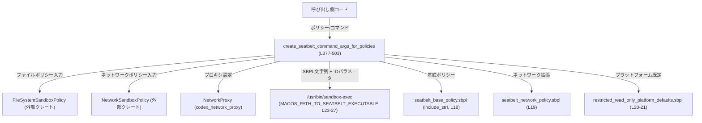
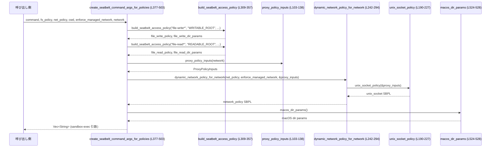

# sandboxing/src/seatbelt.rs

## 0. ざっくり一言

macOS の `sandbox-exec`（Seatbelt）用ポリシー文字列とコマンドライン引数を組み立てるモジュールです。  
ファイルシステム／ネットワーク／UNIX ドメインソケットの制限を、`FileSystemSandboxPolicy` と `NetworkSandboxPolicy`、および `NetworkProxy` から動的に生成します（`sandboxing/src/seatbelt.rs:L18-21, L377-503`）。

---

## 1. このモジュールの役割

### 1.1 概要

- このモジュールは **macOS Seatbelt サンドボックスのポリシーを動的に生成し、`sandbox-exec` の起動引数を構築する** ために存在します。
- ファイルシステムの読み書き範囲（ホワイトリスト／除外サブパス）、ネットワーク制限（プロキシ経由のみ／フルアクセス）、UNIX ドメインソケット利用可否をポリシーに反映します（`sandboxing/src/seatbelt.rs:L103-138, L190-227, L242-294, L309-357, L377-503`）。
- macOS 固有ディレクトリ（ユーザキャッシュ）なども Seatbelt の `param` 変数として渡します（`sandboxing/src/seatbelt.rs:L505-528`）。

### 1.2 アーキテクチャ内での位置づけ

外部クレートと OS 機能との関係は次のようになります。



- 呼び出し側は `FileSystemSandboxPolicy` / `NetworkSandboxPolicy` / `NetworkProxy` / 実行したい `command` を渡し、戻り値の `Vec<String>` を `sandbox-exec` に渡して子プロセスを起動する想定です。
- 実際に `sandbox-exec` を呼ぶ `Command` の生成はこのモジュール外で行われます（このファイル内には `Command` 呼び出しはありません）。

### 1.3 設計上のポイント

コードから読み取れる設計上の特徴です。

- **ステートレス設計**  
  - すべての関数は引数からポリシー文字列やパラメータを生成する純粋関数に近い構造で、グローバルな可変状態は持ちません（`sandboxing/src/seatbelt.rs` 全体）。
- **ファイルシステム制御の抽象化**  
  - `SeatbeltAccessRoot` と `build_seatbelt_access_policy` により、「root とその配下だが、特定サブパスは除外」といった構造を一般化しています（`L303-307, L309-357`）。
- **ネットワーク制御の抽象化**  
  - `dynamic_network_policy_for_network` が、`NetworkSandboxPolicy` とプロキシ設定 (`ProxyPolicyInputs`) から Seatbelt ネットワークポリシーを動的に組み立てます（`L242-294`）。
  - 「プロキシ経由トラフィックのみ許可」「DNS のみ例外許可」「UNIX ドメインソケット許可」などの組合せを扱います（`L247-271, L190-227`）。
- **UNIX ドメインソケットのポリシーモード分離**  
  - `UnixDomainSocketPolicy` で「AllowAll」と「Restricted(許可リスト)」を明確に分け、不要な状態を持たないようにしています（`L84-89`）。
- **OS 依存パスの動的取得**  
  - `confstr` / `confstr_path` / `macos_dir_params` で macOS のユーザキャッシュディレクトリを取得し、Seatbelt パラメータに渡します（`L505-528`）。
- **セキュリティ前提**  
  - `sandbox-exec` の実行パスを `/usr/bin/sandbox-exec` に固定し、PATH 上の別バイナリを使わない前提をコメントで明示しています（`L23-27`）。

---

## 2. 主要な機能一覧

このモジュールが提供する主な機能です。

- `MACOS_PATH_TO_SEATBELT_EXECUTABLE` 定数: `sandbox-exec` の安全な実行パスの提供（`L23-27`）。
- Seatbelt 基本ポリシーの読み込み: `MACOS_SEATBELT_BASE_POLICY` / `MACOS_SEATBELT_NETWORK_POLICY` / `MACOS_RESTRICTED_READ_ONLY_PLATFORM_DEFAULTS`（`L18-21`）。
- プロキシ設定からのループバックポート抽出: `proxy_loopback_ports_from_env`（`L41-73`）。
- UNIX ドメインソケットアクセスのポリシー生成: `UnixDomainSocketPolicy`, `unix_socket_policy`, `unix_socket_dir_params`（`L84-89, L156-188, L190-227`）。
- ネットワークポリシーの動的生成: `dynamic_network_policy_for_network`（`L242-294`）。
- ファイルシステムアクセスの Seatbelt ポリシー生成: `SeatbeltAccessRoot`, `build_seatbelt_access_policy`（`L303-307, L309-357`）。
- 完全な Seatbelt ポリシーと `sandbox-exec` 引数の生成:  
  `create_seatbelt_command_args_for_policies`（公開 API, `L377-503`）。
- macOS 固有ディレクトリの Seatbelt パラメータ化: `confstr`, `confstr_path`, `macos_dir_params`（`L505-528`）。

---

## 3. 公開 API と詳細解説

### 3.1 型一覧（構造体・列挙体・定数）

#### 構造体・列挙体

| 名前 | 種別 | 役割 / 用途 | 定義位置 |
|------|------|-------------|----------|
| `ProxyPolicyInputs` | 構造体 | プロキシ環境変数と `NetworkProxy` 設定から得られる、ネットワークポリシー生成用の中間表現（ポート一覧・UNIX ソケット方針など） | `sandboxing/src/seatbelt.rs:L76-82` |
| `UnixDomainSocketPolicy` | 列挙体 | UNIX ドメインソケット許可モード（`AllowAll` か、特定パスだけ許可する `Restricted{ allowed }`） | `sandboxing/src/seatbelt.rs:L84-89` |
| `UnixSocketPathParam` | 構造体 | Seatbelt の `param` 用に、UNIX ソケットパスとインデックスを紐付ける中間データ | `sandboxing/src/seatbelt.rs:L97-101` |
| `SeatbeltAccessRoot` | 構造体 | ファイルアクセスの基点ルートと、そこから除外するサブパス群を表現する | `sandboxing/src/seatbelt.rs:L303-307` |

#### 定数

| 名前 | 種別 | 役割 / 用途 | 定義位置 |
|------|------|-------------|----------|
| `MACOS_SEATBELT_BASE_POLICY` | `&'static str` | Seatbelt ベースポリシー SBPL テンプレート文字列（ファイル `seatbelt_base_policy.sbpl` の内容） | `sandboxing/src/seatbelt.rs:L18` |
| `MACOS_SEATBELT_NETWORK_POLICY` | `&'static str` | ネットワーク関連の追加ポリシー SBPL テンプレート文字列 | `sandboxing/src/seatbelt.rs:L19` |
| `MACOS_RESTRICTED_READ_ONLY_PLATFORM_DEFAULTS` | `&'static str` | 読み取り専用のプラットフォーム既定ポリシー SBPL テンプレート文字列 | `sandboxing/src/seatbelt.rs:L20-21` |
| `MACOS_PATH_TO_SEATBELT_EXECUTABLE` | `&'static str` | 信頼できる `sandbox-exec` 実行パス (`/usr/bin/sandbox-exec`)  | `sandboxing/src/seatbelt.rs:L23-27` |

### 3.2 関数詳細（7 件）

#### 1. `create_seatbelt_command_args_for_policies(...) -> Vec<String>`

```rust
pub fn create_seatbelt_command_args_for_policies(
    command: Vec<String>,
    file_system_sandbox_policy: &FileSystemSandboxPolicy,
    network_sandbox_policy: NetworkSandboxPolicy,
    sandbox_policy_cwd: &Path,
    enforce_managed_network: bool,
    network: Option<&NetworkProxy>,
) -> Vec<String>
```

**概要**

- ファイルシステム・ネットワーク・UNIX ドメインソケットの制約を反映した Seatbelt ポリシー文字列と `-DKEY=value` パラメータを生成し、`sandbox-exec` に渡すための **引数ベクタ** を返します（`sandboxing/src/seatbelt.rs:L377-503`）。

**引数**

| 引数名 | 型 | 説明 |
|--------|----|------|
| `command` | `Vec<String>` | `sandbox-exec -- ...` の後ろに続ける、実際に起動するコマンドとその引数（`L377-383, L499-502`）。 |
| `file_system_sandbox_policy` | `&FileSystemSandboxPolicy` | ファイルシステムの読み書き権限を表すポリシーオブジェクト（`L385-418, L420-466`）。 |
| `network_sandbox_policy` | `NetworkSandboxPolicy` | ネットワークの有効／無効フラグなどを持つポリシー（`L378-381, L468-471`）。 |
| `sandbox_policy_cwd` | `&Path` | ポリシー評価用のカレントディレクトリ。相対パスの解決に使われます（`L381, L385-387, L409-411, L444-446`）。 |
| `enforce_managed_network` | `bool` | 管理されたネットワーク（プロキシ強制など）を必須とするかどうか（`L382-383, L468-471`）。 |
| `network` | `Option<&NetworkProxy>` | プロキシ設定などを含むオプションの `NetworkProxy`。`None` の場合はプロキシを使いません（`L383-384, L468-471`）。 |

**戻り値**

- `Vec<String>`: `sandbox-exec` 用の引数列。構造は `["-p", "<policy>", "-DKEY1=VALUE1", ... , "--", <command...>]` になります（`L493-502`）。

**内部処理の流れ**

1. `file_system_sandbox_policy.get_unreadable_roots_with_cwd` で「読めないルート」一覧を取得（`L385-387`）。
2. 書き込み権限 (`file-write*`) 用に `build_seatbelt_access_policy` あるいは専用の正規表現ポリシーを生成し、同時に `WRITABLE_ROOT_*` 系のパラメータリストを得る（`L387-418`）。
3. 読み取り権限 (`file-read*`) についても同様に `build_seatbelt_access_policy` を用いてポリシーと `READABLE_ROOT_*` パラメータを生成（`L420-466`）。
4. `proxy_policy_inputs(network)` でプロキシ設定から `ProxyPolicyInputs` を構築（`L468-469, L103-138`）。
5. `dynamic_network_policy_for_network` でネットワークポリシー文字列を作る（`L468-471, L242-294`）。
6. ベースポリシーとファイル/ネットワークポリシーを結合し、必要ならプラットフォーム既定ポリシーも追加して単一の Seatbelt ポリシー文字列を構築（`L472-483`）。
7. ファイルアクセスと macOS ディレクトリ、UNIX ソケットなどの `-DKEY=PATH` 用パラメータを結合（`L485-491`）。
8. `["-p", full_policy]` + `-D` 群 + `"--"` + `command` を結合して返却（`L493-502`）。

**Examples（使用例）**

`FileSystemSandboxPolicy` や `NetworkSandboxPolicy` の具体的な構築方法はこのチャンクにはないため、抽象的な例になります。

```rust
use std::path::Path;
use std::process::Command;
use codex_protocol::permissions::{FileSystemSandboxPolicy, NetworkSandboxPolicy};
use codex_network_proxy::NetworkProxy;
use sandboxing::seatbelt::{
    create_seatbelt_command_args_for_policies,
    MACOS_PATH_TO_SEATBELT_EXECUTABLE,
};

fn run_sandboxed() -> std::io::Result<()> {
    let command = vec!["/usr/bin/python3".to_string(), "script.py".to_string()]; // 実行したいコマンド

    let fs_policy: FileSystemSandboxPolicy = /* 呼び出し元で構築済み */;         // ファイルポリシー
    let net_policy: NetworkSandboxPolicy = /* 呼び出し元で構築済み */;         // ネットワークポリシー
    let cwd = Path::new("/path/to/workdir");                                   // サンドボックス内 CWD
    let enforce_managed_network = true;                                        // プロキシ必須か
    let proxy: Option<&NetworkProxy> = None;                                   // プロキシを使わない例

    let seatbelt_args = create_seatbelt_command_args_for_policies(
        command,
        &fs_policy,
        net_policy,
        cwd,
        enforce_managed_network,
        proxy,
    );

    Command::new(MACOS_PATH_TO_SEATBELT_EXECUTABLE) // /usr/bin/sandbox-exec を呼び出す
        .args(&seatbelt_args)                      // 生成した引数をすべて渡す
        .status()?;                                // プロセスを起動

    Ok(())
}
```

**Errors / Panics**

- 本関数自体は `Result` を返さず、内部で `panic!` も使用していません。
- ただし内部で呼ばれる `root_absolute_path` は、`AbsolutePathBuf::from_absolute_path("/")` が失敗した場合に `panic!` します（`L296-300`）。これは通常の UNIX 環境では起こりにくい前提です。
- パスの正規化に `normalize_path_for_sandbox` を使っており、失敗時はそのパスを無視または元のパスを利用します（`L140-154, L317-320, L332-335`）。

**Edge cases（エッジケース）**

- **全ディスク書き込み許可 + unreadable_roots 空**  
  - `file_write_policy` は `(allow file-write* (regex #"^/"))` となり、全パス書き込み許可になります（`L387-394`）。
- **全ディスク読み取り許可 + unreadable_roots 空**  
  - `file_read_policy` は単純に `(allow file-read*)` になります（`L420-427`）。
- **読み書きルート／除外サブパスが空**  
  - `build_seatbelt_access_policy` から空ポリシー文字列が返ると、対応する `file_*_policy` も空になり、そのカテゴリに対する明示的な `allow` が無い状態になります（`L349-356, L457-465`）。
- **`network` が `None`**  
  - `proxy_policy_inputs` はデフォルト値（プロキシなし、UNIX ソケットなし）を返し、`dynamic_network_policy_for_network` は `NetworkSandboxPolicy` のフラグに従ってフルネットワーク許可か全拒否を選びます（`L103-138, L242-294`）。

**使用上の注意点**

- `sandbox_policy_cwd` は、`FileSystemSandboxPolicy` の `*_with_cwd` メソッド内で相対パスの解決に使われるため、実際に `sandbox-exec` 実行時の作業ディレクトリと論理的に整合している必要があります（`L385-387, L409-411, L444-446`）。
- この関数はポリシー文字列を構築するだけで `sandbox-exec` を起動しないため、呼び出し側で `MACOS_PATH_TO_SEATBELT_EXECUTABLE` を使って `Command` を組み立てる必要があります（`L23-27`）。

---

#### 2. `build_seatbelt_access_policy(action, param_prefix, roots) -> (String, Vec<(String, PathBuf)>)`

**概要**

- 指定された複数のルートパスと、その配下で除外したいサブパス群から、Seatbelt のファイルアクセスポリシーを構築します（`sandboxing/src/seatbelt.rs:L309-357`）。
- 戻り値は `(SBPL ポリシー文字列, param キーとパスのペア一覧)` です。

**引数**

| 引数名 | 型 | 説明 |
|--------|----|------|
| `action` | `&str` | Seatbelt のアクション名（例: `"file-read*"`、`"file-write*"`）（`L309-313`）。 |
| `param_prefix` | `&str` | `param` 名の接頭辞（例: `"READABLE_ROOT"`、`"WRITABLE_ROOT"`）（`L309-313`）。 |
| `roots` | `Vec<SeatbeltAccessRoot>` | ルートパスと除外サブパスリストの組。各 `SeatbeltAccessRoot` は `(root, excluded_subpaths)` を持ちます（`L309-313, L317-347`）。 |

**戻り値**

- `String`: `"(allow {action}\n ... )"` 形式の SBPL ポリシー文字列。`roots` が空の場合は空文字列（`L349-356`）。
- `Vec<(String, PathBuf)>`: `param` 名とそのパスのペア一覧。呼び出し側で `-Dname=path` の形に変換されます（`L314-316, L320-321, L335-336`）。

**内部処理の流れ**

1. 出力用の `policy_components` と `params` を初期化（`L314-315`）。
2. 各 `SeatbeltAccessRoot` についてループし、`normalize_path_for_sandbox` でルートパスを正規化（失敗した場合は元のパスを使用）（`L317-320`）。
3. 各ルートに対して `"{param_prefix}_{index}"` という `param` 名を作り、`params` に `(param_name, path)` を追加（`L320-321`）。
4. 除外サブパスが空なら、そのルートに対して単純に `"(subpath (param \"ROOT_i\"))"` を `policy_components` に追加（`L323-325`）。
5. 除外サブパスがある場合は、`require_parts` に `subpath` と各除外パスに対する `require-not (literal ...)` と `require-not (subpath ...)` を積み上げ、最終的に `"(require-all ...)"` として `policy_components` に追加（`L328-347`）。
6. ループ終了後、`policy_components` が空なら `(String::new(), Vec::new())` を返し、そうでなければ `(allow {action} ... )` で包んだポリシー文字列と `params` を返す（`L349-356`）。

**Examples（使用例）**

読み取り専用ルート `/project` のうち、`.secret` 配下だけ除外する例です。

```rust
use codex_utils_absolute_path::AbsolutePathBuf;
use std::path::PathBuf;

let root = AbsolutePathBuf::from_absolute_path("/project".as_ref()).unwrap();   // ルート
let secret = AbsolutePathBuf::from_absolute_path("/project/.secret".as_ref()).unwrap(); // 除外パス

let roots = vec![
    SeatbeltAccessRoot {
        root,
        excluded_subpaths: vec![secret],
    },
];

let (policy, params) = build_seatbelt_access_policy(
    "file-read*",
    "READABLE_ROOT",
    roots,
);

// policy 例（概略）:
// (allow file-read*
//   (require-all
//     (subpath (param "READABLE_ROOT_0"))
//     (require-not (literal (param "READABLE_ROOT_0_EXCLUDED_0")))
//     (require-not (subpath (param "READABLE_ROOT_0_EXCLUDED_0")))
//   )
// )
//
// params 例:
// [("READABLE_ROOT_0", "/project".into()),
//  ("READABLE_ROOT_0_EXCLUDED_0", "/project/.secret".into())]
```

**Errors / Panics**

- `build_seatbelt_access_policy` 自体には `panic!` や `Result` はありません。
- `normalize_path_for_sandbox` が `None` を返すケースでも、`unwrap_or` により元の `AbsolutePathBuf` が使われるため、この関数内での失敗は単に「より強い正規化が適用されない」だけです（`L317-320, L332-333`）。

**Edge cases**

- `roots` が空: 空ポリシーと空パラメータリストを返します（`L349-351`）。
- 各 `SeatbeltAccessRoot` の `excluded_subpaths` が空: `require-all` ではなく単純な `subpath` 条件のみが追加され、除外が行われません（`L323-325`）。
- 除外サブパスがルートの配下でない場合: ここではチェックしておらず、そのまま `require-not` 条件として追加されます（`L328-345`）。実際の効果は Seatbelt の評価に依存します。

**使用上の注意点**

- `SeatbeltAccessRoot` の `root` は絶対パスであることが期待されており、相対パスは `normalize_path_for_sandbox` で拒否される可能性があります（`L140-144, L317-320`）。
- 除外サブパスは、ルートの配下かどうかの検証をここでは行っていないため、呼び出し側で整合性を確保しておく必要があります。

---

#### 3. `dynamic_network_policy_for_network(network_policy, enforce_managed_network, proxy) -> String`

**概要**

- `NetworkSandboxPolicy` と `ProxyPolicyInputs` に基づき、Seatbelt のネットワーク関連ポリシーを動的に生成します（`sandboxing/src/seatbelt.rs:L242-294`）。
- プロキシ設定や「管理されたネットワーク」の強制が有効な場合には、ループバックや特定ポートへのみ許可するポリシーを構築します。

**引数**

| 引数名 | 型 | 説明 |
|--------|----|------|
| `network_policy` | `NetworkSandboxPolicy` | ネットワークの有効／無効状態を表す外部ポリシー。`is_enabled()` が呼ばれます（`L242-246, L286-291`）。 |
| `enforce_managed_network` | `bool` | 管理されたネットワーク（通常はプロキシ経由）を強制するかどうか（`L243-248`）。 |
| `proxy` | `&ProxyPolicyInputs` | プロキシから抽出したポートリストやローカルバインド可否など（`L244-248, L250-271`）。 |

**戻り値**

- `String`: ネットワーク関連の Seatbelt ポリシー SBPL。空文字列の場合はネットワーク関連の追加 `allow` が付与されません（`L271-293`）。

**内部処理の流れ**

1. `should_use_restricted_network_policy` を、(プロキシ用ポートがある OR プロキシ設定がある OR 管理ネットワーク強制) で決定（`L247-248`）。
2. `should_use_restricted_network_policy` が `true` の場合:
   - `allow_local_binding` が有効ならローカルアドレス `*:*` へのバインド、`localhost:*` への入出力を許可（`L251-256`）。
   - `allow_local_binding` かつ `ports` が非空なら、DNS ルックアップ用に `*:53` への outbound を許可（`L257-260`）。
   - `ports` の各ポートについて、`localhost:port` への outbound を許可（`L261-265`）。
   - `unix_socket_policy(proxy)` が非空なら、UNIX ソケット用の `allow` を追加（`L266-270`）。
   - 最後に `MACOS_SEATBELT_NETWORK_POLICY` を連結して返す（`L271`）。
3. `should_use_restricted_network_policy` が `false` の場合:
   - `proxy.has_proxy_config` が true または `enforce_managed_network` が true なら `String::new()` を返す、という分岐がありますが、論理的にはこの条件に入ることはありません（`L274-284`）。
   - `network_policy.is_enabled()` が true なら、`(allow network-outbound)` と `(allow network-inbound)` を付与し、`MACOS_SEATBELT_NETWORK_POLICY` を連結して返す（`L286-291`）。
   - そうでなければ空文字列を返す（ネットワーク完全拒否）（`L291-293`）。

**Examples（使用例）**

プロキシ設定があり、ループバックポート `8080` にのみ outbound を許可するケース（`ProxyPolicyInputs` の構築例は省略）:

```rust
let proxy_inputs = ProxyPolicyInputs {
    ports: vec![8080],                    // localhost:8080 をプロキシとして利用
    has_proxy_config: true,               // 環境変数にプロキシ設定がある
    allow_local_binding: true,            // ローカルバインドを許可
    unix_domain_socket_policy: UnixDomainSocketPolicy::Restricted { allowed: vec![] },
};

let net_policy: NetworkSandboxPolicy = /* 既存ポリシー */;

let sbpl = dynamic_network_policy_for_network(
    net_policy,
    true,              // enforce_managed_network
    &proxy_inputs,
);

// sbpl には localhost:* / *:53 / localhost:8080 への許可と、
// MACOS_SEATBELT_NETWORK_POLICY の内容が含まれる。
```

**Errors / Panics**

- `dynamic_network_policy_for_network` 自体には `panic!` や `Result` はなく、常に文字列を返します。
- `unix_socket_policy(proxy)` がパラメータ処理の途中で失敗することもありません（失敗要因を持たない実装です, `L190-227`）。

**Edge cases**

- `proxy.ports` が空だが `has_proxy_config` や `enforce_managed_network` が true の場合:
  - `should_use_restricted_network_policy` は true となり、ループバックポートへの `allow` は追加されず、実質「ネットワーク閉鎖」に近い状態になります（コメントでは別分岐での fail-closed が想定されていますが、現状の条件式ではこちらのパスに入ります, `L247-271, L274-277`）。
- `network_policy.is_enabled()` が false かつプロキシ・管理ネットワーク要件もない場合:
  - ネットワークに関する追加 `allow` は一切付かず、デフォルトポリシーに依存したふるまいになります（`L286-293`）。

**使用上の注意点**

- `proxy.has_proxy_config` や `enforce_managed_network` が true の場合は、プロキシポートの解析に失敗するとネットワークが「ほぼ全閉じ」の状態になる可能性があります。コメントからも「fail closed」を意図していることが読み取れます（`L274-283`）。
- `should_use_restricted_network_policy` の条件のため、`if proxy.has_proxy_config { ... }` ブロックは実行されない構造になっており、コメントと実装に若干の乖離があります（`L247-248, L274-279`）。

---

#### 4. `proxy_policy_inputs(network: Option<&NetworkProxy>) -> ProxyPolicyInputs`

**概要**

- `NetworkProxy` から環境変数マップを生成し、それを元にプロキシ関連のポート情報や UNIX ドメインソケット方針を `ProxyPolicyInputs` にまとめます（`sandboxing/src/seatbelt.rs:L103-138`）。

**引数**

| 引数名 | 型 | 説明 |
|--------|----|------|
| `network` | `Option<&NetworkProxy>` | プロキシ設定。`Some` の場合は `NetworkProxy` の設定を反映し、`None` の場合はデフォルト値を返します（`L103-106, L135-137`）。 |

**戻り値**

- `ProxyPolicyInputs`: プロキシ用ループバックポート一覧、プロキシ設定の有無フラグ、ローカルバインド許可フラグ、UNIX ソケットポリシー（`L129-134, L137-138`）。

**内部処理の流れ**

1. `network` が `Some` の場合:
   - 空の `HashMap<String, String>` を作り、`network.apply_to_env(&mut env)` を呼んでプロキシ環境変数をセット（`L104-106`）。
   - `dangerously_allow_all_unix_sockets()` が true なら `UnixDomainSocketPolicy::AllowAll` に、それ以外の場合は `allow_unix_sockets()` の各パスを `normalize_path_for_sandbox` して許可リストに詰める（失敗したパスは `warn!` ログを出して無視, `L107-128`）。
   - `proxy_loopback_ports_from_env(&env)` でループバックホスト上のプロキシポートを抽出（`L129-130`）。
   - `has_proxy_url_env_vars(&env)` でプロキシ URL 環境変数の存在を確認（`L131`）。
   - `network.allow_local_binding()` でローカルバインド可否を取得（`L132`）。
2. `network` が `None` の場合:
   - `ProxyPolicyInputs::default()` を返す（すべて空・false・Restricted/空リスト）（`L76-82, L137-138`）。

**使用上の注意点**

- `allow_unix_sockets()` から得たパスで `normalize_path_for_sandbox` に失敗したものは警告ログを出してスキップされます。このため、ログを監視しておかないと「設定したのに効かない」状態に気づきにくい可能性があります（`L114-121`）。

---

#### 5. `unix_socket_policy(proxy: &ProxyPolicyInputs) -> String`

**概要**

- UNIX ドメインソケットに関する Seatbelt ポリシー SBPL を生成します（`sandboxing/src/seatbelt.rs:L190-227`）。
- `AllowAll` モードと、特定パスへのみ許可する `Restricted` モードを扱います。

**引数**

| 引数名 | 型 | 説明 |
|--------|----|------|
| `proxy` | `&ProxyPolicyInputs` | `unix_domain_socket_policy` フィールドを参照してポリシーを構築します（`L193-198`）。 |

**戻り値**

- `String`: UNIX ソケットアクセスに関する `allow` ルールをまとめた SBPL。非空の場合は末尾に改行が含まれます（`L200-227`）。

**内部処理の流れ**

1. `unix_socket_path_params(proxy)` で `Restricted` モード時のパスパラメータ一覧を取得（`L194, L156-172`）。
2. `AllowAll` であるか、パスパラメータが非空である場合のみ `has_unix_socket_access` を true にし、それ以外は空文字列を返す（`L195-201`）。
3. ベースとして `(allow system-socket (socket-domain AF_UNIX))` を追加（`L203-204`）。
4. `AllowAll` の場合:
   - ローカルとリモートの UNIX ソケットについて、パス条件なしで `network-bind` と `network-outbound` を許可して終了（`L205-213`）。
5. `Restricted` の場合:
   - 各 `param.index` について `UNIX_SOCKET_PATH_{index}` というキーを生成し、`(subpath (param "KEY"))` 条件付きの `network-bind` と `network-outbound` を追加（`L216-225`）。

**使用上の注意点**

- `AllowAll` モードはコメントにもある通り非常に広い許可となり、UNIX ソケット経由での意図しない通信手段が開かれる可能性があります（`L205-213`）。
- `Restricted` モードでは `subpath` を使っているため、許可したディレクトリ配下に新規作成されるソケットも許可されます（`L218-223`）。

---

#### 6. `normalize_path_for_sandbox(path: &Path) -> Option<AbsolutePathBuf>`

**概要**

- Seatbelt 用にパスを正規化します。絶対パス以外は拒否し、可能なら `canonicalize()` により実パスに解決します（`sandboxing/src/seatbelt.rs:L140-154`）。

**引数**

| 引数名 | 型 | 説明 |
|--------|----|------|
| `path` | `&Path` | 正規化したいパス。絶対パスであることが前提です（`L140-144`）。 |

**戻り値**

- `Option<AbsolutePathBuf>`: 成功時は正規化された `AbsolutePathBuf`、失敗時は `None`（`L147-154`）。

**内部処理の流れ**

1. `path.is_absolute()` が false なら即 `None` を返す（相対パスは受け付けない）（`L143-144`）。
2. `AbsolutePathBuf::from_absolute_path(path)` で一旦 `AbsolutePathBuf` を生成（失敗時は `None`）（`L147-148`）。
3. `canonicalize()` によって実パスを取得し、再度 `AbsolutePathBuf::from_absolute_path` に通す（`L149-152`）。
4. 3 が成功すればそれを返し、失敗した場合は 2 の結果を返す（`L153`）。

**使用上の注意点**

- 相対パスは明示的に拒否されるため、呼び出し側で必ず絶対パスに変換してから渡す必要があります（`L143-144`）。
- `canonicalize()` はシンボリックリンク解決や実在チェックを行うため、存在しないパスではここで失敗し、元のパスがそのまま使われます（`L149-153`）。

---

#### 7. `proxy_loopback_ports_from_env(env: &HashMap<String, String>) -> Vec<u16>`

**概要**

- プロキシ関連の環境変数 (`PROXY_URL_ENV_KEYS`) から、ループバックホスト（`localhost`, `127.0.0.1`, `::1`）上のポート番号リストを抽出します（`sandboxing/src/seatbelt.rs:L41-73`）。

**引数**

| 引数名 | 型 | 説明 |
|--------|----|------|
| `env` | `&HashMap<String, String>` | `NetworkProxy::apply_to_env` などによって準備された環境変数マップ（`L41-42, L104-106`）。 |

**戻り値**

- `Vec<u16>`: ループバックホストで利用されるプロキシのポート番号一覧（重複は除去され、昇順で返る）（`L42, L71-73, L157-169`）。

**内部処理の流れ**

1. `BTreeSet<u16>` を用意し、順序付きかつ重複なしでポートを集める（`L42`）。
2. `PROXY_URL_ENV_KEYS` に含まれる各キーについて:
   - `proxy_url_env_value(env, key)` が `None` ならスキップ（`L43-46`）。
   - 値を `trim()` し、空文字列ならスキップ（`L47-50`）。
   - `://` を含まなければ `http://` をプレフィックスとして付与し、URL として解釈（`L52-56`）。
   - `Url::parse` に失敗したらスキップ（`L57-59`）。
   - `host_str()` が取得できない、またはループバックホストでない場合もスキップ（`L60-65`）。
3. スキームに応じてポート番号を決定し、セットに追加:
   - 明示的なポートがあればそれを利用。
   - 無い場合は `proxy_scheme_default_port` でデフォルトポートを決定（`https`→443、`socks5` 等→1080、それ以外→80）（`L67-71, L33-39`）。
4. 最後に `BTreeSet` から `Vec` に変換して返す（`L71-73`）。

**Edge cases**

- URL が不正なフォーマットの場合は単に無視されます（`L57-59`）。
- ホストがループバック以外（例えばリモートプロキシ）である場合は対象外です（`L60-65`）。

**使用上の注意点**

- ここではループバックホストのプロキシのみを許可対象とする設計になっており、リモートホスト上のプロキシは Seatbelt ポリシーで特別扱いされません。
- 解析に失敗した環境変数はサイレントに無視されるため、期待したポートが含まれていない場合は `env` の値を確認する必要があります。

---

### 3.3 その他の関数

その他の補助関数・ラッパー関数の一覧です。

| 関数名 | 役割（1 行） | 定義位置 |
|--------|--------------|----------|
| `is_loopback_host(host: &str) -> bool` | `"localhost"`, `"127.0.0.1"`, `"::1"` のいずれかかどうかを判定する（`L29-31`）。 | `sandboxing/src/seatbelt.rs:L29-31` |
| `proxy_scheme_default_port(scheme: &str) -> u16` | プロキシスキームからデフォルトポート番号を決定する（`https`/`socks*`/その他）（`L33-39`）。 | `sandboxing/src/seatbelt.rs:L33-39` |
| `unix_socket_path_params(proxy: &ProxyPolicyInputs) -> Vec<UnixSocketPathParam>` | `Restricted` モードの UNIX ソケット許可パスを一意化し、インデックス付きで並べる（`L156-172`）。 | `sandboxing/src/seatbelt.rs:L156-172` |
| `unix_socket_path_param_key(index: usize) -> String` | `UNIX_SOCKET_PATH_{index}` 形式のパラメータ名を生成する（`L174-176`）。 | `sandboxing/src/seatbelt.rs:L174-176` |
| `unix_socket_dir_params(proxy: &ProxyPolicyInputs) -> Vec<(String, PathBuf)>` | `unix_socket_path_params` の結果から `param` 名とパスのペアを生成する（`L178-187`）。 | `sandboxing/src/seatbelt.rs:L178-187` |
| `dynamic_network_policy(...) -> String` | `SandboxPolicy` から `NetworkSandboxPolicy` を生成して `dynamic_network_policy_for_network` に委譲する薄いラッパー（`L229-240`）。 | `sandboxing/src/seatbelt.rs:L229-240` |
| `root_absolute_path() -> AbsolutePathBuf` | ルートディレクトリ `/` の `AbsolutePathBuf` を生成し、失敗時には `panic!` する（`L296-300`）。 | `sandboxing/src/seatbelt.rs:L296-300` |
| `create_seatbelt_command_args(...) -> Vec<String>` | 旧 `SandboxPolicy` から新しい `FileSystemSandboxPolicy` と `NetworkSandboxPolicy` を生成し、公開 API に委譲するラッパー（`L359-375`）。 | `sandboxing/src/seatbelt.rs:L359-375` |
| `confstr(name: libc::c_int) -> Option<String>` | `libc::confstr` をラップし、C 文字列を Rust `String` に変換する（unsafe 使用）（`L505-515`）。 | `sandboxing/src/seatbelt.rs:L505-515` |
| `confstr_path(name: libc::c_int) -> Option<PathBuf>` | `confstr` で得た文字列を `PathBuf` として正規化（`canonicalize`）、失敗時は元のパスを返す（`L518-521`）。 | `sandboxing/src/seatbelt.rs:L518-521` |
| `macos_dir_params() -> Vec<(String, PathBuf)>` | `libc::_CS_DARWIN_USER_CACHE_DIR` のパスを `DARWIN_USER_CACHE_DIR` パラメータとして返す（失敗時は空）（`L524-528`）。 | `sandboxing/src/seatbelt.rs:L524-528` |

---

## 4. データフロー

### 4.1 Seatbelt 引数生成フロー

`create_seatbelt_command_args_for_policies` を中心としたデータフローです。



要点:

- ファイルアクセスとネットワークアクセスのポリシーが別々に生成され、最後にベースポリシーと結合されます（`L472-483`）。
- UNIX ドメインソケット許可はネットワークポリシー生成の一部として組み込まれます（`L266-270`）。
- macOS 固有ディレクトリは `macos_dir_params` から得られ、`-DKEY=PATH` 形式の Seatbelt パラメータに変換されます（`L485-491`）。

---

## 5. 使い方（How to Use）

### 5.1 基本的な使用方法

もっとも典型的な使い方は、生成された引数を `sandbox-exec` に渡して任意のコマンドをサンドボックス内で実行することです。

```rust
use std::path::Path;
use std::process::Command;
use codex_protocol::permissions::{FileSystemSandboxPolicy, NetworkSandboxPolicy};
use codex_network_proxy::NetworkProxy;
use sandboxing::seatbelt::{
    create_seatbelt_command_args_for_policies,
    MACOS_PATH_TO_SEATBELT_EXECUTABLE,
};

fn run_in_sandbox() -> std::io::Result<()> {
    // サンドボックス内で実行したいコマンド
    let command = vec!["/usr/bin/python3".to_string(), "script.py".to_string()];

    // 外部で構築されたポリシー（このファイルには定義がないため詳細不明）
    let fs_policy: FileSystemSandboxPolicy = /* ... */;
    let net_policy: NetworkSandboxPolicy = /* ... */;

    // サンドボックス内のカレントディレクトリとして使うパス
    let cwd = Path::new("/path/to/workdir");

    // 管理されたネットワークを強制するか
    let enforce_managed_network = true;

    // プロキシ設定（必要なければ None）
    let network_proxy: Option<&NetworkProxy> = None;

    // Seatbelt 用の引数を生成
    let args = create_seatbelt_command_args_for_policies(
        command,
        &fs_policy,
        net_policy,
        cwd,
        enforce_managed_network,
        network_proxy,
    );

    // /usr/bin/sandbox-exec を呼び出してサンドボックスを開始
    Command::new(MACOS_PATH_TO_SEATBELT_EXECUTABLE)
        .args(&args)
        .status()?; // 子プロセスの終了ステータス

    Ok(())
}
```

### 5.2 よくある使用パターン

- **プロキシ経由のネットワークのみ許可したい場合**  
  - `NetworkProxy` にループバックホストで動作するプロキシ設定を渡し、`enforce_managed_network = true` とします（`L103-138, L247-271`）。
  - これにより、プロキシがリッスンする `localhost:port` と DNS (`*:53`) 以外の outbound は許可されないポリシーになります。

- **完全オフラインで実行したい場合**  
  - `NetworkSandboxPolicy` を「無効（is_enabled() == false）」に設定し、`network` を `None` にすることで、`dynamic_network_policy_for_network` は空文字列を返し、ネットワーク関連 `allow` が付かない状態になります（`L286-293`）。

- **特定ディレクトリのみ読み書き許可したい場合**  
  - `FileSystemSandboxPolicy` 側で `get_writable_roots_with_cwd` / `get_readable_roots_with_cwd` が返すルートを調整することで、このモジュール側では自動的に `build_seatbelt_access_policy` によりホワイトリストポリシーが生成されます（`L405-417, L442-457`）。

### 5.3 よくある間違い

```rust
// 間違い例: sandbox-exec のパスを PATH から探してしまう
// Command::new("sandbox-exec").args(&args).status()?;

// 正しい例: 信頼できるパスに固定された定数を使う
use sandboxing::seatbelt::MACOS_PATH_TO_SEATBELT_EXECUTABLE;
Command::new(MACOS_PATH_TO_SEATBELT_EXECUTABLE)
    .args(&args)
    .status()?;
```

```rust
// 間違い例: 相対パスを渡すことで normalize_path_for_sandbox が None を返し、
//           意図したパスがポリシーに反映されない可能性がある
// let root = Path::new("relative/path");

// 正しい例: 絶対パスを渡し、必要なら呼び出し側で canonicalize しておく
let root = Path::new("/absolute/path");
```

### 5.4 使用上の注意点（まとめ）

- **絶対パスのみ**: `normalize_path_for_sandbox` は相対パスを拒否するため、`SeatbeltAccessRoot` や `allow_unix_sockets` に指定するパスは必ず絶対パスにする必要があります（`L140-144, L317-320, L332-333`）。
- **プロキシ設定の検証**: プロキシ URL が不正でも警告やエラーは出ず、単に無視されます（`proxy_loopback_ports_from_env`, `L57-59`）。期待どおりのポートが許可されているか確認が必要です。
- **UNIX ソケットの全許可**: `dangerously_allow_all_unix_sockets()` を有効にすると、サンドボックス内から任意の UNIX ソケット通信が可能になるため、セキュリティ上の影響を理解した上で使用する必要があります（`L107-113, L205-213`）。
- **panic の可能性**: `root_absolute_path` が内部で `panic!` を使っているため、理論上 `/` が `AbsolutePathBuf` に変換できない環境ではプロセスが落ちます（`L296-300`）。

---

## 6. 変更の仕方（How to Modify）

### 6.1 新しい機能を追加する場合

- **新しいファイルアクセスカテゴリを追加したい場合**
  1. 追加したい権限に対応する `action` 名（例: `"file-ioctl"` など）が Seatbelt に存在するか確認。
  2. `build_seatbelt_access_policy` と同様の呼び出しを `create_seatbelt_command_args_for_policies` 内に追加し、`SeatbeltAccessRoot` のベクタを組み立てる（`L309-357, L387-418, L420-466` を参考）。
  3. 生成されたポリシー文字列を `policy_sections` に push し、ディレクトリパラメータを `dir_params` に結合する（`L472-483, L485-491`）。

- **追加の macOS ディレクトリパラメータを渡したい場合**
  1. `macos_dir_params` に新しい `confstr_path` 呼び出しを追加し、別の `libc::_CS_*` 定数からパスを取得（`L524-528`）。
  2. `DARWIN_USER_CACHE_DIR` と同様に `(String, PathBuf)` のペアとしてリストに追加すれば、`create_seatbelt_command_args_for_policies` 側は自動的に `-DKEY=VALUE` を生成します（`L485-491`）。

### 6.2 既存の機能を変更する場合

- **ネットワーク制約の挙動を変更する場合**
  - 影響範囲は主に `dynamic_network_policy_for_network` と `unix_socket_policy` です（`L190-227, L242-294`）。
  - `should_use_restricted_network_policy` の条件を変更する場合、`proxy.has_proxy_config` や `enforce_managed_network` の意味が変わるため、コメントとの整合性とテストの再確認が必要です（`L247-248, L274-284`）。
  - `MACOS_SEATBELT_NETWORK_POLICY` に依存しているため、その SBPL ファイルの内容も合わせて理解しておく必要があります（内容はこのチャンクには現れません）。

- **ファイルシステムアクセスの仕様変更**
  - `FileSystemSandboxPolicy` のメソッドが返すルート一覧の意味を変える場合は、`build_seatbelt_access_policy` の生成ロジックとの整合性に注意します（`L405-417, L442-457`）。
  - 特に「除外サブパスがルート配下である」という前提が崩れると、Seatbelt の `require-not` 条件が意図しない効果を持つ可能性があります（`L328-345`）。

- **UNIX ソケット許可ロジックの変更**
  - `UnixDomainSocketPolicy` のバリアントを増やす場合は、`unix_socket_path_params` / `unix_socket_policy` の分岐を増やし、AllowAll / Restricted の disjoint 性を保つべきです（コメント `L85-86` を参照）。

---

## 7. 関連ファイル

| パス | 役割 / 関係 |
|------|------------|
| `sandboxing/src/seatbelt_base_policy.sbpl` | `MACOS_SEATBELT_BASE_POLICY` として `include_str!` される Seatbelt ベースポリシー定義（`L18`）。 |
| `sandboxing/src/seatbelt_network_policy.sbpl` | ネットワーク関連の追加ポリシー定義。`MACOS_SEATBELT_NETWORK_POLICY` として連結されます（`L19, L271, L286-291`）。 |
| `sandboxing/src/restricted_read_only_platform_defaults.sbpl` | 読み取り専用のプラットフォーム既定ポリシー。`include_platform_defaults()` が true の場合に追加されます（`L20-21, L472-481`）。 |
| `sandboxing/src/seatbelt_tests.rs` | このモジュール用のテストコード。`mod tests;` により参照されていますが、内容はこのチャンクには現れません（`L531-533`）。 |
| `codex_network_proxy` クレート | `NetworkProxy` 型および `PROXY_URL_ENV_KEYS`、`has_proxy_url_env_vars`、`proxy_url_env_value` を提供し、プロキシ設定の抽象化を行います（`L1-4, L103-138`）。 |
| `codex_protocol::permissions` | `FileSystemSandboxPolicy` と `NetworkSandboxPolicy` を提供し、論理的な権限モデルをこのモジュールの Seatbelt ポリシーに橋渡しします（`L5-6, L359-371, L377-381`）。 |
| `codex_protocol::protocol::SandboxPolicy` | 旧来の統合サンドボックスポリシー型。`create_seatbelt_command_args` で新しいポリシー型へ変換しています（`L7, L359-371`）。 |

---

### 安全性・エラー・並行性に関するまとめ

- **メモリ安全性**:  
  - Rust の所有権・借用ルールに従った通常の安全なコードが大半です。
  - 例外は `confstr` 内の `unsafe` ブロックで、C API `libc::confstr` と `CStr::from_ptr` を使用していますが、固定サイズバッファに対して戻り値の長さを確認し、NUL 終端の前提をコメントで明示しているため、標準的な使い方になっています（`L505-515`）。

- **エラーハンドリング**:  
  - 多くの関数は `Option` や空文字列を使って「機能縮退」（fail-closed）を実現しており、外側に `Result` を返してはいません。
  - 重要な決定点では、「利用可能な情報がない場合は権限を広げず閉じる」方向に倒す設計がコメントから読み取れます（例: プロキシ設定があるが有効なループバックエンドポイントがない場合の扱い, `L274-283`）。

- **並行性**:  
  - グローバルな可変状態やスレッドローカル変数は使用しておらず、関数は主に引数とローカル変数にのみ依存します。
  - したがって、このモジュールの関数群は基本的にスレッドセーフに扱えると考えられます（並行呼び出し時も共有可変状態がないため）。ただし外部型 (`FileSystemSandboxPolicy` 等) のスレッド安全性はこのチャンクからは判断できません。

- **セキュリティ上の論点**:  
  - `MACOS_PATH_TO_SEATBELT_EXECUTABLE` を `/usr/bin/sandbox-exec` に固定することで、PATH に悪意のある `sandbox-exec` が置かれても使われないようにしています（`L23-27`）。
  - プロキシ設定や管理ネットワーク要件がある場合には、ネットワークアクセスをループバックや DNS のみに制限し、それ以外のアクセスを許可しない方向でポリシーを生成しています（`L247-271`）。
  - UNIX ドメインソケットの `AllowAll` モードやフルディスク書き込み許可は強い権限を持つため、これらを有効にするフラグ (`dangerously_allow_all_unix_sockets`, `has_full_disk_write_access`) の設定は慎重に行う必要があります（`L107-113, L387-404`）。
