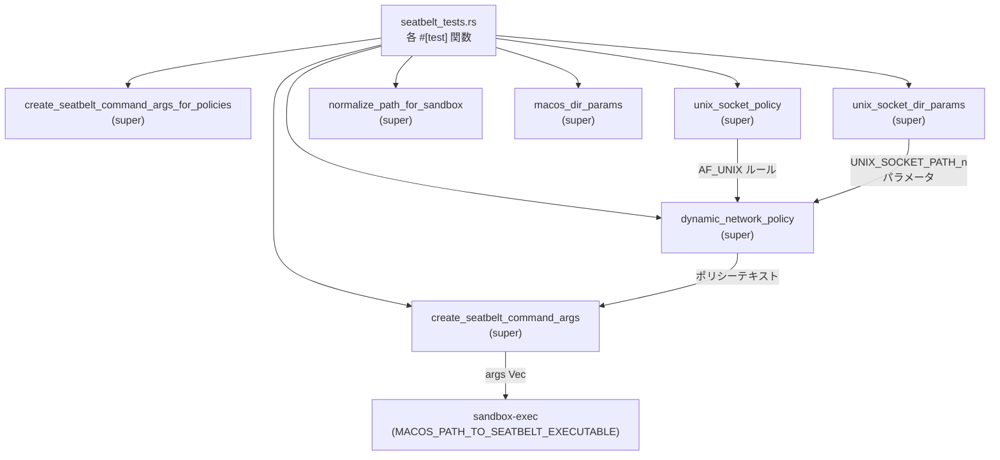
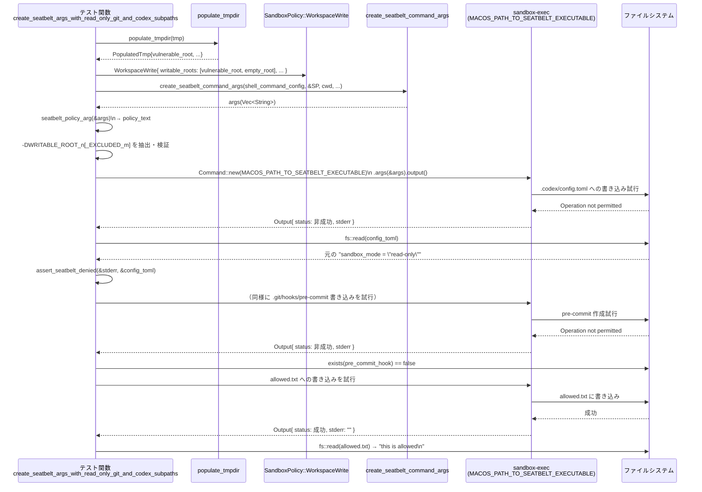

sandboxing/src/seatbelt_tests.rs

---

## 0. ざっくり一言

macOS の Seatbelt サンドボックス用ポリシー文字列とコマンドライン引数を生成するロジック（親モジュール側）の**セキュリティ要件を検証するテスト群**です。  
ファイルシステム（`.git`/`.codex` 等）とネットワーク（プロキシ・UNIX ソケット等）の許可／禁止条件が意図どおりになっているかを確認します。  
（行番号情報はチャンクに含まれていないため、根拠は `seatbelt_tests.rs:L1-L1050` として示します。）

---

## 1. このモジュールの役割

### 1.1 概要

このモジュールは、親モジュール（`super::` でインポートされている関数群）が生成する Seatbelt サンドボックス設定について、次のような振る舞いを検証します（`seatbelt_tests.rs:L1-L1050`）。

- **ベースポリシーの前提**  
  CPU 情報取得や特定の POSIX 共有メモリ（KMP 登録）へのアクセスが許可されていること。
- **ネットワークポリシーのダイナミック生成**  
  プロキシ設定や `allow_local_binding`、DNS、UNIX ドメインソケットの設定に応じて、**フェイルクローズ（過剰に許可しない）**なルールになること。
- **ファイルシステムポリシー**  
  `.git` / `.codex` 配下や明示的に「読めない／書けない」とされたパスに対し、読み書きが禁止される carve-out が正しく生成されること。
- **実 OS との統合テスト**  
  実際に `sandbox-exec`（`MACOS_PATH_TO_SEATBELT_EXECUTABLE`）を起動し、書き込み禁止が OS レベルでも有効であることを確認。

### 1.2 アーキテクチャ内での位置づけ

このテストモジュールは、親モジュールのポリシー生成ロジックと OS の `sandbox-exec` の間に位置し、生成されたポリシー文字列・引数ベクタが期待どおりか、さらに OS での強制も意図どおりかを確認します。

主な依存関係は次のとおりです（すべて `seatbelt_tests.rs:L1-L1050` 内に登場）。

- 親モジュール（`super::`）
  - `MACOS_SEATBELT_BASE_POLICY`
  - `MACOS_PATH_TO_SEATBELT_EXECUTABLE`
  - `create_seatbelt_command_args`
  - `create_seatbelt_command_args_for_policies`
  - `dynamic_network_policy`
  - `macos_dir_params`
  - `normalize_path_for_sandbox`
  - `unix_socket_policy`
  - `unix_socket_dir_params`
  - `UnixDomainSocketPolicy`
  - `ProxyPolicyInputs`
- `codex_protocol` クレート
  - `SandboxPolicy`, `ReadOnlyAccess`
  - `FileSystemSandboxPolicy`, `FileSystemSandboxEntry`, `FileSystemPath`, `FileSystemAccessMode`, `FileSystemSpecialPath`
  - `NetworkSandboxPolicy`
- OS / 標準ライブラリ
  - `std::process::Command`（`sandbox-exec` や `git` の実行）
  - `std::fs`, `std::path::{Path, PathBuf}`
  - `tempfile::TempDir`

依存関係の概要を Mermaid 図で表すと次のようになります。



### 1.3 設計上のポイント

コード（テスト）から読み取れる特徴は次のとおりです（`seatbelt_tests.rs:L1-L1050`）。

- **ベースポリシーを前提に追加ルールを生成**  
  `MACOS_SEATBELT_BASE_POLICY` に対して、ネットワーク・ファイルシステムの条件を動的に足し引きする設計であることがテストから確認できます。
- **セキュリティ優先・フェイルクローズ**  
  プロキシポートがない、または構成不足の場合には
  - ブランケットな `network-outbound` / DNS 許可を追加しない
  - ループバック inbound/outbound も暗黙には許可しない  
  ことを複数のテストで検証しています。
- **`.git` / `.codex` への特別扱い**  
  Workspace の writable root の直下にある `.git` / `.codex` は
  - 書き込み禁止 carve-out（`WRITABLE_ROOT_n_EXCLUDED_m`）として扱う
  - `.git` が「ポインタファイル」の場合も、そのファイル自身および実際の Git ディレクトリ配下を保護する  
  という契約をテストで明示しています。
- **パス正規化と安定したパラメータ名**  
  - `normalize_path_for_sandbox` が相対パスを拒否すること
  - `unix_socket_dir_params` が「ソート & 重複排除」し、`UNIX_SOCKET_PATH_0`, `UNIX_SOCKET_PATH_1`... のように安定した名前付けを行うこと  
  をテストで保証しています。
- **実 OS との統合テスト**  
  単なる文字列比較に留まらず、`Command::new(MACOS_PATH_TO_SEATBELT_EXECUTABLE)` で実行し、
  - 期待どおりのファイルが書き込めず、
  - 許可された場所には書き込める  
  ことまで確認するテストが含まれています。

---

## 2. 主要な機能一覧（テスト観点）

テストが検証している主要な機能を簡潔に列挙します（いずれも `seatbelt_tests.rs:L1-L1050`）。

- ベースポリシー:
  - CPU 情報取得用 sysctl（`machdep.cpu.brand_string`, `hw.model`）を許可
  - KMP 登録用 POSIX 共有メモリの read/create/unlink を限定的に許可
- ネットワークポリシー（`dynamic_network_policy`）:
  - プロキシポート付き構成では、特定ポート（例: `localhost:43128`, `localhost:48081`）だけ outbound 許可
  - `allow_local_binding` = false では loopback bind/inbound/outbound や DNS (`*:53`) を許可しない
  - `allow_local_binding` = true かつポートありでは、loopback inbound/outbound と DNS egress を許可しつつ、ブランケット outbound は許可しない
  - プロキシ構成はあるがポートが空のとき／managed network だがプロキシエンドポイントがないときは、restricted プロファイルのままで、DNS も許可しない
  - `UnixDomainSocketPolicy::Restricted` / `AllowAll` に応じて AF_UNIX ソケットのルールを切り替える
- ファイルシステムポリシー:
  - `FileSystemSandboxPolicy::restricted` で指定された「unreadable path」は、readable/writable roots から正しく carve-out される
  - WorkspaceWrite ポリシーで cwd 直下の `.git` / `.codex` を自動検出し、書き込み禁止にする
  - 明示的な writable_roots 指定時にも、それぞれの root に対して `.git` / `.codex` carve-out を生成しつつ、root 直下の他ファイルは書き込み可能に保つ
  - `.codex` ディレクトリがまだ存在しない初回作成の試みも、carve-out により拒否される
  - `.git` が gitdir ポインタファイルの場合も、そのファイルと実 gitdir 配下の config などを保護する
- UNIX ドメインソケット関連:
  - `unix_socket_policy` が AllowAll/Restricted いずれの場合も末尾が改行で終わる
  - `unix_socket_dir_params` がソート済み・重複除去された `UNIX_SOCKET_PATH_n` パラメータを生成する
  - `normalize_path_for_sandbox` は相対パスを `None` として拒否する
- Seatbelt コマンド引数生成:
  - `create_seatbelt_command_args` / `create_seatbelt_command_args_for_policies` が
    - `-p <policy-text>` フォーマットでポリシーを引数に埋め込む
    - `-DWRITABLE_ROOT_n[_EXCLUDED_m]=<path>` といった定義を正しく並べる
    - macOS 固有ディレクトリパラメータ（`macos_dir_params()`）に対応する全ての `-Dキー=値` を含む
    - `--` 以降にユーザーのコマンド（`bash ...`）をそのまま引き渡す
  - 拡張プロファイル未使用時には `user-preference-read` は許可し、`user-preference-write` は許可しない

---

## 3. 公開 API と詳細解説

このファイル自体はテストモジュールであり、外部クレートから直接呼び出される公開 API はありません。  
ただし、**テスト内で再利用されるヘルパー型・関数**は、このモジュール内での「公開 API」に相当します。

### 3.1 型一覧（構造体・列挙体など）

このファイルで定義されている主要な型は 1 つです（`seatbelt_tests.rs:L1-L1050`）。

| 名前          | 種別   | 役割 / 用途                                                                 | 根拠 |
|---------------|--------|------------------------------------------------------------------------------|------|
| `PopulatedTmp` | 構造体 | テスト用の一時ディレクトリ構造（`.git`/`.codex` を含む root と、空の root）を保持するヘルパー | `seatbelt_tests.rs:L1-L1050` |

`PopulatedTmp` のフィールド（コメントから用途が明示されています）:

- `vulnerable_root`: `.git` と `.codex` を含むルートパス。
- `vulnerable_root_canonical`: 上記の canonicalized パス。
- `dot_git_canonical`: `vulnerable_root_canonical/.git`。
- `dot_codex_canonical`: `vulnerable_root_canonical/.codex`。
- `empty_root`: `.git` / `.codex` を含まない root。
- `empty_root_canonical`: `empty_root` の canonicalized 版。

### 3.2 関数詳細（最大 7 件）

ここでは、このファイル内で再利用性が高く、コアな仕様を表現している関数・テストを 7 つ取り上げます。

---

#### `assert_seatbelt_denied(stderr: &[u8], path: &Path) -> ()`

**概要**

`sandbox-exec` 実行結果の標準エラー出力が、特定パスに対する「Operation not permitted」エラーを示していることを検証するヘルパーです（`seatbelt_tests.rs:L1-L1050`）。

**引数**

| 引数名  | 型        | 説明                                                                 |
|---------|-----------|----------------------------------------------------------------------|
| `stderr` | `&[u8]`   | `Command::output().stderr` に相当する生バイト列                      |
| `path`  | `&Path`   | アクセスが拒否されることを期待しているファイルパス                   |

**戻り値**

- `()`（ユニット）。期待に反する stderr の場合は `assert!` によりテストが panic します。

**内部処理の流れ**

1. `stderr` バイト列を `String::from_utf8_lossy` で UTF-8 として解釈した文字列に変換。
2. `bash: {path}: Operation not permitted\n` という期待メッセージを `expected` として生成。
3. `stderr == expected` または `stderr` が  
   `"sandbox-exec: sandbox_apply: Operation not permitted"` を含むかを `assert!` で検証。
   - 前者は bash がファイルアクセスを拒否したケース。
   - 後者は Seatbelt の適用自体が失敗したケース。

**Examples（使用例）**

このモジュール内の統合テストで使われています。

```rust
// seatbelt で保護された .codex/config.toml への書き込みが拒否されたか確認する例
let output = Command::new(MACOS_PATH_TO_SEATBELT_EXECUTABLE)
    .args(&args)
    .current_dir(&cwd)
    .output()
    .expect("execute seatbelt command");

assert!(!output.status.success());
assert_seatbelt_denied(&output.stderr, &config_toml);
```

**Errors / Panics**

- `stderr` が期待フォーマットのいずれにも一致しない場合、`assert!` により panic します。
- ロケールやシェルの違いによりエラーメッセージが変化すると、テストが失敗する可能性があります。

**Edge cases（エッジケース）**

- Seatbelt の適用自体が失敗する場合（`sandbox_apply` エラー）のメッセージも許容するため、  
  ファイルアクセス前に失敗したケースも「拒否された」とみなされます。
- `stderr` が空文字列や全く別のエラーの場合はテスト失敗となります。

**使用上の注意点**

- このヘルパーは macOS + bash + sandbox-exec に依存したメッセージフォーマット前提であるため、  
  他のプラットフォーム・シェルではそのまま使えない可能性があります。

---

#### `absolute_path(path: &str) -> AbsolutePathBuf`

**概要**

絶対パス文字列から `AbsolutePathBuf` を生成し、絶対パスであることを前提にしたヘルパーです（`seatbelt_tests.rs:L1-L1050`）。

**引数**

| 引数名 | 型      | 説明                            |
|--------|---------|---------------------------------|
| `path` | `&str`  | 絶対パスであることを期待する文字列 |

**戻り値**

- `AbsolutePathBuf`: `codex_utils_absolute_path::AbsolutePathBuf` 型。  
  `from_absolute_path(Path::new(path))` の `Ok` 値。

**内部処理の流れ**

1. `Path::new(path)` で `&Path` を生成。
2. `AbsolutePathBuf::from_absolute_path` を呼び出し、`Result` を得る。
3. `expect("absolute path")` で `Ok` であることを強制。`Err` なら panic。

**Examples**

```rust
let sock = absolute_path("/tmp/example.sock"); // "/tmp/example.sock" が絶対パスであることを前提
```

**Errors / Panics**

- `path` が相対パス、あるいは `AbsolutePathBuf` の前提に反する場合、`expect` により panic します。

**Edge cases**

- 空文字列や `"relative/path"` のような値を渡すと panic します（テストコードではそのような使い方はしていません）。

**使用上の注意点**

- テスト用のユーティリティであり、入力が絶対パスであることを前提にしています。  
  実行時エラーよりもテストの即時失敗を優先する設計です。

---

#### `seatbelt_policy_arg(args: &[String]) -> &str`

**概要**

Seatbelt 実行用の引数ベクタから、`-p` オプションに続くポリシーテキスト文字列を取り出すヘルパーです（`seatbelt_tests.rs:L1-L1050`）。

**引数**

| 引数名 | 型              | 説明                                             |
|--------|-----------------|--------------------------------------------------|
| `args` | `&[String]`     | `create_seatbelt_command_args` 等が生成した引数列 |

**戻り値**

- `&str`: `-p` の直後にあるポリシーテキスト。

**内部処理の流れ**

1. `args.iter().position(|arg| arg == "-p")` で `"-p"` の位置を検索し、`expect` で存在を強制。
2. 見つけたインデックス + 1 の位置からポリシーテキストを取り出し、`expect` で存在を強制。
3. `&str` として返却。

**Examples**

```rust
let args = create_seatbelt_command_args(...);
let policy_text = seatbelt_policy_arg(&args);
assert!(policy_text.contains("(allow file-read*)"));
```

**Errors / Panics**

- `-p` が含まれていない場合、位置探索の `expect` で panic。
- `-p` が末尾で、その後にポリシーテキストが存在しない場合も panic。

**Edge cases**

- `-p` が複数回出現するケースは想定していません（最初のものを取得）。
- `args` が空のときも panic しますが、そのような使われ方はしていません。

**使用上の注意点**

- `create_seatbelt_command_args` ファミリの出力に対してのみ使う前提です。  
  任意の引数列に対して使うと panic を起こし得ます。

---

#### `create_seatbelt_args_with_read_only_git_and_codex_subpaths()`

> `#[test]` 関数。Workspace 内の `.git` / `.codex` サブディレクトリが**読み取り専用（書き込み禁止）**となるよう、Seatbelt ポリシーと `-DWRITABLE_ROOT_n` パラメータが構成されていることを検証します（`seatbelt_tests.rs:L1-L1050`）。

**引数**

- なし（テスト関数）。

**戻り値**

- `()`（テストに成功すれば何も返さない。失敗時は panic）。

**内部処理の流れ**

1. `TempDir` を作成し、`populate_tmpdir` を呼び出してテスト用のディレクトリ構造を作成。
   - `.git` と `.codex` を含む `vulnerable_root` と、空の `empty_root` を準備。
2. `SandboxPolicy::WorkspaceWrite` を構築。
   - `writable_roots` として `vulnerable_root`, `empty_root` を指定。
   - TMPDIR や `/tmp` を writable とするデフォルトは除外。
3. `.codex/config.toml` に悪意のある設定を書き込もうとする `shell_command`（`bash -c "echo ... > \"$1\""`）を構築。
4. `create_seatbelt_command_args` を呼び出して Seatbelt 用引数 `args` を生成。
5. `seatbelt_policy_arg` でポリシーテキスト `policy_text` を取り出し、以下を検証。
   - `WRITABLE_ROOT_0`（cwd 相当）には `.codex` carve-out（`WRITABLE_ROOT_0_EXCLUDED_0`）がある。
   - `WRITABLE_ROOT_1`（vulnerable_root）には `.git` / `.codex` carve-out がある。
   - `WRITABLE_ROOT_2`（empty_root）は carve-out なしでサブパス全体が writable。
6. `args` から `-DWRITABLE_ROOT_n[_EXCLUDED_m]=...` を抽出し、期待どおりのパラメータ集合と完全一致することを `assert_eq!` で検証。
7. `macos_dir_params()` が返す全ての `(key, value)` について `-D{key}={value}` が `args` に含まれることを検証。
8. `--` の位置を探し、それ以降の引数が元の `shell_command` と一致していることを検証。
9. 実際に `sandbox-exec`（`MACOS_PATH_TO_SEATBELT_EXECUTABLE`）を呼び出して `.codex/config.toml` への書き込みを試みる。
   - 実行後にファイル内容が元の `"sandbox_mode = \"read-only\"\n"` から変化していないこと。
   - コマンドのステータスが失敗であり、`assert_seatbelt_denied` が期待通りのエラーを確認できること。
10. 同様に `.git/hooks/pre-commit` への書き込みを試み、ファイルが作成されていないことと、コマンドが失敗していることを確認。
11. 一方で `vulnerable_root` 直下の `allowed.txt` への書き込みは許可されることを検証。
    - `sandbox-exec` が `sandbox_apply` エラーで失敗した場合はテストを早期リターン（Seatbelt 自体が動いていないケースを許容）。
    - そうでなければステータス成功と、ファイル内容の一致を確認。

**Examples**

このテスト自体が使用例になっています。特に、

```rust
let policy = SandboxPolicy::WorkspaceWrite {
    writable_roots: vec![vulnerable_root, empty_root]
        .into_iter()
        .map(|p| p.try_into().unwrap())
        .collect(),
    read_only_access: Default::default(),
    network_access: false,
    exclude_tmpdir_env_var: true,
    exclude_slash_tmp: true,
};

let args = create_seatbelt_command_args(
    shell_command.clone(),
    &policy,
    &cwd,
    false,
    None,
);
```

の部分は、「明示的な writable roots + `.git`/`.codex` carve-out」という**典型的なポリシー生成パターン**を示しています。

**Errors / Panics**

- ポリシーテキストに期待する `WRITABLE_ROOT_n_EXCLUDED_m` が含まれない場合、`assert!` や `assert_eq!` で panic。
- `MACOS_PATH_TO_SEATBELT_EXECUTABLE` や `bash` が見つからない等で `Command::new(...).output()` が失敗した場合、`expect` で panic。

**Edge cases**

- `sandbox-exec` 自体の適用に失敗する場合（`sandbox_apply` エラー）は、最後の `allowed.txt` 書き込みテストで「Seatbelt 側の環境問題」とみなして早期 return します。  
  これは CI 環境などで Seatbelt が利用できない場合を考慮した挙動と解釈できます。

**使用上の注意点**

- 実 OS コマンド（`git`, `bash`, `sandbox-exec`）に依存するため、テスト環境にこれらが存在しないと失敗します。
- `.git` / `.codex` carve-out の仕様を変更する場合、このテストおよび `populate_tmpdir` も併せて更新する必要があります。

---

#### `create_seatbelt_args_with_read_only_git_pointer_file()`

**概要**

`.git` が「gitdir: ...」形式のポインタファイルであるようなワークツリーに対して、`.git` ファイルと実際の git ディレクトリ配下の config ファイルを書き込み禁止にできているかを検証するテストです（`seatbelt_tests.rs:L1-L1050`）。

**内部処理の要点**

- `worktree_root/actual-gitdir` に実際の Git ディレクトリを作成し、そこに `config` ファイルを書き込み。
- `worktree_root/.git` に `gitdir: <path_to_actual-gitdir>` という内容のテキストファイルを作成。
- `SandboxPolicy::WorkspaceWrite` の `writable_roots` に `worktree_root` を指定。
- `.git` および `actual-gitdir/config` への書き込みをそれぞれ `sandbox-exec` 経由で試み、
  - ファイル内容が変化していないこと
  - コマンドが失敗していること  
  を `assert!` と `assert_seatbelt_denied` で確認。

**契約として読み取れること**

- Seatbelt ポリシー生成ロジックは、「`.git` がファイルであっても、そのファイルおよび実際の Git ディレクトリ配下を保護対象として扱う」必要があります。

---

#### `create_seatbelt_args_for_cwd_as_git_repo()`

**概要**

`SandboxPolicy::WorkspaceWrite` に writable_roots を明示的に指定しない場合に、**カレントディレクトリ（cwd）と TMPDIR が writable root として扱われ、かつそれらの `.git` / `.codex` は carve-out される**ことを検証するテストです（`seatbelt_tests.rs:L1-L1050`）。

**ポイント**

- `populate_tmpdir` で作成された `vulnerable_root` を cwd として `create_seatbelt_command_args` を呼び出す。
- `TMPDIR` 環境変数が存在するかどうかで、`WRITABLE_ROOT_2`（TMPDIR）関連のポリシー断片と `-D` 定義を条件付きで期待。
- 期待されるポリシーテキスト全文を `expected_policy` として組み立て、`args` 全体と完全一致することを `assert_eq!` で検証。  
  ここで確認している主な点:
  - ベースポリシーに `(allow file-read*)` と `(allow file-write* ...)` が追加されている。
  - `WRITABLE_ROOT_0`（cwd）, `WRITABLE_ROOT_1`（`/tmp` canonicalized）, 必要に応じて `WRITABLE_ROOT_2`（TMPDIR）が定義され、それぞれに `.git` / `.codex` carve-out が設定されている。
  - `macos_dir_params` に対応する `-D` 定義がすべて含まれている。

**契約**

- WorkspaceWrite のデフォルト動作として、「明示的な writable_roots が空なら cwd と TMPDIR を writable とするが、その `.git` / `.codex` は書き込み禁止にする」ことが前提になっています。

---

#### `unix_socket_policy_non_empty_output_is_newline_terminated()`

**概要**

`unix_socket_policy` が返すポリシーテキストが、AllowAll / Restricted いずれのケースでも**必ず改行 (`'\n'`) で終わる**ことを検証するテストです（`seatbelt_tests.rs:L1-L1050`）。

**内部処理の要点**

- `UnixDomainSocketPolicy::Restricted { allowed: vec![absolute_path("/tmp/example.sock")] }` を含む `ProxyPolicyInputs` を渡して `unix_socket_policy` を呼び出し、文字列が `'\n'` で終わることを `assert!`。
- `UnixDomainSocketPolicy::AllowAll` を指定した場合も同様に `'\n'` 終端であることを確認。

**Edge cases**

- 空のポリシー（全く何も出力しないケース）はこのテストの対象外です。  
  ここで検証しているのは「あらゆる非空出力は改行終端であるべき」という契約です。

---

#### `unix_socket_dir_params_use_stable_param_names()`

**概要**

UNIX ドメインソケット用のパスリストから生成される `UNIX_SOCKET_PATH_n` パラメータが、**ソート済みかつ重複除去され、安定した順序になる**ことを検証するテストです（`seatbelt_tests.rs:L1-L1050`）。

**内部処理の要点**

- `allowed` リストとして  
  `["/tmp/b.sock", "/tmp/a.sock", "/tmp/a.sock"]` を指定。
- `unix_socket_dir_params` の戻り値 `params` が

  ```rust
  vec![
      ("UNIX_SOCKET_PATH_0".to_string(), PathBuf::from("/tmp/a.sock")),
      ("UNIX_SOCKET_PATH_1".to_string(), PathBuf::from("/tmp/b.sock")),
  ]
  ```

  と一致することを `assert_eq!` で検証。

**契約**

- 入力順や重複に依存せず、ポリシー内の `UNIX_SOCKET_PATH_n` パラメータ名とパスが安定していること。  
  これによりテストや比較で**順序依存のノイズが出にくい**設計になっていると解釈できます。

---

#### `normalize_path_for_sandbox_rejects_relative_paths()`

**概要**

`normalize_path_for_sandbox` が相対パスを拒否し、`None` を返すことを検証するテストです（`seatbelt_tests.rs:L1-L1050`）。

**内部処理**

```rust
assert_eq!(normalize_path_for_sandbox(Path::new("relative.sock")), None);
```

という単純な 1 行で、相対パス `"relative.sock"` に対して `None` を返す挙動を確認しています。

**契約**

- サンドボックス用に登録可能なパスは**絶対パスのみ**であり、相対パスは正規化段階で拒否する。  
  これにより、「どのディレクトリを基準に解釈するか」に起因するセキュリティリスクを抑えています。

---

### 3.3 その他の関数（テスト一覧）

以下は、このファイルに含まれるその他のテスト関数とヘルパーの一覧です（すべて `seatbelt_tests.rs:L1-L1050`）。

| 関数名 | 役割（1 行） |
|--------|--------------|
| `base_policy_allows_node_cpu_sysctls` | ベースポリシーが `machdep.cpu.brand_string` と `hw.model` の sysctl を許可していることを確認する。 |
| `base_policy_allows_kmp_registration_shm_read_create_and_unlink` | KMP 登録用 POSIX 共有メモリに対する read/write-create/write-unlink を限定的に許可していることを確認する。 |
| `create_seatbelt_args_routes_network_through_proxy_ports` | プロキシポート指定時に outbound がそれらのポート経由に限定され、ブランケット outbound/loopback/DNS 許可がないことを検証。 |
| `explicit_unreadable_paths_are_excluded_from_full_disk_read_and_write_access` | `FileSystemSandboxPolicy::restricted` で指定した unreadable path が read/write root から carve-out され、対応する `-DREADABLE_ROOT_n_EXCLUDED_m` / `-DWRITABLE_ROOT_n_EXCLUDED_m` が引数に入ることを検証。 |
| `explicit_unreadable_paths_are_excluded_from_readable_roots` | 指定した readable root から特定の unreadable subpath が carve-out されることを検証。 |
| `seatbelt_args_without_extension_profile_keep_legacy_preferences_read_access` | 拡張プロファイルを使わない場合に、`user-preference-read` は許可されるが `user-preference-write` は許可されないことを確認。 |
| `seatbelt_legacy_workspace_write_nested_readable_root_stays_writable` | 旧仕様の WorkspaceWrite で、cwd 配下に readable root があっても、それが seatbelt carve-out にならず writable なままであることを確認。 |
| `create_seatbelt_args_allows_local_binding_when_explicitly_enabled` | `allow_local_binding = true` かつプロキシポートありの場合に、loopback bind/inbound/outbound および DNS egress を許可しつつ、ブランケット outbound を許可しないことを検証。 |
| `dynamic_network_policy_preserves_restricted_policy_when_proxy_config_without_ports` | プロキシ設定はあるがポートが空のとき、restricted プロファイルを維持し、DNS も許可しないことを検証。 |
| `dynamic_network_policy_blocks_dns_when_local_binding_has_no_proxy_ports` | `allow_local_binding = true` かつプロキシポートなしの場合でも local binding は許可するが、DNS egress は許可しないことを検証。 |
| `dynamic_network_policy_preserves_restricted_policy_for_managed_network_without_proxy_config` | managed network が有効だがプロキシエンドポイントがない場合、restricted プロファイルを維持し、DNS も許可しないことを検証。 |
| `create_seatbelt_args_allowlists_unix_socket_paths` | Restricted な UNIX ドメインソケット許可リストに対して、AF_UNIX ソケット作成・bind/connect を許可するルールと `UNIX_SOCKET_PATH_0` パラメータを生成し、旧来の generic subpath ルールを使わないことを検証。 |
| `create_seatbelt_args_allows_all_unix_sockets_when_enabled` | AllowAll 設定時に、AF_UNIX ソケットの作成・bind/connect がすべて許可され、旧来の generic subpath ルールを使わないことを検証。 |
| `create_seatbelt_args_full_network_with_proxy_is_still_proxy_only` | `SandboxPolicy::WorkspaceWrite{ network_access: true }` でも、プロキシが設定されていれば outbound/inbound がプロキシ経由のみに制限されることを検証。 |
| `create_seatbelt_args_block_first_time_dot_codex_creation_with_exact_and_descendant_carveouts` | `.codex` ディレクトリが存在しない状態での初回作成とその配下への書き込みを、exact + subpath carve-out でブロックするポリシーが生成されていることを検証。 |
| `populate_tmpdir` | `PopulatedTmp` 構造体を初期化し、`.git` / `.codex` を含む root と空の root を作成するテスト用ヘルパー。 |

---

## 4. データフロー

ここでは、最も複雑な統合テストのひとつである  
`create_seatbelt_args_with_read_only_git_and_codex_subpaths` におけるデータフローを整理します（`seatbelt_tests.rs:L1-L1050`）。

### 4.1 処理の要点

- **入力**: 一時ディレクトリパス、`SandboxPolicy::WorkspaceWrite` の設定、bash コマンド。
- **中間生成物**:
  - Seatbelt ポリシーテキスト（`-p` の引数）。
  - `-DWRITABLE_ROOT_n[_EXCLUDED_m]=<path>` などのディレクトリパラメータ。
  - `--` 以降の、実際に実行される bash コマンド。
- **出力/効果**:
  - `.codex/config.toml` や `.git/hooks/pre-commit` への書き込みが OS レベルで拒否される。
  - `vulnerable_root/allowed.txt` への書き込みは許可される。

### 4.2 シーケンス図



この流れから、テストが**文字列レベルのポリシーチェック**と**OS レベルの実行結果チェック**の両方を行っていることが分かります。

---

## 5. 使い方（How to Use）

このファイルはテスト専用モジュールですが、ここでの使い方は「**新しい Seatbelt ポリシー仕様を追加／変更するときに、どのようにテストを書くか**」という観点で参考になります。

### 5.1 基本的な使用方法（テスト執筆パターン）

典型的なテストの構成パターンは次のようになります。

```rust
#[test]
fn some_policy_behavior_is_correct() {
    // 1. テスト用のファイルシステムやポリシーを準備する
    let tmp = TempDir::new().expect("tempdir");
    let cwd = tmp.path().join("workspace");
    fs::create_dir_all(&cwd).expect("create workspace");

    let policy = SandboxPolicy::WorkspaceWrite {
        writable_roots: vec![],
        read_only_access: Default::default(),
        network_access: false,
        exclude_tmpdir_env_var: true,
        exclude_slash_tmp: true,
    };

    // 2. 実行したいコマンド（通常は bash 経由）を組み立てる
    let shell_command: Vec<String> = [
        "bash",
        "-c",
        "echo 'hello' > \"$1\"",
        "bash",
        cwd.join("file.txt").to_string_lossy().as_ref(),
    ]
    .iter()
    .map(ToString::to_string)
    .collect();

    // 3. Seatbelt 用の引数を生成する
    let args = create_seatbelt_command_args(
        shell_command.clone(),
        &policy,
        &cwd,
        false,
        None,
    );

    // 4. ポリシーテキストを取り出して文字列レベルの検証を行う
    let policy_text = seatbelt_policy_arg(&args);
    assert!(policy_text.contains("(allow file-read*)"));

    // 5. 必要に応じて sandbox-exec を起動して OS レベルの挙動も確認する
    let output = Command::new(MACOS_PATH_TO_SEATBELT_EXECUTABLE)
        .args(&args)
        .current_dir(&cwd)
        .output()
        .expect("execute seatbelt command");

    assert!(output.status.success());
    assert_eq!(
        "hello\n",
        String::from_utf8_lossy(&fs::read(cwd.join("file.txt")).unwrap())
    );
}
```

### 5.2 よくある使用パターン

本ファイルから読み取れる代表的なパターンを挙げます。

1. **文字列のみのユニットテスト**

   - ネットワークポリシーや UNIX ソケットポリシーの生成結果に対して `contains` / `!contains` を用いて検証。
   - 例: `create_seatbelt_args_routes_network_through_proxy_ports` や  
     `create_seatbelt_args_full_network_with_proxy_is_still_proxy_only`。

2. **`-D` パラメータの検証**

   - `args.iter().filter(|arg| arg.starts_with("-DWRITABLE_ROOT_"))` で relevant な定義だけを抽出。
   - 期待されるベクタとの `assert_eq!` で並び順も含めて厳密に検証。
   - 例: `explicit_unreadable_paths_are_excluded_from_full_disk_read_and_write_access`。

3. **OS コマンドを伴う統合テスト**

   - `git init` や `bash -c` を使って実際のリポジトリ構造を準備。
   - `sandbox-exec` を起動し、ファイルの存在・内容とステータスコード、stderr を確認。
   - 例: `create_seatbelt_args_with_read_only_git_and_codex_subpaths`、`create_seatbelt_args_with_read_only_git_pointer_file`。

### 5.3 よくある間違いと正しい使い方

```rust
// 誤り例: seatbelt_policy_arg を任意の args に使う
let args = vec!["echo".to_string(), "ok".to_string()];
let policy = seatbelt_policy_arg(&args); // panic する可能性が高い

// 正しい例: create_seatbelt_command_args の出力に対してのみ使う
let args = create_seatbelt_command_args(
    vec!["echo".to_string(), "ok".to_string()],
    &SandboxPolicy::new_read_only_policy(),
    std::env::temp_dir().as_path(),
    false,
    None,
);
let policy = seatbelt_policy_arg(&args);
```

```rust
// 誤り例: normalize_path_for_sandbox に相対パスを渡して、その結果を当然のように使う
let p = normalize_path_for_sandbox(Path::new("relative.sock")).unwrap(); // テストは None を期待している

// 正しい例: None を明示的に扱う
if let Some(p) = normalize_path_for_sandbox(Path::new("/tmp/absolute.sock")) {
    // p を UNIX ソケットの許可リストなどに使う
}
```

### 5.4 使用上の注意点（まとめ）

- **プラットフォーム依存**:
  - 多くのテストが macOS の `sandbox-exec` と bash、git に依存します。
  - それらが存在しない環境ではテストが失敗または実行不能になる可能性があります。
- **所有権／エラー処理**:
  - Rust の標準的な所有権モデルに従っており、`TempDir` による一時ディレクトリはスコープを抜けると自動削除されます。
  - 多くの箇所で `expect` や `unwrap` を用いており、前提が崩れた場合は即座に panic する設計です（テストコードとしては妥当）。
- **並行実行時の注意**:
  - `cargo test` はデフォルトでテストを並行に実行しますが、このファイル内の各テストはそれぞれ独立した `TempDir` / cwd を利用しており、直接的な共有状態はありません。
  - ただし、`MACOS_PATH_TO_SEATBELT_EXECUTABLE` や OS 全体の Seatbelt 状態は共有リソースのため、環境によっては干渉の可能性があります。

---

## 6. 変更の仕方（How to Modify）

### 6.1 新しい機能を追加する場合（例: 新しい carve-out やネットワークルール）

1. **仕様の把握**  
   親モジュール側（`dynamic_network_policy`, `create_seatbelt_command_args` など）の仕様変更内容を整理する。
2. **テストケースの設計**  
   - 入力となる `SandboxPolicy` / `ProxyPolicyInputs` / `FileSystemSandboxPolicy` の組み合わせを決める。
   - 期待されるポリシーテキスト断片と `-D` 引数をテキストベースで定義する。
3. **テストの実装**  
   - 単純な文字列検証で済む場合は `contains` / `!contains` を用いたユニットテストを追加。
   - OS レベルの挙動が重要であれば、`Command::new(MACOS_PATH_TO_SEATBELT_EXECUTABLE)` を使った統合テストを追加し、`assert_seatbelt_denied` 等のヘルパーを再利用。
4. **PopulatedTmp などのヘルパーの拡張**  
   - 新しく保護したい特別フォルダ（例: `.venv` など）が増えた場合は、`populate_tmpdir` にそれらを追加し、既存テストの期待値も更新する。

### 6.2 既存の機能を変更する場合

- **影響範囲の確認**
  - 対応するテスト関数（名前から推測しやすい）を検索し、どの invariants を保証しているか把握する。
  - たとえば `.git` / `.codex` 周りを変更するなら、`create_seatbelt_args_with_read_only_git_and_codex_subpaths` と `create_seatbelt_args_for_cwd_as_git_repo` を確認する。
- **契約の維持／変更**
  - 「フェイルクローズであること」「`.git` / `.codex` は決して writable にならないこと」など、セキュリティ上重要な契約を意図的に変更するかどうかを明確にする。
  - 契約を変更する場合、その意図がテスト名・コメントから読み取れるように修正する。
- **テストの更新**
  - ポリシーテキストや `-D` 引数の期待値が変わった場合は、`assert_eq!` の右辺（期待値文字列）を更新する。
  - 統合テストでは、OS 側の挙動（成功/失敗）の期待値も変更が必要か確認する。

---

## 7. 関連ファイル

このモジュールと密接に関係するファイル／モジュールは、`super::` や外部クレートとして参照されているものから推測できます。ただし、このチャンクには具体的なファイルパスは現れていません。

| パス / モジュール | 役割 / 関係 |
|-------------------|------------|
| 親モジュール（`super`） | `MACOS_SEATBELT_BASE_POLICY`, `MACOS_PATH_TO_SEATBELT_EXECUTABLE`, `create_seatbelt_command_args`, `create_seatbelt_command_args_for_policies`, `dynamic_network_policy`, `unix_socket_policy`, `unix_socket_dir_params`, `macos_dir_params`, `normalize_path_for_sandbox`, `ProxyPolicyInputs`, `UnixDomainSocketPolicy` を提供する。Seatbelt ポリシー生成ロジックの本体。 |
| `codex_protocol::permissions` | `FileSystemSandboxPolicy` や `NetworkSandboxPolicy` など、抽象的なサンドボックスポリシー表現を提供する。 |
| `codex_protocol::protocol` | `SandboxPolicy`, `ReadOnlyAccess` など、高レベルなサンドボックスポリシー設定を提供する。 |
| `codex_utils_absolute_path` | `AbsolutePathBuf` 型を提供し、絶対パスの取り扱いを型レベルで保証する。 |

このファイルは、それらのモジュールが実装する契約（特にセキュリティに関わる部分）をテストで固定する役割を持っています。
