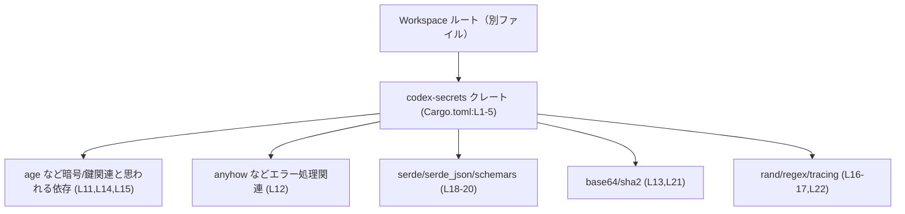
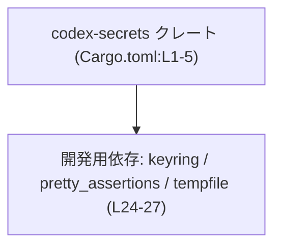
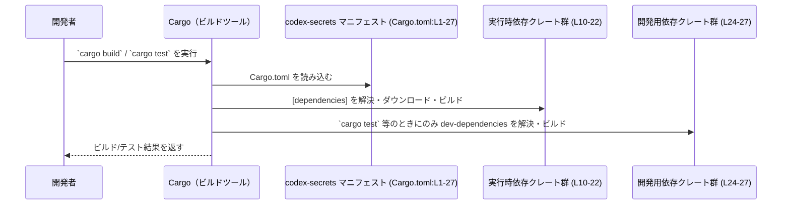

# secrets/Cargo.toml コード解説

## 0. ざっくり一言

`secrets/Cargo.toml` は、Rust クレート `codex-secrets` の Cargo マニフェストで、パッケージ情報・リント設定・依存クレート・開発用依存クレートを定義しているファイルです（根拠: `secrets/Cargo.toml:L1-5,L7-8,L10-22,L24-27`）。

---

## 1. このモジュールの役割

### 1.1 概要

- このファイルは、`codex-secrets` クレートの
  - パッケージ名とワークスペース由来のバージョン/edition/ライセンス（根拠: `L1-5`）
  - ワークスペース共通のリント設定（根拠: `L7-8`）
  - 実行時に利用する依存クレート（`[dependencies]` セクション、根拠: `L10-22`）
  - テストや開発時にのみ利用する開発用依存クレート（`[dev-dependencies]` セクション、根拠: `L24-27`）
  を Cargo に伝える役割を持ちます。
- Rust の関数や構造体等の実装はこのファイルには含まれません（根拠: `L1-27` にコード断片や `fn` / `struct` などが存在しない）。

### 1.2 アーキテクチャ内での位置づけ

このファイルは「codex-secrets クレートがプロジェクト内でどの外部クレートに依存するか」を宣言する場所です。すべての依存に `workspace = true` が指定されており、バージョンなどはワークスペースルートの設定に委譲されています（根拠: `L3,L11-22,L25-27`）。

依存関係の概略を、ノード数を抑えるためにグルーピングして図示します。





- `WS` ノードは、`.workspace = true` の設定先であるワークスペースルートの Cargo.toml を概念的に表します（名前やパスはこのチャンクには現れません）。
- 各グループノードの具体的な役割（暗号、シリアライゼーション等）は一般的なクレートの用途に基づく説明であり、このファイル単体から厳密には確定できません。

### 1.3 設計上のポイント

このマニフェストから読み取れる設計上の特徴は次のとおりです。

- **ワークスペース前提の管理**
  - パッケージの `version` / `edition` / `license` はワークスペース由来で一元管理されています（根拠: `L3-5`）。
  - すべての依存・開発用依存が `workspace = true` となっており、バージョン・おそらく feature 設定もワークスペース側で統制されます（根拠: `L11-22,L25-27`）。
- **リント設定もワークスペース共通**
  - `[lints]` セクションで `workspace = true` が指定され、Clippy などのリント方針をワークスペース共通設定に揃えています（根拠: `L7-8`）。
- **このファイル自体は状態/ロジックを持たない**
  - 実行時の状態やエラー処理、並行性などに関する情報は、このファイルからは得られません（根拠: TOML セクションが設定のみで、コード断片を含まない `L1-27`）。

### 1.4 コンポーネントインベントリー（このファイルに現れる要素）

関数・構造体などの Rust コンポーネントはありませんが、Cargo レベルの構成要素を整理すると次のようになります。

| 種別 | 名前 / セクション | 役割 | 根拠 |
|------|------------------|------|------|
| パッケージ | `[package]` / `name = "codex-secrets"` | クレート名と、ワークスペース由来のバージョン/edition/ライセンスを定義する | `secrets/Cargo.toml:L1-5` |
| リント設定 | `[lints]` | リント設定をワークスペース共通設定から継承する | `secrets/Cargo.toml:L7-8` |
| 依存クレート群 | `[dependencies]` | 実行時に必要な外部クレート一覧を定義する | `secrets/Cargo.toml:L10-22` |
| 開発用依存クレート群 | `[dev-dependencies]` | テスト・開発時にのみ必要な外部クレート一覧を定義する | `secrets/Cargo.toml:L24-27` |

---

## 2. 主要な機能一覧

このファイルはプログラム的な「機能」を直接は提供しませんが、Cargo に対して次の情報を提供します。

- パッケージ定義: クレート名と、ワークスペースから継承するバージョン/edition/ライセンスを宣言する（根拠: `L1-5`）。
- リントポリシーの指定: リント設定をワークスペースの共通設定に従わせる（根拠: `L7-8`）。
- 実行時依存の宣言: `age` / `anyhow` / `serde` などの依存クレートを宣言し、ビルド時の解決・リンク対象とする（根拠: `L10-22`）。
- テスト・開発用依存の宣言: `keyring` / `pretty_assertions` / `tempfile` などを開発専用依存として宣言する（根拠: `L24-27`）。

---

## 3. 公開 API と詳細解説

### 3.1 型一覧（構造体・列挙体など）

このファイルは TOML 形式の設定ファイルであり、Rust の構造体・列挙体などの型定義は含まれていません（根拠: `L1-27`）。

代わりに、「クレートレベルのコンポーネント」として依存関係をまとめると次の通りです。

| 名前 | 種別 | 役割 / 用途（このファイルから分かる範囲） | 根拠 |
|------|------|--------------------------------------------|------|
| `codex-secrets` | クレート | ワークスペースに属する Rust クレート。用途は名前からは秘密情報関連が想定されますが、このファイルからは確定できません。 | `L1-5` |
| `age` 他 | 外部クレート | `[dependencies]` に列挙された実行時依存。詳細な用途はこのファイルからは不明です。 | `L10-22` |
| `keyring` 他 | 外部クレート（開発用） | `[dev-dependencies]` に列挙されたテスト・開発時専用依存。詳細な用途はこのファイルからは不明です。 | `L24-27` |

> 注: 各クレートの具体的な API や役割は、そのクレート自身のドキュメントや `codex-secrets` の実装コードを参照する必要があります。このチャンクには現れません。

### 3.2 関数詳細（最大 7 件）

このファイルには Rust の関数定義（`fn`）が存在しないため、公開 API の関数やコアロジックの詳細はこのチャンクからは分かりません（根拠: `L1-27`）。

- 公開 API やコアロジックは、おそらく `src/lib.rs` や `src/` 配下のソースファイルに定義されますが、それらのファイルはこのチャンクには含まれていません。

### 3.3 その他の関数

- 該当なし（このファイル内に関数はありません）。

---

## 4. データフロー

このファイル自体は実行時にコードを動かすわけではありませんが、ビルド時の「情報の流れ」として、Cargo による利用シナリオを示します。



- データフローとしては、「開発者のコマンド → Cargo → このファイル → 依存クレートの解決・ビルド」という一方向の設定情報の流れのみが存在します。
- ランタイム中のデータフロー（関数呼び出し、エラー伝播、並行処理など）は、ソースコード側を見なければ分かりません。

---

## 5. 使い方（How to Use）

### 5.1 基本的な使用方法

- このファイルは Cargo によって自動的に読み込まれるため、通常の開発では直接「呼び出す」ことはありません。
- 開発者が行うのは、依存クレートを追加・削除したり、ワークスペース共有の設定方針に合わせてセクションを編集することです（根拠: `L1-27`）。

### 5.2 よくある使用パターン

代表的な編集パターンは次の通りです。

1. **既存の方針に従って依存を追加する**

```toml
[dependencies]
# 既存の依存（抜粋）
age = { workspace = true }                # 既存の依存（L11）
anyhow = { workspace = true }             # 既存の依存（L12）

# 新しく追加する依存（例）
new-crate = { workspace = true }          # ワークスペース側にバージョンを追加して使う前提
```

- このファイルではすべて `workspace = true` になっているため、新しい依存も同じ方針で追加することが多いと考えられますが、実際にどうすべきかはワークスペース全体の設計方針に依存します。

1. **開発専用の依存を追加する**

```toml
[dev-dependencies]
# 既存の開発用依存（抜粋）
keyring = { workspace = true }            # L25
pretty_assertions = { workspace = true }  # L26

# 新しく追加するテスト用依存（例）
test-helper = { workspace = true }        # テストだけで使う補助クレート
```

- テスト専用のツールやモッククレートは `[dev-dependencies]` に追加することで、本番バイナリには含まれないようにできます（Cargo の一般仕様）。

### 5.3 よくある間違い

このファイルに関して起こりそうな誤用例と、その修正例を示します。

```toml
[dependencies]
# 誤った例: ワークスペースでバージョン管理しているのに、個別にバージョンを書く
anyhow = "1.0"                 # ワークスペース方針と衝突する可能性がある

# 正しい例（このファイルの方針に揃える）
anyhow = { workspace = true }  # ワークスペース側でバージョンを一元管理
```

- このファイルではすべての依存に `workspace = true` が使われているため（根拠: `L11-22,L25-27`）、一つだけ個別バージョンを書くと、ワークスペース全体の整合性が崩れる可能性があります。

### 5.4 使用上の注意点（まとめ）

- **ワークスペース整合性**
  - `workspace = true` が多用されているため、実際のバージョン・features はルートの Cargo.toml 側の設定に依存します。ルート側の変更がこのクレートにも影響する点に注意が必要です（根拠: `L3,L11-22,L25-27`）。
- **実行時の安全性・エラー・並行性**
  - このファイルは設定のみであり、実行時のエラー処理やスレッド安全性に関する情報は含まれません。安全性の判断には実装コードを読む必要があります（根拠: `L1-27`）。
- **依存の増減とビルド時間**
  - 依存クレートを増やすとビルド時間やバイナリサイズ、セキュリティリスク（サプライチェーン）が増える可能性がありますが、このファイルからは具体的な影響度合いは分かりません。

---

## 6. 変更の仕方（How to Modify）

### 6.1 新しい機能を追加する場合

「新しいビジネスロジックを実装したい」といった場合、このファイルの変更だけでは不十分で、ソースコード側の修正が主になります。Cargo.toml 観点での変更の入口は次の通りです。

1. **必要な外部クレートを特定する**
   - 実装に追加で必要な外部クレートがある場合、ワークスペース方針に従い、ルートの Cargo.toml にバージョン等を定義し、このファイルの `[dependencies]` へ `workspace = true` 付きで追加することが考えられます（根拠: `L10-22`）。
2. **テスト用のみなら `[dev-dependencies]` に追加**
   - テスト専用であれば `[dev-dependencies]` に追加します（根拠: `L24-27`）。
3. **実装コード側で利用**
   - 追加した依存クレートの API を、`codex-secrets` のソースコード側（このチャンクには現れない）で `use` して利用します。

### 6.2 既存の機能を変更する場合

このファイル単体での変更は、主に依存関係やメタデータに影響します。

- **影響範囲の確認**
  - 依存クレートの削除・変更は、そのクレートを利用しているソースコードすべてに影響します。どのクレートが実際に使われているかは、このファイルからは分からないため、ソースコード全体の参照を検索する必要があります。
- **契約（Contracts）**
  - このファイルでの「契約」にあたるものは主に「このクレートは指定された依存クレートが存在することを前提にビルドされる」という点です。依存を削除する場合、その前提を満たすようにコード側を変更する必要があります。
- **テスト**
  - `[dev-dependencies]` を変更するとテストコードのビルドにも影響するため、`cargo test` を実行して影響範囲を確認する必要があります（根拠: `L24-27`）。

---

## 7. 関連ファイル

このファイルと密接に関係しうるが、このチャンクには現れないファイルを整理します。

| パス / 種別 | 役割 / 関係 |
|------------|------------|
| ワークスペースルートの `Cargo.toml` | `version.workspace = true` や依存に対する `workspace = true` の設定先となるファイルです。ただし具体的なパスや内容はこのチャンクには現れません（根拠: `L3,L11-22,L25-27`）。 |
| `codex-secrets` クレートのソースコード（例: `src/lib.rs` など） | 実際の公開 API やコアロジックを実装するファイル群であり、このファイルで宣言された依存クレートを実際に利用します。具体的な構成はこのチャンクには現れません。 |
| テストコード（例: `tests/` ディレクトリや `src` 内の `#[cfg(test)]` モジュール） | `[dev-dependencies]` で宣言された `keyring` / `pretty_assertions` / `tempfile` などを用いてテストを実行する場所ですが、実体はこのチャンクには現れません。 |

---

### Bugs / Security / Edge Cases / Tests / Performance などの補足

- **Bugs/Security**
  - このファイル自体にはロジックがなく、直接的なバグやメモリ安全性問題は存在しません。
  - セキュリティ上の観点では、どの依存バージョンを使うか（ワークスペース側設定）や、依存クレート自体の脆弱性が重要になりますが、このチャンクからはバージョン情報が読み取れません（根拠: すべて `workspace = true` のみでバージョン指定がない `L3,L11-22,L25-27`）。
- **Contracts/Edge Cases**
  - 「ワークスペースに属している」という前提（`workspace = true`）が満たされない構成にするとビルドできません。これは Cargo の仕様上の制約です。
- **Tests**
  - `keyring` / `pretty_assertions` / `tempfile` が開発用依存として宣言されていることから（根拠: `L24-27`）、テストではシステムのキーチェーンや一時ファイルなどを利用している可能性がありますが、具体的なテスト内容はこのチャンクには現れません。
- **Performance/Scalability**
  - 依存数の増減はビルド時間・バイナリサイズなどに影響します。ただし、現状の依存がどの程度パフォーマンスに影響しているかは、このファイルからは判断できません。
- **Observability**
  - `tracing` クレートが依存に含まれているため（根拠: `L22`）、ログやトレースによる観測性を持つ設計になっている可能性がありますが、その具体的な使い方はソースコード側を確認する必要があります。
