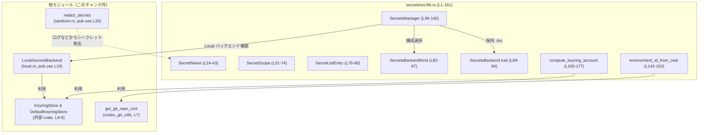
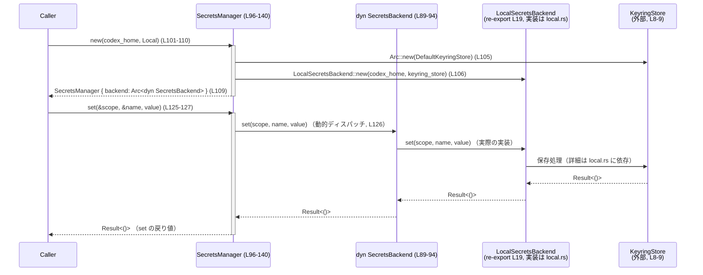

# secrets/src/lib.rs コード解説

## 0. ざっくり一言

このモジュールは、「シークレット名とスコープを表す型」「シークレットバックエンドの抽象トレイト」「バックエンド実装へのファサードである `SecretsManager`」「カレントディレクトリから環境 ID を決めるユーティリティ」など、シークレット管理の中核 API を提供するモジュールです（secrets/src/lib.rs:L16-140, L142-163）。

---

## 1. このモジュールの役割

### 1.1 概要

- このモジュールは **シークレット（API トークン等）の保存・取得・削除・列挙** を行うための抽象化レイヤーを提供します（`SecretsBackend` トレイトと `SecretsManager`）（secrets/src/lib.rs:L89-140）。
- また、シークレット名やスコープ（グローバル／環境ごと）を表現するドメイン型と、その検証ロジックを提供します（`SecretName`, `SecretScope`）（L24-80）。
- カレントディレクトリや Codex のホームディレクトリから環境 ID やキーリングアカウント名を安定的に算出するユーティリティも含みます（L142-177）。

### 1.2 アーキテクチャ内での位置づけ

このモジュールは「利用側コード」と「具体的なシークレット保存実装（ローカルバックエンドなど）」の間に位置し、実装を切り替えられるようにします。



- `LocalSecretsBackend` と `redact_secrets` の実装は別ファイル（`local.rs`, `sanitizer.rs`）にあり、このチャンクには現れません（L16-20）。
- `SecretsManager` は `Arc<dyn SecretsBackend>` を内部に保持し、どのバックエンド実装であっても同じ API で扱えるようにしています（L96-99, L101-140）。

### 1.3 設計上のポイント

- **責務分割**
  - `SecretName` / `SecretScope` などのドメイン型で入力検証を行い、バックエンド実装には妥当な値だけを渡す構造になっています（L27-43, L57-63）。
  - バックエンド固有ロジックは `SecretsBackend` トレイトの実装（例: `LocalSecretsBackend`）に閉じ込め、`SecretsManager` はファサードとして振る舞います（L89-94, L96-140）。
- **エラーハンドリング**
  - すべての公開メソッドは `anyhow::Result` を使い、`anyhow::ensure!` による入力検証で不正値を早期に `Err` として返します（L6, L27-38, L57-63）。
  - ライブラリコード内では `unwrap` / `expect` によるパニックは使用しておらず、`unwrap_or_else` や `unwrap_or` によるフォールバックでパニックを避けています（L152-162, L166-176）。
- **並行性**
  - `SecretsBackend` トレイトは `Send + Sync` 制約付きで定義されており、実装はスレッドセーフであることが前提です（L89）。
  - `SecretsManager` は内部に `Arc<dyn SecretsBackend>` を保持し `Clone` 可能なため、複数スレッドから安全に共有して利用する前提になっています（L96-99）。
- **環境 ID / アカウント名の安定性**
  - `environment_id_from_cwd` と `compute_keyring_account` は SHA-256 に基づく短いハッシュを使い、安定かつ一意性の高い識別子を生成します（L152-162, L166-176）。

---

## 2. 主要な機能一覧

- シークレット名の検証と表現（`SecretName`）（L24-43）。
- シークレットスコープ（グローバル／環境別）の表現とキー生成（`SecretScope`）（L51-74）。
- シークレット一覧エントリの表現（`SecretListEntry`）（L76-80）。
- バックエンド種別の列挙（現在は Local のみ）（`SecretsBackendKind`）（L82-87）。
- バックエンド抽象トレイト（保存・取得・削除・一覧）（`SecretsBackend`）（L89-94）。
- バックエンドに委譲するファサード（`SecretsManager`）（L96-140）。
- カレントディレクトリからの環境 ID の算出（`environment_id_from_cwd`）（L142-163）。
- Codex ホームディレクトリからキーリングアカウント名の算出（`compute_keyring_account`）（L165-177）。
- キーリングサービス名の提供（`keyring_service`）（L179-181）。
- ローカルバックエンドとシークレットの秘匿表示関数の再エクスポート（`LocalSecretsBackend`, `redact_secrets`）（L19-20）。

### 2.1 コンポーネント一覧（インベントリー）

| 名前 | 種別 | 公開範囲 | 役割 / 用途 | 定義位置 |
|------|------|----------|-------------|----------|
| `local` | モジュール | crate 内部 | ローカルバックエンド実装を含むモジュール（中身はこのチャンクには現れない） | secrets/src/lib.rs:L16 |
| `sanitizer` | モジュール | crate 内部 | シークレットのマスキング機能を含むモジュール（中身はこのチャンクには現れない） | secrets/src/lib.rs:L17 |
| `LocalSecretsBackend` | 型（`SecretsBackend` 実装） | `pub use` で公開 | ローカルバックエンド。`LocalSecretsBackend::new(codex_home, keyring_store)` の戻り値が `Arc<dyn SecretsBackend>` に格納されることから、`SecretsBackend` を実装していることが分かります（L101-107, L117-120）。詳細な実装はこのチャンクには現れません。 | secrets/src/lib.rs:L19 |
| `redact_secrets` | 関数（詳細不明） | `pub use` で公開 | ログ等からシークレットをマスキングする関数と推測されますが、実装はこのチャンクには現れません。 | secrets/src/lib.rs:L20 |
| `KEYRING_SERVICE` | 定数 | モジュール内（`pub(crate) fn` 経由） | キーリングで使用するサービス名 `"codex"` を保持 | secrets/src/lib.rs:L22, L179-181 |
| `SecretName` | 構造体 | 公開 | シークレット名を保持し、文字種制約を保証するドメイン型 | secrets/src/lib.rs:L24-25 |
| `SecretName::new` | 関数（関連関数） | 公開 | 文字列から `SecretName` を生成し、空でないこと・許可された文字のみで構成されることを検証 | secrets/src/lib.rs:L27-38 |
| `SecretName::as_str` | メソッド | 公開 | 内部の文字列スライスを返す | secrets/src/lib.rs:L40-42 |
| `fmt::Display for SecretName` | トレイト実装 | 公開 | `SecretName` をそのまま文字列として表示可能にする | secrets/src/lib.rs:L45-48 |
| `SecretScope` | enum | 公開 | シークレットのスコープ（`Global` または `Environment(String)`） | secrets/src/lib.rs:L51-55 |
| `SecretScope::environment` | 関数（関連関数） | 公開 | 環境 ID 文字列から `Environment` スコープを生成し、空文字を禁止する | secrets/src/lib.rs:L57-63 |
| `SecretScope::canonical_key` | メソッド | 公開 | バックエンドで使用する安定なキー文字列（`global/...`, `env/{id}/...`）を生成 | secrets/src/lib.rs:L65-73 |
| `SecretListEntry` | 構造体 | 公開 | `list` 結果の 1 エントリ（スコープと名前）を表す | secrets/src/lib.rs:L76-80 |
| `SecretsBackendKind` | enum | 公開（Serde/JsonSchema 対応） | バックエンド種別（現状は `Local` のみ）。設定ファイルや CLI オプションと連携しやすいようにシリアライズ可能 | secrets/src/lib.rs:L82-87 |
| `SecretsBackend` | トレイト | 公開 | シークレットの保存・取得・削除・一覧のインターフェース。`Send + Sync` 制約付き | secrets/src/lib.rs:L89-94 |
| `SecretsManager` | 構造体 | 公開 | `Arc<dyn SecretsBackend>` をラップし、利用側にシンプルな API を提供するファサード | secrets/src/lib.rs:L96-99 |
| `SecretsManager::new` | 関数 | 公開 | `codex_home` とバックエンド種別から `SecretsManager` を構築し、必要に応じて `DefaultKeyringStore` を生成 | secrets/src/lib.rs:L101-110 |
| `SecretsManager::new_with_keyring_store` | 関数 | 公開 | カスタムの `KeyringStore` 実装を注入して `SecretsManager` を構築 | secrets/src/lib.rs:L112-123 |
| `SecretsManager::set` | メソッド | 公開 | 指定スコープ＋名前のシークレット値を保存し、バックエンドに委譲 | secrets/src/lib.rs:L125-127 |
| `SecretsManager::get` | メソッド | 公開 | シークレット値を取得し、`Option<String>` で返却 | secrets/src/lib.rs:L129-131 |
| `SecretsManager::delete` | メソッド | 公開 | シークレットを削除し、実際に削除されたかどうかを `bool` で返却 | secrets/src/lib.rs:L133-135 |
| `SecretsManager::list` | メソッド | 公開 | スコープでフィルタしたシークレット一覧を返却 | secrets/src/lib.rs:L137-139 |
| `environment_id_from_cwd` | 関数 | 公開 | Git リポジトリルート名またはカレントディレクトリのハッシュから環境 ID を生成 | secrets/src/lib.rs:L142-163 |
| `compute_keyring_account` | 関数 | `pub(crate)` | `codex_home` パスのハッシュからキーリングアカウント名を生成 | secrets/src/lib.rs:L165-177 |
| `keyring_service` | 関数 | `pub(crate)` | キーリングサービス名 `"codex"` を返す | secrets/src/lib.rs:L179-181 |
| `tests` モジュール | モジュール | テストのみ | 動作検証用のユニットテストを保持 | secrets/src/lib.rs:L183-229 |
| `environment_id_fallback_has_cwd_prefix` | テスト関数 | テストのみ | `environment_id_from_cwd` のハッシュフォールバックを検証 | secrets/src/lib.rs:L189-205 |
| `manager_round_trips_local_backend` | テスト関数 | テストのみ | `SecretsManager` と `LocalSecretsBackend` の基本的な CRUD 動作を検証 | secrets/src/lib.rs:L207-229 |

---

## 3. 公開 API と詳細解説

### 3.1 型一覧

| 名前 | 種別 | 役割 / 用途 | 主な関連関数 / メソッド |
|------|------|-------------|--------------------------|
| `SecretName` | 構造体 | シークレット名を保持し、厳格な文字種制約を保証する（A-Z, 0-9, `_` のみ）（L24-38） | `new`, `as_str`, `Display` |
| `SecretScope` | enum | シークレットのスコープ（グローバル／環境別）を表現（L51-55） | `environment`, `canonical_key` |
| `SecretListEntry` | 構造体 | 一覧 API の 1エントリ（スコープ＋名前）（L76-80） | - |
| `SecretsBackendKind` | enum | 利用するバックエンド種別（現在は `Local` のみ）（L82-87） | Serde/JsonSchema シリアライズ対象 |
| `SecretsBackend` | トレイト | バックエンド実装のためのインターフェース（L89-94） | `set`, `get`, `delete`, `list` |
| `SecretsManager` | 構造体 | バックエンドを隠蔽し、利用側に簡潔な API を提供（L96-140） | `new`, `new_with_keyring_store`, `set`, `get`, `delete`, `list` |

### 3.2 関数詳細（代表 7 件）

#### `SecretName::new(raw: &str) -> Result<SecretName>`

**概要**

- シークレット名文字列から `SecretName` を生成するコンストラクタです。
- 前後の空白をトリムし、空文字でないこと、および ASCII 大文字 (`A-Z`), 数字 (`0-9`), アンダースコア (`_`) のみで構成されていることを検証します（secrets/src/lib.rs:L27-38）。

**引数**

| 引数名 | 型 | 説明 |
|--------|----|------|
| `raw` | `&str` | 入力シークレット名文字列。前後の空白は無視されます。 |

**戻り値**

- `Ok(SecretName)`：制約を満たす名前の場合。
- `Err(anyhow::Error)`：空文字や不正な文字を含む場合。

**内部処理の流れ**

1. `raw.trim()` で前後の空白を除去して `trimmed` を生成（L29）。
2. `anyhow::ensure!(!trimmed.is_empty(), "...")` により、空文字であれば `Err` を返却（L30）。
3. `trimmed.chars().all(...)` で各文字が `is_ascii_uppercase` または `is_ascii_digit` または `'_'` であることを検証し、条件を満たさない場合は `Err` を返却（L31-35）。
4. すべての条件を満たす場合は `SecretName(trimmed.to_string())` を包んだ `Ok` を返却（L37）。

**Examples（使用例）**

正常系:

```rust
use anyhow::Result;                               // anyhow::Result 型をインポート
use secrets::SecretName;                          // SecretName 型をインポート（crate 名は仮）

fn main() -> Result<()> {                         // エラーを返せる main 関数
    let name = SecretName::new(" GITHUB_TOKEN ")?; // 前後の空白はトリムされ、有効な名前として受理される
    println!("{}", name);                         // "GITHUB_TOKEN" が表示される（Display 実装, L45-48）
    Ok(())                                        // 正常終了
}
```

エラー例:

```rust
use secrets::SecretName;                          // SecretName 型をインポート

fn main() {
    let invalid = SecretName::new("github-token"); // 小文字や '-' を含むため Err になる
    assert!(invalid.is_err());                    // エラーであることを確認
}
```

**Errors / Panics**

- エラー条件（`Err`）:
  - `raw` が空、またはスペースのみ（`trim()` 後に空）な場合（L29-30）。
  - 許可されていない文字（小文字、記号、非 ASCII 文字など）を含む場合（L31-35）。
- この関数自体はパニックを起こしません（`unwrap` 等を使用していない）。

**Edge cases（エッジケース）**

- `"  "`（空白のみ）→ `trim()` により空となり `Err`（L29-30）。
- `"API__KEY__1"` のようなアンダースコアや数字を含む名は許可されます（L31-35）。
- 非 ASCII 文字（例: `"トークン"` や `"Å"`）は `is_ascii_*` が `false` となるためエラーになります。
- 末尾/先頭の改行やタブも `trim()` で除去されます。

**使用上の注意点**

- 利用側コードは `SecretName::new` の `Result` を必ず処理する必要があります。`?` 演算子で伝播するのが一般的です。
- シークレット名の形式制約はこの型に集約されているため、「どの文字が使えるか」を変更するときはここを変更することになります。

---

#### `SecretScope::environment(environment_id: impl Into<String>) -> Result<SecretScope>`

**概要**

- 任意の文字列から `Environment` スコープを生成するユーティリティです。
- 環境 ID が空（空白を除く）でないことのみを検証します（secrets/src/lib.rs:L57-63）。

**引数**

| 引数名 | 型 | 説明 |
|--------|----|------|
| `environment_id` | `impl Into<String>` | 環境 ID 候補。`String` や `&str` などから生成可能。 |

**戻り値**

- `Ok(SecretScope::Environment(String))`：トリム後に空でない場合。
- `Err(anyhow::Error)`：トリム後に空である場合。

**内部処理の流れ**

1. `environment_id.into()` で `String` に変換（L59）。
2. `trim()` で前後の空白を除去した `trimmed` を作成（L60）。
3. `anyhow::ensure!(!trimmed.is_empty(), "...")` で空を拒否（L61）。
4. `SecretScope::Environment(trimmed.to_string())` を `Ok` で返却（L62）。

**Examples（使用例）**

```rust
use anyhow::Result;                                       // anyhow::Result 型
use secrets::SecretScope;                                 // SecretScope 型

fn main() -> Result<()> {
    let scope = SecretScope::environment(" dev ")?;       // トリムされ "dev" になる
    // scope は SecretScope::Environment("dev".to_string()) になる
    Ok(())
}
```

**Errors / Panics**

- エラー条件:
  - 入力が空文字、あるいは空白のみの場合（L60-61）。
- 文字種についての制約はここでは行われません。
- パニックを起こすコードは含まれていません。

**Edge cases（エッジケース）**

- `"   "` → `Err`。
- `"dev/prod"` や `"dev\n"` のような文字列も、空でない限りそのまま受理されます（文字種制限なし）。

**使用上の注意点**

- `canonical_key` が環境 ID をそのまま文字列に埋め込むため（後述）、環境 ID にどのような文字を許可するかはバックエンドの実装と合わせて検討する必要があります。
- この関数は空チェックのみを行うため、「スラッシュを禁止したい」などの要件がある場合は、別途検証を追加する必要があります。

---

#### `SecretScope::canonical_key(&self, name: &SecretName) -> String`

**概要**

- バックエンドが内部で使用する「安定したキー文字列」を生成します。
- グローバルスコープでは `"global/{NAME}"`、環境スコープでは `"env/{ENV_ID}/{NAME}"` という形式です（secrets/src/lib.rs:L65-73）。

**引数**

| 引数名 | 型 | 説明 |
|--------|----|------|
| `self` | `&SecretScope` | 対象スコープ（`Global` または `Environment`） |
| `name` | `&SecretName` | シークレット名 |

**戻り値**

- `String`：`"global/..."` または `"env/.../..."` 形式のキー。

**内部処理の流れ**

1. `match self` でスコープのバリアントを分岐（L67）。
2. `Global` の場合: `format!("global/{}", name.as_str())` を返却（L68）。
3. `Environment(environment_id)` の場合:
   - `format!("env/{environment_id}/{}", name.as_str())` を返却（L69-71）。

**Examples（使用例）**

```rust
use anyhow::Result;                              // anyhow::Result 型
use secrets::{SecretName, SecretScope};         // 型をインポート

fn main() -> Result<()> {
    let name = SecretName::new("API_KEY")?;     // 有効な SecretName を作成
    let global = SecretScope::Global;           // グローバルスコープ
    let env = SecretScope::environment("dev")?; // 環境スコープ "dev"

    assert_eq!(global.canonical_key(&name), "global/API_KEY"); // Global のキー
    assert_eq!(env.canonical_key(&name), "env/dev/API_KEY");   // Environment のキー
    Ok(())
}
```

**Errors / Panics**

- この関数自体は `Result` を返さず、パニックも発生しません。
- `name` は `SecretName::new` で事前に検証される前提です。

**Edge cases（エッジケース）**

- `Environment` の `environment_id` が空文字になることは `environment()` で防がれていますが、`Environment(String)` を直接構築した場合は、空文字や任意の文字列も保持可能です（コンストラクタ経由でない場合）。その場合もこの関数は文字列をそのまま使用します。
- `environment_id` に `/` が含まれている場合、キー文字列中に追加のスラッシュが含まれます（例: `"env/foo/bar/API_KEY"`）。これが許容されるかどうかはバックエンド実装の前提に依存し、このチャンクからは判断できません。

**使用上の注意点**

- ファイルパスやキーリングキーなどにこの文字列を直接使うバックエンドでは、`environment_id` によるディレクトリ階層やキー衝突の可能性を考慮する必要があります。
- `SecretScope` を外部から構築する際は、`SecretScope::environment` を通すことで少なくとも空文字は排除できます。

---

#### `SecretsManager::new(codex_home: PathBuf, backend_kind: SecretsBackendKind) -> SecretsManager`

**概要**

- 指定されたバックエンド種別に基づいて適切な `SecretsBackend` 実装を構築し、それを内部に保持する `SecretsManager` を生成します（secrets/src/lib.rs:L101-110）。
- 現在は `SecretsBackendKind::Local` のみをサポートし、その場合 `DefaultKeyringStore` を用いて `LocalSecretsBackend` を生成します。

**引数**

| 引数名 | 型 | 説明 |
|--------|----|------|
| `codex_home` | `PathBuf` | Codex のホームディレクトリパス。ローカルバックエンドのストレージルートとして使用されると推測されます。 |
| `backend_kind` | `SecretsBackendKind` | 利用するバックエンド種別（現状 `Local` のみ）。 |

**戻り値**

- 新しく構築された `SecretsManager` インスタンス。

**内部処理の流れ**

1. `backend_kind` を `match` で分岐（L103）。
2. `SecretsBackendKind::Local` の場合:
   - `let keyring_store: Arc<dyn KeyringStore> = Arc::new(DefaultKeyringStore);` でデフォルトのキーリングストアを生成（L105）。
   - `LocalSecretsBackend::new(codex_home, keyring_store)` を呼び出してバックエンド実装を生成し、`Arc<dyn SecretsBackend>` に格納（L106）。
3. 生成した `backend` をフィールドに持つ `SecretsManager { backend }` を返却（L109）。

**Examples（使用例）**

```rust
use anyhow::Result;                                           // anyhow::Result 型
use std::path::PathBuf;                                       // PathBuf 型
use secrets::{SecretsBackendKind, SecretsManager, SecretScope, SecretName};

fn main() -> Result<()> {
    let codex_home = PathBuf::from("/path/to/codex_home");    // Codex ホームディレクトリ
    let manager = SecretsManager::new(codex_home, SecretsBackendKind::Local); // Local バックエンドで初期化

    let scope = SecretScope::Global;                          // グローバルスコープ
    let name = SecretName::new("GITHUB_TOKEN")?;              // シークレット名
    manager.set(&scope, &name, "token-1")?;                   // シークレットを保存
    Ok(())
}
```

**Errors / Panics**

- この関数自体は `Result` ではなく `Self` を返し、内部でも `unwrap` / `expect` を使用していません。
- したがって、引数が不正であってもここで直接エラーにはなりません（実際の I/O エラー等はバックエンド操作時に発生すると考えられますが、このチャンクからは詳細不明です）。

**Edge cases（エッジケース）**

- 未知の `SecretsBackendKind` バリアントが追加された場合は、`match` に追加が必要です。コンパイル時に exhaustiveness チェックで検出されます（L103-108）。
- `codex_home` が存在しないディレクトリでも、この関数時点ではチェックされません。

**使用上の注意点**

- 外部からキーリングストア実装を注入したい場合は、`new_with_keyring_store` を使用します（L112-123）。
- バックエンドの選択ロジックを追加する場合（例: クラウドバックエンド）、`SecretsBackendKind` と `SecretsManager::new` の `match` を合わせて拡張する必要があります。

---

#### `SecretsManager::set(&self, scope: &SecretScope, name: &SecretName, value: &str) -> Result<()>`

**概要**

- 指定されたスコープと名前でシークレット値を保存する高レベル API です。
- 実際の保存処理は内部の `backend: Arc<dyn SecretsBackend>` に委譲されます（secrets/src/lib.rs:L125-127）。

**引数**

| 引数名 | 型 | 説明 |
|--------|----|------|
| `self` | `&SecretsManager` | 共有されたマネージャインスタンス。`Clone` して複数箇所から使えます。 |
| `scope` | `&SecretScope` | グローバルまたは環境スコープ。 |
| `name` | `&SecretName` | 検証済みシークレット名。 |
| `value` | `&str` | 保存するシークレット値（プレーンテキスト）。 |

**戻り値**

- `Ok(())`：保存に成功した場合。
- `Err(anyhow::Error)`：バックエンドからのエラーが発生した場合（理由はバックエンドによる）。

**内部処理の流れ**

1. `self.backend.set(scope, name, value)` を呼び出し、その `Result<()>` をそのまま返却（L126）。

**Examples（使用例）**

```rust
use anyhow::Result;                                   // anyhow::Result 型
use std::path::PathBuf;                               // PathBuf 型
use secrets::{SecretsBackendKind, SecretsManager, SecretScope, SecretName};

fn main() -> Result<()> {
    let manager = SecretsManager::new(PathBuf::from("/tmp/codex"), SecretsBackendKind::Local); // マネージャ構築
    let scope = SecretScope::Global;                         // グローバルスコープ
    let name = SecretName::new("API_TOKEN")?;                // シークレット名
    manager.set(&scope, &name, "secret-value")?;             // 値を保存
    Ok(())
}
```

**Errors / Panics**

- `Err` になる条件はバックエンド実装に依存します。
  - 例として考えられるのは、ファイル書き込みエラー、キーリングへのアクセス権限不足などですが、これはこのチャンクには現れません。
- このメソッド内ではパニックを起こす API は呼び出していません。

**Edge cases（エッジケース）**

- 同じスコープ＋名前に対して再度 `set` した場合の挙動（上書き vs エラー）はバックエンド依存であり、このチャンクからは不明です。
- `value` が空文字でも特に検証は行われず、そのままバックエンドに渡されます。

**使用上の注意点**

- セキュリティ上、値をログに出力したり、誤って標準出力に表示したりしないようにする必要があります。`redact_secrets` のような関数（L20）と併用することが想定されますが、詳細は sanitizer モジュール側に依存します。
- 複数スレッドから同じ `SecretsManager` を共有して `set` を呼び出すことは可能ですが、整合性やロック戦略はバックエンド実装側の責務です（`SecretsBackend: Send + Sync` 制約, L89）。

---

#### `SecretsManager::list(&self, scope_filter: Option<&SecretScope>) -> Result<Vec<SecretListEntry>>`

**概要**

- バックエンドに保存されているシークレットの一覧を取得します。
- スコープでフィルタすることができ、フィルタが `None` の場合はすべてのスコープが対象になります（secrets/src/lib.rs:L137-139）。

**引数**

| 引数名 | 型 | 説明 |
|--------|----|------|
| `scope_filter` | `Option<&SecretScope>` | `Some(scope)` の場合そのスコープのシークレットのみ、`None` の場合は全スコープ。 |

**戻り値**

- `Ok(Vec<SecretListEntry>)`：一覧取得成功の場合。
- `Err(anyhow::Error)`：バックエンドからのエラーが発生した場合。

**内部処理の流れ**

1. `self.backend.list(scope_filter)` を呼び出し、その結果をそのまま返却（L138）。

**Examples（使用例）**

```rust
use anyhow::Result;                                  // anyhow::Result 型
use std::path::PathBuf;                              // PathBuf 型
use secrets::{SecretsBackendKind, SecretsManager, SecretScope, SecretName};

fn main() -> Result<()> {
    let manager = SecretsManager::new(PathBuf::from("/tmp/codex"), SecretsBackendKind::Local); // マネージャ構築
    let scope = SecretScope::Global;                        // グローバルスコープ
    let name = SecretName::new("GITHUB_TOKEN")?;            // シークレット名
    manager.set(&scope, &name, "token-1")?;                 // 値を保存

    let listed = manager.list(None)?;                       // すべてのスコープから一覧取得
    assert_eq!(listed.len(), 1);                            // 1 件だけ登録されている想定
    Ok(())
}
```

**Errors / Panics**

- エラー条件はバックエンド依存です（I/O エラーなど）。
- パニックを起こすコードは含まれていません。

**Edge cases（エッジケース）**

- 一致するシークレットが存在しない場合は空の `Vec` が返ると考えられますが、これはバックエンド実装の契約に依存します。テストコードでは、1件だけ登録した後に `list(None)` で `len() == 1` であることを確認しています（L219-224）。
- `scope_filter` に `Some(&SecretScope::Environment("..."))` を渡した際の一致ルールは、`SecretScope` の比較に基づきます（`PartialEq` 実装, L51 の derive ）。

**使用上の注意点**

- 戻り値が大量のシークレットを含む可能性がある場合、パフォーマンスへの影響（すべてをメモリに読み込む）に注意が必要です。現状の API ではストリーミングではなく `Vec` 全件返却です。
- 並行に `set` / `delete` が発生している場合の一貫性の保証レベルはバックエンド実装の責務です。

---

#### `environment_id_from_cwd(cwd: &Path) -> String`

**概要**

- 現在の作業ディレクトリに基づいて「環境 ID」を決定する関数です。
- Git リポジトリ内であればリポジトリルートディレクトリ名を使用し、そうでなければディレクトリパスの SHA-256 ハッシュに基づく短い ID を生成します（secrets/src/lib.rs:L142-163）。

**引数**

| 引数名 | 型 | 説明 |
|--------|----|------|
| `cwd` | `&Path` | 作業ディレクトリパス。テストでは `tempfile::tempdir()` のパスを渡しています（L191-192）。 |

**戻り値**

- `String`：環境 ID。例：`"my-repo"` または `"cwd-4f9a1b2c3d4e"` のような形式。

**内部処理の流れ**

1. `get_git_repo_root(cwd)` を呼び出し、Git リポジトリルートディレクトリのパスを `Option<PathBuf>` として取得（外部クレート、L143）。
2. `if let Some(repo_root) = ... && let Some(name) = repo_root.file_name()` による `let` チェーンで：
   - リポジトリルートが取得でき、かつそのパスにファイル名（末尾コンポーネント）がある場合にのみブロックに入る（L143-145）。
3. その場合:
   - `name.to_string_lossy().trim().to_string()` でディレクトリ名から文字列を生成し、空でなければそれを環境 ID として即座に返却（L146-149）。
4. Git リポジトリではない、またはディレクトリ名が空だった場合:
   - `cwd.canonicalize().unwrap_or_else(|_| cwd.to_path_buf())` でカノニカルパスを得る（失敗時は元のパスでフォールバック）（L152-155）。
   - パス文字列をバイト列に変換し、`Sha256::new()` → `update()` → `finalize()` で SHA-256 ハッシュを計算（L157-159）。
   - `format!("{digest:x}")` でハッシュ値を 16 進文字列に変換し、先頭 12 文字を `hex.get(..12).unwrap_or(hex.as_str())` で取り出す（L160-161）。
   - `"cwd-{short}"` という形式の文字列を返却（L162）。

**Examples（使用例）**

```rust
use std::path::Path;                                  // Path 型のインポート
use secrets::environment_id_from_cwd;                 // 関数をインポート

fn main() {
    let cwd = Path::new(".");                         // カレントディレクトリ
    let env_id = environment_id_from_cwd(cwd);        // 環境 ID を生成
    println!("environment id: {}", env_id);           // 例: "my-repo" または "cwd-xxxxxxxxxxxx" が表示される
}
```

**Errors / Panics**

- この関数は `Result` を返さず、内部でもエラーを握りつぶしてフォールバックするため、呼び出し側にエラーは伝播しません。
  - `get_git_repo_root` がエラーを返す場合でも `Option` 経由で扱われる想定です（L143）。
  - `canonicalize()` が失敗しても `unwrap_or_else` により `cwd` 自体を使用します（L152-155）。
  - `hex.get(..12)` が `None` を返す場合（理論上 SHA-256 の 16 進表現は 64 文字なので発生しませんが）、`unwrap_or` により全体文字列を使用します（L161）。
- パニックを発生させるコードは含まれていません。

**Edge cases（エッジケース）**

- Git 管理下ディレクトリ:
  - ルートディレクトリ名が `"my-repo"` の場合、環境 ID は `"my-repo"` になります（L143-149）。
  - これにより、同名のリポジトリ（例: `~/src/my-repo` と `~/work/my-repo`）は同じ環境 ID を共有することになります。これが意図された仕様かどうかは、このチャンクからは分かりません。
- Git 管理外ディレクトリ:
  - ハッシュベースの ID `"cwd-..."` が生成されます（L152-162）。テストでこの挙動が検証されています（L189-205）。
- パスにシンボリックリンクが含まれている場合:
  - `canonicalize()` によってリンクが解決されるため、論理的にはリンク先パスに基づく ID になります（ただし `canonicalize` 失敗時はリンクを解決しない元のパスベース）。

**使用上の注意点**

- この関数は I/O エラーを隠蔽してフォールバックに切り替えるため、「エラーを知りたい」という要件には直接対応しません。
- ID の形式は固定ではありますが、将来変更される可能性もあるため、外部システムとのプロトコルとして使う場合は互換性方針に注意が必要です。

---

### 3.3 その他の関数・メソッド一覧

| 関数名 / メソッド | 役割（1 行） | 定義位置 |
|-------------------|--------------|----------|
| `SecretName::as_str(&self) -> &str` | 内部の `String` への参照を返す単純なアクセサ | secrets/src/lib.rs:L40-42 |
| `fmt::Display for SecretName` | `SecretName` を内部の文字列として表示可能にする | secrets/src/lib.rs:L45-48 |
| `compute_keyring_account(codex_home: &Path) -> String` | `codex_home` のカノニカルパスの SHA-256 ハッシュを 16 文字に短縮し、`"secrets|{short}"` というキーリングアカウント名を返す | secrets/src/lib.rs:L165-177 |
| `keyring_service() -> &'static str` | キーリングサービス名 `"codex"` を返す内部ユーティリティ | secrets/src/lib.rs:L179-181 |
| `SecretsManager::new_with_keyring_store(...) -> Self` | カスタムの `Arc<dyn KeyringStore>` を使ってバックエンド実装を構築するファクトリ | secrets/src/lib.rs:L112-123 |
| `SecretsManager::get(&self, ...) -> Result<Option<String>>` | シークレットを取得し、存在しなければ `Ok(None)` を返す（と考えられる）。バックエンドに委譲 | secrets/src/lib.rs:L129-131 |
| `SecretsManager::delete(&self, ...) -> Result<bool>` | シークレット削除をバックエンドに委譲し、削除されたかどうかを `bool` で返す | secrets/src/lib.rs:L133-135 |
| `SecretsBackend::set` | バックエンドに値の保存を要求するトレイトメソッド | secrets/src/lib.rs:L90 |
| `SecretsBackend::get` | バックエンドから値の取得を要求するトレイトメソッド | secrets/src/lib.rs:L91 |
| `SecretsBackend::delete` | バックエンドに削除を要求するトレイトメソッド | secrets/src/lib.rs:L92 |
| `SecretsBackend::list` | バックエンドに一覧取得を要求するトレイトメソッド | secrets/src/lib.rs:L93 |

---

## 4. データフロー

### 4.1 `SecretsManager` を用いたシークレット保存の流れ

利用側コードが `SecretsManager` を通じてシークレットを保存するときの典型的な処理フローを示します。



- `SecretsManager` 自体は非常に薄いラッパーであり、実際のビジネスロジックや I/O は `SecretsBackend` 実装に委譲されています（secrets/src/lib.rs:L125-139）。
- 並行性については、`SecretsManager` は `Clone` で `Arc<dyn SecretsBackend>` を共有するため、異なるスレッドから同時に `set` や `get` を呼び出すことが可能です。スレッドセーフ性は `SecretsBackend: Send + Sync` の制約と実装側のロック戦略に依存します（L89, L96-99）。

---

## 5. 使い方（How to Use）

### 5.1 基本的な使用方法

`SecretsManager` を使ってシークレットを保存・取得・削除・一覧する基本フローの例です。

```rust
use anyhow::Result;                                     // anyhow::Result 型をインポート
use std::path::PathBuf;                                 // PathBuf 型
use secrets::{                                          // secrets クレートから必要な型をインポート
    SecretsBackendKind, SecretsManager,
    SecretScope, SecretName,
};

fn main() -> Result<()> {                               // エラーを返せる main
    // 1. 設定や依存オブジェクトを用意する
    let codex_home = PathBuf::from("/tmp/codex_home");  // Codex のホームディレクトリ

    // 2. SecretsManager を初期化する
    let manager = SecretsManager::new(
        codex_home,
        SecretsBackendKind::Local,                      // 現状 Local バックエンドのみ
    );

    // 3. スコープと名前を用意する
    let scope = SecretScope::Global;                    // グローバルスコープ
    let name = SecretName::new("GITHUB_TOKEN")?;        // 検証付きのシークレット名

    // 4. シークレットを保存する
    manager.set(&scope, &name, "token-1")?;             // バックエンドに保存

    // 5. シークレットを取得する
    let value = manager.get(&scope, &name)?;            // Option<String> を取得
    assert_eq!(value, Some("token-1".to_string()));     // 期待通りの値か確認

    // 6. 一覧を取得する
    let listed = manager.list(None)?;                   // すべてのスコープ対象
    assert_eq!(listed.len(), 1);                        // 1 件のみ
    assert_eq!(listed[0].name, name);                   // 名前が一致することを確認

    // 7. シークレットを削除する
    let deleted = manager.delete(&scope, &name)?;       // 削除されたかどうかが返る
    assert!(deleted);                                   // 少なくとも 1 件は削除されたはず

    Ok(())                                              // 正常終了
}
```

### 5.2 よくある使用パターン

1. **カレントディレクトリから環境 ID を決めてスコープを作る**

```rust
use anyhow::Result;                                // anyhow::Result 型
use std::path::Path;                               // Path 型
use std::path::PathBuf;                            // PathBuf 型
use secrets::{                                     // 必要な型と関数
    environment_id_from_cwd, SecretScope, SecretName,
    SecretsBackendKind, SecretsManager,
};

fn main() -> Result<()> {
    let cwd = Path::new(".");                      // カレントディレクトリ
    let env_id = environment_id_from_cwd(cwd);     // 環境 ID を算出
    let scope = SecretScope::environment(env_id)?; // Environment スコープに変換

    let manager = SecretsManager::new(
        PathBuf::from("/tmp/codex"),
        SecretsBackendKind::Local,
    );

    let name = SecretName::new("API_TOKEN")?;      // シークレット名
    manager.set(&scope, &name, "secret")?;         // 環境ごとにシークレットを保存
    Ok(())
}
```

1. **カスタム KeyringStore を注入して使う**

```rust
use anyhow::Result;                               // anyhow::Result 型
use std::path::PathBuf;                           // PathBuf 型
use std::sync::Arc;                               // Arc 型
use secrets::{                                    // SecretsManager など
    SecretsBackendKind, SecretsManager,
    SecretScope, SecretName,
};
// use codex_keyring_store::tests::MockKeyringStore; // 実際には適切な実装をインポート

fn main() -> Result<()> {
    let codex_home = PathBuf::from("/tmp/codex"); // Codex ホームディレクトリ
    // let keyring = Arc::new(MockKeyringStore::default()); // モックキーリング実装（例）
    // 実際には本番用/テスト用の KeyringStore 実装をここで選択する

    // let manager = SecretsManager::new_with_keyring_store(
    //     codex_home,
    //     SecretsBackendKind::Local,
    //     keyring,
    // );

    Ok(())                                        // この例では構築のみを示す
}
```

（`MockKeyringStore` の実際の使用例はテストコードにあります（L208-215）。）

### 5.3 よくある間違い

```rust
use secrets::{SecretsManager, SecretsBackendKind, SecretScope, SecretName};
use std::path::PathBuf;

// 間違い例: SecretName::new の Result を無視している
fn bad() {
    let name = SecretName::new("invalid-name").unwrap(); // 小文字や '-' が含まれており、unwrap でパニックする可能性がある
}

// 正しい例: Result をきちんと扱う
fn good() -> anyhow::Result<()> {
    let codex_home = PathBuf::from("/tmp/codex");        // Codex ホームディレクトリ
    let manager = SecretsManager::new(
        codex_home,
        SecretsBackendKind::Local,
    );

    let scope = SecretScope::Global;                     // グローバルスコープ
    let name = SecretName::new("VALID_NAME")?;           // 検証付きの名前生成。エラーは ? で伝播
    manager.set(&scope, &name, "value")?;                // シークレットを保存
    Ok(())                                               // 正常終了
}
```

### 5.4 使用上の注意点（まとめ）

- **入力検証**
  - シークレット名は `SecretName::new` を通して必ず検証する必要があります（L27-38）。
  - 環境 ID も `SecretScope::environment` を通すことで空文字を防げますが、文字種制限はないため、必要であれば追加の検証が必要です（L57-63）。
- **エラー処理**
  - `SecretsManager` のメソッドはすべて `anyhow::Result` を返します。`?` を使って上位に伝播するか、`match` などで適切に処理してください（L125-139）。
- **並行性**
  - `SecretsManager` は `Clone` で複数スレッドから共有可能ですが、その際の整合性やロックは `SecretsBackend` 実装に依存します（L89, L96-99）。
- **セキュリティ**
  - シークレット値 (`value`) はプレーンテキストの文字列として扱われます。ログやエラーメッセージに直接出力しないよう注意が必要です。
  - `compute_keyring_account` はパスをハッシュ化し、キーリングアカウント名に直のパスが含まれないようにしています（L165-177）。

---

## 6. 変更の仕方（How to Modify）

### 6.1 新しい機能を追加する場合

1. **新しいバックエンドを追加したい場合**
   - `SecretsBackendKind` に新しいバリアントを追加します（例: `Cloud`）（secrets/src/lib.rs:L82-87）。
   - 新しいバックエンド実装（例: `CloudSecretsBackend`）を別モジュール（`cloud.rs` など）に定義し、`SecretsBackend` トレイトを実装します（L89-94）。
   - `SecretsManager::new` と `new_with_keyring_store` の `match backend_kind` に新しいバリアントの処理を追加し、適切なコンストラクタを呼び出します（L103-108, L117-121）。
   - 必要に応じて `pub use cloud::CloudSecretsBackend;` を追加して公開します（L19-20 を参考）。

2. **環境 ID 生成ロジックを拡張したい場合**
   - `environment_id_from_cwd` 内の Git ベース判定やハッシュ生成部分を修正します（L142-163）。
   - 変更が既存環境 ID に与える影響（後方互換性）を検討し、必要であればバージョニングやマイグレーションの方針を決めます。
   - テスト `environment_id_fallback_has_cwd_prefix` を更新・追加して、新しい仕様に合致することを確認します（L189-205）。

### 6.2 既存の機能を変更する場合

- **影響範囲の確認**
  - 変更対象の型やメソッドがどこから呼ばれているかを IDE などで参照し、影響範囲を把握します。
  - 特に `SecretName` や `SecretScope` のようなドメイン型を変更する場合、バックエンド実装（`local.rs`）や他モジュール（`sanitizer.rs` など）への影響も考慮が必要です。

- **契約の維持**
  - `SecretName::new` の文字種制約や `SecretScope::environment` の空文字禁止などは、外部コードにとって暗黙の契約になっています（L27-38, L57-63）。
  - これらを変更する場合、利用側コードが想定している挙動とずれないか（あるいはマイグレーションが必要か）を確認する必要があります。

- **テストの更新**
  - `environment_id_from_cwd` や `SecretsManager` の挙動を確認するテストがすでに存在します（L189-205, L207-229）。
  - 挙動を変更した場合は、該当テストの期待値を更新するか、必要に応じて新たなテストケースを追加します。

---

## 7. 関連ファイル

| パス | 役割 / 関係 |
|------|------------|
| `secrets/src/local.rs`（推定） | `mod local;` および `pub use local::LocalSecretsBackend;` から、ローカルシークレットバックエンド (`LocalSecretsBackend`) の実装を含むファイルと考えられますが、このチャンクには内容は現れません（secrets/src/lib.rs:L16, L19）。 |
| `secrets/src/sanitizer.rs`（推定） | `mod sanitizer;` および `pub use sanitizer::redact_secrets;` から、ログなどからシークレット値をマスクする `redact_secrets` 関数の実装を含むファイルと考えられます（secrets/src/lib.rs:L17, L20）。詳細はこのチャンクには現れません。 |
| `codex_keyring_store` クレート | `DefaultKeyringStore` と `KeyringStore` トレイトを提供し、ローカルバックエンドが OS のキーリングを扱うために利用されます（secrets/src/lib.rs:L8-9, L101-107, L112-120）。 |
| `codex_git_utils` クレート | `get_git_repo_root` 関数を提供し、`environment_id_from_cwd` が Git リポジトリのルートディレクトリ名を環境 ID に利用するために使用します（secrets/src/lib.rs:L7, L142-145）。 |
| `tests` モジュール（同ファイル内） | `environment_id_from_cwd` のハッシュフォールバックと `SecretsManager`＋`LocalSecretsBackend` のラウンドトリップ動作を検証するユニットテストを含みます（secrets/src/lib.rs:L183-229）。 |

---

### Bugs / Security に関する補足（このチャンクから読み取れる範囲）

- **明示的なバグは確認できません**。
  - ライブラリコード内での `unwrap` / `expect` 使用はなく、I/O などのエラーは `Result` で扱うか安全なフォールバックで処理しています（L152-162, L166-176）。
- **セキュリティ上のポイント**
  - シークレット名に許可される文字を強く制限しているため、ログやパスの一部として扱ったときの安全性が高くなります（L27-38）。
  - キーリングアカウント名は `codex_home` のパスを直接含まず、ハッシュされた短い文字列を使用しているため、キーリングエントリ名からディレクトリ構成が推測されにくくなっています（L165-177）。
  - 一方で、`SecretScope::Environment(String)` は文字種制限を設けておらず、`canonical_key` でそのまま文字列に埋め込まれます（L65-73）。バックエンドがこのキーをファイルパスとして使用する場合、`environment_id` に `/` や `..` などを含めるかどうかは実装側の検証に依存します。この点は注意が必要ですが、このチャンクだけからは危険かどうかを断定できません。
