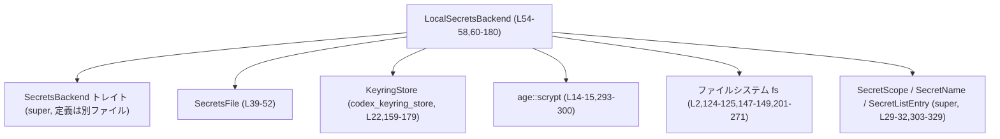
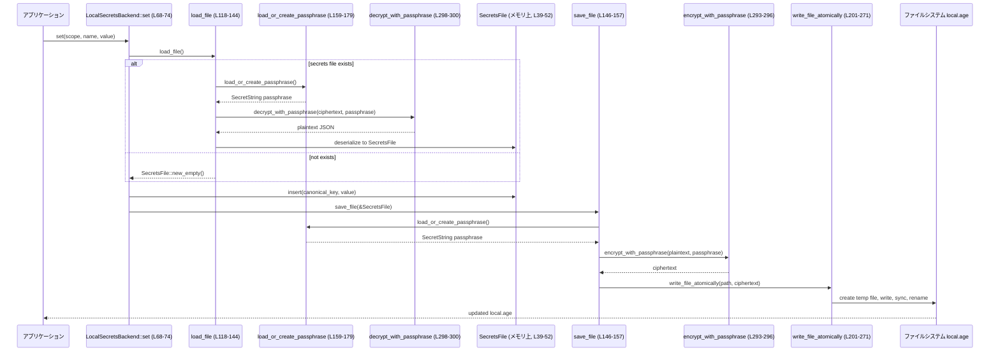

# secrets/src/local.rs

## 0. ざっくり一言

`LocalSecretsBackend` を実装し、ローカルファイル `secrets/local.age` に **age + scrypt** で暗号化したシークレットを保存するバックエンド機能を提供するモジュールです。暗号鍵は OS のキーチェーン（`KeyringStore`）に保存されたランダムなパスフレーズから取得します（`secrets/src/local.rs:L36-37,54-58,159-179,273-282`）。

---

## 1. このモジュールの役割

### 1.1 概要

- このモジュールは、CLI/アプリケーション用の **シークレット管理** を行うローカルバックエンドです。
- シークレットは JSON 形式の `SecretsFile` としてシリアライズされ、ファイル `local.age` に暗号化保存されます（`L36-37,39-43,146-153`）。
- 暗号化・復号には `age::scrypt` を使い、パスフレーズは OS キーリングから取得・生成されます（`L14-17,159-179,293-300`）。
- `SecretsBackend` トレイトを実装し、`set/get/delete/list` の基本操作を提供します（`L183-199`）。

### 1.2 アーキテクチャ内での位置づけ

主なコンポーネントと依存関係は以下の通りです。

- `LocalSecretsBackend`: このモジュールの中心。ファイル I/O・暗号化・キーリングを統合（`L54-58,60-180,183-199`）。
- `SecretsFile`: ファイルに保存される JSON データ構造（`L39-43`）。
- `KeyringStore`: 外部クレート（`codex_keyring_store`）が提供する OS キーリング抽象（`L22,54-58,159-179`）。
- `age::scrypt`: パスフレーズベース暗号化/復号（`L14-15,293-300`）。
- ファイルシステム: シークレットファイル保存 & 一時ファイルを用いたアトミック書き込み（`L110-117,146-157,201-271`）。

これを Mermaid の依存関係図で表すと次のようになります。



### 1.3 設計上のポイント

コードから読み取れる主な設計方針です。

- **責務分割**
  - ファイルフォーマットと in-memory 表現を `SecretsFile` に分離（`L39-52`）。
  - バックエンド API (`set/get/delete/list`) を `LocalSecretsBackend` のパブリックメソッドとして提供し、内部 I/O/暗号化は非公開メソッドに切り出し（`L60-180`）。
  - ファイルへのアトミック書き込みを `write_file_atomically` に切り出し（`L201-271`）。
  - 暗号鍵の生成・ゼロ化・暗号化処理を `generate_passphrase` / `wipe_bytes` / `encrypt_with_passphrase` / `decrypt_with_passphrase` に分解（`L273-301`）。

- **バージョン管理**
  - シークレットファイルのスキーマバージョン `SECRETS_VERSION` を定数で定義し（`L36`）、`load_file` で将来のバージョンを拒否（`L134-142`）。
  - `version == 0` の場合は現在のバージョンに補正（後方互換対応）（`L134-136`）。

- **安全性（セキュリティ & メモリ）**
  - 暗号鍵は `SecretString` で管理し（`L17,159-179,273-282`）、生成時の生バイト配列は `wipe_bytes` で揮発書き込み + コンパイラフェンスにより上書き（`L273-281,284-291`）。
  - シークレット値は空文字列を禁止（`set` の `ensure!`、`L68-69`）。
  - ファイル書き込みは一時ファイル + `rename` によるアトミック更新を行い、書き込み途中の壊れたファイルが残らないようにしています（`L201-271`）。
  - 不正な canonical key を `list` で検出した際は `warn!` ログを出してスキップ（`L92-107,97`）。

- **エラーハンドリング**
  - `anyhow::Result` と `Context` を一貫して利用し、エラーに位置情報や文脈メッセージを追加（`L18-19,124-126,147-149,161-166,201-207,221-226,227-235,262-268`）。
  - キーリング操作はエラーを一度メッセージに変換して `anyhow` エラーに包み直す（`L161-165,173-176`）。

- **並行性**
  - `KeyringStore` は `Arc<dyn KeyringStore>` で共有可能にしていますが（`L54-58`）、ファイルアクセスにはロック等はありません。したがって、**同一ファイルに対する並行書き込み調停は呼び出し側に委ねられている**と考えられます（コード上ロック実装は存在しません）。
  - メモリ消去関数 `wipe_bytes` で `compiler_fence(Ordering::SeqCst)` を使い、コンパイラによる命令並び替えを抑制しています（`L284-291`）。これはメモリモデルを意識した設計です。

---

## 2. 主要な機能一覧

このモジュールが提供する主な機能です。

- シークレットの保存: `LocalSecretsBackend::set` でスコープ付き名前に対応する値を暗号化ファイルに保存（`L68-74`）。
- シークレットの取得: `LocalSecretsBackend::get` で暗号化ファイルから値を復号・読み出し（`L76-80`）。
- シークレットの削除: `LocalSecretsBackend::delete` でエントリを削除し、必要に応じてファイルを更新（`L82-90`）。
- シークレットの一覧: `LocalSecretsBackend::list` でスコープフィルタ付きの一覧取得（`L92-108,303-329`）。
- シークレットファイルの読み込み・バージョン検証・復号: `load_file`（`L118-144`）。
- シークレットファイルの暗号化保存: `save_file`（`L146-157,201-271`）。
- キーリングからのパスフレーズ取得・生成: `load_or_create_passphrase` & `generate_passphrase`（`L159-179,273-282`）。
- パスフレーズのメモリ消去: `wipe_bytes`（`L284-291`）。
- canonical key 文字列のパースとスコープ/名前への変換: `parse_canonical_key`（`L303-329`）。

---

## 3. 公開 API と詳細解説

### 3.1 型一覧（構造体・列挙体など）

| 名前 | 種別 | 役割 / 用途 | 定義位置 |
|------|------|-------------|----------|
| `SecretsFile` | 構造体 | シークレットファイルの JSON シリアライズ対象。バージョンと `BTreeMap<canonical_key, value>` を保持 | `secrets/src/local.rs:L39-43` |
| `LocalSecretsBackend` | 構造体 | ローカルファイル + OS キーリングを使ってシークレットを管理するバックエンド実装 | `secrets/src/local.rs:L54-58` |

※ `SecretScope`, `SecretName`, `SecretListEntry`, `SecretsBackend` は親モジュールからインポートされる型で、このファイル内では定義されていません（`L29-32`）。

### 3.2 関数詳細（主要 7 件）

#### `LocalSecretsBackend::set(&self, scope: &SecretScope, name: &SecretName, value: &str) -> Result<()>`

**概要**

スコープ + 名前で指定されたシークレット値を暗号化ファイルに保存します。空文字列は拒否します（`L68-74`）。

**引数**

| 引数名 | 型 | 説明 |
|--------|----|------|
| `scope` | `&SecretScope` | シークレットのスコープ（グローバル / 環境など）。canonical key の生成に利用（`L68-71`）。 |
| `name`  | `&SecretName`  | シークレット名。`scope.canonical_key` の入力（`L68-71`）。 |
| `value` | `&str`         | 保存するシークレット値。空は禁止（`L68-69`）。 |

**戻り値**

- `Result<()>`: 正常完了で `Ok(())`。ファイル読み書き・暗号化・キーリングなどで問題が起きた場合はエラーになります（`L71-73,118-144,146-157,159-179,293-300`）。

**内部処理の流れ**

1. `anyhow::ensure!` で `value` が空でないことを検証（`L68-69`）。
2. `scope.canonical_key(name)` を呼び出して canonical key 文字列（例: `"global/TEST_SECRET"`）を生成（`L70`）。
3. `self.load_file()` で現在のシークレットファイルを復号・読み込み（`L71,118-144`）。
4. `file.secrets.insert(canonical_key, value.to_string())` でマップを更新（`L72`）。
5. `self.save_file(&file)` で更新されたファイル全体を再度暗号化してアトミック書き込み（`L73,146-157`）。

**Examples（使用例）**

グローバルスコープにシークレットを保存する例です。

```rust
use std::sync::Arc;
use std::path::PathBuf;
use codex_keyring_store::KeyringStore; // 実際には具体型を使用
use secrets::local::LocalSecretsBackend;
use secrets::{SecretScope, SecretName}; // 親モジュールからの re-export を想定

fn save_example_secret(backend: &LocalSecretsBackend) -> anyhow::Result<()> {
    // グローバルスコープを取得（super モジュールの定義に依存）
    let scope = SecretScope::Global;
    // SecretName::new は名前のバリデーションを行うコンストラクタ
    let name = SecretName::new("API_TOKEN")?;
    // 空文字列はエラーになる点に注意
    backend.set(&scope, &name, "super-secret-token")?;
    Ok(())
}
```

**Errors / Panics**

- 空文字列 `""` を渡すと `ensure!` により `Err` が返ります（panic ではなく `Result` エラー）（`L68-69`）。
- `load_file` 内部で発生しうるエラー:
  - ファイル読み取り失敗（`fs::read`）（`L124-126`）。
  - キーリングからのパスフレーズ読み込み失敗（`load_or_create_passphrase`）（`L159-179`）。
  - `age` 復号失敗（`decrypt_with_passphrase`）（`L127-128,298-300`）。
  - JSON デシリアライズ失敗（`serde_json::from_slice`）（`L128-133`）。
  - 将来のバージョン（`parsed.version > SECRETS_VERSION`）のファイルは `ensure!` でエラー（`L137-142`）。
- `save_file` 内部で発生しうるエラー:
  - ディレクトリ作成失敗（`fs::create_dir_all`）（`L147-149`）。
  - キーリング操作・暗号化・ファイル書き込み・リネームの失敗（`L151-157,201-271`）。

**Edge cases（エッジケース）**

- シークレットファイルが存在しない場合:
  - `load_file` は `SecretsFile::new_empty()` を返し、`set` は新規ファイルとして書き込みます（`L119-122,45-52`）。
- 同一キーに対して複数回 `set`:
  - `BTreeMap::insert` により値は上書きされます（`L72`）。
- 空文字列:
  - 前述の通り `Err("secret value must not be empty")` になります（`L68-69`）。

**使用上の注意点**

- 一度保存された値は平文ではなく暗号化されますが、**呼び出し側は平文の値を `&str` として扱うため、ログに出さない・共有しないといった配慮が必要**です。
- ファイルレベルの排他制御は行われていないため、同一 `codex_home` を複数プロセスから同時に書き換える場合は、整合性は「最後に成功した書き込みが反映される」挙動になります（`L201-271`）。

---

#### `LocalSecretsBackend::get(&self, scope: &SecretScope, name: &SecretName) -> Result<Option<String>>`

**概要**

指定されたスコープ & 名前のシークレット値を取得します。存在しない場合は `Ok(None)` を返します（`L76-80`）。

**引数 / 戻り値**

| 引数名 | 型 | 説明 |
|--------|----|------|
| `scope` | `&SecretScope` | 対象スコープ（`L76-79`）。 |
| `name`  | `&SecretName`  | シークレット名。 |

戻り値:

- `Result<Option<String>>`:
  - `Ok(Some(value))`: 見つかった場合。
  - `Ok(None)`: シークレットファイルにキーが存在しない場合。
  - `Err(_)`: ファイル I/O/復号/キーリング/バージョンエラーなど（`load_file` と同じ、`L118-144`）。

**内部処理の流れ**

1. `scope.canonical_key(name)` でキー文字列生成（`L77`）。
2. `self.load_file()?` でファイルを読み込み（`L78`）。
3. `file.secrets.get(&canonical_key).cloned()` で値をクローンし `Option<String>` として返却（`L79`）。

**Examples**

```rust
fn read_example_secret(backend: &LocalSecretsBackend) -> anyhow::Result<()> {
    let scope = SecretScope::Global;
    let name = SecretName::new("API_TOKEN")?;
    match backend.get(&scope, &name)? {
        Some(token) => {
            // token は String （所有権を持つ文字列）として得られる
            println!("Token length: {}", token.len());
        }
        None => {
            println!("Token is not set");
        }
    }
    Ok(())
}
```

**Edge cases / 注意点**

- ファイルが存在しない場合も `load_file` が空の `SecretsFile` を返すため、結果は `Ok(None)` になります（`L119-122`）。
- 将来バージョンのファイルだと `load_file` がエラーとなり、`get` もエラーになります（`L137-142`）。

---

#### `LocalSecretsBackend::delete(&self, scope: &SecretScope, name: &SecretName) -> Result<bool>`

**概要**

指定されたシークレットが存在すれば削除し、**削除したかどうか** を `bool` で返します（`L82-90`）。

**戻り値**

- `Ok(true)`: キーが存在し削除した。
- `Ok(false)`: キーが存在しなかった。
- `Err(_)`: `load_file` / `save_file` と同様のエラー。

**内部処理**

1. canonical key 生成（`L83`）。
2. `load_file` でロード（`L84`）。
3. `file.secrets.remove(&canonical_key).is_some()` で削除と存在確認（`L85`）。
4. 削除された場合のみ `save_file` を呼び出してファイル更新（`L86-88`）。
5. `removed` を返却（`L89`）。

**Edge cases**

- 存在しないキーに対して呼び出した場合、ファイルには一切書き込みが行われません（`L85-88`）。

---

#### `LocalSecretsBackend::list(&self, scope_filter: Option<&SecretScope>) -> Result<Vec<SecretListEntry>>`

**概要**

保存された全シークレットを列挙し、オプションのスコープフィルタで絞り込みます。canonical key 文字列を `SecretListEntry` に変換します（`L92-108,303-329`）。

**引数**

| 引数名 | 型 | 説明 |
|--------|----|------|
| `scope_filter` | `Option<&SecretScope>` | `Some(scope)` の場合、そのスコープに属するエントリのみ返す。`None` なら全て。 |

**戻り値**

- `Result<Vec<SecretListEntry>>`: 成功時は `SecretListEntry` のベクタ。

**内部処理**

1. `load_file` でファイル読み込み（`L93,118-144`）。
2. `file.secrets.keys()` で全 canonical key を走査（`L95`）。
3. それぞれ `parse_canonical_key` に通して `SecretListEntry` を生成（`L96,303-329`）。
   - 変換できないキーは `warn!` を出してスキップ（`L96-99,97`）。
4. `scope_filter` が `Some(scope)` の場合、`entry.scope != *scope` のものは除外（`L100-103`）。
5. 結果を `entries` に集めて返却（`L105-107`）。

**Edge cases**

- canonical key が `global/...` または `env/...` 形式でない場合、ログ警告を出して無視します（`L303-329,96-99`）。
- `SecretName::new` や `SecretScope::environment` が失敗する形式のキーも `None` となり、結果に含まれません（`L312-316,324-326`）。

**使用上の注意点**

- `list` は値（シークレット本体）ではなく、スコープ・名前のメタデータを返す点に注意が必要です（`SecretListEntry` の定義は上位モジュール参照、`L29`）。

---

#### `LocalSecretsBackend::load_file(&self) -> Result<SecretsFile>`

**概要**

暗号化されたシークレットファイルを読み込み、復号と JSON デシリアライズ、バージョンチェックを行います（`L118-144`）。

**内部処理**

1. `self.secrets_path()` でパス計算（`L119,114-116`）。
2. ファイルが存在しなければ空の `SecretsFile` を返却（`L120-122,45-52`）。
3. `fs::read(&path)` で暗号化バイト列を読み込み（`L124-126`）。
4. `self.load_or_create_passphrase()?` でパスフレーズ取得/生成（`L126-127,159-179`）。
5. `decrypt_with_passphrase` で復号（`L127-128,298-300`）。
6. `serde_json::from_slice` で `SecretsFile` にデシリアライズ（`L128-133`）。
7. `parsed.version == 0` の場合、`SECRETS_VERSION` をセット（`L134-136`）。
8. `parsed.version <= SECRETS_VERSION` を `ensure!` で確認。将来バージョンは拒否（`L137-142`）。

**Errors / Edge cases**

- 存在しないファイルは正常系として扱い、空データを返す点が特徴です（`L120-122`）。
- バージョン不一致（新しすぎる）はエラーとして扱われ、テストでも検証されています（`L137-142,339-359`）。

---

#### `LocalSecretsBackend::save_file(&self, file: &SecretsFile) -> Result<()>`

**概要**

`SecretsFile` を JSON へシリアライズし、暗号化してアトミックにディスクへ書き込みます（`L146-157`）。

**内部処理**

1. `self.secrets_dir()` でディレクトリ取得し、`fs::create_dir_all` で作成（`L146-149,110-112`）。
2. `load_or_create_passphrase` でパスフレーズ取得/生成（`L151,159-179`）。
3. `serde_json::to_vec(file)` で JSON シリアライズ（`L152`）。
4. `encrypt_with_passphrase` で暗号化（`L153,293-296`）。
5. `write_file_atomically(&path, &ciphertext)` でアトミック書き込み（`L154-156,201-271`）。

**使用上の注意点**

- 既存ファイルを部分的に更新するのではなく、**毎回ファイル全体を書き換える設計**になっています（`L146-157`）。大量のシークレットがある場合は I/O コストに注意が必要です。

---

#### `LocalSecretsBackend::load_or_create_passphrase(&self) -> Result<SecretString>`

**概要**

OS キーリングからパスフレーズを読み込み、存在しない場合は新規生成して保存します（`L159-179`）。

**内部処理**

1. `compute_keyring_account(&self.codex_home)` でアカウント名を生成（`L160`）。
2. `self.keyring_store.load(keyring_service(), &account)` で OS キーリングから読み込み（`L161-165`）。
3. ロード成功時:
   - `Some(existing)` なら `SecretString::from(existing)` を返す（`L166-167`）。
4. ロード時 `None`（未登録）の場合:
   - `generate_passphrase()` で 32 バイトランダム + Base64 のパスフレーズ生成（`L169-173,273-282`）。
   - `self.keyring_store.save(...)` でキーリングに保存（`L173-176`）。
   - 生成した `SecretString` を返却（`L177-178`）。

**Errors / Edge cases**

- キーリング読み込み・保存は外部ライブラリに依存し、エラーは `err.message()` を抽出して `anyhow` エラーとして返します（`L161-165,173-176`）。
- テスト `set_fails_when_keyring_is_unavailable` で、キーリングが利用不可の場合に `set` が失敗することが検証されています（`L361-383`）。

---

### 3.3 その他の関数

| 関数名 | 役割（1 行） | 定義位置 |
|--------|--------------|----------|
| `SecretsFile::new_empty()` | バージョン付きの空の `SecretsFile` を生成するヘルパー | `secrets/src/local.rs:L45-52` |
| `LocalSecretsBackend::new` | `codex_home` と `KeyringStore` を受け取りインスタンスを生成 | `secrets/src/local.rs:L60-66` |
| `LocalSecretsBackend::secrets_dir` | `codex_home/secrets` ディレクトリパスを返す | `secrets/src/local.rs:L110-112` |
| `LocalSecretsBackend::secrets_path` | `secrets_dir/local.age` へのパスを返す | `secrets/src/local.rs:L114-116` |
| `write_file_atomically` | 一時ファイル + `rename` によるアトミックなファイル書き込み | `secrets/src/local.rs:L201-271` |
| `generate_passphrase` | 32 バイトランダムから Base64 文字列のパスフレーズを生成し、元バイトを消去 | `secrets/src/local.rs:L273-282` |
| `wipe_bytes` | 可変スライスの中身を `write_volatile` とメモリフェンスでゼロ上書き | `secrets/src/local.rs:L284-291` |
| `encrypt_with_passphrase` | `ScryptRecipient` を用いてバイト列を暗号化 | `secrets/src/local.rs:L293-296` |
| `decrypt_with_passphrase` | `ScryptIdentity` を用いて暗号化バイト列を復号 | `secrets/src/local.rs:L298-300` |
| `parse_canonical_key` | `"global/NAME"` / `"env/ENV_ID/NAME"` を `SecretListEntry` に変換 | `secrets/src/local.rs:L303-329` |

---

## 4. データフロー

### 4.1 `set` 呼び出し時のデータフロー

`LocalSecretsBackend::set` を呼び出した際、シークレット値がどのようにディスクまで流れるかを示します。



**要点**

- パスフレーズは読み込み時と書き込み時で **同じキーリングエントリ** から取得されます（`L159-179`）。
- ファイルが存在しなくても `load_file` はエラーではなく空ファイル扱いとし、初回 `set` でファイルが生成されます（`L119-122`）。
- 書き込みはアトミックに行われ、中途半端な状態のファイルが残らないようになっています（`L201-271`）。

---

## 5. 使い方（How to Use）

### 5.1 基本的な使用方法

典型的な利用フロー（初期化 → set → get）の例です。実際の `KeyringStore` 実装は別クレートから取得します。

```rust
use std::sync::Arc;
use std::path::PathBuf;
use codex_keyring_store::KeyringStore; // 具体型が別途提供される想定
use secrets::local::LocalSecretsBackend;
use secrets::{SecretScope, SecretName}; // 親モジュールの re-export を想定

fn main() -> anyhow::Result<()> {
    // codex_home のルートディレクトリを決定
    let codex_home = PathBuf::from("/path/to/codex_home");

    // 具体的な KeyringStore 実装を用意（詳細は codex_keyring_store 参照）
    let keyring_store: Arc<dyn KeyringStore> = Arc::new(/* ... */);

    // バックエンドを初期化
    let backend = LocalSecretsBackend::new(codex_home, keyring_store);

    // 1. シークレットを保存
    let scope = SecretScope::Global;
    let name = SecretName::new("API_TOKEN")?;
    backend.set(&scope, &name, "super-secret-token")?;

    // 2. シークレットを取得
    if let Some(token) = backend.get(&scope, &name)? {
        println!("Token length = {}", token.len());
    }

    Ok(())
}
```

### 5.2 よくある使用パターン

1. **環境スコープごとのシークレット管理**

```rust
fn set_env_secret(backend: &LocalSecretsBackend, env_id: &str) -> anyhow::Result<()> {
    // SecretScope::environment の API は親モジュールで定義されている
    let scope = SecretScope::environment(env_id.to_string())?;
    let name = SecretName::new("DB_PASSWORD")?;
    backend.set(&scope, &name, "password-for-this-env")?;
    Ok(())
}

fn list_env_secrets(backend: &LocalSecretsBackend, env_id: &str) -> anyhow::Result<()> {
    let scope = SecretScope::environment(env_id.to_string())?;
    // list にフィルタを渡すと、そのスコープのみ取得できる
    let entries = backend.list(Some(&scope))?;
    for entry in entries {
        println!("secret name: {}", entry.name); // SecretListEntry のフィールドに依存
    }
    Ok(())
}
```

1. **トレイト `SecretsBackend` を通じた抽象利用**

```rust
use secrets::SecretsBackend; // 親モジュールのトレイト

fn use_backend<B: SecretsBackend>(backend: &B) -> anyhow::Result<()> {
    let scope = SecretScope::Global;
    let name = SecretName::new("TOKEN")?;
    backend.set(&scope, &name, "value")?;
    Ok(())
}

// LocalSecretsBackend は SecretsBackend を実装している（L183-199）
```

### 5.3 よくある間違い

#### 1. 空文字列の保存を試みる

```rust
// 間違い例: 空文字列のシークレットを保存しようとしている
let scope = SecretScope::Global;
let name = SecretName::new("EMPTY_SECRET")?;
backend.set(&scope, &name, "")?; // -> Err("secret value must not be empty") （L68-69）
```

```rust
// 正しい例: 空を表現したい場合は None などアプリ側で別途扱う
let maybe_value: Option<String> = None;
if let Some(ref value) = maybe_value {
    backend.set(&scope, &name, value)?;
} else {
    // シークレット未設定として扱う
}
```

#### 2. `SecretName::new` の失敗を無視する

`SecretName::new` は名前のバリデーションに失敗すると `Err` を返す設計が想定されます（このファイル外ですが `parse_canonical_key` から `SecretName::new(name).ok()?` として利用されていることから読み取れます, `L312-316,324-326`）。`unwrap()` などで雑に扱うと予期せぬパニックにつながるため、`?` で `Result` として扱うのが安全です。

### 5.4 使用上の注意点（まとめ）

- **キーリング依存**
  - パスフレーズの取得・保存は OS キーリングに依存しているため、環境によっては `set` / `get` がキーリングエラーで失敗する可能性があります（`L159-179,361-383`）。
- **並行アクセス**
  - ファイルロックは実装されておらず、`write_file_atomically` は一回の書き込みをアトミックに行うのみです（`L201-271`）。
  - 同じ `codex_home` を複数プロセスから書き込む場合は、**最後に成功した書き込みが有効になる**挙動が基本となります。
- **性能**
  - `set`・`delete` は毎回、ファイル全体の復号 → JSON デシリアライズ → 変更 → JSON 再シリアライズ → 再暗号化 → 書き込みを行います（`L68-74,118-144,146-157`）。
  - シークレット数が増えると、操作ごとの I/O や暗号処理コストが大きくなります。
- **ログ / 観測性**
  - 不正な canonical key を検出した場合のみ `warn!` ログが出ます（`L96-99`）。
  - それ以外のエラーは基本的に呼び出し側に `Result` として伝播し、ログ出力は行っていません。

---

## 6. 変更の仕方（How to Modify）

### 6.1 新しい機能を追加する場合

1. **新しいスコープ種別を追加したい場合**
   - 親モジュール側で `SecretScope` と `canonical_key` 生成ロジックを拡張する必要があります（`scope.canonical_key` の実装はこのファイル外, `L70,77,83`）。
   - canonical key のパースも対応させるために、`parse_canonical_key` に新しいマッチアームを追加します（`L303-329`）。

2. **シークレット値をマスクした状態で一覧表示したい機能**
   - 現状 `list` は名前・スコープのみ返すため、値付きの一覧が必要なら、`SecretsFile` の内容を直接参照する新メソッド（例: `list_with_values`）を `LocalSecretsBackend` に追加することになります。
   - その際も、値をログなどに出さないように利用側での取り扱いに注意が必要です。

3. **非同期 API を追加したい場合**
   - このモジュールはすべて同期 API で構成されており（`async` は一切使われていません）、非同期対応を行う場合は
     - 非同期ファイル I/O や非同期キーリング API を利用する新バックエンドを別モジュールとして実装する、という分離も考えられます。
   - 既存シグネチャを保つ必要がある場合は、現在の実装をラップして `async fn` から `spawn_blocking` などで呼び出すのが一般的なパターンです（このファイルでは未実装）。

### 6.2 既存の機能を変更する場合

- **暗号方式を変更したい**
  - `encrypt_with_passphrase` / `decrypt_with_passphrase` を集中的に変更します（`L293-300`）。
  - それに伴い、既存ファイルとの互換性（バージョン管理）も考慮し、`SECRETS_VERSION` と `SecretsFile` の構造、`load_file` のバージョンチェック（`L36,39-43,118-144`）を調整する必要があります。
  - テスト `load_file_rejects_newer_schema_versions` の期待も更新が必要になります（`L339-359`）。

- **ファイル位置を変更したい**
  - `secrets_dir` / `secrets_path` の実装を変更します（`L110-116`）。
  - キーリングのアカウント名は `compute_keyring_account(&self.codex_home)` に依存しているため（`L160`）、`codex_home` の扱いも合わせて見直します。

- **キーリングエラーの挙動を変えたい**
  - `load_or_create_passphrase` での `map_err` と `with_context` の使い方を変更し（`L161-166,173-176`）、より詳細なエラー種別を返すなどの設計も可能です。
  - テスト `set_fails_when_keyring_is_unavailable` はそのままでは通らなくなるため、期待値を合わせて更新する必要があります（`L361-383`）。

---

## 7. 関連ファイル

このモジュールと密接に関係すると思われるファイル・コンポーネントです（このチャンクに現れる情報のみを元に記載します）。

| パス / コンポーネント | 役割 / 関係 |
|------------------------|------------|
| `super::SecretScope` / `super::SecretName` / `super::SecretListEntry` | シークレットのスコープ・名前・一覧エントリ型。`set/get/delete/list` や `parse_canonical_key` で利用（`secrets/src/local.rs:L29-31,68-90,92-108,303-329`）。 |
| `super::SecretsBackend` | このモジュールで実装されるトレイト。インターフェースとして `set/get/delete/list` を定義（`secrets/src/local.rs:L32,183-199`）。 |
| `super::compute_keyring_account` / `super::keyring_service` | キーリング用アカウント名・サービス名を計算する関数。`load_or_create_passphrase` で利用（`secrets/src/local.rs:L33-34,159-160`）。 |
| クレート `codex_keyring_store` | `KeyringStore` トレイトとテスト用 `MockKeyringStore` を提供し、OS キーリングへのアクセスを抽象化（`secrets/src/local.rs:L22,54-58,159-179,335-336`）。 |
| クレート `age` (`age::scrypt`, `age::secrecy`) | 暗号化・復号インターフェースとシークレット文字列型 `SecretString` を提供（`secrets/src/local.rs:L12-17,293-300`）。 |
| クレート `keyring` | テストでキーリングエラーをシミュレートするために使用（`secrets/src/local.rs:L336,361-383`）。 |
| クレート `tempfile` | テストで一時ディレクトリを確保するために使用（`secrets/src/local.rs:L341,363,387`）。 |
| クレート `tracing` | 不正な canonical key を検出した際の警告ログ出力に利用（`secrets/src/local.rs:L27,96-99`）。 |

---

### テストの概要（補足）

`#[cfg(test)] mod tests` 内で、主に次の動作が検証されています（`secrets/src/local.rs:L332-410`）。

- **新しいスキーマバージョンの拒否**: `load_file_rejects_newer_schema_versions` で、`version = SECRETS_VERSION + 1` のファイル保存後に `load_file` がエラーになることを確認（`L339-359`）。
- **キーリング利用不可時の `set` 失敗**: `set_fails_when_keyring_is_unavailable` で、`KeyringStore` にエラーを注入し、`set` が「failed to load secrets key from keyring」を含むエラーを返すことを確認（`L361-383`）。
- **一時ファイルが残らないこと**: `save_file_does_not_leave_temp_files` で、2 回 `set` 呼び出し後に `secrets` ディレクトリ内に `LOCAL_SECRETS_FILENAME` 以外のファイルが残っていないことを確認（`L385-409`）。

これらにより、**バージョン管理・キーリングエラー処理・アトミック書き込みの副作用** といったコアな契約がテストでカバーされていることが分かります。
