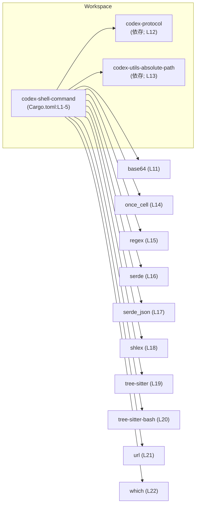
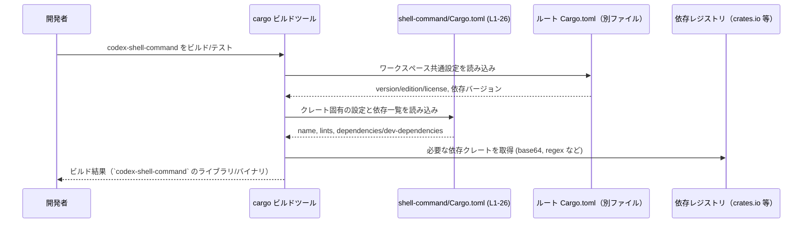

# shell-command/Cargo.toml コード解説

## 0. ざっくり一言

`shell-command/Cargo.toml` は、Rust クレート `codex-shell-command` の **パッケージメタデータと依存関係を宣言するマニフェストファイル**です (Cargo.toml:L1-5, L10-22, L24-26)。  
このファイル自体には関数・構造体・ロジックは含まれていません。

---

## 1. このモジュールの役割

### 1.1 概要

- `codex-shell-command` クレートの名前と、バージョン・エディション・ライセンスがワークスペース共通設定から参照されることを定義します (Cargo.toml:L1-5)。
- ワークスペース共通の lint 設定をこのクレートに適用することを指定します (Cargo.toml:L7-8)。
- 実行時に利用される依存クレート（`base64`, `codex-protocol`, `serde` など）と、テストや開発時にのみ必要な依存クレート (`anyhow`, `pretty_assertions`) を宣言します (Cargo.toml:L10-22, L24-26)。

このファイルは **ビルド時の設定** であり、公開 API やコアロジックの実装そのものは別ファイル（例: `src/lib.rs` など）に存在します。このチャンクにはそれらのコードは現れません。

### 1.2 アーキテクチャ内での位置づけ

`codex-shell-command` はワークスペースの 1 クレートとして定義され、複数の共通クレートや外部ライブラリに依存しています (Cargo.toml:L1-5, L10-22)。  
依存関係の概略を Mermaid 図で示します。



- `codex-protocol`, `codex-utils-absolute-path` は同一ワークスペース内の別クレートであることが、`workspace = true` から読み取れます (Cargo.toml:L12-13)。
- その他の依存 (`regex`, `serde`, `tree-sitter` など) は外部クレートとしてワークスペースの共通バージョン設定を利用します (Cargo.toml:L11, L14-22)。

### 1.3 設計上のポイント

コードから読み取れる設計上の特徴は次の通りです。

- **ワークスペース集中管理**  
  - `version.workspace = true` / `edition.workspace = true` / `license.workspace = true` により、バージョン・エディション・ライセンスはワークスペースルートで一元管理されています (Cargo.toml:L3-5)。
- **lint 設定の共有**  
  - `[lints] workspace = true` により、静的解析や lint の設定もワークスペースルートの方針に従います (Cargo.toml:L7-8)。
- **依存バージョンの共有**  
  - すべての依存で `workspace = true` が指定されており、依存クレートのバージョンもルートで統一管理されます (Cargo.toml:L11-22, L24-26)。
- **最小限の機能指定**  
  - `serde` にだけ `features = ["derive"]` が明示されており (Cargo.toml:L16)、それ以外の依存にはここでは追加機能が指定されていません。

---

## 2. 主要な機能一覧（マニフェストとしての役割）

このファイルが提供する「機能」（ビルド設定上の役割）は以下です。

- **クレートメタデータの宣言**: クレート名と、ワークスペース由来のバージョン・エディション・ライセンスを指定します (Cargo.toml:L1-5)。
- **lint ポリシーの適用**: ワークスペース共通の lint 設定をこのクレートに適用します (Cargo.toml:L7-8)。
- **実行時依存の宣言**: `base64`, `codex-protocol`, `regex`, `serde`, `tree-sitter` など、このクレートをビルドするために必要な依存クレートを列挙します (Cargo.toml:L10-22)。
- **開発・テスト用依存の宣言**: テストコードやサンプルコードでのみ用いられる `anyhow`, `pretty_assertions` を宣言します (Cargo.toml:L24-26)。

---

## 3. 公開 API と詳細解説

### 3.1 型一覧（構造体・列挙体など）

このファイルは **TOML の設定ファイル**であり、Rust の型（構造体・列挙体など）は定義されていません。  
したがって、このチャンクには公開・非公開を問わず **型定義は一切現れません** (Cargo.toml:L1-26)。

### 3.2 関数詳細（最大 7 件）

同様に、このファイルには **関数・メソッド・モジュール定義は存在しません** (Cargo.toml:L1-26)。  
よって、関数詳細テンプレートに基づいて説明できる対象はありません。

### 3.3 その他の関数

- このチャンクには補助関数やラッパー関数も含まれていません (Cargo.toml:L1-26)。

---

## 3.x コンポーネントインベントリー（依存クレート一覧）

関数・構造体は存在しないため、コンポーネントとして **クレート本体と依存クレート** を整理します。

### 3.x.1 クレート本体

| コンポーネント名 | 種別 | 役割 / 用途 | 根拠 |
|------------------|------|-------------|------|
| `codex-shell-command` | クレート（ライブラリ/バイナリ種別は不明） | このマニフェストで設定されている対象クレート | `name = "codex-shell-command"` (Cargo.toml:L2) |

> 種別（ライブラリかバイナリか）は、このチャンクには現れないため不明です。

### 3.x.2 実行時依存クレート

| 名前 | 種別 | 役割 / 用途（このファイルから分かる範囲） | 根拠 |
|------|------|--------------------------------------------|------|
| `base64` | 依存クレート | ワークスペース共通の `base64` クレートに依存していることのみが分かります。用途はこのチャンクからは不明です。 | `base64 = { workspace = true }` (Cargo.toml:L11) |
| `codex-protocol` | 依存クレート（ワークスペース内） | 同一ワークスペース内の `codex-protocol` クレートに依存しています。具体的な API 利用内容は不明です。 | `codex-protocol = { workspace = true }` (Cargo.toml:L12) |
| `codex-utils-absolute-path` | 依存クレート（ワークスペース内） | 絶対パス関連のユーティリティを提供するクレート名ですが、このチャンクから用途は断定できません。 | `codex-utils-absolute-path = { workspace = true }` (Cargo.toml:L13) |
| `once_cell` | 依存クレート | 遅延初期化用クレートに依存していることのみが分かります。どのように使うかは不明です。 | `once_cell = { workspace = true }` (Cargo.toml:L14) |
| `regex` | 依存クレート | 正規表現ライブラリへの依存のみが分かります。具体的なマッチング内容は不明です。 | `regex = { workspace = true }` (Cargo.toml:L15) |
| `serde` | 依存クレート | 直列化/逆直列化ライブラリに依存し、`derive` 機能を使うことが指定されています。どの型をシリアライズするかは不明です。 | `serde = { workspace = true, features = ["derive"] }` (Cargo.toml:L16) |
| `serde_json` | 依存クレート | JSON フォーマット用の `serde` フロントエンドに依存していることが分かります。 | `serde_json = { workspace = true }` (Cargo.toml:L17) |
| `shlex` | 依存クレート | シェル風のトークナイズ/パース用クレートに依存していると考えられますが、実際の使用方法は不明です。 | `shlex = { workspace = true }` (Cargo.toml:L18) |
| `tree-sitter` | 依存クレート | 構文解析ライブラリへの依存のみが分かります。 | `tree-sitter = { workspace = true }` (Cargo.toml:L19) |
| `tree-sitter-bash` | 依存クレート | Bash 用の Tree-sitter 言語定義への依存が分かりますが、解析対象やロジックはこのチャンクには現れません。 | `tree-sitter-bash = { workspace = true }` (Cargo.toml:L20) |
| `url` | 依存クレート | URL 操作用ライブラリへの依存のみが分かります。 | `url = { workspace = true }` (Cargo.toml:L21) |
| `which` | 依存クレート | 実行可能ファイル探索用ライブラリへの依存のみが分かります。 | `which = { workspace = true }` (Cargo.toml:L22) |

### 3.x.3 開発・テスト用依存クレート

| 名前 | 種別 | 役割 / 用途（推測は明示） | 根拠 |
|------|------|---------------------------|------|
| `anyhow` | 開発依存クレート | エラー型を単一の型にまとめるユーティリティクレートに依存しています。テストやサンプルで汎用エラーを扱う目的と推測されますが、このチャンクからは断定できません。 | `anyhow = { workspace = true }` (Cargo.toml:L25) |
| `pretty_assertions` | 開発依存クレート | アサーションの差分表示を改善するクレートへの依存です。テスト時の比較表示に使われると推測されますが、コードはこのチャンクには現れません。 | `pretty_assertions = { workspace = true }` (Cargo.toml:L26) |

---

## 4. データフロー（ビルド時の流れ）

実行時のデータフローや呼び出し関係は、このファイルからは分かりません。  
ここでは **ビルド時に Cargo がこのファイルをどのように扱うか** という観点でのフローを示します。



- `version.workspace = true` などにより、バージョン情報はワークスペースルートから補完されることがこのチャンクから分かります (Cargo.toml:L3-5)。
- 実際のコンパイル対象ファイル（例: `src/lib.rs`）や、関数の呼び出し関係はこのチャンクには現れません。

---

## 5. 使い方（How to Use）

### 5.1 基本的な使用方法（マニフェストとして）

このファイルは Cargo によって自動的に読み込まれるため、通常は **直接「呼び出す」ことはなく、内容を編集してビルド設定を変更**します。

例えば、ワークスペース外の別クレートから `codex-shell-command` を利用する一般的な例は次のようになります（あくまで一般的な例であり、このリポジトリ構成に存在するとは限りません）。

```toml
# 別クレートの Cargo.toml の例（このチャンクには現れません）
[dependencies]
codex-shell-command = { path = "shell-command" }  # ローカルパスで依存指定
```

このとき `shell-command/Cargo.toml` によって、どの依存クレートと一緒にビルドされるかが決まります (Cargo.toml:L10-22)。

### 5.2 よくある使用パターン

1. **依存クレートの追加**

   新しいライブラリに依存したい場合、通常は `[dependencies]` セクションに行を追加します (Cargo.toml:L10-22)。

   ```toml
   [dependencies]
   base64 = { workspace = true }
   # 新しい依存の追加例（このチャンクには存在しないがパターンとして）
   anyhow = "1"  # ワークスペース外で直接バージョン指定する場合の例
   ```

   このプロジェクトでは既存の依存がすべて `workspace = true` なので、新しい依存もワークスペースに追加してから `workspace = true` にそろえる運用が想定されます。

2. **開発時のみの依存の追加**

   テスト専用のクレートを追加する場合は `[dev-dependencies]` に行を追加します (Cargo.toml:L24-26)。

   ```toml
   [dev-dependencies]
   anyhow = { workspace = true }
   pretty_assertions = { workspace = true }
   # さらなるテスト支援クレートの例（このチャンクには現れません）
   rstest = "0.21"
   ```

### 5.3 よくある間違い（このファイルに関連するもの）

マニフェスト編集に関して起こりうる誤りと、その結果を示します。

```toml
# 誤り例: コード側で regex を使っているのに依存を削除してしまう
[dependencies]
# regex = { workspace = true }  # 誤って削除

# 結果:
# コンパイル時に「use of undeclared crate or module `regex`」などのエラーになります。
```

```toml
# 誤り例: ワークスペース運用下で個別バージョンを指定してしまう
[dependencies]
regex = "1.10"  # workspace = true を使っていない

# 結果:
# ルート Cargo.toml にも regex が定義されている場合、
# バージョンの衝突や意図しない複数バージョンの混在を招く可能性があります。
```

これらは一般的な Cargo の挙動であり、`shell-command/Cargo.toml` も同様に影響を受けます。

### 5.4 使用上の注意点（まとめ）

- **ワークスペース前提**  
  - バージョン・エディション・ライセンス・lint・依存バージョンはすべてワークスペース依存です (Cargo.toml:L3-5, L7-8, L11-22, L24-26)。  
    変更は多くの場合、ルート `Cargo.toml` 側で行う必要があります。
- **依存削除の影響**  
  - `[dependencies]` や `[dev-dependencies]` から項目を削除すると、該当クレートを使っているコードはコンパイルエラーになります。テストコードも含めて影響範囲の確認が必要です。
- **安全性・セキュリティの観点**  
  - どのバージョンの依存クレートが使用されているかはこのチャンクからは分かりませんが、`workspace = true` によりバージョンは一括管理されます (Cargo.toml:L11-22, L24-26)。  
    脆弱性対応やアップデートは、ワークスペースルートでのバージョン更新が中心になります。
- **並行性・エラー処理**  
  - 並行実行やエラー処理の実装はコード側に依存し、このチャンクには現れません。  
    ただし `once_cell`, `anyhow` など並行性やエラー処理に関係することが多いクレートが依存に含まれていますが、実際の使い方はこのファイルからは判断できません (Cargo.toml:L14, L25)。

---

## 6. 変更の仕方（How to Modify）

### 6.1 新しい機能（コード上の機能）を追加する場合

新機能の実装自体は Rust コード側ですが、**新たな依存ライブラリが必要になる場合** はこのファイルの編集が必要です。

1. 必要なライブラリがすでにワークスペースルートで定義されているか確認する（このチャンクからはルートの内容は分かりません）。
2. ルートに定義済みであれば、このファイルの `[dependencies]` に `workspace = true` でエントリを追加します (Cargo.toml:L10-22)。
3. ルートに定義されていない場合は、ルート `Cargo.toml` にも依存を追加し、`workspace = true` を使うか、あるいはこのファイルに直接バージョンを記述するかを判断します。

### 6.2 既存の機能を変更する場合（マニフェスト観点）

- **依存の差し替え・削除**
  - 例: `regex` から別のパーサーライブラリに切り替える場合には `[dependencies]` から `regex` を削除し、新しい依存を追加します (Cargo.toml:L15)。
  - 削除前に、コード中で `regex` が使われていないことを検索・確認する必要があります（コードはこのチャンクには現れません）。
- **`serde` の機能変更**
  - `serde` の `features = ["derive"]` を変更すると、コード側の `#[derive(Serialize, Deserialize)]` などの利用に影響します (Cargo.toml:L16)。  
    機能を減らす場合は、コンパイルエラーにならないかを確認する必要があります。
- **lint 方針の変更**
  - このファイルでは `[lints] workspace = true` としか書かれていないため、lint の詳細はルートに委譲されています (Cargo.toml:L7-8)。  
    個別クレートごとに lint を変えたい場合は、ルート側またはこのファイルに個別設定を追加する形になります。

---

## 7. 関連ファイル

このファイルと密接に関係するが、このチャンクには現れないファイル・ディレクトリを列挙します（パスは一般的な Rust プロジェクト構成に基づく推測であり、実在はこのチャンクからは断定できません）。

| パス（推定） | 役割 / 関係 |
|-------------|------------|
| `Cargo.toml`（ワークスペースルート） | `version.workspace = true` や依存の `workspace = true` の定義元となるルートマニフェストです (Cargo.toml:L3-5, L11-22, L24-26)。 |
| `shell-command/src/lib.rs` または `shell-command/src/main.rs` | `codex-shell-command` クレートの公開 API やコアロジックが実際に定義されていると考えられるコードファイルです。このチャンクには現れません。 |
| ワークスペース内の `codex-protocol` クレートの `Cargo.toml` / `src` | `codex-shell-command` から依存されるプロトコル関連クレートですが、詳細はこのチャンクでは不明です (Cargo.toml:L12)。 |
| ワークスペース内の `codex-utils-absolute-path` クレート | 絶対パス操作のユーティリティクレートと考えられますが、実装内容は不明です (Cargo.toml:L13)。 |

---

### このチャンクに現れない情報について

- 公開 API（関数・構造体・モジュール）の一覧や詳細な呼び出し関係、並行性制御、エラー処理ロジックなどは **この Cargo.toml からは読み取れません**。
- 依存クレートの「どういう API をどのように呼び出しているか」は、対応する `src/*.rs` ファイルを確認する必要があります。
