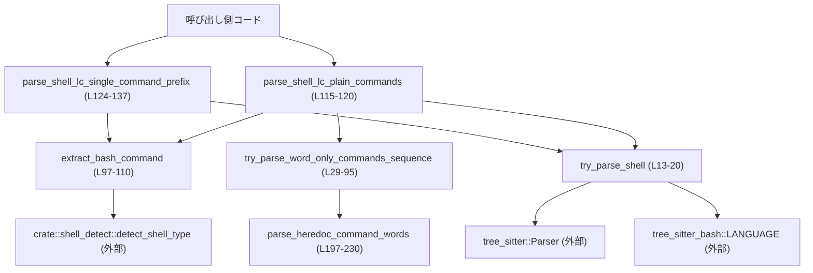
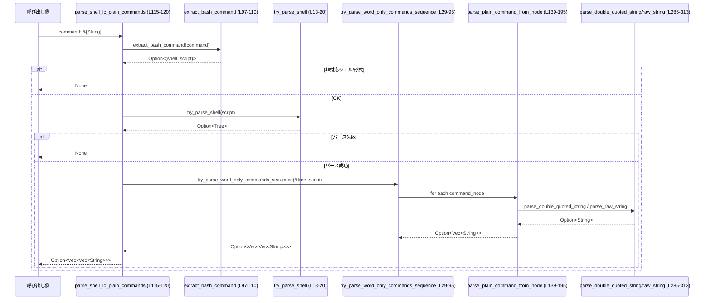

# shell-command/src/bash.rs コード解説

## 0. ざっくり一言

`tree-sitter-bash` を使ってシェルスクリプト（主に `bash -lc "..."` / `zsh -lc "..."` 形式）を構文解析し、  
「安全な**ワードのみのコマンド列**」や、「ヒアドキュメント付き 1 コマンド」の argv を抽出するモジュールです（bash.rs:L11-20, L22-28, L122-137）。

---

## 1. このモジュールの役割

### 1.1 概要

- このモジュールは **シェルスクリプト文字列を安全に解析し、再解釈しやすい形に制限して取り出す** ために存在します。
- 主な機能は次の 2 つです。
  - `bash -lc "..."` / `zsh -lc "..."` 形式のコマンドから、「ワードだけで構成された単純コマンド列」を抽出する（bash.rs:L22-28, L112-120）。
  - 同様の呼び出しのうち、`<<` ヒアドキュメントを 1 つだけ含むスクリプトから「先頭コマンドの argv だけ」を抽出する（bash.rs:L122-137）。

どちらも、パイプラインや制御構造、変数展開・コマンド置換など **危険・複雑な構文を厳しく拒否する** 方針になっています（bash.rs:L29-50, L139-195, L197-230）。

### 1.2 アーキテクチャ内での位置づけ

主な依存関係は次の通りです。

- `tree_sitter`, `tree_sitter_bash::LANGUAGE` … Bash AST の構築に使用（bash.rs:L3-6, L13-20）。
- `crate::shell_detect::{detect_shell_type, ShellType}` … 引数のシェルが bash/zsh/sh かどうか判定（bash.rs:L8-9, L97-110）。

これらの関係を簡略図で示すと、次のようになります。



### 1.3 設計上のポイント

- **状態を持たない**  
  - すべての関数は引数だけに依存し、グローバルな可変状態はありません（bash.rs 全体）。  
  - `Parser` などは毎回ローカルに生成されます（bash.rs:L13-18）。
- **安全側に倒した構文制限**  
  - 許可されたノード種別・トークンをホワイトリストで管理し、それ以外が出現したら即座に `None` を返して拒否します（bash.rs:L34-52, L58-76）。
  - ダブルクオート文字列内の変数展開やコマンド置換などもすべて拒否します（bash.rs:L285-300, L385-389, L417-422, L486-497）。
- **エラー処理は `Option` ベース**  
  - パースエラーや想定外構文があれば `None` を返し、呼び出し側に「扱えないスクリプト」として伝えます（bash.rs:L29-32, L88-92, L197-230）。
- **並行性**  
  - モジュール内に共有ミュータブル状態はなく、関数は引数のみを扱うため、このモジュール自身はスレッドセーフな設計になっています。  
    （tree-sitter 型自体の Send/Sync かどうかは外部ライブラリ仕様に依存します。）

---

## 2. 主要な機能一覧

（関数名の右におおよその行範囲を示します）

- `try_parse_shell` (L13-20): `tree-sitter-bash` でシェルスクリプト文字列を `Tree` にパースします。
- `try_parse_word_only_commands_sequence` (L29-95): AST が「ワードのみの単純コマンド列」であるか検査しつつ、各コマンドの argv を抽出します。
- `extract_bash_command` (L97-110): `["bash|zsh|sh", "-lc|-c", "script"]` 形式のコマンド配列からシェルとスクリプト文字列を抽出します。
- `parse_shell_lc_plain_commands` (L115-120): 上記 2 つを組み合わせ、`bash -lc "..."` / `zsh -lc "..."` のスクリプトからワードのみのコマンド列を取得します。
- `parse_shell_lc_single_command_prefix` (L124-137): ヒアドキュメント付き 1 コマンドスクリプトから、先頭コマンドの argv（プレフィックス）を抽出します。
- `parse_plain_command_from_node` (L139-195): AST の `command` ノードから、文字列・数値・クオート・連結を解釈して argv を組み立てます。
- `parse_heredoc_command_words` (L197-230): `command` ノードから、「リテラルなワードのみ」で構成された argv を抽出し、ヒアドキュメントなどの I/O 付帯要素を許容します。
- ほか、ヘルパー関数として `is_literal_word_or_number`, `is_allowed_heredoc_attachment_kind`, `find_single_command_node`, `has_named_descendant_kind`, `parse_double_quoted_string`, `parse_raw_string` などがあります（bash.rs:L232-313, L252-283）。

---

## 3. 公開 API と詳細解説

### 3.1 型一覧（構造体・列挙体など）

このファイル内に新たな構造体・列挙体の定義はありませんが、外部型を多用します。

| 名前 | 種別 | 定義元 | 役割 / 用途 | 根拠 |
|------|------|--------|-------------|------|
| `Tree` | 構造体 | `tree_sitter` | 解析済み AST を表すツリー | bash.rs:L5, L13-20 |
| `Node<'tree>` | 構造体 | `tree_sitter` | AST 内のノード | bash.rs:L3, L54-81, L139-195 |
| `Parser` | 構造体 | `tree_sitter` | 字句解析＋構文解析を行うパーサ | bash.rs:L4, L13-19 |
| `ShellType` | 列挙体 | `crate::shell_detect` | シェル種別（Bash/Zsh/Sh など）の判定結果 | bash.rs:L8, L97-110 |
| `LANGUAGE as BASH` | 静的言語定義 | `tree_sitter_bash` | Bash 用の tree-sitter 言語定義 | bash.rs:L6, L13-18 |

### 3.2 関数詳細（主要 7 件）

#### `try_parse_shell(shell_lc_arg: &str) -> Option<Tree>`

**概要**

- 与えられたシェルスクリプト文字列を `tree-sitter-bash` で構文解析し、成功時に `Tree` を返します（bash.rs:L11-20）。
- パーサ生成や言語設定に失敗した場合は `panic!` しますが、構文解析（`parse`）自体が失敗した場合は `None` を返します。

**引数**

| 引数名 | 型 | 説明 |
|--------|----|------|
| `shell_lc_arg` | `&str` | パース対象のシェルスクリプト文字列（`bash -lc` の引数など） |

**戻り値**

- `Option<Tree>`  
  - `Some(tree)`: 解析成功。`tree` の `root_node()` から AST にアクセスできます。  
  - `None`: パースに失敗した場合（bash.rs:L18-19）。

**内部処理（アルゴリズム）**

1. `BASH`（`tree_sitter_bash::LANGUAGE`）を `lang` に変換（bash.rs:L14）。
2. `Parser::new()` でパーサを生成（bash.rs:L15）。
3. `parser.set_language(&lang)` を呼び、失敗時は `expect("load bash grammar")` で panic（bash.rs:L16-17）。
4. 増分パース用 `old_tree` は常に `None`（bash.rs:L18）。
5. `parser.parse(shell_lc_arg, old_tree)` の戻り値をそのまま返す（`Option<Tree>`）（bash.rs:L19）。

**Errors / Panics**

- `set_language` が失敗した場合、`expect` により panic します（bash.rs:L16-17）。  
  → 実運用ではライブラリの組み込みミスなど、プログラマブルなエラーとみなせるケースです。
- 構文解析に失敗した場合は `None` が返ります。

**Edge cases**

- 空文字列 `""` もパーサに渡されます。結果の `Tree` にエラーが含まれているかどうかは、この関数の呼び出し側でチェックしています（例: `try_parse_word_only_commands_sequence` 内の `has_error` チェック、bash.rs:L29-32）。

**使用上の注意点**

- 戻り値が `Some(tree)` でも、AST にエラーが含まれる可能性があるため、`root_node().has_error()` を別途確認している箇所があります（bash.rs:L29-32, L127-130）。
- この関数自体はスレッドローカルな `Parser` しか扱わず、共有状態はありません。

---

#### `try_parse_word_only_commands_sequence(tree: &Tree, src: &str) -> Option<Vec<Vec<String>>>`

**概要**

- AST と元ソース文字列から、**ワードだけで構成された単純コマンド列**かどうかを判定し、そうであれば各コマンドの argv リストを返します（bash.rs:L22-28, L29-95）。
- 制御構造、サブシェル、リダイレクト、変数展開などが現れた場合は即座に `None` を返します。

**引数**

| 引数名 | 型 | 説明 |
|--------|----|------|
| `tree` | `&Tree` | 解析済み AST |
| `src` | `&str` | パース元のソース文字列（`tree` のバイトオフセットの基準） |

**戻り値**

- `Option<Vec<Vec<String>>>`  
  - `Some(commands)`: 各要素が 1 つのコマンドの argv（先頭がコマンド名、それ以降が引数）を表す。
  - `None`: AST に構文エラーがある、または許可していない構文・トークンが含まれている。

**内部処理の流れ**

1. `tree.root_node().has_error()` をチェックし、エラーがあれば `None`（bash.rs:L29-32）。
2. 許可される **named ノード種別** を `ALLOWED_KINDS` に定義（program/list/pipeline/command/word/string/number 等）（bash.rs:L34-50）。
3. 許可される **非 named トークン**（演算子・クォート）を `ALLOWED_PUNCT_TOKENS` として定義（bash.rs:L51-52）。
4. ルートノードから DFS（明示的なスタック）で全ノードを走査（bash.rs:L54-81）。
   - `node.is_named()` の場合
     - `ALLOWED_KINDS` に含まれなければ `None`（bash.rs:L60-63）。
     - `kind == "command"` のノードを `command_nodes` に収集（bash.rs:L64-66）。
   - named でない場合（トークン）
     - 記号列に `&;|` が含まれるのに `ALLOWED_PUNCT_TOKENS` に無いもの（例: `;;`, `|&`）は拒否（bash.rs:L68-71）。
     - 許可トークンでも空白文字でもないもの（`(`, `)`, `<`, `>` など）は拒否（bash.rs:L72-76）。
5. 収集した `command_nodes` を開始位置バイト順にソートし、元ソース順に並び替え（bash.rs:L83-84）。
6. 各 `command` ノードについて `parse_plain_command_from_node` を呼び、argv を構築（bash.rs:L86-93）。
   - いずれか 1 つでも `None` になれば全体を `None` とする。
7. すべて成功したら `Some(commands)` を返す（bash.rs:L94）。

**Examples（使用例）**

テストの挙動から、典型的な使用例は次のようになります（bash.rs:L320-342）。

```rust
// ソース文字列を tree-sitter でパースする
let tree = try_parse_shell("ls && pwd; echo 'hi there' | wc -l")?;

// 「ワードのみのコマンド列」であれば、各コマンドの argv を得る
let cmds = try_parse_word_only_commands_sequence(&tree, "ls && pwd; echo 'hi there' | wc -l")?;
assert_eq!(
    cmds,
    vec![
        vec!["ls".to_string()],
        vec!["pwd".to_string()],
        vec!["echo".to_string(), "hi there".to_string()],
        vec!["wc".to_string(), "-l".to_string()],
    ]
);
```

**Errors / Panics**

- 関数自体は panic しません。  
- 次の場合に `None` を返します。
  - `tree` の root ノードに構文エラーがある（bash.rs:L29-32）。
  - `ALLOWED_KINDS` に含まれない named ノード（例: `subshell`, `if_statement`, `variable_assignment` など）が存在する（bash.rs:L60-63）。
  - 許可されない演算子・記号トークンが存在する（`>`, `<`, `(`, `)`, `;;`, `|&` 等）（bash.rs:L68-76）。
  - 各 `command` ノードから argv を組み立てる処理中に、許可されないノード種別が出現する（後述 `parse_plain_command_from_node`、bash.rs:L139-195）。

**Edge cases（代表例）**

テストから読み取れる代表的なエッジケースです。

- **単一コマンド**: `ls -1` は受理され、`["ls", "-1"]` になる（bash.rs:L325-329）。
- **複数コマンド & 演算子**: `&&`, `||`, `;`, `|` でつながったコマンドは許可される（bash.rs:L331-342）。
- **クォートされた文字列**: `'...'` / `"..."` を値として扱い、中身に改行があっても許可（bash.rs:L344-371）。
- **展開を含む文字列**: `"hi ${USER}"`, `"$HOME"` などは拒否（bash.rs:L385-389, L417-422）。
- **サブシェル・括弧**: `(ls)`, `ls || (pwd && echo hi)` は拒否（bash.rs:L405-408）。
- **リダイレクト・背景実行**: `ls > out.txt`, `echo hi & echo bye` は拒否（bash.rs:L410-414）。
- **変数展開・コマンド置換**: `$(pwd)`, `` `pwd` ``, `$HOME`, `"hi $USER"` などは拒否（bash.rs:L417-422）。
- **変数代入 prefix**: `FOO=bar ls` は拒否（bash.rs:L424-427）。
- **構文的に不完全な演算子**: `ls &&`, `&& ls`, `ls ;; pwd`, `ls | | wc` は拒否（bash.rs:L429-447）。

**使用上の注意点**

- `None` は「危険/複雑なので拒否」「構文的におかしい」の両方の意味を持ちます。呼び出し側では **単に失敗と見なす** 設計にするのが安全です。
- 新しい構文を許可したくなった場合、`ALLOWED_KINDS` と `parse_plain_command_from_node` の両方を更新する必要があります。

---

#### `extract_bash_command(command: &[String]) -> Option<(&str, &str)>`

**概要**

- `["シェルパス", "フラグ", "スクリプト"]` 形式の argv から、対応するシェルとスクリプト文字列を取り出します（bash.rs:L97-110）。
- 対応するシェルは `bash` / `zsh` / `sh`（`ShellType::Bash|Zsh|Sh`）で、フラグは `-lc` または `-c` の場合のみ `Some` を返します。

**引数**

| 引数名 | 型 | 説明 |
|--------|----|------|
| `command` | `&[String]` | シェル起動コマンドの argv 全体 |

**戻り値**

- `Option<(&str, &str)>`  
  - `Some((shell, script))`: 形式・シェル種別が条件を満たす場合。`shell` はシェル実行ファイル（例: `"bash"`）、`script` はスクリプト文字列。
  - `None`: 長さが 3 以外、フラグが `-lc` / `-c` 以外、あるいはシェルが `bash` / `zsh` / `sh` 以外。

**内部処理**

1. `let [shell, flag, script] = command else { return None; };` で長さ 3 でない配列を拒否（bash.rs:L97-100）。
2. `flag` が `-lc` または `-c` か確認（bash.rs:L101）。
3. `detect_shell_type(&PathBuf::from(shell))` を呼び、`ShellType::Zsh | Bash | Sh` のいずれかでなければ拒否（bash.rs:L102-105）。
4. 条件を満たしたら `Some((shell, script))` を返す（bash.rs:L109-110）。

**使用上の注意点**

- ここで `PathBuf::from(shell)` を使っているため、`shell` 文字列はパスでも単なるコマンド名でも構いません（詳細は `detect_shell_type` 実装次第です）。
- 他のシェル（`fish` や `powershell` など）はここで除外されます。

---

#### `parse_shell_lc_plain_commands(command: &[String]) -> Option<Vec<Vec<String>>>`

**概要**

- `["bash|zsh|sh", "-lc|-c", "script"]` 形式のコマンドのうち、`script` が「ワードのみの単純コマンド列」であれば、その各コマンドの argv 列を返します（bash.rs:L112-120）。
- より高レベルな公開 API であり、内部で `extract_bash_command` → `try_parse_shell` → `try_parse_word_only_commands_sequence` を順に呼びます。

**引数**

| 引数名 | 型 | 説明 |
|--------|----|------|
| `command` | `&[String]` | シェル起動コマンドの argv（長さ 3 を期待） |

**戻り値**

- `Option<Vec<Vec<String>>>`  
  - `Some(commands)`: 受理された各コマンドの argv 列。
  - `None`: 形式不一致・対象外シェル・構文エラー・危険構文のいずれかで解析できなかった場合。

**内部処理**

1. `extract_bash_command(command)?` で `(shell, script)` を取得（bash.rs:L115-116）。
2. `try_parse_shell(script)?` で AST を構築（bash.rs:L118）。
3. `try_parse_word_only_commands_sequence(&tree, script)` でコマンド列を抽出（bash.rs:L119）。

**Examples（使用例）**

```rust
use crate::bash::parse_shell_lc_plain_commands;

// bash -lc "ls && pwd" を解析する
let argv = vec![
    "bash".to_string(),
    "-lc".to_string(),
    "ls && pwd".to_string(),
];

if let Some(commands) = parse_shell_lc_plain_commands(&argv) {
    // [["ls"], ["pwd"]] のような形で得られる
    for cmd in commands {
        println!("command: {:?}", cmd);
    }
} else {
    // 危険/複雑/構文エラーなどで解析できなかった
}
```

**Errors / Edge cases**

- `command` の長さが 3 でない、あるいは `bash` / `zsh` / `sh` 以外のシェル、`-lc` / `-c` 以外のフラグのときは `None`（bash.rs:L97-107）。
- スクリプト内に禁止構文が含まれている場合も `None`（前述 `try_parse_word_only_commands_sequence` の条件）。

**使用上の注意点**

- この関数の `None` は安全側の「拒否」を意味し、スクリプトが悪意ある/複雑な構文かもしれないことを示すため、呼び出し側では **決して無理に解釈し直さない** ことが重要です。
- シェル起動の別形式（`bash script.sh` など）には対応していません。

---

#### `parse_shell_lc_single_command_prefix(command: &[String]) -> Option<Vec<String>>`

**概要**

- `bash -lc "python3 <<'PY' ... PY"` のような **ヒアドキュメント付き 1 コマンドスクリプト**から、「先頭コマンドの argv だけ」を抽出します（bash.rs:L122-137）。
- スクリプト全体に `command` ノードがちょうど 1 つだけ存在し、かつ `heredoc_redirect` を含む場合のみ受理します。

**引数**

| 引数名 | 型 | 説明 |
|--------|----|------|
| `command` | `&[String]` | `["bash|zsh|sh", "-lc|-c", "script"]` 形式の argv |

**戻り値**

- `Option<Vec<String>>`  
  - `Some(argv)`: 先頭コマンドの argv（例: `["python3"]`）。
  - `None`: 形式不一致、ヒアドキュメント無し、複数コマンド、危険構文など。

**内部処理**

1. `extract_bash_command` で `(shell, script)` を取得（bash.rs:L125）。
2. `try_parse_shell(script)` で AST を構築（bash.rs:L126）。
3. `root.has_error()` なら `None`（bash.rs:L127-130）。
4. `has_named_descendant_kind(root, "heredoc_redirect")` で、スクリプト内にヒアドキュメントリダイレクトが含まれるか確認（bash.rs:L131-132, L271-283）。
5. `find_single_command_node(root)?` で `command` ノードが 1 つだけ存在することを確認し、そのノードを取得（bash.rs:L135, L252-269）。
6. `parse_heredoc_command_words(command_node, script)` で argv を抽出（bash.rs:L136, L197-230）。

**Examples（使用例）**

テストからの例（bash.rs:L499-515）:

```rust
let command = vec![
    "zsh".to_string(),
    "-lc".to_string(),
    "python3 <<'PY'\nprint('hello')\nPY".to_string(),
];
let parsed = parse_shell_lc_single_command_prefix(&command);
assert_eq!(parsed, Some(vec!["python3".to_string()]));
```

**Errors / Edge cases**

- スクリプトにヒアドキュメントが含まれない場合は `None`（bash.rs:L131-132）。
- `command` ノードが 2 つ以上存在するスクリプト（`python3 <<...; echo done` など）は `None`（bash.rs:L252-269, L519-525）。
- 非ヒアドキュメントなリダイレクト（`> /tmp/out.txt` だけのスクリプトなど）は `None`（bash.rs:L528-536）。
- ヒアドキュメントに加えて追加のリダイレクト（`<<'PY' > /tmp/out.txt`）は許可され、argv は `["python3"]` のままです（bash.rs:L539-548）。
- ここでは純粋なヒアストリング（`<<<`）のみのスクリプトは `heredoc_redirect` を含まず、`None` になります（bash.rs:L552-569）。

**使用上の注意点**

- 取得されるのは **ヒアドキュメントの前にある argv（コマンド名＋リテラルな引数）だけ** であり、ヒアドキュメント本文は解析しません。
- `parse_heredoc_command_words` により、コマンド名や引数に変数展開・算術展開などが含まれる場合は拒否されます（bash.rs:L197-230, L571-588）。

---

#### `parse_plain_command_from_node(cmd: Node, src: &str) -> Option<Vec<String>>`

**概要**

- AST の `command` ノードから argv（`Vec<String>`）を構築します（bash.rs:L139-195）。
- コマンド名・引数として許可するのは以下のみです。
  - 純粋な `word` / `number`
  - ダブルクオート文字列（中身が `string_content` のみ）
  - シングルクオート（raw）文字列
  - 上記の連結（`concatenation`）ノード

**引数**

| 引数名 | 型 | 説明 |
|--------|----|------|
| `cmd` | `Node` | `kind() == "command"` の AST ノードを期待 |
| `src` | `&str` | 元ソース文字列 |

**戻り値**

- `Option<Vec<String>>`  
  - `Some(argv)`: 解析成功時の argv。
  - `None`: `command` 以外のノードが渡された、あるいは内部に禁止構文が含まれている。

**内部処理の流れ**

1. `cmd.kind() != "command"` の場合は即 `None`（bash.rs:L139-142）。
2. `cmd.named_children()` を順に走査し、`child.kind()` に応じて処理（bash.rs:L143-145）。
   - `"command_name"`: 最初の named 子が `"word"` であることを確認し、その文字列を argv に追加（bash.rs:L147-153）。
   - `"word"` / `"number"`: そのままテキストを argv に追加（bash.rs:L154-156）。
   - `"string"`: `parse_double_quoted_string` で内容を抽出して argv に追加（bash.rs:L157-160, L285-300）。
   - `"raw_string"`: `parse_raw_string` でシングルクオートを剥がして追加（bash.rs:L161-163, L303-313）。
   - `"concatenation"`: 子ノードを順に処理し、`word` / `number` / `string` / `raw_string` を連結して 1 つの引数にする（bash.rs:L165-183）。
   - その他の kind は即 `None`（bash.rs:L191-192）。
3. 連結結果が空文字列の場合も `None`（bash.rs:L186-188）。

**Examples（使用例）**

テストの「フラグと値の連結」の例（bash.rs:L456-483）に対応しています。

```rust
// 例: rg -n "foo" -g"*.py" → ["rg", "-n", "foo", "-g*.py"]
let cmds = parse_seq("rg -n \"foo\" -g\"*.py\"").unwrap();
assert_eq!(
    cmds,
    vec![vec![
        "rg".to_string(),
        "-n".to_string(),
        "foo".to_string(),
        "-g*.py".to_string(),
    ]]
);
```

**Errors / Edge cases**

- `"concatenation"` 内で許可されていない kind（例: 変数展開ノード）が出現した場合は `None`（bash.rs:L170-183, L485-497）。
- ダブルクオート文字列に `string_content` 以外の named 子（例: `expansion`）が含まれている場合、`parse_double_quoted_string` が `None` になり、全体も `None` になります（bash.rs:L285-300, L386-389, L417-422）。
- `utf8_text` の取得に失敗した場合は `None` になりますが、`src` 自体が `&str` であるため正常ケースでは発生しない想定です（bash.rs:L152-156, L296-300, L308-312）。

**使用上の注意点**

- 直接使うよりも、通常は `try_parse_word_only_commands_sequence` 経由で呼び出される内部ヘルパーとして扱われます。
- `command_name` の最初の子が `"word"` 以外（例: 構造化された名前）の場合は拒否されます。

---

#### `parse_heredoc_command_words(cmd: Node<'_>, src: &str) -> Option<Vec<String>>`

**概要**

- ヒアドキュメントを含む `command` ノードから、「リテラルなワード/数字」だけで構成された argv を抽出します（bash.rs:L197-230）。
- ヒアドキュメントやリダイレクト、コメントなどは **argv に影響しない付帯要素** として許容します。

**引数**

| 引数名 | 型 | 説明 |
|--------|----|------|
| `cmd` | `Node<'_>` | 対象の `command` ノード |
| `src` | `&str` | 元ソース文字列 |

**戻り値**

- `Option<Vec<String>>`  
  - `Some(argv)`: コマンド名＋リテラル引数。
  - `None`: コマンド名や引数に展開などが含まれる、あるいは禁止構文が含まれる場合。

**内部処理**

1. `cmd.kind() != "command"` なら `None`（bash.rs:L197-200）。
2. `named_children` を走査し、kind ごとに処理（bash.rs:L203-227）。
   - `"command_name"`: 子ノードが `"word" | "number"` で、かつ `is_literal_word_or_number` が `true` でなければ `None`（bash.rs:L206-212, L232-238）。
   - `"word" | "number"`: 同様に `is_literal_word_or_number` が `true` の場合のみテキストを argv に追加（bash.rs:L215-220）。
   - `"variable_assignment"` / `"comment"`: 無視（argv に追加しないが存在は許可）（bash.rs:L221-224）。
   - `kind if is_allowed_heredoc_attachment_kind(kind)`: ヒアドキュメント本体やリダイレクトなどは許容（bash.rs:L221-225, L240-249）。
   - それ以外は `None`（bash.rs:L225）。
3. 最終的に `words` が空であれば `None`、そうでなければ `Some(words)`（bash.rs:L229）。

**Edge cases**

- コマンド名や引数に算術展開や変数展開が含まれる場合（たとえば `python3 $((1<<2)) <<'PY'`）は `None`（bash.rs:L571-588）。
- 非ヒアドキュメントなスクリプト（`echo $((1<<2))` など）は `parse_shell_lc_single_command_prefix` 側の条件で拒否されます（bash.rs:L571-579）。

**使用上の注意点**

- `is_literal_word_or_number` により、**named 子ノードを持たない純粋なリテラル単語だけ** を許容しています（bash.rs:L232-238）。
- argv 以外の付帯要素（ヒアドキュメント本文、リダイレクト先ファイルなど）は一切返されません。

---

### 3.3 その他の関数（一覧）

公開 API 以外のヘルパー関数です。

| 関数名 | 役割（1 行） | 根拠 |
|--------|--------------|------|
| `is_literal_word_or_number(node: Node<'_>) -> bool` | `kind` が `"word"` または `"number"` かつ named 子ノードを持たないかどうか判定します。 | bash.rs:L232-238 |
| `is_allowed_heredoc_attachment_kind(kind: &str) -> bool` | ヒアドキュメントや各種リダイレクトに相当する kind かどうかを判定します。 | bash.rs:L240-249 |
| `find_single_command_node(root: Node<'_>) -> Option<Node<'_>>` | AST 中にただ 1 つだけ存在する `command` ノードを探し、2 つ以上なら `None` にします。 | bash.rs:L252-269 |
| `has_named_descendant_kind(node: Node<'_>, kind: &str) -> bool` | DFS で named 子孫に指定 kind を持つか確認します。 | bash.rs:L271-283 |
| `parse_double_quoted_string(node: Node, src: &str) -> Option<String>` | `"..."` 形式の文字列ノードから先頭・末尾の `"` を除去し、内部が `string_content` のみなら中身を返します。 | bash.rs:L285-300 |
| `parse_raw_string(node: Node, src: &str) -> Option<String>` | `'...'` 形式の文字列ノードから先頭・末尾の `'` を除去して中身を返します。 | bash.rs:L303-313 |

---

## 4. データフロー

### 4.1 `parse_shell_lc_plain_commands` を例とした処理フロー

`parse_shell_lc_plain_commands` に `["zsh", "-lc", "ls && pwd"]` のような argv を渡した場合の、主要な関数間のデータフローです。

1. 呼び出し側から `parse_shell_lc_plain_commands(&command)` が呼ばれる（bash.rs:L115-120）。
2. `extract_bash_command` が argv から `(shell, script)` を抽出し、シェル種別を検証（bash.rs:L97-110）。
3. `try_parse_shell(script)` が `Tree` を生成（bash.rs:L13-20）。
4. `try_parse_word_only_commands_sequence(&tree, script)` が AST 全体を走査し、許可された構文のみであることを確認しつつ `command` ノードを収集（bash.rs:L29-95）。
5. 各 `command` ノードに対して `parse_plain_command_from_node(command, script)` が argv を構築（bash.rs:L139-195）。
6. 途中で禁止構文が見つかれば即座に `None` が返り、呼び出し側に「解析不能」として伝わります。

Mermaid のシーケンス図で表すと次の通りです。



---

## 5. 使い方（How to Use）

### 5.1 基本的な使用方法

#### ワードのみのコマンド列を解析する

```rust
use shell_command::bash::parse_shell_lc_plain_commands;

// bash -lc "ls && echo 'hi'" 形式の argv を用意する
let command = vec![
    "bash".to_string(),      // シェル
    "-lc".to_string(),       // ログイン＋コマンド評価
    "ls && echo 'hi'".to_string(), // スクリプト
];

// 安全なワードのみのコマンド列であれば Some(...) が返る
match parse_shell_lc_plain_commands(&command) {
    Some(commands) => {
        // commands は Vec<Vec<String>>:
        //   [["ls"], ["echo", "hi"]]
        for argv in commands {
            println!("command: {:?}", argv);
        }
    }
    None => {
        // 危険/複雑/構文エラーなどで解析不能
        // ここでは何もせずスキップするなど、安全側の挙動にする
    }
}
```

#### ヒアドキュメント付き 1 コマンドのプレフィックスを解析する

```rust
use shell_command::bash::parse_shell_lc_single_command_prefix;

let command = vec![
    "zsh".to_string(),
    "-lc".to_string(),
    "python3 <<'PY'\nprint('hello')\nPY".to_string(),
];

if let Some(argv) = parse_shell_lc_single_command_prefix(&command) {
    // ["python3"] が得られる
    println!("prefix argv: {:?}", argv);
} else {
    // ヒアドキュメント無し、複数コマンド、展開を含むなどで拒否された
}
```

### 5.2 よくある使用パターン

- **コマンドの検査・ラップ**
  - 既存のプロセス起動ロジックの前段で `parse_shell_lc_plain_commands` を呼び、
    - 解析できた場合: 各コマンドをロギング/ラップする。
    - 解析できない場合: 元の argv をそのまま実行するか、拒否する。
- **ヒアドキュメント付きスクリプトのコマンド名だけを知りたい場合**
  - `parse_shell_lc_single_command_prefix` を使い、`python3` や `bash` といった実行ファイル名だけを抽出する。

### 5.3 よくある間違い

```rust
// 間違い例: bash -lc の形になっていないため、必ず None になる
let cmd = vec!["ls".to_string(), "-l".to_string()];
let parsed = parse_shell_lc_plain_commands(&cmd);
// parsed は None

// 正しい例: ["bash", "-lc", "ls -l"]
let cmd_ok = vec![
    "bash".to_string(),
    "-lc".to_string(),
    "ls -l".to_string(),
];
let parsed_ok = parse_shell_lc_plain_commands(&cmd_ok); // Some(...)
```

```rust
// 間違い例: 変数展開を含むため reject される
let cmd = vec![
    "bash".to_string(),
    "-lc".to_string(),
    "echo $HOME".to_string(),
];
assert!(parse_shell_lc_plain_commands(&cmd).is_none());

// 正しい例: 展開を含まないリテラル文字列
let cmd_ok = vec![
    "bash".to_string(),
    "-lc".to_string(),
    "echo '/home/user'".to_string(),
];
assert!(parse_shell_lc_plain_commands(&cmd_ok).is_some());
```

### 5.4 使用上の注意点（まとめ）

- **前提条件**
  - `command` 引数は `["bash|zsh|sh", "-lc|-c", "script"]` の 3 要素である必要があります（bash.rs:L97-101）。
  - `script` は UTF-8 文字列である必要があります（`&str` 前提）。
- **禁止事項 / 想定外ケース**
  - 変数展開（`$VAR` / `${VAR}`）、コマンド置換（`` `cmd` `` / `$(cmd)`）、算術展開（`$((1<<2))`）などを含むスクリプトはすべて拒否されます（bash.rs:L417-422, L571-588）。
  - サブシェル、制御構造、リダイレクト、背景実行なども拒否されます（bash.rs:L405-414）。
- **エラー処理**
  - `None` を「エラー」としてログに残すのはよいですが、「内容を推測して実行」するような挙動は避けるべきです。
- **性能面**
  - 各呼び出しごとに `Parser` を生成しており、重いループ内で大量に呼ぶとオーバーヘッドになる可能性があります（bash.rs:L13-19）。
  - ただし、1 回の解析対象は通常 1 行〜数行のスクリプトであり、一般的なユーティリティ用途ではボトルネックになりにくい構造です。

---

## 6. 変更の仕方（How to Modify）

### 6.1 新しい機能を追加する場合

例: 「ワードのみコマンド列」で特定の構文を追加で許可したい場合。

1. **AST ノード種別の確認**
   - tree-sitter-bash のドキュメントやデバッガを用いて、追加したい構文の `kind()` を特定します。
2. **許可ノードリストの更新**
   - `ALLOWED_KINDS` にその kind を追加します（bash.rs:L34-50）。
3. **argv 抽出ロジックの更新**
   - もし `command` ノード配下に新しい kind が現れるなら、`parse_plain_command_from_node` の `match child.kind()` に分岐を追加し、文字列化方法を定義します（bash.rs:L146-192）。
4. **必要ならヒアドキュメント側も更新**
   - ヒアドキュメント付きコマンドで同じ構文を許可する場合、`parse_heredoc_command_words` と `is_allowed_heredoc_attachment_kind` の条件も更新します（bash.rs:L197-230, L240-249）。
5. **テストの追加**
   - 既存のテスト群（bash.rs:L325-589）に倣い、受理されるべき例と拒否されるべき例の両方を追加します。

### 6.2 既存の機能を変更する場合

- **影響範囲の確認**
  - 該当関数の呼び出し元を確認します。公開 API は `parse_shell_lc_plain_commands` と `parse_shell_lc_single_command_prefix` であり、それらの挙動変更は利用側ロジックに影響します（bash.rs:L115-120, L124-137）。
- **契約の維持**
  - 「危険に見える構文はすべて拒否する」という現在の契約（テストにより裏付け）を保つかどうかを明確にします。
  - 例えば `parse_double_quoted_string` を緩和すると、`rejects_double_quoted_strings_with_expansions` テストが通らなくなるなど、安全性に関わります（bash.rs:L385-389）。
- **テストの更新**
  - テストモジュール内の該当テストを更新し、新しい仕様に沿った期待値を設定します（bash.rs:L325-589）。
- **レビュー観点**
  - 特にホワイトリスト条件を緩める変更は、セキュリティ的に慎重なレビューが必要です（構文レベルで何が許可されるかを再確認する）。

---

## 7. 関連ファイル

| パス / モジュール | 役割 / 関係 |
|-------------------|------------|
| `crate::shell_detect`（具体的なファイルパスはこのチャンクには現れません） | `extract_bash_command` から使用されるシェル種別検出ロジックを提供します（bash.rs:L8-9, L97-110）。 |
| `tree_sitter_bash` クレート | Bash 用の tree-sitter 言語定義を提供し、本モジュールのパース処理で利用されます（bash.rs:L6, L13-18）。 |
| `tree_sitter` クレート | `Parser`, `Tree`, `Node` など、構文解析と AST 表現の基盤を提供します（bash.rs:L3-5, L13-20, L54-81 など）。 |
| 本ファイル内 `mod tests` | 本モジュールの挙動を網羅的に検証するテスト群が定義されています（bash.rs:L315-589）。特に安全性・拒否条件に関する仕様がここで明示されています。 |

---

### セキュリティ的な観点（補足）

- **意図的なホワイトリスト設計**  
  - 許可ノード・トークンを明示的に列挙し、それ以外は拒否する実装になっているため、「tree-sitter の新バージョンでノード種別が増えた場合」もデフォルトでは拒否側に倒れます（bash.rs:L34-52, L58-76）。
- **展開・置換の拒否**  
  - 変数展開・算術展開・コマンド置換を含むパターンはすべてテストで `None` になることが確認されており（bash.rs:L385-389, L417-422, L571-588）、再解釈時のコマンドインジェクションリスクを抑えています。
- **panic の範囲**  
  - `try_parse_shell` 内の `expect("load bash grammar")` のみが panic 可能性を持ちますが、これは grammar のロード失敗という初期化時エラーに限定されており、通常の入力データに依存しません（bash.rs:L16-17）。
