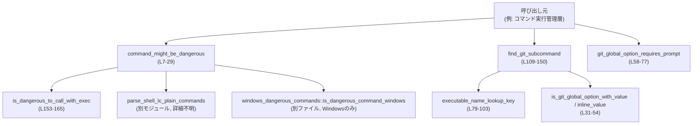
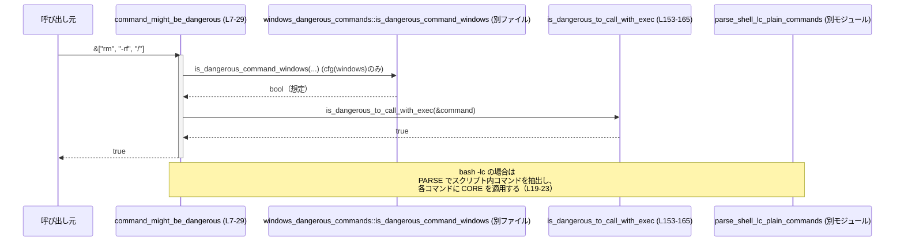

# shell-command/src/command_safety/is_dangerous_command.rs コード解説

## 0. ざっくり一言

シェルコマンド（`Vec<String>`）が「危険なコマンド」かどうかを静的に判定するユーティリティと、Git コマンドのグローバルオプション・サブコマンド解析用のヘルパーを提供するモジュールです（is_dangerous_command.rs:L7-29, L31-77, L79-150）。

---

## 1. このモジュールの役割

### 1.1 概要

- このモジュールは、**ユーザーに自動承認してよいか判断するためにコマンドの安全性をチェックする**ために存在します。
- 主に以下を行います。
  - `rm -f` や `rm -rf` など、明らかに危険な削除コマンドの検出（is_dangerous_command.rs:L153-158）。
  - `bash -lc "<script>"` のようなシェルラッパー内の危険コマンド検出（is_dangerous_command.rs:L19-25）。
  - Git のグローバルオプションやサブコマンド位置の解析（is_dangerous_command.rs:L31-77, L105-150）。
  - Windows 固有の危険コマンド検出の委譲（is_dangerous_command.rs:L3-5, L8-12）。

### 1.2 アーキテクチャ内での位置づけ

このファイル単体で見える依存関係を示します。



- 危険コマンド判定の公開エントリポイントは `command_might_be_dangerous` です（is_dangerous_command.rs:L7-29）。
- Git 関連の解析エントリポイントは `find_git_subcommand` と `git_global_option_requires_prompt` です（is_dangerous_command.rs:L58-77, L109-150）。
- どの関数も外部状態を持たない純粋な関数として実装されています。

### 1.3 設計上のポイント

- **純粋関数中心**  
  すべての関数は引数のみを読み取り、グローバル状態を参照・更新しません。これによりスレッドセーフで予測可能な動作になります（全体）。
- **プラットフォーム依存コードの分離**  
  Windows 固有の危険コマンド判定は `windows_dangerous_commands` モジュールに切り出され、`#[cfg(windows)]` で切り替えられます（is_dangerous_command.rs:L3-12, L79-103）。
- **安全なインデックスアクセス**  
  `command.get(1)` や `first()` など、境界チェック付き API を使用し、スライスの範囲外アクセスによる panic を避けています（is_dangerous_command.rs:L113-115, L153-158）。
- **Git オプション処理の共通化**  
  Git グローバルオプションに関する処理を複数の小さな関数に分割し、サブコマンド検出とプロンプト要否判定で共有しています（is_dangerous_command.rs:L31-54, L58-77, L109-150）。
- **非同期・並行性の要素なし**  
  非同期 (`async`) やスレッド生成はなく、並行処理に関する同期やロック等は発生しません。

### 1.4 関数・モジュール一覧（コンポーネントインベントリー）

| 名前 | 種別 | 可視性 | 役割 / 用途 | 行範囲（根拠） |
|------|------|--------|-------------|----------------|
| `windows_dangerous_commands` | モジュール | private（cfg(windows)） | Windows 固有の危険コマンド判定を提供（詳細は別ファイル） | is_dangerous_command.rs:L3-5 |
| `command_might_be_dangerous` | 関数 | `pub` | コマンド全体が危険かどうかの総合判定エントリポイント | is_dangerous_command.rs:L7-29 |
| `is_git_global_option_with_value` | 関数 | private | Git グローバルオプションで「次の引数が値」になるものの判定 | is_dangerous_command.rs:L31-42 |
| `is_git_global_option_with_inline_value` | 関数 | private | Git グローバルオプションの「引数内に値を含む」形の判定 | is_dangerous_command.rs:L44-54 |
| `git_global_option_requires_prompt` | 関数 | `pub(crate)` | 自動承認せずユーザー確認が必要な Git グローバルオプションかどうかの判定 | is_dangerous_command.rs:L56-77 |
| `executable_name_lookup_key` | 関数 | `pub(crate)` | 実行ファイルパスから名前キー（拡張子等を正規化したもの）を取り出す | is_dangerous_command.rs:L79-103 |
| `find_git_subcommand` | 関数 | `pub(crate)` | Git コマンド列から最初のサブコマンド位置・文字列を抽出 | is_dangerous_command.rs:L105-150 |
| `is_dangerous_to_call_with_exec` | 関数 | private | `exec` 系呼び出しで危険なサブセット（rm, sudo）の検査 | is_dangerous_command.rs:L153-165 |
| `tests` モジュール | モジュール | `cfg(test)` | 危険コマンド判定のユニットテストを格納 | is_dangerous_command.rs:L167-184 |
| `vec_str` | 関数 | private（test） | `&[&str]` から `Vec<String>` を作るテスト用ヘルパー | is_dangerous_command.rs:L171-173 |
| `rm_rf_is_dangerous` | 関数 | `#[test]` | `rm -rf /` が危険と判定されることのテスト | is_dangerous_command.rs:L175-178 |
| `rm_f_is_dangerous` | 関数 | `#[test]` | `rm -f /` が危険と判定されることのテスト | is_dangerous_command.rs:L180-183 |

---

## 2. 主要な機能一覧

- 危険コマンド判定: `command_might_be_dangerous` により、`rm -f`/`rm -rf` などの危険コマンドや `bash -lc` 経由のスクリプト内コマンドを検査（is_dangerous_command.rs:L7-29, L153-165）。
- Windows 固有の危険コマンド判定: Windows の場合に別モジュールへ委譲して追加チェック（is_dangerous_command.rs:L3-5, L8-12）。
- Git グローバルオプション判定: `git_global_option_requires_prompt` により、コンフィグやリポジトリ探索を変更するオプションを検出（is_dangerous_command.rs:L56-77）。
- 実行ファイル名の正規化: `executable_name_lookup_key` により、パス・拡張子・大小文字の差異を吸収して名前を取り出す（is_dangerous_command.rs:L79-103）。
- Git サブコマンド検出: `find_git_subcommand` により、グローバルオプションをスキップしながら最初のサブコマンドを見つける（is_dangerous_command.rs:L105-150）。

---

## 3. 公開 API と詳細解説

### 3.1 型一覧（構造体・列挙体など）

このファイル内で新規に定義されている構造体・列挙体はありません。  
公開インターフェースは関数のみです。

---

### 3.2 関数詳細

#### `pub fn command_might_be_dangerous(command: &[String]) -> bool`

**概要**

- 与えられたコマンド列（`&[String]`）が危険なコマンドを含むかどうかを判定します（is_dangerous_command.rs:L7-29）。
- Windows 固有のチェック、直接の危険コマンドチェック、`bash -lc` スクリプト内チェックの三段階で検査します。

**引数**

| 引数名 | 型 | 説明 |
|--------|----|------|
| `command` | `&[String]` | 実行予定のコマンドと引数の配列。`command[0]` がコマンド名、以降が引数を表す前提です。 |

**戻り値**

- `bool`:  
  - `true` : 危険とみなされるコマンドが見つかった場合。  
  - `false`: 現在のロジックの範囲では危険と判断されない場合。

**内部処理の流れ**

（is_dangerous_command.rs:L7-29 を根拠）

1. Windows の場合のみ `windows_dangerous_commands::is_dangerous_command_windows(command)` を呼び、`true` なら即座に `true` を返します（L8-12）。
2. `is_dangerous_to_call_with_exec(command)` を呼び、危険なトップレベルコマンド（`rm`, `sudo` 経由の `rm` 等）があれば `true` を返します（L15-17, L153-165）。
3. `parse_shell_lc_plain_commands(command)` を呼び出し、`bash -lc "..."` のような形式であればスクリプト内のコマンド列 `all_commands` を取得します（L19-21）。
4. `all_commands.iter().any(|cmd| is_dangerous_to_call_with_exec(cmd))` により、スクリプト内の各コマンドについても `is_dangerous_to_call_with_exec` を適用し、1つでも危険なら `true` を返します（L21-23）。
5. 上記いずれにも該当しなかった場合 `false` を返します（L28）。

**Examples（使用例）**

単純な `rm -rf /` の危険判定例です。

```rust
use shell_command::command_safety::is_dangerous_command::command_might_be_dangerous;

// ["rm", "-rf", "/"] を Vec<String> に変換
let cmd: Vec<String> = ["rm", "-rf", "/"].iter().map(|s| s.to_string()).collect();

let dangerous = command_might_be_dangerous(&cmd);
assert!(dangerous); // rm -rf は危険と判定される
```

`bash -lc` でラップされたコマンドの例（`parse_shell_lc_plain_commands` の挙動に依存します）。

```rust
use shell_command::command_safety::is_dangerous_command::command_might_be_dangerous;

let cmd: Vec<String> = ["bash", "-lc", "rm -rf /"].iter().map(|s| s.to_string()).collect();

let dangerous = command_might_be_dangerous(&cmd);
// parse_shell_lc_plain_commands が ["rm", "-rf", "/"] を抽出すれば true になる
```

`parse_shell_lc_plain_commands` の詳細はこのチャンクには現れないため、具体的な抽出結果は不明です。

**Errors / Panics**

- この関数自身は `Result` を返さず、内部でも `unwrap` 等を使用していません。
- スライスへの直接インデックスアクセスは行わず、`first()` などを使う関数に処理を委譲しているため、通常の入力で panic が発生する条件は見当たりません（is_dangerous_command.rs:L7-29, L153-165）。

**Edge cases（エッジケース）**

- `command` が空 (`&[]`) の場合:  
  - `windows_dangerous_commands` 側の挙動は不明ですが、`is_dangerous_to_call_with_exec` は `None` をマッチして `_ => false` を返します（L153-165）。  
  - `parse_shell_lc_plain_commands` の挙動は不明ですが、`None` ならば `if let Some(...)` に入らず `false` になります（L19-25）。
- `rm` だが `-f` も `-rf` も付いていない場合（例: `["rm", "file"]`）: 危険とは判定されません（`is_dangerous_to_call_with_exec` のマッチ条件に該当しないため、L157-158）。
- `sudo` のみ（例: `["sudo"]`）: 再帰呼び出しでは空スライスになり、最終的に `false` になります（L159-161, L153-165）。
- Windows での `command` 内容: Windows 固有チェックは別モジュールに委譲されるため、このチャンクからは詳細な挙動は分かりません（is_dangerous_command.rs:L3-5, L8-12）。

**使用上の注意点**

- この関数は「危険そうなコマンドの一部」を検出するものであり、**すべての危険なコマンドパターンを網羅しているわけではありません**。例えば `rm -r` や `git clean` などは、このチャンクで確認できる範囲では検出対象ではありません（is_dangerous_to_call_with_exec のマッチ条件が `"-f" | "-rf"` のみであるため、L157-158）。
- `bash -lc` 以外のシェルラッパー（`sh -c` 等）はこのチャンクからはサポートされていないように見えます（該当コードがないため）。
- 誤検出（「安全だが危険と判定」）よりも「見逃し（危険だが安全と判定）」の方が安全上問題になるため、この関数の結果だけに依存せず、別の保護策と組み合わせる設計が必要になる可能性があります（一般的なセキュリティ観点）。

---

#### `fn is_dangerous_to_call_with_exec(command: &[String]) -> bool`

**概要**

- `exec` 系の低レベルな実行コンテキストで危険とみなしたいサブセット（現状は `rm -f`, `rm -rf` と、それを `sudo` 経由で呼び出す場合）の検査を行います（is_dangerous_command.rs:L153-165）。
- `command_might_be_dangerous` から内部的に利用されます（L15-17）。

**引数**

| 引数名 | 型 | 説明 |
|--------|----|------|
| `command` | `&[String]` | コマンドと引数の配列。`command[0]` がコマンド名。 |

**戻り値**

- `bool`: 危険とみなす場合 `true`、そうでなければ `false`。

**内部処理の流れ**

（is_dangerous_command.rs:L153-165 を根拠）

1. `command.first().map(String::as_str)` で先頭引数を `Option<&str>` として取得（L153-155）。
2. `match` により以下のパターンを判定（L156-163）。
   - `Some("rm")` の場合:  
     2番目の引数を `command.get(1).map(String::as_str)` で取得し、`Some("-f" | "-rf")` のとき `true` を返す（L157-158）。
   - `Some("sudo")` の場合:  
     残りの引数スライス `&command[1..]` を再帰的に `is_dangerous_to_call_with_exec` に渡し、その結果を返す（L159-161）。
   - それ以外 (`None` を含む): `false` を返す（L162-163）。

**Examples（使用例）**

```rust
use shell_command::command_safety::is_dangerous_command::command_might_be_dangerous;

let cmd: Vec<String> = ["sudo", "rm", "-rf", "/"].iter().map(|s| s.to_string()).collect();
assert!(command_might_be_dangerous(&cmd)); // sudo 経由でも rm -rf を検出
```

**Errors / Panics**

- `&command[1..]` は `command` が少なくとも 1 要素を持つ場合にのみ評価されますが、`match` で `Some("sudo")` にマッチするためには `first()` が `Some` を返す必要があり、その場合 `command.len() >= 1` が必ず成り立ちます。したがって範囲外アクセスにはなりません（L153-161）。
- その他の部分でも範囲チェック付きのアクセス (`get`) のみを使用しており、panic 条件は見当たりません。

**Edge cases**

- `["rm"]` の場合: 2番目の引数が存在しないため `command.get(1)` は `None` になり、`false` になります（L157-158）。
- `["sudo"]` の場合: 再帰呼び出しには空スライスが渡され、最終的に `_ => false` になります（L159-163）。
- `["sudo", "sudo", "rm", "-rf", "/"]` のように `sudo` が重なっても、再帰が複数回行われ、最内側の `rm -rf` が検出されれば `true` になります（L159-161）。
- `rm` 以外の危険なコマンド（例: `mkfs`）は、この関数では検出されません。

**使用上の注意点**

- `rm` のオプション判定が `-f` / `-rf` に限定されています。`rm -r` や `rm -rfv` など、バリエーションが多様な環境では、**検出漏れが起こり得る**ことに注意が必要です（is_dangerous_command.rs:L157-158）。
- この関数は `pub` ではないため、直接呼び出すのではなく `command_might_be_dangerous` を通じて利用する想定です（可視性と使用箇所からの推測）。

---

#### `pub(crate) fn git_global_option_requires_prompt(arg: &str) -> bool`

**概要**

- Git のグローバルオプションのうち、**設定ファイル・リポジトリ・ヘルパーの参照先を変更し得るもの**を検出し、自動承認せずユーザーに確認すべきかどうかを判定します（is_dangerous_command.rs:L56-77）。
- 主な対象は `-c`, `--config-env`, `--git-dir` などです。

**引数**

| 引数名 | 型 | 説明 |
|--------|----|------|
| `arg` | `&str` | Git コマンド列中の 1 引数（例: `"-c"`, `"--git-dir=foo/.git"`）。 |

**戻り値**

- `bool`:  
  - `true` : プロンプトが必要とされるグローバルオプション。  
  - `false`: それ以外。

**内部処理の流れ**

（is_dangerous_command.rs:L58-76 を根拠）

1. `matches!` を用いて、引数が以下のいずれかかどうかを判定します（L59-66）。
   - `"-c"`, `"--config-env"`, `"--exec-path"`, `"--git-dir"`, `"--namespace"`, `"--super-prefix"`, `"--work-tree"`.
2. あるいは「インライン値を含む」形かどうかを判定します（L68-75）。
   - `s.starts_with("-c") && s.len() > 2`（例: `-cuser.name=foo`）
   - `--config-env=...`, `--exec-path=...`, `--git-dir=...`, `--namespace=...`, `--super-prefix=...`, `--work-tree=...` の各種。

**Examples（使用例）**

```rust
use shell_command::command_safety::is_dangerous_command::git_global_option_requires_prompt;

assert!(git_global_option_requires_prompt("-c"));
assert!(git_global_option_requires_prompt("--git-dir=alt/.git"));
assert!(!git_global_option_requires_prompt("--help")); // 対象外
```

**Errors / Panics**

- 単純な文字列判定のみで、panic になりうる箇所はありません。

**Edge cases**

- `"-cfoo"` のように `-c` に続いてすぐ値が続く形式は `s.len() > 2` により `true` となります（L69）。
- `"-c"` 単体も `"-c"` マッチにより `true` です（L61）。
- `"-C"`（大文字）はここでの対象外です。`is_git_global_option_with_value` では `"-C"` を扱っていますが、本関数では含まれていません（L34 vs L61）。  
  これはコメントにある「config, repository, or helper lookup のリダイレクト」が目的で、カレントディレクトリ変更 `-C` は対象外という設計と解釈できます（コメント L56-57 を根拠にした推測）。

**使用上の注意点**

- この関数は「プロンプトが必要なオプションかどうか」だけを返すため、Git コマンド全体の安全性を判断するものではありません。
- 新しい Git グローバルオプションが追加された場合は、このリストを更新しない限り検出されません。

---

#### `pub(crate) fn executable_name_lookup_key(raw: &str) -> Option<String>`

**概要**

- 実行ファイルのパスから、**比較や判定に使いやすい正規化された名前キー**を取り出します（is_dangerous_command.rs:L79-103）。
- Windows と非 Windows で振る舞いが異なります。

**引数**

| 引数名 | 型 | 説明 |
|--------|----|------|
| `raw` | `&str` | 実行ファイルへのパスまたは名前（例: `"git"`, `"C:\\Program Files\\Git\\cmd\\git.exe"`）。 |

**戻り値**

- `Option<String>`:
  - `Some(key)`: ファイル名部分が抽出できた場合の正規化済み名前。
  - `None`: パスからファイル名が取得できない場合（例: 空文字列やルートパスのみ）。

**内部処理の流れ**

（is_dangerous_command.rs:L79-103 を根拠）

- 共通:
  1. `Path::new(raw).file_name().and_then(|name| name.to_str())` でパス末尾のファイル名を UTF-8 文字列として取得し、`Option<&str>` とする（L82-85, L98-101）。
- Windows（`#[cfg(windows)]`）:
  2. 取得したファイル名を小文字化し `name.to_ascii_lowercase()`（L86）。
  3. `[".exe", ".cmd", ".bat", ".com"]` のいずれかの拡張子が末尾についていればそれを除去し、その結果を `String` として返します（L87-90）。
  4. いずれの拡張子も付いていなければ小文字化した名前全体を返します（L92-93）。
- 非 Windows（`#[cfg(not(windows))]`）:
  2. 抽出したファイル名を `ToOwned::to_owned` で `String` に変換し、そのまま返します（L98-101）。

**Examples（使用例）**

```rust
use shell_command::command_safety::is_dangerous_command::executable_name_lookup_key;

// 非 Windows 例（Windows では小文字・拡張子除去になる点のみ異なる）
assert_eq!(
    executable_name_lookup_key("git"),
    Some("git".to_string())
);

assert_eq!(
    executable_name_lookup_key("/usr/bin/git"),
    Some("git".to_string())
);
```

Windows での具体的な挙動はこのチャンクから推測できますが、実際にコンパイルされるコードは `#[cfg(windows)]` ブロック内です（L80-94）。

**Errors / Panics**

- `Path::new`, `file_name`, `to_str`, `map` などは失敗時に `None` を返すのみであり、panic は発生しません。

**Edge cases**

- `raw` が空文字列の場合: `file_name` が `None` となり、`None` が返されます。
- ディレクトリパスで末尾にファイル名がない場合（例: `"/usr/bin/"`）も `file_name` が `None` となる可能性があり、その場合 `None` を返します。
- Windows で `.EXE` など大文字の拡張子も、小文字化後に `.exe` と一致するため除去されます（L86-87）。

**使用上の注意点**

- Git コマンド検出では `"git"` であるかどうかの判定に利用されています（`find_git_subcommand` 内、L113-115）。
- パスが不正であったりファイル名部分がない場合は `None` になることがあるため、呼び出し側は `Option` を考慮する必要があります。

---

#### `pub(crate) fn find_git_subcommand<'a>(command: &'a [String], subcommands: &[&str]) -> Option<(usize, &'a str)>`

**概要**

- `git` コマンドラインのトークン列から、最初に現れるサブコマンド（例: `clone`, `push` など）の位置と文字列を検出します（is_dangerous_command.rs:L105-150）。
- Git グローバルオプション（`-C`, `-c`, `--git-dir` 等）を先頭からスキップし、それ以外のオプションも無視します。

**引数**

| 引数名 | 型 | 説明 |
|--------|----|------|
| `command` | `&'a [String]` | Git コマンド全体のトークン列（例: `["git", "-C", "repo", "clone", "url"]`）。 |
| `subcommands` | `&[&str]` | 対象としたいサブコマンド名のリスト（例: `&["clone", "push"]`）。 |

**戻り値**

- `Option<(usize, &'a str)>`:
  - `Some((index, subcmd))`: 最初に見つかった対象サブコマンドのインデックスと文字列。
  - `None`: 対象のサブコマンドが見つからない、またはコマンド自体が `git` ではない場合。

**内部処理の流れ**

（is_dangerous_command.rs:L109-150 を根拠）

1. `command.first().map(String::as_str)?` で先頭トークンを取得し、`cmd0` とする。`None` の場合は早期 `None`（L113）。
2. `executable_name_lookup_key(cmd0).as_deref() != Some("git")` なら `None` を返し、`git` コマンドのみを対象とする（L114-115）。
3. `skip_next` フラグを `false` で初期化（L118）。
4. `command.iter().enumerate().skip(1)` で 2 番目以降の引数を順に処理（L119）。
   - `skip_next` が `true` の場合は 1 回だけスキップして `skip_next = false` に戻す（L120-123）。
   - `arg = arg.as_str()` で `&str` に変換（L125）。
   - `is_git_global_option_with_inline_value(arg)` が `true` なら、次のトークンを消費せずに `continue`（L127-129）。
   - `is_git_global_option_with_value(arg)` が `true` なら、`skip_next = true` にして「次のトークンは値」としてスキップ（L131-133）。
   - `arg == "--"` または `arg.starts_with('-')` の場合は一般的なオプションとして `continue`（L136-137）。
   - それ以外は「非オプションの最初のトークン」とみなし、`subcommands.contains(&arg)` なら `Some((idx, arg))` を返す（L140-142）。
   - 対象サブコマンドでない場合はコメントの通り、「以降は位置引数とみなされる」ため `None` を返して探索を終了（L144-147）。
5. ループを抜けた場合（サブコマンドが見つからない場合）は `None`（L150）。

**Examples（使用例）**

```rust
use shell_command::command_safety::is_dangerous_command::find_git_subcommand;

let cmd: Vec<String> = ["git", "-C", "repo", "clone", "url"]
    .iter().map(|s| s.to_string()).collect();

let sub = find_git_subcommand(&cmd, &["clone", "push"]);
assert_eq!(sub, Some((3, "clone")));
```

グローバルオプションが複数含まれている例:

```rust
let cmd: Vec<String> = ["git", "-c", "user.name=foo", "--git-dir=alt/.git", "status"]
    .iter().map(|s| s.to_string()).collect();

let sub = find_git_subcommand(&cmd, &["status"]);
assert_eq!(sub, Some((4, "status")));
```

**Errors / Panics**

- スライスへのインデックス付きアクセスは `enumerate().skip(1)` だけであり、境界はイテレータが管理するため panic の可能性はありません（L119-150）。
- `executable_name_lookup_key` が `None` を返した場合は `as_deref() != Some("git")` で `None` を返すだけであり、panic はありません（L113-115）。

**Edge cases**

- `command` が空、または `command[0]` が `git` でない場合: 即座に `None` となります（L113-115）。
- `["git", "branch", "-D", "main"]` のように、最初の非オプションが `subcommands` に含まれない場合: コメントにある通り、この時点で `return None` となり、後続の位置引数（例: `main`）はサブコマンドとは見なされません（L144-147）。
- `subcommands` が空配列の場合: 一致するサブコマンドがないため常に `None` です。
- `--` 以降のトークン: `arg == "--" || arg.starts_with('-')` の条件により `--` 自体はスキップ対象ですが、その後のトークンは「非オプション」として扱われます。最初に現れた非オプションが `subcommands` にあればマッチします（L136-142）。

**使用上の注意点**

- 「関心のあるサブコマンド」だけを `subcommands` に渡す前提で設計されており、それ以外のサブコマンドが現れた場合は `None` になります。この挙動はコメントにある「later positional args を誤認しないため」と一致します（L144-147）。
- `executable_name_lookup_key` によって `"git.exe"`, `"GIT"` のような表記揺れも `"git"` として扱われる設計になっています（L113-115, L79-94）。

---

#### `fn is_git_global_option_with_value(arg: &str) -> bool`

**概要**

- Git グローバルオプションのうち、「**次の引数に値が入る**」形式のものかどうかを判定します（is_dangerous_command.rs:L31-42）。
- `find_git_subcommand` の中で、次の引数をスキップするために使用されます（L131-133）。

**引数**

| 引数名 | 型 | 説明 |
|--------|----|------|
| `arg` | `&str` | Git コマンドの 1 引数（例: `"-C"`, `"--git-dir"`）。 |

**戻り値**

- `bool`: 対象のオプションであれば `true`。

**内部処理の流れ**

- `matches!` を使い、`arg` が以下のいずれかであれば `true` を返します（is_dangerous_command.rs:L32-41）。
  - `"-C"`, `"-c"`, `"--config-env"`, `"--exec-path"`, `"--git-dir"`, `"--namespace"`, `"--super-prefix"`, `"--work-tree"`。

**使用上の注意点**

- インライン値形式（`--git-dir=alt/.git` や `-Cpath`）は別関数 `is_git_global_option_with_inline_value` で判定されるため、ここでは扱いません（L44-54）。
- この関数はファイル内でのみ使われるヘルパーです（`pub` ではない）。

---

#### `fn is_git_global_option_with_inline_value(arg: &str) -> bool`

**概要**

- Git グローバルオプションのうち、「**引数自身の中に値を含む**」形式（例: `--git-dir=alt/.git`, `-Cpath`）かどうかを判定します（is_dangerous_command.rs:L44-54）。

**引数 / 戻り値**

- `arg: &str` — 1 引数。
- `bool` — 対象オプションであれば `true`。

**内部処理の流れ**

（is_dangerous_command.rs:L45-53 を根拠）

- `matches!` のガードパターンで、以下の条件のいずれかに合致するか判定します。
  - `s.starts_with("--config-env=")`  
  - `s.starts_with("--exec-path=")`  
  - `s.starts_with("--git-dir=")`  
  - `s.starts_with("--namespace=")`  
  - `s.starts_with("--super-prefix=")`  
  - `s.starts_with("--work-tree=")`  
- あるいは `((arg.starts_with("-C") || arg.starts_with("-c")) && arg.len() > 2)` により、`-Cpath` や `-cuser.name=foo` のように短いオプション名に値が続く形を検出します（L53）。

**使用上の注意点**

- `find_git_subcommand` 内では「この引数だけで完結している値付きグローバルオプション」として扱われ、次の引数をスキップしない点が `is_git_global_option_with_value` と異なります（L127-129）。
- 対象となるオプションは Git の仕様に依存するため、新しい形式が追加された場合はここを更新する必要があります。

---

### 3.3 その他の関数

| 関数名 | 役割（1 行） | 根拠 |
|--------|--------------|------|
| `vec_str(items: &[&str]) -> Vec<String>` | テストコード内で `&[&str]` から `Vec<String>` を生成するヘルパー関数 | is_dangerous_command.rs:L171-173 |

---

## 4. データフロー

### 4.1 危険コマンド判定の処理フロー

`command_might_be_dangerous` が呼び出されてから、実際に危険と判定されるまでの代表的な流れ（`rm -rf /`）を示します。



- Windows では、Windows 固有のチェックと共通チェックが両方実行されます（is_dangerous_command.rs:L8-17）。
- `bash -lc` 形式の場合、`parse_shell_lc_plain_commands` の戻り値が存在すればスクリプト内の全コマンドに対して `is_dangerous_to_call_with_exec` が適用されます（L19-23）。

### 4.2 Git サブコマンド検出の処理フロー

`find_git_subcommand` による Git サブコマンド検出のフローを示します。

```mermaid
sequenceDiagram
    participant Caller as 呼び出し元
    participant FIND as find_git_subcommand (L109-150)
    participant KEY as executable_name_lookup_key (L79-103)
    participant OPTV as is_git_global_option_with_value (L31-42)
    participant OPTI as is_git_global_option_with_inline_value (L44-54)

    Caller->>FIND: command, subcommands
    activate FIND
    FIND->>KEY: executable_name_lookup_key(command[0])
    KEY-->>FIND: Some("git") or None
    alt 先頭がgitでない
        FIND-->>Caller: None
        deactivate FIND
    else gitのとき
        loop 各引数 (idx >= 1)
            FIND->>OPTI: is_git_global_option_with_inline_value(arg)
            OPTI-->>FIND: bool
            alt inline value option
                FIND-->>FIND: continue
            else
                FIND->>OPTV: is_git_global_option_with_value(arg)
                OPTV-->>FIND: bool
                alt option with separate value
                    FIND-->>FIND: skip_next = true
                else その他の引数
                    alt arg が "-" 始まりまたは "--"
                        FIND-->>FIND: continue
                    else 最初の非オプション
                        alt arg ∈ subcommands
                            FIND-->>Caller: Some((idx, arg))
                        else
                            FIND-->>Caller: None
                        end
                        deactivate FIND
                    end
                end
            end
        end
        FIND-->>Caller: None
        deactivate FIND
    end
```

- グローバルオプション（値あり・値インライン）をきちんとスキップすることで、サブコマンドの位置を正しく特定します（is_dangerous_command.rs:L118-135）。
- 最初の非オプションが対象外のサブコマンドだった場合はそこで探索を打ち切ります（L144-147）。

---

## 5. 使い方（How to Use）

### 5.1 基本的な使用方法

#### 危険コマンド判定を挟んでから実行する

```rust
use std::process::Command;
use shell_command::command_safety::is_dangerous_command::command_might_be_dangerous;

fn run_safe_command(raw: &[&str]) {
    // &[&str] から Vec<String> を作成
    let cmd: Vec<String> = raw.iter().map(|s| s.to_string()).collect();

    // 実行前に危険判定
    if command_might_be_dangerous(&cmd) {
        // 実装者側ポリシーにより、拒否・再確認などを行う
        eprintln!("危険なコマンドのため実行しません: {:?}", cmd);
        return;
    }

    // 実行（ここでは単純な例）
    let status = Command::new(&cmd[0]).args(&cmd[1..]).status().unwrap();
    println!("status: {:?}", status);
}
```

### 5.2 よくある使用パターン

#### Git コマンドのサブコマンドに応じてポリシーを変える

```rust
use shell_command::command_safety::is_dangerous_command::find_git_subcommand;

fn is_safe_git_command(cmd: &[String]) -> bool {
    // ここでは clone と push を特別扱いしたい例
    if let Some((_idx, subcmd)) = find_git_subcommand(cmd, &["clone", "push"]) {
        match subcmd {
            "clone" => {
                // clone の場合の制限ロジック
                true
            }
            "push" => {
                // push の場合の制限ロジック
                false
            }
            _ => true,
        }
    } else {
        // 対象外のサブコマンドは別ポリシー
        true
    }
}
```

#### Git グローバルオプションに対して警告を出す

```rust
use shell_command::command_safety::is_dangerous_command::git_global_option_requires_prompt;

fn contains_sensitive_git_global_option(args: &[String]) -> bool {
    args.iter()
        .any(|a| git_global_option_requires_prompt(a.as_str()))
}
```

### 5.3 よくある間違い

```rust
use shell_command::command_safety::is_dangerous_command::command_might_be_dangerous;

// 間違い例: 生の文字列をそのまま渡そうとしている
// let dangerous = command_might_be_dangerous(&["rm".to_string(), "-rf".to_string(), "/".to_string()]);
// ↑ &["String"; N] ではなく、&[String] のスライスが必要

// 正しい例: Vec<String> を作成し、そのスライスを渡す
let cmd: Vec<String> = ["rm", "-rf", "/"].iter().map(|s| s.to_string()).collect();
let dangerous = command_might_be_dangerous(&cmd);
assert!(dangerous);
```

```rust
use shell_command::command_safety::is_dangerous_command::find_git_subcommand;

// 間違い例: git 以外のコマンドでも find_git_subcommand を前提に処理
fn bad(cmd: &[String]) {
    if let Some((_idx, subcmd)) = find_git_subcommand(cmd, &["status"]) {
        println!("git サブコマンド: {subcmd}");
    }
    // cmd[0] が git でないとき、常に None になる。前提を満たさない。
}

// 正しい例: 先頭が git かどうかを事前に確認するか、None を正しく扱う
fn good(cmd: &[String]) {
    if let Some((_idx, subcmd)) = find_git_subcommand(cmd, &["status"]) {
        println!("git サブコマンド: {subcmd}");
    } else {
        println!("git status ではない、または git コマンドではない");
    }
}
```

### 5.4 使用上の注意点（まとめ）

- **前提条件**
  - コマンドトークン列は `"プログラム名", "引数1", ...` の順で `Vec<String>` として与える必要があります。
  - Git 関連関数は `command[0]` が Git バイナリを指していることを前提にしています（`executable_name_lookup_key` の結果が `"git"` であることを確認、L113-115）。
- **禁止事項 / 注意事項**
  - `command_might_be_dangerous` の結果だけに全面的に依存すると、検出されていない危険コマンドを許可してしまう可能性があります。
  - Git オプション関連の関数は、Git の仕様変更や新オプション追加に追随して更新する必要があります。
- **スレッド安全性**
  - どの関数も外部状態を持たず、引数の読み取りのみを行うため、**同じ `Vec<String>` を複数スレッドから共有して読み取り専用で呼び出す場合も安全**です（Rust の不変借用の性質による）。

---

## 6. 変更の仕方（How to Modify）

### 6.1 新しい危険コマンドを追加する場合

1. **エントリポイントの確認**  
   - 危険コマンド判定の中心は `is_dangerous_to_call_with_exec`（is_dangerous_command.rs:L153-165）です。
2. **パターン追加**  
   - `match cmd0` の分岐に、新しいコマンド名と判定ロジックを追加します。
   - 例: `Some("mkfs") => true` のように追加すれば、そのコマンド全体を危険とみなせます。
3. **`sudo` 経由の呼び出し**  
   - `Some("sudo")` 分岐が再帰するため、トップレベルと同じロジックが適用されます（L159-161）。
4. **bash スクリプト内への適用**  
   - `command_might_be_dangerous` から `is_dangerous_to_call_with_exec` が呼ばれるため、新しいパターンは `bash -lc` スクリプト内にも自動的に適用されます（L15-17, L19-23）。

### 6.2 Git オプションやサブコマンド解析を変更する場合

- **グローバルオプションの追加・変更**
  - 「次の引数が値」の形式は `is_git_global_option_with_value` に追加します（L31-42）。
  - 「引数内に値を含む」形式は `is_git_global_option_with_inline_value` に追加します（L44-54）。
  - プロンプト要否の判定は `git_global_option_requires_prompt` を更新します（L58-76）。
- **サブコマンド検出ロジック**
  - 非オプションとして扱う条件（`arg == "--" || arg.starts_with('-')`）や、探索打ち切りの条件（L136-147）を変更する場合は、Git の CLI 仕様と照らし合わせる必要があります。

### 6.3 変更時に注意すべき契約

- **`command_might_be_dangerous` の契約**
  - 「`true` なら危険」という意味は変えないことが望ましいです。挙動変更は呼び出し側のポリシーに影響します。
- **`find_git_subcommand` の契約**
  - 返り値 `Option<(usize, &str)>` において、インデックスは `command` スライスに対する位置であることが前提です（L109-112, L140-142）。
  - 最初の非オプションが対象外サブコマンドであれば探索を打ち切るという挙動（L144-147）は、branch などの位置引数を誤検出しないための仕様です。変更する場合は慎重な検討が必要です。

---

## 7. 関連ファイル

| パス / シンボル | 役割 / 関係 |
|----------------|------------|
| `shell-command/src/command_safety/windows_dangerous_commands.rs` | `#[cfg(windows)]` でインクルードされる Windows 固有の危険コマンド判定ロジック。`is_dangerous_command_windows` を提供すると思われますが、このチャンクには定義が現れないため詳細は不明です（is_dangerous_command.rs:L3-5, L8-12）。 |
| `crate::bash::parse_shell_lc_plain_commands` | `bash -lc "..."` 形式のコマンド列から内部のプレーンコマンド列を抽出する関数として使用されていますが、このチャンクには定義がなく、具体的なパース仕様は不明です（is_dangerous_command.rs:L1, L19-23）。 |
| `is_safe_command`（コメント中の識別子） | `find_git_subcommand` のコメントで「Shared with `is_safe_command`」と言及されている関数ですが、このファイルには定義がなく、別ファイルに存在すると考えられます（is_dangerous_command.rs:L108）。 |
| `tests` モジュール（本ファイル内） | `command_might_be_dangerous` の挙動を検証するユニットテストを提供します（`rm -rf` / `rm -f` の検出）（is_dangerous_command.rs:L167-184）。 |

以上が、このファイルに基づいて把握できる構造と振る舞いです。このチャンクに現れない外部関数・モジュールの詳細については、「不明」としました。
