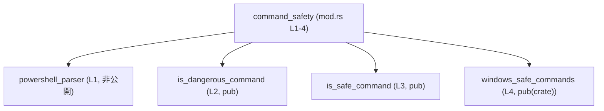
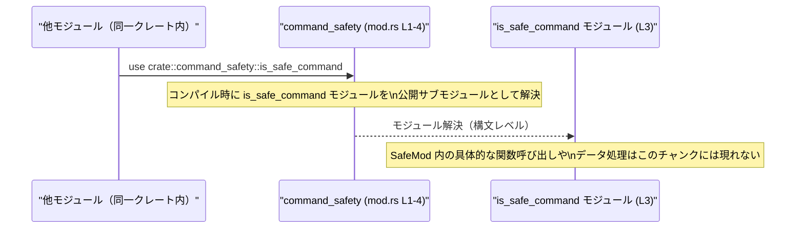

# shell-command/src/command_safety/mod.rs コード解説

## 0. ざっくり一言

`shell-command/src/command_safety/mod.rs` は、シェルコマンドの安全性判定に関するサブモジュールをまとめ、可視性（公開範囲）を定義する「入り口（ルート）モジュール」です（根拠: `shell-command/src/command_safety/mod.rs:L1-4`）。

---

## 1. このモジュールの役割

### 1.1 概要

- このモジュールは `command_safety` モジュールのルートとして、4 つのサブモジュールを宣言しています（根拠: L1-4）。
- そのうち 2 つは外部公開（`pub`）、1 つはクレート内限定公開（`pub(crate)`）、1 つは完全に内部専用（修飾子なし）です（根拠: L1-4）。
- 自身では関数や型を定義せず、**モジュール構成と可視性の制御のみ**を行っています（根拠: 関数・型定義が存在しないことから）。

### 1.2 アーキテクチャ内での位置づけ

- ファイルパス `src/command_safety/mod.rs` から、このファイルはクレート内の `command_safety` というトップレベルモジュールを定義していると解釈できます（Rust のモジュール規則に基づく）。
- `command_safety` モジュールは、以下のサブモジュールを持つハブとして振る舞います（根拠: L1-4）。

| サブモジュール名          | 可視性        | 根拠 |
|--------------------------|---------------|------|
| `powershell_parser`      | 非公開        | `mod powershell_parser;`（L1） |
| `is_dangerous_command`   | `pub`（公開） | `pub mod is_dangerous_command;`（L2） |
| `is_safe_command`        | `pub`（公開） | `pub mod is_safe_command;`（L3） |
| `windows_safe_commands`  | `pub(crate)`  | `pub(crate) mod windows_safe_commands;`（L4） |

この関係をモジュールレベルの依存関係図として表すと、次のようになります。



> この図は「モジュール宣言上の依存（どのモジュールを内包しているか）」のみを表し、**関数呼び出しやデータの流れは、このチャンクの情報からは分かりません**。

### 1.3 設計上のポイント（コードから読み取れる範囲）

- **責務分割**  
  - 実際のロジックはすべてサブモジュール側にあり、このファイルは構成と可視性の定義に専念しています（根拠: このファイルにロジックがないこと）。
- **可視性の明示的な制御**（根拠: L1-4）
  - 外部 API として公開したいものを `pub mod is_dangerous_command;` `pub mod is_safe_command;` として定義。
  - クレート内部でのみ使わせたいものを `pub(crate) mod windows_safe_commands;` として制限。
  - 完全に内部実装詳細にしたいものを `mod powershell_parser;` として非公開。
- **状態・並行性・エラーハンドリング**  
  - このファイルには関数・型・グローバル変数がなく、状態やスレッドは一切持ちません。
  - したがって、このファイル単体ではエラーハンドリングや並行性に関する挙動は存在しません（根拠: 定義の欠如）。

---

## 2. 主要な機能一覧

このファイル自体には機能（関数・メソッド）は定義されていませんが、**機能のまとまりとしてのモジュール**を公開しています。

> 以下の説明で「〜を行うと想定される」という表現は、モジュール名からの一般的な推測であり、**このチャンクからは内部の具体的な実装は分かりません**。

- `is_dangerous_command` モジュール（L2）  
  - パス: `command_safety::is_dangerous_command` として公開されます。  
  - 名前からは「コマンドが危険かどうかを判定する機能」を含むことが想定されますが、中身は不明です。
- `is_safe_command` モジュール（L3）  
  - パス: `command_safety::is_safe_command` として公開されます。  
  - 名前からは「コマンドが安全かどうかを判定する機能」を含むことが想定されますが、中身は不明です。
- `windows_safe_commands` モジュール（L4, `pub(crate)`）  
  - `command_safety::windows_safe_commands` として**クレート内からのみ**利用可能です。  
  - 名前からは「Windows環境で安全とみなすコマンド一覧や判定ロジック」を含むことが想定されます。
- `powershell_parser` モジュール（L1, 非公開）  
  - `command_safety` の内部実装としてのみ利用され、クレートの外からも、他モジュールからも直接は使えません（根拠: `pub` 修飾子がないため）。

---

## 3. 公開 API と詳細解説

### 3.1 型一覧（構造体・列挙体など）

- **このファイルには構造体・列挙体・型エイリアスなどの型定義は存在しません**（根拠: L1-4 に型定義がない）。

#### モジュール一覧（コンポーネントインベントリー）

| 名前                    | 種別     | 可視性        | 用途（名前からの推測／事実）                             | 根拠 |
|-------------------------|----------|---------------|---------------------------------------------------------|------|
| `powershell_parser`     | モジュール | 非公開        | PowerShell 関連の解析ロジックを含む内部実装と推測される | `mod powershell_parser;`（L1） |
| `is_dangerous_command`  | モジュール | 公開 (`pub`)  | 危険なコマンド判定を行うモジュール名だが実装は不明     | `pub mod is_dangerous_command;`（L2） |
| `is_safe_command`       | モジュール | 公開 (`pub`)  | 安全なコマンド判定を行うモジュール名だが実装は不明     | `pub mod is_safe_command;`（L3） |
| `windows_safe_commands` | モジュール | `pub(crate)` | Windows 向けの安全コマンド定義を含むと推測される       | `pub(crate) mod windows_safe_commands;`（L4） |

> 用途欄のうち具体的なロジック内容はあくまで名前からの推測であり、**このチャンクのコードからは断定できません**。

### 3.2 関数詳細（最大 7 件）

- **このファイルには関数定義が 1 つも存在しないため、詳細解説すべき関数はありません**（根拠: L1-4 がすべて `mod` 宣言である）。

### 3.3 その他の関数

- 補助関数・ラッパー関数を含め、**関数は存在しません**（根拠: L1-4）。

---

## 4. データフロー

このファイルは実行時の処理やデータ変換を行うコードを含まず、**コンパイル時のモジュール構成のみ**を定義しています。そのため、実ランタイムにおける値の流れをここから読み取ることはできません。

ただし、「他モジュールから `command_safety` を利用する際の解決フロー」という観点なら、次のような関係が成り立ちます。



ポイント:

- この図は **コンパイル時の名前解決の関係** をイメージしたものであり、実際のデータの流れは不明です。
- 並行性やエラーハンドリングに関する情報も、このファイルからは得られません。

---

## 5. 使い方（How to Use）

### 5.1 基本的な使用方法

同一クレート内の他モジュールから `command_safety` 配下の公開モジュールを利用する基本形は次のようになります。

```rust
// crate 内の任意のモジュールから command_safety を利用する例
use crate::command_safety::is_safe_command;        // is_safe_command モジュールをインポート（L3 を前提）
use crate::command_safety::is_dangerous_command;   // is_dangerous_command モジュールをインポート（L2 を前提）

fn main() {                                        // エントリポイント
    // ここから先で、is_safe_command / is_dangerous_command モジュール内の
    // 具体的な関数や型を利用することになりますが、
    // それらのシンボル名や API はこのファイルからは分かりません。
}
```

- クレート外から利用する場合は、`crate::` の部分が実際のクレート名に置き換わります（例: `use some_crate::command_safety::is_safe_command;`）。

### 5.2 よくある使用パターン（推測レベル）

このチャンクから具体的 API は分かりませんが、モジュール名から想定される一般的な利用パターンの例を示します。**あくまでコード外の一般常識に基づく推測であり、実際の API とは異なる可能性があります。**

```rust
// 想定される利用イメージ（擬似コード: 実在の関数名ではない）
use crate::command_safety::is_safe_command;        // 安全判定モジュールをインポート
use crate::command_safety::is_dangerous_command;   // 危険判定モジュールをインポート

fn check_command_example(cmd: &str) {              // コマンド文字列を受け取る関数
    // 以下のような関数が存在すると仮定した擬似コードです。
    // 実際にこの名前の関数があるかは、このチャンクからは分かりません。
    // let is_safe = is_safe_command::check(cmd);
    // let is_dangerous = is_dangerous_command::check(cmd);
}
```

> 実務では、実際のサブモジュールファイル（`is_safe_command.rs` など）を確認して、提供されている関数名・戻り値をもとに利用方法を決定する必要があります。

### 5.3 よくある間違い

このファイルから確実に言える誤用は、「可視性」に関するものです。

```rust
// 誤り例: クレート外から crate 内限定のモジュールを使おうとしている
// use some_crate::command_safety::windows_safe_commands;
// ↑ windows_safe_commands は pub(crate) なので、
//   クレート外からは参照できずコンパイルエラーになる（L4 に基づく）

// 正しい例: 同一クレート内からのみ windows_safe_commands を use する
use crate::command_safety::windows_safe_commands;      // 同一クレート内なら利用可能（L4 を前提）

fn use_windows_only_feature() {                        // Windows 向け機能を使う関数（名前は任意）
    // ここで windows_safe_commands 内の機能を呼び出すことが想定されますが、
    // 具体的な API はこのチャンクからは分かりません。
}
```

### 5.4 使用上の注意点（まとめ）

このファイルレベルでの注意点は次の通りです。

- **公開範囲の違いに注意**（根拠: L1-4）
  - `is_dangerous_command`, `is_safe_command` はクレート外からも利用可能。
  - `windows_safe_commands` は `pub(crate)` のため **同一クレート内でのみ** 利用可能。
  - `powershell_parser` は内部専用であり、`command_safety` モジュールの外からは参照できない。
- **エラー・並行性について**  
  - このファイル自体に実行ロジックがないため、ここでエラーが発生したり、スレッド競合が起こることはありません。
  - 実際のエラー処理と並行性の配慮は、サブモジュール側の実装を確認する必要があります。

---

## 6. 変更の仕方（How to Modify）

### 6.1 新しい機能を追加する場合

新しい機能を別モジュールとして追加したい場合、本ファイルで行う作業は基本的に「`mod` 行を追加すること」です。

1. `src/command_safety/` 配下に新しいモジュールファイル（例: `safe_shell.rs` など）を作成する。  
   - 正確なパスは Rust のモジュール規則に従います（`safe_shell.rs` または `safe_shell/mod.rs` 等）。  
   - どのパスにするかはこのチャンクからは分かりません。
2. `mod.rs` に対応する `mod` 宣言を追加する。

```rust
// 例: 新しい公開モジュール safe_shell を追加したい場合の mod.rs（案）
mod powershell_parser;                    // 既存: 内部用モジュール（L1）
pub mod is_dangerous_command;             // 既存: 公開モジュール（L2）
pub mod is_safe_command;                  // 既存: 公開モジュール（L3）
pub(crate) mod windows_safe_commands;     // 既存: クレート内限定モジュール（L4）
pub mod safe_shell;                       // 追加: 新しい公開モジュール safe_shell
```

- 外部に公開したい場合は `pub mod`、クレート内限定でよければ `pub(crate) mod` にする、という方針は既存コード（L2-4）から読み取れます。
- サブモジュール内での所有権・エラーハンドリング・並行性は、そのファイル側で実装・説明する必要があります。

### 6.2 既存の機能を変更する場合

このファイルの変更が影響するのは **モジュール可視性と公開 API の構造** です。

- `pub` → 非公開 に変更する場合
  - 例: `pub mod is_safe_command;` を `mod is_safe_command;` に変更すると、外部クレートからそのモジュールが見えなくなります。
  - これに依存している外部コードはすべてコンパイルエラーになるため、公開 API 互換性に注意が必要です。
- `pub(crate)` → `pub` に変更する場合
  - 例: `pub(crate) mod windows_safe_commands;` を `pub mod windows_safe_commands;` に変更すると、外部からの利用が可能になります。
  - これにより、今後は **外部互換性を壊さないようにそのモジュールの API を扱う必要**があります。
- `mod powershell_parser;` の可視性変更
  - 内部実装詳細が外部から見えるようになるため、API の表面にどこまで出すか慎重に検討する必要があります。
  - 現状は非公開なので、変更前にその設計意図（コメントや設計書）があるかを確認するのが適切です。

---

## 7. 関連ファイル

このモジュールから参照されるサブモジュールには、対応するファイルまたはディレクトリが存在する必要があります。Rust のモジュール解決規則から、概ね次のようなパス候補が考えられますが、**実際のパスはこのチャンクからは確定できません**。

| パス候補の例                                           | 役割 / 関係                                    | 根拠 |
|--------------------------------------------------------|-----------------------------------------------|------|
| `src/command_safety/powershell_parser.rs` または `src/command_safety/powershell_parser/mod.rs` | `mod powershell_parser;` の本体（内部専用）   | `mod powershell_parser;`（L1） |
| `src/command_safety/is_dangerous_command.rs` または `src/command_safety/is_dangerous_command/mod.rs` | `pub mod is_dangerous_command;` の本体（公開） | `pub mod is_dangerous_command;`（L2） |
| `src/command_safety/is_safe_command.rs` または `src/command_safety/is_safe_command/mod.rs` | `pub mod is_safe_command;` の本体（公開）     | `pub mod is_safe_command;`（L3） |
| `src/command_safety/windows_safe_commands.rs` または `src/command_safety/windows_safe_commands/mod.rs` | `pub(crate) mod windows_safe_commands;` の本体（クレート内限定） | `pub(crate) mod windows_safe_commands;`（L4） |

> テストコード（`tests/` や `*_test.rs`）に関する情報は、このチャンクには現れません。

---

### このファイルから分かる安全性・エラー・並行性に関するまとめ

- **安全性**  
  - コマンドの安全性判定ロジックそのものはサブモジュールにあり、本ファイルは単にモジュール構造を定義するだけです。
  - このファイル単体では、セキュリティ上のバグは生じませんが、**どのロジックが内部・外部から利用可能か**を決める点で、セキュリティ境界に関係します（特に `pub` / `pub(crate)` の設定）。
- **エラー**  
  - エラー処理に関わるコードは存在せず、ここでエラーが発生することはありません。
- **並行性**  
  - 状態やスレッドを扱うコードがないため、並行性の問題も本ファイル単体にはありません。

より詳細な理解には、それぞれのサブモジュール（特に `is_safe_command` と `is_dangerous_command`）の実装を読む必要があります。
