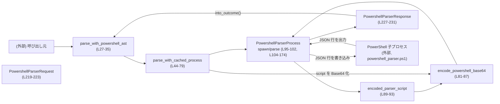
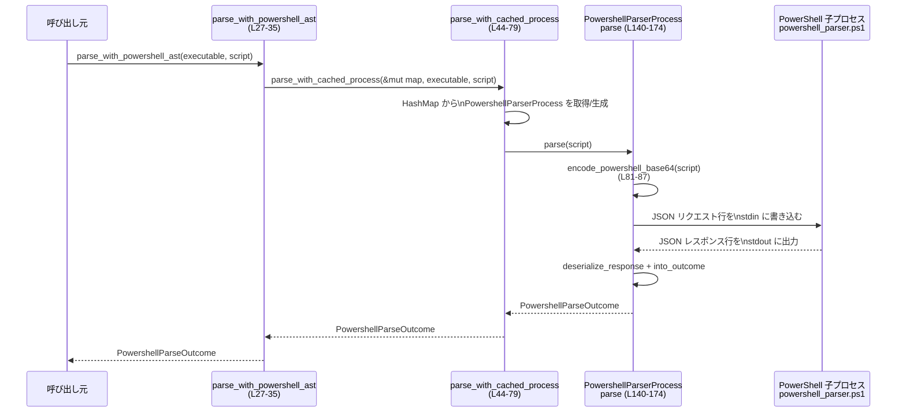

# shell-command/src/command_safety/powershell_parser.rs コード解説

## 0. ざっくり一言

PowerShell の子プロセスを常駐させ、PowerShell 自身のパーサーにスクリプトを投げて構文解析結果を取得するためのモジュールです（根拠: `parse_with_powershell_ast` のコメントと処理内容  
`powershell_parser.rs:L21-27, L104-117, L140-174`）。  
1 実行ファイルごとに 1 プロセスをキャッシュし、JSON ベースの簡単なプロトコルでやり取りします。

---

## 1. このモジュールの役割

### 1.1 概要

- **解決する問題**  
  PowerShell スクリプトを安全に解析したいが、自前で PowerShell の文法を実装するのではなく、PowerShell 本体の AST（抽象構文木）を利用したい、という問題を解決します（関数名 `parse_with_powershell_ast` からの推測 + コメント  
  `powershell_parser.rs:L21-27`）。

- **提供する機能**  
  - PowerShell 実行ファイルごとに長寿命のパーサープロセスを起動・キャッシュ  
    （`PARSER_PROCESSES` の `LazyLock<Mutex<HashMap<...>>>`  
    `powershell_parser.rs:L27-35, L44-58`）。
  - スクリプト文字列を UTF-16 LE → Base64 → JSON にして PowerShell 子プロセスに送り、結果 JSON を `PowershellParseOutcome` に正規化して返します  
    （`encode_powershell_base64`, `PowershellParserProcess::parse`, `PowershellParserResponse::into_outcome`  
    `powershell_parser.rs:L81-87, L140-174, L233-249`）。

### 1.2 アーキテクチャ内での位置づけ

- **外部との関係**  
  - 上位モジュール（このファイルの外）から `parse_with_powershell_ast` が呼ばれます（`pub(super)`  
    `powershell_parser.rs:L27, L37`）。
  - PowerShell 本体（例: `powershell.exe` / `pwsh.exe`）を子プロセスとして起動し、同梱の PowerShell スクリプト `powershell_parser.ps1` を `-EncodedCommand` 経由で実行します  
    （`POWERSHELL_PARSER_SCRIPT` + `encoded_parser_script` + `Command::new(executable)`  
    `powershell_parser.rs:L19, L89-93, L105-117`）。
  - テストでは `crate::powershell::try_find_powershell_executable_blocking` を利用し、存在する PowerShell 実行ファイルを探しています  
    (`powershell_parser.rs:L260`)。

- **内部の依存関係（Mermaid 図）**



この図は、モジュール内の主要な呼び出し関係を示しています（根拠: 各関数の定義と呼び出し  
`powershell_parser.rs:L27-35, L44-79, L81-93, L104-174, L219-249`）。

### 1.3 設計上のポイント

- **プロセスキャッシュと直列アクセス**  
  - 実行ファイルパス文字列をキーとする `HashMap<String, PowershellParserProcess>` に子プロセスをキャッシュします  
    （`PARSER_PROCESSES` と `parse_with_cached_process`  
    `powershell_parser.rs:L28-29, L44-58`）。
  - この `HashMap` 全体を 1 つの `Mutex` で保護し、同じ PowerShell 実行ファイルに対するリクエストは必ず直列化されます（コメントとコード  
    `powershell_parser.rs:L21-26, L27-35`）。

- **エラーハンドリング方針**  
  - 子プロセスの起動失敗・ I/O エラー・JSON 解析エラー・プロトコルの ID 不一致などは、一旦 `std::io::Error` として扱い、上位の `parse_with_cached_process` で
    - 1 回だけ再起動を試みる
    - それでも失敗したら `PowershellParseOutcome::Failed` で隠蔽する  
    という方針になっています（`parse_with_cached_process`, `PowershellParserProcess::spawn/parse`  
    `powershell_parser.rs:L44-79, L104-138, L140-174`）。

- **プロトコル安全性**  
  - リクエスト/レスポンスには単純な JSON を用い、`PowershellParserResponse` に `#[serde(deny_unknown_fields)]` を付けることで、想定外のフィールドを含むレスポンスは全てエラー扱いにします  
    （`powershell_parser.rs:L225-227, L210-217`）。
  - `id` フィールドでリクエスト/レスポンスを対応付け、ID 不一致時には `InvalidData` エラーにします  
    （`powershell_parser.rs:L140-147, L233-249, 特に L159-171`）。

- **リソース解放**  
  - `PowershellParserProcess` に `Drop` 実装を持たせ、構造体が破棄される際に子プロセスを `kill_child` で終了させます  
    （`powershell_parser.rs:L95-102, L177-181, L252-255`）。

---

## 2. 主要な機能一覧

- PowerShell パーサープロセスの起動とキャッシュ: 実行ファイルパスごとに 1 プロセスを常駐させる機能  
  （`parse_with_powershell_ast`, `parse_with_cached_process`, `PowershellParserProcess::spawn`  
  `powershell_parser.rs:L27-35, L44-79, L104-138`）。

- PowerShell スクリプトの Base64 (UTF‑16 LE) エンコード: `-EncodedCommand` 用の変換  
  （`encode_powershell_base64`, `encoded_parser_script`  
  `powershell_parser.rs:L81-87, L89-93`）。

- JSON ベースのリクエスト/レスポンスプロトコル: `PowershellParserRequest` と `PowershellParserResponse` のシリアライズ/デシリアライズ  
  （`serialize_request`, `deserialize_response`  
  `powershell_parser.rs:L201-208, L210-217`）。

- パース結果の正規化: `status` と `commands` から `PowershellParseOutcome` を判定  
  （`PowershellParseOutcome`, `PowershellParserResponse::into_outcome`  
  `powershell_parser.rs:L37-42, L233-249`）。

- 子プロセスのライフサイクル管理: stdin/stdout の取得と、終了処理  
  （`take_child_stdin`, `take_child_stdout`, `kill_child`, `Drop` 実装  
  `powershell_parser.rs:L183-190, L192-199, L252-255, L177-181`）。

---

## 3. 公開 API と詳細解説

### 3.1 型一覧（構造体・列挙体など）

| 名前 | 種別 | 行範囲 | 役割 / 用途 |
|------|------|--------|-------------|
| `PowershellParseOutcome` | 列挙体 | `powershell_parser.rs:L37-42` | パースの結果を表す高レベルな結果 (`Commands` / `Unsupported` / `Failed`) を保持します。 |
| `PowershellParserProcess` | 構造体 | `powershell_parser.rs:L95-102` | 1 つの PowerShell 子プロセスとその stdin/stdout, リクエスト ID カウンタをまとめた状態です。 |
| `PowershellParserRequest` | 構造体 | `powershell_parser.rs:L219-223` | 子プロセスに送る JSON リクエストの内容（ID と Base64 エンコードされたスクリプト）です。 |
| `PowershellParserResponse` | 構造体 | `powershell_parser.rs:L225-231` | 子プロセスから返る JSON レスポンスの内容（ID, ステータス, コマンド列）です。 |

※ このファイル外からの公開可視性（`pub`）はありませんが、`pub(super)` により同じクレート内の上位モジュールから利用可能です（根拠: `powershell_parser.rs:L27, L37`）。

### 3.2 関数詳細（7 件）

#### `parse_with_powershell_ast(executable: &str, script: &str) -> PowershellParseOutcome`

**行範囲**: `powershell_parser.rs:L27-35`

**概要**

- 指定された PowerShell 実行ファイル（`executable`）に対してキャッシュされたパーサープロセスを使い、`script` をパースして `PowershellParseOutcome` を返します。
- 内部でグローバルな `PARSER_PROCESSES: LazyLock<Mutex<HashMap<...>>>` を用いてプロセスを共有します。

**引数**

| 引数名 | 型 | 説明 |
|--------|----|------|
| `executable` | `&str` | PowerShell の実行ファイルパス（例: `"powershell.exe"` や `"C:\\Program Files\\PowerShell\\7\\pwsh.exe"`）。 |
| `script` | `&str` | パース対象となる PowerShell スクリプト文字列。 |

**戻り値**

- `PowershellParseOutcome`  
  - `Commands(Vec<Vec<String>>)` : パースに成功し、コマンド列が取得できた場合。  
  - `Unsupported` : パーサーが対応していない構文・入力だった場合。  
  - `Failed` : プロセス起動や通信などの内部エラーが発生した場合。

**内部処理の流れ**

1. 静的変数 `PARSER_PROCESSES` に対する `Mutex` ロックを取得します（`lock().unwrap_or_else(PoisonError::into_inner)` により、Poison 状態でもロックを再利用します  
   `powershell_parser.rs:L28-33`）。
2. ロックした `HashMap<String, PowershellParserProcess>` を `parse_with_cached_process` に渡してパース処理を委譲します（`powershell_parser.rs:L34`）。
3. `parse_with_cached_process` の結果をそのまま返します。

**Examples（使用例）**

```rust
fn check_script(executable: &str, script: &str) {
    let outcome = parse_with_powershell_ast(executable, script);

    match outcome {
        PowershellParseOutcome::Commands(commands) => {
            // commands は Vec<Vec<String>>。
            // 例: [["Get-Content", "foo bar"], ["Measure-Object"]]
            println!("Parsed commands: {:?}", commands);
        }
        PowershellParseOutcome::Unsupported => {
            println!("Script is syntactically valid but unsupported by safety parser.");
        }
        PowershellParseOutcome::Failed => {
            println!("Failed to communicate with PowerShell parser process.");
        }
    }
}
```

**Errors / Panics**

- `parse_with_powershell_ast` 自体は `Result` を返さず、内部エラーを `PowershellParseOutcome::Failed` にマッピングします（`powershell_parser.rs:L44-79`）。
- `Mutex::lock` でパニックする可能性はありますが、ここでは `unwrap_or_else(PoisonError::into_inner)` を使っているため、Poison 状態でもパニックせずに内部値を取り出します（`powershell_parser.rs:L31-33`）。

**Edge cases（エッジケース）**

- `executable` が存在しない/実行不可のパスの場合:  
  `PowershellParserProcess::spawn` が `Err` を返し、その結果 `PowershellParseOutcome::Failed` になります  
  （`powershell_parser.rs:L55-59, L104-138`）。
- `script` が空文字列でも、UTF-16/JSON/IPC の処理としては問題なく処理されます。最終的な `PowershellParseOutcome` は PowerShell 側のパーサーの挙動に依存します（このチャンクには PowerShell スクリプトの実装がないため詳細不明）。

**使用上の注意点**

- マルチスレッド環境でも安全に呼び出せますが、同一実行ファイルに対する呼び出しは内部で `Mutex` により直列化されるため、並列実行しても PowerShell 側の処理は順番待ちになります（`powershell_parser.rs:L28-35`）。
- `Failed` にはさまざまな内部エラーが含まれるため、より詳細な理由はこの関数からは分かりません。

---

#### `parse_with_cached_process(parser_processes: &mut HashMap<String, PowershellParserProcess>, executable: &str, script: &str) -> PowershellParseOutcome`

**行範囲**: `powershell_parser.rs:L44-79`

**概要**

- 実行ファイルパスをキーにしたキャッシュ `parser_processes` から `PowershellParserProcess` を取得し、必要なら起動します。
- 1 度だけ再起動を試みるリトライ戦略を持ち、それでも失敗した場合は `PowershellParseOutcome::Failed` を返します。

**引数**

| 引数名 | 型 | 説明 |
|--------|----|------|
| `parser_processes` | `&mut HashMap<String, PowershellParserProcess>` | 実行ファイルごとのプロセスキャッシュ。`parse_with_powershell_ast` から呼ばれる際に `Mutex` の中身が渡されます。 |
| `executable` | `&str` | PowerShell 実行ファイルパス。 |
| `script` | `&str` | パース対象のスクリプト。 |

**戻り値**

- `PowershellParseOutcome`（説明は前項と同じ）。

**内部処理の流れ**

1. `executable.to_string()` をキーとして `parser_key` を作成します（`powershell_parser.rs:L51`）。
2. `attempt` を 0 と 1 の 2 回ループします（`for attempt in 0..=1` `powershell_parser.rs:L52`）。
3. キャッシュにキーがなければ `PowershellParserProcess::spawn(executable)` で新規プロセスを起動し、`HashMap` に追加します（`powershell_parser.rs:L53-57`）。
   - 起動に失敗した場合は即座に `PowershellParseOutcome::Failed` を返します（`L55-59`）。
4. `parser_processes.get_mut(&parser_key)` でプロセスを取得し、取得できなければ `Failed` を返します（`powershell_parser.rs:L62-64`）。
5. `parser_process.parse(script)` を呼び出します（`powershell_parser.rs:L65`）。
6. 結果に応じて
   - `Ok(outcome)` → そのまま返す（`L66-67`）。
   - `Err(_)` かつ `attempt == 0` → キャッシュからプロセスを削除し、2 回目のループで再起動を試みる（`L68-73`）。
   - `Err(_)` かつ `attempt == 1` → リトライ後も失敗したため `Failed` を返す（`L74-75`）。

**Errors / Panics**

- `PowershellParserProcess::spawn` や `parse` からのエラーはすべて `PowershellParseOutcome::Failed` に吸収されます。
- この関数自体はパニックを発生させるコードパスを持ちません。

**Edge cases**

- キャッシュに存在するプロセスが途中で死亡・I/O 不能になった場合:  
  1 回目の `parse` が `Err` を返す → キャッシュから削除 → 新しいプロセスを起動 → 2 回目を試行、という挙動になります（コメント含む  
  `powershell_parser.rs:L69-72`）。

**使用上の注意点**

- 呼び出し側はこの関数を直接利用せず、通常は `parse_with_powershell_ast` 経由で呼び出します。
- `parser_processes` のライフタイムやロックは呼び出し元（`parse_with_powershell_ast`）が管理します。

---

#### `PowershellParserProcess::spawn(executable: &str) -> std::io::Result<Self>`

**行範囲**: `powershell_parser.rs:L104-138`

**概要**

- 指定された PowerShell 実行ファイルを子プロセスとして起動し、stdin/stdout をパイプに接続して `PowershellParserProcess` を構築します。

**引数**

| 引数名 | 型 | 説明 |
|--------|----|------|
| `executable` | `&str` | 起動する PowerShell 実行ファイルパス。 |

**戻り値**

- `Ok(PowershellParserProcess)` : 起動・パイプ接続に成功した場合。
- `Err(std::io::Error)` : コマンド起動失敗、stdin/stdout の取り出し失敗など。

**内部処理の流れ**

1. `Command::new(executable)` で子プロセスを構築し、以下の引数を設定します（`powershell_parser.rs:L105-113`）。
   - `-NoLogo`, `-NoProfile`, `-NonInteractive`, `-EncodedCommand`, `encoded_parser_script()`
2. stdin/stdout/stderr をそれぞれ
   - stdin: `Stdio::piped()`
   - stdout: `Stdio::piped()`
   - stderr: `Stdio::null()`  
   に設定し、`spawn()` で起動します（`powershell_parser.rs:L114-117`）。
3. `take_child_stdin(&mut child)` を呼んで `ChildStdin` を取得します。失敗した場合は `kill_child(&mut child)` で子プロセスを終了し、エラーを返します（`powershell_parser.rs:L118-124`）。
4. `take_child_stdout(&mut child)` を呼んで `BufReader<ChildStdout>` を取得します。失敗時も同様に子プロセスを kill してエラーを返します（`powershell_parser.rs:L125-131`）。
5. `PowershellParserProcess` 構造体を組み立て、`next_request_id` を 0 に初期化して返します（`powershell_parser.rs:L132-137`）。

**Errors / Panics**

- `Command::spawn` が OS レベルの理由で失敗した場合、`Err(std::io::Error)` を返します。
- stdin/stdout が `Some` でない場合は `ErrorKind::BrokenPipe` でエラーを生成します  
  （`take_child_stdin`, `take_child_stdout`  
  `powershell_parser.rs:L183-199`）。
- パニックは起こりません（`unwrap` などは使用していません）。

**Edge cases**

- PowerShell 実行ファイルが存在しない/アクセス拒否:  
  `Command::spawn` が `Err` を返します。
- パイプが取得できない（非常にまれなケース）:  
  `take_child_stdin` / `take_child_stdout` で `BrokenPipe` エラーになります（`powershell_parser.rs:L183-199`）。

**使用上の注意点**

- この関数は `PowershellParserProcess` の初期化専用であり、単独で呼んだだけでは何もパースされません。`parse` メソッドと組み合わせて使用します。
- `stderr` は捨てられている (`Stdio::null`) ため、PowerShell 側のエラーメッセージは取得できません（根拠: `powershell_parser.rs:L116`）。

---

#### `PowershellParserProcess::parse(&mut self, script: &str) -> std::io::Result<PowershellParseOutcome>`

**行範囲**: `powershell_parser.rs:L140-174`

**概要**

- 1 つの `PowershellParserProcess` インスタンスを使い、`script` をパースします。
- 1 リクエストごとに増加する `id` を使ってプロトコルの同期を検証します。

**引数**

| 引数名 | 型 | 説明 |
|--------|----|------|
| `&mut self` | `&mut PowershellParserProcess` | PowerShell 子プロセスとの接続状態。 |
| `script` | `&str` | パース対象のスクリプト。 |

**戻り値**

- `Ok(PowershellParseOutcome)` : レスポンスの `status`/`commands` を正しく解釈できた場合。
- `Err(std::io::Error)` : I/O エラー、JSON エラー、プロトコル ID 不一致など。

**内部処理の流れ**

1. `PowershellParserRequest` を作成します。  
   - `id`: `next_request_id` の現在値。  
   - `payload`: `encode_powershell_base64(script)` の結果（`powershell_parser.rs:L141-144`）。
2. `next_request_id` を `wrapping_add(1)` でインクリメントします（オーバーフロー時は 0 に戻る）（`powershell_parser.rs:L145`）。
3. `serialize_request(&request)` で JSON 文字列に変換し、末尾に改行 (`'\n'`) を追加します（`powershell_parser.rs:L146-147`）。
4. その JSON 行を `stdin` に書き込み、`flush` します（`powershell_parser.rs:L148-149`）。
5. `stdout` から 1 行読み込みます（`read_line`）。0 バイト（EOF）の場合は `UnexpectedEof` エラーを返します（`powershell_parser.rs:L151-157`）。
6. 読み込んだ行を `deserialize_response` で `PowershellParserResponse` に変換します（`powershell_parser.rs:L159`）。
7. `response.id` と `request.id` を比較し、不一致なら `InvalidData` エラーを返します（`powershell_parser.rs:L160-171`）。
8. `response.into_outcome()` の結果を `Ok(...)` で返します（`powershell_parser.rs:L173`）。

**Errors / Panics**

- 代表的な `Err` 発生条件:
  - stdin 書き込み・フラッシュの失敗: OS の I/O エラー（`powershell_parser.rs:L148-149`）。
  - stdout 読み込み時に EOF: `ErrorKind::UnexpectedEof`（`powershell_parser.rs:L151-157`）。
  - JSON パースエラー: `ErrorKind::InvalidData`（`powershell_parser.rs:L210-217`）。
  - `id` 不一致: `ErrorKind::InvalidData`（`powershell_parser.rs:L163-170`）。
- パニックを起こすコードは含まれていません。

**Edge cases**

- 非 UTF-8 文字列: Rust の `&str` は UTF-8 であるため、この関数に渡される時点で UTF-8 として妥当な文字列です。UTF-16 への変換も問題なく行われます（`encode_powershell_base64` の挙動）。
- 非常に長いスクリプト: `String` と `Vec<u16>` の容量に依存し、メモリ消費が増加しますが、特別な制限チェックは行っていません。

**使用上の注意点**

- 1 インスタンスに対する複数の `parse` 呼び出しは **直列に** 行う必要があります。`&mut self` を要求しているため、Rust の型システムがこの前提を保証します。
- 子プロセスの stdout にログなど別の行が混入すると、JSON パースエラー・ID 不一致が発生し、再起動の対象となります（コメント参照  
  `powershell_parser.rs:L160-163`）。

---

#### `encode_powershell_base64(script: &str) -> String`

**行範囲**: `powershell_parser.rs:L81-87`

**概要**

- PowerShell の `-EncodedCommand` オプションに渡すために、スクリプトを UTF-16 LE のバイト列に変換した上で Base64 エンコードします。

**引数**

| 引数名 | 型 | 説明 |
|--------|----|------|
| `script` | `&str` | 任意の Rust 文字列（UTF-8）。 |

**戻り値**

- `String` : UTF-16 LE バイト列を Base64 エンコードした文字列。

**内部処理の流れ**

1. `Vec::with_capacity(script.len() * 2)` で概算サイズの UTF-16 バッファを確保します（`powershell_parser.rs:L82`）。
2. `script.encode_utf16()` で UTF-16 コードユニット列を生成し、各 `u16` を `to_le_bytes()` でリトルエンディアンの `[u8; 2]` に変換して `Vec<u8>` に詰めます（`powershell_parser.rs:L83-85`）。
3. その `Vec<u8>` を `BASE64_STANDARD.encode(utf16)` で Base64 エンコードして返します（`powershell_parser.rs:L86`）。

**Errors / Panics**

- エラーを返しません。
- `Vec::with_capacity` で極端に大きな容量を確保しようとするとアロケーションに失敗してパニックする可能性はありますが、これは一般的なメモリ制約に依存します。

**Edge cases**

- 空文字列 `""`: UTF-16 バッファも空になり、結果は空文字列の Base64 表現（空文字列）です。
- 絵文字やサロゲートペアを含む文字列: `encode_utf16` が適切に UTF-16 に変換するため問題ありません。

**使用上の注意点**

- PowerShell の `-EncodedCommand` は **UTF-16 LE の Base64** を期待しているため、この関数の処理内容に依存しています（PowerShell の仕様。コード上の根拠は UTF-16 LE 変換  
  `powershell_parser.rs:L82-85`）。

---

#### `PowershellParserResponse::into_outcome(self) -> PowershellParseOutcome`

**行範囲**: `powershell_parser.rs:L233-249`

**概要**

- 子プロセスから受け取った JSON レスポンスを、高レベルな `PowershellParseOutcome` に変換します。
- `status` と `commands` の値を検査し、異常な値を安全側（`Unsupported` / `Failed`）に倒します。

**引数**

| 引数名 | 型 | 説明 |
|--------|----|------|
| `self` | `PowershellParserResponse` | JSON からデシリアライズされたレスポンス。 |

**戻り値**

- `PowershellParseOutcome` : パース結果。

**内部処理の流れ**

1. `match self.status.as_str()` で `status` を判定します（`powershell_parser.rs:L235`）。
2. `"ok"` の場合:
   - `self.commands` を `Option<Vec<Vec<String>>>` として取り出し、
   - `commands` が
     - 空でない (`!commands.is_empty()`)
     - 各コマンドが空でない (`!cmd.is_empty()`)
     - 各単語が空文字でない (`!word.is_empty()`)  
     のすべてを満たすかフィルタリングします（`powershell_parser.rs:L237-243`）。
   - 条件を満たすなら `PowershellParseOutcome::Commands(commands)`、そうでなければ `PowershellParseOutcome::Unsupported` を返します（`powershell_parser.rs:L244-245`）。
3. `"unsupported"` の場合: `PowershellParseOutcome::Unsupported` を返します（`powershell_parser.rs:L246`）。
4. それ以外（未知の status）の場合: `PowershellParseOutcome::Failed` を返します（`powershell_parser.rs:L247-248`）。

**Errors / Panics**

- この関数は `Result` ではなく、エラーは `Failed` または `Unsupported` にマッピングされます。
- パニックを起こすコードは含まれていません。

**Edge cases**

- `status == "ok"` だが `commands` が `None` または空や空文字を含む場合:  
  `Unsupported` 扱いになります（`powershell_parser.rs:L237-245`）。
- `status` が `"OK"` など別の大小文字のバリエーション:  
  文字列比較は厳密なため `"ok"` 以外はすべて `"その他"` の扱いとなり、`Failed` になります（`powershell_parser.rs:L235, L247-248`）。

**使用上の注意点**

- ここで `Unsupported` になったケースは、「パーサー自体は応答したが、期待するコマンド列の形式ではなかった」ケースも含みます。そのため、呼び出し側は `Unsupported` と `Failed` を必要に応じて区別して扱う必要があります。

---

#### `serialize_request(request: &PowershellParserRequest) -> std::io::Result<String>`

**行範囲**: `powershell_parser.rs:L201-208`

**概要**

- `PowershellParserRequest` を JSON 文字列へ直列化し、`std::io::Error` にラップして返します。

**引数**

| 引数名 | 型 | 説明 |
|--------|----|------|
| `request` | `&PowershellParserRequest` | シリアライズ対象のリクエスト。 |

**戻り値**

- `Ok(String)` : シリアライズに成功した JSON 文字列。
- `Err(std::io::Error)` : `serde_json::to_string` が失敗した場合。

**内部処理の流れ**

1. `serde_json::to_string(request)` を呼び出します（`powershell_parser.rs:L202`）。
2. エラーが発生した場合、`ErrorKind::InvalidData` の `std::io::Error` に変換し、メッセージに serde のエラー内容を含めます（`powershell_parser.rs:L203-206`）。

**Errors / Panics**

- `serde_json::to_string` が失敗する可能性がありますが、この型は単純なフィールドのみを持つため、通常は発生しません。
- 失敗時は `ErrorKind::InvalidData` で `Err` を返します。

**Edge cases**

- `payload` が非常に長い Base64 文字列でも、`String` のメモリに収まる限り問題ありません。

**使用上の注意点**

- I/O 層の関数 (`PowershellParserProcess::parse`) で扱いやすいように、`serde_json::Error` を `std::io::Error` に統一しています（`powershell_parser.rs:L146, L201-208`）。

---

### 3.3 その他の関数

| 関数名 | 行範囲 | 役割（1 行） |
|--------|--------|--------------|
| `encoded_parser_script() -> &'static str` | `powershell_parser.rs:L89-93` | `POWERSHELL_PARSER_SCRIPT` を Base64 化した値を `LazyLock` 経由で一度だけ生成し、以降は再利用します。 |
| `take_child_stdin(child: &mut Child) -> std::io::Result<ChildStdin>` | `powershell_parser.rs:L183-190` | 子プロセスの stdin ハンドルを取り出し、存在しなければ `BrokenPipe` エラーを返します。 |
| `take_child_stdout(child: &mut Child) -> std::io::Result<BufReader<ChildStdout>>` | `powershell_parser.rs:L192-199` | 子プロセスの stdout ハンドルを `BufReader` 付きで取り出し、存在しなければ `BrokenPipe` エラーを返します。 |
| `deserialize_response(response_line: &str) -> std::io::Result<PowershellParserResponse>` | `powershell_parser.rs:L210-217` | JSON 文字列から `PowershellParserResponse` へデシリアライズし、失敗時を `InvalidData` の I/O エラーにします。 |
| `kill_child(child: &mut Child)` | `powershell_parser.rs:L252-255` | `Child::kill` と `Child::wait` をベストエフォートで呼び、結果は無視します。 |
| `Drop for PowershellParserProcess::drop` | `powershell_parser.rs:L177-181` | インスタンス破棄時に `kill_child` を呼び、子プロセスを終了させます。 |
| テスト `parser_process_handles_multiple_requests()` | `powershell_parser.rs:L263-288` | 1 つの `PowershellParserProcess` が複数のリクエストを順に処理できることを確認します。 |

---

## 4. データフロー

ここでは、`parse_with_powershell_ast` が呼ばれたときに、スクリプト文字列がどのように処理されるかを時系列で説明します。

1. 呼び出し元が `parse_with_powershell_ast(executable, script)` を呼ぶ（`powershell_parser.rs:L27-35`）。
2. グローバルキャッシュの `Mutex<HashMap<...>>` がロックされ、`parse_with_cached_process` に処理が委譲される（`powershell_parser.rs:L28-35, L44-79`）。
3. 実行ファイルパスをキーに `PowershellParserProcess` を取得/生成する（`powershell_parser.rs:L51-58`）。
4. `PowershellParserProcess::parse(script)` が呼ばれ、内部で
   - `encode_powershell_base64(script)` で Base64 変換（`powershell_parser.rs:L140-145, L81-87`）
   - `serialize_request` で JSON 行生成（`powershell_parser.rs:L146, L201-208`）
   - stdin へ書き込み、stdout から 1 行読み出し（`powershell_parser.rs:L148-152`）
   - `deserialize_response` で JSON を構造体に変換（`powershell_parser.rs:L159, L210-217`）
   - `into_outcome` で `PowershellParseOutcome` へ変換（`powershell_parser.rs:L173, L233-249`）
   を行います。
5. `parse_with_cached_process` が `PowershellParseOutcome` を受け取り、そのまま呼び出し元へ返します。

### シーケンス図



---

## 5. 使い方（How to Use）

### 5.1 基本的な使用方法

このモジュール内、または同じクレート内から PowerShell スクリプトを解析する典型的なコード例です。

```rust
// PowerShell 実行ファイルパスとスクリプトを用意する
let executable = "powershell.exe";                      // 例: PATH が通っている場合
let script = "Get-Content 'foo bar'";                   // 解析したいスクリプト

// PowerShell パーサーを使って解析する
let outcome = parse_with_powershell_ast(executable, script); // L27-35

// 結果に応じて処理を分岐する
match outcome {
    PowershellParseOutcome::Commands(commands) => {
        // commands は Vec<Vec<String>> 形式
        // 例: [["Get-Content", "foo bar"]]
        println!("Commands: {:?}", commands);           // ここで安全性チェックなどに利用できる
    }
    PowershellParseOutcome::Unsupported => {
        // パーサーがこのスクリプトをサポートしていない場合
        println!("Unsupported script for PowerShell AST parser.");
    }
    PowershellParseOutcome::Failed => {
        // PowerShell プロセス起動や通信に失敗した場合
        eprintln!("Failed to talk to PowerShell parser.");
    }
}
```

### 5.2 よくある使用パターン

1. **同じ PowerShell への複数回の解析**

   同じ `executable` を渡して何度も `parse_with_powershell_ast` を呼ぶと、内部で同じ子プロセスが再利用され、起動コストが amortize されます（`powershell_parser.rs:L28-29, L44-58`）。

   ```rust
   let exe = "pwsh.exe";

   let scripts = [
       "Get-Content 'file1.txt'",
       "Write-Output foo | Measure-Object",
   ];

   for s in &scripts {
       let outcome = parse_with_powershell_ast(exe, s);
       println!("{:?}", outcome);
   }
   ```

2. **複数の PowerShell 実装を使い分ける**

   キーが実行ファイルパスになっているため、`powershell.exe` と `pwsh.exe` を別々にキャッシュできます（コメント  
   `powershell_parser.rs:L49-51`）。

### 5.3 よくある間違い

```rust
// 誤り例: outcome をすべて成功とみなしてしまう
let outcome = parse_with_powershell_ast(executable, script);
// commands を使える前提で unwrap してしまう
// let commands = match outcome { PowershellParseOutcome::Commands(c) => c, _ => unreachable!() };

// 正しい扱い例: Unsupported / Failed を考慮する
let commands = match outcome {
    PowershellParseOutcome::Commands(c) => Some(c),
    PowershellParseOutcome::Unsupported => {
        // パーサーが対応していない構文など
        None
    }
    PowershellParseOutcome::Failed => {
        // 環境依存のエラー（PowerShell 未インストール等）の可能性
        None
    }
};
```

### 5.4 使用上の注意点（まとめ）

- **並行性**
  - グローバルキャッシュは `Mutex` で保護されており、**同じ実行ファイルに対する `parse_with_powershell_ast` 呼び出しは 1 度に 1 つ**になります（`powershell_parser.rs:L28-35`）。
  - 別の実行ファイルパスに対する呼び出しは、別の `PowershellParserProcess` を使うため、ある程度独立して動作します。

- **エラー扱い**
  - `Failed` は I/O エラーや JSON エラーなど内部的な問題をまとめた結果であり、詳細はこのモジュールからは取得できません（`powershell_parser.rs:L44-79, L140-174, L201-217`）。
  - `Unsupported` には「パーサースクリプトが対応していない」「`commands` の形式チェックに失敗した」両方が含まれます（`powershell_parser.rs:L233-249`）。

- **セキュリティ上の注意**
  - このモジュールは PowerShell 本体を子プロセスとして起動し、任意の `script` を実行（少なくともパース）します。コード上からは、`powershell_parser.ps1` がどのようにスクリプトを扱うかは分かりません（このチャンクにはその内容がないため不明。根拠: `include_str!("powershell_parser.ps1")` `powershell_parser.rs:L19`）。
  - `PowershellParserResponse` に `deny_unknown_fields` が付いているため、PowerShell スクリプト側の JSON スキーマが変わると、このモジュールは `Failed` や再起動の対象になる可能性があります（`powershell_parser.rs:L225-227, L210-217`）。

- **リソース管理**
  - `PowershellParserProcess` は `Drop` で子プロセスを kill しますが、`kill_child` の戻り値は無視されるため、OS レベルでの kill 失敗は検出されません（`powershell_parser.rs:L177-181, L252-255`）。

- **テスト環境**
  - テストは `#[cfg(all(test, windows))]` でガードされており、Windows 環境での動作を主に想定しています（`powershell_parser.rs:L257-258`）。

---

## 6. 変更の仕方（How to Modify）

### 6.1 新しい機能を追加する場合

例: PowerShell パーサーから追加情報（例: コマンドの位置情報）を受け取りたい場合。

1. **PowerShell スクリプト側の変更**  
   - `powershell_parser.ps1` が出力する JSON に新しいフィールドを追加する必要があります（このファイルの外。存在は `include_str!` から分かります  
     `powershell_parser.rs:L19`）。

2. **レスポンス構造体の更新**
   - `PowershellParserResponse` に対応するフィールドを追加します（`powershell_parser.rs:L227-231`）。
   - `#[serde(deny_unknown_fields)]` が付いているため、スクリプト側の変更だけを先に行うと、古いバイナリではデシリアライズに失敗する点に注意します。

3. **`into_outcome` のロジック更新**
   - 新しいフィールドを考慮した判定ロジックを `into_outcome` に追加します（`powershell_parser.rs:L233-249`）。

4. **呼び出し側 API の拡張**
   - 必要に応じて `PowershellParseOutcome` に新しいバリアントを追加し、呼び出し側の処理を更新します（`powershell_parser.rs:L37-42`）。

### 6.2 既存の機能を変更する場合

- **プロトコル変更時の影響範囲**
  - `PowershellParserRequest`/`Response` のフィールドを変更すると、PowerShell スクリプトとの整合性が崩れるため、常に両方を同時に更新する必要があります（`powershell_parser.rs:L219-223, L227-231`）。
  - `deserialize_response` は JSON 形式の変更に敏感で、失敗時には `InvalidData` エラーとなり、`parse_with_cached_process` から見ると `Failed` の原因になります（`powershell_parser.rs:L210-217, L44-79`）。

- **リトライ戦略の変更**
  - 現在は「最大 1 回再起動」という実装です（`for attempt in 0..=1`  
    `powershell_parser.rs:L52`）。回数を増やしたり無くしたりする場合は、リソース消費とエラー復旧のバランスを考慮する必要があります。

- **エッジケースの契約（Contracts）**
  - `PowershellParserResponse::into_outcome` は `status = "ok"` でも `commands` が空や空文字を含む場合は `Unsupported` にしています（`powershell_parser.rs:L237-245`）。  
    この契約を変えると、呼び出し側のロジックにも影響します。

- **テストの更新**
  - プロトコルや `PowershellParseOutcome` の振る舞いを変えた場合、`parser_process_handles_multiple_requests` テストの期待値も合わせて更新する必要があります（`powershell_parser.rs:L263-288`）。

---

## 7. 関連ファイル

| パス / シンボル | 役割 / 関係 |
|----------------|------------|
| `powershell_parser.ps1` （同ディレクトリ） | `include_str!("powershell_parser.ps1")` で組み込まれる PowerShell スクリプトであり、JSON プロトコルでこのモジュールと通信するパーサー本体です（`powershell_parser.rs:L19`）。このチャンクには内容が現れないため、詳細は不明です。 |
| `crate::powershell::try_find_powershell_executable_blocking` | テストで利用される、PowerShell 実行ファイルを探索する関数です（`powershell_parser.rs:L260`）。定義場所はこのチャンクには含まれていません。 |
| `pretty_assertions::assert_eq` | テストでパース結果の `PowershellParseOutcome` を比較するためのアサートマクロです（`powershell_parser.rs:L261`）。 |

このファイルは、PowerShell AST ベースの解析を Rust コードから扱うための中核モジュールであり、子プロセスとの通信・キャッシュ・エラーハンドリングを一手に引き受ける構造になっています。
