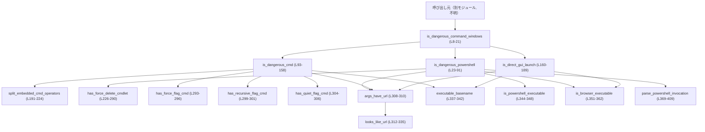
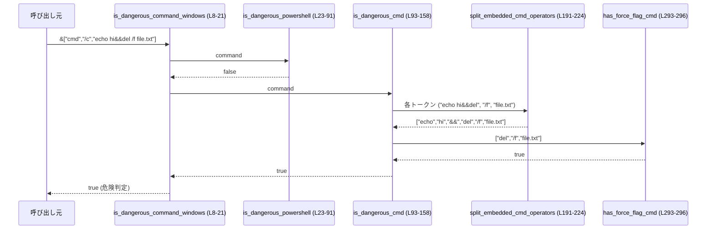

# shell-command/src/command_safety/windows_dangerous_commands.rs

## 0. ざっくり一言

Windows 上で実行されるコマンドライン（PowerShell / `cmd.exe` / GUI ランチャー）を解析し、**URL を開く危険な起動**や **強制削除系のコマンド**を検出するための判定ロジックを提供するモジュールです（`is_dangerous_command_windows`）。`windows_dangerous_commands.rs:L8-21`  

---

## 1. このモジュールの役割

### 1.1 概要

このモジュールは、Windows 環境で実行されるコマンドの argv（`Vec<String>`）を入力として受け取り、以下を行います。

- PowerShell かどうか、`cmd.exe` かどうか、GUI ランチャーかどうかを判別する `windows_dangerous_commands.rs:L23-21,93-102,160-167`
- それぞれの形態ごとに
  - **URL をブラウザ等で開く起動**（`start https://...`, `Start-Process 'https://...'` など）
  - **強制削除 / 再帰削除**（`Remove-Item -Force`, `cmd /c del /f`, `rd /s /q` など）
  を検出し、危険とみなす場合は `true` を返します `windows_dangerous_commands.rs:L44-88,L131-157,L226-290`

### 1.2 アーキテクチャ内での位置づけ

外部（このファイル外）のコードからは **唯一の公開関数** `is_dangerous_command_windows` を呼び出す想定です。その内部で PowerShell / CMD / GUI の各検査ロジックと、URL 判定・削除コマンド判定などのヘルパーが呼ばれます。



※ ライン番号は `windows_dangerous_commands.rs` の位置を示します。

### 1.3 設計上のポイント

- **単一の公開 API**  
  - 外部からは `is_dangerous_command_windows(&[String]) -> bool` だけを使う設計になっています `windows_dangerous_commands.rs:L8-21`。
- **入力は argv ベース**  
  - 「実行ファイル + 引数」の配列（`[String]`）を前提とし、**1 つの文字列にコマンド全文を入れる形は想定していません**。`split_first` で先頭を実行ファイルとみなしています `windows_dangerous_commands.rs:L24,L94,L161`。
- **ベストエフォート解析（fail-open 寄り）**  
  - PowerShell スクリプトは `shlex::split` による簡易分割で解析し、**パースに失敗した場合は危険判定をあきらめて `false` を返します** `windows_dangerous_commands.rs:L30-35,L369-385`。
  - CMD の単一文字列コマンドも `shlex_split` によるベストエフォート解析です `windows_dangerous_commands.rs:L120-123`。
- **検出対象の明確な限定**  
  - URL 起動: HTTP / HTTPS のみを URL として扱います `windows_dangerous_commands.rs:L331-335`。
  - 削除: `Remove-Item` / `rm` / `del` / `rd` / `rmdir` 等に `-Force`、`/f`、`/s /q` が付くケースのみを危険とみなします `windows_dangerous_commands.rs:L226-228,L274-289,L293-305,L143-153`。
- **スレッド安全なグローバル状態**  
  - URL 抽出用の正規表現を `once_cell::sync::Lazy` で静的に初期化して使用しており、**スレッドセーフな遅延初期化**になっています `windows_dangerous_commands.rs:L315-316`。
- **エラー時にパニックしない方針**  
  - `Url::parse` 失敗や正規表現コンパイル失敗、`shlex::split` 失敗などはすべて「危険ではない」と扱う（`false` を返す）ように書かれており、`unwrap` や `expect` は使われていません `windows_dangerous_commands.rs:L120-123,L325-333`。

---

## 2. 主要な機能一覧

このモジュールが提供する主な機能は次の通りです。

- Windows コマンドの危険判定:
  - `is_dangerous_command_windows`: コマンド全体を見て危険かどうかを一括判定 `windows_dangerous_commands.rs:L8-21`。
- PowerShell コマンドの検査:
  - URL を開く `Start-Process`, `Invoke-Item` 等の検出 `windows_dangerous_commands.rs:L44-52`。
  - `rundll32 url.dll,FileProtocolHandler` 経由や `mshta` / ブラウザ / `explorer` による URL 起動の検出 `windows_dangerous_commands.rs:L64-82`。
  - `Remove-Item -Force` やその alias を使った**強制削除**の検出 `windows_dangerous_commands.rs:L85-88,L226-290`。
- CMD コマンドの検査:
  - `cmd /c start https://...` 形式の URL 起動の検出 `windows_dangerous_commands.rs:L139-142`。
  - `del /f` / `erase /f` による強制削除の検出 `windows_dangerous_commands.rs:L143-147`。
  - `rd /s /q`, `rmdir /s /q` による再帰静か削除の検出 `windows_dangerous_commands.rs:L149-155`。
  - `echo hi&del /f` のような**演算子とコマンドが連結されたケース**の分解処理 `windows_dangerous_commands.rs:L125-129,L191-224`。
- GUI ランチャー経由の URL 起動の検査:
  - `explorer`, `mshta`, `rundll32 url.dll,FileProtocolHandler`, 各種ブラウザ exe による URL 起動の検出 `windows_dangerous_commands.rs:L160-188`。
- URL らしさの判定:
  - PowerShell 特有の括弧・引用符・セミコロンをはぎ取った上で HTTP/HTTPS URL を判定する `looks_like_url` `windows_dangerous_commands.rs:L312-335`。
- PowerShell 引数列の解析:
  - `-Command` や `-Command:...` 指定を解釈し、スクリプトテキストを shlex でトークンに分解する `parse_powershell_invocation` `windows_dangerous_commands.rs:L369-405`。

---

## 3. 公開 API と詳細解説

### 3.1 型一覧（構造体・列挙体など）

| 名前 | 種別 | 役割 / 用途 | 定義位置 |
|------|------|-------------|----------|
| `ParsedPowershell` | 構造体 | PowerShell 呼び出しを shlex 分割した結果のトークン列を保持するための内部用コンテナ | `windows_dangerous_commands.rs:L365-367` |

※ `ParsedPowershell` はこのファイル内だけで使われ、外部には公開されていません。

### 3.2 関数詳細（主要 7 件）

#### `is_dangerous_command_windows(command: &[String]) -> bool`

**概要**

- Windows コマンドライン（argv）の配列を受け取り、以下のいずれかに該当すれば `true`（危険）、そうでなければ `false` を返します `windows_dangerous_commands.rs:L8-21`。
  - 危険な PowerShell 呼び出し
  - 危険な `cmd.exe` 呼び出し
  - 危険な GUI / ブラウザ起動

**引数**

| 引数名 | 型 | 説明 |
|--------|----|------|
| `command` | `&[String]` | `argv` 形式のコマンドライン。先頭は実行ファイルパス、それ以降が引数であることを前提にしています `windows_dangerous_commands.rs:L8-9`。 |

**戻り値**

- `bool`  
  - `true`: このモジュールのヒューリスティクスにより「危険」とみなされたコマンド。  
  - `false`: 検出ロジックに該当しなかったコマンド（安全とは限らず、「検出できなかった」状態も含みます）。

**内部処理の流れ**

1. `is_dangerous_powershell(command)` を呼び、`true` なら即座に `true` を返します `windows_dangerous_commands.rs:L12-14`。
2. 次に `is_dangerous_cmd(command)` を呼び、`true` なら `true` を返します `windows_dangerous_commands.rs:L16-18`。
3. 最後に `is_direct_gui_launch(command)` を評価し、その結果（`true`/`false`）をそのまま返します `windows_dangerous_commands.rs:L20`。

**Examples（使用例）**

```rust
use shell_command::command_safety::windows_dangerous_commands::is_dangerous_command_windows;

// 例1: cmd /c del /f file.txt は危険と判定される
let cmd = vec![
    "cmd".to_string(),
    "/c".to_string(),
    "del".to_string(),
    "/f".to_string(),
    "file.txt".to_string(),
];
assert!(is_dangerous_command_windows(&cmd));

// 例2: explorer.exe . は危険とは判定されない
let explorer = vec![
    "explorer.exe".to_string(),
    ".".to_string(),
];
assert!(!is_dangerous_command_windows(&explorer));
```

（2つ目の挙動はテスト `explorer_with_directory_is_not_flagged` から確認できます `windows_dangerous_commands.rs:L465-471`。）

**Errors / Panics**

- この関数自体は `Result` を返さず、パニックを起こしません。  
- 内部で呼び出す関数も `unwrap` や `expect` を使っておらず、すべてのエラーは「危険ではない（`false`）」へフォールバックします。

**Edge cases（エッジケース）**

- `command` が空スライスの場合  
  - `is_dangerous_powershell` / `is_dangerous_cmd` / `is_direct_gui_launch` のいずれも `false` を返すため、最終的に `false` になります `windows_dangerous_commands.rs:L24-26,L94-96,L161-163`。
- 実行ファイル名を含まない（1 要素のみの）配列で、かつその 1 要素が PowerShell／CMD 実行ファイルではない場合も、すべて `false` になります。

**使用上の注意点**

- 引数は必ず **argv 形式**（`["exe", "arg1", "arg2", ...]`）で渡す必要があります。  
  - 1 つの文字列 `"cmd /c del /f file.txt"` をそのまま渡すと、実行ファイル名の判定に失敗し、検出されません。
- `false` が返っても「安全」とは限らず、**このヒューリスティクスで検出できない危険コマンド**も存在しうる点に注意が必要です（PowerShell 解析がベストエフォートである旨がコメントされています `windows_dangerous_commands.rs:L30-32`）。

---

#### `is_dangerous_powershell(command: &[String]) -> bool`

**概要**

- argv が PowerShell 実行ファイルから始まる場合に、URL 起動や強制削除を行う危険なスクリプトかどうかを判定します `windows_dangerous_commands.rs:L23-91`。

**引数**

| 引数名 | 型 | 説明 |
|--------|----|------|
| `command` | `&[String]` | `["powershell.exe", "-Command", "Remove-Item test -Force"]` のような PowerShell 呼び出しの argv 全体。 |

**戻り値**

- `bool`  
  - `true`: 以下のようなパターンに一致した場合
    - URL を開く `Start-Process` / `Invoke-Item` / `ShellExecute` / ブラウザ / `explorer` / `mshta` 呼び出し  
    - `Remove-Item` / `rm` / `ri` / `del` / `rd` / `rmdir` に `-Force` が付いた削除操作  
  - `false`: それ以外、あるいはコマンド解析に失敗した場合。

**内部処理の流れ**

1. 先頭要素を実行ファイル `exe`、残りを `rest` として取り出す。空の場合は `false` `windows_dangerous_commands.rs:L24-26`。
2. `is_powershell_executable(exe)` で PowerShell 実行ファイルかどうかを判定し、そうでなければ `false` を返す `windows_dangerous_commands.rs:L27-29,L344-348`。
3. `parse_powershell_invocation(rest)` で PowerShell スクリプト部分をトークン列に変換する。失敗したら `false` `windows_dangerous_commands.rs:L30-35,L369-405`。
4. 取得した `parsed.tokens` を小文字化・引用符除去した `tokens_lc` を作成し、`args_have_url(&parsed.tokens)` で URL の有無を判定 `windows_dangerous_commands.rs:L37-43,L308-310`。
5. URL があり、かつ `tokens_lc` に以下が含まれる場合は `true` `windows_dangerous_commands.rs:L44-62`。
   - `start-process`, `start`, `saps`, `invoke-item`, `ii` もしくはこれらを含むトークン
   - `shellexecute`, `shell.application`
6. 先頭トークン `first` について、以下の組み合わせがあれば `true` `windows_dangerous_commands.rs:L64-82`。
   - `first == "rundll32"` かつ `tokens_lc` 中に `"url.dll,fileprotocolhandler"` を含むトークンがあり、URL も存在する
   - `first == "mshta"` かつ URL あり
   - `first` がブラウザ実行ファイル名（`is_browser_executable`）で URL あり
   - `first` が `explorer` / `explorer.exe` で URL あり
7. `has_force_delete_cmdlet(&tokens_lc)` が `true` なら `true`（強制削除系コマンド）`windows_dangerous_commands.rs:L85-88,L226-290`。
8. 上記に該当しなければ `false` を返す。

**Examples（使用例）**

```rust
// URL を開く Start-Process は危険と判定
let cmd = vec![
    "powershell".into(),
    "-Command".into(),
    "Start-Process 'https://example.com'".into(),
];
assert!(is_dangerous_command_windows(&cmd));

// ローカル EXE の Start-Process は危険とは判定されない
let benign = vec![
    "powershell".into(),
    "-Command".into(),
    "Start-Process notepad.exe".into(),
];
assert!(!is_dangerous_command_windows(&benign));
```

これらはテスト `powershell_start_process_url_is_dangerous` と `powershell_start_process_local_is_not_flagged` に対応します `windows_dangerous_commands.rs:L419-445`。

**Errors / Panics**

- `parse_powershell_invocation` が `None` を返した場合はそのまま `false` を返します（例: `-Command` の後にスクリプトが無いなど）`windows_dangerous_commands.rs:L33-35,L379-383`。
- `shlex_split` 失敗時は `None` を返して `is_dangerous_powershell` も `false` になるため、パニックは発生しません `windows_dangerous_commands.rs:L384-385`。

**Edge cases（エッジケース）**

- `-Command` ではなく `-File script.ps1` のような形式の場合、`parse_powershell_invocation` はスクリプトの中身を解析せず、単に残りの引数をトークンとみなします `windows_dangerous_commands.rs:L395-404`。  
  - そのため、**スクリプトファイル内の `Remove-Item -Force` などは検出されません**。
- `Remove-Item -Force; Write-Host done` のようにセミコロンで複数コマンドが書かれた場合でも、`has_force_delete_cmdlet` はセグメント単位で `-Force` と削除コマンドの組み合わせを検出します `windows_dangerous_commands.rs:L229-236,L274-289`。

**使用上の注意点**

- コメントにある通り、PowerShell の解析は「ベストエフォート」であり、**完全な PowerShell パーサではありません** `windows_dangerous_commands.rs:L30-32`。
- `-Command` 以外の呼び出し形態や、複雑なエスケープ／ヒアストリング等は解析できない可能性があり、その場合は危険でも `false` になります。

---

#### `is_dangerous_cmd(command: &[String]) -> bool`

**概要**

- `cmd` または `cmd.exe` を通じて実行されるコマンドのうち、URL 起動や強制削除／再帰削除を行うものを危険として検出します `windows_dangerous_commands.rs:L93-158`。

**引数**

| 引数名 | 型 | 説明 |
|--------|----|------|
| `command` | `&[String]` | `["cmd", "/c", "del", "/f", "file.txt"]` のような `cmd` 呼び出しの argv。 |

**戻り値**

- `bool`  
  - `true`: `cmd` コマンド列の中に危険な `start` / `del /f` / `erase /f` / `rd /s /q` / `rmdir /s /q` が見つかった場合。  
  - `false`: それ以外、もしくは解析に必要な形で `cmd` が呼ばれていない場合。

**内部処理の流れ**

1. `split_first` で `exe` と `rest` を取り出す。空なら `false` `windows_dangerous_commands.rs:L94-96`。
2. `executable_basename(exe)` を小文字化して取得し、`"cmd"` または `"cmd.exe"` でなければ `false` `windows_dangerous_commands.rs:L97-102,L337-342`。
3. `rest` のオプション読み飛ばし:
   - `/c`, `/r`, `-c` が出るまで、`/` で始まるトークンを読み飛ばす。
   - `/` で始まらないトークンが現れた時点で「不明な形式」とみなして `false` を返す `windows_dangerous_commands.rs:L104-113`。
4. `/c` などの後に残ったトークンを `remaining` とし、空なら `false` `windows_dangerous_commands.rs:L115-118`。
5. `remaining` が 1 要素だけならその文字列を `shlex_split` して CMD 風のトークン列に展開する。失敗時はそのまま 1 要素として扱う `windows_dangerous_commands.rs:L120-123`。
6. 各トークンについて `split_embedded_cmd_operators` を適用し、`echo hi&del /f` のような連結を `["echo hi", "&", "del", "/f"]` のように分割する `windows_dangerous_commands.rs:L125-129,L191-224`。
7. `["&", "&&", "|", "||"]` をセパレータとしてコマンドセグメントに分割し、それぞれのセグメントの先頭トークンをコマンド名として扱う `windows_dangerous_commands.rs:L131-137`。
8. 各セグメントについて以下をチェックし、いずれかに当てはまれば `true` `windows_dangerous_commands.rs:L139-155`。
   - 先頭が `start` で、セグメント内に URL を含む引数がある（`args_have_url`）  
   - 先頭が `del` / `erase` で `/f` フラグ（大文字小文字無視）が含まれる (`has_force_flag_cmd`)  
   - 先頭が `rd` / `rmdir` で `/s`（再帰）と `/q`（静か）の両方のフラグが含まれる (`has_recursive_flag_cmd` + `has_quiet_flag_cmd`)
9. どのセグメントも該当しなければ `false` を返す。

**Examples（使用例）**

テストケースに対応する代表例:

```rust
// del /f は危険
let cmd = vec!["cmd".into(), "/c".into(), "del".into(), "/f".into(), "test.txt".into()];
assert!(is_dangerous_command_windows(&cmd)); // cmd_del_force_is_dangerous

// rd /s /q は危険
let rd = vec!["cmd".into(), "/c".into(), "rd".into(), "/s".into(), "/q".into(), "test".into()];
assert!(is_dangerous_command_windows(&rd)); // cmd_rd_recursive_is_dangerous

// del だが /f が無い場合は危険と判定されない
let benign = vec!["cmd".into(), "/c".into(), "del".into(), "test.txt".into()];
assert!(!is_dangerous_command_windows(&benign)); // cmd_del_without_force_is_not_flagged
```

テスト位置: `windows_dangerous_commands.rs:L513-531,L533-545`。

**Errors / Panics**

- `shlex_split` 失敗時は `unwrap_or_else` で元の 1 トークンにフォールバックしており、パニックしません `windows_dangerous_commands.rs:L120-123`。
- 想定外のオプション（`/c` より前に現れる `/` で始まらないトークン）があると、即座に `false` を返します `windows_dangerous_commands.rs:L104-113`。

**Edge cases（エッジケース）**

- `cmd /c "del /f file.txt"` のような「コマンド本文が 1 文字列」の場合も `shlex_split` によって分解され、`del /f` が検出されます（テスト `cmd_del_single_string_argument_is_dangerous`）`windows_dangerous_commands.rs:L643-649`。
- `echo hi&del /f file.txt` / `echo hi&&del /f file.txt` / `echo hi||del /f file.txt` のように演算子とコマンドが連結された場合でも、`split_embedded_cmd_operators` によって区切られ、後続の削除コマンドを検出できます `windows_dangerous_commands.rs:L125-129,L661-685, L191-224`。
- `/f` フラグは **完全一致** のみを検出するため、パスに `"/foo/f/bar"` を含むだけでは検出されません（`cmd_del_path_containing_f_is_not_flagged` テスト）`windows_dangerous_commands.rs:L591-599`。

**使用上の注意点**

- `cmd` / `cmd.exe` を経由しない `del` / `rd` 等はこの関数では検出されません。  
- `/c` 以外のオプションが `/c` より後に来る場合（例: `/v:on` など）は、「オプション」として特別扱いされず、そのままコマンド本文の一部として扱われます。その結果、一部の組み合わせが検出されない可能性があります。

---

#### `is_direct_gui_launch(command: &[String]) -> bool`

**概要**

- `explorer.exe` / `mshta.exe` / `rundll32.exe` / ブラウザ exe のような GUI プログラムが、URL を開く形で直接起動されているかどうかを判定します `windows_dangerous_commands.rs:L160-189`。

**引数**

| 引数名 | 型 | 説明 |
|--------|----|------|
| `command` | `&[String]` | 先頭が GUI 実行ファイルである argv。 |

**戻り値**

- `bool`  
  - `true`: 以下のいずれかの組み合わせに一致した場合に `true`。
  - `false`: それ以外。

**内部処理の流れ**

1. `split_first` で `exe` と `rest` を取得し、`executable_basename(exe)` で小文字のファイル名に変換する `windows_dangerous_commands.rs:L160-166,L337-342`。
2. 以下の順に条件を評価し、いずれかに一致したら `true` `windows_dangerous_commands.rs:L168-186`。
   - `base` が `explorer` / `explorer.exe` で、`rest` に URL を含む引数がある (`args_have_url(rest)`)。
   - `base` が `mshta` / `mshta.exe` で、`rest` に URL を含む。
   - `base` が `rundll32` / `rundll32.exe` で、`rest` のいずれかに `"url.dll,fileprotocolhandler"` を含むトークンがあり、かつ `rest` に URL を含む。
   - `base` が `is_browser_executable`（Chrome, Edge, Firefox, IE）に一致し、`rest` に URL を含む。
3. どれにも一致しなければ `false`。

**使用例**

```rust
let edge = vec!["msedge.exe".into(), "https://example.com".into()];
assert!(is_dangerous_command_windows(&edge)); // msedge_with_url_is_dangerous

let explorer_dir = vec!["explorer.exe".into(), ".".into()];
assert!(!is_dangerous_command_windows(&explorer_dir)); // explorer_with_directory_is_not_flagged
```

テスト位置: `windows_dangerous_commands.rs:L457-471`。

**Edge cases**

- URL でない文字列（例: `"."` や `C:\path`）のみを引数に取る `explorer.exe` は危険とは判定されません `windows_dangerous_commands.rs:L169-171,L465-471`。
- `rundll32` の場合のみ `"url.dll,fileprotocolhandler"` サブストリングを明示的に確認するため、それ以外の DLL 起動は検出対象外です `windows_dangerous_commands.rs:L175-181`。

---

#### `has_force_delete_cmdlet(tokens: &[String]) -> bool`

**概要**

- PowerShell のトークン列（小文字化済み）から、単一の「コマンドセグメント」の中に
  - 削除系コマンド（`Remove-Item` / `rm` / `del` / `rd` など）
  - `-Force`（もしくは `-Force:...`）
  の両方が存在するかどうかを判定します `windows_dangerous_commands.rs:L226-290`。

**引数**

| 引数名 | 型 | 説明 |
|--------|----|------|
| `tokens` | `&[String]` | PowerShell スクリプトを shlex 分割し、小文字化したトークン列（`tokens_lc`）`windows_dangerous_commands.rs:L37-41`。 |

**戻り値**

- `bool`  
  - `true`: 少なくとも 1 つのセグメントに削除コマンドと `-Force` が共存している。  
  - `false`: そうでない。

**内部処理の流れ**

1. 削除コマンド候補の一覧 `DELETE_CMDLETS` を定義します（`remove-item`, `ri`, `rm`, `del`, `erase`, `rd`, `rmdir`）`windows_dangerous_commands.rs:L227-228`。
2. セグメント区切り文字 `SEG_SEPS`（`;`, `|`, `&`, 改行・タブ）と、トークン内でのソフト区切り `SOFT_SEPS`（波括弧・丸括弧・角括弧・カンマ・セミコロン）を定義します `windows_dangerous_commands.rs:L229-233`。
3. `tokens` を 1 つずつ処理し、`SEG_SEPS` に出会うたびにセグメントを区切りながら `segments: Vec<Vec<String>>` を構築します `windows_dangerous_commands.rs:L235-264`。
4. 各セグメントに対して:
   - トークンを `SOFT_SEPS` でさらに分割し、空でない部分文字列（atom）を列挙します `windows_dangerous_commands.rs:L267-272`。
   - 各 atom が `DELETE_CMDLETS` のいずれかと一致すれば `has_delete = true`、`-force` または `-force:` で始まれば `has_force = true` とマークします `windows_dangerous_commands.rs:L274-286`。
   - セグメント内で `has_delete && has_force` が満たされたら `true` を返します `windows_dangerous_commands.rs:L288-290`。
5. すべてのセグメントで条件を満たさなければ `false`。

**Examples（使用例）**

テストに対応する代表例:

```rust
// Remove-Item -Force は危険
let cmd = vec![
    "powershell".into(), "-Command".into(), "Remove-Item test -Force".into(),
];
assert!(is_dangerous_command_windows(&cmd));

// Get-ChildItem -Force; Remove-Item test は危険とならない
let benign = vec![
    "powershell".into(),
    "-Command".into(),
    "Get-ChildItem -Force; Remove-Item test".into(),
];
assert!(!is_dangerous_command_windows(&benign));
```

テスト位置: `windows_dangerous_commands.rs:L475-509,L747-753`。

**Edge cases**

- `Remove-Item test -Force; Write-Host done` のように `-Force` と削除コマンドが同一セグメント内にある場合のみ検出されます `windows_dangerous_commands.rs:L229-236,L274-289`。
- `Get-ChildItem -Force; Remove-Item test` のように `-Force` と削除コマンドが異なるセグメントに分かれている場合は検出されません（テストで確認済み）`windows_dangerous_commands.rs:L747-753`。
- `[void]( Remove-Item test -Force)]` のように括弧やブラケット・カンマで囲まれていても、`SOFT_SEPS` により atom として `remove-item` と `-force` が取り出されます `windows_dangerous_commands.rs:L232-233,L583-588`。

**使用上の注意点**

- この関数は PowerShell の「1 コマンド行」内のセグメント単位で判定するため、スクリプトの別の場所にある `-Force` と削除コマンドの組み合わせまでは対象にしていません。

---

#### `looks_like_url(token: &str) -> bool`

**概要**

- 与えられた 1 トークン文字列の中から、PowerShell 特有の括弧・引用符・セミコロンを取り除いたうえで URL らしき部分文字列を抜き出し、HTTP / HTTPS URL かどうかを判定します `windows_dangerous_commands.rs:L312-335`。

**引数**

| 引数名 | 型 | 説明 |
|--------|----|------|
| `token` | `&str` | コマンドラインの 1 引数。`"Start-Process('https://example.com');"` のような周辺文字を含む場合もあります。 |

**戻り値**

- `bool`  
  - `true`: 抽出した部分文字列が `Url::parse` に成功し、スキーマが `http` または `https` である場合。  
  - `false`: それ以外。

**内部処理の流れ**

1. 静的な正規表現 `RE` を `once_cell::sync::Lazy<Option<Regex>>` で初期化します `windows_dangerous_commands.rs:L315-316`。
   - パターン: `^[ "'\(\s]*([^\s"'\);]+)[\s;\)]*$`  
     - 先頭の空白・引用符・開き括弧をスキップし、中間の非空白部分をキャプチャし、末尾の空白・セミコロン・閉じ括弧を除去。
2. `token` の中から最初に `https://` または `http://` が現れる位置を探し、その位置以降を `urlish` として切り出します。見つからなければ `urlish = token` `windows_dangerous_commands.rs:L319-323`。
3. `RE` が有効であれば `urlish` に対してマッチを取り、キャプチャグループ 1 を `candidate` として取り出します。マッチしない・正規表現コンパイルに失敗した場合は `candidate = urlish` `windows_dangerous_commands.rs:L325-330`。
4. `Url::parse(candidate)` を試み、成功した場合に `scheme()` が `"http"` または `"https"` なら `true` を返します `windows_dangerous_commands.rs:L331-335`。
5. パースに失敗した場合や他のスキーマの場合は `false`。

**Examples（使用例）**

```rust
assert!(looks_like_url("https://example.com"));
assert!(looks_like_url("'https://example.com';"));
assert!(looks_like_url("Start-Process('https://example.com');"));

assert!(!looks_like_url("not-a-url"));
assert!(!looks_like_url("ftp://example.com")); // スキーマが http/https 以外
```

※ 上記はテストから直接は確認できませんが、正規表現と `Url::parse` の使用方法から挙動を読み取れます `windows_dangerous_commands.rs:L319-335`。

**Errors / Panics**

- 正規表現コンパイルに失敗した場合でも `.ok()` で `None` として保持し、その場合は単にトリミング無しの `urlish` を `Url::parse` に渡します `windows_dangerous_commands.rs:L315-316,L325-330`。
- いずれのコードパスでも `unwrap` などを使用しておらず、パニックの可能性はありません。

**Edge cases**

- URL の前に文字列が付いている場合（例: `"Before https://example.com"`）は、最初の `https://` 以降を切り出して評価します `windows_dangerous_commands.rs:L319-323`。
- `'https://example.com');` のように前後に引用符・括弧・セミコロンが付いていても、正規表現により中身だけが抽出されます `windows_dangerous_commands.rs:L313-316`。

**使用上の注意点**

- URL の検出対象は HTTP/HTTPS に限定されているため、`file://` や `ftp://` などは URL とみなしません。
- PowerShell 専用のトークン処理を前提としているため、他のシェル言語の複雑な構文に対しては意図しない動作をする可能性があります。

---

#### `parse_powershell_invocation(args: &[String]) -> Option<ParsedPowershell>`

**概要**

- PowerShell 実行ファイルの後ろに並んだ引数列から、`-Command` / `/Command` などに指定されたスクリプトテキストを抽出し、shlex 分割したトークン列として返す内部ユーティリティです `windows_dangerous_commands.rs:L369-409`。

**引数**

| 引数名 | 型 | 説明 |
|--------|----|------|
| `args` | `&[String]` | PowerShell 実行ファイルの後ろの引数列（例: `["-NoLogo","-Command","Remove-Item test -Force"]`）。 |

**戻り値**

- `Option<ParsedPowershell>`  
  - `Some(ParsedPowershell { tokens })`: スクリプトテキストを抽出し、`shlex_split` に成功した場合。  
  - `None`: 引数が空、`-Command` 形式ではない、あるいは `shlex_split` に失敗した場合。

**内部処理の流れ**

1. `args` が空なら `None` `windows_dangerous_commands.rs:L370-372`。
2. インデックス `idx` を 0 から始めてループします `windows_dangerous_commands.rs:L374-377`。
3. 現在の引数 `arg` を小文字に変換し、以下のパターンを `match` で処理します `windows_dangerous_commands.rs:L377-405`。
   - `"-command" | "/command" | "-c"`:
     - 次の要素 `args.get(idx + 1)?` をスクリプトとみなす。
     - それ以外の要素が残っていないこと（`idx + 2 == args.len()`）を確認。違えば `None`。
     - `shlex_split(script)?` でトークン化し、`Some(ParsedPowershell { tokens })` を返す `windows_dangerous_commands.rs:L379-385`。
   - `lower.starts_with("-command:") || lower.starts_with("/command:")`:
     - これが**最後の引数**であること（`idx + 1 == args.len()`）を要求。違えば `None` `windows_dangerous_commands.rs:L387-390`。
     - `arg.split_once(':')?` で `script` 部分を取り出し、`shlex_split(script)?` でトークン化して返す `windows_dangerous_commands.rs:L391-393`。
   - いくつかの既知のフラグ（`-nologo`, `-noprofile`, `-noninteractive`, `-mta`, `-sta`）は単にスキップ（`idx += 1`）`windows_dangerous_commands.rs:L395-397`。
   - その他の `-` で始まる引数も「フラグ」とみなしてスキップ（`idx += 1`）`windows_dangerous_commands.rs:L398-400`。
   - それ以外（`-` で始まらない引数）が出てきた場合:
     - その位置 `idx` 以降のすべての引数をそのまま `tokens` として `Some(ParsedPowershell { tokens: rest })` を返す `windows_dangerous_commands.rs:L401-404`。
4. ループを抜けた場合（`-Command` 等が無い）は `None` `windows_dangerous_commands.rs:L406-408`。

**Edge cases**

- `-Command` の後ろにスクリプト以外の引数が残っている場合（`idx + 2 != args.len()`）は、**不正な形とみなして `None`** を返します `windows_dangerous_commands.rs:L381-383`。
- `-Command:script` 形式でも、追加の引数があれば `None` `windows_dangerous_commands.rs:L387-390`。
- `-File` やスクリプトパスを渡す形式では、中身の PowerShell コードは解析されず、単に引数列として扱われます `windows_dangerous_commands.rs:L398-404`。

**使用上の注意点**

- PowerShell の標準的な `-Command` 用法を前提にしており、それ以外の使い方については `ParsedPowershell` が `None` になり、上位の `is_dangerous_powershell` が `false` を返すようになっています。

---

### 3.3 その他の関数

主要関数の補助として使われる関数を一覧します。

| 関数名 | シグネチャ | 役割（1 行） | 定義位置 |
|--------|------------|--------------|----------|
| `split_embedded_cmd_operators` | `fn split_embedded_cmd_operators(token: &str) -> Vec<String>` | `"echo hi&del"` のようにコマンドと `&` / `&&` / `|` / `||` が連結されたトークンを分解する | `windows_dangerous_commands.rs:L191-224` |
| `has_force_flag_cmd` | `fn has_force_flag_cmd(args: &[String]) -> bool` | CMD `del` / `erase` の引数列に `/f` フラグが含まれるかを判定する | `windows_dangerous_commands.rs:L293-296` |
| `has_recursive_flag_cmd` | `fn has_recursive_flag_cmd(args: &[String]) -> bool` | CMD `rd` / `rmdir` の引数列に `/s` フラグが含まれるかを判定する | `windows_dangerous_commands.rs:L299-301` |
| `has_quiet_flag_cmd` | `fn has_quiet_flag_cmd(args: &[String]) -> bool` | CMD `rd` / `rmdir` の引数列に `/q` フラグが含まれるかを判定する | `windows_dangerous_commands.rs:L304-306` |
| `args_have_url` | `fn args_have_url(args: &[String]) -> bool` | 引数配列の中に `looks_like_url` が `true` の要素があるかどうかを判定する | `windows_dangerous_commands.rs:L308-310` |
| `executable_basename` | `fn executable_basename(exe: &str) -> Option<String>` | パスからファイル名部分を取り出して小文字化し、文字列として返す | `windows_dangerous_commands.rs:L337-342` |
| `is_powershell_executable` | `fn is_powershell_executable(exe: &str) -> bool` | 実行ファイル名が `powershell` / `pwsh`（拡張子有無）かを判定する | `windows_dangerous_commands.rs:L344-348` |
| `is_browser_executable` | `fn is_browser_executable(name: &str) -> bool` | Chrome / Edge / Firefox / IE の実行ファイル名かどうかを判定する | `windows_dangerous_commands.rs:L351-362` |
| `vec_str`（テスト用） | `fn vec_str(items: &[&str]) -> Vec<String>` | テストコード内で `&[&str]` から `Vec<String>` を生成するユーティリティ | `windows_dangerous_commands.rs:L415-417` |

---

## 4. データフロー

### 4.1 代表的な処理シナリオ

例として、`cmd /c "echo hi&&del /f file.txt"` のような CMD コマンドが危険と判定される流れを示します。

1. 呼び出し元が `is_dangerous_command_windows` に argv を渡します。
2. PowerShell 判定は実行ファイル名が `cmd` であるため `false` になります。
3. CMD 判定で `cmd /c` を認識し、残りの `"echo hi&&del /f file.txt"` を `shlex_split` したうえで、`split_embedded_cmd_operators` によって `&&` で区切られたセグメントに分解します。
4. `del /f file.txt` セグメントが `del` + `/f` として検出され、危険と判定されます。



※ テスト `cmd_chained_andand_no_space_del_is_dangerous` がこのシナリオをカバーしています `windows_dangerous_commands.rs:L671-677`。

---

## 5. 使い方（How to Use）

### 5.1 基本的な使用方法

外部コードからは、コマンドを実行する前に `is_dangerous_command_windows` を呼び出し、危険なパターンを弾く、といった使い方が想定されます。

```rust
use shell_command::command_safety::windows_dangerous_commands::is_dangerous_command_windows;
use std::process::Command;

// 例: ユーザー入力から Windows コマンドを組み立てる前にチェックする
fn run_command_safely(argv: Vec<String>) -> std::io::Result<()> {
    if is_dangerous_command_windows(&argv) {
        // 危険なコマンドと判定された場合は実行しない
        // 必要に応じてエラーを返すか、ログを出すなどの処理を行う
        return Err(std::io::Error::new(
            std::io::ErrorKind::Other,
            "dangerous command blocked",
        ));
    }

    // 問題ないと判断された場合のみ実行
    if let Some((exe, args)) = argv.split_first() {
        let mut cmd = Command::new(exe);
        cmd.args(args);
        cmd.status()?; // 実行
    }
    Ok(())
}
```

### 5.2 よくある使用パターン

- **PowerShell / CMD / GUI をすべて 1 本の判定関数で扱う**  
  - Windows 上でユーザーが設定した任意コマンドを実行するようなツールで、実行前に `is_dangerous_command_windows` を一律に適用する。
- **URL 起動のみを特に監視したい場合**  
  - ブラウザや `start` コマンド経由の URL 起動は多くのパスで検出されるため、URL ベースのフィッシングやドライブバイ攻撃の簡易フィルタとして利用できる構造になっています（URL は HTTP/HTTPS のみ）`windows_dangerous_commands.rs:L44-62,L139-142,L168-186,L331-335`。
- **「強制削除」操作のガード**  
  - PowerShell の `Remove-Item -Force` や CMD の `del /f` / `rd /s /q` 等だけを禁止したい場合でも、この関数 1 つで検出できます `windows_dangerous_commands.rs:L85-88,L143-155`。

### 5.3 よくある間違い

```rust
// 誤り例: コマンド全文を 1 つの文字列にまとめている
let argv = vec![r#"cmd /c del /f file.txt"#.to_string()];
// -> 先頭要素 "cmd /c del /f file.txt" の basename は "cmd /c del /f file.txt" となり、
//    "cmd" / "cmd.exe" と一致しないため、dangerous と判定されない。

// 正しい例: argv 形式で分割して渡す
let argv = vec![
    "cmd".to_string(),
    "/c".to_string(),
    "del".to_string(),
    "/f".to_string(),
    "file.txt".to_string(),
];
assert!(is_dangerous_command_windows(&argv));
```

この挙動は `executable_basename` の実装（パスの末尾部分だけを小文字化して比較）から読み取れます `windows_dangerous_commands.rs:L337-342,L97-102`。

### 5.4 使用上の注意点（まとめ）

- **argv 形式を前提**  
  - 実行ファイルと引数を個別の `String` 要素として渡す必要があります。
- **ベストエフォートの検出**  
  - PowerShell スクリプト内容の解析や、`cmd` の複雑な構文に対しては完全ではなく、「見つけられない危険コマンド」が存在しうる設計になっています（コメントにも明記）`windows_dangerous_commands.rs:L30-32`。
- **判定理由は返さない**  
  - API が `bool` のみを返すため、「どのパターンに該当したか」の詳細はこの関数からは取得できません。必要であれば呼び出し側でログやトレースを追加する必要があります。

---

## 6. 変更の仕方（How to Modify）

### 6.1 新しい機能を追加する場合

- **新しい危険パターン（例: 別のブラウザや削除コマンド）を検出したい場合**
  1. 実行ファイル名ベースで判定したい場合は、`is_browser_executable` や類似の関数に候補を追加する `windows_dangerous_commands.rs:L351-362`。
  2. PowerShell の削除コマンド増加は `DELETE_CMDLETS` に新しい別名を追加する `windows_dangerous_commands.rs:L227-228`。
  3. CMD のフラグパターン追加は `has_force_flag_cmd` / `has_recursive_flag_cmd` / `has_quiet_flag_cmd` 相当の関数を増やし、`is_dangerous_cmd` の条件分岐に組み込む `windows_dangerous_commands.rs:L139-155,L293-305`。
  4. 追加した挙動をカバーするテストを、同一ファイル内の `tests` モジュールに追加する `windows_dangerous_commands.rs:L411-755`。

### 6.2 既存の機能を変更する場合

- **影響範囲の確認**
  - `is_dangerous_command_windows` はテストで多くのシナリオをカバーしているため、その内部ロジックを変更する際は `tests` 内の全テストケースに影響がないか確認する必要があります `windows_dangerous_commands.rs:L419-754`。
- **前提条件の維持**
  - PowerShell 解析では `parse_powershell_invocation` が返す `tokens` が「スクリプトのトークン列」であることを前提に `has_force_delete_cmdlet` 等が動作します。この契約（Contract）を崩さない形で拡張・変更することが重要です `windows_dangerous_commands.rs:L33-41,L226-290,L369-405`。
- **エラー処理方針の維持**
  - 現在のコードは「エラーやパース失敗時には `false` を返す」という方針を採用しています。これを変更すると呼び出し元の期待が変わるため、仕様として明示しない限りは同じ方針を維持するのが自然です（ただし仕様はこのチャンクには記載されていません）。

---

## 7. 関連ファイル

このチャンクには当該ファイル以外のコードが含まれていないため、関連ファイルの具体的なパスは不明です。

本ファイル内の内部的な関連箇所としては次のものがあります。

| パス / 範囲 | 役割 / 関係 |
|-------------|------------|
| `windows_dangerous_commands.rs:L8-21` | 公開 API `is_dangerous_command_windows`。外部モジュールからここを入口として利用すると考えられます。 |
| `windows_dangerous_commands.rs:L23-409` | 実際の危険判定ロジックとヘルパー関数群。PowerShell / CMD / GUI / URL 判定などを実装。 |
| `windows_dangerous_commands.rs:L411-755` | テストモジュール。PowerShell・CMD・GUI・削除コマンドのさまざまなパターンについて、危険判定が期待通りかどうかを網羅的に検証しています。 |

他の OS 向けコマンド安全性モジュール等が存在するかどうかは、このチャンクからは読み取れません。
