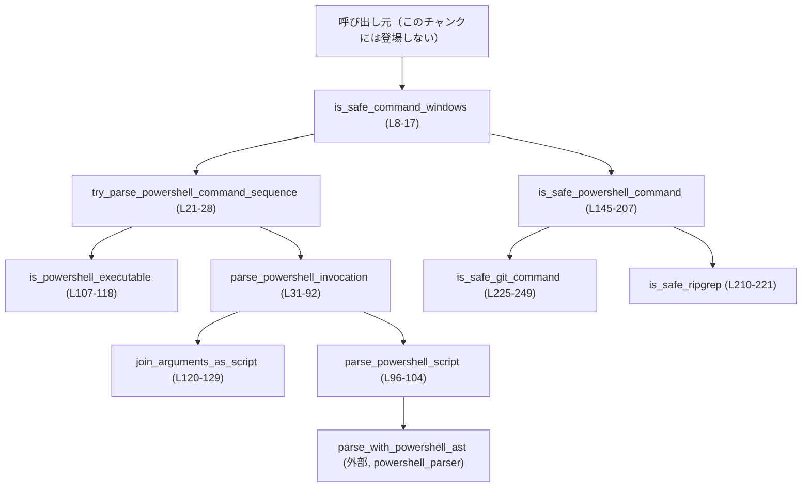
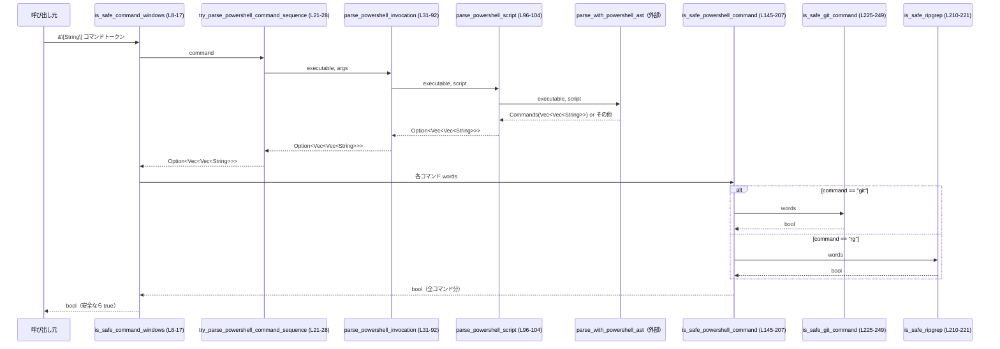

# shell-command/src/command_safety/windows_safe_commands.rs コード解説

## 0. ざっくり一言

Windows 上で実行されるコマンド列のうち、**PowerShell 経由の明示的に読み取り専用と判定できるものだけ**を safelist（ホワイトリスト）方式で `true` とし、それ以外はすべて `false`（危険または不明）と判定するロジックを提供するモジュールです（`is_safe_command_windows`、windows_safe_commands.rs:L6-16, L145-207）。

---

## 1. このモジュールの役割

### 1.1 概要

- このモジュールは **「ユーザーが入力した Windows コマンドを、そのまま実行してよいか」** を判定するために存在し、  
  **PowerShell 経由のコマンドだけを対象に、読み取り専用とみなせるコマンドに限定するチェック機能** を提供します（L6-16, L21-28）。
- 判定結果は `bool` として返され、`true` は「このモジュールの基準では安全」と、`false` は「危険／不明なので自動実行すべきでない」と解釈できます（L8-16）。
- コマンドの解析には PowerShell の AST ベースのパーサ `parse_with_powershell_ast` を用い、構文レベルで不明・危険とみなせるパターンはすべて拒否します（L96-104）。

### 1.2 アーキテクチャ内での位置づけ

このファイル内には 1 つの公開関数 `is_safe_command_windows` があり（L8-17）、内部で複数のヘルパー関数と外部モジュールを呼び出します。

主な依存関係は次の通りです（L1-4, L21-28, L31-92, L96-104, L145-207, L210-221, L225-249）。



- 外部依存：
  - `crate::command_safety::powershell_parser::{parse_with_powershell_ast, PowershellParseOutcome}`（L2-3）
  - `crate::command_safety::is_dangerous_command::git_global_option_requires_prompt`（L1）
  - テスト専用で `crate::powershell::try_find_pwsh_executable_blocking`（L254）

呼び出し元（どこから `is_safe_command_windows` が使われているか）は、このチャンクには現れません。

### 1.3 設計上のポイント

コードから読み取れる設計上の特徴は次の通りです。

- **PowerShell 限定 & デフォルト拒否**
  - コマンド列の先頭が PowerShell 実行ファイル（`powershell`, `pwsh` 系）である場合のみ解析し、それ以外は即座に `false` を返します（L21-28, L107-118）。
  - PowerShell であっても safelist にマッチしない・パースできない・不明な要素が含まれる場合は `false` になります（L31-92, L96-104, L145-207）。

- **2 段階の安全判定**
  1. **構文・呼び出し形式の検査**  
     - 受け取ったトークン列を PowerShell 呼び出しとして解析し、怪しいフラグやサポート外の呼び出し形式を除外します（L31-92）。
     - スクリプト部分は AST パーサ `parse_with_powershell_ast` に渡し、パーサが「コマンド列」と認識できた場合にだけ先へ進みます（L96-104）。
  2. **コマンド内容の safelist/denylist 判定**  
     - 各コマンド（パイプで区切られたセグメント）ごとに `is_safe_powershell_command` でチェックし、  
       読み取り専用の cmdlet/外部コマンドかどうか、またネストした副作用コマンドが含まれていないかを確認します（L145-207）。

- **安全性優先の保守的な挙動**
  - 不明なフラグ（未知の `-Something`）はすべて拒否（L74-78）。
  - `-EncodedCommand`, `-File` など中身が読み取れない構成は拒否（L67-72）。
  - safelist に載っていないコマンド名はデフォルトで拒否（L179-206）。
  - Git・rg のグローバルオプションのうち、外部実行や危険な挙動につながるものは denylist で除外（L210-221, L225-249）。

- **Rust の安全性**
  - すべて safe Rust で書かれており、`unsafe` ブロックは存在しません（ファイル全体より）。
  - インデックスアクセス前に空チェックを行うなど、パニックを避ける防御的な実装になっています（例: L145-149, L21-23, L32-35）。
  - 戻り値は `bool` や `Option<...>` で、エラーやサポート外ケースは `false` / `None` で表現されます（L8-16, L21-23, L31-35, L96-104）。

- **並行性**
  - すべての関数は引数のみを読み取り、グローバルな可変状態を持ちません（ファイル全体）。
  - I/O やロック操作は本体コードにはなく、純粋な計算処理として並行実行しても干渉しない形になっています。  
    （テスト内でのみ `try_find_pwsh_executable_blocking` による外部探索があります: L254-255, L285-291 など）

---

## 2. 主要な機能一覧

このモジュールが提供する主な機能は次の通りです。

- **Windows 用安全判定 API**
  - `is_safe_command_windows`: Windows 上で実行されるコマンドトークン列が、PowerShell の安全な読み取り専用操作に限定されているか判定します（L6-16）。

- **PowerShell 呼び出し解析**
  - `try_parse_powershell_command_sequence`: 先頭トークンが PowerShell 実行ファイルか確認し、スクリプト部分を抽出します（L19-28）。
  - `parse_powershell_invocation`: PowerShell のコマンドラインフラグを解析し、スクリプト文字列を取り出した上で AST パーサに渡します（L30-92）。
  - `parse_powershell_script`: AST パーサ `parse_with_powershell_ast` による解析結果から、コマンド列を抽出します（L94-104）。
  - `is_powershell_executable`: 実行ファイルのパスから PowerShell / pwsh 系かどうかを判別します（L106-118）。

- **PowerShell スクリプトの再構成**
  - `join_arguments_as_script`: 残りのトークン列を PowerShell スクリプト文字列に組み立てます（L120-129）。
  - `quote_argument`: PowerShell ルールに従って引数をクォートします（L131-141）。

- **コマンド内容の安全判定**
  - `is_safe_powershell_command`: パーサが分割した 1 コマンド（トークン列）が読み取り専用かどうかを safelist/denylist で判定します（L143-207）。
  - `is_safe_git_command`: Git サブコマンドとグローバルオプションが安全かどうかをチェックします（L224-249）。
  - `is_safe_ripgrep`: `rg` の危険なオプション（外部プログラム実行など）を検出して拒否します（L209-221）。

- **テスト**
  - Windows 上での想定入力に対する受け入れ/拒否の挙動を網羅するテスト群を持ちます（tests モジュール, L251-553）。

### 2.1 コンポーネント一覧（関数インベントリー）

| 種別 | 名前 | シグネチャ（要約） | 公開 | 定義位置 |
|------|------|--------------------|------|----------|
| 関数 | `is_safe_command_windows` | `(&[String]) -> bool` | `pub` | windows_safe_commands.rs:L8-17 |
| 関数 | `try_parse_powershell_command_sequence` | `(&[String]) -> Option<Vec<Vec<String>>>` | private | L21-28 |
| 関数 | `parse_powershell_invocation` | `(&str, &[String]) -> Option<Vec<Vec<String>>>` | private | L31-92 |
| 関数 | `parse_powershell_script` | `(&str, &str) -> Option<Vec<Vec<String>>>` | private | L96-104 |
| 関数 | `is_powershell_executable` | `(&str) -> bool` | private | L107-118 |
| 関数 | `join_arguments_as_script` | `(&[String]) -> String` | private | L120-129 |
| 関数 | `quote_argument` | `(&str) -> String` | private | L131-141 |
| 関数 | `is_safe_powershell_command` | `(&[String]) -> bool` | private | L145-207 |
| 関数 | `is_safe_ripgrep` | `(&[String]) -> bool` | private | L210-221 |
| 関数 | `is_safe_git_command` | `(&[String]) -> bool` | private | L225-249 |
| 関数 | `vec_str` | `(&[&str]) -> Vec<String>`（テスト用） | cfg(test) | L258-260 |
| テスト | `recognizes_safe_powershell_wrappers` | Windows 用 PowerShell ラッパーの安全ケースを検証 | cfg(all(test, windows)) | L262-293 |
| テスト | `accepts_full_path_powershell_invocations` | フルパス指定の PowerShell 実行ファイルを検証 | cfg(all(test, windows)) | L295-316 |
| テスト | `allows_read_only_pipelines_and_git_usage` | パイプラインや Git 利用の読み取り専用パターンを検証 | cfg(all(test, windows)) | L318-359 |
| テスト | `rejects_git_global_override_options` | 危険な Git グローバルオプションを拒否することを検証 | cfg(all(test, windows)) | L361-394 |
| テスト | `rejects_powershell_commands_with_side_effects` | 副作用を持つ PowerShell 構文や演算子の拒否を検証 | cfg(all(test, windows)) | L396-493 |
| テスト | `accepts_constant_expression_arguments` | 文字列リテラルなど定数引数を許可する挙動を検証 | cfg(all(test, windows)) | L495-508 |
| テスト | `rejects_dynamic_arguments` | `$foo` など動的引数を拒否する挙動を検証 | cfg(all(test, windows)) | L510-523 |
| テスト | `uses_invoked_powershell_variant_for_parsing` | `powershell.exe` と `pwsh.exe` でのパース差異を検証 | cfg(all(test, windows)) | L525-552 |

---

## 3. 公開 API と詳細解説

### 3.1 型一覧（構造体・列挙体など）

このファイル内で新たに定義される構造体・列挙体はありません。外部から利用している代表的な型は次の通りです。

| 名前 | 種別 | 役割 / 用途 | 定義 / 出典 | 使用箇所 |
|------|------|-------------|-------------|----------|
| `PowershellParseOutcome` | 列挙体（外部） | PowerShell AST パーサの結果種別。`Commands` バリアントにコマンド列が入る（L97-100）。 | `crate::command_safety::powershell_parser`（L2） | `parse_powershell_script`（L96-104） |
| `Path` | 構造体（標準） | 実行ファイルパスからファイル名部分（`powershell.exe` など）を取得するために使用（L107-112）。 | `std::path::Path`（L4） | `is_powershell_executable`（L107-118） |
| `Vec<Vec<String>>` | 標準コレクション | PowerShell スクリプトを「コマンドごとのトークン列のベクタ」として表現 | 標準ライブラリ | 返り値として `try_parse_powershell_command_sequence` ほか（L21-28, L31-92, L96-104） |

### 3.2 関数詳細（重要な 7 件）

#### `is_safe_command_windows(command: &[String]) -> bool`

**概要**

- Windows 向けの公開 API で、コマンドトークン列（例: `"powershell.exe"`, `"-Command"`, `"Get-Content foo"`）が **安全な PowerShell 読み取り専用コマンドのみで構成されているか** を判定します（L6-16）。
- PowerShell 以外の実行ファイル、パース不能なスクリプト、safelist 外コマンドなどはすべて `false` となります（L8-16, L21-28, L31-92, L145-207）。

**引数**

| 引数名 | 型 | 説明 |
|--------|----|------|
| `command` | `&[String]` | 実行予定コマンドのトークン列。`command[0]` が実行ファイルパス（例: `powershell.exe`）である前提です（L21-23, テスト例 L264-269）。 |

**戻り値**

- `true`：  
  - 先頭が PowerShell 実行ファイルであり（L21-28, L107-118）、  
  - PowerShell の呼び出し形式が許可された形式で（L31-92）、  
  - AST パーサがコマンド列として解釈でき（L96-104）、  
  - すべてのコマンドが `is_safe_powershell_command` で安全と判定された場合（L8-13, L145-207）。
- `false`：上記のいずれかを満たさない場合。PowerShell 以外のコマンドはすべて `false` です（L14-16, L21-27）。

**内部処理の流れ**

1. `try_parse_powershell_command_sequence(command)` を呼び出し、PowerShell 実行ファイルで始まるか確認しつつ、スクリプトをコマンド列に分解しようとします（L8-10, L21-28）。
2. `try_parse_powershell_command_sequence` が `Some(commands)` を返した場合、`commands.iter().all(|cmd| is_safe_powershell_command(cmd.as_slice()))` によって、すべてのコマンドが安全かどうかを判定します（L10-12, L145-207）。
3. `None` が返った場合（PowerShell でない／解析不能／禁止フラグなど）、`false` を返します（L13-16）。

**Examples（使用例）**

安全なケース（テスト例と同等: L311-315）:

```rust
use shell_command::command_safety::windows_safe_commands::is_safe_command_windows;

fn main() {
    // powershell.exe -Command "Get-Content Cargo.toml"
    let cmd = vec![
        "powershell.exe".to_string(),  // 実行ファイル
        "-Command".to_string(),        // スクリプトを指定
        "Get-Content Cargo.toml".to_string(), // 読み取り専用の cmdlet
    ];

    if is_safe_command_windows(&cmd) {
        // このモジュールの基準では自動実行してよい
        // 実際の実行は別モジュール側で行う想定（このチャンクには現れません）
    } else {
        // 危険または不明なので、ユーザー確認や拒否に回す
    }
}
```

危険なケース（テスト例: L398-403）:

```rust
let cmd = vec![
    "powershell.exe".to_string(),
    "-Command".to_string(),
    "Remove-Item foo.txt".to_string(), // 削除系 cmdlet
];
assert!(!is_safe_command_windows(&cmd));
```

**Errors / Panics**

- この関数自身は panic を起こしません。
  - `try_parse_powershell_command_sequence` が `Option` を返し、`None` の場合は `false` を返すだけです（L8-16, L21-23）。
  - コマンドの中身がどんな文字列でも、内部処理は `Option` や `bool` で安全に扱われます。

**Edge cases（エッジケース）**

- `command` が空スライス：  
  - `split_first()?` により `None` となり、`false` が返ります（L21-23, L13-16）。
- 先頭が PowerShell 以外の実行ファイル（例: `"cmd.exe"` を渡した場合）：
  - `is_powershell_executable` が `false` になり、`try_parse_powershell_command_sequence` は `None` → `false` になります（L21-27, L107-118）。
- PowerShell だがスクリプト指定がない（`"pwsh"` のみなど）:
  - `parse_powershell_invocation` が `None` を返し、`false` となります（L32-35, L90-92, L8-16）。

**使用上の注意点**

- `false` は「必ず危険」という意味ではなく、「この safelist によっては安全と判断できない（＝自動実行すべきでない）」という意味になります。
- 実際の実行制御（`false` のときにユーザーに確認するか完全に拒否するか）は、呼び出し側の責務です。このファイル内ではそこまでは定義されていません。
- Windows 以外の環境でも関数自体はコンパイルされますが、テストは `cfg(all(test, windows))` 限定であり、挙動の想定は Windows 上の PowerShell に基づいています（L251-253, L297-300）。

---

#### `try_parse_powershell_command_sequence(command: &[String]) -> Option<Vec<Vec<String>>>`

**概要**

- コマンド列 `command` の先頭トークンが PowerShell 実行ファイルかどうかを判定し、そうであれば PowerShell 呼び出しとして解析（`parse_powershell_invocation`）を行います（L19-28）。
- PowerShell 以外で始まるコマンドや、空スライスは `None` になります。

**引数**

| 引数名 | 型 | 説明 |
|--------|----|------|
| `command` | `&[String]` | 実行ファイルとその引数を並べたトークン列（L21-23）。 |

**戻り値**

- `Some(Vec<Vec<String>>)`：PowerShell 実行ファイルと認識され、かつ `parse_powershell_invocation` による解析に成功した場合の、**コマンド列（パイプライン各要素ごとのトークン列）**（L21-25）。
- `None`：空入力、PowerShell 以外の実行ファイル、またはそれ以降の解析で拒否された場合（L21-28, L31-92）。

**内部処理の流れ**

1. `command.split_first()?` で、先頭トークン `exe` と残り `rest` に分割します。空スライスなら即 `None`（L21-23）。
2. `is_powershell_executable(exe)` で、ファイル名が `"powershell"`, `"powershell.exe"`, `"pwsh"`, `"pwsh.exe"` のいずれかに一致するか判定します（L23-24, L107-118）。
3. 一致する場合は `parse_powershell_invocation(exe, rest)` を呼び出し、一致しない場合は `None` を返します（L23-27）。

**Errors / Panics**

- 空入力でも `split_first()?` により `None` で終了するため、panic は発生しません（L21-23）。
- `parse_powershell_invocation` がどのような入力でも `Option` で結果を返すため、ここでのエラーは全て `None` で表現されます（L23-25, L31-92）。

**Edge cases**

- 実行ファイルパスにディレクトリが含まれている場合も、`Path::new(exe).file_name()` によりファイル名部分だけで判定されます（L107-112, テスト L302-308, L311-315）。
- Linux 上で Windows 風パスを渡した場合の挙動については、このファイルでは Windows 想定のみで、テストも Windows 限定です（L297-300）。

**使用上の注意点**

- この関数は `pub` ではなく内部用であり、外部から直接呼び出す前提にはなっていません（L21）。
- 呼び出し側は `Some` が返ってきた場合だけコマンド内容の safelist 判定に進む設計です（`is_safe_command_windows` の使い方, L8-13）。

---

#### `parse_powershell_invocation(executable: &str, args: &[String]) -> Option<Vec<Vec<String>>>`

**概要**

- PowerShell 実行ファイル名（`executable`）とそれ以降の引数列（`args`）から、
  - 許可されたフラグ構成かどうかをチェックし、
  - スクリプト部分を抽出して AST パーサに渡し、
  - 安全に解析できた場合のみコマンド列を返します（L30-92）。

**引数**

| 引数名 | 型 | 説明 |
|--------|----|------|
| `executable` | `&str` | `powershell` / `pwsh` 系の実行ファイル名またはパス（L31-32, L107-118）。 |
| `args` | `&[String]` | `executable` 以降のトークン列（フラグやスクリプト） （L31-32）。 |

**戻り値**

- `Some(Vec<Vec<String>>)`：  
  - フラグ構成がホワイトリストに従っており、  
  - `-Command` / `/Command` / `-c` / `-Command:...` / `/Command:...` などでスクリプトが指定され、  
  - または `-Command` 無しでスクリプト本体が直接続き、  
  - かつ AST パーサがコマンド列を返した場合（L42-50, L51-59, L80-86, L96-104）。
- `None`：空引数、危険なフラグ、未知のフラグ、サポート外の呼び出し形式、または AST パーサが `Commands` を返さなかった場合（L32-35, L67-78, L90-92, L96-104）。

**内部処理の流れ**

1. `args.is_empty()` の場合、例として `"pwsh"` のみなどは `None` を返します（L32-35）。
2. `idx` を 0 から始めて `args` を走査し、現在のトークン `arg` とその小文字 `lower` に対して `match` します（L37-41）。
3. 分岐:
   - `-Command` / `/Command` / `-c`（L42-50）:
     - 直後の `script` を `args.get(idx + 1)?` で取得し（足りなければ `None`）、  
       それ以外のトークンが存在する（`idx + 2 != args.len()`）場合は拒否（L43-47）。  
       1 トークンだけをスクリプトとみなし、`parse_powershell_script` へ渡します（L49-50）。
   - `-Command:` / `/Command:`（L51-59）:
     - `-Command:dir` のようにコロン区切りの形。後続のトークンが存在する場合は拒否（L52-55）。
     - `arg.split_once(':')?.1` でコロン以降をスクリプトとして抽出し、`parse_powershell_script` に渡します（L57-58）。
   - 許可されるフラグ: `-NoLogo`, `-NoProfile`, `-NonInteractive`, `-MTA`, `-STA`（L61-65）:
     - インデックスだけを進めてループ継続（L61-65）。
   - 明示的に禁止されるフラグ: `-EncodedCommand`, `-EC`, `-File`, `/File`, `-WindowStyle`, `-ExecutionPolicy`, `-WorkingDirectory`（L67-72）:
     - 中身がブラックボックスまたは実行環境を変更するため即 `None` を返します（L67-72）。
   - その他の `-` で始まる未知フラグ（L74-78）:
     - 保守的に `None`（L74-78）。
   - それ以外（最初の非フラグトークン）:  
     - 残り `&args[idx..]` を `join_arguments_as_script` でスクリプト文字列に組み立て、`parse_powershell_script` に渡します（L80-86, L120-129）。

4. ループを抜けてもスクリプトが見つからない場合、`None` を返します（L90-92）。

**Errors / Panics**

- `args.get(idx + 1)?`, `split_once(':')?` など `?` 演算子を利用しており、足りないトークンや `:` がない場合も `None` で終了するだけで、panic は発生しません（L43, L57）。
- 解析の途中で `parse_powershell_script` が `None` を返した場合も、そのまま `None` が返るだけです（L49-50, L58-59, L84-86）。

**Edge cases**

- `pwsh -Command foo bar` → スクリプトトークンが 2 つになるため拒否（L44-47）。
- `pwsh -Command:dir C:\` → `-Command:` に付随するトークンがあるため拒否（L51-56）。
- 未知のフラグ（例: `-UnknownFlag`）を含む場合はすべて拒否（L74-78, テストコメント L76-77）。

**使用上の注意点**

- PowerShell のフラグ解釈がここにハードコードされているため、新しい公式フラグや別名を許可したい場合は、この関数の `match` 分岐を拡張する必要があります（L41-87）。
- スクリプト文字列のパース結果そのものの安全性判定は行わず、AST パーサと `is_safe_powershell_command` に委譲しています（L49-50, L58-59, L84-86, L145-207）。

---

#### `parse_powershell_script(executable: &str, script: &str) -> Option<Vec<Vec<String>>>`

**概要**

- PowerShell 実行ファイルの種類（`powershell.exe`, `pwsh.exe` など）と、抽出済みスクリプト文字列を受け取り、  
  外部の AST パーサ `parse_with_powershell_ast` による解析結果から、コマンド列のみを取り出します（L94-104）。

**引数**

| 引数名 | 型 | 説明 |
|--------|----|------|
| `executable` | `&str` | 使用されている PowerShell バイナリのパスまたは名前（L96-99）。 |
| `script` | `&str` | `-Command` や引数結合から得た PowerShell スクリプト文字列（L96-99）。 |

**戻り値**

- `Some(Vec<Vec<String>>)`：`parse_with_powershell_ast(executable, script)` が `PowershellParseOutcome::Commands(commands)` を返した場合（L97-100）。
- `None`：それ以外のバリアント（例: サポート外構文、動的引数を含むものなど）だった場合（L97-104）。  
  ※ 具体的なバリアント名はこのチャンクには現れませんが、テストから、リダイレクトや `&&`, `$foo` などを含むスクリプトは `None` になることが分かります（例: L418-433, L473-485, L511-523）。

**内部処理の流れ**

1. `parse_with_powershell_ast(executable, script)` を呼び出します（L97-99）。
2. `if let PowershellParseOutcome::Commands(commands) = ...` で、結果が `Commands` バリアントかどうかを判定します（L97-100）。
3. `Commands` の場合は `Some(commands)`、それ以外は `None` を返します（L100-103）。

**Errors / Panics**

- この関数自体は `match` による単純な分岐のみで、panic を発生させるコードは含まれていません（L96-104）。
- AST パーサ `parse_with_powershell_ast` の内部でのエラー処理は、このチャンクには現れません。

**Edge cases**

テストから推測できる範囲での挙動（すべて `is_safe_command_windows` 経由ですが、パーサ起因と考えられます）:

- リダイレクト（`>` や `2>`）、`&&`、`&`（call 演算子）、`$(...)` などを含むスクリプトは `Commands` として扱われず、結果として `None` になっていると考えられます（L418-440, L473-485）。
- 動的変数参照（`$foo`, `"foo $bar"`）を含むスクリプトも `None` になっており、定数式以外を拒否する方針が確認できます（L511-523）。

※ これらは AST パーサの挙動に依存しており、このファイル内では `Commands` でない結果を一律 `None` として扱うだけです（L97-104）。

**使用上の注意点**

- PowerShell のバージョン差異に応じたパースは `executable` の値（`powershell.exe` か `pwsh.exe` か）に依存します。  
  テスト `uses_invoked_powershell_variant_for_parsing` から、同じスクリプト `pwd && ls` でも、`powershell.exe` では安全とみなされず、`pwsh.exe` では安全とみなされるケースがあることがわかります（L525-552）。
- この関数は内部用であり、外部から直接呼び出す設計にはなっていません（L96）。

---

#### `is_safe_powershell_command(words: &[String]) -> bool`

**概要**

- AST パーサから渡された 1 コマンド分のトークン列 `words` が **読み取り専用のコマンドだけで構成されているか** を判定します（L143-207）。
- コマンド名が safelist に含まれているかどうかだけでなく、**引数やネストした式の中に副作用コマンドが現れていないか** も検査します（L151-173）。

**引数**

| 引数名 | 型 | 説明 |
|--------|----|------|
| `words` | `&[String]` | 単一の PowerShell コマンドを構成するトークン列。`words[0]` がコマンド名（cmdlet や外部コマンド）です（L145-151, L175-179）。 |

**戻り値**

- `true`：  
  - `words` が空でなく（L145-149）、  
  - すべてのトークンに副作用コマンド名（`Set-Content` など）が含まれておらず（L151-173）、  
  - コマンド名（`words[0]`）が safelist のいずれか（`Get-Content`, `Get-ChildItem`, `git`, `rg` など）である場合（L179-189, L191-193）。
- `false`：上記以外のすべての場合。未知のコマンド名はデフォルトで `false` になります（L195-206）。

**内部処理の流れ**

1. `words.is_empty()` の場合、空コマンドは安全とみなさず `false` を返します（L145-149）。
2. 全トークン `w` に対してループし（L151-152）:
   - `inner = w.trim_matches(|c| c == '(' || c == ')').trim_start_matches('-').to_ascii_lowercase()` により、前後の `(`, `)` と先頭の `-` を除去した小文字化文字列を取得します（L153-156）。
   - `inner` が以下の副作用コマンド名のいずれかなら `false` を返します（L157-169）:
     - `set-content`, `add-content`, `out-file`, `new-item`, `remove-item`, `move-item`, `copy-item`, `rename-item`, `start-process`, `stop-process`。
   - これにより、`Write-Output (Set-Content foo.txt ...)` のようなネストした形も検出できます（L170-172, テスト L449-464）。
3. ループを抜けたあと、`words[0]` からコマンド名を同様に加工して `command` を得ます（L175-178）。
4. `match command.as_str()` でコマンド名に応じて判定します（L179-206）。
   - 読み取り専用とみなす cmdlet / エイリアス → `true`（`echo`, `Get-ChildItem`, `Get-Content`, `Measure-Object`, `Get-Location`, `Test-Path`, `Resolve-Path`, `Select-Object`, `Get-Item` 等, L180-189）。
   - `git` → `is_safe_git_command(words)` に委譲（L191）。
   - `rg` → `is_safe_ripgrep(words)` に委譲（L193）。
   - 副作用コマンド名（明示的な再確認） → `false`（L195-200）。
   - その他 → `false`（L202-205）。

**Errors / Panics**

- `words[0]` へのアクセスは、先頭で空チェックしているため安全です（L145-149, L175-178）。
- `trim_matches`, `trim_start_matches`, `to_ascii_lowercase` は panic を起こさないメソッドであり、ここでのエラーはすべて `false` の戻り値で表現されます（L153-156, L175-178）。

**Edge cases**

- `words` が `[""]`（空文字列 1 つ）のような場合：
  - `command` は空文字になり、どの safelist にも一致しないため `false`。  
    テスト `''` のケースがこれに相当します（L487-492）。
- `Write-Output (Set-Content foo6.txt 'abc')` のようなネスト:
  - トークンに `(Set-Content` が含まれ、`inner` が `set-content` となるため `false`（L151-173, テスト L449-453）。
- `Write-Host (Remove-Item foo.txt)` など、他の副作用 cmdlet のネストも同様に `false`（L151-169, テスト L455-460）。
- `git` や `rg` はここでは詳細チェックせず、それぞれ専用関数に委譲します（L191-193）。

**使用上の注意点**

- この関数は AST パーサによって **既に構文的に分割されたコマンドトークン列** を前提としており、生の文字列を渡すことは想定されていません（L96-104, L145-151）。
- safelist 以外のコマンドはすべて拒否されるため、新しく読み取り専用の cmdlet を許可したい場合は、この `match` に追記する必要があります（L179-206）。
- Redirection や call 演算子 (`>`, `&` など) はこの関数内では直接検査していませんが、AST パーサがそのような構文を `Commands` として返さないため、結果的に `false` になります（L418-440, L473-485）。

---

#### `is_safe_git_command(words: &[String]) -> bool`

**概要**

- `git` コマンドのトークン列が **読み取り専用のサブコマンドかつ安全なグローバルオプションのみ**を使用しているかどうかを判定します（L224-249）。
- 読み取り専用サブコマンドとして `status`, `log`, `show`, `diff`, `cat-file` のみを許可し、危険なグローバルオプションは除外します（L226-227, L231-239）。

**引数**

| 引数名 | 型 | 説明 |
|--------|----|------|
| `words` | `&[String]` | `["git", <フラグ…>, <サブコマンド?>, ...]` 形式のトークン列（L225-229）。 |

**戻り値**

- `true`：  
  - `git` の後に現れる最初の **非フラグ引数** が `status`, `log`, `show`, `diff`, `cat-file` のいずれかであり（L226-227, L228-245）、  
  - それまでに現れたフラグに危険なグローバルオプションが含まれていない場合（L231-239）。
- `false`：  
  - サブコマンドが指定されていない、または safelist 以外のサブコマンドである、  
  - あるいは危険なグローバルオプションを含む場合（L231-239, L247-248）。

**内部処理の流れ**

1. `SAFE_SUBCOMMANDS` 配列に安全なサブコマンド名を定義します（L226-227）。
2. `for arg in words.iter().skip(1)` で `git` 以降の引数を順に処理します（L228-229）。
3. 各 `arg` について:
   - `arg_lc = arg.to_ascii_lowercase()` を得る（L229-230）。
   - `arg.starts_with('-')` の場合（フラグ）:
     - `git_global_option_requires_prompt(&arg_lc)` が `true` なら危険なグローバルオプションと判断（具体内容は外部関数に委譲, L1, L231-233）。
     - あるいは `--config` / `--config=` で始まる場合も危険とみなし `false` を返します（L233-235, コメント L236-237）。
     - 上記以外のフラグはスキップして次へ（L241-241）。
   - `arg` が非フラグ（`-` で始まらない）ならサブコマンド名とみなし、`SAFE_SUBCOMMANDS.contains(&arg_lc.as_str())` を返します（L243-245）。
4. ループを最後まで通過してもサブコマンドが見つからない場合（`git` だけなど）、`false` を返します（L247-248）。

**Errors / Panics**

- インデックスアクセスは使用しておらず、`iter()` ベースの処理のため panic の可能性は低いです（L228-245）。
- 危険オプションの判定は外部関数 `git_global_option_requires_prompt` に委譲されており、その内部挙動はこのチャンクには現れません（L1, L231-233）。

**Edge cases**

- `git`（サブコマンドなし） → ループ終了後 `false`（L247-248, テストコメント L247-248）。
- `git status` → 最初の非フラグ `status` が safelist に含まれるため `true`（L226-227, L243-245, テスト L271-276）。
- `git -c core.pager=cat show HEAD:foo.rs` → `-c` は外部関数側で危険と判定される想定で `false`（L231-239, テスト L369-372, L383-392）。
- `git --config-env core.pager=PAGER show ...` など、`--config` 系オプション → 文字列一致で `false`（L233-235, テスト L369-382）。

**使用上の注意点**

- 許可されるサブコマンドは現状 `SAFE_SUBCOMMANDS` に限定されます。  
  追加したい場合はここに明示的に追加する必要があります（L226-227）。
- 危険なグローバルオプションの詳細な定義は外部の `git_global_option_requires_prompt` に依存しており、このファイルだけでは網羅的な一覧は確認できません（L1, L231-233）。

---

#### `is_safe_ripgrep(words: &[String]) -> bool`

**概要**

- `rg`（ripgrep）のトークン列について、**外部プログラムを起動したりアーカイブを自動展開するような危険なオプション**を利用していないかをチェックします（L209-221）。
- 認識している危険オプションが一つでも含まれていれば `false`、そうでなければ `true` です（L210-221）。

**引数**

| 引数名 | 型 | 説明 |
|--------|----|------|
| `words` | `&[String]` | `["rg", <オプション...>, <パターン?>, ...]` 形式のトークン列（L210-215）。 |

**戻り値**

- `true`：  
  - `words[1..]` に危険オプション `--pre`, `--hostname-bin`, `--search-zip`, `-z` がいずれも含まれていない場合（L211-221）。
- `false`：  
  - 上記のいずれかが存在する場合。`--pre=...` のような `=` 付き形式も含みます（L211-221）。

**内部処理の流れ**

1. `UNSAFE_RIPGREP_OPTIONS_WITH_ARGS` と `UNSAFE_RIPGREP_OPTIONS_WITHOUT_ARGS` に危険オプションを定義します（L211-212）。
2. `words.iter().skip(1)` で `rg` 以降の引数を走査し、`any` で「危険オプションを１つでも含むか」を判定します（L214-221）。
3. 各 `arg` について:
   - 小文字化 `arg_lc` を取得（L215-216）。
   - `UNSAFE_RIPGREP_OPTIONS_WITHOUT_ARGS.contains(&arg_lc.as_str())` で引数を取らない危険オプション（`--search-zip`, `-z`）をチェック（L217-217）。
   - `UNSAFE_RIPGREP_OPTIONS_WITH_ARGS.iter().any(...)` で、`--pre` や `--hostname-bin` そのもの、または `--pre=cat` のような `=` 付き形式をチェック（L218-220）。
4. `! ...any(...)` によって、「危険オプションが一つもない」場合に `true` を返します（L214-221）。

**Errors / Panics**

- `iter().skip(1)` を使用しているため、`words` が 1 要素以下でも空イテレータになり、panic の心配はありません（L214-221）。
- 文字列操作はすべて `String` の安全なメソッドで行われます（L215-220）。

**Edge cases**

- `rg --pre cat pattern` → `--pre` が危険オプションとして検出され `false`（L211-221, テスト L405-410）。
- `rg --search-zip pattern` → `--search-zip` により `false`（L212, L216-221）。
- 大文字・小文字の違いは `to_ascii_lowercase` により吸収されます（L215-216）。

**使用上の注意点**

- 安全かどうかの判定は **危険オプションの存在チェックのみ**であり、サブコマンドや検索パターンの中身はここでは検査していません（L210-221）。
- 新しい危険オプションが ripgrep に追加された場合は、この配列を更新する必要があります（L211-212）。

---

### 3.3 その他の関数

補助的な関数や単純なラッパー関数の一覧です。

| 関数名 | 役割（1 行） | 定義位置 |
|--------|--------------|----------|
| `is_powershell_executable(exe: &str) -> bool` | 実行ファイルパスから basename を取り、小文字化して `powershell` / `pwsh` 系かどうか判定します（L107-118）。 | windows_safe_commands.rs:L107-118 |
| `join_arguments_as_script(args: &[String]) -> String` | 最初のトークンをそのまま、残りを `quote_argument` でクォートしながらスペース区切りのスクリプト文字列を生成します（L120-129）。 | L120-129 |
| `quote_argument(arg: &str) -> String` | 空文字は `''`、空白を含む引数は `'...'` で囲み、内部の `'` は `''` にエスケープする PowerShell 向けクォート処理です（L131-141）。 | L131-141 |
| `vec_str(args: &[&str]) -> Vec<String>` | テスト用ヘルパー。`&[&str]` を `Vec<String>` に変換します（L258-260）。 | L258-260 |

---

## 4. データフロー

PowerShell 経由の安全な Git/rg パイプラインを判定する典型的な流れを示します。

例：`pwsh -NoLogo -NoProfile -Command "rg foo | Measure-Object"` の場合（テスト類似: L324-332）

1. 呼び出し元が CLI からトークン列 `["pwsh", "-NoLogo", "-NoProfile", "-Command", "rg foo | Measure-Object"]` を構築し、`is_safe_command_windows` に渡します（L8-17）。
2. `try_parse_powershell_command_sequence` が先頭トークン `pwsh` を PowerShell 実行ファイルと認識し（L21-24, L107-118）、`parse_powershell_invocation` に渡します（L31-92）。
3. `parse_powershell_invocation` が許可されたフラグをスキップしつつ、`-Command` の直後のスクリプトを `parse_powershell_script` に送ります（L42-50）。
4. `parse_powershell_script` が AST パーサを呼び、パイプラインを `vec![["rg", "foo"], ["Measure-Object"]]` のようなコマンド列に分割した `Commands` を受け取ります（L96-104）。
5. `is_safe_command_windows` は各コマンドに対し `is_safe_powershell_command` を呼び、1 つ目では `rg`（`is_safe_ripgrep`）、2 つ目では `measure-object` を安全かどうか判定します（L10-12, L145-207, L210-221）。
6. 両方が `true` であれば全体として `true` を返します（L10-13）。

その流れをシーケンス図で表すと次のようになります。



---

## 5. 使い方（How to Use）

### 5.1 基本的な使用方法

このモジュールは、**既にトークン化されたコマンド列**に対して安全性判定を行う設計です。典型的な呼び出しフローは次のようになります。

```rust
use shell_command::command_safety::windows_safe_commands::is_safe_command_windows;

fn main() {
    // 例: powershell.exe -NoProfile -Command "Get-Content Cargo.toml"
    let cmd = vec![
        "powershell.exe".to_string(),
        "-NoProfile".to_string(),
        "-Command".to_string(),
        "Get-Content Cargo.toml".to_string(),
    ];

    if is_safe_command_windows(&cmd) {
        // この基準では安全と判定されたので、実行してもよい
        // 実際のプロセス起動コードは別モジュールに置かれるはずです（このチャンクには登場しません）
    } else {
        // 危険／不明
        // 例: ユーザーに確認ダイアログを出す、ログするなど
    }
}
```

- 上記はテスト `accepts_full_path_powershell_invocations` と同種の入力パターンです（L311-315）。
- この関数はコマンドを実行するわけではなく、あくまで実行して良いか判定するだけです（L8-16）。

### 5.2 よくある使用パターン

1. **読み取り専用 Git コマンドの許可**

```rust
let cmd = vec![
    "powershell.exe".to_string(),
    "-Command".to_string(),
    "git status".to_string(),
];

assert!(is_safe_command_windows(&cmd)); // L271-276 に対応するテストあり
```

- `git status` は safelist サブコマンドの一つであり（L226-227）、危険なグローバルオプションも指定されていないため `true` になります。

1. **rg + パイプラインの読み取り専用操作**

```rust
let cmd = vec![
    "powershell.exe".to_string(),
    "-Command".to_string(),
    "rg --files-with-matches foo | Measure-Object".to_string(),
];

assert!(is_safe_command_windows(&cmd)); // 類似パターンがテスト L324-332 に存在
```

- `rg` は `is_safe_ripgrep` によって危険オプションの有無のみチェックされ（L210-221）、  
  `Measure-Object` は safelist に含まれるため（L184-185）、AST パーサが適切に分割できれば `true` になります。

1. **直接 PowerShell cmdlet を呼び出す**

```rust
let cmd = vec![
    "powershell.exe".to_string(),
    "Get-Content".to_string(),
    "Cargo.toml".to_string(),
];

assert!(is_safe_command_windows(&cmd)); // テスト L278-282 と同様
```

- `-Command` を使わずに、PowerShell の引数として cmdlet とパラメータを渡す形式も解析対象です（L80-86）。

### 5.3 よくある間違い

**間違い例 1: PowerShell 以外の実行ファイルを許可しようとする**

```rust
// 間違い: cmd.exe 経由のコマンドをここで安全判定しようとしている
let cmd = vec![
    "cmd.exe".to_string(),
    "/C".to_string(),
    "dir".to_string(),
];
assert!(!is_safe_command_windows(&cmd)); // is_powershell_executable が false のため L21-27
```

- `try_parse_powershell_command_sequence` は PowerShell 実行ファイル名のみを許可するため（L21-27, L107-118）、その他はすべて `false` になります。

**間違い例 2: `-Command` に複数トークンを渡す**

```rust
// 間違い: "pwsh -Command ls extra" のように余分なトークンを渡している
let cmd = vec![
    "pwsh".to_string(),
    "-Command".to_string(),
    "ls".to_string(),
    "extra".to_string(),
];
assert!(!is_safe_command_windows(&cmd)); // L44-47 で拒否
```

- `-Command` の後には 1 つのスクリプトトークンだけを受け付け、それ以外のトークンが存在すると拒否されます（L44-47）。

**間違い例 3: 副作用コマンドを含むスクリプト**

```rust
// 副作用あり: Remove-Item の利用
let cmd = vec![
    "powershell.exe".to_string(),
    "-Command".to_string(),
    "Remove-Item foo.txt".to_string(),
];
assert!(!is_safe_command_windows(&cmd)); // L396-403 テスト参照
```

- `Remove-Item` は `is_safe_powershell_command` で明示的に禁止されているため `false` になります（L157-169, L195-200）。

### 5.4 使用上の注意点（まとめ）

- **前提条件**
  - `command` スライスは、OS が実際に実行するトークン列と同じ形にする必要があります（L21-23）。  
    （例: `powershell.exe`, `"-Command"`, `"Get-Content foo"`）
  - 先頭トークンが PowerShell / pwsh 以外の場合は常に `false` になります（L21-27, L107-118）。

- **禁止事項 / 拒否される代表例**
  - PowerShell の `-EncodedCommand`, `-File` など、スクリプトの中身が見えない形（L67-72）。
  - 未知の PowerShell フラグ（L74-78）。
  - PowerShell の副作用 cmdlet（`Set-Content`, `Remove-Item`, `Start-Process` 等）や、そのネスト・サブ式（L151-173, L195-200, テスト L396-493）。
  - ripgrep の `--pre`, `--search-zip`, `-z` など（L211-212, L216-221）。
  - Git の危険なグローバルオプション（`git_global_option_requires_prompt` が `true` を返すもの、`--config` 系など, L231-235, テスト L369-382）。

- **エラー処理**
  - 不正な入力はすべて `false` / `None` にマップされ、panic は発生しない設計になっています（L21-23, L32-35, L43-49, L51-58, L96-104, L145-149）。
  - AST パーサ側のエラーやサポート外構文も、`PowershellParseOutcome::Commands` 以外として扱われ `None` になるため、`false` に繋がります（L97-104）。

- **パフォーマンス**
  - 主なコストは AST パーサ `parse_with_powershell_ast` の呼び出しにあります（L96-99）。  
    この関数は I/O を行わない純粋な計算であり、短時間のコマンド判定を頻繁に行う用途に向いています。
  - 文字列のコピーは `join_arguments_as_script` の `first.clone()` 程度で、全体として比較的軽量です（L120-125）。

- **並行性**
  - グローバル状態や外部リソースに依存せず、純粋関数として振る舞うため、複数スレッドから同時に安全に利用できます（ファイル全体）。

---

## 6. 変更の仕方（How to Modify）

### 6.1 新しい機能を追加する場合

**例: 新しい読み取り専用 PowerShell cmdlet を許可したい**

1. `is_safe_powershell_command` の `match command.as_str()` に、新しい cmdlet 名またはエイリアスを `true` 支持の分岐として追加します（L179-189）。
2. その cmdlet に副作用がないことを確認し、副作用 cmdlet リスト（L157-169, L195-200）に含めないことを確認します。
3. 該当 cmdlet を利用した安全なコマンド例を、tests モジュールに追加します（L262-359 あたりのテストパターンを参考にする）。

**例: 新しい危険な Git オプションを拒否したい**

1. `crate::command_safety::is_dangerous_command::git_global_option_requires_prompt` の実装側に、そのオプションを追加します（このチャンクには定義がないため詳細は不明ですが、L1, L231-233 より）。
2. 必要に応じてテスト `rejects_git_global_override_options`（L361-394）に新しいケースを追加し、期待値が `false` であることを確認します。

**例: 新しい危険な rg オプションを拒否したい**

1. `UNSAFE_RIPGREP_OPTIONS_WITH_ARGS` または `UNSAFE_RIPGREP_OPTIONS_WITHOUT_ARGS` に追加します（L211-212）。
2. 新しいテストケースを `rejects_powershell_commands_with_side_effects` などに追加し、挙動を固定します（L396-493）。

### 6.2 既存の機能を変更する場合

- **影響範囲の確認**
  - `is_safe_command_windows` はこのファイル唯一の `pub` 関数であり（L8-17）、モジュール外からも呼ばれる可能性があります。呼び出し元はこのチャンクには現れないため、検索などで利用箇所を確認する必要があります。
  - PowerShell のパースロジック（L31-92）や safelist ロジック（L145-207）は、多数のテストに裏付けられているため、変更の際はテストを参考に挙動を維持・更新する必要があります（L262-552）。

- **契約（前提条件・返り値の意味）**
  - `is_safe_command_windows` は「安全であることを完全には保証しないが、このモジュールの基準では安全」として `true` を返す設計です（L6-16）。  
    返り値の意味（true = safelist を満たす／false = それ以外）は変更しないほうが、呼び出し側との契約を保ちやすくなります。
  - 解析不能な構文や未知のフラグを `false` ではなくエラー型で返すように変更する場合、呼び出し元のインターフェースも変わるため、広範な変更になります。

- **テストと使用箇所の再確認**
  - テストは PowerShell のパース挙動や Git/rg オプションパターンをかなり網羅しています（L262-552）。変更時は:
    - 既存テストがすべて通るかどうかを確認する。
    - 期待仕様が変わる場合はテストの期待値も更新する。
  - 特に Windows 固有のパス・挙動については `cfg!(windows)` を用いた分岐があり（L297-300, L526-528）、OS ごとの挙動差も考慮する必要があります。

---

## 7. 関連ファイル

このモジュールと密接に関係する他モジュール（ファイルパスはこのチャンクには現れないため、モジュールパスのみ記載します）。

| モジュール / パス | 役割 / 関係 |
|-------------------|------------|
| `crate::command_safety::is_dangerous_command` | `git_global_option_requires_prompt` を提供し、Git グローバルオプションの危険性を判定します（L1, L231-233）。Git コマンドの安全性判定に必須です。 |
| `crate::command_safety::powershell_parser` | `PowershellParseOutcome` 列挙体と `parse_with_powershell_ast` 関数を提供し、PowerShell スクリプトを AST ベースで解析します（L2-3, L96-104）。この結果に基づいてコマンド分割および構文レベルの安全性チェックが行われます。 |
| `crate::powershell`（テストのみ） | `try_find_pwsh_executable_blocking` を通じて `pwsh.exe` バイナリを探索し、テストの互換性確認に用いられます（L254-255, L285-291, L302-308, L320-359, L363-393, L542-552）。 |
| `std::path::Path` | 実行ファイルパスから basename を取得するために利用されます。PowerShell 実行ファイルの判定で使用されます（L4, L107-112）。 |

このファイル単体で、呼び出し元の実装や実際のコマンド実行ロジックは確認できません。そのため、`is_safe_command_windows` の返り値をどう扱うか（例: `false` のときにユーザーに確認するか完全に禁止するか）は、このチャンクには現れない他のモジュールに委ねられています。
