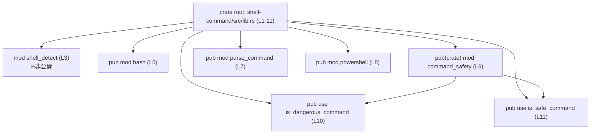

# shell-command/src/lib.rs コード解説

## 0. ざっくり一言

`shell-command` クレートのルートモジュールであり、**コマンドのパースと安全性チェック機能をまとめて公開するハブ**として機能しています（`shell-command/src/lib.rs:L1-11`）。

---

## 1. このモジュールの役割

### 1.1 概要

- クレート全体の目的は、クレート先頭のドキュコメントから次のように読み取れます。

  > `//! Command parsing and safety utilities shared across Codex crates.`  
  > （コマンドのパースと安全性ユーティリティを、複数の Codex クレート間で共有する）

  （`shell-command/src/lib.rs:L1-1`）

- この `lib.rs` 自体は、  
  - サブモジュール（`bash`, `powershell`, `parse_command`, `command_safety`, `shell_detect`）の宣言  
  - 一部関数（`is_safe_command`, `is_dangerous_command`）の再エクスポート  
 だけを行い、自身ではロジックを持たない構造になっています（`L3-8`, `L10-11`）。

### 1.2 アーキテクチャ内での位置づけ

このファイルはクレートのエントリポイントとして、他モジュールとの依存関係を宣言しています。



- `bash`, `parse_command`, `powershell` は外部クレートから直接インポート可能な公開モジュールです（`L5`, `L7`, `L8`）。
- `command_safety` は `pub(crate)` なのでクレート内専用ですが、その中の `is_dangerous_command`, `is_safe_command` は `pub use` によって外部公開されています（`L6`, `L10-11`）。
- `shell_detect` は非公開モジュールであり、このチャンクからは実装も利用箇所も分かりません（`L3`）。

### 1.3 設計上のポイント

コードから読み取れる設計上の特徴は次のとおりです。

- **ルートモジュールは薄いハブ**  
  - ビジネスロジックや処理は一切持たず、モジュール宣言と再エクスポートのみです（`L3-8`, `L10-11`）。
- **実装と公開 API の分離**  
  - 安全性チェックの実装は `pub(crate) mod command_safety;` で内部に隠し（`L6`）、
  - 外部には `pub use command_safety::is_dangerous_command;` / `is_safe_command;` のみを露出しています（`L10-11`）。
- **段階的な可視性管理**  
  - モジュール単位で `pub` / `pub(crate)` / 非公開を使い分けています（`L3`, `L5-8`）。
- **状態や並行性は持たない**  
  - このファイルにはグローバル変数・構造体・関数定義が存在せず、状態管理やスレッド/非同期処理は行っていません（`L1-11`）。

---

## 2. 主要な機能一覧（このファイル経由で見えるもの）

このチャンクから**名前と可視性だけ**が分かる主要コンポーネントは次のとおりです。

> ※ 役割はモジュール名から推測できますが、実装はこのチャンクに含まれないため、詳細な挙動は不明です。

- `bash` モジュール（`pub mod bash;`）  
  - Bash シェル関連のコマンド処理・パース機能である可能性が高いですが、詳細は不明です（`L5`）。
- `powershell` モジュール（`pub mod powershell;`）  
  - PowerShell 関連の機能モジュールと推測されますが、詳細は不明です（`L8`）。
- `parse_command` モジュール（`pub mod parse_command;`）  
  - シェルコマンドのパース処理を担うモジュールであると推測されますが、詳細は不明です（`L7`）。
- `command_safety` モジュール（`pub(crate) mod command_safety;`）  
  - コマンドの安全性判定ロジックを内包していると推測されます（`L6`）。
- `shell_detect` モジュール（`mod shell_detect;`）  
  - 使用シェルの検出に関する内部ユーティリティの可能性がありますが、内容は不明です（`L3`）。
- 関数 `is_dangerous_command`（`pub use command_safety::is_dangerous_command;`）  
  - コマンドを「危険」と判定するヘルパと推測されますが、シグネチャや判定基準は不明です（`L10`）。
- 関数 `is_safe_command`（`pub use command_safety::is_safe_command;`）  
  - コマンドの「安全」判定に関わる関数と推測されますが、詳細は不明です（`L11`）。

---

## 3. 公開 API と詳細解説

### 3.1 型一覧（構造体・列挙体など）

このファイル内には、構造体・列挙体・型エイリアスなどの**型定義は存在しません**（`shell-command/src/lib.rs:L1-11`）。

代わりに、モジュールと再エクスポート関数のインベントリーを示します。

#### モジュール一覧

| 名前              | 種別     | 可視性      | 役割（名前からの推測、実装は不明）                                           | 根拠 |
|-------------------|----------|-------------|-------------------------------------------------------------------------------|------|
| `shell_detect`    | モジュール | 非公開      | 使用しているシェルの種類を検出する内部ユーティリティである可能性があります | `lib.rs:L3-3` |
| `bash`            | モジュール | `pub`       | Bash シェル向けのコマンドパース/実行補助などの機能モジュールと推測されます | `lib.rs:L5-5` |
| `command_safety`  | モジュール | `pub(crate)` | コマンドの安全性チェックロジックをまとめた内部モジュールと推測されます     | `lib.rs:L6-6` |
| `parse_command`   | モジュール | `pub`       | シェルコマンドを内部表現にパースするモジュールの可能性があります           | `lib.rs:L7-7` |
| `powershell`      | モジュール | `pub`       | PowerShell 向けのコマンド処理・ラッパ機能を持つモジュールと推測されます    | `lib.rs:L8-8` |

> 役割列は名称からの推測であり、このチャンクから挙動までは読み取れません。

#### 再エクスポートされる関数一覧

| 名前                    | 元の定義モジュール | 可視性 | 説明（このファイルから分かること）                               | 根拠 |
|-------------------------|--------------------|--------|--------------------------------------------------------------------|------|
| `is_dangerous_command`  | `command_safety`   | `pub`  | `command_safety` モジュールに定義されている関数をそのまま公開     | `lib.rs:L6-6`, `L10-10` |
| `is_safe_command`       | `command_safety`   | `pub`  | 同上。`command_safety` にある関数を外部 API として再エクスポート | `lib.rs:L6-6`, `L11-11` |

### 3.2 関数詳細（このチャンクから見える範囲）

このファイルは関数を**定義しておらず**, 2 つの関数を `pub use` で再エクスポートしているだけです（`L10-11`）。

実体は `command_safety` モジュール側にあり、**シグネチャ・戻り値・内部処理はこのチャンクには現れません**。  
そのため、以下では「このファイルから確実に言えること」と「名前から想像されるが断定できないこと」を明示的に分けて記述します。

---

#### `is_safe_command(...) -> ...` （再エクスポート）

**概要（事実）**

- `command_safety` モジュール内で定義されている `is_safe_command` 関数を、クレートルートから直接利用できるようにするための再エクスポートです（`lib.rs:L6-6`, `L11-11`）。
- このファイルにはシグネチャが書かれていません。

**想定される役割（推測であり、コードからは断定できません）**

- 関数名からは、「与えられたコマンドが安全かどうかを判定するユーティリティ」であることが想像されます。

**引数**

- このチャンクにはシグネチャが現れないため、**引数名・型・個数は不明**です。

**戻り値**

- 戻り値の型・意味もこのチャンクからは不明です。

**内部処理の流れ**

- `command_safety` モジュール内に実装があり、このファイルには一切現れません。  
  したがって、**アルゴリズムやエラー処理の詳細は不明**です。

**Examples（使用例）**

このファイルからは型情報が分からないため、次は**呼び出しパターンのみを示す概念的な例**です。

```rust
// パッケージ名が `shell-command` であれば、通常クレート名は `shell_command` になります。
use shell_command::is_safe_command;

fn main() {
    let cmd = "echo hello";            // 判定したいコマンド（型は仮の例）

    // シグネチャがこのチャンクからは不明なため、戻り値を利用しない形の擬似例です。
    let _verdict = is_safe_command(cmd);

    // `_verdict` の具体的な型や中身の扱いは、`command_safety` の実装を参照する必要があります。
}
```

**Errors / Panics**

- このチャンクからは、`Result` を返すかどうか、`panic!` する可能性があるかどうかは**一切分かりません**。

**Edge cases（エッジケース）**

- 空文字や極端に長いコマンドなどへの挙動も、このファイルからは読み取れません。

**使用上の注意点（このファイルの観点から）**

- `is_safe_command` の**実際の契約（どの入力に対して何を返すか、エラー条件は何か）**は、`command_safety` モジュールの定義を確認しないと分かりません。
- セキュリティ上重要な関数である可能性が高いため（名前とドキュコメントからの推測）、利用側は「**この関数の判定だけに頼って OS コマンドインジェクション対策を完結させる**」ような使い方には注意が必要です。これは一般論であり、本実装に特有の挙動はこのチャンクからは分かりません。

---

#### `is_dangerous_command(...) -> ...` （再エクスポート）

**概要（事実）**

- `command_safety` モジュール内の関数を、クレートルートから直接利用できるようにする再エクスポートです（`lib.rs:L6-6`, `L10-10`）。

**想定される役割（推測であり、コードからは断定できません）**

- 「コマンドが危険かどうかを判定する」補助的な API であると考えられますが、具体的な判定基準や戻り値は不明です。

**引数 / 戻り値 / 内部処理**

- `is_safe_command` と同様、**このチャンクからは一切分かりません**。

**Examples（概念的な呼び出し例）**

```rust
use shell_command::is_dangerous_command;

fn main() {
    let cmd = "rm -rf /";              // 危険そうなコマンドの例（型は仮の例）

    // 返り値の型や意味は不明なため、ここでは結果を変数に入れるだけの形に留めます。
    let _danger_info = is_dangerous_command(cmd);

    // `_danger_info` の扱いかたは `command_safety` の実装を参照する必要があります。
}
```

**Errors / Edge cases / 使用上の注意点**

- いずれも `command_safety` の実装を見ないと分かりません。
- 一般論として、危険判定 API を利用する場合は、**判定の漏れや誤判定が発生した場合の挙動**をアプリケーション全体としてどう扱うかを設計する必要があります（これは本コード固有ではなく、セキュリティ API 利用時全般の注意点です）。

### 3.3 その他の関数

- このファイル内に、補助的なローカル関数やラッパー関数は定義されていません（`L1-11`）。

---

## 4. データフロー

この `lib.rs` には実行時のロジックはありませんが、**利用者から見た API 呼び出しの経路**を示すと次のようになります。

### 4.1 判定関数呼び出し時のフロー（概念図）

```mermaid
sequenceDiagram
    participant U as "利用者コード"
    participant L as "shell_command::is_safe_command<br/>(lib.rs L11)"
    participant CS as "command_safety::is_safe_command<br/>(command_safety.rs, 行不明)"

    U->>L: is_safe_command(...) を呼び出し
    Note over L: `pub use command_safety::is_safe_command;`<br/>により、利用者は<br/>クレートルートから呼び出せる
    L->>CS: 実体は `command_safety` 内の関数
    CS-->>U: 判定結果（型はこのチャンクからは不明）
```

- ソースコード上は再エクスポートですが、利用者から見ると「`shell_command::is_safe_command` を直接呼び出している」ように見えます（`lib.rs:L11-11`）。
- 実際のデータ（コマンド文字列など）は、利用者コード → `is_safe_command`（再エクスポート経由で `command_safety` 実装）という流れで渡されると考えられますが、内部でどのように扱われるかは `command_safety` の実装に依存します。

---

## 5. 使い方（How to Use）

### 5.1 基本的な使用方法（このファイルから分かる範囲）

**目的**: `shell-command` クレートを依存クレートから利用し、コマンド安全性ユーティリティにアクセスする典型的な構造を示します。

```rust
// Cargo.toml 側でパッケージ名が `shell-command` であれば、
// Rust からは通常 `shell_command` というクレート名で参照します。

use shell_command::{is_safe_command, is_dangerous_command};
// 公開モジュールに対しては以下のようにモジュールパスでアクセスできます。
use shell_command::{bash, powershell, parse_command};

fn main() {
    let cmd = "echo hello"; // 判定対象のコマンド（型は仮）

    // ここでは「呼び出せる」ということだけを示すため、戻り値は未使用としています。
    let _safe   = is_safe_command(cmd);
    let _danger = is_dangerous_command(cmd);

    // `bash`, `powershell`, `parse_command` モジュール内の具体的な関数名や型は
    // このチャンクには現れないため、ここではパスの例示に留めます。
    let _ = &bash;          // コンパイルはできませんが、モジュール参照のイメージです
    let _ = &powershell;
    let _ = &parse_command;
}
```

> 実際にコンパイル可能なコードを書くには、各モジュール内の API（関数名・型）を確認する必要があります。

### 5.2 よくある使用パターン（想定レベル）

このファイルから具体的な API は見えないため、一般的な利用パターンだけを列挙します。

- **安全性チェック用のヘルパとして利用する**  
  - シェルコマンドを組み立てる前／実行前に、`is_safe_command` などでチェックする。
- **シェル別処理との組み合わせ**  
  - `bash` や `powershell` モジュールでコマンドを構築し、同時に `command_safety` 由来の API で検査する、という構造が想定されます（ただし、実際にそうなっているかはこのチャンクからは不明です）。

### 5.3 よくある間違い（このファイルの観点）

このファイルの構造から起こり得る誤用パターンを挙げます。

```rust
// 誤りの例（想定）: 内部モジュール名を直接指定しようとする
// use shell_command::command_safety; // ← `pub(crate)` なので外部クレートからは見えない（lib.rs:L6）

// 正しい例: 再エクスポートされた関数をクレートルートから使う
use shell_command::{is_safe_command, is_dangerous_command};

fn main() {
    let cmd = "echo hello";
    let _ = is_safe_command(cmd);
    let _ = is_dangerous_command(cmd);
}
```

- `command_safety` は `pub(crate)` のため、外部クレートから直接 `shell_command::command_safety` にアクセスすることはできません（`lib.rs:L6-6`）。
- 必要な機能は、`lib.rs` が `pub use` した関数経由で利用する設計になっています（`L10-11`）。

### 5.4 使用上の注意点（まとめ）

このファイルに直接ロジックはありませんが、**セキュリティ機能のハブ**である可能性が高いため、以下の点に注意する必要があります。

- 判定関数 `is_safe_command` / `is_dangerous_command` の**仕様（どのようなコマンドが安全/危険か）を把握した上で利用する**。  
  仕様は `command_safety` の実装・ドキュメントを確認する必要があります。
- これらの関数を**唯一の防御線として過信しない**ことが望ましいです。  
  一般論として、コマンドインジェクション対策は、「引数の適切なエスケープ」「ホワイトリスト方式」「シェルを介さない実行 API の利用」など複数の層で行うことが推奨されます。
- 並行性・スレッド安全性については、このファイルからは読み取れません。  
  グローバル状態を持たない純粋関数であれば通常はスレッドセーフですが、実際の状況は `command_safety` や各モジュールの実装に依存します。

---

## 6. 変更の仕方（How to Modify）

### 6.1 新しい機能を追加する場合

この `lib.rs` の役割は「モジュールと API の窓口」であるため、**新機能をどのように公開するか**をここで調整することになります。

1. **新しいモジュールを追加する場合**
   - 例: `zsh` 向け機能モジュールを追加したい場合  
     - `src/zsh.rs` または `src/zsh/mod.rs` を作成し、その中に実装を追加する（実装は別ファイル）。
     - `lib.rs` に `pub mod zsh;` を追加し、外部からアクセス可能にする（このファイルの既存記法 `pub mod bash;` などと同じ構造）。（`lib.rs:L5-8` を参照）

2. **新しい安全性チェック関数を公開したい場合**
   - 実装は `command_safety` モジュールに追加する（`lib.rs:L6-6`）。
   - その関数を外部に公開したい場合は、`lib.rs` に `pub use command_safety::新関数名;` を追加する（`L10-11` と同じパターン）。

3. **内部専用機能を追加したい場合**
   - `mod 内部モジュール名;` または `pub(crate) mod 内部モジュール名;` として宣言し、外部には公開しない。  
   - `shell_detect` が現にそうなっており（`L3-3`）、このパターンの例となっています。

### 6.2 既存の機能を変更する場合

このファイルでの変更は、主に**公開 API の形**に影響します。

- **`pub mod` → `pub(crate) mod` / 非公開に変更する場合**
  - モジュールを直接利用している外部クレートがコンパイルエラーになります。
  - 影響範囲は、該当モジュールを `use shell_command::モジュール名;` などで参照している箇所です。

- **`pub(crate) mod command_safety;` を変更する場合**
  - `pub(crate)` を `pub` にすると、外部から `shell_command::command_safety` が直接見えるようになります（API 表面が増える）。
  - 非公開にすると、`lib.rs` 内の `pub use command_safety::...;` がコンパイルできなくなります（`L6`, `L10-11`）。

- **`pub use` 行を変更・削除する場合**
  - 例: `pub use command_safety::is_safe_command;` を削除すると（`L11-11`）、外部から `shell_command::is_safe_command` を直接呼べなくなります。
  - これらの関数を利用している外部コードは、代わりのパス（もしあれば）に書き換える必要があります。

- **契約（前提条件・戻り値の意味）に関わる変更**
  - 実際の契約は `command_safety` 側の実装にありますが、**ルートでどの関数を公開するか**によって、外部から見える API の意味が変わります。
  - 仕様変更を行う場合は、`lib.rs` のドキュコメント（`L1-1`）や公開 API のドキュメントも合わせて更新することが望ましいです。

---

## 7. 関連ファイル

この `lib.rs` と密接に関係するファイル・ディレクトリ（Rust のモジュール規則から推定されるもの）は次のとおりです。

| パス（推定）                     | 役割 / 関係                                                                 | 根拠 |
|----------------------------------|----------------------------------------------------------------------------|------|
| `src/bash.rs` または `src/bash/mod.rs` | `pub mod bash;` で宣言されている公開モジュール。Bash 向け機能を提供すると推測されます。 | `lib.rs:L5-5` |
| `src/powershell.rs` または `src/powershell/mod.rs` | `pub mod powershell;` の実体。PowerShell 向け機能モジュールと推測されます。 | `lib.rs:L8-8` |
| `src/parse_command.rs` または `src/parse_command/mod.rs` | `pub mod parse_command;` の実体。コマンドパース関連機能を持つと推測されます。 | `lib.rs:L7-7` |
| `src/command_safety.rs` または `src/command_safety/mod.rs` | `pub(crate) mod command_safety;` の実体。`is_safe_command` 等の実装があるはずです。 | `lib.rs:L6-6`, `L10-11` |
| `src/shell_detect.rs` または `src/shell_detect/mod.rs` | `mod shell_detect;` の実体。シェル検出関連の内部ユーティリティである可能性があります。 | `lib.rs:L3-3` |

> これらのファイルの中身は、このチャンクには含まれていないため、**処理内容・エラー処理・並行性などの詳細は不明**です。  
> 公開 API の具体的な挙動を理解するには、各モジュールの実装を参照する必要があります。

---

このレポートは、`shell-command/src/lib.rs` のコード断片（`L1-11`）から読み取れる事実のみを元に作成しています。  
コマンド安全性・エラー処理・並行性などの詳細な振る舞いは、主に `command_safety` および他サブモジュール側の実装に依存します。
