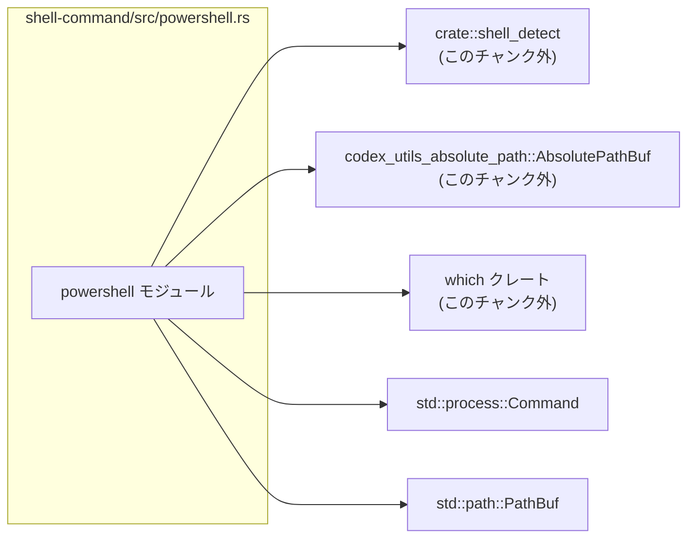
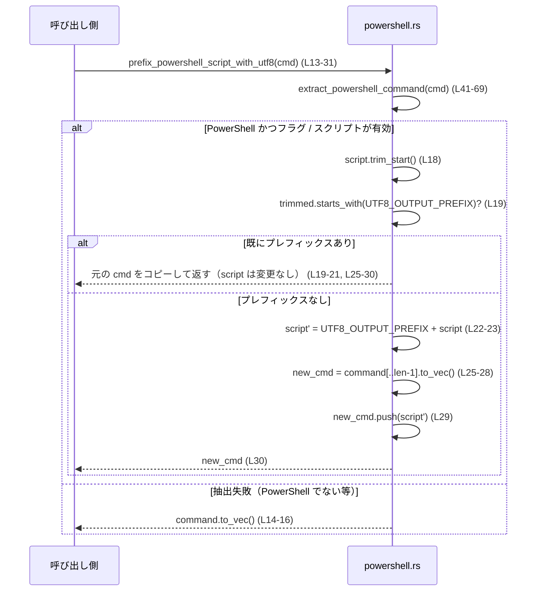
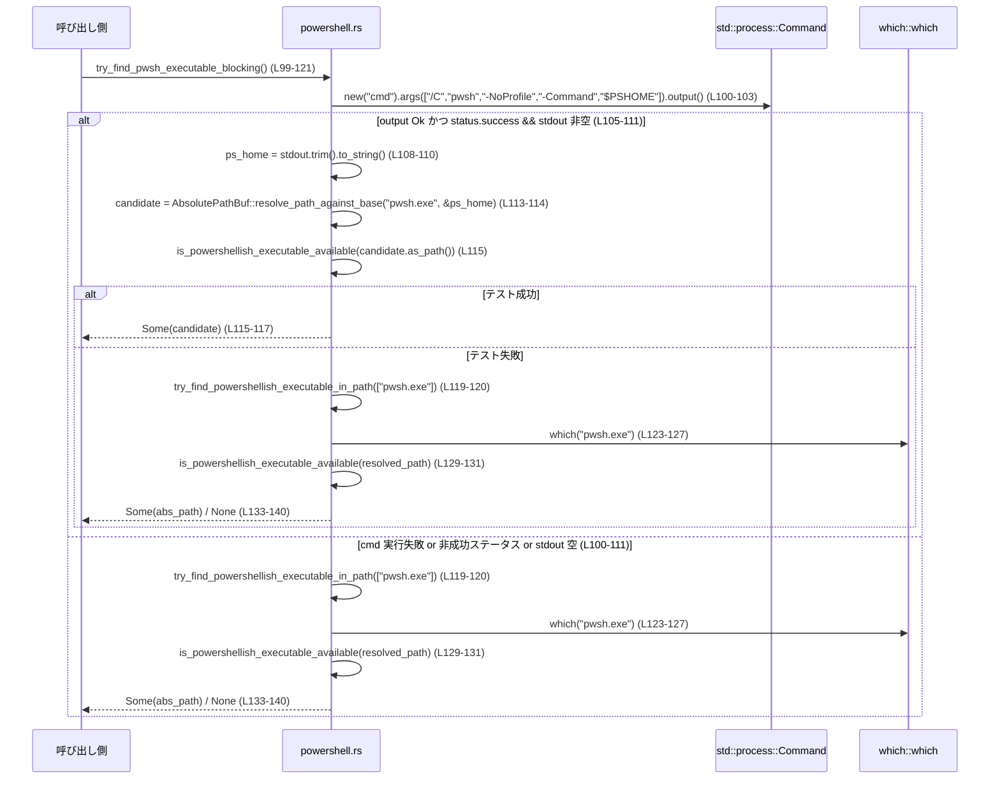

shell-command/src/powershell.rs コード解説

---

## 0. ざっくり一言

- PowerShell 用のコマンドライン（`Vec<String>`）からスクリプト部分を抽出し、UTF-8 出力を強制するプレフィックスを付けたり、`powershell.exe` / `pwsh.exe` 実行ファイルを探索するユーティリティ群です（`shell-command/src/powershell.rs:L8-121`）。

※行番号は、このファイルの先頭行を 1 とした相対番号です。

---

## 1. このモジュールの役割

### 1.1 概要

- このモジュールは **PowerShell 実行コマンドの解析と補正**（UTF-8 出力プレフィックス付与）と、**PowerShell 系実行ファイルの検索**を行います（`powershell.rs:L8-121`）。
- コマンドライン配列から PowerShell スクリプト部分を安全に取り出し、必要に応じて書き換える処理を提供します（`L13-31, L41-69`）。
- また、システム上の `powershell.exe` / `pwsh.exe` を同期的（blocking）に探索する関数を提供します（`L71-121, L123-150`）。

### 1.2 アーキテクチャ内での位置づけ

- `crate::shell_detect::{ShellType, detect_shell_type}` を用いて、与えられたコマンドの 1 引数目が PowerShell 系かどうかを判定します（`L46-51`）。
- 実行ファイルのパスは `codex_utils_absolute_path::AbsolutePathBuf` で扱います（`L3, L76-87, L99-121, L123-141`）。
- 実際の存在有無は `which::which` と `std::process::Command` により検証します（`L123-150`）。

依存関係を簡略図で示します。



- この図は本ファイル全体（`powershell.rs:L1-150`）に対応します。

### 1.3 設計上のポイント

- **関数ベース・ステートレス**
  - グローバルな可変状態は持たず、すべて関数＋定数で構成されています（`L8-150`）。
- **安全性重視のエラーハンドリング**
  - 実行ファイル探索系は `Option<AbsolutePathBuf>` や `bool` を返し、I/O エラーは `None` / `false` に潰して呼び出し元に委ねています（`L76-82, L85-87, L99-121, L123-150`）。
  - `unwrap` や `expect` は使わず、`map(...).unwrap_or(false)` のように失敗時は安全なデフォルトにフォールバックします（`L145-150`）。
- **入力バリデーション**
  - `extract_powershell_command` は、フラグが既知のものだけで構成されていることを確認し、未知のフラグがあれば即座に `None` を返します（`L54-61`）。
- **同期的（blocking）な動作**
  - 実行ファイル探索は `std::process::Command::output` を使うため、呼び出しスレッドをブロックします（`L100-103, L145-148`）。
- **Windows 特有の処理を `cfg` で分離**
  - `try_find_powershellish_executable_blocking` は `#[cfg(windows)]` で Windows 限定ビルドになっています（`L74-76`）。

### 1.4 コンポーネント一覧（インベントリー）

| 名前 | 種別 | 公開範囲 | 役割 / 用途 | 行範囲 |
|------|------|----------|-------------|--------|
| `POWERSHELL_FLAGS` | 定数 `&[&str]` | モジュール内 private | 許可される PowerShell フラグのリスト（`-nologo`, `-noprofile`, `-command`, `-c`） | `powershell.rs:L8-8` |
| `UTF8_OUTPUT_PREFIX` | `pub const &str` | crate 外からも利用可 | コンソール出力エンコーディングを UTF-8 に設定する PowerShell スクリプト断片 | `powershell.rs:L10-11` |
| `prefix_powershell_script_with_utf8` | `pub fn` | crate 外からも利用可 | コマンド配列のスクリプト部分に UTF-8 プレフィックスを付与した新しいコマンドを返す | `powershell.rs:L13-31` |
| `extract_powershell_command` | `pub fn` | crate 外からも利用可 | PowerShell 実行コマンドから `(シェル文字列, スクリプト文字列)` を抽出する | `powershell.rs:L41-69` |
| `try_find_powershellish_executable_blocking` | `pub(crate) fn`（Windows 限定） | crate 内のみ | `pwsh.exe` があれば優先し、なければ `powershell.exe` を探すラッパー | `powershell.rs:L71-82` |
| `try_find_powershell_executable_blocking` | `pub fn` | crate 外からも利用可 | `powershell.exe` を PATH から探索し、存在・実行可能であればその絶対パスを返す | `powershell.rs:L84-87` |
| `try_find_pwsh_executable_blocking` | `pub fn` | crate 外からも利用可 | `pwsh.exe` を `$PSHOME` 由来の場所または PATH から探索し、利用可能なら絶対パスを返す | `powershell.rs:L89-121` |
| `try_find_powershellish_executable_in_path` | `fn` | モジュール内 private | 候補名リスト（`powershell.exe`, `pwsh.exe` 等）を PATH から `which::which` で解決し、実行可能か確認 | `powershell.rs:L123-141` |
| `is_powershellish_executable_available` | `fn` | モジュール内 private | 指定された `Path` を PowerShell / pwsh とみなしてテスト実行し、利用可能か判定 | `powershell.rs:L143-150` |
| `tests` モジュール | `mod` | テストビルドのみ | `extract_powershell_command` の動作を検証するテスト群 | `powershell.rs:L152-202` |
| `extracts_basic_powershell_command` | `#[test] fn` | テストのみ | 最小構成（`"powershell", "-Command", "..."`）からの抽出テスト | `powershell.rs:L156-165` |
| `extracts_lowercase_flags` | `#[test] fn` | テストのみ | 小文字のフラグ名でも抽出できることを確認 | `powershell.rs:L167-176` |
| `extracts_full_path_powershell_command` | `#[test] fn` | テストのみ | フルパス指定の `powershell.exe` から抽出できることを確認 | `powershell.rs:L179-188` |
| `extracts_with_noprofile_and_alias` | `#[test] fn` | テストのみ | `pwsh` + `-NoProfile` + `-c` の組み合わせから抽出できることを確認 | `powershell.rs:L191-200` |

---

## 2. 主要な機能一覧

- PowerShell フラグのバリデーション: `POWERSHELL_FLAGS` を使い、許可されたフラグだけを受け入れる（`powershell.rs:L8, L54-61`）。
- PowerShell コマンドからのスクリプト抽出: `extract_powershell_command` で `(シェル, スクリプト)` ペアを安全に取り出す（`L41-69`）。
- UTF-8 出力プレフィックス付与: `prefix_powershell_script_with_utf8` で、PowerShell スクリプトの先頭に `UTF8_OUTPUT_PREFIX` を付けた新しいコマンド配列を生成する（`L10-11, L13-31`）。
- PowerShell 実行ファイル探索（Windows PowerShell）: `try_find_powershell_executable_blocking` で `powershell.exe` を PATH から探索し、簡易実行チェックを行う（`L84-87, L123-150`）。
- PowerShell 実行ファイル探索（PowerShell Core）: `try_find_pwsh_executable_blocking` で、まず `cmd /C pwsh ... "$PSHOME"` を使ってインストールパスを推定し、失敗すれば PATH 探索で `pwsh.exe` を探す（`L99-121`）。
- Windows 用統合探索: `try_find_powershellish_executable_blocking` で `pwsh` があればそれを優先し、なければ `powershell.exe` を返す（`L71-82`）。

---

## 3. 公開 API と詳細解説

### 3.1 型一覧（構造体・列挙体など）

このファイル内で新たに定義されている構造体・列挙体はありません。

外部から利用している主な型（定義はこのチャンクにはありません）:

| 名前 | 所属 | 役割（コードから読み取れる範囲） | 根拠 |
|------|------|----------------------------------|------|
| `AbsolutePathBuf` | `codex_utils_absolute_path` | 絶対パスを表現するバッファ型と推測されますが、定義はこのチャンクにはありません。`from_absolute_path`, `resolve_path_against_base` などの関連関数からその用途が想定されます。 | `powershell.rs:L3, L113-114, L133-134` |
| `ShellType` | `crate::shell_detect` | 少なくとも `PowerShell` というバリアントを持つ列挙体。シェル種別を表現していると読み取れます。 | `powershell.rs:L5, L47-50` |

### 3.2 関数詳細（7 件）

#### 3.2.1 `prefix_powershell_script_with_utf8(command: &[String]) -> Vec<String>`

**概要**

- PowerShell コマンドライン配列からスクリプト部分を抽出し、先頭に `UTF8_OUTPUT_PREFIX` を付与した新しい `Vec<String>` を返します（`powershell.rs:L13-31`）。
- PowerShell ではないコマンド、または `-Command`/`-c` が見つからないコマンドに対しては、入力配列のコピーをそのまま返します（`L14-16`）。

**引数**

| 引数名 | 型 | 説明 |
|--------|----|------|
| `command` | `&[String]` | `"pwsh"`, `"powershell"` などを先頭要素とし、PowerShell の起動コマンドとフラグ・スクリプト文字列を含む配列。 |

**戻り値**

- `Vec<String>`: UTF-8 プレフィックスを付けたスクリプトを含む新しいコマンド配列。PowerShell でないと判定された場合は、単に `command.to_vec()` 相当のコピーです（`L14-16, L25-30`）。

**内部処理の流れ**

1. `extract_powershell_command(command)` を呼び出し、`Some((_, script))` が得られなければ `command.to_vec()` を返します（`L14-16`）。
2. 抽出した `script` から先頭の空白を除いた `trimmed` を作成します（`L18`）。
3. `trimmed.starts_with(UTF8_OUTPUT_PREFIX)` をチェックし、既にプレフィックスが付いている場合は `script.to_string()` をそのまま使い、付いていない場合は `format!("{UTF8_OUTPUT_PREFIX}{script}")` でプレフィックスを付加します（`L19-23`）。
4. 元の `command` から「最後の要素を除いた部分」を `String` にコピーして新たな `Vec<String>` を作成します（`L25-28`）。
5. 上で生成した `script` 文字列を `push` し、新しいコマンド配列として返します（`L29-30`）。

**根拠**

- `powershell.rs:L13-31`

**Examples（使用例）**

単純な `pwsh` コマンドに UTF-8 プレフィックスを付ける例です。

```rust
use std::process::Command;                                     // コマンド起動に使用

use shell_command::powershell::{
    prefix_powershell_script_with_utf8,                        // UTF-8 プレフィックス付与関数
};

fn run_pwsh_example() -> std::io::Result<()> {                 // 実行例用の関数
    // PowerShell Core (pwsh) を使って "Write-Host hi" を実行するコマンドライン
    let cmd = vec![
        "pwsh".to_string(),                                    // シェル実行ファイル
        "-NoProfile".to_string(),                              // プロファイルを読み込まない
        "-Command".to_string(),                                // -Command フラグ
        "Write-Host hi".to_string(),                           // 実行したいスクリプト
    ];

    // UTF-8 出力プレフィックスを付加した新しいコマンドを取得
    let cmd = prefix_powershell_script_with_utf8(&cmd);        // 必要なら先頭に UTF8_OUTPUT_PREFIX を付与

    // 実際にコマンドを起動する（例示用）
    let status = Command::new(&cmd[0])                         // 先頭要素（pwsh）を実行ファイルとして指定
        .args(&cmd[1..])                                       // 残りを引数として渡す
        .status()?;                                            // コマンドを実行し終了ステータスを取得

    println!("pwsh exited with: {}", status);                  // 終了ステータスを表示
    Ok(())                                                     // 正常終了
}
```

**Errors / Panics**

- 本関数自体は `Result` ではなく、常に `Vec<String>` を返します。
- `command[..(command.len() - 1)]` というスライスがありますが（`L25`）、この行に到達するのは `extract_powershell_command` が `Some(...)` を返した場合だけであり、その関数は `command.len() < 3` なら `None` を返すため（`L42-43`）、`command.len() - 1` が負になることはなく、境界外アクセスによる panic の可能性は読み取れません。
- 文字列操作は `String::from_utf8_lossy` などを使っておらず、入力は既に UTF-8 な `String` である前提です。ここからはエンコーディング関連の panic は読み取れません。

**Edge cases（エッジケース）**

- `command` が PowerShell でない場合（`detect_shell_type` が `Some(ShellType::PowerShell)` を返さない場合）、`extract_powershell_command` が `None` となり、`command.to_vec()` をそのまま返します（`L14-16, L47-52`）。
- `command` に `-Command` / `-c` 相当のフラグが存在しない場合も同様に変更は行われません（`L54-68`）。
- `script` の先頭に既に `UTF8_OUTPUT_PREFIX` が付いている場合は、文字列は変更されず、元のスクリプト文字列をコピーして返します（`L18-21`）。
- `script` が空文字列であっても、`trim_start` と `starts_with` が動作し、付与ロジック自体は通常通り働きます。

**使用上の注意点**

- この関数は、「スクリプト文字列が **コマンド配列の最後の要素** である」という前提で新しい配列を構築しています（`L25-30`）。  
  - `extract_powershell_command` は「`-Command` / `-c` の直後の 1 要素」をスクリプトとみなすだけで、その要素が最後であることまでは保証していません（`L56-64`）。
  - そのため、`["pwsh", "-NoProfile", "-Command", "script", "extra"]` のようにスクリプトの後ろに追加の引数があると、生成される配列は `["pwsh", "-NoProfile", "-Command", "script", "UTF8_PREFIX + script"]` となり、元の `"extra"` が失われます。この挙動はコードから読み取れますが、意図されているかどうかはこのチャンクからは判断できません。
- したがって、`prefix_powershell_script_with_utf8` を使う場合は、「`-Command` / `-c` の直後のスクリプト文字列が最後の引数である」という前提条件を満たす形で `command` を構築する必要があります。

---

#### 3.2.2 `extract_powershell_command(command: &[String]) -> Option<(&str, &str)>`

**概要**

- PowerShell 実行コマンドとその引数を表す `&[String]` から、「シェル実行ファイル文字列」と「スクリプト文字列」を抽出します（`powershell.rs:L41-69`）。
- 先頭引数が PowerShell 系実行ファイルでない場合や、未知のフラグが含まれている場合、`-Command` / `-c` フラグの後にスクリプトが存在しない場合は `None` を返します。

**引数**

| 引数名 | 型 | 説明 |
|--------|----|------|
| `command` | `&[String]` | PowerShell かもしれないコマンドライン配列。例: `["pwsh", "-NoProfile", "-Command", "Get-ChildItem"]`。 |

**戻り値**

- `Option<(&str, &str)>`:
  - `Some((shell, script))`: PowerShell 実行ファイルとスクリプト文字列を表す 2 つのスライス。
  - `None`: PowerShell でない、フラグが未対応、`-Command` 相当が無い、など抽出条件を満たさない場合。

**内部処理の流れ**

1. `command.len() < 3` の場合は明らかにスクリプト文字列が存在しないので、即座に `None` を返します（`L42-43`）。
2. `shell = &command[0]` を取り出し、`detect_shell_type(&PathBuf::from(shell))` が `Some(ShellType::PowerShell)` でない場合には `None` を返します（`L46-52`）。
3. インデックス `i` を 1 から開始し、`while i + 1 < command.len()` として `command[i]` をフラグとして順次検査します（`L55-57`）。
4. フラグはすべて `POWERSHELL_FLAGS` に含まれている必要があり、含まれていない場合には即座に `None` を返します（`L58-61`）。
   - このとき `flag.to_ascii_lowercase()` で小文字化してから判定しているため、フラグ自体は大文字・小文字を問わず受け付けます（`L59`）。
5. フラグが `-Command` または `-c` と等しい場合（大小無視）には、その直後の要素 `command[i + 1]` をスクリプト文字列として `Some((shell, script))` を返します（`L62-64`）。
6. ループを最後まで処理しても条件に合致するフラグが見つからなければ `None` を返します（`L66-68`）。

**根拠**

- `powershell.rs:L41-69`

**Examples（使用例）**

```rust
use shell_command::powershell::extract_powershell_command;     // 関数をインポート

fn demo_extract() {
    let cmd = vec![
        "powershell".to_string(),                              // シェル名
        "-NoLogo".to_string(),                                 // 許可されたフラグ
        "-NoProfile".to_string(),                              // 許可されたフラグ
        "-Command".to_string(),                                // スクリプト開始フラグ
        "Write-Host hi".to_string(),                           // スクリプト本体
    ];

    if let Some((shell, script)) = extract_powershell_command(&cmd) {
        println!("shell = {shell}, script = {script}");        // 抽出結果を表示
    } else {
        println!("Not a supported PowerShell command");        // 抽出できない場合
    }
}
```

**Errors / Panics**

- 関数は `Option` を返すため、エラー時の詳細メッセージは保持されません。
- スライスのインデックスアクセスは、すべて `while i + 1 < command.len()` という条件で守られており、範囲外アクセスによる panic の可能性はコード上読み取れません（`L55-57, L63`）。
- `detect_shell_type` や `POWERSHELL_FLAGS.contains` が内部で panic するかどうかは、このチャンクからは判断できませんが、この関数自身で `unwrap` などは使用していません。

**Edge cases（エッジケース）**

- `command.len() < 3` の場合は必ず `None` になります（`L42-43`）。
- 先頭要素が PowerShell と認識されない場合（`ShellType::PowerShell` 以外または `None`）は `None`（`L46-52`）。
- 許可されていないフラグ（`POWERSHELL_FLAGS` に含まれないもの）が登場した時点で `None` を返します（`L58-61`）。
- `-Command` や `-c` が最後の要素で、その次にスクリプトが存在しない場合は `while i + 1 < command.len()` の条件により `i` がその位置に来ることがなく、結果的に `None` になります（`L55-57, L68`）。
- `command` 内に `-Command` / `-c` が複数ある場合は、「最初に見つかったもの」だけを対象とします（`L54-64`）。

**使用上の注意点**

- 許可されるフラグは `POWERSHELL_FLAGS` にハードコードされています（`L8`）。`-File` やその他のフラグを使う構成は、この関数ではサポートされず `None` になります。
- 戻り値は `&str` であり、入力の `command` スライスに対する借用です。呼び出し側で `command` を破棄した後に返り値の参照を使うことはできません（Rust のライフタイムでコンパイルエラーになります）。

---

#### 3.2.3 `try_find_powershell_executable_blocking() -> Option<AbsolutePathBuf>`

**概要**

- システムの `PATH` から `powershell.exe` を探索し、存在かつ「簡単な自己テストに成功する」場合に、その絶対パスを返します（`powershell.rs:L84-87, L123-141, L143-150`）。

**引数**

- なし。

**戻り値**

- `Option<AbsolutePathBuf>`:
  - `Some(path)`: 利用可能と判定された `powershell.exe` の絶対パス。
  - `None`: PATH 上に見つからない、もしくは実行テストに失敗した場合。

**内部処理の流れ**

1. `try_find_powershellish_executable_in_path(&["powershell.exe"])` を呼び出します（`L86`）。
2. `try_find_powershellish_executable_in_path` 内では、`which::which(candidate)` で PATH 上の `powershell.exe` を解決します（`L123-127`）。
3. 見つかったパスに対して `is_powershellish_executable_available(&resolved_path)` を呼び出し、実行テストをします（`L129-131, L143-149`）。
4. テストに成功したものだけを `AbsolutePathBuf::from_absolute_path(resolved_path)` で絶対パスに変換し、`Some(abs_path)` を返します（`L133-137`）。
5. いずれも見つからなければ `None` を返します（`L139-140`）。

**根拠**

- `powershell.rs:L84-87, L123-141, L143-150`

**Examples（使用例）**

```rust
use shell_command::powershell::try_find_powershell_executable_blocking;  // 関数をインポート

fn ensure_powershell() {
    match try_find_powershell_executable_blocking() {
        Some(path) => {
            println!("powershell.exe found at: {}", path);           // 見つかったパスを表示
        }
        None => {
            eprintln!("powershell.exe is not available in PATH");    // 見つからない場合
        }
    }
}
```

**Errors / Panics**

- `which::which` がエラー（ファイルが見つからない、権限が無いなど）を返した場合は `let Ok(resolved_path) = ... else { continue; }` で無視され、panic にはなりません（`L125-127`）。
- `AbsolutePathBuf::from_absolute_path` がエラーを返しても `let Ok(abs_path) = ... else { continue; }` で無視します（`L133-135`）。
- `std::process::Command::new(powershell_or_pwsh_exe).output()` がエラーの場合、`unwrap_or(false)` により `false` と扱われ、panic は発生しません（`L145-150`）。
- 従って、この関数自体から panic を引き起こすコードは確認できません。

**Edge cases（エッジケース）**

- PATH に複数の `powershell.exe` が存在する場合、`which::which` が見つけた最初のものだけがテストされます（`L123-125`）。
- `powershell.exe` が存在していても、`-NoLogo -NoProfile -Command "Write-Output ok"` が成功しない場合（コマンドが壊れている、権限がない等）、`None` を返します（`L143-149`）。
- 非 Windows 環境でも `powershell.exe` が PATH 上にあれば検出対象になります（`cfg` で制限されていません）。

**使用上の注意点**

- 実行テストとして PowerShell プロセスを一度起動するため、呼び出しは比較的コストが高く、頻繁にループ内で呼ぶ用途には向きません（`L145-149`）。
- 非同期ランタイム（例: Tokio）内で多用する場合は、ブロッキング I/O である `Command::output` を別スレッド（`spawn_blocking` など）に逃がすことが一般的です。

---

#### 3.2.4 `try_find_pwsh_executable_blocking() -> Option<AbsolutePathBuf>`

**概要**

- PowerShell Core (`pwsh.exe`) を探索する関数です（`powershell.rs:L99-121`）。
- まず `cmd /C pwsh -NoProfile -Command $PSHOME` を実行して `$PSHOME` ディレクトリを取得し、その配下にある `pwsh.exe` を優先的に検出します（`L100-113`）。
- それが失敗した場合に PATH 上の `pwsh.exe` を `try_find_powershellish_executable_in_path` で探索します（`L119-120`）。

**引数**

- なし。

**戻り値**

- `Option<AbsolutePathBuf>`: `pwsh.exe` の絶対パス（成功時）または `None`（見つからない／利用不可の場合）。

**内部処理の流れ**

1. `std::process::Command::new("cmd")` を使い、`["/C", "pwsh", "-NoProfile", "-Command", "$PSHOME"]` を引数に実行します（`L100-102`）。
2. `.output().ok()` により、エラーなら `None`、成功なら `Some(Output)` となります（`L102-103`）。
3. `and_then` のクロージャで以下を実施します（`L104-111`）。
   - `out.status.success()` をチェックし、失敗であれば `None` にします（`L105-107`）。
   - `out.stdout` を `String::from_utf8_lossy` で文字列化し、`trim()` で前後空白を削除します（`L108-109`）。
   - 空でなければ `Some(trimmed.to_string())` として `$PSHOME` 値を返します（`L110`）。
4. 上記の結果として `ps_home: Option<String>` が得られ、`Some(ps_home)` の場合（`if let Some(ps_home) = ...`）、`AbsolutePathBuf::resolve_path_against_base("pwsh.exe", &ps_home)` により候補パスを生成します（`L112-114`）。
5. `is_powershellish_executable_available(candidate.as_path())` で実行テストを行い、成功すれば `Some(candidate)` を返します（`L115-117`）。
6. ここまでで `Some` を返さなかった場合、最後に `try_find_powershellish_executable_in_path(&["pwsh.exe"])` で PATH 探索を行います（`L119-120`）。

**根拠**

- `powershell.rs:L99-121`

**Examples（使用例）**

```rust
use shell_command::powershell::try_find_pwsh_executable_blocking;  // 関数をインポート

fn prefer_pwsh() {
    if let Some(pwsh) = try_find_pwsh_executable_blocking() {     // まず pwsh.exe を探す
        println!("pwsh.exe found at: {}", pwsh);                  // 見つかった場合
    } else {
        println!("pwsh.exe not found; consider falling back");    // 見つからない場合
    }
}
```

**Errors / Panics**

- `"cmd"` コマンドが存在しない環境（典型的には非 Windows）では `Command::new("cmd").output()` がエラーを返しますが、`.ok()` によって `None` 化されるため panic にはなりません（`L100-103`）。
- `$PSHOME` の実行結果が UTF-8 として正しく解釈できない場合も `String::from_utf8_lossy` で置き換え文字に変換され、panic にはなりません（`L108`）。
- 以降の I/O 関連エラーもすべて `Option` の `None` に吸収され、panic しません（`L113-120`）。

**Edge cases（エッジケース）**

- 非 Windows 環境では `"cmd"` が存在しないことが多く、この場合 `$PSHOME` 取得フェーズはスキップされ、直接 PATH 探索フェーズに進みます（`L100-103, L119-120`）。
- `pwsh` がインストールされているが PATH に含まれていない場合でも、`cmd /C pwsh ...` が成功し `$PSHOME` が返るなら検出されます（`L100-113`）。
- `$PSHOME` 出力が空文字列あるいは空白のみの場合は無視され、PATH 探索にフォールバックします（`L108-111, L119-120`）。

**使用上の注意点**

- `$PSHOME` を取得するために `pwsh` 自体を起動するため、起動コストがかかります。頻繁に繰り返し呼ぶ用途には注意が必要です（`L100-103`）。
- PATH 探索フェーズでは、ユーザーの PATH 設定に依存して `pwsh.exe` が決定されます。悪意あるユーザーが PATH を操作している場合、意図しないバイナリを指す可能性がありますが、これは一般的な PATH 依存の挙動と同じです（`L123-127`）。

---

#### 3.2.5 `#[cfg(windows)] pub(crate) fn try_find_powershellish_executable_blocking() -> Option<AbsolutePathBuf>`

**概要**

- Windows 環境で、`pwsh.exe` が利用可能ならそれを優先し、そうでなければ `powershell.exe` を返すラッパー関数です（`powershell.rs:L71-82`）。

**引数**

- なし。

**戻り値**

- `Option<AbsolutePathBuf>`:
  - `Some(path)`: `pwsh.exe` または `powershell.exe` のいずれかの絶対パス。
  - `None`: どちらも利用できない場合。

**内部処理の流れ**

1. `try_find_pwsh_executable_blocking()` を呼び出します（`L77`）。
2. `Some(pwsh_path)` が返ってきた場合はそれをそのまま `Some(pwsh_path)` として返します（`L77-79`）。
3. `None` の場合は `try_find_powershell_executable_blocking()` を呼び出し、その結果をそのまま返します（`L79-81`）。

**根拠**

- `powershell.rs:L71-82`

**使用上の注意点**

- `#[cfg(windows)]` 付きのため、非 Windows 環境ではこの関数そのものがコンパイルされません（`L74`）。
- crate 内（`pub(crate)`）だけで利用される前提です（`L76`）。

---

#### 3.2.6 `try_find_powershellish_executable_in_path(candidates: &[&str]) -> Option<AbsolutePathBuf>`

**概要**

- 渡された候補名（例: `["powershell.exe"]`）を PATH 上で順に検索し、利用可能な PowerShell 関連実行ファイルの絶対パスを返すヘルパー関数です（`powershell.rs:L123-141`）。

**引数**

| 引数名 | 型 | 説明 |
|--------|----|------|
| `candidates` | `&[&str]` | 探索対象となる実行ファイル名のスライス。例: `&["powershell.exe"]`。 |

**戻り値**

- `Option<AbsolutePathBuf>`:
  - `Some(path)`: 候補のうち最初に見つかり、かつ実行テストに成功した絶対パス。
  - `None`: 候補のどれも見つからない、または実行テストに失敗した場合。

**内部処理の流れ**

1. `for candidate in candidates` で各候補名を反復します（`L124`）。
2. `which::which(candidate)` で PATH 上の実行ファイルパスを解決します。`Err` の場合は `continue` で次の候補に進みます（`L125-127`）。
3. 見つかったパスについて `is_powershellish_executable_available(&resolved_path)` を呼び出し、`false` なら `continue` します（`L129-131`）。
4. `AbsolutePathBuf::from_absolute_path(resolved_path)` を呼び出し、`Err` の場合は `continue`、`Ok(abs_path)` の場合は `Some(abs_path)` を直ちに返します（`L133-137`）。
5. 全候補を試しても `Some` が返らなければ `None` を返します（`L139-140`）。

**根拠**

- `powershell.rs:L123-141`

**使用上の注意点**

- 候補は先頭から順に評価されるため、優先度を制御したい場合は `candidates` の並び順が重要です（`L124-137`）。
- 実行テスト（`is_powershellish_executable_available`）を行うため、純粋な存在チェックだけをしたい用途にはややオーバーヘッドがあります（`L129-131, L143-149`）。

---

#### 3.2.7 `is_powershellish_executable_available(powershell_or_pwsh_exe: &std::path::Path) -> bool`

**概要**

- 渡されたパスを PowerShell (`powershell.exe` または `pwsh.exe`) とみなしてテスト実行し、利用可能かどうか（正常終了するかどうか）を `bool` で返します（`powershell.rs:L143-150`）。

**引数**

| 引数名 | 型 | 説明 |
|--------|----|------|
| `powershell_or_pwsh_exe` | `&std::path::Path` | テスト対象の PowerShell 系実行ファイルパス。 |

**戻り値**

- `bool`:
  - `true`: `-NoLogo -NoProfile -Command "Write-Output ok"` が正常終了した場合。
  - `false`: 実行がエラーになる、または異常終了した場合。

**内部処理の流れ**

1. `std::process::Command::new(powershell_or_pwsh_exe)` でプロセスを作成します（`L145`）。
2. `.args(["-NoLogo", "-NoProfile", "-Command", "Write-Output ok"])` を指定して、最小限のコマンドを起動します（`L146-147`）。
3. `.output()` でプロセスを実行し、`std::io::Result<Output>` を得ます（`L147`）。
4. `.map(|output| output.status.success())` によって、成功時には `output.status.success()`（`bool`）を取得し、エラー時には `Err` のままです（`L148`）。
5. `.unwrap_or(false)` により、エラーだった場合には `false` を返し、成功時には `status.success()` の結果を返します（`L149`）。

**根拠**

- `powershell.rs:L143-150`

**使用上の注意点**

- 実際に PowerShell プロセスを起動するため、1 回の呼び出しで外部プロセス起動コストが発生します。
- コマンドラインに固定文字列 `"Write-Output ok"` を渡しているため、テスト実行で副作用的な操作は行っていません（標準出力への文字列出力のみ）と読み取れます（`L146-147`）。

---

### 3.3 その他の関数（テスト）

| 関数名 | 役割（1 行） | 行範囲 |
|--------|--------------|--------|
| `extracts_basic_powershell_command` | `"powershell", "-Command", "..."` 形式からスクリプトが抽出されることをテスト | `powershell.rs:L156-165` |
| `extracts_lowercase_flags` | 小文字の `-nologo`, `-command` を含むコマンドから抽出できることをテスト | `powershell.rs:L167-176` |
| `extracts_full_path_powershell_command` | フルパス指定の `powershell.exe` から抽出できることをテスト | `powershell.rs:L179-188` |
| `extracts_with_noprofile_and_alias` | `"pwsh", "-NoProfile", "-c"` という組み合わせから抽出できることをテスト | `powershell.rs:L191-200` |

- これらのテストはいずれも `extract_powershell_command` の挙動のみを検証しており、実行ファイル探索系の関数（`try_find_*`）はテストされていません。

---

## 4. データフロー

### 4.1 UTF-8 プレフィックス付与フロー

`prefix_powershell_script_with_utf8 (L13-31)` と `extract_powershell_command (L41-69)` の間のデータフローです。



- 上図から分かるように、この関数は「スクリプトが最後の要素である」前提で `command[..len-1]` を取り、それにプレフィックス付きスクリプトを追加しています（`L25-30`）。

### 4.2 PowerShell Core 実行ファイル探索フロー

`try_find_pwsh_executable_blocking (L99-121)` 周辺のデータフローです。



---

## 5. 使い方（How to Use）

### 5.1 基本的な使用方法

典型的なフロー（`pwsh` を優先し、なければ `powershell` にフォールバックし、UTF-8 プレフィックスを付与して実行）を示します。

```rust
use std::process::Command;                                           // 外部コマンド起動用

use shell_command::powershell::{
    prefix_powershell_script_with_utf8,                              // UTF-8 プレフィックス付与
    try_find_pwsh_executable_blocking,                               // pwsh.exe 探索
    try_find_powershell_executable_blocking,                         // powershell.exe 探索
};

fn run_powershell_script() -> std::io::Result<()> {
    // 1. 実行ファイルの探索
    let exe = if let Some(pwsh) = try_find_pwsh_executable_blocking() {
        pwsh.to_string()                                             // pwsh.exe があれば優先
    } else if let Some(ps) = try_find_powershell_executable_blocking() {
        ps.to_string()                                               // なければ powershell.exe
    } else {
        eprintln!("No PowerShell executable found");                 // どちらも見つからない
        return Ok(());
    };

    // 2. コマンドライン配列を構築（スクリプトは最後の要素とする）
    let cmd = vec![
        exe,                                                         // 実行ファイルパス
        "-NoProfile".to_string(),                                    // 任意のフラグ
        "-Command".to_string(),                                      // スクリプトフラグ
        "Write-Output 'hello'".to_string(),                          // スクリプト本体
    ];

    // 3. UTF-8 プレフィックスを付与
    let cmd = prefix_powershell_script_with_utf8(&cmd);              // スクリプト先頭に UTF8_OUTPUT_PREFIX を追加

    // 4. 実際にコマンドを実行
    let status = Command::new(&cmd[0])                               // 実行ファイル
        .args(&cmd[1..])                                             // フラグとスクリプト
        .status()?;                                                  // 同期的に待つ

    println!("PowerShell exited with: {}", status);                  // 結果を表示
    Ok(())
}
```

### 5.2 よくある使用パターン

1. **pwsh を優先して利用し、なければ powershell にフォールバック**

   - `try_find_pwsh_executable_blocking` → `try_find_powershell_executable_blocking` の順に呼び出す（`L99-121, L84-87`）。
   - Windows 環境では crate 内部で `try_find_powershellish_executable_blocking` を使うことで同じパターンを簡潔に書けます（`L71-82`）。

2. **既存のコマンド配列への UTF-8 プレフィックス付与のみ**

   - すでに `["pwsh", "-NoProfile", "-Command", script]` の形でコマンド配列を持っている場合、`prefix_powershell_script_with_utf8` を呼ぶだけでよい（`L13-31`）。

3. **コマンド解析のみを行い、実行は別のレイヤーに任せる**

   - `extract_powershell_command` でスクリプト部分だけを抜き出して解析・ログ出力などを行い、実行自体は別の仕組みに委ねる（`L41-69`）。

### 5.3 よくある間違い

**誤り例 1: スクリプトの後に追加引数を付ける**

```rust
// 間違い例: スクリプトの後ろに追加の引数がある
let cmd = vec![
    "pwsh".to_string(),
    "-NoProfile".to_string(),
    "-Command".to_string(),
    "Write-Host hi".to_string(),       // スクリプト
    "-ExtraArg".to_string(),           // 追加の引数
];

let cmd = prefix_powershell_script_with_utf8(&cmd);
// コード上は command[..len-1] + 新しい script となるため、
// 最終結果は ["pwsh", "-NoProfile", "-Command", "Write-Host hi", "UTF8_PREFIX + script"]
// となり、元の "-ExtraArg" は失われます（powershell.rs:L25-30）。
```

**正しい例**

```rust
// 正しい例: スクリプトは最後の要素とし、追加ロジックはスクリプト内に含める
let cmd = vec![
    "pwsh".to_string(),
    "-NoProfile".to_string(),
    "-Command".to_string(),
    "Write-Host hi; & extra-command".to_string(),    // 必要な処理をスクリプト側にまとめる
];

let cmd = prefix_powershell_script_with_utf8(&cmd);  // 想定どおりプレフィックスが付与される
```

**誤り例 2: 非 PowerShell コマンドに対して動作を期待する**

```rust
// 間違い例: bash コマンドに対して PowerShell 用ユーティリティを使う
let cmd = vec![
    "bash".to_string(),
    "-c".to_string(),
    "echo hi".to_string(),
];

let cmd2 = prefix_powershell_script_with_utf8(&cmd);
// detect_shell_type が PowerShell 以外と判定するため、cmd2 は単なる cmd のコピーになります（L14-16）。
```

### 5.4 使用上の注意点（まとめ）

- **前提条件**
  - `prefix_powershell_script_with_utf8` を利用する場合、「スクリプト文字列がコマンド配列の最後の要素であること」が暗黙の前提です（`L25-30`）。
  - `extract_powershell_command` は許可されたフラグ以外を含むコマンドをサポートしません（`L8, L58-61`）。
- **エラー時の挙動**
  - いずれの探索関数も `Option` / `bool` を返し、詳細なエラー理由（権限不足・ファイル破損など）は上位には伝えません（`L76-82, L84-87, L99-121, L123-150`）。
- **パフォーマンス**
  - 実行ファイル探索関数は外部プロセス起動を伴うため、起動コストが無視できない場面では、結果をキャッシュするなどの工夫が必要になる場合があります。
- **並行性**
  - このモジュールはグローバルな可変状態を持たず、データ競合の観点ではスレッドセーフと読み取れますが、`std::process::Command::output` は呼び出しスレッドをブロックします（`L100-103, L145-148`）。

---

## 6. 変更の仕方（How to Modify）

### 6.1 新しい機能を追加する場合

例: 追加の PowerShell フラグ（`-ExecutionPolicy` など）を許可したい場合。

1. **フラグの許可**
   - `POWERSHELL_FLAGS` に新たなフラグ名を追加します（`powershell.rs:L8`）。
2. **抽出ロジックの確認**
   - `extract_powershell_command` のループが、追加したフラグを「スクリプト前のフラグ」として正しく処理できるか確認します（`L54-67`）。
3. **テストの追加**
   - `tests` モジュールに、新しいフラグを含むコマンドで期待どおり抽出できるかを確認するテストケースを追加します（`L152-200`）。

### 6.2 既存の機能を変更する場合

例: `prefix_powershell_script_with_utf8` を、スクリプトが最後の要素でない場合にも正しく書き換えるよう改善したい場合。

- **影響範囲の確認**
  - 当該関数のみで完結しており、外からは `Vec<String>` 入出力で見えるため、主な影響は `prefix_powershell_script_with_utf8` を直接利用しているコードです（このチャンクには呼び出し元は現れないため、実際の影響箇所はこのファイルでは不明です）。
- **契約の整理**
  - 現状は「スクリプトが最後の要素」という暗黙の前提があります（`L25-30`）。変更後の仕様を明文化し、テストを更新する必要があります。
- **テストの追加**
  - スクリプトの後に追加引数があるケースなど、エッジケース専用のテストを追加することで、想定外の挙動を防げます。

---

## 7. 関連ファイル

| パス / モジュール名 | 役割 / 関係 |
|---------------------|------------|
| `crate::shell_detect` | `ShellType` と `detect_shell_type` を提供し、コマンド先頭の実行ファイルが PowerShell 系かどうかを判定します（`powershell.rs:L5-6, L47-50`）。ファイルパスはこのチャンクには現れないため不明です。 |
| `codex_utils_absolute_path` | `AbsolutePathBuf` 型と `resolve_path_against_base`, `from_absolute_path` などの関数を提供し、実行ファイルパスを絶対パスとして扱うために使用されています（`powershell.rs:L3, L113-114, L133-134`）。 |
| `which` クレート | `which::which` 関数を通じて、PATH 上から実行ファイルを探索します（`powershell.rs:L125-127`）。 |
| `std::process::Command` | 外部プロセス（`cmd`, `pwsh`, `powershell`）を同期的に起動するために使用されています（`powershell.rs:L100-103, L145-148`）。 |

---

## 8. 想定される問題点とセキュリティ観点

※ここでは「コードから読み取れる挙動として問題になりうるケース」を列挙します。意図された仕様かどうかは、このチャンクからは判断できません。

- **スクリプトが最後の要素でない場合の挙動**
  - `prefix_powershell_script_with_utf8` は `command[..len-1]` をベースにし、最後の要素を「スクリプトとして置き換える」のではなく「最後の要素を除いた後に新しいスクリプトを追加する」構造になっています（`L25-30`）。
  - `extract_powershell_command` は `-Command` / `-c` の直後をスクリプトとみなすだけで、スクリプトが最後の要素であることは検証していません（`L56-64`）。
  - そのため、「スクリプトの後に追加引数がある」構成では、追加引数が失われるか、意図しないコマンドラインになる可能性があります。
- **PATH 依存の実行ファイル決定**
  - `try_find_powershell_executable_blocking` や `try_find_pwsh_executable_blocking` は `which::which` によって PATH に依存して実行ファイルを決定します（`L125-127`）。
  - 悪意あるユーザーが PATH を上書きできる環境では、別のバイナリが選ばれる可能性があります。これは一般的な PATH 依存アプリケーションと同様のリスクであり、このモジュール固有の追加リスクは確認できません。
- **スクリプト内容のサニタイズ**
  - 本モジュールは、スクリプト文字列をプレフィックスで前置きするのみであり、内容のサニタイズやエスケープは行っていません（`L19-23`）。
  - ユーザー入力を含むスクリプト文字列を安全に扱うかどうかは、呼び出し元の責務になります。

---

## 9. 前提条件とエッジケースの整理

- **共通の前提条件**
  - PowerShell コマンド解析系（`extract_powershell_command`, `prefix_powershell_script_with_utf8`）は、「先頭要素が PowerShell 系実行ファイルである」「許可されたフラグのみがスクリプト前に現れる」ことを前提としています（`L46-52, L58-61`）。
- **失敗時の共通挙動**
  - 解析系は `None` / 元のコマンドそのまま返却で失敗を表現し（`L14-16, L42-43, L58-61, L68`）、探索系は `None` / `false` で失敗を表現します（`L76-82, L84-87, L99-121, L143-150`）。
- **未テスト部分**
  - このファイル内のテストは `extract_powershell_command` のみをカバーしており、`prefix_powershell_script_with_utf8` や `try_find_*` 系のエッジケース（特に PATH が壊れている、実行ファイルが壊れている場合など）はテストされていません（`L152-200`）。
- **パフォーマンス上の注意**
  - 実行ファイル探索（特に `try_find_pwsh_executable_blocking`）は外部プロセス起動を含むため、頻繁に呼び出す場合はキャッシュや遅延評価などの工夫が必要になる可能性があります（`L100-103, L145-148`）。

以上が、このファイル `shell-command/src/powershell.rs` に基づいて読み取れる範囲での、公開 API とコアロジック・安全性・エッジケースを含めた解説です。
