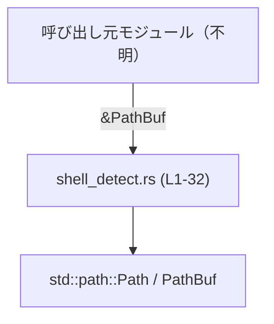

# shell-command/src/shell_detect.rs コード解説

---

## 0. ざっくり一言

シェル実行ファイルへのパス（またはシェル名の文字列）から、`Zsh` / `Bash` / `PowerShell` / `Sh` / `Cmd` のどれかを判別し、対応する列挙体 `ShellType` を返すユーティリティです（`pub(crate)` な内部API）。  
（根拠: `ShellType` 定義と `detect_shell_type` のマッチ分岐 `shell_detect.rs:L4-11, L13-31`）

---

## 1. このモジュールの役割

### 1.1 概要

- このモジュールは「シェルのパスや名前からシェル種類を判定する」問題を解決するために存在し、`ShellType` 列挙体と `detect_shell_type` 関数を提供します。  
  （根拠: `pub(crate) enum ShellType` と `pub(crate) fn detect_shell_type` のシグネチャ `shell_detect.rs:L4-11, L13-13`）
- 判定できない場合は `None` を返すことで、「不明」を明示的に表現します。  
  （根拠: マッチのデフォルトケースで `None` を返している `shell_detect.rs:L21-30`）

### 1.2 アーキテクチャ内での位置づけ

このファイル自体は、標準ライブラリ `std::path::Path` / `PathBuf` にのみ依存しており、他のクレート内部モジュールから呼び出されるヘルパーと考えられます（呼び出し元はこのチャンクからは不明です）。



- `use std::path::Path;` / `PathBuf` により標準ライブラリに依存しています。  
  （根拠: `shell_detect.rs:L1-2`）
- 他モジュールからの `use` や `mod` 宣言はこのチャンクには現れないため、呼び出し元は不明です。

### 1.3 設計上のポイント

- **列挙体での明示的なシェル種別表現**  
  `ShellType` に `Zsh`, `Bash`, `PowerShell`, `Sh`, `Cmd` を定義し、型安全にシェル種別を扱います。  
  （根拠: `shell_detect.rs:L4-11`）
- **再帰によるファイル名の簡約**  
  パス全体で判定できない場合、`file_stem()`（拡張子を除いたファイル名）に縮退させて再帰的に判定します。  
  （根拠: `_` 分岐内で `file_stem` 取得と再帰呼び出し `shell_detect.rs:L21-27`）
- **`Option` による失敗の表現**  
  マッチできなかった場合は `None` を返し、エラーではなく「該当なし」として扱います。  
  （根拠: `_` 分岐最後で `None` を返却 `shell_detect.rs:L29`）
- **完全に純粋な計算関数**  
  I/O、グローバル状態、可変参照は使われておらず、同じ入力に対して常に同じ出力を返します。  
  （根拠: 関数内での操作がローカル変数と標準ライブラリメソッドの呼び出しだけ `shell_detect.rs:L13-31`）
- **スレッド安全**  
  引数は共有参照 `&PathBuf` であり、可変状態や `unsafe` は使用していないため、複数スレッドから同時に安全に呼び出せます。  
  （根拠: 関数シグネチャと本体内に `mut` / `static` / `unsafe` がないこと `shell_detect.rs:L13-31`）

---

## 2. 主要な機能一覧

- `ShellType` 列挙体: サポートしているシェルの種類を表現する内部用の型。
- `detect_shell_type`: `PathBuf` への参照からシェル種別を推定し、`Option<ShellType>` として返す。

---

## 3. 公開 API と詳細解説

### 3.1 型一覧（構造体・列挙体など）

| 名前        | 種別   | 役割 / 用途                                                                 | 定義位置 |
|-------------|--------|------------------------------------------------------------------------------|----------|
| `ShellType` | 列挙体 | 判別対象となるシェルの種類を表す。`Zsh` / `Bash` / `PowerShell` / `Sh` / `Cmd` を持つ。 | `shell_detect.rs:L4-11` |

`ShellType` には以下の派生トレイトが付いています（根拠: `#[derive(...)]` `shell_detect.rs:L4`）:

- `Debug`: `{:?}` でデバッグ表示可能。
- `PartialEq`, `Eq`: 等値比較が可能。
- `Clone`, `Copy`: 値のコピーが安価に行える（スタック上の小さな値として扱いやすい）。

### 3.2 関数詳細

#### `detect_shell_type(shell_path: &PathBuf) -> Option<ShellType>`

**概要**

- 引数で渡された `shell_path`（シェル実行ファイルへのパス、またはシェル名の文字列）からシェルの種類を判定し、`Some(ShellType::...)` または `None` を返します。  
  （根拠: 関数シグネチャと `match` 式の分岐 `shell_detect.rs:L13-20, L29`）

**引数**

| 引数名      | 型           | 説明 |
|------------|--------------|------|
| `shell_path` | `&PathBuf` | 判定対象のパスです。フルパス（`/usr/bin/bash` や `C:\Windows\System32\cmd.exe`）でも、単なるコマンド名（`"bash"` など）でも利用できます。 |

（引数型の根拠: 関数シグネチャ `shell_detect.rs:L13`）

**戻り値**

- 型: `Option<ShellType>`  
  - 対応するシェル名として判定できた場合: `Some(ShellType::Zsh)` / `Some(ShellType::Bash)` / `Some(ShellType::PowerShell)` / `Some(ShellType::Sh)` / `Some(ShellType::Cmd)` のいずれか。  
    （根拠: 各 `Some(...)` 分岐 `shell_detect.rs:L15-20`）
  - どのシェルにも該当しない場合: `None`。  
    （根拠: デフォルト分岐最後の `None` `shell_detect.rs:L29`）

**内部処理の流れ（アルゴリズム）**

1. `shell_path` を OS 文字列として取得し、UTF-8 文字列への変換を試みます。  

   ```rust
   match shell_path.as_os_str().to_str() {
   ```

   （根拠: `shell_detect.rs:L14`）

2. UTF-8 文字列に変換でき、なおかつ文字列全体が次のいずれかに一致する場合、そのまま対応するシェル種別を返します。  
   - `"zsh"` → `ShellType::Zsh`  
   - `"sh"` → `ShellType::Sh`  
   - `"cmd"` → `ShellType::Cmd`  
   - `"bash"` → `ShellType::Bash`  
   - `"pwsh"` または `"powershell"` → `ShellType::PowerShell`  
   （根拠: `Some("...") => Some(ShellType::...)` のマッチ分岐 `shell_detect.rs:L15-20`）

3. 上記に一致しない、あるいは `to_str()` が `None` を返した場合は `_` 分岐に入り、拡張子を含まないファイル名（`file_stem()`）のみを取り出します。  

   ```rust
   let shell_name = shell_path.file_stem();
   if let Some(shell_name) = shell_name {
       let shell_name_path = Path::new(shell_name);
   ```

   （根拠: `_` 分岐内の処理 `shell_detect.rs:L21-24`）

4. その `file_stem()` を `Path` にしたものと、元の `shell_path` を `Path::new` で包んだものを比較し、異なる場合のみ再帰呼び出しを行います。  

   ```rust
   if shell_name_path != Path::new(shell_path) {
       return detect_shell_type(&shell_name_path.to_path_buf());
   }
   ```

   （根拠: 再帰呼び出し条件と再帰自体 `shell_detect.rs:L24-27`）

   - これにより、「再帰の引数が前回と同じパスになる」場合は再帰を止め、無限再帰を防いでいます。  
     例: 既に拡張子が無い、または `file_stem()` がこれ以上短くならない場合。

5. `file_stem()` が取得できなかった場合（例: ルートディレクトリや空パスなど）や、再帰しても結局判定できなかった場合は `None` を返して終了します。  
   （根拠: `if let Some(...)` を抜けた後の `None` `shell_detect.rs:L23, L29`）

処理フローを簡易的なフローチャートで示すと次のようになります。

```mermaid
flowchart TD
    A["detect_shell_type (L13-31) 呼び出し"] --> B["shell_path.as_os_str().to_str() (L14)"]
    B -->|Some(\"zsh\" etc.)| C["対応する ShellType を返す (L15-20)"]
    B -->|None またはその他の文字列| D["file_stem() を取得 (L21-23)"]
    D -->|None| E["None を返す (L29)"]
    D -->|Some(shell_name)| F["shell_name_path = Path::new(shell_name) (L24)"]
    F --> G["shell_name_path != Path::new(shell_path)? (L25)"]
    G -->|false| E
    G -->|true| H["detect_shell_type(shell_name_path.to_path_buf()) を再帰呼び出し (L26)"]
    H --> I["Some(ShellType) または None を返す"]
```

**Examples（使用例）**

※ モジュールパスはプロジェクト構成に依存しますが、ここではファイル名と同じ `shell_detect` モジュール名を仮定した例を示します（コードからは断定できません）。

```rust
use std::path::PathBuf;
// 仮定: 同じクレート内で shell_detect モジュールとして公開されている場合
use crate::shell_detect::{detect_shell_type, ShellType};

fn main() {
    // 例1: フルパスからの判定（Unix系）
    let path = PathBuf::from("/usr/bin/zsh");            // zsh のフルパスを想定
    let shell = detect_shell_type(&path);                // &PathBuf を渡す
    assert_eq!(shell, Some(ShellType::Zsh));             // Zsh と判定される

    // 例2: 拡張子付きの Windows 風パス
    let path = PathBuf::from(r"C:\Windows\System32\cmd.exe");
    let shell = detect_shell_type(&path);
    assert_eq!(shell, Some(ShellType::Cmd));             // 拡張子を除いた "cmd" で判定される

    // 例3: 未対応のシェル名
    let path = PathBuf::from("fish");
    let shell = detect_shell_type(&path);
    assert_eq!(shell, None);                             // 対応一覧にないため None
}
```

- 例1: 初回呼び出しでは `/usr/bin/zsh` という文字列はどの `Some("...")` にも一致しませんが、`file_stem()` が `"zsh"` を返すので、再帰呼び出しで `Zsh` と判定されます。  
  （根拠: `file_stem` と再帰の処理 `shell_detect.rs:L21-27`）
- 例2: `"cmd.exe"` から `file_stem()` が `"cmd"` となり、再帰で `Cmd` と判定されます。  
- 例3: `"fish"` はいずれのパターンにもマッチせず、`file_stem()` も変化しないため再帰は行われず `None` になります。  
  （根拠: `shell_name_path != Path::new(shell_path)` のチェック `shell_detect.rs:L25`）

**Errors / Panics**

- **`Result` 型のエラーは返していません。**  
  失敗はあくまで「該当なし」として `None` で表現されます。  
  （根拠: 戻り値が `Option<ShellType>` であり、`Err` を返していない `shell_detect.rs:L13`）
- **明示的な `panic!` や `unwrap` は使用していません。**  
  このため、通常の使用でこの関数がパニックを起こすことは想定されません（OOM などランタイムレベルのエラーは Rust 全般に共通するためここでは扱いません）。  
  （根拠: 関数本体内に `panic!` / `unwrap` / `expect` / 添字アクセス等が存在しない `shell_detect.rs:L13-31`）

**Edge cases（エッジケース）**

- **UTF-8 で表現できないパス**  
  `to_str()` が `None` を返し、`_` 分岐に入ります。その後 `file_stem()` でファイル名を取得して再帰判定を試みますが、最終的にどのパターンにもマッチしなければ `None` になります。  
  （根拠: `match shell_path.as_os_str().to_str()` の `_` 分岐 `shell_detect.rs:L14, L21-29`）

- **拡張子だけが複数ついている場合（例: `"powershell.exe.bak"`）**  
  - 初回: `"powershell.exe.bak"` はマッチせず、`file_stem()` により `"powershell.exe"` に縮退。  
  - 2回目: `"powershell.exe"` もマッチせず、さらに `file_stem()` により `"powershell"` に縮退。  
  - 3回目: `"powershell"` が `Some("powershell")` にマッチし、`ShellType::PowerShell` を返します。  
  再帰回数はファイル名の「拡張子の段数」によって増えますが、ファイル名長の制約から現実的にはごく小さい回数にとどまります。  
  （根拠: `file_stem()` と再帰の構造 `shell_detect.rs:L21-27`）

- **すでに拡張子のない名前で、かつ未対応のシェル名（例: `"fish"`）**  
  - `"fish"` は `Some("fish")` でいずれのパターンにもマッチしません。  
  - `file_stem()` は `"fish"` を返し、`shell_name_path` と元の `shell_path` を比較すると等しいため、再帰は行われません。  
  - `None` を返します。  
  （根拠: `shell_name_path != Path::new(shell_path)` の判定 `shell_detect.rs:L25`）

- **引数付きコマンドライン文字列を渡した場合（例: `"bash -l"` をそのまま PathBuf にした場合）**  
  ファイル名として `"bash -l"` を扱うため、`"bash"` にも `"sh"` にも一致しません。`file_stem()` によっても `"bash -l"` のまま変わらない場合、再帰は行われず `None` になります。  
  （根拠: 判定が完全一致の文字列比較のみであること `shell_detect.rs:L15-20` と、拡張子が無い場合に再帰しない条件 `shell_detect.rs:L21-27`）

- **空パスやルートパス**  
  `file_stem()` が `None` を返す可能性があり、その場合 `_` 分岐からそのまま `None` を返します。  
  （根拠: `if let Some(shell_name) = shell_name { ... }` の外側で `None` を返す `shell_detect.rs:L21-23, L29`）

**使用上の注意点**

- **戻り値 `None` の扱いが必須**  
  未対応のシェル名や、UTF-8 で扱えないパスなど多くのケースで `None` が返る可能性があります。そのため、呼び出し側では必ず `match` や `if let` で `None` を考慮する必要があります。  
  （根拠: デフォルトケースで `None` を返している `shell_detect.rs:L29`）

- **対応しているシェル名は限定的**  
  現状は `"zsh"`, `"bash"`, `"sh"`, `"cmd"`, `"pwsh"`, `"powershell"` にしか対応していません。その他はすべて `None` になります。  
  （根拠: マッチ分岐がこれらの文字列に限られている `shell_detect.rs:L15-20`）

- **再帰の深さは実質的に小さい**  
  再帰は `file_stem()` によってファイル名が短くなる場合だけ発生し、同じパスに戻った場合は止まります。そのため、ファイル名に含まれる拡張子の数を上限とする浅い再帰です。スタックオーバーフローのリスクは現実的には低いと考えられます。  
  （根拠: `shell_name_path != Path::new(shell_path)` チェック `shell_detect.rs:L25`）

- **スレッドセーフで再入可能**  
  関数は純粋で、副作用を持たないため、複数スレッドから同時に呼び出しても問題ありません。  
  （根拠: 引数は共有参照のみ・内部で共有状態を扱わない `shell_detect.rs:L13-31`）

### 3.3 その他の関数

このファイルには `detect_shell_type` 以外の関数定義は存在しません。  
（根拠: `shell_detect.rs` 全体を見ても関数定義は 1 つだけ `shell_detect.rs:L13-31`）

---

## 4. データフロー

代表的なシナリオとして、「フルパスからシェル種別を判定する場合」のデータフローを示します。

```mermaid
sequenceDiagram
    participant Caller as 呼び出し元
    participant Detect as detect_shell_type (L13-31)
    participant PathBuf as std::path::PathBuf
    participant Path as std::path::Path

    Caller->>Detect: &shell_path: &PathBuf
    activate Detect
    Detect->>PathBuf: as_os_str().to_str() (L14)
    alt 名前だけ or 既に短いパス
        Detect-->>Caller: Some(ShellType::...) (L15-20)
        deactivate Detect
    else フルパスや拡張子付きでマッチしない
        Detect->>PathBuf: file_stem() (L21-23)
        alt file_stem が None
            Detect-->>Caller: None (L29)
            deactivate Detect
        else file_stem が Some(shell_name)
            Detect->>Path: Path::new(shell_name) (L24)
            Detect->>Path: Path::new(shell_path) (L25)
            alt shell_name_path != Path::new(shell_path)
                Detect->>Detect: 再帰呼び出し (shell_name_path) (L26)
                Detect-->>Caller: 再帰結果 Some(...) or None
                deactivate Detect
            else 同じパス
                Detect-->>Caller: None (L29)
                deactivate Detect
            end
        end
    end
```

- データは常に `PathBuf` → `OsStr` → `str`（可能なら）→ `ShellType` という流れで処理されます。  
  （根拠: `as_os_str().to_str()` の呼び出し `shell_detect.rs:L14`）
- マッチに失敗した場合は `file_stem()` により段階的に短縮された `PathBuf` に変換され、同じ判定ロジックが再帰的に適用されます。  
  （根拠: `_` 分岐の再帰 `shell_detect.rs:L21-27`）

---

## 5. 使い方（How to Use）

### 5.1 基本的な使用方法

内部 API（`pub(crate)`）のため同一クレート内からの利用を想定した、典型的な呼び出し例です。

```rust
use std::path::PathBuf;
// 仮定: shell_detect モジュールとして利用
use crate::shell_detect::{detect_shell_type, ShellType};

fn main() {
    // シェルコマンドのフルパスを想定
    let shell_path = PathBuf::from("/usr/bin/bash");

    // シェル種別を検出
    let shell_type = detect_shell_type(&shell_path);

    match shell_type {
        Some(ShellType::Bash) => {
            // Bash 向けの処理
            println!("Detected bash");
        }
        Some(ShellType::Zsh) => {
            println!("Detected zsh");
        }
        Some(other) => {
            println!("Detected other supported shell: {:?}", other);
        }
        None => {
            // 未対応または判定不能
            println!("Unknown shell");
        }
    }
}
```

- `&PathBuf` を渡し、`Option<ShellType>` を `match` で分岐するのが基本的なパターンです。  
  （根拠: 関数シグネチャ `shell_detect.rs:L13`）

### 5.2 よくある使用パターン

1. **環境変数 `SHELL` や `ComSpec` からの判定（想定されるパターン）**  
   ※ ここでは一般的な利用イメージであり、このファイルから直接は読み取れません。

   - 環境変数から取得したシェルパス文字列を `PathBuf::from` でラップし、`detect_shell_type` に渡す。
   - 戻り値に応じて、シェル固有のコマンドラインや設定ファイルパスを組み立てる。

2. **ユーザー入力されたシェル名の検証**  

   - ユーザーが `"bash"` や `"pwsh"` などと入力した場合、その妥当性チェックとして使う。
   - `None` の場合は「サポート外のシェル名」と判断してエラー表示やフォールバックを実施する。

### 5.3 よくある間違い

```rust
use std::path::PathBuf;
use crate::shell_detect::detect_shell_type;

// 間違い例: 引数付きのコマンドライン文字列をそのまま渡している
let path = PathBuf::from("/usr/bin/bash -l");    // "-l" まで含めて 1 つのパスとみなされる
let ty = detect_shell_type(&path);
assert!(ty.is_none());                           // "bash -l" はどのパターンにも一致しない

// 正しい例: コマンドと引数を分け、パス部分だけを渡す
let path = PathBuf::from("/usr/bin/bash");
let ty = detect_shell_type(&path);
assert!(ty.is_some());
```

- この関数は「ファイルパス」または「コマンド名」のみを前提としており、引数付きの文字列を渡すと意図した判定になりません。  
  （根拠: 文字列パターンが `"bash"` などの完全一致のみである `shell_detect.rs:L15-20`）

### 5.4 使用上の注意点（まとめ）

- `None` が返るケースを必ずハンドリングすること。  
- 対応シェルは限定されており、それ以外はすべて `None` となること。  
- パスには純粋なパス（または名前）のみを渡し、引数や別コマンドと連結した文字列は渡さないこと。  
- 関数はスレッドセーフで副作用がなく、何度呼び出しても同じ入力に対して同じ結果を返すため、キャッシュなどの工夫は必須ではありません（性能要件によっては別途検討）。  

---

## 6. 変更の仕方（How to Modify）

### 6.1 新しい機能を追加する場合（新しいシェルの追加）

例として、新しいシェル `Fish` を追加したい場合の手順です。

1. **列挙体にバリアントを追加**  

   ```rust
   pub(crate) enum ShellType {
       Zsh,
       Bash,
       PowerShell,
       Sh,
       Cmd,
       Fish, // 新規追加
   }
   ```

   （根拠: 既存のバリアント定義 `shell_detect.rs:L5-10`）

2. **マッチ分岐を追加**  
   `"fish"` や `"fish.exe"` のような名前に対応させるため、`detect_shell_type` の `match` に分岐を追加します。

   ```rust
   match shell_path.as_os_str().to_str() {
       // 既存の分岐...
       Some("fish") => Some(ShellType::Fish),
       // 既存の `_ => { ... }` に続く
   }
   ```

   （根拠: 現在の分岐の形 `shell_detect.rs:L14-20`）

3. **呼び出し側の処理を拡張**  
   `match` で `ShellType::Fish` を扱う分岐を追加し、必要であれば fish 用の処理を追加します。

### 6.2 既存の機能を変更する場合

- **戻り値の意味を変える（例: `None` を `Sh` にフォールバックさせる）**  
  - 現在は「判定できない → `None`」という契約になっています。  
    （根拠: `_` 分岐で `None` を返している `shell_detect.rs:L21-29`）
  - これを変更すると、この関数を使っている全ての呼び出し元が影響を受けます。呼び出し元が「`None` = 未対応」を前提にしている場合、挙動が変わるため注意が必要です。
  - その場合は、関数名の変更や新関数の追加など、API 上の区別をつけることも検討が必要です（ここからは設計上の一般的な注意であり、コードからは直接読み取れません）。

- **対応シェル名文字列の変更**  
  - 例えば `"pwsh"` を削除すると、PowerShell Core を指すパスからの判定が失敗するようになります。  
    （根拠: 現在 `"pwsh"` / `"powershell"` の両方に対応している `shell_detect.rs:L19-20`）
  - 変更前に、呼び出し元がどの形式の文字列を渡しているかを確認する必要があります（呼び出し元はこのチャンクには現れません）。

---

## 7. 関連ファイル

このチャンクには、このモジュールと直接関係する他ファイルへの参照は含まれていません。そのため、以下は推測を含まない範囲での情報です。

| パス / モジュール       | 役割 / 関係 |
|-------------------------|------------|
| `std::path::Path`       | パス操作のユーティリティ。`file_stem()` との比較用に利用されています。<br>（根拠: `Path::new(shell_name)` / `Path::new(shell_path)` `shell_detect.rs:L24-25`） |
| `std::path::PathBuf`    | 所有権を持つパス型。引数および再帰呼び出し用のパスとして利用されています。<br>（根拠: `use std::path::PathBuf;` と関数シグネチャ `shell_detect.rs:L2, L13`） |

同一クレート内のどのファイルから `detect_shell_type` が呼ばれているかは、このファイル単独からは判別できません（`pub(crate)` であることから、少なくともクレート内のどこかから利用される前提のヘルパーと推測されますが、呼び出し元についてはコードからは分かりません）。
