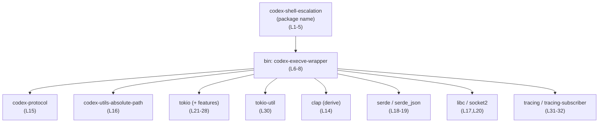
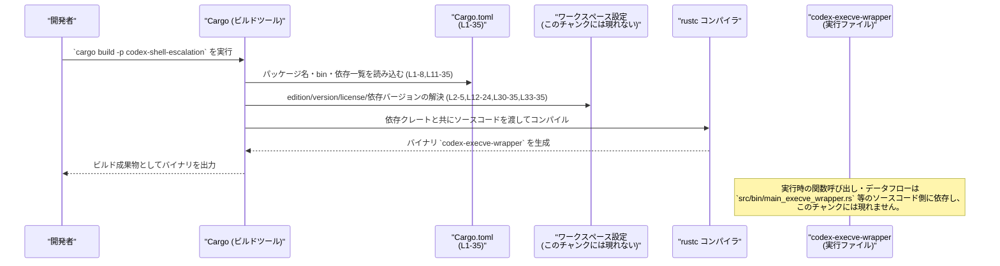

# shell-escalation/Cargo.toml コード解説

## 0. ざっくり一言

このファイルは、Rust クレート `codex-shell-escalation` の Cargo マニフェストであり、バイナリターゲット `codex-execve-wrapper` と、そのビルドに必要な依存クレート・ワークスペース設定・リント設定を宣言しています（Cargo.toml:L1-8,L9-10,L11-35）。

---

## 1. このモジュールの役割

### 1.1 概要

- このファイルは **Cargo（Rust のビルドツール）** が参照する設定ファイルで、`codex-shell-escalation` パッケージのビルド方法を定義します（Cargo.toml:L1-5）。
- バイナリターゲット `codex-execve-wrapper` のエントリポイントを `src/bin/main_execve_wrapper.rs` に指定しています（Cargo.toml:L6-8）。
- 依存クレート（`tokio`, `serde`, `clap`, `libc`, `socket2`, `tracing` など）と dev-dependencies（`pretty_assertions`, `tempfile`）をワークスペース経由で宣言し、ビルド環境・テスト環境を構成します（Cargo.toml:L11-35）。

### 1.2 アーキテクチャ内での位置づけ

このファイルから分かる範囲の「コンポーネント間の静的な依存関係」を示します。



- `codex-shell-escalation` パッケージが 1 つのバイナリ `codex-execve-wrapper` を持ち、そのバイナリが各依存クレートを利用する構造であることが分かります（Cargo.toml:L1-8,L11-32）。
- 依存バージョンや詳細設定はワークスペース側にあり、このチャンクには現れません（`workspace = true` 指定、Cargo.toml:L2-5,L11-24,L30-35,L33-35）。

### 1.3 設計上のポイント

コードから読み取れる設計上の特徴は次のとおりです。

- **ワークスペース集中管理**  
  - `edition.workspace = true`, `license.workspace = true`, `version.workspace = true` により、エディション・ライセンス・バージョンはいずれもワークスペースルートで一元管理されています（Cargo.toml:L2-5）。
  - ほとんどの依存クレートも `workspace = true` で宣言され、バージョンやソースはワークスペース側に集約されています（Cargo.toml:L12-24,L30-35,L33-35）。
- **バイナリ専用クレート**  
  - `[[bin]]` セクションがあり、ライブラリセクション（`[lib]`）はありません（Cargo.toml:L6-8）。このため、このクレートはバイナリ実行ファイルを主目的とする構成と解釈できます（ライブラリ API の公開有無は、このチャンクからは不明）。
- **リント設定のワークスペース共有**  
  - `[lints] workspace = true` により、lint（警告・スタイルチェックなど）の設定もワークスペースで統一されています（Cargo.toml:L9-10）。
- **非同期・並行処理を想定した依存構成**  
  - `tokio` に `rt-multi-thread` を含む複数の機能フラグが有効化されており（Cargo.toml:L21-28）、マルチスレッドの非同期ランタイム・ネットワーク・プロセス・シグナル・タイマ関連 API を利用できる設定になっています。
- **OS との低レベルな連携の可能性**  
  - `libc` と `socket2` が依存に含まれており（Cargo.toml:L17,L20）、C API やソケットレベルでの OS 呼び出しを行うコードが別ファイルに存在する可能性があります。ただし、具体的な利用方法はこのチャンクからは分かりません。
- **CLI とシリアライズの利用可能性**  
  - `clap`（`derive` 機能）と `serde`（`derive` 機能）、`serde_json` が依存にあり（Cargo.toml:L14,L18-19）、コマンドライン引数パースや JSON シリアライズを行うコードが存在することが示唆されますが、詳細はソースコード側に依存します。

---

## 2. 主要な機能一覧

このファイル自体は Rust の関数や型を定義しませんが、ビルド・実行の観点で次の「機能」を提供します。

- パッケージメタ情報の宣言: パッケージ名・バージョン・ライセンス・エディションをワークスペース設定に委譲する（Cargo.toml:L1-5）。
- バイナリターゲットの定義: 実行ファイル `codex-execve-wrapper` の名前とエントリポイントのパスを定義する（Cargo.toml:L6-8）。
- ワークスペース共通リントの適用: ワークスペースで定義された lint 設定をこのクレートにも適用する（Cargo.toml:L9-10）。
- 実行時依存クレートの登録: エラー処理（`anyhow`）、非同期・並行処理（`tokio`, `tokio-util`）、CLI パース（`clap`）、シリアライズ（`serde`, `serde_json`）、OS 連携（`libc`, `socket2`）、ロギング（`tracing`, `tracing-subscriber`）などを使えるようにする（Cargo.toml:L11-32）。
- 開発・テスト用依存クレートの登録: `pretty_assertions` と `tempfile` をテスト・開発用途で利用可能にする（Cargo.toml:L33-35）。

---

## 3. 公開 API と詳細解説

### 3.1 型一覧（構造体・列挙体など）

このファイル自体には Rust の型定義は含まれません（Cargo.toml は設定ファイルであり、ソースコードではないため）。  
代わりに、「Cargo レベルでのコンポーネントインベントリー」を示します。

| 名称 | 種別 | 役割 / 用途 | 定義位置 |
|------|------|-------------|----------|
| `codex-shell-escalation` | パッケージ | クレート全体を表すパッケージ名。バージョン・ライセンス・エディションはワークスペースで管理される。 | Cargo.toml:L1-5 |
| `codex-execve-wrapper` | バイナリターゲット | 実行ファイルとしてビルドされるバイナリの名前。`src/bin/main_execve_wrapper.rs` がエントリポイント。 | Cargo.toml:L6-8 |
| `anyhow` | 依存クレート | エラーを集約的に扱うためのユーティリティクレート。エラー型・エラーハンドリングに利用される可能性がある。 | Cargo.toml:L12 |
| `async-trait` | 依存クレート | 非同期関数を含むトレイトを記述できるようにするマクロクレート。非同期トレイト実装に利用される可能性がある。 | Cargo.toml:L13 |
| `clap` (`derive`) | 依存クレート | コマンドライン引数パーサ。`derive` 機能により構造体に属性マクロを付けて CLI を定義可能。 | Cargo.toml:L14 |
| `codex-protocol` | 依存クレート | プロジェクト固有のプロトコル定義と推測されるが、このチャンクから詳細は分からない。 | Cargo.toml:L15 |
| `codex-utils-absolute-path` | 依存クレート | 絶対パス関連ユーティリティと推測されるが、このチャンクから詳細は分からない。 | Cargo.toml:L16 |
| `libc` | 依存クレート | C 標準ライブラリのシンボルを提供する FFI クレート。OS API 呼び出しなどで使われる可能性がある。 | Cargo.toml:L17 |
| `serde` (`derive`) | 依存クレート | シリアライズ／デシリアライズのためのフレームワーク。`derive` 機能で構造体などに自動実装が可能。 | Cargo.toml:L18 |
| `serde_json` | 依存クレート | JSON 形式のシリアライズ／デシリアライズを提供するクレート。 | Cargo.toml:L19 |
| `socket2` (`all`) | 依存クレート | OS のソケット API への比較的ローレベルなアクセスを提供。`all` 機能により多くの機能が有効化されている。 | Cargo.toml:L20 |
| `tokio` + features | 依存クレート | 非同期ランタイム。`io-std`, `net`, `macros`, `process`, `rt-multi-thread`, `signal`, `time` 機能が有効。 | Cargo.toml:L21-28 |
| `tokio-util` | 依存クレート | `tokio` 向けの追加ユーティリティ。フレーム化などに利用されることが多いが詳細はコード側に依存する。 | Cargo.toml:L30 |
| `tracing` | 依存クレート | 構造化ログおよび分散トレーシングのためのインターフェース。 | Cargo.toml:L31 |
| `tracing-subscriber` (`env-filter`,`fmt`) | 依存クレート | `tracing` のサブスクライバ実装。環境変数でログレベルを制御する `env-filter` とフォーマット出力用 `fmt` を有効化。 | Cargo.toml:L32 |
| `pretty_assertions` | dev 依存クレート | テストでの assert の差分を見やすく表示するためのクレート。 | Cargo.toml:L34 |
| `tempfile` | dev 依存クレート | 一時ファイル／一時ディレクトリを安全に扱うためのクレート。テストや一時的なファイル操作に利用される可能性がある。 | Cargo.toml:L35 |

> このファイルには構造体・列挙体・関数などの Rust コードは含まれません。そのため、**公開 API は別ファイル（例: `src/bin/main_execve_wrapper.rs`）に定義されており、このチャンクには現れません**。

### 3.2 関数詳細（最大 7 件）

このファイルは Cargo の設定ファイルであり、**Rust の関数定義を一切含みません**。  
したがって、関数詳細テンプレートを適用できる対象はこのチャンクには存在しません（関数 = 0 とメタ情報にも記載あり）。

### 3.3 その他の関数

同様の理由で、このセクションに記載すべき補助関数やラッパー関数も、このファイルには存在しません。

---

## 4. データフロー

### 4.1 依存解決・ビルド時のフロー（概念図）

このファイルからは実行時の関数呼び出しフローは読み取れないため、**Cargo がこのファイルをどのように使って依存解決・ビルドを行うか**という観点でのデータフローを示します。



- 依存クレートのリストは `[dependencies]` セクションで宣言されており（Cargo.toml:L11-32）、バージョンやソースは `workspace = true` によりワークスペースルートに委譲されます。
- 実際にどの依存クレートの API がどのような順序で呼ばれるかはソースコードに依存し、このチャンクからは特定できません。

---

## 5. 使い方（How to Use）

### 5.1 基本的な使用方法

このファイルから分かる範囲での「クレートの使い方」は、主に Cargo コマンドを通したバイナリのビルド・実行です。

```bash
# ワークスペース内で codex-shell-escalation のバイナリをビルドする例
cargo build -p codex-shell-escalation --bin codex-execve-wrapper

# デバッグビルドを実行する例
cargo run -p codex-shell-escalation --bin codex-execve-wrapper -- [引数...]
```

- `-p codex-shell-escalation` はパッケージ名に対応します（Cargo.toml:L4）。
- `--bin codex-execve-wrapper` はバイナリ名に対応します（Cargo.toml:L6-8）。
- 実際にどの引数がサポートされているかは、`clap` を使うコードなどが定義されているソースファイル側を確認する必要があります（このチャンクには現れません）。

### 5.2 よくある使用パターン

このファイルから推測できる範囲で、一般的な使用パターンを述べます。

- **非同期ランタイムを用いるバイナリとしての利用**  
  - `tokio` のマルチスレッドランタイム機能が有効化されているため（Cargo.toml:L21-28）、`#[tokio::main]` アトリビュートなどを使った非同期エントリポイントを持つ可能性があります。ただし、実際にそうなっているかはソースコードを確認する必要があります。
- **CLI ツールとしての利用**  
  - `clap`（`derive`）が依存にあるため（Cargo.toml:L14）、CLI 引数を受け取るツールである可能性がありますが、具体的なオプション設計はこのチャンクでは不明です。
- **構造化ログ出力**  
  - `tracing` + `tracing-subscriber` が依存にあるため（Cargo.toml:L31-32）、トレース可能なログ出力を行う構成にしやすくなっています。

> 上記はいずれも「依存クレートから一般的に推測される使用パターン」であり、**このクレートが必ずそう実装されているとは限りません**。実際の挙動はソースコードを確認する必要があります。

### 5.3 よくある間違い

このファイルに関連して起こり得る誤りをいくつか挙げます（一般的な Cargo の注意点です）。

```toml
# 間違い例: ワークスペース側で edition 等が定義されていないのに workspace = true を指定
[package]
edition.workspace = true
# → ワークスペースルートで edition が定義されていない場合、ビルドエラーになる

# 正しい例: ワークスペースルートの Cargo.toml 側で edition を定義している前提で workspace = true を指定
[package]
edition.workspace = true
```

- このチャンクにはワークスペースルートの `Cargo.toml` が含まれていないため、実際にどう定義されているかは分かりませんが、`workspace = true` を使う場合はルート側の定義が必須です（Cargo.toml:L2-5,L11-24,L30-35,L33-35）。

### 5.4 使用上の注意点（まとめ）

この Cargo マニフェスト自体に関する注意点は次のとおりです。

- **ワークスペース依存**  
  - 多くの項目が `workspace = true` になっているため、ワークスペースルートの設定との整合性が前提になります。ルート側で依存や edition を削除するとビルドが失敗する可能性があります（Cargo.toml:L2-5,L12-24,L30-35,L33-35）。
- **非同期・並行処理の前提**  
  - `tokio` の `rt-multi-thread` 機能が有効なため（Cargo.toml:L21-28）、別ファイルのコードではマルチスレッドの非同期実行を行っている可能性があります。その場合、共有データへのアクセスには `Send` / `Sync` や `Arc`, `Mutex` などの Rust の並行性モデルに従う必要がありますが、その具体的な利用方法はこのチャンクからは分かりません。
- **低レベル OS API の安全性**  
  - `libc` や `socket2` を利用するコード（別ファイル）が存在する場合、`unsafe` ブロックや OS リソースの扱いに注意が必要です。ただし、このチャンクからは実際の呼び出しコードは確認できません。

---

## 6. 変更の仕方（How to Modify）

### 6.1 新しい機能を追加する場合

Cargo.toml レベルで新しい機能を追加する典型的なパターンを示します。

1. **新しい依存クレートが必要な場合**
   - ワークスペース側でそのクレートを追加し、`workspace = true` で再利用するか（他の依存と同様、Cargo.toml:L12-24,L30-35,L33-35）、このファイルに直接バージョンを指定します。
   - 例（一般形）:

     ```toml
     [dependencies]
     # 既存の workspace 依存
     tokio = { workspace = true, features = ["io-std", "net", "rt-multi-thread"] }

     # 追加したいクレート (ワークスペース外で個別指定する場合)
     # my-crate = "1.2"
     ```

2. **新しいバイナリターゲットを追加したい場合**
   - 追加の `[[bin]]` セクションを記述します（Cargo.toml:L6-8 を参考に増やす）。
   - 例（一般形）:

     ```toml
     [[bin]]
     name = "another-tool"               # 新しいバイナリ名
     path = "src/bin/another_tool.rs"    # 新しいエントリポイント
     ```

3. **lint ポリシーをカスタマイズしたい場合**
   - 現状は `[lints] workspace = true` となっているため（Cargo.toml:L9-10）、ワークスペース共有設定を維持するか、個別設定を行うかを検討します。具体的な書き方はワークスペースルートの定義に依存し、このチャンクからは分かりません。

### 6.2 既存の機能を変更する場合

このファイルを変更する際に注意すべき点を整理します。

- **パッケージ名・バイナリ名の変更**
  - `name = "codex-shell-escalation"` を変更するとパッケージ名が変わり、`cargo build -p` や他クレートからの参照に影響します（Cargo.toml:L4）。
  - `[[bin]]` の `name = "codex-execve-wrapper"` を変更すると、ビルドターゲット名や実行コマンドも変わります（Cargo.toml:L6-8）。
- **依存クレートの削除・機能フラグの変更**
  - `tokio` の機能フラグ（`rt-multi-thread`, `net`, `process` など）を削ると、対応する API を呼んでいるコードがコンパイルエラーになる可能性があります（Cargo.toml:L21-28）。
  - `clap`, `serde`, `tracing` などを削除した場合も同様です（Cargo.toml:L14,L18,L31-32）。
- **ワークスペース設定との整合性**
  - `workspace = true` を解除して個別バージョンを指定した場合、ワークスペース内の他クレートとバージョンが不一致になりうるため、ビルド時間・バイナリサイズ・挙動の差異に注意が必要です（Cargo.toml:L2-5,L12-24,L30-35,L33-35）。

> 実際にどのコードがどの依存に依存しているかを確認するには、`src/bin/main_execve_wrapper.rs` や他のソースファイルを検索する必要があります。このチャンクにはそれらは含まれません。

---

## 7. 関連ファイル

この Cargo.toml と密接に関係するファイル・ディレクトリを整理します。

| パス（または種別） | 役割 / 関係 |
|--------------------|------------|
| `src/bin/main_execve_wrapper.rs` | `[[bin]]` セクションで指定されたバイナリ `codex-execve-wrapper` のエントリポイントです（Cargo.toml:L6-8）。このファイルに実際の `main` 関数やコアロジックが含まれると考えられますが、このチャンクにはコード内容は現れません。 |
| ワークスペースルートの `Cargo.toml` | `edition.workspace = true`, `license.workspace = true`, `version.workspace = true` や依存の `workspace = true` により参照される設定を定義しているファイルです（Cargo.toml:L2-5,L12-24,L30-35,L33-35）。具体的なパスや内容はこのチャンクからは分かりません。 |
| `src/` ディレクトリ全般 | 実際の Rust コード（構造体・関数・非同期ロジックなど）が存在すると考えられる場所です。この Cargo.toml はそれらのビルド設定を提供しますが、コード自体はこのチャンクには現れません。 |
| テストコード（例: `tests/` や `src/*_test.rs` など） | `pretty_assertions` および `tempfile` が dev-dependencies に含まれているため（Cargo.toml:L34-35）、テストコードや一時ファイルを用いる検証コードが存在する可能性があります。ただし、具体的なファイルパスや内容はこのチャンクからは分かりません。 |

---

### まとめ（安全性・エラー・並行性の観点）

- **安全性**  
  - `libc` / `socket2` の利用により、OS レベルの操作や `unsafe` コードが関わる可能性がありますが、具体的な安全性検証はソースコードを見ないとできません（Cargo.toml:L17,L20）。
- **エラー処理**  
  - `anyhow` により、エラーをまとめて扱う設計を取りやすくなっています（Cargo.toml:L12）。エラー型の詳細やハンドリング方針は、ソースコード側の契約（Result の使い方など）に依存します。
- **並行性**  
  - `tokio` の `rt-multi-thread` ランタイムにより、マルチスレッド非同期実行が前提のコードである可能性があります（Cargo.toml:L21-28）。共有状態の扱い（`Send` / `Sync` 制約など）は Rust 言語固有の並行性モデルに従いますが、このチャンクからは具体的な実装は読み取れません。

このファイルは「公開 API やコアロジック」そのものではなく、**それらを含む別ファイル群をビルド・実行するための設定**を提供する位置づけであることが、このチャンクから分かります。
