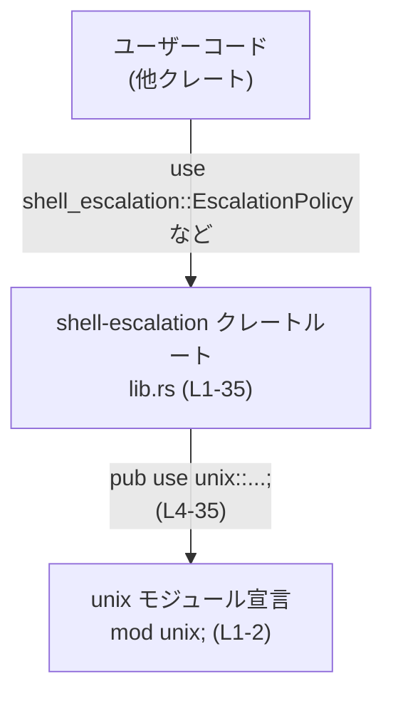

# shell-escalation/src/lib.rs コード解説

## 0. ざっくり一言

UNIX 環境向けに定義された `unix` モジュールを条件付きコンパイルし、その中の型・関数・定数をクレートの公開 API として再エクスポートするルートモジュールです（`shell-escalation/src/lib.rs:L1-35`）。

---

## 1. このモジュールの役割

### 1.1 概要

- このモジュールは、UNIX 固有のシェル権限昇格（と推測される）ロジックを持つ `unix` モジュールを外部公開するための **薄いファサード** です（`mod unix;` のみ定義、`shell-escalation/src/lib.rs:L1-2`）。
- 具体的な処理本体や安全性・エラーハンドリングのロジックは、すべて `unix` モジュール側にあり、このチャンクには含まれていません（`shell-escalation/src/lib.rs:L4-35`）。

### 1.2 アーキテクチャ内での位置づけ

このファイルの観点から見える構造は、以下のような「ユーザーコード → クレートルート → unix モジュール」という単純な依存関係です。



- `lib.rs` は `mod unix;` により `unix` モジュールを宣言しています（`shell-escalation/src/lib.rs:L1-2`）。
- その直後に、`#[cfg(unix)]` 付きで `unix` 内のシンボルを `pub use` しており（`shell-escalation/src/lib.rs:L4-35`）、ユーザーコードは `shell_escalation::EscalationPolicy` のように、直接 `unix` を意識せずアクセスできます。
- `#[cfg(unix)]` により、UNIX 以外のプラットフォームでは `unix` モジュールと再エクスポートがコンパイルから除外されます。

### 1.3 設計上のポイント

コードから読み取れる特徴を列挙します。

- **条件付きコンパイルによるプラットフォーム制約**  
  - すべての再エクスポートに `#[cfg(unix)]` が付いています（`shell-escalation/src/lib.rs:L4-35`）。  
  - そのため、UNIX 以外のプラットフォームでは、これらの API は存在せず、参照するとコンパイルエラーになります。これは実行時ではなく **コンパイル時の安全性** を重視する設計です。
- **ステートレスなルートモジュール**  
  - このファイル内には構造体・列挙体・関数などの実装は一切なく（`shell-escalation/src/lib.rs:L1-35`）、状態を保持しません。
- **実装と公開インターフェースの分離**  
  - 実装本体は `unix` モジュールに閉じ込め、`lib.rs` は `pub use` によるインターフェース定義のみに特化しています（`shell-escalation/src/lib.rs:L4-35`）。
- **セキュリティ上の位置づけ**  
  - クレート名やシンボル名から権限昇格に関わるライブラリであることが想像されますが、実際の権限操作・安全性検証ロジックは `unix` モジュール側にあり、このファイル単体からは評価できません。

---

## 2. 主要な機能一覧

このファイル自身が提供する機能は「再エクスポート」と「条件付き公開」のみです。機能を整理すると次のようになります。

- UNIX 向け実装の公開:  
  - `mod unix;` で宣言した `unix` モジュール内のシンボルを、`pub use unix::...;` で外部に公開します（`shell-escalation/src/lib.rs:L1-2,L4-35`）。
- プラットフォーム条件付き API:  
  - 各公開シンボルに `#[cfg(unix)]` を付けることで、UNIX 上でのみ利用可能にします（`shell-escalation/src/lib.rs:L4-35`）。
- 代表的な公開シンボル（中身は unix 側で定義、ここでは不明）:
  - `EscalationPolicy`, `EscalationSession`, `ExecParams`, `ExecResult`, `ShellCommandExecutor`, `main_execve_wrapper`, `run_shell_escalation_execve_wrapper` などの名前が再エクスポートされています（`shell-escalation/src/lib.rs:L4-35`）。

---

## 3. 公開 API と詳細解説

### 3.0 コンポーネントインベントリー（モジュール / シンボル一覧）

まず、このチャンクから確認できるコンポーネント（モジュールおよび再エクスポートシンボル）の一覧です。

#### モジュール

| 名前 | 種別 | 定義位置 | 説明 |
|------|------|----------|------|
| `unix` | モジュール宣言 | `shell-escalation/src/lib.rs:L1-2` | UNIX 向け実装を含む内部モジュールとして宣言されています。実体のファイル（`src/unix.rs` もしくは `src/unix/mod.rs` 等）はこのチャンクには現れません。 |

#### 再エクスポートされるシンボル

> 種別（構造体 / 列挙体 / 関数 / 定数など）は、すべて `unix` モジュール側で定義されており、このチャンクには定義がないため **確定できません**。Rust の命名規則から推測できるものもありますが、ここでは「不明」と表記します。

| 名前 | 種別（このチャンクからは） | 出所 | `pub use` の位置 |
|------|--------------------------|------|-------------------|
| `ESCALATE_SOCKET_ENV_VAR` | 不明（再エクスポートのみ） | `unix` モジュール | `shell-escalation/src/lib.rs:L4-5` |
| `EscalateAction` | 不明 | `unix` | `shell-escalation/src/lib.rs:L6-7` |
| `EscalateServer` | 不明 | `unix` | `shell-escalation/src/lib.rs:L8-9` |
| `EscalationDecision` | 不明 | `unix` | `shell-escalation/src/lib.rs:L10-11` |
| `EscalationExecution` | 不明 | `unix` | `shell-escalation/src/lib.rs:L12-13` |
| `EscalationPermissions` | 不明 | `unix` | `shell-escalation/src/lib.rs:L14-15` |
| `EscalationPolicy` | 不明 | `unix` | `shell-escalation/src/lib.rs:L16-17` |
| `EscalationSession` | 不明 | `unix` | `shell-escalation/src/lib.rs:L18-19` |
| `ExecParams` | 不明 | `unix` | `shell-escalation/src/lib.rs:L20-21` |
| `ExecResult` | 不明 | `unix` | `shell-escalation/src/lib.rs:L22-23` |
| `Permissions` | 不明 | `unix` | `shell-escalation/src/lib.rs:L24-25` |
| `PreparedExec` | 不明 | `unix` | `shell-escalation/src/lib.rs:L26-27` |
| `ShellCommandExecutor` | 不明 | `unix` | `shell-escalation/src/lib.rs:L28-29` |
| `Stopwatch` | 不明 | `unix` | `shell-escalation/src/lib.rs:L30-31` |
| `main_execve_wrapper` | 不明 | `unix` | `shell-escalation/src/lib.rs:L32-33` |
| `run_shell_escalation_execve_wrapper` | 不明 | `unix` | `shell-escalation/src/lib.rs:L34-35` |

この表から分かるのは、**すべての公開 API は `unix` モジュール由来である**という点だけです。型の詳細・関数シグネチャ・エラーハンドリング等は、このチャンクからは読み取れません。

### 3.1 型一覧（構造体・列挙体など）

上表の通り、このファイルには型定義は含まれておらず、すべてが `unix` 側からの再エクスポートです（`shell-escalation/src/lib.rs:L4-35`）。

そのため「型のフィールド」「バリアント」といった詳細情報は **このチャンクからは不明** であり、ここでは一覧表以上の情報は提供できません。

### 3.2 関数詳細（再エクスポート関数様シンボル）

このファイルには `fn` 定義が存在しませんが、名前から「関数である可能性が高い」シンボルとして `main_execve_wrapper` と `run_shell_escalation_execve_wrapper` が再エクスポートされています（`shell-escalation/src/lib.rs:L32-35`）。

ただし、実際に関数であるかどうか、またシグネチャ・挙動はこのチャンクには一切現れないため、以下では **「不明である」ことを明示する形** でテンプレートに沿って記載します。

#### `main_execve_wrapper(...) -> ...`（シグネチャ不明）

**概要**

- `unix` モジュール由来のシンボルを再エクスポートしたものです（`shell-escalation/src/lib.rs:L32-33`）。
- 名前からは `execve(2)` をラップするエントリポイント的な役割が想定されますが、実際の挙動・安全性は `unix` 側の実装を確認しないと分かりません。

**引数**

- このチャンクには定義がないため、引数の有無・型・意味はすべて不明です。

**戻り値**

- 同様に、戻り値の型や成功・失敗の表現方法（`Result` を返すかどうか等）は不明です。

**内部処理の流れ（アルゴリズム）**

- 本ファイルには実装が存在しないため、内部処理の流れは一切確認できません。
- どのようなシステムコールを行うか、どのようなチェック・ログ出力・エラー変換を行うかも不明です。

**Examples（使用例）**

- シグネチャが不明なため、コンパイル可能で正確な使用例コードを提示することはできません。
- 実際の利用方法を知るには、`unix` モジュールの実装またはクレートの外部ドキュメントを参照する必要があります。

**Errors / Panics**

- `Result` や `Option` を返すかどうかが不明なため、エラー条件・パニック条件を列挙できません。

**Edge cases（エッジケース）**

- 空文字列・無効なパス・権限不足などに対する挙動は、このチャンクからは全く分かりません。

**使用上の注意点**

- このシンボル自体が `#[cfg(unix)]` でガードされているため、UNIX 以外では存在しません（`shell-escalation/src/lib.rs:L32-33`）。  
  → 呼び出し側で `#[cfg(unix)]` もしくは `cfg!(unix)` に応じた条件分岐を行う必要があります。

#### `run_shell_escalation_execve_wrapper(...) -> ...`（シグネチャ不明）

**概要**

- `unix` モジュールから再エクスポートされているシンボルです（`shell-escalation/src/lib.rs:L34-35`）。
- 名前からは「シェル権限昇格を行う execve ラッパーを実行する」高レベル API のようにも読めますが、推測にとどまり、コードからは確認できません。

**引数**

- このチャンクには定義がないため、すべて不明です。

**戻り値**

- 戻り値の型・意味も不明です。

**内部処理の流れ**

- 実装は `unix` 側にあり、このファイルからは一切参照できません。

**Examples（使用例）**

- 正確なシグネチャが分からないため、使用例は提示できません。

**Errors / Panics**

- 不明です。

**Edge cases（エッジケース）**

- 引数の境界値・異常入力への挙動は不明です。

**使用上の注意点**

- `#[cfg(unix)]` により、UNIX 以外ではこのシンボルは存在しません（`shell-escalation/src/lib.rs:L34-35`）。

### 3.3 その他の関数

- このファイル内に `fn` で定義された関数は存在しません（`shell-escalation/src/lib.rs:L1-35`）。
- 関数として利用される可能性のあるシンボルは、すべて `unix` モジュールからの再エクスポートです。

---

## 4. データフロー

このチャンクから分かるデータフローは、「ユーザーコードが型・関数名を解決する際に、`unix` モジュール経由で解決される」という **名前解決レベル** のフローに限られます。

### 4.1 名前解決のフロー（例: `ExecResult`）

ユーザーコードが UNIX 環境で `ExecResult` を利用する場合のフローは次のようになります。

```mermaid
sequenceDiagram
    participant User as "ユーザーコード"
    participant Lib as "shell-escalation クレートルート\nlib.rs (L1-35)"
    participant Unix as "unix モジュール\n宣言のみ L1-2\n実体は別ファイル"

    User->>Lib: `use shell_escalation::ExecResult;`
    Note right of Lib: `#[cfg(unix)] pub use unix::ExecResult;`<br/>（L20-21）
    Lib->>Unix: `ExecResult` シンボルを解決
    Unix-->>Lib: 実際の型・定義を返す（実装は本チャンク外）
    Lib-->>User: `ExecResult` 型として利用可能になる
```

- 実際の実行時データフロー（プロセス生成・権限変更など）は `unix` モジュール側にあり、この図では扱っていません。
- このレベルでの「エラー」は、主にコンパイル時のものです:
  - UNIX 以外の環境では `#[cfg(unix)]` により再エクスポート自体が存在しないため、`use shell_escalation::ExecResult;` がコンパイルエラーになります（`shell-escalation/src/lib.rs:L20-21`）。

---

## 5. 使い方（How to Use）

### 5.1 基本的な使用方法

このファイル単体では API の詳細が分からないため、**利用パターン（cfg と再エクスポートの前提）** のみを示します。

```rust
// Cargo.toml でこのクレートを依存として追加している前提です。
// [dependencies]
// shell-escalation = "x.y"  // バージョンは仮置き

// UNIX 環境でのみコンパイルされるコードに限定する
#[cfg(unix)]
use shell_escalation::{
    EscalationPolicy,          // 実際の型は unix モジュール側
    ExecParams,
    ExecResult,
    ShellCommandExecutor,
    main_execve_wrapper,
    run_shell_escalation_execve_wrapper,
};

#[cfg(unix)]
fn main() {
    // ここで EscalationPolicy などを利用できるが、
    // 具体的なフィールド・メソッドは unix モジュールの実装に依存する。
    // このチャンクからは利用例を正確に記述できない。
}

#[cfg(not(unix))]
fn main() {
    // 非 UNIX ではこのクレートの公開シンボルが存在しないため、
    // 別のコードパスを実装する必要がある。
}
```

**ポイント**

- `#[cfg(unix)]` で **呼び出し側もガードする** ことで、非 UNIX 環境でのコンパイルエラーを避けられます（`shell-escalation/src/lib.rs:L4-35`）。
- 実際の API（コンストラクタ、メソッド、戻り値など）の使い方は、`unix` モジュールの定義を参照する必要があります。

### 5.2 よくある使用パターン

このチャンクだけからは具体的なパターンは抽出できませんが、一般的には次のようなパターンが想定されます（**あくまで一般論であり、このクレート固有の仕様ではありません**）。

- **UNIX 限定のコマンドラインツール**  
  - `main` 関数自体を `#[cfg(unix)]` でガードし、内部で再エクスポートされた API を利用する。
- **マルチプラットフォームアプリケーション**  
  - UNIX のみこのクレートを使い、他プラットフォームでは別の実装に切り替える。

### 5.3 よくある間違い

このファイルの構造から推測できる誤用例と、その修正版です。

```rust
// 誤りの可能性が高い例（UNIX 以外でコンパイルエラーになりうる）
use shell_escalation::ExecResult;   // lib.rs 側では #[cfg(unix)] 付きで再エクスポートされている

fn main() {
    // ...
}
```

```rust
// より安全な例（呼び出し側も UNIX 条件でガードする）
#[cfg(unix)]
use shell_escalation::ExecResult;

#[cfg(unix)]
fn main() {
    // UNIX 特有の ExecResult を利用する処理
}

#[cfg(not(unix))]
fn main() {
    // 別の実装
}
```

**根拠**

- `ExecResult` の再エクスポート自体が `#[cfg(unix)]` でガードされているため（`shell-escalation/src/lib.rs:L20-21`）、呼び出し側も同様にガードしないと、非 UNIX 環境でシンボルが存在せず、コンパイルエラーとなる可能性があります。

### 5.4 使用上の注意点（まとめ）

- **プラットフォーム依存性**  
  - すべての公開シンボルは `#[cfg(unix)]` によって UNIX 限定です（`shell-escalation/src/lib.rs:L4-35`）。  
  - 非 UNIX 環境との共存が必要な場合は、呼び出し側でも条件コンパイルを行う必要があります。
- **シンボル種別・契約の不透明性**  
  - このファイルからは `EscalationPolicy` などの型や関数の契約（引数・戻り値・エラー条件）が分からないため、**直接利用する前に必ず unix モジュール側の定義やクレートドキュメントを確認する必要があります。**
- **並行性・スレッド安全性**  
  - どのシンボルが `Send` / `Sync` か、内部でどのようなロックやプロセス操作を行うかは不明です。この点も unix モジュール側の実装に依存します。

---

## 6. 変更の仕方（How to Modify）

このファイルは非常に薄いラッパーのため、変更点も主に「どのシンボルをどの条件で再エクスポートするか」に集中します。

### 6.1 新しい機能を追加する場合

1. **unix モジュール側に新しいシンボルを定義する**  
   - 例: `NewFeature` という構造体や関数を `unix` モジュール内に追加する。  
   - ※実際のファイルパス（`src/unix.rs` / `src/unix/mod.rs` 等）はこのチャンクからは特定できませんが、Rust の標準的なモジュール規約に従う必要があります。

2. **`lib.rs` に再エクスポートを追加する**  

   ```rust
   #[cfg(unix)]
   pub use unix::NewFeature;
   ```

   - これにより、ユーザーコードから `shell_escalation::NewFeature` として利用できるようになります。

3. **契約・ドキュメントの整合性を保つ**  
   - 新しいシンボルの役割や前提条件を、unix モジュール側のドキュメントとあわせて明文化することが望ましいです。

### 6.2 既存の機能を変更する場合

このファイルを変更するケースとしては次のようなものがあります。

- **再エクスポートを削除する / 名前を変える**  
  - 例: `pub use unix::ExecResult;` を削除すると、外部からは `ExecResult` が見えなくなります（`shell-escalation/src/lib.rs:L22-23`）。  
  - 影響範囲として、このクレートを利用しているすべてのコード（`shell_escalation::ExecResult` を参照している箇所）がコンパイルエラーになります。
- **条件コンパイルの条件を変更する**  
  - 例: `#[cfg(unix)]` を `#[cfg(all(unix, feature = "server"))]` のように変更する場合、呼び出し側の `Cargo.toml` の feature 設定も含めて確認が必要です。

**変更時の注意点**

- このファイルは **API の入口** であるため、再エクスポートの変更はすべて **公開 API の変更** になります。
- 互換性（セマンティックバージョニング）を保つ必要があるプロジェクトでは、破壊的変更かどうかに注意する必要があります。

---

## 7. 関連ファイル

このチャンクに直接現れないものも含め、本モジュールと密接に関連すると考えられるファイル・ディレクトリを整理します。

| パス（推定含む） | 役割 / 関係 |
|------------------|------------|
| `shell-escalation/src/unix.rs` または `shell-escalation/src/unix/mod.rs`（推定） | `mod unix;` 宣言の実体となるファイルです（`shell-escalation/src/lib.rs:L1-2`）。`EscalationPolicy` や `ShellCommandExecutor` など、本体の実装・安全性・エラーハンドリングはここに含まれると考えられますが、このチャンクには定義がありません。 |
| （テストファイル不明） | このチャンクには `#[cfg(test)]` や `tests` ディレクトリへの参照がなく、テストコードの場所・有無は不明です。 |

---

### このチャンクから分かることの限界について

- 本レポートは `shell-escalation/src/lib.rs` の内容（`mod unix;` と `#[cfg(unix)] pub use unix::...;`）のみに基づいています（`shell-escalation/src/lib.rs:L1-35`）。
- 実際の処理ロジック、権限管理、エラー処理、並行性制御などの **コアロジック** はすべて `unix` モジュール側にあり、このチャンクからは評価できません。
- セキュリティ上の懸念やバグの可能性についても、**このファイル単体では判断できない** ことに注意が必要です。
