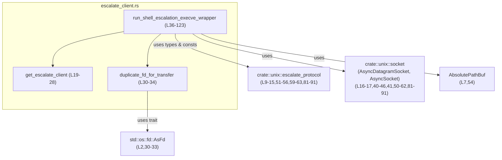
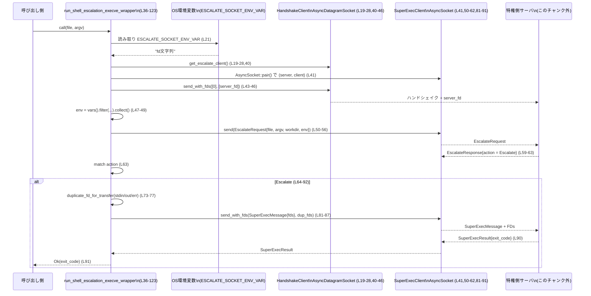

shell-escalation/src/unix/escalate_client.rs の解説です。

---

## 0. ざっくり一言

このファイルは、特権昇格プロトコル用の「クライアント側ラッパー」を実装しており、環境変数で渡された Unix ソケット経由で特権側プロセスと通信しながら、ローカルで `execv` するか、リモートで「super-exec」を行うかを決定する非同期関数を提供します（`run_shell_escalation_execve_wrapper`、shell-escalation/src/unix/escalate_client.rs:L36-123）。

---

## 1. このモジュールの役割

### 1.1 概要

- このモジュールは **特権昇格付きシェル実行** のためのクライアント機能を提供します。
- 実行対象と引数を受け取り、特権側とプロトコル (`EscalateRequest`/`EscalateResponse`) で交渉したうえで、
  - 特権側に実行を委譲する（Escalate）
  - 自プロセスを `execv` で置き換える（Run）
  - 実行を拒否する（Deny）
  のいずれかの動作を行います（shell-escalation/src/unix/escalate_client.rs:L63-123）。

### 1.2 アーキテクチャ内での位置づけ

このファイル自体は小規模ですが、いくつかの他モジュール／外部クレートに依存しています。

- `crate::unix::escalate_protocol`  
  - 環境変数名（`ESCALATE_SOCKET_ENV_VAR`, `EXEC_WRAPPER_ENV_VAR`）と、プロトコル用のメッセージ型（`EscalateRequest`, `EscalateResponse`, `EscalateAction`, `SuperExecMessage`, `SuperExecResult`）を提供（shell-escalation/src/unix/escalate_client.rs:L9-15）。
- `crate::unix::socket`  
  - 非同期ソケットラッパー `AsyncDatagramSocket`, `AsyncSocket` を提供し、FD 付きデータグラム送信や型付きメッセージ送受信に利用（L16-17, L40-46, L50-62, L81-91）。
- `codex_utils_absolute_path::AbsolutePathBuf`  
  - カレントディレクトリの絶対パス取得に利用（L7, L54）。

依存関係を簡略化して図示すると、次のようになります。



※ `crate::unix::escalate_protocol` や `crate::unix::socket` の実装はこのチャンクには現れません。

### 1.3 設計上のポイント

コードから読み取れる設計上の特徴は次のとおりです。

- **環境変数経由のソケット受け渡し**  
  - 特権側とのハンドシェイクに使うデータグラムソケット FD を、環境変数 `ESCALATE_SOCKET_ENV_VAR` から受け取る設計です（L19-27）。
- **FD 所有権と複製の明確化**  
  - `AsyncDatagramSocket::from_raw_fd` は `unsafe` で呼び出され、FD の所有権をこのオブジェクトに移します（L27）。
  - stdio の FD は `duplicate_fd_for_transfer` で複製してから転送し、元の FD はラッパープロセスが保持する方針です（L64-77）。
- **明示的なプロトコルレイヤ**  
  - 実行要求や結果は `EscalateRequest`, `EscalateResponse`, `SuperExecMessage`, `SuperExecResult` といった型として送受信されます（L51-56, L59-63, L81-91）。
- **非同期 I/O とプロセス置換の組み合わせ**  
  - メイン関数は `async fn` であり、ソケット I/O は非同期に行われます（L36-62, L81-91）。
  - 一方、`EscalateAction::Run` パスでは `libc::execv` によりプロセス自体が同期的に置換されます（L93-115）。
- **エラーハンドリングに `anyhow` を使用**  
  - ほとんどの I/O・FFI 呼び出しは `?` と `Context` によってエラーがラップされ、原因情報が付加されています（L21, L27, L31-33, L40-46, L50-62, L81-89, L98-103）。

---

## 2. 主要な機能一覧

このファイルが提供する主な機能を列挙します。

- 環境変数からのハンドシェイク用データグラムソケット取得  
  - `get_escalate_client`（L19-28）
- FD 複製ユーティリティ  
  - `duplicate_fd_for_transfer`（L30-34）
- 特権昇格プロトコルを用いた `execve` ラッパー  
  - `run_shell_escalation_execve_wrapper`（L36-123）
- FD 複製の安全性（元 FD が閉じられないこと）のテスト  
  - `duplicate_fd_for_transfer_does_not_close_original`（L133-143）

---

## 3. 公開 API と詳細解説

### 3.1 型・コンポーネント一覧

このファイル内で新たな構造体・列挙体は定義されていませんが、重要な外部型／コンポーネントをまとめます。

#### 関数／モジュール一覧

| 名前 | 種別 | 役割 / 用途 | 定義行（根拠） |
|------|------|-------------|----------------|
| `get_escalate_client` | 関数（非公開） | 環境変数 `ESCALATE_SOCKET_ENV_VAR` に格納された FD から `AsyncDatagramSocket` を生成する | shell-escalation/src/unix/escalate_client.rs:L19-28 |
| `duplicate_fd_for_transfer` | 関数（非公開） | `AsFd` を実装する FD を複製し、`OwnedFd` として返すユーティリティ | L30-34 |
| `run_shell_escalation_execve_wrapper` | 関数（公開・非同期） | プロトコルに従って特権側と通信し、実行方法（Escalate/Run/Deny）を決定して実行するメイン API | L36-123 |
| `duplicate_fd_for_transfer_does_not_close_original` | テスト関数 | FD 複製で元 FD が閉じられないことの確認 | L133-143 |

#### このファイルで利用する主な外部型（定義はこのチャンク外）

| 型名 / 定数名 | 所属モジュール | 読み取れる役割 / フィールド | 使用箇所（根拠） |
|---------------|----------------|-----------------------------|------------------|
| `AsyncDatagramSocket` | `crate::unix::socket` | 環境変数から受け渡された FD を `from_raw_fd` でラップし、`send_with_fds` で FD 付きデータグラム送信を行うソケット | L16, L19-28, L40-46 |
| `AsyncSocket` | `crate::unix::socket` | `AsyncSocket::pair()` でソケットペア生成、`send` / `receive` / `send_with_fds` による型付きメッセージと FD のやり取りを行うストリームソケット | L17, L41, L50-62, L81-91 |
| `AbsolutePathBuf` | `codex_utils_absolute_path` | カレントディレクトリを表す絶対パス型。`current_dir()` で取得 | L7, L54 |
| `ESCALATE_SOCKET_ENV_VAR` | `crate::unix::escalate_protocol` | ハンドシェイク用 FD を文字列表現で保持する環境変数名 | L9, L21, L48 |
| `EXEC_WRAPPER_ENV_VAR` | 同上 | 実行ラッパーに関連する環境変数名。EscalateRequest に渡す環境からは除外される | L10, L48 |
| `EscalateRequest` | 同上 | 少なくとも `file`, `argv`, `workdir`, `env` フィールドを持つリクエスト型 | L12, L51-56 |
| `EscalateResponse` | 同上 | 少なくとも `action` フィールドを持つレスポンス型 | L13, L59-63 |
| `EscalateAction` | 同上 | 少なくとも `Escalate`, `Run`, `Deny { reason: _ }` の 3 バリアントを持つ列挙体 | L11, L63-122 |
| `SuperExecMessage` | 同上 | 少なくとも `fds` フィールドを持つ構造体。転送先 FD の集合を表現 | L14, L81-85 |
| `SuperExecResult` | 同上 | 少なくとも `exit_code: i32` フィールドを持つ構造体 | L15, L90-91 |

> `crate::unix::escalate_protocol` と `crate::unix::socket` の中身はこのチャンクには現れないため、詳細な仕様は不明です。

---

### 3.2 関数詳細

#### `get_escalate_client() -> anyhow::Result<AsyncDatagramSocket>`

**概要**

環境変数 `ESCALATE_SOCKET_ENV_VAR` に格納された数値（ファイルディスクリプタ）を読み取り、その FD を所有する `AsyncDatagramSocket` を生成して返します（L19-28）。

**引数**

なし（環境変数から状態を取得）。

**戻り値**

- `Ok(AsyncDatagramSocket)`  
  ハンドシェイク用に利用するデータグラムソケット。
- `Err(anyhow::Error)`  
  環境変数取得・パース・ソケット生成のいずれかに失敗した場合。

**内部処理の流れ**

1. `std::env::var(ESCALATE_SOCKET_ENV_VAR)?` で環境変数の文字列値を取得（L21）。
2. `parse::<i32>()?` で数値 FD に変換（L21）。
3. 取得した FD が負数なら `anyhow::anyhow!` でエラーにする（L22-25）。
4. `unsafe { AsyncDatagramSocket::from_raw_fd(client_fd) }?` で FD をラップし、`Ok(...)` で返す（L27）。

**Errors / Panics**

- `std::env::VarError`  
  - 環境変数が未設定／非 Unicode の場合（L21, `?` によって `anyhow::Error` に変換）。
- `std::num::ParseIntError`  
  - 値が整数として解釈できない場合（L21）。
- 独自エラー（anyhow!）  
  - FD が負数だった場合（L22-25）。
- `AsyncDatagramSocket::from_raw_fd` のエラー  
  - 返り値に対する `?` により伝播（L27）。具体的な条件はこのチャンクには現れません。

パニックを起こすコードは含まれていません。

**Rust 特有の安全性・並行性**

- `unsafe { AsyncDatagramSocket::from_raw_fd(client_fd) }`  
  - `from_raw_fd` は「指定した FD が有効で、他から所有されていない」ことを前提とする低レベル操作と推測できます（名前と呼び出し方からの推測）。  
  - コメントに「一度だけ呼び出すべき（AsyncSocket が FD の所有権を取るため）」とあり（L20）、同じ FD に対して複数回 `from_raw_fd` すると二重 close などの UB が起こりうることを示唆しています。
- 並行性  
  - この関数自体は同期関数です。FD の重複利用を避けるためには、同一プロセス内で並行に呼び出さない設計が想定されていると考えられますが、その保証はこの関数内では行っていません（L20）。

**Edge cases（エッジケース）**

- `ESCALATE_SOCKET_ENV_VAR` 未設定 → 即エラー（L21）。
- 値が数値でない／桁溢れ → `parse::<i32>()?` でエラー（L21）。
- 値が負数 → 明示的にエラー（L22-25）。
- 0 以上の値でも、指す FD が既に閉じられている・ソケットでない場合の挙動は `AsyncDatagramSocket::from_raw_fd` 依存で、このチャンクからは分かりません。

**使用上の注意点**

- コメントにある通り、「同じ FD に対して複数回呼ばない」ことが前提条件です（L20）。
- 環境変数の値は信頼できない入力なので、実際の利用ではこの関数からの `Err` をそのまま上位に伝播させるか、適切にログ出力する設計が必要です。

---

#### `duplicate_fd_for_transfer(fd: impl AsFd, name: &str) -> anyhow::Result<OwnedFd>`

**概要**

`AsFd` を実装する任意の型（例: `Stdin`, `UnixStream` 等）から FD を抽出し、それを複製して `OwnedFd` として返すユーティリティ関数です（L30-34）。

**引数**

| 引数名 | 型 | 説明 |
|--------|----|------|
| `fd` | `impl AsFd` | 複製元の FD を提供する値。元の FD の所有権は移動せず、借用のみです（L30）。 |
| `name` | `&str` | エラーメッセージ用の識別名（L30-33）。 |

**戻り値**

- `Ok(OwnedFd)`  
  - 元 FD と同じ OS リソースを指す新しい FD。`OwnedFd` が Drop されるとこの複製 FD のみが閉じられます。
- `Err(anyhow::Error)`  
  - 複製に失敗した場合。

**内部処理の流れ**

1. `fd.as_fd()` で借用 FD を取得（L31）。
2. `try_clone_to_owned()` で複製 FD を作成（L31-32）。
3. `with_context(|| format!(...))` で失敗時のメッセージを付与して返却（L31-33）。

**Errors / Panics**

- FD 複製に失敗した場合（例: OS の FD 上限に達した場合など）、`try_clone_to_owned()` が `io::Error` を返し、`anyhow::Error` としてラップされます（L31-33）。
- パニックを起こすコードは含まれていません。

**Rust 特有の安全性・並行性**

- `OwnedFd` は RAII による FD 管理を行うため、メモリ安全性とリソース解放の自動化が担保されています。
- `AsFd` で借用しているため、元の FD の所有権は移動せず、複製 FD を drop しても元 FD は有効なままです。これをテストで確認しています（L133-143）。
- この関数は純粋な FD 操作であり、内部で共有状態を持たないため、並行に呼び出してもスレッド安全性の問題はありません（ただし FD 上限などの OS 資源制限は共有）。

**Edge cases（エッジケース）**

- 複製対象 FD が既に閉じられている場合の `try_clone_to_owned()` の挙動は、このチャンクからは分かりません（通常は `EBADF` エラーと推測されますが、仕様はここでは不明です）。
- `name` が長い／非 ASCII などでも、`format!` にそのまま使われるだけです（L33）。

**使用上の注意点**

- 主に FD 転送の前処理として使われており（L73-77）、元 FD を引き続き利用したい場合に適しています。
- FD を大量に複製すると FD 上限に達し得るため、ループなどで過剰に呼び出さない設計が望ましいです（この関数自身は制限を設けていません）。

---

#### `pub async fn run_shell_escalation_execve_wrapper(file: String, argv: Vec<String>) -> anyhow::Result<i32>`

**概要**

特権側と昇格プロトコルで通信し、応答に応じて以下の 3 パスのいずれかで実行します（L36-123）。

- `Escalate` パス: 特権側の「super-exec」に stdio FD を転送し、結果の終了コードを受け取る。
- `Run` パス: 特権を変えずに現在のプロセスを `libc::execv` で置き換える。
- `Deny` パス: 実行拒否メッセージを標準エラーに出力し、終了コード 1 を返す。

この関数がこのモジュールの公開 API です（L36）。

**引数**

| 引数名 | 型 | 説明 |
|--------|----|------|
| `file` | `String` | 実行するプログラムのパス。`EscalateRequest` の `file` にも使われ、`Run` パスでは `execv` の第 1 引数としても使用されます（L36-38, L51-53, L98-99, L109-111）。 |
| `argv` | `Vec<String>` | 実行時の引数リスト。`EscalateRequest` に渡され、`Run` パスでは `execv` の `argv` 配列を構成します（L37-39, L51-56, L100-107）。 |

**戻り値**

- `Ok(exit_code: i32)`  
  - `Escalate` パス: 特権側から受け取った `exit_code`（L90-91）。
  - `Deny` パス: 固定で `1`（L121）。
  - `Run` パス: 成功した場合、この関数は戻らずプロセスが置換されるため、呼び出し側には返りません。
- `Err(anyhow::Error)`  
  - ハンドシェイクの失敗、リクエスト送信／応答受信の失敗、FD 複製失敗、`CString::new` の失敗、`execv` の失敗など。

**内部処理の流れ（アルゴリズム）**

1. ハンドシェイク準備  
   - `get_escalate_client()?` で環境変数からハンドシェイク用 `AsyncDatagramSocket` を取得（L40）。
   - `AsyncSocket::pair()?` でソケットペア（`server`, `client`）を作成（L41）。
   - 定数 `HANDSHAKE_MESSAGE: [u8; 1] = [0];` を定義（L42）。
2. ハンドシェイク  
   - `server.into_inner().into()` で `server` の内部 FD を取り出し（L44）、`HANDSHAKE_MESSAGE` と共に `handshake_client.send_with_fds(&HANDSHAKE_MESSAGE, &[...]).await` で送信（L43-46）。
3. 環境変数の収集  
   - `std::env::vars()` から環境を列挙し、キーが `ESCALATE_SOCKET_ENV_VAR` または `EXEC_WRAPPER_ENV_VAR` のものを除外して `collect()`（L47-49）。  
     → この `env` は `EscalateRequest.env` に格納されます（L55）。
4. `EscalateRequest` の送信  
   - `EscalateRequest { file: file.clone().into(), argv: argv.clone(), workdir: AbsolutePathBuf::current_dir()?, env }` を構築し、`client.send(...).await` で送信（L50-58）。
5. `EscalateResponse` の受信  
   - `let message = client.receive::<EscalateResponse>().await?;` とし、`message.action` により分岐（L59-63）。
6. アクション別処理  
   - `EscalateAction::Escalate`（L64-92）  
     1. 現在の `stdin`, `stdout`, `stderr` の FD を `as_raw_fd()` で収集（L68-72）。  
     2. `duplicate_fd_for_transfer` でそれぞれの複製 FD を作成（L73-77）。  
     3. `SuperExecMessage { fds: destination_fds.into_iter().collect() }` と、複製 FD 配列 `&fds_to_send` を `client.send_with_fds(...).await` で送信（L81-87）。  
     4. `client.receive::<SuperExecResult>().await?` で結果を受信し、`exit_code` を取り出して `Ok(exit_code)` を返す（L90-91）。
   - `EscalateAction::Run`（L93-115）  
     1. `std::ffi::CString` を用いて `file` を C 文字列に変換（`CString::new(file)`、L97-99）。  
     2. `argv` の各要素を `CString::new(s.as_str())` で C 文字列に変換し、`Vec<CString>` に収集（L100-103）。  
     3. それぞれの `.as_ptr()` から `Vec<*const libc::c_char>` を組み立て、末尾に `std::ptr::null()` を追加して NULL 終端する（L105-107）。  
     4. `unsafe` ブロック内で `libc::execv(file.as_ptr(), argv.as_ptr());` を呼び、戻ってきた場合は `std::io::Error::last_os_error()` を取得（L109-112）。  
     5. `Err(err.into())` としてエラーを返す（L114）。  
        - 正常時、`execv` は戻らずプロセスが置換されるため、この行は実行されません。
   - `EscalateAction::Deny { reason }`（L116-122）  
     1. `reason` が `Some` なら `"Execution denied: {reason}"`、`None` なら `"Execution denied"` を標準エラー出力に表示（L117-120）。  
     2. `Ok(1)` を返す（L121）。

**Examples（使用例）**

この関数は非同期関数なので、何らかの async ランタイム上から呼び出す必要があります。以下は tokio を用いた例です（このクレートが実際に tokio を使っているかどうかは、このチャンクからは分かりません）。

```rust
use shell_escalation::unix::escalate_client::run_shell_escalation_execve_wrapper; // モジュールパスは例

#[tokio::main] // 何らかの async ランタイムが必要
async fn main() -> anyhow::Result<()> {
    // 実行したいプログラムと引数
    let file = "/usr/bin/id".to_string();                  // 実行ファイルパス
    let argv = vec!["id".to_string(), "-u".to_string()];   // argv[0] は慣例的にプログラム名

    // 環境変数 ESCALATE_SOCKET_ENV_VAR が事前に設定されている前提
    let exit_code = run_shell_escalation_execve_wrapper(file, argv).await?;

    // 実際のプログラムでは std::process::exit(exit_code) などで終了コードを反映する
    println!("child exited with code {exit_code}");
    Ok(())
}
```

※ `ESCALATE_SOCKET_ENV_VAR` や `EXEC_WRAPPER_ENV_VAR` のセット方法、その値（FD）の由来はこのチャンクには現れません。

**Errors / Panics**

主なエラー発生ポイントと条件は次のとおりです。

- ハンドシェイク関連  
  - `get_escalate_client()?`  
    - 前述の通り、環境変数未設定／不正値などで失敗（L40）。  
  - `AsyncSocket::pair()?`  
    - ソケットペア作成失敗（ファイルディスクリプタ枯渇など）でエラー（L41）。  
  - `handshake_client.send_with_fds(...).await`  
    - ハンドシェイクデータグラムの送信に失敗するとエラー。「failed to send handshake datagram」というコンテキストが付与されます（L43-46）。

- リクエスト／レスポンス関連  
  - `AbsolutePathBuf::current_dir()?`  
    - カレントディレクトリ取得に失敗した場合（L54）。  
  - `client.send(EscalateRequest { ... }).await`  
    - 送信に失敗すると「failed to send EscalateRequest」という文脈付きエラー（L50-58）。  
  - `client.receive::<EscalateResponse>().await`  
    - 受信に失敗すると「failed to receive EscalateResponse」という文脈付きエラー（L59-62）。

- `Escalate` パス  
  - `duplicate_fd_for_transfer(io::stdin(), "stdin")?` など  
    - FD 複製に失敗した場合（L73-77）。  
  - `client.send_with_fds(SuperExecMessage { ... }, &fds_to_send).await`  
    - 送信失敗時に「failed to send SuperExecMessage」としてエラー（L81-89）。  
  - `client.receive::<SuperExecResult>().await?`  
    - 受信失敗でエラー。追加の文脈はここでは付けられていません（L90）。

- `Run` パス  
  - `CString::new(file)` / `CString::new(s.as_str())`  
    - 文字列に NUL バイトが含まれるとエラー。「NUL in file」「NUL in argv」というコンテキスト付き（L98-103）。  
  - `libc::execv`  
    - 成功すれば戻らない。失敗時に `std::io::Error::last_os_error()` を `Err` として返すのみで、追加のコンテキストはありません（L109-115）。

- `Deny` パス  
  - `eprintln!` 自体は通常パニックしませんが、フォーマット文字列の誤りなどがあればビルド時に検出されます（L117-120）。

パニックを直接発生させるコード（`unwrap` 等）は含まれていません。

**Rust 特有の安全性・並行性**

- 所有権／借用  
  - `file` と `argv` は `String` / `Vec<String>` として所有権を持って受け取りつつ、`EscalateRequest` には `clone()` して渡しています（L51-53）。  
    → 呼び出し側が `file` / `argv` をこの後も使えるようにする意図が読み取れます。
- FD の安全な扱い  
  - stdio は `as_raw_fd()` で数値 FD を取り出しつつ、実際に転送するのは複製 FD (`OwnedFd`) です（L68-77）。  
    → ラッパープロセスが自分の stdio を引き続き利用できるようにしています。
- `unsafe` 使用箇所  
  - `libc::execv(file.as_ptr(), argv.as_ptr())`（L109-111）  
    - 事前に `CString` で NUL バイトを排除し、`argv` を NULL 終端することで、ポインタ列の安全性を確保しています（L98-107）。  
    - これにより、「ポインタが有効で NULL 終端である」という `execv` の前提条件をコード上で満たしています。  
  - これ以外の `unsafe` は `get_escalate_client` 内にあり、こちらは FD の所有権に関する前提を満たす必要があります（L27）。

- 非同期／並行性  
  - `async fn` であり、ソケット I/O は `.await` を通じて非同期に実行されます（L43-46, L50-62, L81-91）。  
  - `Run` パスで `execv` を呼び出すと、プロセス全体（含まれる全タスク）が置き換えられるため、他の非同期タスクも含めた「並行処理」はその時点で終了します。  
    → これは Unix の `exec` 系システムコールの通常の挙動です。

**Edge cases（エッジケース）**

- 環境変数が不正  
  - `ESCALATE_SOCKET_ENV_VAR` がない／不正な場合、`get_escalate_client` でエラーとなり、この関数も `Err` で終わります（L40）。  
- `EscalateResponse` の `action` がここで列挙していない値だった場合  
  - `match` は 3 パターン（`Escalate`, `Run`, `Deny { .. }`）を網羅しているため、`EscalateAction` に新しいバリアントが追加されるとコンパイルエラーになる設計です（L63-122）。
- `argv` が空のときの `Run` パス  
  - コード上はチェックがなく、空ベクタから NULL 終端だけを追加した `argv` 配列を `execv` に渡します（L100-107）。  
  - この振る舞いが OS にとって妥当かどうかは `execv` の仕様に依存し、このチャンクからは分かりません。
- 環境変数の除外  
  - `EscalateRequest.env` に入る環境からは、`ESCALATE_SOCKET_ENV_VAR` と `EXEC_WRAPPER_ENV_VAR` が除外されますが（L47-49, L55）、**プロセス自身の環境からこれらを削除しているわけではありません**。  
    → `Run` パスで `execv` された子プロセスは、デフォルトではこれらの環境変数を引き継ぐことになります（この点を変更しているコードはこのチャンクには現れません）。

**使用上の注意点（契約を含む）**

- 事前条件  
  - `ESCALATE_SOCKET_ENV_VAR` が有効なデータグラムソケット FD を表す数値でなければなりません（L21-27）。  
  - `file` と `argv` の各要素には NUL バイトを含めない必要があります（`CString::new` でエラーになります、L98-103）。
- 呼び出し回数  
  - コメントにあるように、`get_escalate_client` による FD 取得は 1 回のみを想定しているため（L20）、ラッパー全体としてはこの関数を多重に呼び出さない設計が望ましいです。
- エラー処理  
  - この関数は失敗時に `anyhow::Error` を返すため、呼び出し側で `?` による伝播、ログ、リトライなどの方針を決める必要があります。
- プロセス置換  
  - `Run` パスでは `execv` により現在のプロセスが別プログラムに置換されるため、それ以降の Rust コードは実行されません。  
    → 呼び出し側は「戻らない可能性のある関数」であることを前提に設計する必要があります。

---

### 3.3 その他の関数（テスト）

| 関数名 | 役割（1 行） | 定義行（根拠） |
|--------|--------------|----------------|
| `duplicate_fd_for_transfer_does_not_close_original` | `duplicate_fd_for_transfer` により元 FD が閉じられないことを `UnixStream::pair` と `libc::fcntl` で検証するテスト | shell-escalation/src/unix/escalate_client.rs:L133-143 |

テストの流れ（L133-143）:

1. `UnixStream::pair()` でソケットペアを作成し、`left` の FD を取得（L134-135）。
2. `duplicate_fd_for_transfer(&left, "test fd")` で複製 FD を作成し、元 FD と番号が異なることを `assert_ne!` で確認（L137-138）。
3. 複製 FD を `drop` で閉じた後（L140）、`unsafe { libc::fcntl(original_fd, libc::F_GETFD) }` が `-1` でないことを確認（L142）。  
   → 元 FD がまだ有効であることを検証しています。

---

## 4. データフロー

ここでは、`EscalateAction::Escalate` パスにおける代表的なデータフローを説明します。

1. 呼び出し側が `run_shell_escalation_execve_wrapper(file, argv)` を非同期で呼び出す（L36-39）。
2. 関数内部で環境変数 `ESCALATE_SOCKET_ENV_VAR` を読み、ハンドシェイク用 `AsyncDatagramSocket` を構築（L19-28, L40）。
3. `AsyncSocket::pair()` でローカルソケットペアを生成し、その片方の FD をハンドシェイク用データグラムソケット経由で特権側に送信（L41-46）。
4. 現在の環境変数とカレントディレクトリを基に `EscalateRequest` を構築し、ソケットペアの一方 `client` から送信（L47-56）。
5. 特権側から `EscalateResponse` を受信し、`action` が `Escalate` であれば stdio FD を複製して `SuperExecMessage` と共に転送（L59-77, L81-87）。
6. 特権側から `SuperExecResult` を受信し、その `exit_code` を呼び出し側へ返却（L90-91）。

概念的なシーケンス図は次のとおりです（特権側サーバはこのチャンク外の存在です）。



`Run` と `Deny` のパスでは、`EscalateResponse` の `action` に応じて `execv` 実行またはエラーメッセージ出力が行われます（L93-122）。

---

## 5. 使い方（How to Use）

### 5.1 基本的な使用方法

`run_shell_escalation_execve_wrapper` は、このモジュールの唯一の公開関数であり、実行ファイル名と引数のベクタを渡して呼び出します（L36-39）。

典型的な利用フローは次のようになります。

1. 実行したいコマンドと引数を `String` / `Vec<String>` として用意する。
2. プロセス起動時などに、特権側から渡された `ESCALATE_SOCKET_ENV_VAR` を設定しておく（この設定はこのファイルには現れません）。
3. 非同期コンテキストから `run_shell_escalation_execve_wrapper(file, argv).await` を呼び出す。
4. 返ってきた `exit_code` をプロセスの終了コードとして採用するか、上位ロジックに渡す。

コード例は前述のものと同様です。

```rust
async fn run_example() -> anyhow::Result<()> {
    let file = "/usr/bin/id".to_string();
    let argv = vec!["id".to_string(), "-u".to_string()];

    // 環境変数 ESCALATE_SOCKET_ENV_VAR などは事前に設定されている前提
    let exit_code = run_shell_escalation_execve_wrapper(file, argv).await?;
    println!("exit code = {exit_code}");
    Ok(())
}
```

### 5.2 よくある使用パターン

この関数の振る舞いは `EscalateResponse.action` に依存するため、利用者視点ではおおよそ次のパターンになります。

- 「可能なら特権昇格、無理ならそのまま実行」パターン  
  - 特権側が `Escalate` を返せば昇格プロセスが `SuperExec` 経由で起動され、`exit_code` が返ります（L64-92）。  
  - 特権側が `Run` を返せば、そのまま `execv` で実行されます（L93-115）。  
  - 特権側が `Deny` を返せば、メッセージが stderr に出力され、`Ok(1)` が返ります（L116-122）。

呼び出し側は `exit_code` のみを見て処理を分岐する設計も可能です。

### 5.3 よくある間違い（起こり得る誤用）

コードから推測できる「起こり得る誤用」は次のようなものです。

```rust
// 誤り例: 環境変数 ESCALATE_SOCKET_ENV_VAR を設定せずに呼び出す
// → get_escalate_client() 内でエラーになり、昇格処理に到達しない
let exit_code = run_shell_escalation_execve_wrapper(file, argv).await?;

// 正しい例: 事前に ESCALATE_SOCKET_ENV_VAR を設定してから呼ぶ
std::env::set_var("...実際のキー名...", "3"); // 実際のキー名と FD はこのチャンクには現れません
let exit_code = run_shell_escalation_execve_wrapper(file, argv).await?;
```

```rust
// 誤り例: 同一プロセス内でこの関数を繰り返し呼び出す前提の設計
// → 内部コメントでは FD を一度だけ使うことを想定している
for _ in 0..10 {
    let _ = run_shell_escalation_execve_wrapper(file.clone(), argv.clone()).await?;
}

// より安全な設計例（概念的なもの）
// - 実際には 1 回きりのラッパープロセスとして設計するなど
let exit_code = run_shell_escalation_execve_wrapper(file, argv).await?;
std::process::exit(exit_code);
```

コメント（L20）が示すように、環境変数で渡された FD は 1 プロセス 1 回のハンドシェイクを想定していると解釈できます。

### 5.4 使用上の注意点（まとめ）

- **環境変数依存**  
  - `ESCALATE_SOCKET_ENV_VAR` に正しい FD（整数）が設定されていないと動きません（L21-27）。  
  - これをどのように設定するかは、上位のプロセス起動ロジックに依存します（このチャンクには現れません）。
- **プロセスライフサイクル**  
  - `Run` パスでは `execv` によって現在のプロセスが置換されるため、この関数の後に続くコードは実行されない可能性が高いです（L109-114）。
- **FD の所有権**  
  - 環境変数から受け取る FD は `AsyncDatagramSocket::from_raw_fd` により所有権が移るため、同じ FD を別の部分で `from_raw_fd` するのは危険です（L20-27）。
- **NUL バイトを含む文字列**  
  - `file` や `argv` に NUL バイトが含まれると `CString::new` でエラーになります（L98-103）。
- **エラー時のログ**  
  - 多くのエラーは `anyhow::Context` で人間が読めるメッセージが付加されていますが（例: L46, L58, L62, L89, L99, L103）、`execv` 失敗時など一部は OS のエラーメッセージに依存します（L109-115）。ログ戦略は上位で検討する必要があります。

---

## 6. 変更の仕方（How to Modify）

### 6.1 新しい機能を追加する場合

例として、「`EscalateAction` に新しいバリアント（例えば `Probe`）を追加し、それを処理したい」ケースを考えます。

1. **プロトコル側の変更**  
   - `crate::unix::escalate_protocol` 側で `EscalateAction` に新バリアントを追加し、特権側の実装にも対応を追加します（このチャンクには定義が現れません）。
2. **このファイルの `match` を拡張**  
   - `match message.action { ... }`（L63-122）に新バリアントの処理分岐を追加します。  
   - Rust の exhaustiveness チェックにより、バリアント追加後にここを修正しないとコンパイルエラーとなります。
3. **必要ならリクエスト型も拡張**  
   - 追加の情報が必要な場合は `EscalateRequest` にフィールドを追加し、構築部分（L51-56）も調整します。

### 6.2 既存の機能を変更する場合

変更時に注意すべきポイントを列挙します。

- **環境変数の扱いを変える**  
  - `env` のフィルタ条件は `std::env::vars().filter(|(k, _)| !matches!(k.as_str(), ...))` のみです（L47-49）。  
  - ここを変更すると、特権側に渡る環境が変わるため、プロトコル相手側の期待と整合しているか確認が必要です。
- **FD 転送仕様を変える**  
  - 現在は `stdin`, `stdout`, `stderr` の 3 つの FD のみを転送しています（L68-77, L81-87）。  
  - 追加の FD を転送したい場合、`destination_fds` と `fds_to_send` の両方、および `SuperExecMessage` の `fds` 型の仕様を確認する必要があります。
- **エラーメッセージやログ方針の変更**  
  - `Context` のメッセージ（例: "failed to send EscalateRequest"）はここで定義されているため（L58 など）、ユーザ向けメッセージを変える場合はこれらの文字列を修正します。
- **テストの更新**  
  - FD 処理ロジックを変更した場合は、テスト `duplicate_fd_for_transfer_does_not_close_original`（L133-143）も合わせて確認・更新する必要があります。

---

## 7. 関連ファイル・モジュール

このモジュールと密接に関係するモジュールをまとめます（モジュール名から推測できる範囲での役割です）。

| パス / モジュール | 役割 / 関係 | 根拠 |
|-------------------|------------|------|
| `crate::unix::escalate_protocol` | 環境変数名、`EscalateRequest` / `EscalateResponse` / `EscalateAction` / `SuperExecMessage` / `SuperExecResult` の定義。特権昇格プロトコルのメッセージ仕様を担う。 | `use crate::unix::escalate_protocol::...`（shell-escalation/src/unix/escalate_client.rs:L9-15） |
| `crate::unix::socket` | `AsyncDatagramSocket`, `AsyncSocket` を提供し、本ファイルから特権側との通信に利用される。内部での非同期 I/O 実装はこのチャンクには現れません。 | `use crate::unix::socket::...`（L16-17） |
| `codex_utils_absolute_path::AbsolutePathBuf` | `current_dir()` によりカレントディレクトリを絶対パスとして取得するユーティリティ。`EscalateRequest.workdir` に利用。 | `use codex_utils_absolute_path::AbsolutePathBuf;`（L7, L54） |
| `std::os::unix::net::UnixStream` | テストで FD 複製機能を検証するための Unix ソケットペアを生成する。 | `use std::os::unix::net::UnixStream;`（L130, L133-135） |
| `libc` | `execv` や `fcntl`（テスト）といった低レベル Unix API を呼び出す FFI。 | `libc::execv`（L109-111）, `libc::fcntl`（L142） |

これらのモジュールの具体的な実装や追加のエッジケースは、このチャンクには現れないため不明です。
