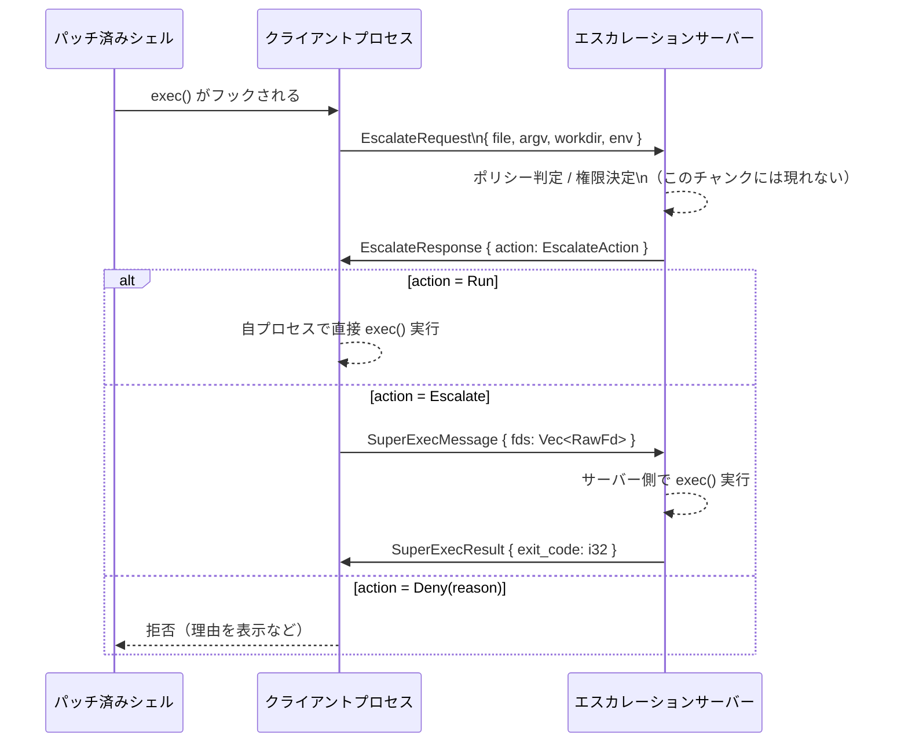

# shell-escalation/src/unix/escalate_protocol.rs

## 0. ざっくり一言

`exec()` 呼び出しの「権限エスカレーション／サンドボックス外実行」を、クライアントとサーバー間でやり取りするための **プロトコル型・定数を定義したモジュール**です（リクエスト/レスポンスと補助メッセージのみを持ち、ロジックはほとんどありません）。  

---

## 1. このモジュールの役割

### 1.1 概要

- このモジュールは、シェルや exec ラッパーが行う **プロセス実行の「どう実行するか」決定を、別プロセス（サーバー）に委譲する**ためのデータ構造を提供します。
- クライアントが送る `EscalateRequest` と、サーバーが返す `EscalateResponse`／`EscalateAction` により、「そのコマンドを直接実行するか」「サンドボックスを外して実行するか」「拒否するか」を表現します（根拠: `EscalateRequest` とコメント `/// The client sends this...`、`EscalateResponse` とコメント、`EscalateAction` とコメント, `escalate_protocol.rs:L16-28,30-34,68-75`）。
- さらに、サーバー側での実行に必要となるオープン FD（ファイルディスクリプタ）や終了コードをやり取りする `SuperExecMessage` / `SuperExecResult` も定義します（根拠: `SuperExecMessage`/`SuperExecResult` コメント, `escalate_protocol.rs:L78-87`）。

### 1.2 アーキテクチャ内での位置づけ

コメントから読み取れる範囲での関係を図示します。

```mermaid
graph TD
    subgraph "クライアント側"
        Shell["パッチ済みシェル\n(exec をフック)"]
        ExecWrapper["exec ラッパー\n(ESCALATE_SOCKET_ENV_VAR使用)"]
        Client["エスカレーションクライアント\n(本モジュール利用)"]
    end

    subgraph "サーバー側"
        Server["エスカレーションサーバー\n(本モジュール利用)"]
    end

    Shell -->|EXEC_WRAPPER_ENV_VAR\n(L13-14)| ExecWrapper
    ExecWrapper -->|ESCALATE_SOCKET_ENV_VAR\n(L10-11)| Client
    Client -->|EscalateRequest\n(L16-28)| Server
    Server -->|EscalateResponse/EscalateAction\n(L30-34,68-75)| Client
    Client -->|SuperExecMessage\n(L78-82)| Server
    Server -->|SuperExecResult\n(L84-87)| Client
    Server -->|"EscalationPermissions\n(from codex_protocol)"| Server
```

- `ESCALATE_SOCKET_ENV_VAR` は「エスカレーション用ソケット FD をどの環境変数から読むか」をエグゼクラッパーに伝える定数です（根拠: コメント `/// Exec wrappers read this...`, `escalate_protocol.rs:L10-11`）。
- `EXEC_WRAPPER_ENV_VAR` は「パッチされたシェルが exec をどのラッパーで包むか」を指定する環境変数名です（根拠: コメント `/// Patched shells use this...`, `escalate_protocol.rs:L13-14`）。
- `EscalationPermissions` は外部クレート `codex_protocol` からの型で、明示的なサンドボックス権限セットを表すものと読み取れますが、詳細はこのチャンクには現れません（根拠: `use codex_protocol::approvals::EscalationPermissions;`, `escalate_protocol.rs:L5`）。

### 1.3 設計上のポイント

- **データキャリア専用**  
  このモジュールはほぼすべてが構造体・列挙体定義で、ビジネスロジックは `EscalationDecision` の 3 つのファクトリメソッドのみです（根拠: `impl EscalationDecision { ... }`, `escalate_protocol.rs:L54-65`）。

- **シリアライズ前提のプロトコル型**  
  ほとんどの型に `Serialize` / `Deserialize` が derive されています。これは、IPC（プロセス間通信）やソケット越しにメッセージとして送受信する前提の設計と解釈できます（根拠: 各 struct/enum の `#[derive(..., Serialize, Deserialize, ...)]`, `escalate_protocol.rs:L17,L31,L44,L68,L79,L85`）。

- **「決定」と「アクション」の分離**  
  - `EscalationDecision` / `EscalationExecution` は内部的な決定内容（どう実行したいか）を表す純 Rust 型。
  - `EscalateAction` は線形なアクション（Run/Escalate/Deny）としてレスポンスで渡すためのシリアライズ可能な列挙体。  
  として、役割が分かれています（根拠: enum 定義とコメント, `escalate_protocol.rs:L36-52,L68-75`）。  
  実際に両者をどう対応付けるかはこのチャンクには現れません。

- **並行性・エラーハンドリングの非関与**  
  このモジュール内にはスレッド、`async`/`await`、`Result`/`Option` ベースの処理ロジックは存在せず、あくまでデータ構造定義に専念しています（根拠: ファイル全体に関数ロジックがほぼ存在しないこと, `escalate_protocol.rs:L1-88`）。

---

## 2. 主要な機能一覧

このモジュールが提供する主要な機能は次のとおりです。

- エスカレーションソケットと exec ラッパーの **環境変数名定数の定義**  
  - `ESCALATE_SOCKET_ENV_VAR`（根拠: `escalate_protocol.rs:L10-11`）  
  - `EXEC_WRAPPER_ENV_VAR`（根拠: `escalate_protocol.rs:L13-14`）
- クライアント → サーバーの **exec リクエストメッセージ** `EscalateRequest`（根拠: `escalate_protocol.rs:L16-28`）
- サーバー → クライアントの **exec レスポンスメッセージ** `EscalateResponse` とアクション列挙 `EscalateAction`（根拠: `escalate_protocol.rs:L30-34,L68-75`）
- 内部的な実行方針を表す **決定オブジェクト** `EscalationDecision` と `EscalationExecution`（根拠: `escalate_protocol.rs:L36-52,54-65`）
- サーバー側 exec に必要な **FD 転送メッセージ** `SuperExecMessage` と **終了コード返却メッセージ** `SuperExecResult`（根拠: `escalate_protocol.rs:L78-87`）

---

## 3. 公開 API と詳細解説

### 3.1 コンポーネント（定数・型）一覧

#### 定数一覧

| 名前 | 種別 | 役割 / 用途 | 定義位置 |
|------|------|-------------|----------|
| `ESCALATE_SOCKET_ENV_VAR` | `&'static str` 定数 | エスカレーション用ソケット FD を継承したラッパーが、それを見つけるための環境変数名（例: `"CODEX_ESCALATE_SOCKET"`）です。exec ラッパーがこれを読み取ります。 | `escalate_protocol.rs:L10-11` |
| `EXEC_WRAPPER_ENV_VAR` | `&'static str` 定数 | パッチ済みシェルが exec を包む際に、どのラッパーバイナリを使うかを示す環境変数名（例: `"EXEC_WRAPPER"`）です。 | `escalate_protocol.rs:L13-14` |

#### 型一覧（構造体・列挙体）

| 名前 | 種別 | 役割 / 用途 | 定義位置 |
|------|------|-------------|----------|
| `EscalateRequest` | 構造体 | クライアントがサーバーに送る「この exec 呼び出しをどう扱うか決めてほしい」というリクエスト。実行ファイルパス、argv、作業ディレクトリ、環境変数を含みます。 | `escalate_protocol.rs:L16-28` |
| `EscalateResponse` | 構造体 | サーバーがクライアントへ返すレスポンス。`EscalateAction` を 1 フィールドとして含みます。 | `escalate_protocol.rs:L30-34` |
| `EscalationDecision` | 列挙体 | 内部ロジック側での決定を表す高レベルな enum。`Run` / `Escalate(EscalationExecution)` / `Deny { reason }` のいずれかです。 | `escalate_protocol.rs:L36-41` |
| `EscalationExecution` | 列挙体 | 実際に「エスカレートする」場合の実行モード。サンドボックス外実行 (`Unsandboxed`)、ターンのデフォルトサンドボックス (`TurnDefault`)、明示的な権限 (`Permissions(EscalationPermissions)`) の 3 種類です。 | `escalate_protocol.rs:L43-52` |
| `EscalateAction` | 列挙体 | ワイヤプロトコル上でクライアントに返すアクション。`Run` / `Escalate` / `Deny { reason }` の 3 パターンです。 | `escalate_protocol.rs:L68-75` |
| `SuperExecMessage` | 構造体 | クライアントがサーバーへ、自身のオープン FD 群（`Vec<RawFd>`）を転送するためのメッセージ。 | `escalate_protocol.rs:L78-82` |
| `SuperExecResult` | 構造体 | サーバーからクライアントへ、exec されたコマンドの終了コード（`exit_code: i32`）を返すメッセージ。 | `escalate_protocol.rs:L84-87` |

#### メソッド一覧

| 関数名 | 所属 | 役割（1 行） | 定義位置 |
|--------|------|--------------|----------|
| `EscalationDecision::run()` | `impl EscalationDecision` | 「そのまま実行する」決定を表す `EscalationDecision::Run` を生成するファクトリメソッドです。 | `escalate_protocol.rs:L54-57` |
| `EscalationDecision::escalate(execution)` | `impl EscalationDecision` | 指定された `EscalationExecution` を伴うエスカレーション決定 `EscalationDecision::Escalate` を生成します。 | `escalate_protocol.rs:L59-61` |
| `EscalationDecision::deny(reason)` | `impl EscalationDecision` | 任意の理由付きで実行を拒否する `EscalationDecision::Deny { reason }` を生成します。 | `escalate_protocol.rs:L63-65` |

---

### 3.2 関数詳細

このモジュールに存在する関数は `EscalationDecision` の 3 つの関連メソッドのみです。

#### `EscalationDecision::run() -> EscalationDecision`

**概要**

- 「エスカレーションせず、そのまま実行する」という決定を表す `EscalationDecision::Run` を生成します（根拠: `Self::Run` を返している, `escalate_protocol.rs:L54-57`）。

**引数**

- なし

**戻り値**

- `EscalationDecision`  
  - 具体的には `EscalationDecision::Run` バリアントです。

**内部処理の流れ**

1. 何も検査や計算を行わずに、`EscalationDecision::Run` をそのまま返します（根拠: `Self::Run`, `escalate_protocol.rs:L55-56`）。

**Examples（使用例）**

```rust
use shell_escalation::unix::escalate_protocol::EscalationDecision;

// フックした exec 呼び出しを、そのままクライアント側で実行する決定を作る
let decision = EscalationDecision::run(); // Run バリアントを生成

match decision {
    EscalationDecision::Run => {
        // ここで実際の exec() を行うなどの処理を書く
    }
    _ => unreachable!("run() からは Run 以外は返りません"),
}
```

**Errors / Panics**

- エラーや panic を発生させるコードは含まれていません（根拠: 戻り値が `Self` であり、内部で panic を呼んでいない, `escalate_protocol.rs:L54-57`）。

**Edge cases（エッジケース）**

- 引数がないため、入力に関するエッジケースはありません。
- この関数が返した値をどのように解釈するかは、呼び出し側のロジックに依存します（このチャンクには現れません）。

**使用上の注意点**

- 戻り値が `Run` 固定であるため、呼び出し元で追加の条件判定を行いたい場合は、このメソッドではなく呼び出し元のロジックで分岐する必要があります。

---

#### `EscalationDecision::escalate(execution: EscalationExecution) -> EscalationDecision`

**概要**

- 指定された実行モード `EscalationExecution` に基づき、「サーバー側でエスカレーション実行する」という決定を生成します（根拠: `Self::Escalate(execution)`, `escalate_protocol.rs:L59-61`）。

**引数**

| 引数名 | 型 | 説明 |
|--------|----|------|
| `execution` | `EscalationExecution` | どのような形でエスカレーション実行するか（Unsandboxed / TurnDefault / Permissions）を表します。 |

**戻り値**

- `EscalationDecision`  
  - 具体的には `EscalationDecision::Escalate(execution)` バリアントです。

**内部処理の流れ**

1. 渡された `execution` をそのまま `EscalationDecision::Escalate(execution)` に包んで返します（根拠: `Self::Escalate(execution)`, `escalate_protocol.rs:L59-61`）。

**Examples（使用例）**

```rust
use shell_escalation::unix::escalate_protocol::{
    EscalationDecision, EscalationExecution,
};
use codex_protocol::approvals::EscalationPermissions;

// 例: 明示的な権限セットで実行したい場合
let permissions = EscalationPermissions { /* フィールドはこのチャンクでは不明 */ };
let exec_mode = EscalationExecution::Permissions(permissions);  // 明示的な権限指定
let decision = EscalationDecision::escalate(exec_mode);         // Escalate バリアントを生成

match decision {
    EscalationDecision::Escalate(mode) => {
        // mode に応じてサーバー側で実行する処理を書く
    }
    _ => unreachable!("escalate() からは Escalate 以外は返りません"),
}
```

**Errors / Panics**

- メソッド自体にはエラー処理や panic はありません。
- `EscalationExecution::Permissions` で渡す `EscalationPermissions` の妥当性チェックは、別のモジュールで行われると推測されますが、このチャンクには現れません。

**Edge cases（エッジケース）**

- `execution` にどのバリアントを渡しても、そのまま `Escalate` に包まれるだけです。
- 実際に `Unsandboxed` を許可するかどうかなどのポリシーチェックは、このモジュールには存在しません。

**使用上の注意点**

- セキュリティ上、`Unsandboxed` や強い権限の `Permissions` を選ぶロジックには注意が必要です。ただし、その判断はこのモジュールではなく、呼び出し側の責任になります。
- 並行性に関する制約は特にありませんが、`EscalationPermissions` がどの程度重い構造かはこのチャンクからは分かりません。

---

#### `EscalationDecision::deny(reason: Option<String>) -> EscalationDecision`

**概要**

- 任意の理由（文字列）を添えて、「この exec 呼び出しを拒否する」決定を生成します（根拠: `Self::Deny { reason }`, `escalate_protocol.rs:L63-65`）。

**引数**

| 引数名 | 型 | 説明 |
|--------|----|------|
| `reason` | `Option<String>` | 拒否理由。`Some(msg)` の場合は具体的なメッセージ、`None` の場合は理由なし（または一般的なエラー）の拒否を表します。 |

**戻り値**

- `EscalationDecision`  
  - 具体的には `EscalationDecision::Deny { reason }` バリアントです。

**内部処理の流れ**

1. 引数 `reason` をそのまま `EscalationDecision::Deny { reason }` に格納して返します（根拠: `Self::Deny { reason }`, `escalate_protocol.rs:L63-65`）。

**Examples（使用例）**

```rust
use shell_escalation::unix::escalate_protocol::EscalationDecision;

// ポリシー違反により実行を拒否する
let decision = EscalationDecision::deny(Some(
    "このコマンドはポリシーにより禁止されています".to_string(),
));

match decision {
    EscalationDecision::Deny { reason } => {
        // reason をログに残したり、ユーザーに表示したりする
        eprintln!("拒否理由: {:?}", reason);
    }
    _ => unreachable!("deny() からは Deny 以外は返りません"),
}
```

**Errors / Panics**

- メソッド自体にはエラーや panic はありません。

**Edge cases（エッジケース）**

- `reason = None` とした場合、拒否理由が空になります。呼び出し側でユーザー向けメッセージにフォールバックするなどの扱いが必要になる可能性があります。
- 非 UTF-8 の情報をそのまま伝えたい場合などは `String` では表現できないため、別の経路でログを出す必要があります。

**使用上の注意点**

- `reason` にユーザー入力をそのまま含める場合は、後段でどのように表示／記録するかに応じてエスケープ処理が必要になる可能性があります（例えばシェル出力時の制御文字など）。
- このモジュールは単に文字列を保持するだけであり、サニタイズは行いません。

---

### 3.3 その他の関数

- このファイルには、上記 3 つ以外の関数やメソッドは定義されていません（根拠: `impl` ブロックが `EscalationDecision` のみであり、他の型にメソッドがない, `escalate_protocol.rs:L54-65`）。

---

## 4. データフロー

ここでは、コメントから読み取れる範囲での典型的なデータフローを示します。  
対象となるのは `EscalateRequest` / `EscalateResponse` / `EscalateAction` / `SuperExecMessage` / `SuperExecResult` です（根拠: 各コメント, `escalate_protocol.rs:L16-28,30-34,68-75,78-87`）。



要点:

- クライアントは exec 呼び出しの情報（実行ファイルパス、argv、カレントディレクトリ、環境変数）を `EscalateRequest` としてサーバーに送ります（根拠: コメント `/// The client sends this...`, フィールド内容, `escalate_protocol.rs:L16-28`）。
- サーバーは内部ロジック（このファイルには定義されていません）で `EscalationDecision` 等を用いて判断し、その結果を `EscalateAction` に変換して `EscalateResponse` で返すと考えられます（根拠: `EscalationDecision` / `EscalateAction` の定義, `escalate_protocol.rs:L36-41,L68-75`）。
- 実際にサーバー側で exec する場合、クライアントのオープン FD を `SuperExecMessage` で転送し、実行完了後に `SuperExecResult` で `exit_code` を返します（根拠: 各コメント, `escalate_protocol.rs:L78-87`）。

---

## 5. 使い方（How to Use）

### 5.1 基本的な使用方法

以下は、クライアント側で exec 呼び出しをフックし、サーバーに問い合わせる流れの簡略例です。  
実際の通信やエラーハンドリングは、このチャンクには現れないため疑似コード的なものになります。

```rust
use std::collections::HashMap;
use std::path::PathBuf;

use codex_utils_absolute_path::AbsolutePathBuf;
use shell_escalation::unix::escalate_protocol::{
    EscalateRequest, EscalateResponse, EscalateAction,
    SuperExecMessage, SuperExecResult,
};

// 1. フックされた exec 呼び出し情報から EscalateRequest を構築する
let file = PathBuf::from("/usr/bin/ls"); // 実行ファイルパス
let argv = vec!["ls".to_string(), "-l".to_string()]; // argv[0] を含む引数リスト
let workdir = AbsolutePathBuf::try_from("/home/user").unwrap(); // カレントディレクトリ（絶対パス）
let mut env = HashMap::new(); // 環境変数
env.insert("PATH".to_string(), "/usr/bin".to_string());

let request = EscalateRequest {
    file,
    argv,
    workdir,
    env,
}; // これをシリアライズしてサーバーへ送る

// 2. （ここでソケット経由などで EscalateRequest をサーバーに送信し、EscalateResponse を受信する）
// let response: EscalateResponse = send_and_receive(request)?;

let response: EscalateResponse = unimplemented!(); // 実際の I/O はこのチャンクには現れない

match response.action {
    EscalateAction::Run => {
        // クライアント側で exec() をそのまま実行する
    }
    EscalateAction::Escalate => {
        // サーバーに FD を転送して実行してもらう
        let fds: Vec<std::os::fd::RawFd> = vec![]; // 実際はプロセスのオープン FD を列挙
        let msg = SuperExecMessage { fds };

        // msg をサーバーに送り、SuperExecResult を受け取る
        let result: SuperExecResult = unimplemented!();

        let exit_code = result.exit_code;
        // exit_code をクライアント側の終了ステータスとして扱う
    }
    EscalateAction::Deny { reason } => {
        eprintln!("コマンドは拒否されました: {:?}", reason);
        // 適切なエラーコードで終了するなど
    }
}
```

### 5.2 よくある使用パターン

1. **純粋なポリシー判定モジュールとしての利用**

   サーバー側では、`EscalateRequest` を受け取り、内部ロジックで `EscalationDecision` を作って、それを `EscalateAction` に変換するパターンが想定されます。

   ```rust
   use shell_escalation::unix::escalate_protocol::{
       EscalateRequest, EscalationDecision, EscalationExecution, EscalateAction,
   };

   fn decide_action(req: &EscalateRequest) -> EscalateAction {
       // ここでは単純にファイルパスで判断する例（実際のポリシーはこのチャンクには現れない）
       let decision = if req.file == std::path::PathBuf::from("/usr/bin/id") {
           EscalationDecision::escalate(EscalationExecution::Unsandboxed)
       } else {
           EscalationDecision::run()
       };

       match decision {
           EscalationDecision::Run => EscalateAction::Run,
           EscalationDecision::Escalate(_) => EscalateAction::Escalate,
           EscalationDecision::Deny { reason } => EscalateAction::Deny { reason },
       }
   }
   ```

2. **理由付き拒否**

   ポリシーに反するコマンドに対して、ユーザー向けのメッセージを付与して拒否するケースです。

   ```rust
   use shell_escalation::unix::escalate_protocol::{
       EscalationDecision, EscalateAction,
   };

   fn deny_with_reason(msg: &str) -> EscalateAction {
       let decision = EscalationDecision::deny(Some(msg.to_string()));
       if let EscalationDecision::Deny { reason } = decision {
           EscalateAction::Deny { reason }
       } else {
           unreachable!()
       }
   }
   ```

### 5.3 よくある間違い（起こりうる誤用例）

このチャンクから推測できる、起こりやすそうな誤用と正しい例を示します。

```rust
use shell_escalation::unix::escalate_protocol::EscalateAction;

// 誤り例: EscalateAction::Deny なのに理由を必須と想定している
fn handle_action_wrong(action: EscalateAction) {
    match action {
        EscalateAction::Deny { reason } => {
            // reason が None の場合を考慮していない
            println!("拒否理由: {}", reason.unwrap()); // None だと panic する可能性
        }
        _ => {}
    }
}

// 正しい例: reason が None の場合を考慮する
fn handle_action_correct(action: EscalateAction) {
    match action {
        EscalateAction::Deny { reason } => {
            match reason {
                Some(msg) => println!("拒否理由: {}", msg),
                None => println!("拒否されました（理由は提供されていません）"),
            }
        }
        EscalateAction::Run => {
            println!("そのまま実行します");
        }
        EscalateAction::Escalate => {
            println!("サーバー側で実行します");
        }
    }
}
```

### 5.4 使用上の注意点（まとめ）

- **入力の信頼性**  
  - `EscalateRequest` の `file` / `argv` / `env` は、ユーザーまたはシェルから来る可能性のある値です。サーバー側で実行前に適切な検証・フィルターを行う必要があります（この検証はこのモジュールには含まれていません）。
- **拒否理由の扱い**  
  - `EscalateAction::Deny { reason: Option<String> }` は理由なし拒否も表現可能です。UI やログで `None` を想定した処理が必要です。
- **FD 転送の安全性**  
  - `SuperExecMessage` の `fds: Vec<RawFd>` は、整数値としての FD をそのまま渡すだけです。不正な FD 番号や既にクローズされた FD が含まれないように、呼び出し側で管理する必要があります（根拠: フィールドにバリデーションロジックがない, `escalate_protocol.rs:L80-81`）。
- **並行性**  
  - このモジュール単体ではスレッドや async を扱いませんが、`Clone` が derive されている型が多いため、複数スレッド間でコピーして利用することは容易です（Send/Sync の有無はこのチャンクからは明示されていません）。
- **エラー処理**  
  - ここで定義される型には `Result`/`Error` は含まれません。実際の I/O エラーやシリアライズエラーは、呼び出し側の層で `Result` などにより扱う設計になります。

---

## 6. 変更の仕方（How to Modify）

### 6.1 新しい機能を追加する場合

例: `EscalateAction` に新しいアクション（例: `AuditOnly`）を追加したい場合を想定します。

1. **列挙体定義の追加**
   - `EscalateAction` に新しいバリアントを追加します（根拠: 現行定義, `escalate_protocol.rs:L68-75`）。
   - 同様に、内部決定用の `EscalationDecision` / `EscalationExecution` にも対応するバリアントを追加するかどうかを検討します。

2. **シリアライズ互換性の確認**
   - `Serialize` / `Deserialize` を derive しているため、新しいバリアントの追加は既存クライアントとの互換性に影響します。  
     - バージョニングやプロトコルの後方互換性ポリシーは、このチャンクには現れません。

3. **マッピングロジックの更新**
   - サーバー側の「内部決定 → `EscalateAction`」への変換ロジック（このファイル外）も併せて更新する必要があります。

4. **テスト**
   - このファイルにはテストコードは存在しないため（根拠: `mod tests` 等がない, `escalate_protocol.rs:L1-88`）、プロトコルのシリアライズ／デシリアライズのためのユニットテストを別ファイルに追加することが考えられます。

### 6.2 既存の機能を変更する場合

- **エンコード形式の変更**
  - `serde` に依存しているため、フィールド名の変更や型の変更は、シリアライズフォーマットの互換性に影響します。
  - 変更前に、どのコンポーネント（クライアント／サーバー／外部ツール）がこの型を読んでいるかを検索して影響範囲を確認します。

- **契約（前提条件・意味）の維持**
  - `EscalateRequest` のフィールド:
    - `file` が相対パスの場合、「`workdir` から解決する」というコメントがあります（根拠: コメント, `escalate_protocol.rs:L19-23`）。  
      これを破る変更を行うと、呼び出し側の前提が崩れる可能性があります。
  - `EscalateAction` の意味:
    - `Run` / `Escalate` / `Deny` の 3 分類は、クライアント側の制御フローに直接影響するため、意味付けの変更には注意が必要です。

- **テスト・使用箇所の再確認**
  - 型定義が変わった場合は、シリアライズ／デシリアライズを行っている全てのコードパスのテストを更新する必要があります。
  - 特に、バージョン違いのクライアント／サーバー間での通信が想定される場合は、互換性テストが重要です。

---

## 7. 関連ファイル

このモジュールに直接現れる依存関係や関連コンポーネントは以下のとおりです。

| パス / クレート | 役割 / 関係 |
|-----------------|------------|
| `codex_protocol::approvals::EscalationPermissions` | `EscalationExecution::Permissions` のフィールド型として使用される権限セット。実際のフィールドや意味はこのチャンクには現れませんが、サンドボックス構成や権限構成を表すものと解釈できます（根拠: `use codex_protocol::approvals::EscalationPermissions;`, `escalate_protocol.rs:L5`）。 |
| `codex_utils_absolute_path::AbsolutePathBuf` | `EscalateRequest::workdir` の型。絶対パスであることを保証するためのラッパーと解釈できます（詳細はこのチャンクには現れません, 根拠: `use ... AbsolutePathBuf;`, `escalate_protocol.rs:L6`）。 |
| `std::os::fd::RawFd` | `SuperExecMessage::fds` の要素型。UNIX のファイルディスクリプタを表す整数型です（根拠: `use std::os::fd::RawFd;` と `fds: Vec<RawFd>`, `escalate_protocol.rs:L2,L80-81`）。 |
| `serde::{Serialize, Deserialize}` | すべてのメッセージ型をシリアライズ／デシリアライズ可能にするために derive されています（根拠: `use serde::...` と各 derive, `escalate_protocol.rs:L7-8,L17,L31,L44,L68,L79,L85`）。 |

---

### Bugs / Security / Edge Cases / 性能・スケーラビリティ（補足）

- **Bugs（このチャンクから判別できる範囲）**
  - 明らかなロジックバグや unsafe ブロックは存在しません（根拠: ファイル全体, `escalate_protocol.rs:L1-88`）。
  - 実際のバグは、この型を使う周辺コード次第になるため、このチャンクだけでは判断できません。

- **Security**
  - `Unsandboxed` 実行や強い `Permissions` を扱うため、呼び出し側がこれらのバリアントをどう許可するかが重要です。このモジュールは単に表現するだけで、検査は行いません。
  - `env: HashMap<String, String>` や拒否理由 `String` に含まれる文字列は未サニタイズであり、表示先やログ先によってはインジェクションや情報漏洩のリスクがあります。サニタイズは呼び出し側の責任になります。

- **Tests**
  - このファイルにはテストコードは含まれていません（根拠: `#[cfg(test)]` や `mod tests` が存在しない, `escalate_protocol.rs:L1-88`）。

- **Performance / Scalability**
  - メッセージサイズは主に `argv`, `env`, `fds` のサイズに依存します。
  - `Serialize` / `Deserialize` のコストはシリアライザ（JSON, bincode など）次第ですが、このモジュールではフォーマットは指定していません。
  - 並行接続数の増加に対するスケーラビリティは、サーバーの実装側の課題であり、このデータ定義自体は軽量です。
