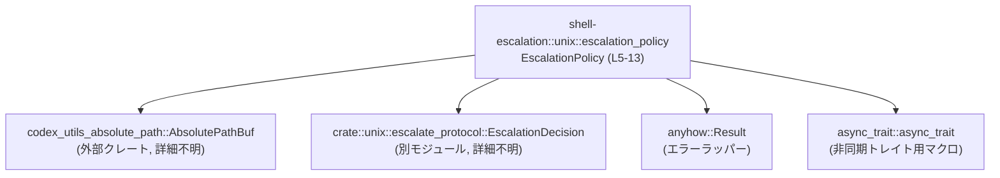
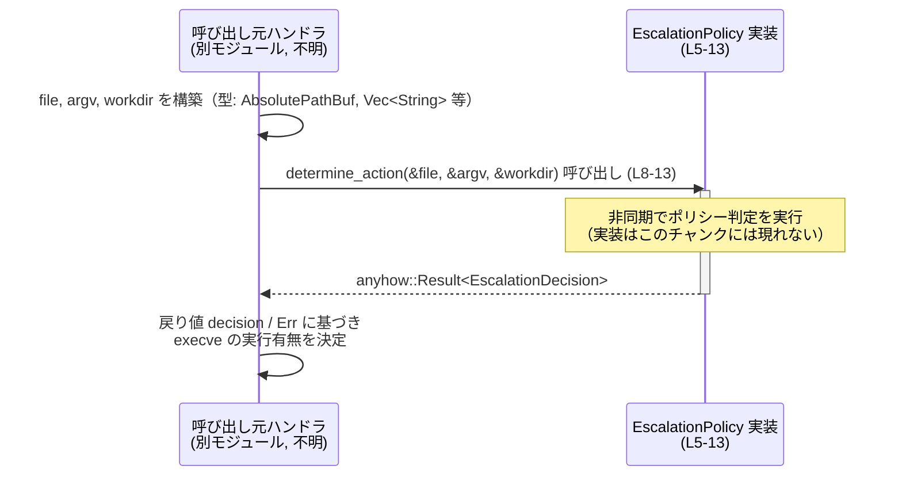

# shell-escalation/src/unix/escalation_policy.rs コード解説

## 0. ざっくり一言

`EscalationPolicy` トレイトを定義し、クライアントからの `execve` リクエストに対して「どのようなエスカレーション動作を取るか」を非同期に決定するためのインターフェースを提供するファイルです（`escalation_policy.rs:L5-13`）。

---

## 1. このモジュールの役割

### 1.1 概要

- このモジュールは、Unix 環境における特権昇格（escalation）処理の「ポリシー」を抽象化するために存在します（`escalation_policy.rs:L5-7`）。
- クライアントからの `execve` 要求に対し、実行ファイルパス・引数・作業ディレクトリを基に、どのような `EscalationDecision` を返すかを決定する非同期メソッドを定義します（`escalation_policy.rs:L5-13`）。

### 1.2 アーキテクチャ内での位置づけ

このモジュールは、以下のコンポーネントと関係します。

- 入力パラメータの型として `AbsolutePathBuf`（外部クレート `codex_utils_absolute_path`）を利用します（`escalation_policy.rs:L1,L10,L12`）。
- 戻り値として `crate::unix::escalate_protocol::EscalationDecision` を利用します（`escalation_policy.rs:L3,L13`）。
- エラー表現として汎用エラー型 `anyhow::Result` を使用します（`escalation_policy.rs:L13`）。
- 非同期トレイトメソッドを使うために `async_trait::async_trait` マクロを適用しています（`escalation_policy.rs:L6`）。

これらの関係を簡略図にすると、次のようになります。



※ `EscalationPolicy` をどのモジュールが「呼び出すか」は、このチャンクには現れないため不明です。

### 1.3 設計上のポイント

- **ポリシーの抽象化**  
  - 実際のエスカレーションロジックは `EscalationPolicy` トレイトの実装側に委ねられており、このモジュールはインターフェースのみを定義します（`escalation_policy.rs:L7-13`）。
- **非同期処理前提**  
  - `determine_action` は `async fn` として定義されており、I/O や他プロセスとの通信など非同期処理を含む実装を想定したインターフェースになっています（`escalation_policy.rs:L8-13`）。
- **スレッドセーフな利用**  
  - トレイトは `Send + Sync` を継承しており（`escalation_policy.rs:L7`）、実装型はスレッド間で安全に送受信・共有できることが要求されます。これは、ポリシーが複数スレッドから同時に呼び出されることを前提とした設計と解釈できます。
- **借用による入力受け渡し**  
  - 引数はすべて参照（`&AbsolutePathBuf`, `&[String]`）で受け取るため、呼び出し側の所有する値を借用して判定を行う設計になっています（`escalation_policy.rs:L9-12`）。
- **エラー型の抽象化**  
  - `anyhow::Result` を使うことで、具体的なエラー型を固定せず、実装ごとに柔軟にエラー情報を持たせられるようになっています（`escalation_policy.rs:L13`）。

---

## 2. 主要な機能一覧（コンポーネントインベントリー）

このファイルで定義される主なコンポーネントと、その役割です。

| 名前 | 種別 | 概要 | 定義位置 |
|------|------|------|----------|
| `EscalationPolicy` | トレイト | `execve` リクエストに対して、どのようなエスカレーション動作 (`EscalationDecision`) を取るかを非同期に決定するポリシーインターフェース | `escalation_policy.rs:L5-13` |
| `determine_action` | トレイトメソッド（非同期） | 実行ファイルパス・引数配列・作業ディレクトリを入力として受け取り、エスカレーションの決定とエラーを `anyhow::Result<EscalationDecision>` で返す | `escalation_policy.rs:L8-13` |

このファイル内では、構造体や列挙体などの具体型は定義されていません。

**関連する外部定義（このファイルで利用されるが定義されていないもの）**

| 名前 | 種別 | 役割 / 関係 | 参照位置 |
|------|------|------------|----------|
| `codex_utils_absolute_path::AbsolutePathBuf` | 構造体（推定） | 絶対パスを表すパス型。`file` と `workdir` の型として使用されるが、詳細な仕様はこのチャンクには現れません。 | `escalation_policy.rs:L1,L10,L12` |
| `crate::unix::escalate_protocol::EscalationDecision` | 型（おそらく列挙体） | エスカレーションの決定内容を表す戻り値型。詳細なバリアントや意味はこのチャンクには現れません。 | `escalation_policy.rs:L3,L13` |

---

## 3. 公開 API と詳細解説

### 3.1 型一覧（トレイト）

| 名前 | 種別 | 役割 / 用途 | 定義位置 |
|------|------|-------------|----------|
| `EscalationPolicy` | トレイト | `execve` リクエストに応じて、どのようなエスカレーション動作をとるかを決定するための非同期インターフェース。複数の実装を差し替え可能にするための抽象レイヤです。 | `escalation_policy.rs:L5-13` |

特記事項:

- `Send + Sync` を継承しており、`EscalationPolicy` を実装した型はスレッド間で安全に送受信・共有できる必要があります（`escalation_policy.rs:L7`）。
- `#[async_trait::async_trait]` 属性が付与されており、トレイトメソッドで `async fn` を利用できるようにしています（`escalation_policy.rs:L6-8`）。  
  - `async_trait` クレートの具体的な展開内容はこのチャンクには現れませんが、一般的にはトレイト内の `async fn` を利用可能にするためのマクロです。

### 3.2 関数詳細

#### `determine_action(&self, file: &AbsolutePathBuf, argv: &[String], workdir: &AbsolutePathBuf) -> anyhow::Result<EscalationDecision>`

**概要**

- クライアントから受けた `execve` リクエストに対し、非同期にエスカレーション動作 (`EscalationDecision`) を決定するメソッドです（`escalation_policy.rs:L5,L8-13`）。
- 実際の判定ロジックは、このトレイトを実装する型により提供されます。このファイルには実装は含まれていません（`escalation_policy.rs:L7-13`）。

**引数**

| 引数名 | 型 | 説明 | 根拠 |
|--------|----|------|------|
| `&self` | `&Self` | ポリシー実装インスタンスへの共有参照です。トレイトメソッドとして暗黙に定義されています。 | `escalation_policy.rs:L8-9` |
| `file` | `&AbsolutePathBuf` | `execve` しようとしている対象ファイルの絶対パスを表すと考えられるパラメータです。型と名前からその用途が推測されます。 | `escalation_policy.rs:L10` |
| `argv` | `&[String]` | `execve` に渡される引数リスト（argv）を表すスライスと考えられるパラメータです。型と名前から推測されます。 | `escalation_policy.rs:L11` |
| `workdir` | `&AbsolutePathBuf` | 実行時のカレントディレクトリ（作業ディレクトリ）を表すと考えられるパラメータです。型と名前から推測されます。 | `escalation_policy.rs:L12` |

※ `file` / `argv` / `workdir` の意味はコード中に明示的なコメントはありませんが、命名と `execve` という文脈（トレイトのドキュコメント）からこのように解釈できます（`escalation_policy.rs:L5,L10-12`）。

**戻り値**

- 型: `anyhow::Result<EscalationDecision>`（`escalation_policy.rs:L13`）
  - `Ok(EscalationDecision)`  
    エスカレーションの決定が正常に行われた場合の結果です。`EscalationDecision` の具体的な内容は別モジュールの定義に依存し、このチャンクからは分かりません（`escalation_policy.rs:L3,L13`）。
  - `Err(anyhow::Error)`  
    判定中に発生したエラーを表します。どのようなエラーが返るか、どの条件で `Err` になるかは、トレイトの契約としては明示されていません。

**内部処理の流れ（アルゴリズム）**

- このメソッドはトレイトメソッド宣言のみであり、実装は含まれていません（`escalation_policy.rs:L8-13`）。
- そのため、具体的なアルゴリズム（ファイルの検査、メタデータの取得、ポリシールールの評価など）がどのように行われるかは、このチャンクだけからは分かりません。
- 実際の処理内容は `EscalationPolicy` を実装した型の `impl` ブロック側に記述されます（このファイルには現れません）。

**Examples（使用例）**

このファイルには実装例は含まれていませんが、典型的な利用イメージとして、以下のようなコードが考えられます。

```rust
use codex_utils_absolute_path::AbsolutePathBuf;                   // パス型をインポート
use shell_escalation::unix::escalation_policy::EscalationPolicy;  // トレイトをインポート
use shell_escalation::unix::escalate_protocol::EscalationDecision;// 戻り値型（定義は別モジュール）

// 仮のポリシー実装（中身はダミー）
// 実際の EscalationDecision の内容はこのチャンクからは分からないため、
// ここでは具体的な分岐は記述しません。
struct SimplePolicy;

// async_trait の使い方や impl 側の詳細は、このファイルからは分かりません。
// 以下は「こういう形で実装されうる」というイメージ例です。
#[async_trait::async_trait]
impl EscalationPolicy for SimplePolicy {
    async fn determine_action(
        &self,
        file: &AbsolutePathBuf,
        argv: &[String],
        workdir: &AbsolutePathBuf,
    ) -> anyhow::Result<EscalationDecision> {
        // ここで file / argv / workdir に基づいてポリシー判断を行う
        // 具体的な EscalationDecision の生成方法は不明なため、todo!() で代用
        todo!("具体的な EscalationDecision の生成は別モジュールの定義に依存します");
    }
}

// トレイトを利用する側の例
async fn handle_execve_request(
    policy: &dyn EscalationPolicy,               // ポリシーをトレイトオブジェクトとして受け取る
    file: &AbsolutePathBuf,                      // 実行ファイルの絶対パス
    argv: &[String],                             // 引数リスト
    workdir: &AbsolutePathBuf,                   // 作業ディレクトリ
) -> anyhow::Result<()> {
    // 非同期にポリシー判定を行い、Result を扱う
    let decision = policy
        .determine_action(file, argv, workdir)   // Future を取得
        .await?;                                 // 非同期に待ち、エラーならここで ? で伝播

    // decision を用いて、後続のエスカレーション処理を行う（詳細は別モジュール）
    // ...

    Ok(())
}
```

**Errors / Panics**

- `Errors`  
  - `anyhow::Result` を返すため、実装側はあらゆる種類のエラーを `anyhow::Error` としてラップして返せます（`escalation_policy.rs:L13`）。
  - どのような条件で `Err` を返すべきか、またどのエラー型を使うかについては、このトレイトでは規定されていません。  
    そのため、「判定不能な状況で `Err` を返すのか」「安全側に倒して特定の `EscalationDecision`（例: 拒否）を返すのか」といったポリシーは、実装とそのドキュメント側で明確にする必要があります。
- `Panics`  
  - この宣言からは `panic!` が発生するかどうかは分かりません。  
  - 一般的にはポリシー判定は外部からの入力に依存することが多いため、実装時には `panic!` よりも `Err` でのエラー報告を優先するのが安全と考えられますが、これは設計上の推奨であり、このトレイト自体の契約として明示されてはいません。

**Edge cases（エッジケース）**

このメソッド自体は宣言のみであり、実装に依存しますが、実装者が考慮すべき代表的なエッジケースとして次のようなものがあります。

- `file` が存在しない、または実行権限がないパスである場合  
  - どのような `EscalationDecision` または `Err` を返すかは、このトレイトからは分かりません。
- `argv` が空スライスの場合（`&[]`）  
  - `execve` としては許容されるかもしれませんが、ポリシー上どう扱うかは実装依存です。
- `workdir` が存在しないディレクトリを指している場合  
  - パス検証や補正を行うかどうかは、このトレイトからは読み取れません。
- I/O エラーや設定ファイル不備など、内部処理でエラーが起きた場合  
  - `Err` を返す／安全側に倒して拒否するなどの扱いは、実装ごとに決める必要があります。

**使用上の注意点**

- **非同期コンテキストでの利用**  
  - `async fn` であるため、呼び出し側は `.await` できる非同期コンテキスト（`async fn` 内や非同期ランタイム上）で使用する必要があります（`escalation_policy.rs:L8`）。
- **ライフタイムと借用**  
  - `file`, `argv`, `workdir` は参照で渡されるため、`determine_action` の Future が有効な間は、これらの値が生存している必要があります（コンパイラの借用チェックにより、通常は自動的に保証されます）（`escalation_policy.rs:L9-12`）。
- **並行実行**  
  - トレイト境界に `Send + Sync` があるため、`EscalationPolicy` 実装は複数スレッドから同時に `determine_action` が呼ばれる可能性を前提に設計する必要があります（`escalation_policy.rs:L7`）。  
    - 共有状態を持つ場合は適切な同期手段（ミューテックスなど）を利用するか、内部状態を不変に保つ必要があります。
- **エラーとセキュリティ方針**  
  - エラー時に「許可」側に倒れるとセキュリティ上のリスクにつながる可能性があります。  
    このトレイトはその点を規定していないため、実装または上位レイヤの設計として、「エラー時はデフォルト拒否」のようなポリシーを明示することが望ましいです。

### 3.3 その他の関数

- このファイルには、補助的な関数やラッパー関数は定義されていません（`escalation_policy.rs:L1-14` を確認してもトレイト以外の関数定義は存在しません）。

---

## 4. データフロー

このファイル単体では呼び出し元や後続処理は定義されていませんが、`determine_action` を中心とした代表的なデータフローは次のように整理できます。

1. 別モジュールの「execve リクエストハンドラ」が、実行ファイルパス・引数・作業ディレクトリを計算し、`AbsolutePathBuf` と `Vec<String>` 等として保持する（呼び出し元側、コード不明）。
2. そのハンドラが、保持している `EscalationPolicy` 実装（例: `Arc<dyn EscalationPolicy>`）に対して `determine_action` を呼び出す（`escalation_policy.rs:L8-13`）。
3. `EscalationPolicy` 実装は非同期に処理を行い、`anyhow::Result<EscalationDecision>` を返す。
4. 呼び出し元は `EscalationDecision` の内容に基づき、実際に `execve` を実行するか否か、あるいは別のエスカレーション手順に進むかを決定する（呼び出し元側、コード不明）。

これをシーケンス図で表現すると次のようになります。



※ ハンドラ側・後続処理側の実装はこのチャンクには存在しないため、役割名のみを示した抽象的な図になっています。

---

## 5. 使い方（How to Use）

### 5.1 基本的な使用方法

このトレイトの典型的な利用パターンは「ポリシー実装を用意し、それを依存として注入して使う」形です。以下はその最小限のイメージ例です。

```rust
use std::sync::Arc;
use codex_utils_absolute_path::AbsolutePathBuf;                      // パス型
use shell_escalation::unix::escalation_policy::EscalationPolicy;     // トレイト
use shell_escalation::unix::escalate_protocol::EscalationDecision;   // 戻り値型

struct MyPolicy;                                                      // ポリシーの具体実装

#[async_trait::async_trait]
impl EscalationPolicy for MyPolicy {
    async fn determine_action(
        &self,
        file: &AbsolutePathBuf,
        argv: &[String],
        workdir: &AbsolutePathBuf,
    ) -> anyhow::Result<EscalationDecision> {
        // ここにポリシーロジックを実装する
        // EscalationDecision の具体的な生成方法は別モジュールの定義に依存する
        todo!()
    }
}

async fn run_example() -> anyhow::Result<()> {
    // ポリシー実装を用意（Arc で共有可能にするのが典型的なパターン）
    let policy: Arc<dyn EscalationPolicy> = Arc::new(MyPolicy);

    // 実行対象パス・引数・作業ディレクトリを用意（値の作り方は別途）
    let file: AbsolutePathBuf = /* ... */ todo!();
    let argv: Vec<String> = vec!["/bin/true".to_string()];
    let workdir: AbsolutePathBuf = /* ... */ todo!();

    // ポリシー判定を非同期に実行
    let decision = policy
        .determine_action(&file, &argv, &workdir)   // 値を参照で渡す
        .await?;                                    // エラーを ? で伝播

    // decision に基づいて後続処理
    // ...

    Ok(())
}
```

この例から分かるポイント:

- `EscalationPolicy` はトレイトオブジェクトとして `Arc<dyn EscalationPolicy>` で保持し、複数箇所から共有することが想定しやすい設計です（`Send + Sync` 制約があるため、スレッド間共有も可能）（`escalation_policy.rs:L7-8`）。
- 引数は借用で渡すため、大きなデータ構造をコピーせずに済みます（`escalation_policy.rs:L9-12`）。
- エラー処理は `anyhow::Result` と `?` 演算子で簡潔に行えます（`escalation_policy.rs:L13`）。

### 5.2 よくある使用パターン

1. **グローバル（またはアプリケーション単位）のポリシーとして共有する**

   - アプリケーション起動時に 1 つの `EscalationPolicy` 実装を構築し、`Arc<dyn EscalationPolicy>` としてサーバ全体で共有する。
   - 各 `execve` リクエスト処理タスクから、その `Arc` をクローンして `determine_action` を呼び出す。

2. **テスト用／モック用ポリシーを差し替える**

   - 実運用用とは別に、テスト用に「常に許可する」「常に拒否する」などのシンプルなポリシー実装を用意し、テストコードからはそれを注入する、という使い方がしやすいインターフェースです。  
     （このファイルにはテストコードは含まれておらず、実際にそのようなテストがあるかどうかは不明です。）

3. **設定に基づく複合ポリシー**

   - このトレイトはメソッドが 1 つだけのシンプルなインターフェースなので、「設定ファイルを読み込むポリシー」「外部サービスに問い合わせるポリシー」などを `EscalationPolicy` の実装として切り替える構成が考えられます。  
     具体的な構成や実装はこのチャンクには現れません。

### 5.3 よくある間違い

このファイルから直接読み取れる範囲、および Rust の一般的な非同期/トレイトの使い方から、起こりやすそうな誤用例と正しい例を示します。

```rust
// 誤り例: 非同期コンテキスト外で .await しようとする
fn wrong_usage(policy: &dyn EscalationPolicy, file: &AbsolutePathBuf, argv: &[String], workdir: &AbsolutePathBuf) {
    // コンパイルエラー: async fn から返る Future に対して .await は async コンテキスト内でしか呼べない
    // let decision = policy.determine_action(file, argv, workdir).await;
}

// 正しい例: async fn 内で .await する
async fn correct_usage(policy: &dyn EscalationPolicy, file: &AbsolutePathBuf, argv: &[String], workdir: &AbsolutePathBuf) -> anyhow::Result<()> {
    let decision = policy
        .determine_action(file, argv, workdir)   // Future を取得
        .await?;                                 // 非同期に待ち、Result を処理

    // decision の利用…
    Ok(())
}
```

```rust
// 誤り例: EscalationPolicy の実装が Send + Sync を満たさない設計
use std::cell::RefCell;

struct BadPolicy {
    // RefCell をマルチスレッドで共有すると実行時パニックを引き起こす可能性がある
    // こうした型を含むと、Send + Sync 制約を満たせないことがあります。
    counter: RefCell<u64>,
}

// #[async_trait::async_trait]
// impl EscalationPolicy for BadPolicy { ... } // コンパイルエラーになる可能性

// 正しい方向性の例: Mutex などスレッドセーフな原始を使う
use std::sync::Mutex;

struct GoodPolicy {
    counter: Mutex<u64>, // Send + Sync を満たしやすいパターン
}

// 実際の実装内容は省略
```

### 5.4 使用上の注意点（まとめ）

- **スレッドセーフ性**  
  - `EscalationPolicy: Send + Sync` のため、実装型はスレッドセーフである必要があります。内部に共有状態を持つ場合は、`Mutex` や `RwLock` などの同期原始を利用するか、不変データ構造を用いる設計が適しています（`escalation_policy.rs:L7`）。
- **エラー処理とセキュリティ**  
  - `anyhow::Result` によりエラー型は柔軟ですが、その分「エラー時にどう振る舞うか」が実装や利用側で明確にされていないと、セキュリティ上の曖昧さにつながります。  
    - 例: 設定読み込み失敗時に `Err` を返すのか、特定の `EscalationDecision` にフォールバックするのか、など。
- **パフォーマンス面の配慮**  
  - 非同期メソッドであるため、I/O など時間のかかる処理を行ってもスレッドをブロックしないように設計することが想定されています。  
    ただし、このトレイト自体は実装内容を規定していないため、重い同期 I/O を直接呼び出した場合などの挙動は実装次第です。
- **観測性（ログ・メトリクス）**  
  - このファイルにはログやメトリクス出力のコードは含まれていません。  
    実装側で、`file` / `argv` / `workdir` と `EscalationDecision` / エラーを適切にログ出力することで、運用上のトラブルシュートが容易になります。

---

## 6. 変更の仕方（How to Modify）

### 6.1 新しい機能を追加する場合

このファイルに新しい機能を追加する、というよりは、通常は「新しいポリシー実装型を別ファイルで追加する」ことが多いと考えられます。

- **新しいポリシーを追加するステップの例**
  1. 適切なモジュール（例: `src/unix/policy/simple.rs` など、実際のパスは不明）に新しい構造体を定義する。
  2. その構造体に対し `EscalationPolicy` トレイトを実装する。
  3. アプリケーションの初期化コードで、その構造体のインスタンスを生成し、`Arc<dyn EscalationPolicy>` として必要なコンポーネントに注入する。

- **このファイルを拡張したい場合の注意点**
  - `EscalationPolicy` に新しいメソッドを追加すると、既存の全ての実装がコンパイルエラーになるため、後方互換性に影響します（`escalation_policy.rs:L7-13`）。
  - 既存コードへの影響を最小化したい場合は、新しいトレイト（例: `AdvancedEscalationPolicy`）を別途定義し、両方を実装した「上位互換ポリシー」を導入する方式も考えられますが、その設計はこのチャンクからは分かりません。

### 6.2 既存の機能を変更する場合

このファイルに含まれる既存の要素は少ないため、変更時の影響範囲も把握しやすい一方、どれも API 互換性に大きく影響します。

- **メソッドシグネチャ（引数・戻り値）の変更**
  - `determine_action` の引数や戻り値を変更すると、すべての実装と呼び出し元が影響を受けます（`escalation_policy.rs:L8-13`）。
  - 特に `EscalationDecision` の型を変更する場合は、`crate::unix::escalate_protocol` との整合性も確認する必要があります（`escalation_policy.rs:L3,L13`）。
- **`Send + Sync` 制約の変更**
  - `EscalationPolicy: Send + Sync` を変更すると、ポリシー実装の設計方針（スレッドセーフ性）に直接影響します（`escalation_policy.rs:L7`）。
  - これを取り除くと、既存の呼び出し側でスレッド間共有を前提にしている部分が動作しなくなる可能性があります（ただし呼び出し側コードはこのチャンクには現れません）。
- **エラー型の変更**
  - `anyhow::Result` を別のエラー型（例えば `Result<_, EscalationError>` のような専用エラー）に変更すると、エラー処理ロジックや型マッチングを行っている箇所（存在すれば）がすべて影響を受けます。

変更を行う場合は、少なくとも以下の点を確認する必要があります。

- `EscalationPolicy` を実装している全ての型（別ファイルにあるため、このチャンクには現れません）。
- `EscalationPolicy` をトレイト境界やトレイトオブジェクトとして利用している全ての呼び出し元（同上、不明）。
- `EscalationDecision` 型の定義およびその利用箇所（`crate::unix::escalate_protocol` 内、およびその利用者）。

---

## 7. 関連ファイル

このモジュールと密接に関係する（またはこのファイルから参照される）型やモジュールを整理します。

| パス / シンボル | 役割 / 関係 |
|----------------|------------|
| `codex_utils_absolute_path::AbsolutePathBuf` | 実行ファイルパス (`file`) と作業ディレクトリ (`workdir`) の型として利用される絶対パス表現です（`escalation_policy.rs:L1,L10,L12`）。内部構造や機能はこのチャンクには現れません。 |
| `crate::unix::escalate_protocol::EscalationDecision` | ポリシー判定結果を表す型です（`escalation_policy.rs:L3,L13`）。どのようなバリアントがあるか、各バリアントの意味などはこのチャンクには現れません。 |
| `async_trait::async_trait` | トレイト内で `async fn` を使うためのマクロとして付与されています（`escalation_policy.rs:L6-8`）。展開後のコードはこのチャンクには現れません。 |
| `anyhow` クレート | `anyhow::Result` を通じて、エラーを抽象的に扱うために使用されています（`escalation_policy.rs:L13`）。 |

**テストコードについて**

- このチャンクには `EscalationPolicy` に対するテストコードは含まれていません。
- 別ファイルにテスト（例: `tests/` ディレクトリや `mod tests`）が存在するかどうかは、この情報からは分かりません。
