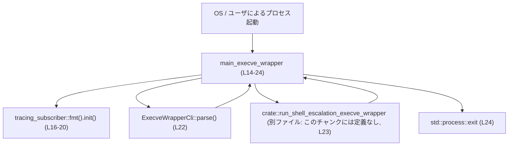
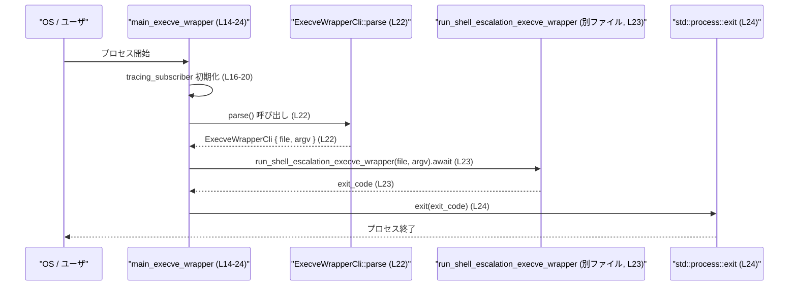

# shell-escalation/src/unix/execve_wrapper.rs コード解説

---

## 0. ざっくり一言

このファイルは、execve インターセプト用ヘルパーバイナリのエントリポイントとして、**CLI 引数を clap でパースし、ライブラリ関数を呼び出して、その戻り値をプロセス終了コードとして `std::process::exit` で終了する**非同期関数を提供するモジュールです（`execve_wrapper.rs:L1-L4, L14-L24`）。

---

## 1. このモジュールの役割

### 1.1 概要

- このモジュールは **execve ラッパーヘルパーを CLI から実行するためのエントリポイント**を提供します（`execve_wrapper.rs:L1`）。
- `ExecveWrapperCli` 構造体でコマンドライン引数の仕様を定義し（`execve_wrapper.rs:L6-L12`）、`main_execve_wrapper` 関数で
  - ロギングの初期化
  - CLI 引数のパース
  - 実際の処理本体 `crate::run_shell_escalation_execve_wrapper` の呼び出し
  - 終了コードでの `std::process::exit`
  を行います（`execve_wrapper.rs:L14-L24`）。

### 1.2 アーキテクチャ内での位置づけ

このモジュールは「CLI / OS レイヤ」と「execve ラッパーのコアロジック」の間の**薄いアダプタ**として機能しています。



- `ExecveWrapperCli` は clap による CLI パーサとして機能します（`execve_wrapper.rs:L6-L12`）。
- `main_execve_wrapper` は Tokio ランタイム上で動作する非同期関数であり（`#[tokio::main]`、`execve_wrapper.rs:L14-15`）、コア処理 `run_shell_escalation_execve_wrapper` を呼び出したあと、終了コードでプロセスを終了します（`execve_wrapper.rs:L23-L24`）。
- `run_shell_escalation_execve_wrapper` 自体の定義や場所は、このチャンクには現れていないため不明です（`execve_wrapper.rs:L23`）。

### 1.3 設計上のポイント

- **CLI 専用構造体による責務分離**  
  引数定義を `ExecveWrapperCli` に切り出し、`main_execve_wrapper` はパース済みの値だけを扱う構造になっています（`execve_wrapper.rs:L6-L12, L22`）。
- **フィールドは非公開**  
  `ExecveWrapperCli` は `pub struct` ですが、フィールド `file` と `argv` は非公開であり、外部から直接構築・変更されない設計です（`execve_wrapper.rs:L7-L11`）。
- **非同期エントリポイント**  
  `#[tokio::main]` により、非同期関数 `main_execve_wrapper` が Tokio ランタイム上で実行されるようになっています（`execve_wrapper.rs:L14-15`）。
- **ロギングの一括初期化**  
  `tracing_subscriber::fmt()` に対して環境変数ベースのフィルタ設定や出力先・ANSI 制御を行い、一度だけ `init()` でグローバル初期化しています（`execve_wrapper.rs:L16-L20`）。
- **エラー伝播と終了コード**  
  コア処理 `run_shell_escalation_execve_wrapper` の戻り値を `?` でそのまま `anyhow::Result<()>` のエラーとして伝播させる一方、成功時は返却された終了コードを `std::process::exit` に渡してプロセスを終了させる構造です（`execve_wrapper.rs:L15, L23-L24`）。

---

## 2. 主要な機能一覧（コンポーネントインベントリー 概要）

- `ExecveWrapperCli`: execve ラッパーヘルパーの **コマンドライン引数仕様**を定義する clap パーサ用構造体（`execve_wrapper.rs:L6-L12`）。
- `main_execve_wrapper`: ロギング初期化・CLI パース・コア処理呼び出し・プロセス終了までを行う **非同期エントリポイント関数**（`execve_wrapper.rs:L14-L24`）。

このチャンクには、上記以外の関数・構造体・列挙体は定義されていません。

---

## 3. 公開 API と詳細解説

### 3.1 型一覧（構造体など）

#### 構造体

| 名前 | 種別 | 公開性 | 役割 / 用途 | 根拠 |
|------|------|--------|-------------|------|
| `ExecveWrapperCli` | 構造体 | `pub struct`（フィールドは非公開） | execve ラッパーヘルパーの CLI 引数（`file` と追加の `argv`）を定義し、clap の `Parser` 派生でパース対象とするための型です。 | `execve_wrapper.rs:L3, L6-L12` |

##### `ExecveWrapperCli` のフィールド

| フィールド名 | 型 | 説明 | 根拠 |
|-------------|----|------|------|
| `file` | `String` | 対象となる「ファイル」を表す文字列です。フィールド名と後続の呼び出しから、execve ラッパーが処理するファイルパスやコマンド名を受け取る用途と解釈できます（用途自体は `run_shell_escalation_execve_wrapper` 側で決まります）。 | `execve_wrapper.rs:L7-L8, L22-L23` |
| `argv` | `Vec<String>` | `file` に渡される追加の引数列を保持するベクタです。`#[arg(trailing_var_arg = true)]` により、コマンドラインの残りの引数をすべて収集する設定になっています（具体的な clap の挙動は外部クレートの仕様ですが、この属性からそう読めます）。 | `execve_wrapper.rs:L10-L11, L22-L23` |

> 備考: フィールドはどちらも `pub` ではなく、外部モジュールからは `ExecveWrapperCli::parse()` などを通じて値を取得する前提の設計です（`execve_wrapper.rs:L7-L11, L22`）。

### 3.2 関数詳細

このチャンクで公開されている関数は `main_execve_wrapper` の 1 つです。

#### `main_execve_wrapper() -> anyhow::Result<()>`

```rust
#[tokio::main]                                         // Tokio ランタイムを立ち上げる属性
pub async fn main_execve_wrapper() -> anyhow::Result<()> {
    tracing_subscriber::fmt()                          // フォーマット付き Subscriber ビルダーを取得
        .with_env_filter(EnvFilter::from_default_env())// 環境変数ベースのフィルタ設定
        .with_writer(std::io::stderr)                  // 出力先を標準エラーに設定
        .with_ansi(false)                              // ANSI カラー出力を無効化
        .init();                                       // グローバル Subscriber を初期化

    let ExecveWrapperCli { file, argv } = ExecveWrapperCli::parse(); // CLI 引数をパース
    let exit_code = crate::run_shell_escalation_execve_wrapper(file, argv).await?; // コア処理呼び出し
    std::process::exit(exit_code);                     // 戻り値を終了コードとして終了（ここから先へは戻らない）
}
```

（`execve_wrapper.rs:L14-L24`）

**概要**

- Tokio ランタイム上で実行される非同期エントリポイント関数です（`execve_wrapper.rs:L14-15`）。
- 起動時に `tracing_subscriber` を環境変数ベースで設定し、標準エラー出力へのロギングを初期化します（`execve_wrapper.rs:L16-L20`）。
- CLI 引数を `ExecveWrapperCli` でパースし、その `file` と `argv` を `crate::run_shell_escalation_execve_wrapper` に渡して非同期に実行します（`execve_wrapper.rs:L22-L23`）。
- コア処理から返された終了コードを使って `std::process::exit` を呼び出し、プロセスをそのコードで終了させます（`execve_wrapper.rs:L23-L24`）。

**引数**

- 関数シグネチャ上、引数はありません（`execve_wrapper.rs:L15`）。
- コマンドライン引数はグローバルな `std::env::args` 経由で clap により取得され、`ExecveWrapperCli::parse()` 内部で使用されます（`execve_wrapper.rs:L3, L6, L22`）。

**戻り値**

- 戻り値の型は `anyhow::Result<()>` です（`execve_wrapper.rs:L15`）。
  - 成功時（`run_shell_escalation_execve_wrapper` が `Ok(exit_code)` を返す場合）は、最後の行で `std::process::exit(exit_code)` が呼ばれるため、**実際には呼び出し元へ `Ok(())` が返ることはありません**（`execve_wrapper.rs:L23-L24`）。
  - 途中で `run_shell_escalation_execve_wrapper` が `Err(...)` を返した場合は、`?` 演算子により `Err` がそのまま伝播し、`std::process::exit` は呼ばれません（`execve_wrapper.rs:L23`）。

**内部処理の流れ（アルゴリズム）**

1. Tokio ランタイム起動  
   `#[tokio::main]` 属性により、この関数が呼び出されるときに Tokio ランタイムが構築され、その上で非同期関数本体が実行されます（`execve_wrapper.rs:L14-15`）。
2. ロギングの初期化  
   - `tracing_subscriber::fmt()` でフォーマット付き Subscriber ビルダーを取得します（`execve_wrapper.rs:L16`）。
   - `EnvFilter::from_default_env()` から環境変数に基づくフィルタを設定します（`execve_wrapper.rs:L16-L17`）。
   - 出力先として `std::io::stderr` を指定し（`execve_wrapper.rs:L18`）、ANSI カラーを無効化します（`execve_wrapper.rs:L19`）。
   - `init()` でグローバルな Subscriber を登録します（`execve_wrapper.rs:L20`）。
3. CLI 引数のパース  
   `ExecveWrapperCli::parse()` を呼び出し、コマンドラインから `file` と `argv` を含む構造体を生成し、その場で分配構文で `file` と `argv` に分解します（`execve_wrapper.rs:L22`）。
4. コア処理の実行  
   `crate::run_shell_escalation_execve_wrapper(file, argv).await?` を呼び出し、非同期にコア処理を実行します（`execve_wrapper.rs:L23`）。  
   - `file` と `argv` は所有権ごとこの関数にムーブされます（所有権移動の一般仕様と `execve_wrapper.rs:L22-L23`）。
   - 成功時には終了コード（整数）が `exit_code` に代入されます（型はこのチャンクからは明示されていませんが `std::process::exit` に渡せる整数型である必要があります）。
   - 失敗時には `?` により `Err` がこの関数からも返されます。
5. プロセスの終了  
   `std::process::exit(exit_code);` を呼び出し、OS に終了コードを返してプロセスを終了します。この呼び出しは `!`（決して戻らない）型であり、この関数はここで終了します（`execve_wrapper.rs:L24`）。

**flowchart（処理フロー）**

```mermaid
flowchart TD
    A["main_execve_wrapper 開始 (L14-15)"] --> B["tracing_subscriber 初期化 (L16-20)"]
    B --> C["ExecveWrapperCli::parse() で CLI パース (L22)"]
    C --> D["run_shell_escalation_execve_wrapper(file, argv).await (L23)"]
    D -->|Ok(exit_code)| E["std::process::exit(exit_code) (L24)"]
    D -->|Err(e)| F["Err(e) を呼び出し元へ返す (L23)"]
```

**Examples（使用例）**

この関数は通常、バイナリのエントリポイントとして用いられることが想定されます（モジュール先頭コメントより、`execve_wrapper.rs:L1`）。以下は「別の `main` から利用する」という**仮想的な例**です。実際のバイナリエントリポイントがどのように構成されているかは、このチャンクからは分かりません。

```rust
// 仮の例: 別ファイルの main 関数から呼び出す
fn main() {
    // main_execve_wrapper は #[tokio::main] により自前で Tokio ランタイムを立ち上げます。
    // また、成功時には std::process::exit でプロセスを終了するため、
    // Ok(()) が返ってくることは想定されません。
    if let Err(e) = shell_escalation::unix::execve_wrapper::main_execve_wrapper() {
        // run_shell_escalation_execve_wrapper が Err を返した場合はこちらに来る可能性があります。
        eprintln!("error: {e:#}");
        std::process::exit(1);
    }
}
```

> 注意: `main_execve_wrapper` 内で `std::process::exit` が呼ばれるため、通常は `Ok(())` が返る経路は存在しません（`execve_wrapper.rs:L23-L24`）。

**Errors / Panics**

- **Error（`Err` を返す条件）**
  - `crate::run_shell_escalation_execve_wrapper(file, argv)` が `Err(e)` を返した場合、`?` によりこの関数も `Err(e)` を返します（`execve_wrapper.rs:L23`）。
  - それ以外に、この関数内で `Result` を返す処理はありません（`execve_wrapper.rs:L16-L24`）。
  - 実際に `Err` がどのような型・条件で発生するかは、`run_shell_escalation_execve_wrapper` の実装に依存しており、このチャンクには現れません。

- **Panics の可能性**
  - `tracing_subscriber::fmt().init()` は、一般的な `tracing-subscriber` の実装では「すでにグローバル Subscriber が設定されている」などの状況で panic する可能性があります。このコードでは `try_init()` ではなく `init()` を使用しており、その戻り値も扱っていないため、失敗時は panic となるパターンが考えられます（`execve_wrapper.rs:L16-L20`）。
  - それ以外に、この関数内で明示的に `panic!` を呼び出している箇所はありません（`execve_wrapper.rs:L14-L24`）。

**Edge cases（エッジケース）**

- **CLI 引数不足 / 不正な引数**
  - `ExecveWrapperCli::parse()` の挙動は clap の実装に依存しますが、一般的には必須引数が不足している場合や不正な値が与えられた場合、エラーメッセージとともにプロセスを終了する振る舞いが想定されます（`execve_wrapper.rs:L3, L6, L22`）。
  - このファイル内には、`parse()` のエラーをハンドリングするコードはありません（`execve_wrapper.rs:L22`）。
- **ログフィルタ環境変数の不正値**
  - `EnvFilter::from_default_env()` に渡される環境変数（通常 `RUST_LOG`）が不正な形式をとった場合の挙動は `tracing_subscriber` の実装に依存します。このファイルではそのエラーをハンドリングしていません（`execve_wrapper.rs:L4, L16-L17`）。
- **`run_shell_escalation_execve_wrapper` の終了コード**
  - 終了コードの範囲（負数の扱いなど）は `run_shell_escalation_execve_wrapper` の実装次第です。このチャンクにはその制約は現れていませんが、`std::process::exit` は 0〜255 の範囲で OS に渡されることが多いため、その前提に注意が必要です（`execve_wrapper.rs:L23-L24`）。

**使用上の注意点**

- **戻り値に依存しないこと**  
  成功パスでは `std::process::exit` が呼び出されるため、この関数の呼び出し元に `Ok(())` が返ることはありません（`execve_wrapper.rs:L23-L24`）。戻り値 `anyhow::Result<()>` は主にエラー伝播のための型と考えられます。
- **Tokio ランタイムとの関係**  
  `#[tokio::main]` により、この関数は呼び出しごとに新しい Tokio ランタイムを構築します（`execve_wrapper.rs:L14-15`）。  
  一般に、すでに Tokio ランタイムが動作しているスレッドから `#[tokio::main]` 付き関数を呼び出すと「ランタイムの入れ子」になり、実装によっては panic となる可能性があります。  
  そのため、既存の Tokio ランタイム内で再利用したい場合は、`run_shell_escalation_execve_wrapper` を直接呼び出す構成に分離することが望ましいです（`execve_wrapper.rs:L23`）。
- **`tracing_subscriber` の多重初期化**  
  `init()` はグローバル Subscriber を一度だけ設定する前提で設計されています。`main_execve_wrapper` を同一プロセス内で複数回呼び出すと、多重初期化により panic する可能性があります（`execve_wrapper.rs:L16-L20`）。
- **`std::process::exit` によるリソース解放**  
  `std::process::exit` は Rust のスコープ終了時に実行される `Drop`（デストラクタ）を呼び出さずにプロセスを終了するため、ファイルクローズやフラッシュなどが行われないまま終了する可能性があります（`execve_wrapper.rs:L24`）。この関数内には目立ったリソースはありませんが、`run_shell_escalation_execve_wrapper` 側で開いているリソースなどへの影響に注意が必要です。

### 3.3 その他の関数

- このチャンクには `main_execve_wrapper` 以外の関数定義はありません（`execve_wrapper.rs:L1-L25`）。

---

## 4. データフロー

このモジュールにおける代表的なシナリオは、「プロセス起動 → CLI パース → コア処理実行 → 終了コードでプロセス終了」です。

1. OS からプロセスが起動されると、バイナリのエントリポイントとして `main_execve_wrapper` が呼び出されます（設計意図はモジュールコメントから読み取れますが、具体的なエントリポイント構成はこのチャンクには現れません。`execve_wrapper.rs:L1, L14-L15`）。
2. 関数内でロギングが初期化された後、`ExecveWrapperCli::parse()` により `file` と `argv` が取得されます（`execve_wrapper.rs:L16-L22`）。
3. `file` と `argv` は所有権ごと `run_shell_escalation_execve_wrapper` に渡され、非同期にコア処理が実行されます（`execve_wrapper.rs:L22-L23`）。
4. コア処理から返された終了コードが `std::process::exit` に渡され、プロセスはそのコードで終了します（`execve_wrapper.rs:L23-L24`）。



このフローには、共有可変状態やスレッド間通信は明示されておらず、**シングルスレッド的な直列処理**として実装されています（`execve_wrapper.rs:L14-L24`）。並行性の詳細は Tokio ランタイムおよび `run_shell_escalation_execve_wrapper` の実装に依存します。

---

## 5. 使い方（How to Use）

### 5.1 基本的な使用方法

このモジュールは、「execve ラッパー」専用バイナリのエントリポイントとして使われることが想定されます（`execve_wrapper.rs:L1`）。Rust コード側から直接呼び出す最小例は次のようになります。

```rust
// 仮想的な main.rs の例
fn main() {
    // 非同期エントリポイント main_execve_wrapper を呼び出す。
    // #[tokio::main] により内部で Tokio ランタイムが構築される。
    if let Err(e) = shell_escalation::unix::execve_wrapper::main_execve_wrapper() {
        // run_shell_escalation_execve_wrapper が Err を返した場合のみここに来る。
        eprintln!("execve wrapper failed: {e:#}");
        std::process::exit(1);
    }
}
```

- コマンドライン引数は `ExecveWrapperCli` によって自動的にパースされるため、呼び出し側で特別な準備は不要です（`execve_wrapper.rs:L6-L12, L22`）。
- ロギングの設定も `main_execve_wrapper` 内で完結しており、呼び出し側が `tracing_subscriber` を初期化する必要はありません（`execve_wrapper.rs:L16-L20`）。

### 5.2 よくある使用パターン

#### パターン 1: CLI 引数仕様の利用

`ExecveWrapperCli` は、同じ CLI 仕様を別のルートから使いたいときにも利用できます。

```rust
use shell_escalation::unix::execve_wrapper::ExecveWrapperCli;
// clap::Parser トレイトもスコープに入れる必要があります。
use clap::Parser;

fn inspect_cli() {
    // 実行中プロセスの CLI をパースして、中身をログに出す例
    let cli = ExecveWrapperCli::parse(); // execve_wrapper.rs:L6, L22 と同じ呼び出し
    // フィールドは非公開なので、ここからは直接参照できません。
    // 必要であれば、この構造体にアクセス用メソッドを追加する変更が考えられます。
}
```

> フィールドが非公開のため、`ExecveWrapperCli` の内容を外部から利用したい場合は、将来的には getter メソッドなどを追加する必要があります（`execve_wrapper.rs:L7-L11`）。

#### パターン 2: コア処理のみを再利用する（推奨構成）

既存の Tokio ランタイム内で execve ラッパー処理だけを再利用したい場合、`#[tokio::main]` 付きの `main_execve_wrapper` を呼ぶのではなく、`run_shell_escalation_execve_wrapper` を直接呼び出す設計の方が自然です。

```rust
// 仮の例: 既存の非同期コンテキストからコア処理を呼び出す
async fn run_wrapper_direct(file: String, argv: Vec<String>) -> anyhow::Result<i32> {
    // crate::run_shell_escalation_execve_wrapper のシグネチャは
    // このチャンクには出てこないため、戻り値の型は仮定です。
    let exit_code = crate::run_shell_escalation_execve_wrapper(file, argv).await?;
    Ok(exit_code)
}
```

> 実際の戻り値の型などは `run_shell_escalation_execve_wrapper` の実装に依存し、このチャンクからは分かりません（`execve_wrapper.rs:L23`）。

### 5.3 よくある間違い（起こりえそうな誤用）

#### 誤用例 1: 既存の Tokio ランタイム内から `main_execve_wrapper` を呼ぶ

```rust
// 間違い例: 既に Tokio ランタイムが動作している非同期関数から呼び出す
async fn handler() {
    // #[tokio::main] 付き関数は内部で新しいランタイムを構築するため、
    // 既存ランタイムから呼ぶと「ランタイムの入れ子」になり、Tokio の仕様上望ましくありません。
    let _ = shell_escalation::unix::execve_wrapper::main_execve_wrapper();
}
```

```rust
// より安全な例（イメージ）: コア処理関数を直接呼び出す構成とする
async fn handler(file: String, argv: Vec<String>) -> anyhow::Result<()> {
    crate::run_shell_escalation_execve_wrapper(file, argv).await?;
    Ok(())
}
```

- `main_execve_wrapper` は `#[tokio::main]` によりランタイムの構築・破棄を行うため、既存ランタイムから呼び出すのは避けるべきです（`execve_wrapper.rs:L14-L15`）。

#### 誤用例 2: `main_execve_wrapper` の戻り値に依存するロジックを書く

```rust
// 間違い例: Ok(()) が返ることを前提にして後続の処理を書く
fn main() -> anyhow::Result<()> {
    shell_escalation::unix::execve_wrapper::main_execve_wrapper()?; // ここでプロセスが exit する
    // 実際にはここには到達しない
    println!("wrapper finished successfully"); // 実行されない
    Ok(())
}
```

- 成功時には `std::process::exit` によって即座にプロセスが終了するため、`?` の後続コードが実行されることはありません（`execve_wrapper.rs:L23-L24`）。

### 5.4 使用上の注意点（まとめ）

- **この関数は「戻らない」前提で扱う**  
  成功パスでは `std::process::exit` が呼び出されるため、`main_execve_wrapper` は本質的に「戻らない関数」として扱う必要があります（`execve_wrapper.rs:L23-L24`）。
- **Tokio ランタイムとの関係を意識する**  
  `#[tokio::main]` によるランタイム構築はプロセスのエントリポイント付近で 1 回行うのが一般的です。既存ランタイムからの呼び出しは避け、必要であればコア処理関数を分離して直接呼び出す構造にします（`execve_wrapper.rs:L14-L15, L23`）。
- **ロギング初期化の多重実行に注意**  
  `tracing_subscriber::fmt().init()` はグローバル設定のため、プロセス内で一度だけ呼ぶことを前提とする実装が多いです。この関数を複数回呼び出す設計は避けるのが安全です（`execve_wrapper.rs:L16-L20`）。
- **セキュリティ上の入力検証はコア処理側に任されている**  
  このモジュールは CLI 引数をそのまま `run_shell_escalation_execve_wrapper` に渡しており（`execve_wrapper.rs:L22-L23`）、入力のバリデーションやサニタイズはコア処理側に依存しています。セキュリティ要件はそちらの実装で確認する必要があります（このチャンクには現れません）。
- **テストコードはこのファイルには存在しない**  
  ユニットテストや統合テストはこのファイル内には定義されておらず、テスト戦略は他ファイルまたは上位レベルに依存します（`execve_wrapper.rs:L1-L25`）。

---

## 6. 変更の仕方（How to Modify）

### 6.1 新しい機能を追加する場合

#### 例: 追加の CLI オプションを導入する

1. **`ExecveWrapperCli` にフィールドを追加**  
   - 例: `verbose: bool` などのフィールドを追加し、clap 属性でフラグオプションを設定します（`execve_wrapper.rs:L6-L12`）。
   - フィールドは引き続き非公開のままでも構いませんが、外部から参照したい場合は getter メソッドを追加する形が考えられます（このファイルにはまだ存在しません）。
2. **分配構文の更新**  
   - `let ExecveWrapperCli { file, argv } = ...` という分配構文を更新し、新たなフィールドも取り出すか、余分なフィールドを無視する記法（`..`）に変更します（`execve_wrapper.rs:L22`）。
3. **コア処理関数のシグネチャ変更**  
   - 追加したフィールドをコア処理に渡したい場合は、`run_shell_escalation_execve_wrapper` の引数にもその情報を追加する必要があります（`execve_wrapper.rs:L23`）。
   - この関数の定義は別ファイルにあるため、そのファイル側での修正も必要です（このチャンクには場所が現れません）。
4. **ロギングや挙動の変更**  
   - 追加したオプションに応じてログレベルや挙動を変えたい場合は、`tracing_subscriber` の初期化前後に条件分岐を追加します（`execve_wrapper.rs:L16-L20`）。

### 6.2 既存の機能を変更する場合

- **CLI 引数の仕様変更**
  - `file` や `argv` の意味や必須/任意を変えたい場合は、`ExecveWrapperCli` のフィールドや clap 属性を変更します（`execve_wrapper.rs:L6-L12`）。
  - 変更に伴い、`run_shell_escalation_execve_wrapper` の引数仕様と、その呼び出し箇所（`execve_wrapper.rs:L23`）を合わせて更新する必要があります。
- **ロギング戦略の変更**
  - ログ出力先やフィルタ条件を変えたい場合は、`tracing_subscriber::fmt()` 以降のメソッドチェーンを変更します（`execve_wrapper.rs:L16-L20`）。
  - ANSI カラー出力を有効にしたい場合は、`.with_ansi(true)` などに変更します（`execve_wrapper.rs:L19`）。
- **終了コード処理の変更**
  - `run_shell_escalation_execve_wrapper` が返す値をそのまま終了コードに使わず、マッピングしたい場合は、`exit_code` を受け取った後に変換ロジックを挿入します（`execve_wrapper.rs:L23-L24`）。
- **変更時に注意すべき契約（前提条件）**
  - `main_execve_wrapper` が「成功時はプロセスを終了する」という契約を前提にしている呼び出し元が存在する可能性があります。  
    この前提を変える（たとえば `std::process::exit` をやめて `Ok(())` を返す）場合は、上位の起動コードやテストの期待を確認する必要があります（呼び出し元はこのチャンクには現れません）。

---

## 7. 関連ファイル

このモジュールと密接に関係するシンボル・外部コンポーネントは次のとおりです。

| パス / シンボル | 役割 / 関係 |
|----------------|------------|
| `crate::run_shell_escalation_execve_wrapper` | 実際の execve ラッパー処理を行うコア関数です。`main_execve_wrapper` から `file` と `argv` を渡されて非同期に実行され、その戻り値が終了コードとして `std::process::exit` に引き渡されます（`execve_wrapper.rs:L23`）。定義ファイルのパスはこのチャンクには現れず、不明です。 |
| `clap::Parser` | `ExecveWrapperCli` に対する CLI パーサ機能を提供するトレイト/マクロです。`#[derive(Parser)]` と組み合わせて `ExecveWrapperCli::parse()` を利用可能にしています（`execve_wrapper.rs:L3, L6, L22`）。 |
| `tracing_subscriber::EnvFilter` | ログフィルタの設定を環境変数から読み取るために使用されます（`execve_wrapper.rs:L4, L16-L17`）。 |
| `tracing_subscriber::fmt` | フォーマット付きの `tracing` Subscriber を構築し、`init()` でグローバル設定するために使用されます（`execve_wrapper.rs:L16-L20`）。 |
| `tokio::main`（属性マクロ） | `main_execve_wrapper` を Tokio ランタイム上で実行するために使用される属性です（`execve_wrapper.rs:L14-15`）。 |
| `std::process::exit` | コア処理からの終了コードを OS に伝え、プロセスを即座に終了するために使用されます（`execve_wrapper.rs:L24`）。 |

このチャンク内にはテストコードや補助的ユーティリティは含まれておらず、それらが存在するかどうかは他ファイルを確認しないと分かりません。
