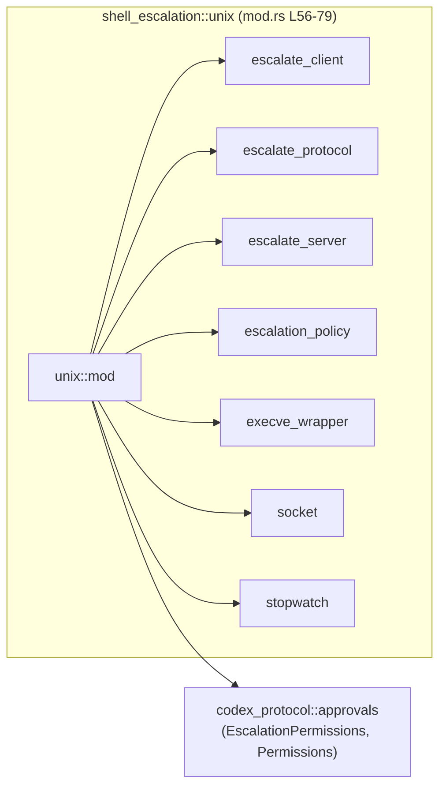
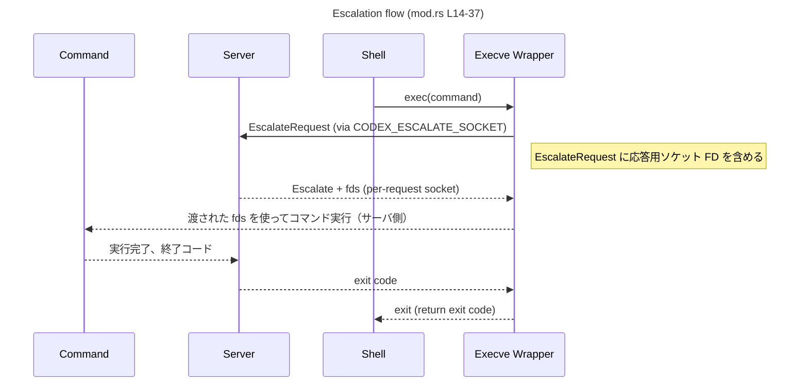
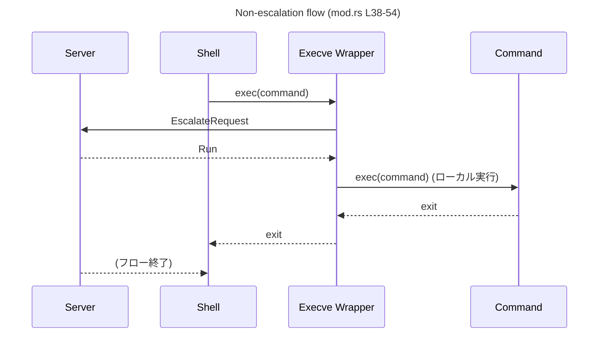

# shell-escalation/src/unix/mod.rs コード解説

## 0. ざっくり一言

Unix 環境における「シェルの権限昇格プロトコル」の **モジュール集約ポイント** であり、  
エスカレーションサーバ・クライアント（execve ラッパ）・プロトコル・ポリシーなどの Unix 実装を束ねて公開するモジュールです（`mod.rs:L1-12, L56-79`）。

---

## 1. このモジュールの役割

### 1.1 概要

- パッチされたシェルが `exec()` するたびに **execve ラッパ** を経由し、そのラッパから **エスカレーションサーバ** に問い合わせを送る、というプロトコルをまとめています（`mod.rs:L3-5`）。
- ラッパは継承された `CODEX_ESCALATE_SOCKET` 上で `EscalateRequest` を送信し、サーバは  
  - コマンドをそのままローカルで実行する（`Run`）、または  
  - サーバ側で実行する（`Escalate`）  
  のどちらかを選択します（`mod.rs:L3-5`）。
- `EscalateRequest` には「レスポンス返却用ソケットのファイルディスクリプタ (FD)」が含まれ、サーバはそれを使ってラッパへ結果を返します（`mod.rs:L7-8`）。
- リクエストごとに別ソケットを使うことで、複数のエスカレーションリクエストを **同時並行に処理できる** ように設計されています（`mod.rs:L9-12`）。

### 1.2 アーキテクチャ内での位置づけ

この `unix` モジュールは、Unix 向けのシェル権限昇格機能に関するサブモジュールを束ね、  
外部（おそらく上位クレート）に対して代表的な API を再公開するハブのような役割を持ちます。

- サブモジュール宣言（crate 内向け）  
  - `escalate_client`（`mod.rs:L56`）  
  - `escalate_protocol`（`mod.rs:L57`）  
  - `escalate_server`（`mod.rs:L58`）  
  - `escalation_policy`（`mod.rs:L59`）  
  - `execve_wrapper`（`mod.rs:L60`）  
  - `socket`（`mod.rs:L61`）  
  - `stopwatch`（`mod.rs:L62`）
- 公開 API としての再エクスポート（`pub use`、`mod.rs:L64-79`）

Mermaid 図で依存関係（このチャンクに現れる範囲）を示すと次のようになります。



- `unix::mod` からサブモジュールが `pub(crate)` で参照され、  
  同時に代表的な型／関数は `pub use` によって上位へエクスポートされています（`mod.rs:L64-79`）。
- 外部クレート `codex_protocol::approvals` から `EscalationPermissions` と `Permissions` が再エクスポートされており、エスカレーションの権限管理に関連していると考えられますが、詳細な挙動はこのチャンクでは分かりません（`mod.rs:L78-79`）。

### 1.3 設計上のポイント（このファイルから読み取れる範囲）

1. **リクエスト／レスポンスソケットの分離**  
   - `EscalateRequest` にはサーバがレスポンスを返すためのソケット FD が含まれ、  
     送信用と受信用の FD を分ける設計になっています（`mod.rs:L7-12`）。
   - これにより、すべての子プロセスは共通の `CODEX_ESCALATE_SOCKET` を使って「送信」だけを行い、  
     応答は per-request ソケットから受信します。  
     → 複数リクエストが同時に存在しても、レスポンスが混線しないようになっています（`mod.rs:L9-12`）。

2. **Unix 専用の実装モジュール**  
   - モジュール名が `unix` であり、ここに集約されているのは Unix 特有の機能（ソケット FD などを使うプロトコル）と推測できますが、  
     対応 OS の範囲はこのファイル単体では明示されていません。

3. **責務ごとのモジュール分割**  
   名前から分かる範囲での分割方針は次の通りです（`mod.rs:L56-62`）。
   - `escalate_client`：クライアント側（execve ラッパ／シェル側）からサーバへリクエストを送る処理。
   - `escalate_protocol`：`EscalateRequest` や `EscalateAction` など、プロトコル定義。
   - `escalate_server`：エスカレーションサーバ本体と、セッション・実行結果の管理。
   - `escalation_policy`：どのコマンドをエスカレートするかのポリシー。
   - `execve_wrapper`：実際に `execve` 前後をフックするラッパプログラム。
   - `socket`：Unix ソケットや FD の扱い（詳細不明）。
   - `stopwatch`：処理時間計測のユーティリティと思われますが、用途はこのチャンクでは明示されていません。

   いずれも「名前と `mod` 宣言のみ」が根拠であり、詳細実装はこのチャンクには現れません。

4. **並行性の考慮**  
   - 「リクエストごとに別ソケットを作ることで複数のエスカレーションリクエストを同時に処理できる」旨が明示されています（`mod.rs:L9-12`）。
   - Rust 的には、各リクエストは独立したソケット FD に紐付いているため、スレッド間共有の競合を減らす設計になっていると解釈できますが、実際にスレッド／async を使っているかはこのチャンクには現れません。

5. **エラーハンドリング方針**  
   - このファイルには関数本体が書かれていないため、Result 型／panic の扱いなど、Rust の具体的なエラーハンドリング戦略は不明です。

---

## 2. 主要な機能一覧（コンポーネントインベントリー）

このモジュールが提供する主要機能（コンポーネント）と、その役割を一覧にします。  
種別が不明なものは「不明」と明記し、判定根拠も併記します。

### 2.1 サブモジュール一覧

| 名前 | 種別 | 役割 / 用途（このチャンクから読める範囲） | 根拠 |
|------|------|-----------------------------------------|------|
| `escalate_client` | モジュール | エスカレーションクライアント（execve ラッパ側）機能をまとめるモジュールと推測されます | `mod.rs:L56` |
| `escalate_protocol` | モジュール | `EscalateRequest` などのプロトコル定義を含むと推測されます | `mod.rs:L57`、コメント中の `EscalateRequest` 言及 (`L3-12`) |
| `escalate_server` | モジュール | エスカレーションサーバおよびセッション管理ロジックを含むと推測されます | `mod.rs:L58` |
| `escalation_policy` | モジュール | エスカレーション可否を決めるポリシー（ルール）を実装するモジュールと思われます | `mod.rs:L59` |
| `execve_wrapper` | モジュール | `exec()` をフックするラッパプログラム本体。`main_execve_wrapper` を含む | `mod.rs:L60, L76` |
| `socket` | モジュール | Unix ソケットおよび FD の操作に関するユーティリティと推測されます | `mod.rs:L61` |
| `stopwatch` | モジュール | 処理時間計測のためのユーティリティと推測されます | `mod.rs:L62, L77` |

### 2.2 再エクスポートされる識別子一覧

> 種別（構造体／列挙体／関数など）は、命名規約からの推測を除き、このチャンクだけでは確定できません。

| 名前 | 推定種別 | 役割 / 用途（推測含む） | 定義元 | 根拠 |
|------|----------|-------------------------|--------|------|
| `run_shell_escalation_execve_wrapper` | 関数（snake_case 名からの推測） | シェル権限昇格用 execve ラッパを実行するエントリポイントと推測されます | `escalate_client` | `mod.rs:L64` |
| `ESCALATE_SOCKET_ENV_VAR` | 定数または静的変数と推測 | `CODEX_ESCALATE_SOCKET` に対応する環境変数名を表す値と思われます | `escalate_protocol` | `mod.rs:L65`、コメント中の `CODEX_ESCALATE_SOCKET` (`L3-4, L9-11`) |
| `EscalateAction` | 不明（型名と推測） | サーバが取るアクション（Run / Escalate）を表す型と推測されます | `escalate_protocol` | `mod.rs:L66`、コメント中の `Run` / `Escalate` (`L4-5`) |
| `EscalationDecision` | 不明 | エスカレーション可否や詳細決定を表す型と推測されます | `escalate_protocol` | `mod.rs:L67` |
| `EscalationExecution` | 不明 | エスカレーション時の実行情報を表す型と推測されます | `escalate_protocol` | `mod.rs:L68` |
| `EscalateServer` | 不明（型名と推測） | エスカレーションサーバ本体の型 | `escalate_server` | `mod.rs:L69` |
| `EscalationSession` | 不明 | 1 回のエスカレーション要求に対するセッション状態を表す型と推測されます | `escalate_server` | `mod.rs:L70` |
| `ExecParams` | 不明 | 実行するコマンドや環境などのパラメータ | `escalate_server` | `mod.rs:L71` |
| `ExecResult` | 不明 | 実行結果（終了コード・出力など）を表す型と推測されます | `escalate_server` | `mod.rs:L72` |
| `PreparedExec` | 不明 | 実行前に準備された exec 情報を表す型と推測されます | `escalate_server` | `mod.rs:L73` |
| `ShellCommandExecutor` | 不明（トレイト／型と推測） | シェルコマンドの実行を抽象化するインターフェースの可能性があります | `escalate_server` | `mod.rs:L74` |
| `EscalationPolicy` | 不明 | エスカレーション判断ロジックを表す型 | `escalation_policy` | `mod.rs:L75` |
| `main_execve_wrapper` | 関数（snake_case 名からの推測） | execve ラッパプログラムの `main` 関数に相当するエントリポイント | `execve_wrapper` | `mod.rs:L76` |
| `Stopwatch` | 不明（型名と推測） | 経過時間計測のためのユーティリティ型 | `stopwatch` | `mod.rs:L77` |
| `EscalationPermissions` | 不明（おそらく型） | エスカレーションに必要な権限セットを表す型と推測されます | `codex_protocol::approvals` | `mod.rs:L78` |
| `Permissions` | 不明（おそらく型） | 一般的な権限表現を行う型と推測されます | `codex_protocol::approvals` | `mod.rs:L79` |

> 「推定種別」「役割」の列は命名からの推測を含みます。  
> 正確な定義（構造体/列挙体/トレイト/関数など）は、このモジュール外のコードを確認する必要があります。

---

## 3. 公開 API と詳細解説

### 3.1 型一覧（構造体・列挙体など）

このファイル単体からは、再エクスポートされている識別子の **型の種別** を確定できません。  
したがって、上記 2.2 の表がこのセクションの内容も兼ねます。

- Rust の慣習的には、`EscalateServer` や `Stopwatch` などの PascalCase 名は「型」（構造体 / 列挙体 / トレイト）であることが多いですが、  
  それはあくまで命名規約に基づく推測であり、コード上の確証はこのチャンクには存在しません。

### 3.2 重要な関数（推定）詳細

このモジュールに直接関数定義はありませんが、  
再エクスポートされている関数らしき識別子のうち、特に重要と思われる 2 つを取り上げます。

> 重要: ここでの説明は「モジュールコメント」と「名前」からの推測を含み、  
> 関数シグネチャ（引数・戻り値）はこのチャンクでは確認できません。

#### `run_shell_escalation_execve_wrapper(...)`（定義はこのチャンクには現れない）

**概要**

- `escalate_client` モジュールから再エクスポートされている関数です（`mod.rs:L64`）。
- 名前とモジュールコメントから、パッチされたシェル内で exec をラップし、  
  `EscalateRequest` を送信してから適切にコマンドを実行する「クライアント側のメイン処理」に対応していると推測されます（`mod.rs:L3-12, L14-54`）。

**引数 / 戻り値**

- このファイルには定義が存在しないため、**引数名・型・戻り値の型は不明** です。
- 一般的には、`argv` / `envp` 相当や、エスカレーションサーバへの接続情報などを受け取る可能性がありますが、これは推測です。

**内部処理の流れ（推測ベース）**

モジュールコメントに記述されたフロー（`mod.rs:L14-54`）から、概ね次のような処理を行う関数がどこかに存在すると考えられます。

1. `CODEX_ESCALATE_SOCKET`（`ESCALATE_SOCKET_ENV_VAR`）で指定されたソケット FD を取得する。
2. 実行しようとしているコマンド情報を `EscalateRequest` に詰める。
3. 応答用ソケットを新規に作成し、その FD を `EscalateRequest` に含める（`mod.rs:L7-12`）。
4. 共有ソケット（`CODEX_ESCALATE_SOCKET`）を通じて `EscalateRequest` をサーバに送信する。
5. 応答用ソケットでサーバからの結果を待ち受ける。
6. サーバが `Run` を返した場合は、ローカルで `execve` を実行する（`mod.rs:L38-54` の Non-escalation flow）。
7. サーバが `Escalate` を返した場合は、サーバ側で実行してもらい、その終了コードや FD を反映する（`mod.rs:L14-37` の Escalation flow）。

ただし、これらのステップを **この関数がすべて担当しているか** は、このチャンクだけでは断定できません。

**Examples（使用例）**

このファイルからはシグネチャが分からないため、コンパイル可能なサンプルコードを示すことはできません。  
概念的な例だけを挙げると、次のような呼び出し位置が想定されます（疑似コード）:

```rust
// 疑似コード（引数・戻り値はこのチャンクからは不明）
// use shell_escalation::unix::run_shell_escalation_execve_wrapper;
//
// fn main() {
//     // シェルの exec() 実装の代わりに、ラッパ処理を呼び出す
//     run_shell_escalation_execve_wrapper(/* argv, envp など？ */);
// }
```

**Errors / Panics, Edge cases, 使用上の注意点**

- このチャンクにはエラーハンドリングや境界条件に関する情報がまったく現れません。
- ただし、プロトコル上の注意として、少なくとも以下の前提が必要です（コメントから分かる範囲）:
  - `CODEX_ESCALATE_SOCKET` が継承済みであり、かつ有効なソケット FD であること（`mod.rs:L3-4, L9-11, L40-46`）。
  - 応答用ソケット FD が正しくサーバに渡され、サーバがそこへ返信すること（`mod.rs:L7-12, L26-27, L50-52`）。
- これらが満たされない場合にどう振る舞うか（エラー終了・フェイルオープン／クローズなど）は、このチャンクからは不明です。

#### `main_execve_wrapper(...)`（定義はこのチャンクには現れない）

**概要**

- `execve_wrapper` モジュールから再エクスポートされている `main_execve_wrapper` は、  
  名前から `execve` ラッパプログラムの「main 関数相当」のエントリポイントと推測されます（`mod.rs:L60, L76`）。

**引数・戻り値・内部処理**

- このファイルには定義が存在しないため、詳細は不明です。
- パッチされたシェルが `exec()` を呼ぶ際に、この関数（あるいはこのモジュールにある main）が実行され、  
  上記のエスカレーションフローに沿ってサーバとの通信を行う、と考えられますが、これは推測です（`mod.rs:L3-12, L14-54`）。

**Examples / Errors / Edge cases / 使用上の注意点**

- 具体的な使用例やエラーパターンは、このチャンクだけでは明示できません。
- シェルの代替 exec 実装として動くため、**プロセス置換（`execve` による現在プロセスのイメージ差し替え）** が絡む挙動になる点には注意が必要です（一般論）。

### 3.3 その他の関数

- この `mod.rs` には関数定義が一切書かれていません。
- 補助関数やラッパ関数は、`escalate_client` などの各サブモジュール内に定義されていると考えられますが、  
  それらはこのチャンクには現れません。

---

## 4. データフロー

このセクションでは、モジュールコメント内に記載されている 2 つのフロー（Escalation / Non-escalation）を整理し、  
どのコンポーネント間でデータが流れるかを説明します（`mod.rs:L14-54`）。

### 4.1 Escalation flow（実際にサーバ側でコマンドを実行する場合）

コメント中の図（`mod.rs:L16-36`）をもとに、主要な流れを文章で整理すると次のようになります。

1. シェルからコマンドが起動される際、パッチされたシェルは execve ラッパを起動します（Command → Shell → Execve Wrapper; `mod.rs:L16-21`）。
2. Execve Wrapper は `EscalateRequest` をエスカレーションサーバへ送信します（`mod.rs:L22-24`）。
3. サーバはそのリクエストを受け取り、ポリシーなどに基づき `Escalate` を選択します（`mod.rs:L24-25`）。
4. サーバはリクエストに含まれていた応答用ソケット FD を用いて、ファイルディスクリプタ（`fds`）などの情報を Execve Wrapper に返します（`mod.rs:L26-27`）。
5. コマンド側（別プロセス）とサーバ間で FD やデータの受け渡しが行われ、実際のコマンドはサーバ側で実行されます（`mod.rs:L28-31`）。
6. 実行終了後、サーバは exit code を Execve Wrapper へ返し（`mod.rs:L32-33`）、Wrapper は exit してシェルへ制御を戻します（`mod.rs:L34-36`）。

Mermaid のシーケンス図にすると次のようになります（コメント範囲: `mod.rs:L14-37`）。



### 4.2 Non-escalation flow（ローカルでそのまま実行する場合）

Non-escalation flow のコメント図（`mod.rs:L38-54`）では、サーバが `Run` を返すケースが示されています。

1. パッチされたシェルが Execve Wrapper を起動するまでは Escalation flow と同じです（`mod.rs:L40-45`）。
2. Execve Wrapper からサーバへ `EscalateRequest` が送信されます（`mod.rs:L46-47`）。
3. サーバはポリシーに基づき、エスカレーションせずにローカル実行を許可する `Run` を返します（`mod.rs:L48-49`）。
4. Execve Wrapper はローカルでコマンドを `exec` し（`mod.rs:L50`）、その終了コードをシェルへ返します（`mod.rs:L50-54`）。

Mermaid シーケンス図（`mod.rs:L38-54`）:



### 4.3 並行性（Concurrency）の観点

- すべての子プロセスは、継承された `CODEX_ESCALATE_SOCKET` FD を使ってエスカレーションリクエストを送信できる、とコメントにあります（`mod.rs:L9-11`）。
- 各リクエストは、**別の応答用ソケット** を持っており（`mod.rs:L7-12`）、  
  サーバはこれを使い分けることで複数のリクエストを同時に処理できます。

Rust 観点で言うと:

- 共有リソース（送信用ソケット FD）は一つですが、レスポンスチャネル（FD）はリクエストごとに分離されているため、  
  レスポンス処理の競合を避けやすい構造になっています。
- 実際にスレッドや async/await を用いているか、どのような同期原語（`Mutex` など）を使っているかは、このチャンクには現れません。

---

## 5. 使い方（How to Use）

この `mod.rs` だけでは完全な使用方法は分かりませんが、モジュール構成とコメントから、  
おおまかな利用フローを説明します。

### 5.1 基本的な使用方法（概念レベル）

1. **エスカレーションサーバ側**  
   - `EscalateServer` と `EscalationPolicy` を組み合わせてサーバプロセスを起動し、  
     子プロセスに `CODEX_ESCALATE_SOCKET` を継承させるように設定する（`mod.rs:L3-4, L9-11, L58-59, L69-75`）。
   - 権限関連として `EscalationPermissions` / `Permissions` 型を用いて、  
     どの操作が許可されるかを管理している可能性があります（`mod.rs:L78-79`）。

2. **シェル側（クライアント / execve ラッパ）**  
   - シェルの `exec()` 呼び出しをパッチし、代わりに `execve_wrapper` の main あるいは `run_shell_escalation_execve_wrapper` を呼び出す（`mod.rs:L3-5, L56, L60, L64, L76`）。
   - ラッパは `ESCALATE_SOCKET_ENV_VAR` で示される環境変数からソケット FD を取得し、  
     `EscalateRequest` を送信してから、サーバの指示に従ってコマンドを実行する（`mod.rs:L3-12, L14-54, L65`）。

3. **結果の受け取り**  
   - コマンドの終了コードは、サーバ経由またはローカル実行のいずれかを通じて Execve Wrapper に返り、  
     最終的にはシェルに返されます（`mod.rs:L32-36, L50-54`）。

### 5.2 よくある使用パターン（推測）

このファイルだけから具体的な API の形は取れませんが、  
考えられる使用パターンを概念レベルで列挙します。

- **常駐サーバ + パッチされたシェル**  
  - サーバプロセスで `EscalateServer` を動かし、ユーザシェルをパッチして `exec()` を execve ラッパへ差し替える。
  - すべてのプロセスは `CODEX_ESCALATE_SOCKET` を継承し、必要に応じてエスカレーションを要求する。

- **テスト環境**  
  - `ShellCommandExecutor`（推測）をモック実装に差し替え、  
    実際にはコマンドを実行せずにプロトコルのみをテストするといったパターンが考えられます（`mod.rs:L74`）。

### 5.3 よくある間違い（起こりうる問題の例）

このチャンクから推測できる、典型的な問題パターンを挙げます。

1. **`CODEX_ESCALATE_SOCKET` が設定されていない / 不正**  
   - 送信側（Execve Wrapper）がソケット FD を取得できない場合、エスカレーションプロトコルが機能しません。  
   - どのようなエラーにするかはこのチャンクからは分かりませんが、少なくとも「プロトコルの前提が崩れる」ケースです（`mod.rs:L3-4, L9-11`）。

2. **応答用ソケット FD をサーバに渡していない**  
   - コメントでは「EscalateRequest includes a file descriptor for a socket」と明記されているため、  
     これが欠けるとサーバは応答先が分からず、レスポンスを返せません（`mod.rs:L7-8`）。

3. **複数リクエストで同じ応答ソケットを使い回す**  
   - コメントには「responses are read from a separate socket that is created for each request」とあり、  
     リクエストごとにソケットを分けることが前提になっています（`mod.rs:L11-12`）。  
   - これを守らない場合、並行リクエスト同士でレスポンスが混線する可能性があります。

### 5.4 使用上の注意点（まとめ・セキュリティ含む）

このファイルから読み取れる前提条件・注意点を整理します。

- **前提条件**  
  - `CODEX_ESCALATE_SOCKET` 環境変数がサーバ起動時に設定され、子プロセスに継承されていること（`mod.rs:L3-4, L9-11`）。
  - Execve Wrapper が、実行前に必ずエスカレーションサーバへ問い合わせを行うこと（`mod.rs:L3-5, L14-54`）。
  - リクエストごとに応答用ソケットを作成し、`EscalateRequest` に FD を含めること（`mod.rs:L7-12`）。

- **セキュリティ上の観点（一般論）**  
  - エスカレーションサーバが `Run` / `Escalate` を決定する際のポリシー（`EscalationPolicy`）は、  
    適切に制御されていないと、意図しない権限昇格を許してしまう可能性がありますが、  
    具体的なポリシー内容はこのチャンクには現れません（`mod.rs:L59, L75`）。
  - `CODEX_ESCALATE_SOCKET` などの環境変数は、  
    攻撃者が操作できる場面では「どのサーバと通信するか」を乗っ取られる可能性があるため、  
    一般的には信頼できるプロセス境界内でのみ利用すべきです（コメントから環境変数使用が明らか; `mod.rs:L3-4, L9-11`）。

- **観測性（ログ・メトリクス）**  
  - この `mod.rs` にはログやメトリクスに関する記述・型は登場しません。  
  - 代わりに `Stopwatch` が再エクスポートされているため、  
    どこかで計測や性能解析に利用されている可能性がありますが、詳細はこのチャンクには現れません（`mod.rs:L62, L77`）。

---

## 6. 変更の仕方（How to Modify）

この `mod.rs` は「モジュールの集約と再エクスポート」を担うファイルであり、  
実際のロジックは各サブモジュールに分散しています。

### 6.1 新しい機能を追加する場合

- **新しいコンポーネントを追加したい場合**  
  1. 適切なサブモジュールを追加する（例: `src/unix/new_component.rs` を作成し、`pub(crate) mod new_component;` を `mod.rs` に追加）（`mod.rs:L56-62` と同様の書き方）。
  2. 外部にも公開したい型・関数があれば、`pub use self::new_component::Xxx;` を追加する（`mod.rs:L64-77` と同様）。
  3. エスカレーションフローに関わる場合は、`escalate_protocol` との整合性（新たなメッセージ型など）を確認する必要があります。

- **ポリシーや権限モデルの変更**  
  - エスカレーション判断ロジックを変更したい場合は、`escalation_policy` モジュール内の実装変更が中心になると考えられます（`mod.rs:L59, L75`）。
  - 権限表現を見直したい場合は、`codex_protocol::approvals::{EscalationPermissions, Permissions}` の利用箇所（このチャンクには現れない）を探索する必要があります（`mod.rs:L78-79`）。

### 6.2 既存の機能を変更する場合の注意点

- **プロトコルの後方互換性**  
  - `escalate_protocol` に定義されるメッセージ型や `EscalateAction` のバリエーションを変更すると、  
    クライアント（execve ラッパ）とサーバの両方に影響します（`mod.rs:L57, L65-68`）。
  - どちらか片方だけを更新すると通信プロトコルが不整合になるため、  
    バージョン管理や互換性レイヤーが必要になる可能性があります。

- **ソケット FD の扱い**  
  - `EscalateRequest` に応答用ソケット FD を含めるという前提は、  
    並行性に関わる重要な契約事項です（`mod.rs:L7-12`）。  
  - これを変更すると、サーバ側の実装も同時に見直す必要があります。

- **テストと検証**  
  - このチャンクにはテストコードは現れませんが、  
    エスカレーション有り／無しの両フロー（`mod.rs:L14-54`）が正しく動作することをテストで確認する必要があります。

---

## 7. 関連ファイル

このモジュールと密接に関係するファイル・外部コンポーネントをまとめます。

| パス / モジュール | 役割 / 関係 | 根拠 |
|-------------------|------------|------|
| `src/unix/escalate_client.rs`（推測） | `run_shell_escalation_execve_wrapper` を定義し、シェル側からサーバへ `EscalateRequest` を送るロジックを実装していると考えられます | `mod.rs:L56, L64` |
| `src/unix/escalate_protocol.rs`（推測） | `EscalateRequest` や `EscalateAction`、`ESCALATE_SOCKET_ENV_VAR` などのプロトコル定義を保持 | `mod.rs:L57, L65-68`、コメント部のプロトコル説明 (`L3-12`) |
| `src/unix/escalate_server.rs`（推測） | `EscalateServer` や `EscalationSession` などサーバ側ロジックを含む | `mod.rs:L58-59, L69-74` |
| `src/unix/escalation_policy.rs`（推測） | `EscalationPolicy` を実装し、どのコマンドをエスカレーションするかを決定する | `mod.rs:L59, L75` |
| `src/unix/execve_wrapper.rs`（推測） | `main_execve_wrapper` を定義する execve ラッパ本体 | `mod.rs:L60, L76` |
| `src/unix/socket.rs`（推測） | Unix ソケットや FD 操作のユーティリティ | `mod.rs:L61` |
| `src/unix/stopwatch.rs`（推測） | `Stopwatch` による処理時間計測を提供 | `mod.rs:L62, L77` |
| `codex_protocol::approvals`（外部クレート） | `EscalationPermissions` / `Permissions` によって権限関連の情報を表現する | `mod.rs:L78-79` |

> 「推測」と付記したパスや役割は、`mod` 名および再エクスポート名からの推測であり、  
> 実際のファイル構成はこのチャンクには明示されていません。

---

この `mod.rs` は、実装コードそのものではなく「Unix 版シェルエスカレーション機構のエントリポイント／集約点」という位置づけです。  
具体的なロジック・エラーハンドリング・テスト・パフォーマンス特性等を把握するには、  
ここで挙げた各サブモジュールの中身を合わせて確認する必要があります。
