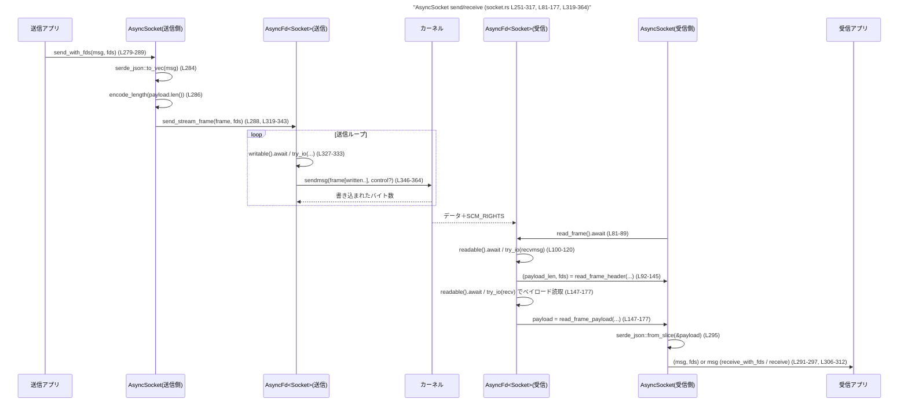
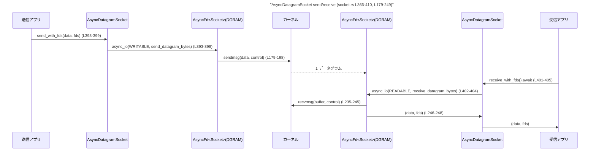

shell-escalation/src/unix/socket.rs

---

## 0. ざっくり一言

UNIX ドメインソケットを `tokio::io::unix::AsyncFd` でラップし、  
JSON シリアライズされたメッセージとファイルディスクリプタ（FD）を、安全に送受信するための非同期ストリーム / データグラム通信ユーティリティを提供するモジュールです（`shell-escalation/src/unix/socket.rs` 全体）。

---

## 1. このモジュールの役割

### 1.1 概要

- このモジュールは **UNIX ドメインソケット上でのメッセージ送受信と FD 受け渡し** を行うために存在し、以下の機能を提供します。
  - ストリームソケット（`SOCK_STREAM`）上で、**長さプレフィックス付きフレーム**＋任意個の FD を送受信する機構（`AsyncSocket`）。  
  - データグラムソケット（`SOCK_DGRAM`）上で、1 データグラムにバイト列＋FD 群を載せて送受信する機構（`AsyncDatagramSocket`）。  
  - `libc::CMSG_*` マクロを使った SCM_RIGHTS コントロールメッセージの組み立て／分解ロジック。

### 1.2 アーキテクチャ内での位置づけ

このファイル内の依存関係を簡略化して示します。

```mermaid
graph TD
    subgraph "socket.rs (L19-410)"
        A[AsyncSocket<br/>(L251-317)]
        B[AsyncDatagramSocket<br/>(L366-410)]
        C[read_frame / read_frame_header / read_frame_payload<br/>(L81-177)]
        D[send_stream_frame / send_stream_chunk<br/>(L319-364)]
        E[send_datagram_bytes / receive_datagram_bytes<br/>(L179-249)]
        F[make_control_message / extract_fds<br/>(L44-79, L210-233)]
        G[assume_init* ヘルパ<br/>(L23-42)]
    end

    A --> C
    A --> D
    B --> E
    C --> G
    C --> F
    D --> F
    E --> F
```

- `AsyncSocket` はストリームベースの高レベル API で、内部で `read_frame*` / `send_stream_*` を呼び出します（L251-317, L81-177, L319-364）。
- `AsyncDatagramSocket` はデータグラム用高レベル API で、内部で `send_datagram_bytes` / `receive_datagram_bytes` を使います（L366-410, L179-249）。
- `make_control_message` / `extract_fds` が FD 受け渡しの中心ロジックで、両方のソケット種別から利用されています（L48-79, L210-233）。
- `assume_init*` 群は `MaybeUninit` を安全なスライス／ベクタに変換するための小さな unsafe ヘルパです（L23-42）。

### 1.3 設計上のポイント

コードから読み取れる特徴を挙げます。

- **フレーミング方式**（L81-89, L91-145, L147-177）
  - ストリームでは、`u32` 小端エンディアンの長さプレフィックス（4 バイト）＋ペイロードというフレーム形式を採用しています。
  - ヘッダ（長さ）読み取り時に、FD を含む制御メッセージも同時に受信します。

- **FD 伝送の扱い**（L44-79, L210-233）
  - `SCM_RIGHTS` コントロールメッセージとして FD 群を送受信します。
  - 1 メッセージあたりの FD 数を `MAX_FDS_PER_MESSAGE = 16` で制限しています（L19）。
  - 受信側では `OwnedFd` でラップし、自動クローズを保証します。

- **非同期 I/O と並行性**（L85-88, L100-127, L157-163, L324-333, L393-405）
  - `tokio::io::unix::AsyncFd` を使い、`readable()` / `writable()` や `async_io()` で OS のレディネス待ち＋`try_io` ループを実装しています。
  - ループ内で `EWOULDBLOCK`（`_would_block`）を検出すると再度レディネス待ちを行い、スピンを避けています。

- **unsafe の局所化と `MaybeUninit` 利用**（L23-42, L51-77, L155-173, L219-230, L236-248）
  - 生のバッファを OS に渡すために `MaybeUninit<u8>` ベクタを用い、読み取った部分だけを `assume_init*` ヘルパで安全な型に変換しています。
  - `libc::CMSG_*` マクロでのコントロールメッセージ操作はすべて `unsafe` ブロックに閉じ込めています。

- **エラーハンドリング方針**
  - I/O エラーはすべて `std::io::Error` として返却します（全体的に `std::io::Result`）。
  - 想定外の状況（0 バイト読み取り、ヘッダ未満での切断等）は `UnexpectedEof` や `WriteZero` として明示的にエラー化しています（L128-133, L164-168, L188-196, L334-338）。
  - メッセージサイズや FD 数が制限を超える場合は `InvalidInput` エラーです（L200-207, L210-216, テスト L489-495, L498-504）。

---

## 2. 主要な機能一覧

このモジュールが提供する主な機能です。

- `AsyncSocket::pair`: UNIX ストリームソケットの非同期ペアを生成する（L268-277）。
- `AsyncSocket::from_fd`: 既存の `OwnedFd` から `AsyncSocket` を構築する（L264-266）。
- `AsyncSocket::send_with_fds`: JSON シリアライズされたメッセージと FD 群を 1 フレームとして送信する（L279-289）。
- `AsyncSocket::receive_with_fds`: 1 フレームを受信し、JSON デシリアライズ＋FD 群を返す（L291-297）。
- `AsyncSocket::send` / `receive`: FD 無しメッセージの送受信用ショートハンド（L299-312）。
- `AsyncDatagramSocket::pair`: UNIX データグラムソケットの非同期ペアを生成する（L382-390）。
- `AsyncDatagramSocket::from_raw_fd`: RawFd から非同期データグラムソケットを構築する（unsafe）（L378-380）。
- `AsyncDatagramSocket::send_with_fds`: 1 データグラムにバイト列＋FD 群を載せて送信する（L393-399）。
- `AsyncDatagramSocket::receive_with_fds`: 1 データグラムを受信し、バイト列＋FD 群を返す（L401-405）。
- FD コントロールメッセージ処理:
  - `make_control_message`: FD 群から `SCM_RIGHTS` コントロールバッファを生成（L210-233）。
  - `extract_fds`: 受信したコントロールバッファから FD 群を抽出（L48-79）。
- フレーム I/O:
  - `read_frame_header` / `read_frame_payload` / `read_frame`: ストリーム上でのフレーム受信（L81-145, L147-177）。
  - `send_stream_frame` / `send_stream_chunk`: ストリーム上でのフレーム送信（L319-364）。
- データグラム I/O:
  - `send_datagram_bytes` / `receive_datagram_bytes`: 生バイト列と FD 群の送受信（L179-249）。

---

## 3. 公開 API と詳細解説

### 3.1 型一覧（構造体）

| 名前 | 種別 | 役割 / 用途 | 定義位置 |
|------|------|-------------|----------|
| `AsyncSocket` | 構造体 | 非同期 UNIX ストリームソケット。JSON フレーム＋FD 受け渡しの高レベル API を提供する。 | `shell-escalation/src/unix/socket.rs:L251-L317` |
| `AsyncDatagramSocket` | 構造体 | 非同期 UNIX データグラムソケット。バイト列＋FD 受け渡しの高レベル API を提供する。 | `shell-escalation/src/unix/socket.rs:L366-L410` |

内部ユーティリティ型（`MaybeUninitSlice`, `MsgHdr` など）は外部クレート `socket2` 由来で、このファイルでは定義していません。

### 3.2 関数詳細（主要 7 件）

#### `AsyncSocket::pair() -> std::io::Result<(AsyncSocket, AsyncSocket)>`  

（`shell-escalation/src/unix/socket.rs:L268-L277`）

**概要**

- 接続済みの UNIX ストリームソケットペアを生成し、それぞれを非同期対応の `AsyncSocket` にラップして返します。

**引数**

- なし。

**戻り値**

- `Ok((server, client))`: 接続済みの `AsyncSocket` ペア。
- `Err(e)`: ソケット生成またはフラグ設定、非同期ラップに失敗した場合の I/O エラー。

**内部処理の流れ**

1. `Socket::pair_raw(Domain::UNIX, Type::STREAM, None)` で、生の UNIX ストリームソケットペアを生成（L273）。
2. 双方のソケットに `set_cloexec(true)` を設定し、`CLOEXEC` フラグを明示的に有効化（L274-275）。
3. 各ソケットを `AsyncSocket::new` に渡し、`AsyncFd` ラップ＋非ブロッキング設定を行う（L256-262, L276）。
4. 問題なければ `(AsyncSocket, AsyncSocket)` のタプルを `Ok` で返す（L276）。

**Examples（使用例）**

```rust
// ストリームソケットペアを作成し、片方からもう片方へメッセージを送る例
use serde::{Serialize, Deserialize};
use shell_escalation::unix::socket::AsyncSocket; // 実際のパスはクレート構成に依存

#[derive(Serialize, Deserialize)]
struct Msg {
    text: String,
}

#[tokio::main]
async fn main() -> std::io::Result<()> {
    let (server, client) = AsyncSocket::pair()?; // 非同期ソケットペアを生成

    let send_task = tokio::spawn(async move {
        client.send(Msg { text: "hello".into() }).await
    });

    let recv_msg: Msg = server.receive().await?;
    println!("{}", recv_msg.text);

    send_task.await??;
    Ok(())
}
```

**Errors / Panics**

- `Socket::pair_raw` が失敗した場合（例：リソース不足）、その `std::io::Error` が返ります（L273）。
- `set_cloexec(true)`、`AsyncFd::new` が失敗した場合も同様です（L274-275, L256-262）。
- パニックを発生させる箇所はありません。

**Edge cases（エッジケース）**

- ソケット数やドメインは固定（UNIX / STREAM）であり、変更はできません。
- `AsyncFd::new` に失敗する可能性があるため、呼び出し側は `Result` を確認する必要があります。

**使用上の注意点**

- 生成されるペアはすでに互いに接続済みです。`connect` や `bind` を行う必要はありません。
- 片方を `drop` すると、もう片方の `receive` 側では `UnexpectedEof` が返る可能性があります（テストで確認されています、L513-521）。

---

#### `AsyncSocket::send_with_fds<T: Serialize>(&self, msg: T, fds: &[OwnedFd]) -> std::io::Result<()>`  

（`shell-escalation/src/unix/socket.rs:L279-L289`）

**概要**

- 任意の `Serialize` 実装型 `T` を JSON にエンコードし、フレーム（長さ 4 バイト＋ペイロード）として送信します。
- 同時に、`fds` に含まれるファイルディスクリプタを `SCM_RIGHTS` として 1 回だけ送ります。

**引数**

| 引数名 | 型 | 説明 |
|--------|----|------|
| `msg` | `T: Serialize` | JSON でシリアライズされるメッセージ本体。 |
| `fds` | `&[OwnedFd]` | 送信したい FD の配列。最大 `MAX_FDS_PER_MESSAGE` 個。 |

**戻り値**

- `Ok(())`: フレーム全体と FD 群が正常に送信された。
- `Err(e)`: シリアライズ・サイズ変換・送信のいずれかでエラー。

**内部処理の流れ**

1. `serde_json::to_vec(&msg)` でメッセージを JSON バイト列に変換（L284）。
2. フレーム用 `Vec<u8>` を `LENGTH_PREFIX_SIZE + payload.len()` の容量で確保（L285）。
3. `encode_length(payload.len())` で長さ 4 バイトを小端エンディアンで生成し、フレームに追加（L286, L200-207）。
4. ペイロード本体をフレームに追加（L287）。
5. `send_stream_frame(&self.inner, &frame, fds).await` で非同期送信（L288, L319-343）。

**Examples（使用例）**

```rust
#[derive(Serialize)]
struct Command {
    cmd: String,
}

async fn send_with_fd(sock: &AsyncSocket, fd: OwnedFd) -> std::io::Result<()> {
    let fds = [fd];
    let msg = Command { cmd: "run".into() };
    sock.send_with_fds(msg, &fds).await
}
```

**Errors / Panics**

- シリアライズ失敗時（例：循環参照など）、`serde_json::Error` が `std::io::Error` に変換されて返ります（変換はこのファイル外、L284）。
- `encode_length` が `len > u32::MAX` の場合に `InvalidInput` を返します（L200-207, テスト L507-511）。
- `send_stream_frame` 内でソケットエラーや `WriteZero` が発生する可能性があります（L324-343）。
- パニックは使用していません。

**Edge cases（エッジケース）**

- `fds` が空の場合でも、ペイロードは通常どおり送信されます。FD は添付されません（`include_fds = !fds.is_empty()`, L325）。
- `fds.len() > MAX_FDS_PER_MESSAGE` の場合、内部で呼ばれる `send_stream_chunk` → `make_control_message` が `InvalidInput` を返します（L346-354, L210-216）。

**使用上の注意点**

- 1 フレームにつき FD を送るのは最初のチャンクのみです（`include_fds` が初回だけ true, L325-341）。同じフレームで二度 FD が送られることはありません。
- 非同期関数のため、`await` を忘れると送信が行われない点に注意が必要です。
- 非変数 `self` 参照（`&self`）なので、複数タスクから同時に呼び出すことは型システム上可能ですが、同じストリームに対する並行送信はフレーム境界の混在を招く可能性があります。そのため、実用上は1ソケットについて送信側は直列化して扱うのが自然です（これは一般的なストリーム通信の性質に基づく説明です）。

---

#### `AsyncSocket::receive_with_fds<T: for<'de> Deserialize<'de>>(&self) -> std::io::Result<(T, Vec<OwnedFd>)>`  

（`shell-escalation/src/unix/socket.rs:L291-L297`）

**概要**

- 1 フレームを受信し、そのペイロードを JSON としてデシリアライズして値 `T` に変換します。
- 同時に、ヘッダ受信時に添付されていた FD 群を `Vec<OwnedFd>` として返します。

**引数**

- なし（ジェネリクス `T` のみ）。

**戻り値**

- `Ok((message, fds))`: デシリアライズされたメッセージと、そのフレームに添付されていた FD 群。
- `Err(e)`: 受信（I/O）または JSON デシリアライズに失敗した場合のエラー。

**内部処理の流れ**

1. `read_frame(&self.inner).await?` で `(payload, fds)` を受信（L294, L81-89）。
   - ここでヘッダ読み取り＋ペイロード読み取り＋FD 抽出が行われます。
2. `serde_json::from_slice(&payload)` で `T` にデシリアライズ（L295）。
3. 成功した場合 `(message, fds)` を返す（L296）。

**Examples（使用例）**

```rust
#[derive(Deserialize)]
struct Response {
    status: u32,
}

async fn recv_with_fd(sock: &AsyncSocket) -> std::io::Result<(Response, Vec<OwnedFd>)> {
    sock.receive_with_fds::<Response>().await
}
```

**Errors / Panics**

- `read_frame` がヘッダ未満での切断やソケットエラーを検知すると、そのエラー（例：`UnexpectedEof`）が返ります（L128-133, L164-168）。
- JSON デシリアライズに失敗すると、そのエラーが `std::io::Error` に変換されて返ります（L295）。
- パニックを発生させる箇所はありません。

**Edge cases（エッジケース）**

- 受信したペイロードが `T` の構造に合わない場合、デシリアライズエラーになります。
- ペイロード長が送信側で `u32::MAX` まで許容されているため、非常に大きなメッセージ長を宣言されると、そのサイズでバッファ確保を試みます（L139-140, L147-155）。これはメモリ使用量に影響します。

**使用上の注意点**

- 同期的にフレーム境界を守るため、通常は1ソケットに対して受信側も 1 タスクに限定するのが自然な使い方です（ストリームの読み取りが順序依存であるため）。
- FD の所有権は `OwnedFd` に移るため、返された FD をクローズしない場合でも、`OwnedFd` のドロップ時に自動でクローズされます。

---

#### `AsyncSocket::receive<T: for<'de> Deserialize<'de>>(&self) -> std::io::Result<T>`  

（`shell-escalation/src/unix/socket.rs:L306-L312`）

**概要**

- `receive_with_fds` の簡易版で、FD の受信を想定しないケース向けの API です。
- もし FD が添付されていた場合は破棄され、警告ログを出力します。

**引数**

- なし（ジェネリクス `T` のみ）。

**戻り値**

- `Ok(msg)`: 受信したメッセージ。
- `Err(e)`: 受信またはデシリアライズエラー。

**内部処理の流れ**

1. `self.receive_with_fds().await?` で `(msg, fds)` を取得（L307）。
2. `fds` が空でない場合は `tracing::warn!` で警告ログを出力し、FD を破棄（L308-310）。
3. `msg` を返す（L311）。

**Errors / Panics**

- `receive_with_fds` と同様のエラー（I/O, デシリアライズ）がそのまま返ります。
- パニックはありません。

**Edge cases / 使用上の注意点**

- 想定外の FD が添付されていると、ログに `"unexpected fds in receive: {}"` が出力されます（L308-310）。
- FD は戻り値に含まれないため、FD を活用したい場合は必ず `receive_with_fds` を使用する必要があります。

---

#### `AsyncDatagramSocket::pair() -> std::io::Result<(Self, Self)>`  

（`shell-escalation/src/unix/socket.rs:L382-L390`）

**概要**

- 接続済み UNIX データグラムソケットペアを生成し、それぞれを非同期対応の `AsyncDatagramSocket` にラップして返します。

**引数**

- なし。

**戻り値**

- `Ok((server, client))`: 非同期データグラムソケットのペア。
- `Err(e)`: ソケット生成やラップに失敗した場合のエラー。

**内部処理の流れ**

1. `Socket::pair_raw(Domain::UNIX, Type::DGRAM, None)` でペアを生成（L387）。
2. `set_cloexec(true)` を両端に適用（L388-389）。
3. `Self::new` に渡し、非ブロッキング＋`AsyncFd` ラップ（L371-376, L390）。
4. `(Self, Self)` を返す（L390）。

**Errors / Edge cases / 注意点**

- 内容は `AsyncSocket::pair` とほぼ同様です。違いはソケット種別が `Type::DGRAM` である点のみです（L387）。
- データグラムはコネクションレスですが、ここではペアが互いに通信できる状態で提供されます。

---

#### `AsyncDatagramSocket::send_with_fds(&self, data: &[u8], fds: &[OwnedFd]) -> std::io::Result<()>`  

（`shell-escalation/src/unix/socket.rs:L393-L399`）

**概要**

- 任意のバイト列 `data` を 1 データグラムとして送信し、同時に `fds` 内の FD を `SCM_RIGHTS` コントロールメッセージとして添付します。

**引数**

| 引数名 | 型 | 説明 |
|--------|----|------|
| `data` | `&[u8]` | 送信するデータ。1 データグラムのペイロード。 |
| `fds` | `&[OwnedFd]` | 添付する FD 群。 |

**戻り値**

- `Ok(())`: データグラム送信成功。
- `Err(e)`: レディネス待ちまたは送信中に発生した I/O エラー。

**内部処理の流れ**

1. `self.inner.async_io(Interest::WRITABLE, |socket| send_datagram_bytes(socket, data, fds))` を呼び出し、書き込みレディになるまで待機（L393-398）。
2. レディになったら `send_datagram_bytes` に実際の送信処理を委譲（L394-397, L179-198）。
3. その結果の `std::io::Result` をそのまま返却（L398）。

**Errors / Edge cases / 注意点**

- `fds.len() > MAX_FDS_PER_MESSAGE` の場合、`send_datagram_bytes` 内で `InvalidInput` が返ります（L179-181, L210-216, テスト L489-495）。
- データグラムが大きすぎる場合、OS 側で `EMSGSIZE` 等のエラーになり得ますが、その場合は `sendmsg` がエラーを返し、ここでもエラーになります（L187）。
- データグラムはストリームと異なり、「1 回の send が 1 データグラム」に対応します。この関数では部分書き込みを検知し、`WriteZero` エラーに変換しています（L188-196）。

---

#### `async fn read_frame_header(async_socket: &AsyncFd<Socket>) -> std::io::Result<(usize, Vec<OwnedFd>)>`  

（`shell-escalation/src/unix/socket.rs:L92-L145`）

**概要**

- ストリームソケットから **フレーム長（4 バイト）** を読み取り、その際に付随していた FD 群をコントロールメッセージから抽出します。
- FD はヘッダを受信したタイミングでのみ収集します。

**引数**

| 引数名 | 型 | 説明 |
|--------|----|------|
| `async_socket` | `&AsyncFd<Socket>` | 非同期ストリームソケットへの参照。 |

**戻り値**

- `Ok((payload_len, fds))`: ペイロード長（バイト数）と、ヘッダ受信時に添付された FD 群。
- `Err(e)`: 受信中の I/O エラーや早期切断 (`UnexpectedEof`)。

**内部処理の流れ**

1. ヘッダ用バッファ `header`（`[MaybeUninit<u8>; LENGTH_PREFIX_SIZE]`）と、FD 用コントロールバッファ `control` を初期化（L95-98）。
2. `filled` を追跡しながら、`while filled < LENGTH_PREFIX_SIZE` ループで必要な 4 バイトに達するまで読み続ける（L100-135）。
3. 最初の読み取りでは `recvmsg` を使い、データ＋コントロールメッセージを受信（L103-115, L107-112）。
   - `msg.control_len()` で実際に使用されたコントロール長を取得し、`control.truncate(control_len)` で未使用領域を切り捨て（L113）。
   - `captured_control = true` として、以降はコントロールメッセージを期待しない（L114）。
4. 2 回目以降の読み取りは `recv` でバイト列のみを受信（L121-127）。
5. 読み取り結果が 0 バイトだった場合、`UnexpectedEof` としてエラーを返す（L128-133）。
6. `filled == LENGTH_PREFIX_SIZE` に達したら、`assume_init_slice(&header)` で `[u8; 4]` に変換し、`u32::from_le_bytes` で長さを算出（L138-139）。
7. `extract_fds(assume_init(&control))` で FD 群を抽出し、`(payload_len, fds)` を返す（L140-141）。

**Examples（使用例）**

この関数は内部用で、通常は直接呼び出さず `read_frame` や `AsyncSocket::receive_with_fds` 経由で使用します（L85-88, L291-297）。

**Errors / Panics**

- ソケットからの 0 バイト読み取り時に `UnexpectedEof` を返します（L128-133）。
- `recvmsg` / `recv` が返した I/O エラーはそのまま返却されます（L117-119, L123-125）。
- `assert!(filled <= LENGTH_PREFIX_SIZE)` による debug アサートがあります（L136）。これはコンパイルオプションによってはパニック要因になり得ます（デバッグビルド時）。

**Edge cases / 使用上の注意点**

- `payload_len` は `u32` から `usize` への変換のみ行っており、上限チェックはありません（L139）。  
  そのため、送信側が極端に大きな長さを宣言すると、そのサイズでのバッファ確保を試みる点に注意が必要です。
- FD は「最初の読み取り（ヘッダの一部）」でのみ取得します。FD をペイロード読み取り時に追加で送る設計にはなっていません。

---

#### `fn make_control_message(fds: &[OwnedFd]) -> std::io::Result<Vec<u8>>`  

（`shell-escalation/src/unix/socket.rs:L210-L233`）

**概要**

- 与えられた FD 群を `SCM_RIGHTS` コントロールメッセージ形式のバイト列にエンコードします。

**引数**

| 引数名 | 型 | 説明 |
|--------|----|------|
| `fds` | `&[OwnedFd]` | エンコード対象の FD 群。 |

**戻り値**

- `Ok(control_buf)`: `sendmsg` に渡すためのコントロールバッファ。
- `Err(e)`: FD 数が上限を超えた場合などの `InvalidInput`。

**内部処理の流れ**

1. `fds.len() > MAX_FDS_PER_MESSAGE` の場合、`InvalidInput` エラーを返す（L210-216）。
2. `fds.is_empty()` の場合、空の `Vec<u8>` を返す（L216-217）。
3. それ以外の場合:
   - `control_space_for_fds(fds.len())` で必要なバッファサイズを計算（L219, L44-46）。
   - `vec![0u8; …]` でゼロ初期化されたバッファを確保（L219）。
   - `unsafe` ブロック内で
     - `cmsghdr` ヘッダ構造体をバッファ先頭に配置（L221）。
     - `cmsg_len`, `cmsg_level`（`SOL_SOCKET`）, `cmsg_type`（`SCM_RIGHTS`）を設定（L222-225）。
     - `CMSG_DATA` ポインタから FD 配列部分に生 FD を書き込み（`fd.as_raw_fd()`）（L226-229）。
4. コントロールバッファを `Ok` で返す（L231）。

**Errors / Edge cases / 使用上の注意点**

- `fds.len() == 0` の場合は空バッファとなり、FD 無しの送信になります。
- 生ポインタを扱う `unsafe` な処理のため、FD 数やバッファサイズの整合性はこの関数の前提条件です。  
  呼び出し側では `fds.len()` 以外の前提（FD が有効であることなど）は保証されていませんが、OS の `sendmsg` が無効な FD に対してエラーを返す可能性があります。
- テストにより、過剰な FD 数に対して `InvalidInput` が返ることを確認しています（L489-495, L498-504）。

---

### 3.3 その他の関数・メソッド一覧

内部ヘルパやシンプルなラッパ関数を一覧します。

#### トップレベル関数

| 関数名 | 役割（1 行） | 定義位置 |
|--------|--------------|----------|
| `assume_init<T>` | `&[MaybeUninit<T>]` を、すべて初期化済みである前提で `&[T]` に変換する unsafe ヘルパ。 | `shell-escalation/src/unix/socket.rs:L26-L28` |
| `assume_init_slice<T, const N>` | 固定長配列版の `assume_init`。 | `shell-escalation/src/unix/socket.rs:L30-L32` |
| `assume_init_vec<T>` | `Vec<MaybeUninit<T>>` を、全要素初期化済みである前提で `Vec<T>` に変換する。 | `shell-escalation/src/unix/socket.rs:L34-L41` |
| `control_space_for_fds` | 指定個数の FD を格納するために必要な `CMSG_SPACE` サイズ（バイト数）を計算する。 | `shell-escalation/src/unix/socket.rs:L44-L46` |
| `extract_fds` | `SCM_RIGHTS` を含むコントロールバッファから FD 群を取り出し、`OwnedFd` にラップして返す。 | `shell-escalation/src/unix/socket.rs:L48-L79` |
| `read_frame` | ストリームからヘッダ＋ペイロード＋FD 群をまとめて読み取る高レベル関数。 | `shell-escalation/src/unix/socket.rs:L81-L89` |
| `read_frame_payload` | フレームペイロード本体を、指定バイト数だけ繰り返し読み取る。 | `shell-escalation/src/unix/socket.rs:L148-L177` |
| `send_datagram_bytes` | 単一データグラムとして `data` と FD 群を送信する。 | `shell-escalation/src/unix/socket.rs:L179-L198` |
| `encode_length` | `usize` 長さを `u32` に変換し、小端エンディアンの 4 バイト配列として返す。 | `shell-escalation/src/unix/socket.rs:L200-L207` |
| `receive_datagram_bytes` | 最大 `MAX_DATAGRAM_SIZE` バイトのデータグラムを受信し、データ＋FD 群を返す。 | `shell-escalation/src/unix/socket.rs:L235-L249` |
| `send_stream_frame` | フレーム全体を `AsyncFd<Socket>` に対して非同期に書き込み、FD は最初のチャンクでのみ送る。 | `shell-escalation/src/unix/socket.rs:L319-L343` |
| `send_stream_chunk` | 1 回の `sendmsg` 呼び出しでフレームの一部と（必要なら）FD 群を送信する。 | `shell-escalation/src/unix/socket.rs:L346-L364` |

#### `AsyncSocket` のメソッド

| メソッド名 | 役割 | 定義位置 |
|-----------|------|----------|
| `AsyncSocket::new` | `Socket` を非ブロッキングにして `AsyncFd<Socket>` でラップする内部コンストラクタ。 | `shell-escalation/src/unix/socket.rs:L255-L262` |
| `AsyncSocket::from_fd` | `OwnedFd` から `Socket::from(fd)` で `Socket` を構築し、`AsyncSocket::new` へ渡す。 | `shell-escalation/src/unix/socket.rs:L264-L266` |
| `AsyncSocket::pair` | 前述のとおり。 | `L268-L277` |
| `AsyncSocket::send_with_fds` | 前述のとおり。 | `L279-L289` |
| `AsyncSocket::receive_with_fds` | 前述のとおり。 | `L291-L297` |
| `AsyncSocket::send` | FD 無しのメッセージ送信のショートハンド。 | `shell-escalation/src/unix/socket.rs:L299-L304` |
| `AsyncSocket::receive` | FD 無しのメッセージ受信のショートハンド。 | `shell-escalation/src/unix/socket.rs:L306-L312` |
| `AsyncSocket::into_inner` | 内部の `Socket` を取り出し、`AsyncSocket` を消費する。 | `shell-escalation/src/unix/socket.rs:L314-L316` |

#### `AsyncDatagramSocket` のメソッド

| メソッド名 | 役割 | 定義位置 |
|-----------|------|----------|
| `AsyncDatagramSocket::new` | `Socket` を非ブロッキングにして `AsyncFd<Socket>` でラップする内部コンストラクタ。 | `shell-escalation/src/unix/socket.rs:L371-L376` |
| `AsyncDatagramSocket::from_raw_fd` | unsafe: `RawFd` から `Socket::from_raw_fd` でソケットを構築し、`new` へ渡す。 | `shell-escalation/src/unix/socket.rs:L378-L380` |
| `AsyncDatagramSocket::pair` | 前述のとおり。 | `L382-L390` |
| `AsyncDatagramSocket::send_with_fds` | 前述のとおり。 | `L393-L399` |
| `AsyncDatagramSocket::receive_with_fds` | `async_io(READABLE, receive_datagram_bytes)` で 1 データグラムを受信。 | `shell-escalation/src/unix/socket.rs:L401-L405` |
| `AsyncDatagramSocket::into_inner` | 内部の `Socket` を取り出す。 | `shell-escalation/src/unix/socket.rs:L407-L409` |

---

## 4. データフロー

代表的なシナリオとして、`AsyncSocket` での **メッセージ＋FD 送受信** の流れを示します。

### 4.1 ストリームフレーム送信・受信のフロー



要点:

- 送信側はメッセージを JSON にエンコードし、長さプレフィックス＋ペイロードのフレームを構築します。
- FD はフレームの**最初の `sendmsg` 呼び出し**時に `SCM_RIGHTS` として送られます（L325-341, L346-354）。
- 受信側はまず長さヘッダを読みつつ FD を抽出し、その後にペイロードを指定バイト数だけ読み込みます。

### 4.2 データグラムでの送受信フロー（簡略）



---

## 5. 使い方（How to Use）

### 5.1 基本的な使用方法（ストリームソケット）

以下は、`AsyncSocket` で構造体メッセージと FD を往復させる例です。

```rust
use serde::{Serialize, Deserialize};
use std::os::fd::OwnedFd;
use tokio::task;
use shell_escalation::unix::socket::AsyncSocket; // 実際のパスはクレート構成に依存

#[derive(Serialize, Deserialize, Debug, PartialEq, Eq)]
struct TestPayload {
    id: i32,
    label: String,
}

async fn example() -> std::io::Result<()> {
    // 1. ソケットペア生成
    let (server, client) = AsyncSocket::pair()?; // L268-L277

    // 2. 送信側タスクを起動
    let send_task = task::spawn(async move {
        let payload = TestPayload { id: 7, label: "round-trip".into() };
        let fds: Vec<OwnedFd> = Vec::new(); // ここでは FD は送らない
        client.send_with_fds(payload, &fds).await // L279-L289
    });

    // 3. 受信側でメッセージを受信
    let (received_payload, received_fds) = server.receive_with_fds::<TestPayload>().await?; // L291-L297
    assert!(received_fds.is_empty());
    println!("{:?}", received_payload);

    send_task.await??;
    Ok(())
}
```

ポイント:

- ソケットペアは `AsyncSocket::pair()` で簡単に用意できます。
- メッセージ型 `T` は `Serialize` / `Deserialize` を実装している必要があります。
- FD を送らない場合でも、`send_with_fds(..., &[])` / `receive_with_fds` で利用できます。

### 5.2 よくある使用パターン

1. **FD 無しのメッセージのみ送受信**
   - `send` / `receive` を使用（L299-304, L306-312）。
   - FD が誤って送られてきた場合は `warn` ログが出て FD は破棄されます。

   ```rust
   // メッセージだけ送る
   sock.send(my_struct).await?;
   let reply: MyReply = sock.receive().await?;
   ```

2. **FD 付きのメッセージ送受信**
   - `send_with_fds` / `receive_with_fds` を使用し、戻り値の `Vec<OwnedFd>` を利用します。

   ```rust
   let fds: Vec<OwnedFd> = vec![open_some_fd()?];
   sock.send_with_fds(request, &fds).await?;
   let (response, received_fds) = sock.receive_with_fds::<Response>().await?;
   ```

3. **データグラムでのシンプルなバイト列送受信**

   ```rust
   let (server, client) = AsyncDatagramSocket::pair()?; // L382-L390

   let data = b"hello".to_vec();
   client.send_with_fds(&data, &[]).await?;

   let (received, fds) = server.receive_with_fds().await?;
   assert_eq!(received, data);
   assert!(fds.is_empty());
   ```

### 5.3 よくある間違いと注意点の例

```rust
// 間違い例: FD が付いてくる可能性があるのに receive() を使う
async fn bad(sock: &AsyncSocket) -> std::io::Result<()> {
    let _msg: serde_json::Value = sock.receive().await?; // L306-L312
    // FD が送られてきた場合でも、ここでは警告ログが出るだけで FD は破棄される
    Ok(())
}

// 正しい例: FD を利用する可能性があるなら receive_with_fds() を使う
async fn good(sock: &AsyncSocket) -> std::io::Result<()> {
    let (_msg, fds): (serde_json::Value, Vec<OwnedFd>) =
        sock.receive_with_fds().await?; // L291-L297
    // 必要に応じて fds を利用する
    Ok(())
}
```

```rust
// 間違い例: 一つの AsyncSocket を複数タスクで並列に receive する
async fn bad_concurrent(sock: &AsyncSocket) {
    // 2 つのタスクが同じソケットから同時に読み取る
    let h1 = tokio::spawn(async move { sock.receive::<serde_json::Value>().await });
    let h2 = tokio::spawn(async move { sock.receive::<serde_json::Value>().await });
    // どのフレームをどちらが読むかは未定義で、フレーム境界の混在を招き得る
}

// 推奨パターン: 受信は 1 タスクで直列に処理し、必要なら内部で分配
async fn recommended(sock: &AsyncSocket) -> std::io::Result<()> {
    loop {
        let msg: serde_json::Value = sock.receive().await?;
        // メッセージをキューなどを通じて他タスクに渡す
    }
}
```

### 5.4 使用上の注意点（まとめ）

- **FD 数の制限**
  - 1 メッセージ / データグラムで扱える FD は `MAX_FDS_PER_MESSAGE = 16` 個までです（L19）。  
    超えると `InvalidInput` エラーになります（L210-216, テスト L489-495, L498-504）。

- **メッセージ長の扱い**
  - 送信側は `encode_length` により `u32::MAX` まで送信可能ですが、それを `usize` に変換する際に上限チェックは行っていません（L139, L200-207）。  
    非常に大きい長さが指定された場合、ヒープにそのサイズのバッファを確保しようとするため、メモリ使用量に注意が必要です。

- **データグラムの最大サイズ**
  - 受信は `MAX_DATAGRAM_SIZE = 8192` バイトのバッファで行われます（L21, L235-237）。  
    これを超える大きさのデータグラムを OS が受信した場合、カーネル側でデータが切り詰められ、`read` バイト数だけが `data` として返されます（L246）。  
    このコードでは「切り詰められたかどうか」を検出していません。

- **unsafe コードの前提**
  - `assume_init*` を使う箇所では、「指定した範囲のバッファは OS によって完全に書き込まれている」ことが前提です（L23-42, L95-98, L155-173, L235-248）。  
    現在のロジックでは、読み取ったバイト数を厳密に追跡してから変換しているため、その前提と整合しています。

- **生 FD の扱い**
  - `AsyncDatagramSocket::from_raw_fd` は unsafe であり、呼び出し側が「有効なデータグラムソケット FD である」ことを保証する必要があります（L378-380）。
  - `extract_fds` は受信した FD を `OwnedFd::from_raw_fd` で所有権ごとラップするため、二重クローズを避けるには FD を他で `close` しないようにする必要があります（L72-74）。

---

## 6. 変更の仕方（How to Modify）

### 6.1 新しい機能を追加する場合

例として、「JSON 以外のシリアライズ形式（バイナリ形式など）」を追加するケースを想定した変更の入口を示します。

1. **シリアライズ／デシリアライズ層**
   - 送信側: `AsyncSocket::send_with_fds` の `serde_json::to_vec` 部分（L284）。
   - 受信側: `AsyncSocket::receive_with_fds` の `serde_json::from_slice` 部分（L295）。
   - ここを差し替えることで、フレーミングや FD 周りを変えずにペイロード形式を変更できます。

2. **フレーミング仕様を変えたい場合**
   - ヘッダ読み書き: `encode_length`（L200-207）、`read_frame_header`（L92-145）。
   - ペイロード読み書き: `read_frame_payload`（L148-177）、`send_stream_frame` / `send_stream_chunk`（L319-364）。
   - 長さのエンコード方法やヘッダ構造を変える場合は、これらの関数群が主な変更対象になります。

3. **FD の扱い方を拡張したい場合**
   - 送信側 FD エンコード: `make_control_message`（L210-233）。
   - 受信側 FD デコード: `extract_fds`（L48-79）。
   - 1 フレームに複数の `SCM_RIGHTS` メッセージを含める、などの仕様変更はこれらを中心に検討します。

### 6.2 既存の機能を変更する場合の注意点

- **契約の確認**
  - `MAX_FDS_PER_MESSAGE` や `MAX_DATAGRAM_SIZE` は、モジュール全体で一貫した前提になっています（L19, L21）。  
    これらを変更する場合は、関連するテスト（L489-495 など）も併せて確認する必要があります。
  - `encode_length` の挙動（`usize` → `u32` 変換と `InvalidInput` エラー）はテストで固定されています（L507-511）。

- **影響範囲の把握**
  - ストリーム系の変更は主に `AsyncSocket` と `read_frame*` / `send_stream_*` に影響します（L251-317, L81-177, L319-364）。
  - データグラム系の変更は `AsyncDatagramSocket` と `send_datagram_bytes` / `receive_datagram_bytes` に影響します（L366-410, L179-249）。
  - FD 処理の変更は両方のソケット種別に影響するため、`make_control_message` / `extract_fds` の呼び出し元をすべて確認する必要があります。

- **テストとの対応**
  - テストモジュール `tests`（L412-523）がこのファイルの挙動を直接検証しています。
  - 主なテスト:
    - `async_socket_round_trips_payload_and_fds`（L437-460）: ストリームでのペイロード＋FD の往復。
    - `async_socket_handles_large_payload`（L462-471）: 大きめ（10,000 バイト）のペイロード送受信。
    - `async_datagram_sockets_round_trip_messages`（L473-487）: データグラムでのメッセージ＋FD の往復。
    - `send_datagram_bytes_rejects_excessive_fd_counts`（L489-495）・`send_stream_chunk_rejects_excessive_fd_counts`（L498-504）: FD 数上限の検証。
    - `encode_length_errors_for_oversized_messages`（L507-511）: 長さエンコードのエラー条件。
    - `receive_fails_when_peer_closes_before_header`（L513-521）: ヘッダ受信前にピアが閉じた場合の `UnexpectedEof`。

---

## 7. 関連ファイル

このファイル内部のテスト以外に、このチャンクでは他モジュールとの直接の関係は示されていません。

| パス | 役割 / 関係 |
|------|------------|
| `shell-escalation/src/unix/socket.rs` | 本モジュール本体と、その単体テストを含む。 |
| （不明） | このモジュールを呼び出す上位レイヤ（例：プロトコル実装や CLI など）は、このチャンクには現れていません。 |

---

## 補足: バグになりうる点・セキュリティ観点（このコードから読み取れる範囲）

※評価ではなく挙動の説明として列挙します。

- **大きなフレーム長によるメモリ使用量**
  - `read_frame_header` は `payload_len` を `u32` → `usize` に変換し、上限チェックをせずに `read_frame_payload` に渡します（L139-140, L147-155）。  
    その結果、極端に大きな長さが宣言された場合、ヒープにそのサイズの `Vec<MaybeUninit<u8>>` を確保しようとします。  
    入力が信頼できない環境では、メモリ使用量が増大しうる点に注意が必要です。

- **データグラム受信時の切り詰め検知**
  - `receive_datagram_bytes` は固定長バッファ `MAX_DATAGRAM_SIZE` で `recvmsg` を呼び、戻り値の `read` バイト数だけを `data` として返します（L235-249）。  
    データグラムがバッファより大きい場合、OS によってデータが切り詰められても、それを検知・通知するロジックはありません。

- **並行アクセスとプロトコル整合性**
  - `AsyncSocket` / `AsyncDatagramSocket` のメソッドは `&self` で実装されており、型システム上は同一インスタンスを複数タスクから同時に呼び出すことが可能です。  
    ストリームソケットに対して複数タスクから同時に `send` / `receive` を行うと、フレーム境界が混在する可能性があります。  
    コード内ではそのような並行利用を制限していないため、呼び出し側での運用設計が重要になります。

- **FD の扱い**
  - `extract_fds` は受信した FD を `OwnedFd::from_raw_fd` でラップして所有権を取得し、ドロップ時に自動クローズします（L71-74）。  
    これにより、受信側が FD を保持し続けない場合は自動的にリソースが解放されますが、長時間保持するとFD資源が消費される点は一般的な注意事項です。

以上が、このファイル `shell-escalation/src/unix/socket.rs` の公開 API・コアロジック・データフロー・安全性／エラー／並行性に関する整理です。
