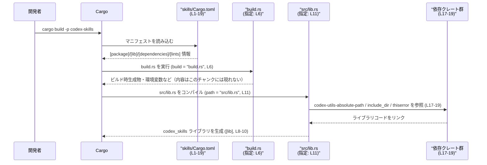

# skills/Cargo.toml コード解説

## 0. ざっくり一言

このファイルは、`codex-skills` というライブラリクレートの Cargo マニフェストであり、パッケージ情報・ライブラリターゲット・ビルドスクリプト・ワークスペース共有の lints と依存関係を定義しています（`skills/Cargo.toml:L1-6,L8-11,L13-14,L16-19`）。

---

## 1. このモジュールの役割

### 1.1 概要

- このファイルは **Cargo（Rust のビルドツール）** が利用する設定ファイルで、`codex-skills` クレートのメタデータとビルド方法を定義します（`skills/Cargo.toml:L1-6`）。
- ライブラリクレート `codex_skills` の名前とエントリポイント（`src/lib.rs`）を指定します（`skills/Cargo.toml:L8-11`）。
- edition・license・version・lints・依存クレートは、すべてワークスペース側の設定を継承する構成になっています（`skills/Cargo.toml:L2-5,L13-14,L17-19`）。
- ビルド前に `build.rs` を実行するビルドスクリプト付きクレートとして設定されています（`skills/Cargo.toml:L6`）。

### 1.2 アーキテクチャ内での位置づけ

この Cargo.toml は、ワークスペース内の 1 メンバークレートとして `codex-skills` を定義し、以下のような関係になります。

- ワークスペースのルート Cargo.toml から edition / license / version / lints / dependencies を継承（`*.workspace = true` の指定から読み取れます、`skills/Cargo.toml:L2-5,L13-14,L17-19`）。
- ライブラリ本体は `src/lib.rs` に実装され、このファイルからそのパスが指定されます（`skills/Cargo.toml:L11`）。
- ビルドスクリプト `build.rs` をビルドプロセスの前段で実行します（`skills/Cargo.toml:L6`）。
- 依存クレート `codex-utils-absolute-path`, `include_dir`, `thiserror` を利用する前提でコンパイルされます（`skills/Cargo.toml:L17-19`）。

```mermaid
graph TD
    WS["ワークスペース設定<br/>（edition/version/license/lints/依存）<br/>（*.workspace = true, L2-5,L13-14,L17-19）"]
    PKG["codex-skills パッケージ<br/>[package] (L1-6)"]
    LIB["ライブラリターゲット<br/>codex_skills<br/>[lib] (L8-11)"]
    BUILD["build.rs ビルドスクリプト<br/>(build = \"build.rs\", L6)"]
    SRC_LIB["src/lib.rs<br/>(path = \"src/lib.rs\", L11)"]
    DEP1["codex-utils-absolute-path 依存<br/>(L17)"]
    DEP2["include_dir 依存<br/>(L18)"]
    DEP3["thiserror 依存<br/>(L19)"]

    WS --> PKG
    PKG --> LIB
    PKG --> BUILD
    LIB --> SRC_LIB
    LIB --> DEP1
    LIB --> DEP2
    LIB --> DEP3
```

### 1.3 設計上のポイント

- **ワークスペース中心設計**  
  - edition / license / version をワークスペースから継承するため、このクレート単体ではこれらの値を持たず、ワークスペース全体で統一されます（`skills/Cargo.toml:L2-5`）。
  - lints もワークスペースで一括管理し、メンバー側では `workspace = true` 指定のみにしています（`skills/Cargo.toml:L13-14`）。
  - 依存クレートも `[dependencies]` で `workspace = true` として宣言し、実際のバージョンや feature 設定はワークスペース側に集約されていると解釈できます（`skills/Cargo.toml:L17-19`）。
- **ライブラリ専用クレート構成**  
  - `[lib]` セクションのみ存在し、バイナリターゲット（`[[bin]]`）は定義されていません（`skills/Cargo.toml:L8-11`）。
  - ライブラリのクレート名は `codex_skills` と明示的に指定されています（`skills/Cargo.toml:L10`）。
- **ビルドスクリプトの利用**  
  - `build = "build.rs"` により、コンパイル前にビルドスクリプトが実行される構成です（`skills/Cargo.toml:L6`）。
  - ビルドスクリプトの具体的な処理内容はこのチャンクには現れません。
- **テスト設定**  
  - `doctest = false` により、このライブラリに対するドキュメンテーションテスト（doc test）は無効化されています（`skills/Cargo.toml:L9`）。
- **安全性・エラー・並行性に関して**  
  - このファイル自体は設定のみであり、Rust の所有権・エラーハンドリング・並行性に関する実行コードは含まれていません。
  - これらは `src/lib.rs` および依存クレート側で決まりますが、このチャンクには現れません。

---

## 2. 主要な機能一覧

この Cargo.toml が提供する「機能」は、クレートのビルド・解決に関わる設定です。

- パッケージメタデータの定義: name / version / license / edition をワークスペースから継承しつつ設定（`skills/Cargo.toml:L1-5`）。
- ビルドスクリプトの指定: `build.rs` をビルド前に実行（`skills/Cargo.toml:L6`）。
- ライブラリターゲットの定義: `codex_skills` というクレート名と `src/lib.rs` へのパスを指定（`skills/Cargo.toml:L8-11`）。
- lints 設定の継承: ワークスペースで定義された lint 方針を採用（`skills/Cargo.toml:L13-14`）。
- 依存クレートの宣言: `codex-utils-absolute-path`, `include_dir`, `thiserror` をワークスペース依存として利用（`skills/Cargo.toml:L17-19`）。

### 2.1 コンポーネントインベントリー

このチャンクから読み取れる「コンポーネント」（クレート、ビルドスクリプト、依存など）の一覧です。

| コンポーネント | 種別 | 役割 / 説明 | 定義箇所 |
|----------------|------|-------------|----------|
| `codex-skills` | パッケージ | Cargo 上のパッケージ名。ワークスペース内の 1 メンバーとして定義される。 | `skills/Cargo.toml:L1,L4` |
| `codex_skills` | ライブラリクレート | Rust コードから参照するクレート名（`use codex_skills::...`）。 | `skills/Cargo.toml:L8-10` |
| `src/lib.rs` | ライブラリエントリ | ライブラリクレートのエントリポイントとなるソースファイル。 | `skills/Cargo.toml:L11` |
| `build.rs` | ビルドスクリプト | ビルド前に実行される補助プログラム。内容はこのチャンクには現れない。 | `skills/Cargo.toml:L6` |
| edition (ワークスペース継承) | コンパイラ設定 | Rust edition（2018/2021 等）をワークスペースから継承。 | `skills/Cargo.toml:L2` |
| license (ワークスペース継承) | ライセンス情報 | ライセンス表記をワークスペースから継承。 | `skills/Cargo.toml:L3` |
| version (ワークスペース継承) | バージョン | パッケージのバージョンをワークスペースから継承。 | `skills/Cargo.toml:L5` |
| lints (ワークスペース継承) | コンパイル時警告設定 | clippy 等の lint 設定をワークスペース共通設定に委譲。 | `skills/Cargo.toml:L13-14` |
| `codex-utils-absolute-path` | 依存クレート | 絶対パスユーティリティ用と思われる依存。バージョン等はワークスペース側で定義。具体的用途はこのチャンクには現れない。 | `skills/Cargo.toml:L17` |
| `include_dir` | 依存クレート | ディレクトリ埋め込み用の依存（一般的な用途）。本クレートでの具体的用途はこのチャンクには現れない。 | `skills/Cargo.toml:L18` |
| `thiserror` | 依存クレート | エラー型定義用 derive マクロを提供する依存（一般的な用途）。本クレート固有のエラー型はこのチャンクには現れない。 | `skills/Cargo.toml:L19` |

---

## 3. 公開 API と詳細解説

このファイルは **設定ファイル** であり、Rust の型や関数の定義は含まれていません。そのため、公開 API の具体的な一覧やシグネチャの詳細は、このチャンクだけからは分かりません。

重要な点として:

- 公開 API は `path = "src/lib.rs"` で指定されているライブラリファイル内に定義されます（`skills/Cargo.toml:L11`）。
- このチャンクには `src/lib.rs` の内容が含まれていないため、API 名・引数・エラー型などは「不明」「このチャンクには現れない」となります。

### 3.1 型一覧（構造体・列挙体など）

このファイル自体には型定義はありません。

| 名前 | 種別 | 役割 / 用途 | 備考 |
|------|------|-------------|------|
| （なし） | - | - | Rust の型定義は `src/lib.rs` 側に存在すると考えられますが、このチャンクには現れません。 |

### 3.2 関数詳細（最大 7 件）

- このチャンクには Rust の関数定義が存在しないため、関数レベルの詳細解説は行えません。
- 公開関数は `src/lib.rs` などに定義される想定ですが、実体がないため署名・エラー・エッジケースは「不明」となります。

### 3.3 その他の関数

- 設定ファイルであるため、補助関数やラッパー関数も定義されていません。

---

## 4. データフロー

ここでは、「ビルド時に Cargo がこのファイルをどのように利用するか」という観点でデータフローを整理します。

### 4.1 ビルド時の流れ（概要）

1. 開発者が `cargo build -p codex-skills` などを実行する。
2. Cargo が `skills/Cargo.toml` を読み込み、パッケージ情報と依存関係を解決する（`skills/Cargo.toml:L1-6,L16-19`）。
3. `build = "build.rs"` が指定されているため、まずビルドスクリプト `build.rs` が実行される（`skills/Cargo.toml:L6`）。
4. その後、`[lib]` セクションで指定された `src/lib.rs` がライブラリクレート `codex_skills` としてコンパイルされ、依存クレート群とリンクされる（`skills/Cargo.toml:L8-11,L17-19`）。

### 4.2 データフロー図（ビルドプロセス）



---

## 5. 使い方（How to Use）

### 5.1 基本的な使用方法

このファイルは直接「呼び出す」ものではなく、Cargo が自動的に読み込む設定ファイルです。開発者が行う典型的な操作は次のとおりです。

- クレートをビルドする:

```bash
# ワークスペースルートなどから
cargo build -p codex-skills   # パッケージ名は [package].name に対応（L4）
```

- Rust コードからクレートを利用する（公開 API は `src/lib.rs` 側にあるため、ここでは抽象的な例に留めます）:

```rust
// 別クレート側のコード例（実際の API 名はこのチャンクには現れません）
use codex_skills; // [lib].name = "codex_skills" に対応（skills/Cargo.toml:L10）

fn main() {
    // ここで codex_skills::... の関数や型を利用する想定
    // 実際にどの関数・型が存在するかは src/lib.rs を参照する必要があります。
}
```

### 5.2 よくある使用パターン

この Cargo.toml 自体に対する典型的な変更・利用パターンを整理します。

- **ワークスペースに参加させる**  
  - ワークスペースルートの Cargo.toml に `members` として `skills` ディレクトリを追加し、edition / license / version / 依存などをワークスペース側で定義する構成が想定されます（`*.workspace = true` の指定から、ワークスペース参加が前提と読み取れます、`skills/Cargo.toml:L2-5,L13-14,L17-19`）。
- **依存クレートの一元管理**  
  - 新しい依存を追加する場合、まずワークスペースの `[workspace.dependencies]` に追加し、このファイル側では `{ workspace = true }` を指定する形で一元管理できます（既存 3 依存がその例、`skills/Cargo.toml:L17-19`）。
- **ビルドスクリプトを活用する**  
  - `build.rs` で生成したコードや環境変数を `src/lib.rs` 側から参照する構成が一般的ですが、具体的な連携内容はこのチャンクには現れません（`skills/Cargo.toml:L6,L11`）。

### 5.3 よくある間違い

この種の Cargo.toml で起こりやすい誤りと、その影響を挙げます。

```toml
# 間違い例 1: [lib] の path を実際のファイル構成とずらしてしまう
[lib]
name = "codex_skills"
path = "src/main.rs"  # 実際には src/lib.rs なのに変更してしまう

# => Cargo は src/main.rs をライブラリとして探しに行き、
#    ファイルがない・ターゲットが二重定義などのエラーになります。
```

```toml
# 間違い例 2: build スクリプトのファイル名と build フィールドの不整合
[package]
name = "codex-skills"
build = "build.rs"  # ここはそのまま

# しかし実際には build スクリプトファイルが存在しない / 別名に変更している

# => ビルド時に「build script not found」などのエラーになります。
```

```toml
# 間違い例 3: workspace = true を外して個別にバージョンを指定してしまう
[dependencies]
thiserror = "1.0"  # もともと { workspace = true } だったものを個別指定

# => ワークスペース全体で thiserror のバージョンが揃わず、
#    ビルドや依存解決が複雑になったり、意図しないバージョン差異を生む可能性があります。
```

### 5.4 使用上の注意点（まとめ）

- **ワークスペース前提であること**  
  - `*.workspace = true` が多用されているため、このファイル単体では edition / license / version / 依存の実体が確定しません（`skills/Cargo.toml:L2-5,L13-14,L17-19`）。  
    ワークスペースルートの設定とセットで管理する必要があります。
- **`src/lib.rs` と `build.rs` の存在**  
  - `path = "src/lib.rs"` および `build = "build.rs"` を指定しているため、対応するファイルが存在しないとビルドエラーになります（`skills/Cargo.toml:L6,L11`）。
- **doctest 無効化の影響**  
  - `doctest = false` により、Rustdoc コメント中のサンプルコードは自動実行されません（`skills/Cargo.toml:L9`）。  
    ドキュメント中のサンプルの正しさは、別途テストコードで担保する必要が出てきます。
- **安全性・エラー・並行性**  
  - このファイルは実行コードを含まないため、メモリ安全性や並行性の問題はここでは発生しません。  
    ただしビルドスクリプトやライブラリコード（`src/lib.rs`）側でのエラーや panic の扱いは、このチャンクでは確認できません。

---

## 6. 変更の仕方（How to Modify）

### 6.1 新しい機能を追加する場合

クレートに新しい機能（ロジック）を追加する際、この Cargo.toml に必要になり得る変更は次のとおりです。

1. **実装追加の主体は `src/lib.rs` 側**  
   - 実際の API・ロジックは `src/lib.rs` に追加します（`skills/Cargo.toml:L11`）。
2. **新しい依存が必要な場合**  
   - ワークスペース運用であれば、まずワークスペースルートの Cargo.toml に新しい依存を追加し、  
     その上でこのファイルの `[dependencies]` に `{ workspace = true }` で追記します（既存依存の例は `skills/Cargo.toml:L17-19`）。
3. **ビルド時生成が必要な場合**  
   - ビルドスクリプトで新しい処理を行う場合は `build.rs` を更新します（`skills/Cargo.toml:L6`）。  
   - 追加した生成物を `src/lib.rs` から参照する際は、環境変数や `OUT_DIR` など Cargo の標準メカニズムを利用することが一般的ですが、具体内容はこのチャンクには現れません。

### 6.2 既存の機能を変更する場合

既存設定を変更するときの注意点です。

- **パッケージ名やクレート名を変更する場合**  
  - `[package].name` を変更すると、`cargo build -p ...` などのターゲット指定にも影響します（`skills/Cargo.toml:L4`）。  
  - `[lib].name` を変更すると、Rust コードからの `use` / クレートパスが変わります（`skills/Cargo.toml:L10`）。  
    両者を同時に変更する場合は、他クレートからの参照も合わせて修正する必要があります。
- **パスを変更する場合**  
  - `path = "src/lib.rs"` を変更すると、ライブラリのエントリポイントファイルも移動・改名する必要があります（`skills/Cargo.toml:L11`）。  
  - `build = "build.rs"` を変更する場合も、実ファイル名との整合性に注意します（`skills/Cargo.toml:L6`）。
- **ワークスペース継承をやめる場合**  
  - `edition.workspace = true` 等を外して個別値を設定すると、このクレートだけ異なる edition / license / version になる可能性があります（`skills/Cargo.toml:L2-5`）。  
    これはビルド互換性やライセンス管理上の影響があり得るため、ワークスペース全体の方針を確認する必要があります。

---

## 7. 関連ファイル

この Cargo.toml と密接に関係するファイル・設定の一覧です。

| パス / 名前 | 役割 / 関係 |
|------------|------------|
| `skills/src/lib.rs` | ライブラリクレート `codex_skills` のエントリポイント。公開 API やコアロジックはこのファイル側に存在すると考えられます（`skills/Cargo.toml:L11`）。実際の内容はこのチャンクには現れません。 |
| `skills/build.rs` | ビルドスクリプト。`build = "build.rs"` によりビルド前に実行されます（`skills/Cargo.toml:L6`）。処理内容はこのチャンクには現れません。 |
| ワークスペースルートの `Cargo.toml` | edition / license / version / lints / 依存クレートの実体を定義するファイルです（`*.workspace = true` 設定の参照先、`skills/Cargo.toml:L2-5,L13-14,L17-19`）。ファイルパスはこのチャンクには現れません。 |
| クレート `codex-utils-absolute-path` | 依存クレートの 1 つ。絶対パスユーティリティ用と思われますが、本クレートからの具体的な利用形態はこのチャンクには現れません（`skills/Cargo.toml:L17`）。 |
| クレート `include_dir` | 依存クレートの 1 つ。ビルド時にディレクトリ内のファイルを埋め込む用途が一般的ですが、本クレートの具体的利用はこのチャンクには現れません（`skills/Cargo.toml:L18`）。 |
| クレート `thiserror` | 依存クレートの 1 つ。エラー型定義を簡略化する derive マクロを提供しますが、本クレートで定義されるエラー型はこのチャンクには現れません（`skills/Cargo.toml:L19`）。 |

---

### Bugs / Security / Contracts / Edge cases / Tests / Performance に関する補足

このチャンクに Rust コードが含まれていないため、次の点はすべて「このチャンクからは直接分からない」ことを明記します。

- **Bugs / Security**  
  - 実装上のバグやセキュリティホール（入力検証不足、panic 等）は `src/lib.rs` および `build.rs` 側に依存し、このチャンクには現れません。
- **Contracts / Edge Cases**  
  - 関数の事前条件・事後条件やエッジケースでの挙動も、このチャンクからは不明です。  
    ただし設定としては、`build.rs` や `src/lib.rs` が存在しない場合にビルドエラーとなる、という程度の「契約」は読み取れます（`skills/Cargo.toml:L6,L11`）。
- **Tests**  
  - `doctest = false` により、ドキュメントテストが実行されないことだけが明示されています（`skills/Cargo.toml:L9`）。他のテスト（単体テスト・統合テスト）の有無はこのチャンクには現れません。
- **Performance / Scalability / Concurrency**  
  - 実行時性能やスケーラビリティ、並行性の扱いは実装コード側の問題であり、このチャンクからは評価できません。  
  - ビルドスクリプトがビルド時間へ与える影響も、スクリプト内容がこのチャンクにないため不明です。
