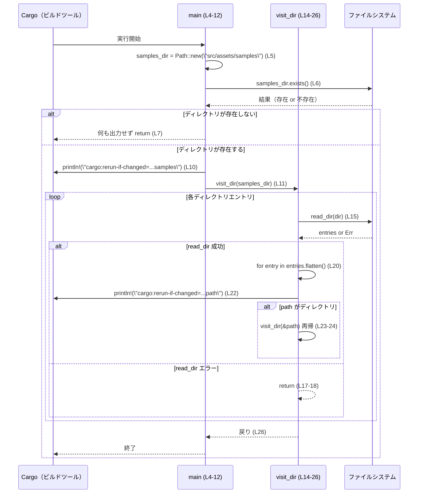

# skills/build.rs コード解説

## 0. ざっくり一言

`skills/build.rs` は、`src/assets/samples` ディレクトリ以下のファイル／ディレクトリを再帰的に巡回し、変更があったときに Cargo がビルドスクリプトを再実行できるように `cargo:rerun-if-changed=...` 行を標準出力に書き出すビルドスクリプトです（`skills/build.rs:L4-12`, `L14-26`）。

---

## 1. このモジュールの役割

### 1.1 概要

- このファイルは、ビルド時に **`src/assets/samples` 以下のファイル変更をトリガーに、Cargo が再ビルドを行えるようにする** ためのビルドスクリプトです（`skills/build.rs:L5`, `L10`, `L20-22`）。
- ディレクトリを再帰的に走査し、見つかった各パスを `cargo:rerun-if-changed=...` 形式で出力します（`skills/build.rs:L20-25`）。

### 1.2 アーキテクチャ内での位置づけ

コードから分かる範囲では、次のような関係になっています：

- Cargo がビルド時にこのスクリプト（`main` 関数）を実行する（通常のビルドスクリプトの動作）。  
  ※Cargo との連携自体はコード内では暗黙であり、このチャンクには明示的な記述はありません。
- `main` がルートディレクトリ `src/assets/samples` を決めて存在確認し、`visit_dir` に処理を委譲します（`skills/build.rs:L4-11`）。
- `visit_dir` が再帰的にディレクトリをたどり、各パスごとに `cargo:rerun-if-changed=` 行を出力します（`skills/build.rs:L14-25`）。

```mermaid
graph TD
    Cargo["Cargo（ビルド時に build.rs を実行）"]
    Main["main 関数 (L4-12)"]
    Visit["visit_dir 関数 (L14-26)"]
    Fs["std::fs::read_dir (L15)"]
    Dir["\"src/assets/samples\" ディレクトリ (L5)"]

    Cargo --> Main
    Main --> Dir
    Main --> Visit
    Visit --> Fs
    Visit -->|再帰呼び出し| Visit
```

この図は、`skills/build.rs`（本チャンク全体, L1-27）に基づき、ビルド時の処理フローと依存関係を表現しています。

### 1.3 設計上のポイント

コードから読み取れる設計上の特徴は次のとおりです：

- **最小限の責務に特化**
  - 役割は「ディレクトリの再帰走査」と「`cargo:rerun-if-changed` の出力」に限定されています（`skills/build.rs:L10-11`, `L20-25`）。
- **状態を持たない構造**
  - グローバルな可変状態や構造体は定義されておらず、関数間で必要な情報（`&Path`）を引数で渡す純粋な再帰構造になっています（`skills/build.rs:L14`, `L23-24`）。
- **エラーハンドリング方針**
  - `fs::read_dir` のエラーは `Err(_) => return` で握りつぶし、ビルド自体を失敗させずに無視します（`skills/build.rs:L15-18`）。
  - `entries.flatten()` により、個々の `DirEntry` 取得時のエラーもスキップします（`skills/build.rs:L20`）。
- **同期的・単一スレッド**
  - 並行処理（スレッド・async）は使用されておらず、処理は完全に同期的です。

---

## 2. 主要な機能一覧（コンポーネントインベントリー）

このファイルに定義されている関数・コンポーネントと役割を一覧にします。

### 2.1 関数／コンポーネント一覧

| 名前              | 種別   | 役割 / 用途                                                                 | 定義位置 |
|-------------------|--------|------------------------------------------------------------------------------|----------|
| `main`            | 関数   | ルートディレクトリ `src/assets/samples` の存在確認と初回の `visit_dir` 呼び出し、およびルートディレクトリ自身の `cargo:rerun-if-changed` 出力を行う | `skills/build.rs:L4-12` |
| `visit_dir`       | 関数   | 指定されたディレクトリを読み取り、配下のパスを再帰的にたどりながら `cargo:rerun-if-changed` を出力する | `skills/build.rs:L14-26` |

このファイル内には新しい構造体や列挙体などの型定義は存在しません（`skills/build.rs:L1-27`）。

---

## 3. 公開 API と詳細解説

ビルドスクリプトとしての性質上、「公開 API」という概念は弱いですが、ここでは外部から呼び出されうるエントリポイントとして `main` と内部ヘルパー `visit_dir` を対象に説明します。

### 3.1 型一覧（構造体・列挙体など）

このファイル自身にはユーザー定義の型はありません。

| 名前 | 種別 | 役割 / 用途 | 定義位置 |
|------|------|-------------|----------|
| なし | -    | -           | -        |

（標準ライブラリの `std::path::Path` や `std::fs` は外部定義のため、この表には含めていません。）

### 3.2 関数詳細

#### `fn main()`

**概要**

- ビルドスクリプトのエントリポイントです（`skills/build.rs:L4`）。
- `src/assets/samples` ディレクトリの存在を確認し、存在する場合に:
  - そのディレクトリ自体の変更監視を Cargo に通知（`cargo:rerun-if-changed=...` 出力）し（`skills/build.rs:L10`）、
  - `visit_dir` を使ってディレクトリ配下を再帰的に処理します（`skills/build.rs:L11`）。

**引数**

- 引数はありません（通常の `fn main()`）。

**戻り値**

- 戻り値は `()`（ユニット型）で、明示的に何も返しません（`skills/build.rs:L4-12`）。

**内部処理の流れ（アルゴリズム）**

1. `Path::new("src/assets/samples")` によりルートディレクトリパスを生成します（`skills/build.rs:L5`）。
2. `exists()` でディレクトリの存在を確認し、存在しなければすぐに `return` します（`skills/build.rs:L6-7`）。
3. 存在する場合、
   - `println!("cargo:rerun-if-changed={}", samples_dir.display());` により、ルートディレクトリの変更監視を Cargo に通知します（`skills/build.rs:L10`）。
   - `visit_dir(samples_dir);` を呼び出し、配下の走査と通知を行います（`skills/build.rs:L11`）。

```mermaid
flowchart TD
    A["main 開始 (L4)"] --> B["samples_dir = Path::new(...) (L5)"]
    B --> C{"samples_dir.exists()? (L6)"}
    C -- 存在しない --> D["return (L7)"]
    C -- 存在する --> E["println!(\"cargo:rerun-if-changed=...\") (L10)"]
    E --> F["visit_dir(samples_dir) 呼び出し (L11)"]
    F --> G["main 終了 (L12)"]
```

**Examples（使用例）**

この関数はビルドスクリプトとして Cargo によって呼び出される前提で設計されており、通常は直接呼び出しません。一般的な利用イメージは次のようになります（*この形で使われることが多いという一般的な説明であり、このチャンクに明示はありません*）。

```rust
// プロジェクトルートに build.rs を置き、Cargo がビルド時に実行する想定の例です。
// このファイルの内容は skills/build.rs (L1-27) と同じです。

fn main() {
    let samples_dir = std::path::Path::new("src/assets/samples"); // 監視対象のルート
    if !samples_dir.exists() {                                   // ディレクトリがなければ何もしない
        return;
    }

    println!("cargo:rerun-if-changed={}", samples_dir.display()); // ルートディレクトリの変更を監視
    visit_dir(samples_dir);                                       // 配下を再帰的に処理
}

fn visit_dir(dir: &std::path::Path) {
    // skills/build.rs:L14-26 と同じ実装
}
```

このような構成のプロジェクトで `cargo build` を実行すると、ビルド時に `main` が呼び出され、`src/assets/samples` 以下に変更があった場合に再度ビルドスクリプトが実行される挙動になります。

**Errors / Panics**

- `main` 自体では明示的な `Result` 型を返さず、エラーを返しません。
- 潜在的な panic 要因:
  - `println!` は出力先のエラーにより panic し得ますが、標準的なビルドスクリプトではまれなケースです（`skills/build.rs:L10`）。
- ファイルシステム上のエラー:
  - ルートディレクトリの存在確認 (`exists`) が失敗しても、標準ライブラリ側の実装に依存しますが、このコードではそれを特別扱いしていません。
  - ルートディレクトリ以降のエラーは `visit_dir` 側で握りつぶされ、ビルドは継続されます（詳細は `visit_dir` を参照）。

**Edge cases（エッジケース）**

- ルートディレクトリが存在しない場合（`src/assets/samples` がない場合）:
  - `if !samples_dir.exists()` が真となり、何も出力せず即時 `return` します（`skills/build.rs:L6-7`）。
  - その場合、ビルドスクリプトの出力に `cargo:rerun-if-changed` は含まれません。
- ルートディレクトリは存在するが、中身が空の場合:
  - ルートディレクトリ自体の `cargo:rerun-if-changed` は出力されますが（`skills/build.rs:L10`）、`visit_dir` 内のループが空となり、追加の出力はありません。

**使用上の注意点**

- **前提条件**:
  - `main` が意味を持つのは、`"src/assets/samples"` が「ビルド結果に影響する何らかのサンプル資源」を含んでいる場合です。
- **ファイルシステムエラーの扱い**:
  - ルートディレクトリの配下でアクセス権限が不足しているなどの理由で `read_dir` が失敗しても、ビルドは失敗せず、そのディレクトリ以下が監視対象から漏れる可能性があります（`skills/build.rs:L15-18`）。
- **パフォーマンス**:
  - 非常に大きなディレクトリツリーを監視対象とした場合、再帰走査と標準出力の処理に時間がかかる可能性があります。

---

#### `fn visit_dir(dir: &Path)`

**概要**

- 指定されたディレクトリを `fs::read_dir` で読み出し、その直下のすべてのエントリを走査します（`skills/build.rs:L14-20`）。
- 各エントリ（ファイル or ディレクトリ）のパスを `cargo:rerun-if-changed` で出力し（`skills/build.rs:L20-22`）、ディレクトリであれば再帰的に `visit_dir` を呼び出します（`skills/build.rs:L23-25`）。

**引数**

| 引数名 | 型            | 説明 |
|--------|---------------|------|
| `dir`  | `&Path`       | 走査対象ディレクトリのパス（読み取り専用の借用） |

**戻り値**

- 戻り値は `()` で、直接的な結果値を返しません（`skills/build.rs:L14-26`）。

**内部処理の流れ（アルゴリズム）**

1. `fs::read_dir(dir)` でディレクトリ内のエントリ取得を試みます（`skills/build.rs:L15`）。
2. `match` で結果を分岐します（`skills/build.rs:L15-18`）:
   - `Ok(entries)` の場合: そのまま後続処理に進みます。
   - `Err(_)` の場合: 何もせず `return` し、そのディレクトリ以下の処理を中止します。
3. `for entry in entries.flatten()` で各エントリを走査します（`skills/build.rs:L20`）。
   - `flatten()` により、`read_dir` による各個別エントリの取得エラーもスキップします。
4. ループ内で実行される処理（`skills/build.rs:L20-25`）:
   - `entry.path()` でエントリの `PathBuf` を取得します（`skills/build.rs:L21`）。
   - `println!("cargo:rerun-if-changed={}", path.display());` で、そのパスの変更監視を Cargo に通知します（`skills/build.rs:L22`）。
   - `path.is_dir()` が `true` であれば、そのディレクトリを引数にして再帰的に `visit_dir(&path)` を呼び出します（`skills/build.rs:L23-24`）。

```mermaid
flowchart TD
    A["visit_dir(dir) 呼び出し (L14)"] --> B["fs::read_dir(dir) (L15)"]
    B --> C{"read_dir 成功? (L15-18)"}
    C -- Err(_) --> D["return (現在のディレクトリをスキップ) (L17-18)"]
    C -- Ok(entries) --> E["for entry in entries.flatten() (L20)"]
    E --> F["path = entry.path() (L21)"]
    F --> G["println!(\"cargo:rerun-if-changed={}\", path) (L22)"]
    G --> H{"path.is_dir()? (L23)"}
    H -- true --> I["visit_dir(&path) 再帰呼び出し (L24)"] --> E
    H -- false --> E
```

**Examples（使用例）**

`visit_dir` は本来 `main` からのみ呼び出される内部関数として設計されています（`skills/build.rs:L11`, `L23-24`）。単体でテスト的に使う場合の例を示します。

```rust
use std::path::Path;
use std::fs;

// skills/build.rs:L14-26 と同じ実装
fn visit_dir(dir: &Path) {
    let entries = match fs::read_dir(dir) {
        Ok(entries) => entries,
        Err(_) => return,                                   // 読み取り失敗時はこのディレクトリをスキップ
    };

    for entry in entries.flatten() {                        // 個々のエントリ取得エラーもスキップ
        let path = entry.path();
        println!("cargo:rerun-if-changed={}", path.display()); // 各パスを監視対象として出力
        if path.is_dir() {                                  // サブディレクトリの場合は再帰
            visit_dir(&path);
        }
    }
}

fn main() {
    // テスト用呼び出し例: 任意のディレクトリを指定して実行
    let dir = Path::new("src/assets/samples");
    visit_dir(dir);
}
```

この例を単体実行すると、標準出力に `cargo:rerun-if-changed=...` の行が列挙され、どのパスが監視対象になるかを確認できます。

**Errors / Panics**

- `fs::read_dir(dir)`:
  - `Err(_)` の場合は即座に `return` し、そのディレクトリ以下は処理しません（`skills/build.rs:L15-18`）。
  - エラーの内容はログ出力されず、握りつぶされます（`Err(_)` パターンにバインドしていないため）。
- `entries.flatten()`:
  - 各 `DirEntry` の取得が `Err(e)` となった場合、そのエントリはスキップされます（`flatten()` により `Err` が捨てられる）。
  - これにより、一部のファイルまたはディレクトリが監視対象から漏れる可能性がありますが、panic は発生しません（`skills/build.rs:L20`）。
- `println!`:
  - 前述のとおり、出力先エラーで panic し得ますが、通常のビルド環境ではまれです（`skills/build.rs:L22`）。

**Edge cases（エッジケース）**

- **`dir` がディレクトリでない場合**:
  - `fs::read_dir(dir)` は `Err` を返す可能性が高く、その場合 `Err(_) => return` により何もせず終了します（`skills/build.rs:L15-18`）。
- **アクセス権限がない場合**:
  - `read_dir` が `Err` を返し、そのディレクトリ以下全体が監視対象から除外されます。
- **ファイル数が非常に多い場合**:
  - 再帰呼び出し回数および `println!` の出力量が増え、ビルドスクリプトの実行時間が長くなる可能性があります。
- **シンボリックリンク**:
  - コードにはシンボリックリンクに対する特別な扱いがありません。
  - `path.is_dir()` の振る舞いは OS とリンクの種類に依存しますが、このチャンクからは具体的な挙動は分かりません。

**使用上の注意点**

- **エラーを握りつぶす仕様**:
  - `Err(_) => return` と `entries.flatten()` により、詳細なエラー情報が一切出力されません（`skills/build.rs:L15-18`, `L20`）。
  - 監視対象から漏れるパスがあっても、気付きにくい設計です。
- **無限再帰防止**:
  - シンボリックリンクでディレクトリ間が循環参照している場合など、理論的には再帰が深くなりすぎる可能性があります。
  - このコードにはその対策（訪問済みパス集合の管理など）はありません。
- **並行性**:
  - 全処理は単一スレッドで直列に実行されるため、特にロックやスレッドセーフティの懸念はありません。

### 3.3 その他の関数

- このファイルには `main` と `visit_dir` 以外の関数は定義されていません（`skills/build.rs:L1-27`）。

---

## 4. データフロー

ここでは、`main` から始まる典型的な処理シナリオにおけるデータ（パスオブジェクト）の流れと呼び出し関係を示します。



要点:

- 監視対象となるのは、再帰的に訪問できたすべてのパスです。
- `read_dir` でエラーになったディレクトリと、その配下は監視対象から外れます。
- データとしては、`Path`/`PathBuf` オブジェクトが `main` → `visit_dir` → 再帰呼び出し間で受け渡されています。

---

## 5. 使い方（How to Use）

### 5.1 基本的な使用方法

このファイルはビルドスクリプトとしての利用が前提になっています。一般的なプロジェクトでは、クレートルートに `build.rs` を置くと Cargo が自動的にそれをビルドスクリプトとして扱います（この点は Rust の一般的仕様であり、このチャンク内に直接記載はありません）。

基本的な使い方のイメージ:

```rust
// build.rs として配置されるファイルの例。
// 中身は skills/build.rs:L1-27 と同じです。

use std::fs;
use std::path::Path;

fn main() {
    let samples_dir = Path::new("src/assets/samples");      // 監視対象ルート
    if !samples_dir.exists() {                             // ルートが無ければ何もしない
        return;
    }

    println!("cargo:rerun-if-changed={}", samples_dir.display()); // ルートディレクトリを監視
    visit_dir(samples_dir);                                          // 配下も監視対象に追加
}

fn visit_dir(dir: &Path) {
    let entries = match fs::read_dir(dir) {
        Ok(entries) => entries,
        Err(_) => return,                                   // 読み取りできなければスキップ
    };

    for entry in entries.flatten() {                        // 個々のエントリエラーもスキップ
        let path = entry.path();
        println!("cargo:rerun-if-changed={}", path.display()); // ファイル／ディレクトリごとに監視設定
        if path.is_dir() {
            visit_dir(&path);                               // 再帰的に巡回
        }
    }
}
```

この状態で:

- `src/assets/samples` 以下のファイルを追加・更新・削除すると、次回 `cargo build` 時にビルドスクリプトが再実行されます。
- ビルドスクリプト内でこれらのファイルを読み込んでコード生成を行う、といった用途が考えられます（用途自体はこのチャンクからは分かりません）。

### 5.2 よくある使用パターン（応用例）

このコードパターンを応用した典型的な使い方を、一般的なビルドスクリプトの文脈で示します（*ここからは「このコードをどう変更・流用できるか」の例であり、このチャンクに含まれている事実ではありません*）。

1. **監視対象ディレクトリを増やす**

   ```rust
   fn main() {
       let dirs = [
           "src/assets/samples",
           "src/assets/templates",
       ];

       for dir_str in &dirs {
           let dir = std::path::Path::new(dir_str);
           if !dir.exists() {
               continue;
           }
           println!("cargo:rerun-if-changed={}", dir.display());
           visit_dir(dir);
       }
   }
   ```

2. **特定の拡張子だけ監視したい場合**

   `visit_dir` 内で `path.extension()` を見てフィルタすることで、監視対象を限定できます。

### 5.3 よくある間違い

このコードに近いビルドスクリプトで起こりやすい誤用と、その修正例です。

```rust
// 誤り例: ルートディレクトリに対して rerun-if-changed を出していない
fn main() {
    let samples_dir = std::path::Path::new("src/assets/samples");
    if !samples_dir.exists() {
        return;
    }

    // visit_dir のみ呼び出している
    visit_dir(samples_dir);
}

// 正しい例: ルートディレクトリ自身も監視対象に含める
fn main() {
    let samples_dir = std::path::Path::new("src/assets/samples");
    if !samples_dir.exists() {
        return;
    }

    println!("cargo:rerun-if-changed={}", samples_dir.display()); // skills/build.rs:L10
    visit_dir(samples_dir);                                       // skills/build.rs:L11
}
```

ルートディレクトリ自体を監視対象にしないと、ディレクトリの作成・削除等の変化を検知できない場合があります。

### 5.4 使用上の注意点（まとめ）

- **ファイルシステムエラーはサイレントに無視される**
  - 権限問題や一時的な I/O エラーにより監視対象から漏れる可能性がある点に注意が必要です（`skills/build.rs:L15-18`, `L20`）。
- **大量のファイルを監視対象にする場合のパフォーマンス**
  - 非常に大きなディレクトリツリーを走査すると、ビルドスクリプトの実行時間が目立つようになる可能性があります。
- **循環するディレクトリ構造へのケア**
  - シンボリックリンク経由の循環などに対する保護は実装されていません。

---

## 6. 変更の仕方（How to Modify）

### 6.1 新しい機能を追加する場合

例として、「監視対象ディレクトリを追加する」場合の手順を示します。

1. **`main` に追加ディレクトリのパスを定義する**
   - 現在は `"src/assets/samples"` 固定のため（`skills/build.rs:L5`）、配列やベクタで複数パスを扱う構造に変更します。
2. **各ディレクトリに対して存在確認・通知・`visit_dir` 呼び出しを行う**
   - `println!("cargo:rerun-if-changed=...")` と `visit_dir(...)` のセットをループに入れます（`skills/build.rs:L10-11` をループ内に移動）。
3. **エラーハンドリング方針の統一**
   - 既存の `visit_dir` と同様に、ディレクトリごとのエラーは無視するのか、それともログを出すのかを決めます。

```rust
fn main() {
    let roots = [
        std::path::Path::new("src/assets/samples"),
        std::path::Path::new("src/assets/templates"),
    ];

    for root in &roots {
        if !root.exists() {
            continue;
        }
        println!("cargo:rerun-if-changed={}", root.display());
        visit_dir(root);
    }
}
```

### 6.2 既存の機能を変更する場合

変更時に注意したいポイントを箇条書きにします。

- **エラーハンドリングを強化したい場合**
  - `Err(_) => return` を `Err(e) => { eprintln!(...); return; }` に変えることで、失敗要因をログ出力できます（`skills/build.rs:L15-18`）。
  - ただし、ログ出力が多くなりビルドログが読みにくくなる可能性があります。
- **ビルド失敗にしたい場合**
  - 現状はエラーがあってもビルドを成功させる設計になっています。
  - 「監視対象ディレクトリが読み取れないならビルドを失敗させる」という仕様にしたい場合、`read_dir` の `Err` で `panic!` するか、`std::process::exit(1)` などで異常終了させる必要があります。
  - その場合、ビルドが止まりやすくなるため、CI などの環境に影響する点に注意が必要です。
- **再帰の停止条件を追加したい場合**
  - シンボリックリンクや特定の深さで再帰を止めたい場合、`visit_dir` に「現在の深さ」や「訪問済みパス集合」の引数を追加する必要があります。
  - 引数が増えるため、`visit_dir(dir: &Path, depth: usize)` のようにシグネチャが変わり、すべての呼び出し箇所（`skills/build.rs:L11`, `L24`）を更新する必要があります。

---

## 7. 関連ファイル

このビルドスクリプトと関係があるとコードから読み取れるパスを整理します。

| パス                  | 役割 / 関係                                                                                   |
|-----------------------|----------------------------------------------------------------------------------------------|
| `src/assets/samples`  | ビルドスクリプトから監視対象として扱われるルートディレクトリ。存在確認と再帰探索の起点になる（`skills/build.rs:L5-7`, `L11`, `L14-26`）。 |

その他、`Cargo.toml` やアプリケーション本体のソースコード（例: `src/main.rs`）との関係は、このチャンク内には現れません。そのため、どのように生成物／サンプル資源が利用されているかは不明です。
