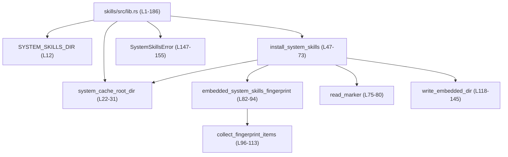
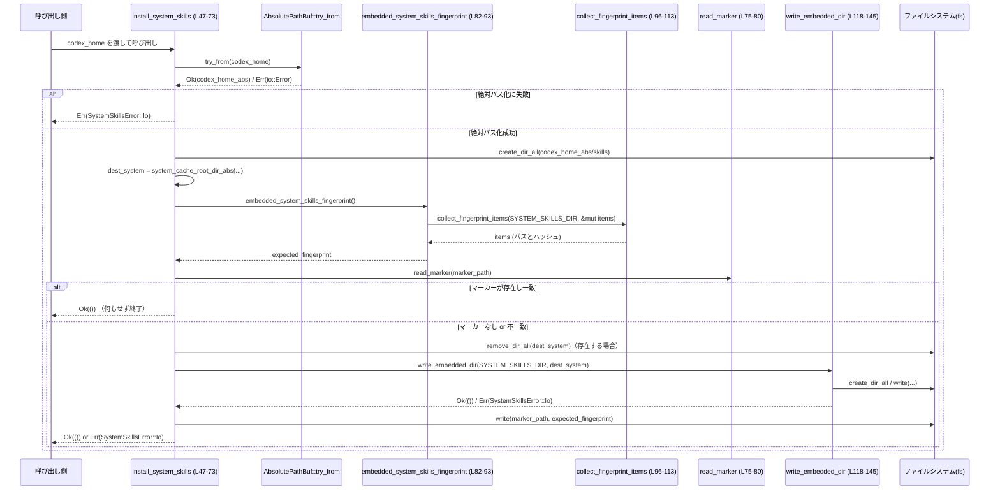

# skills/src/lib.rs

## 0. ざっくり一言

`skills/src/lib.rs` は、バイナリに埋め込まれた「システムスキル」ディレクトリを、ローカルの `CODEX_HOME/skills/.system` に展開・キャッシュするためのユーティリティを提供するモジュールです（`skills/src/lib.rs:L12-17`, `L39-47`, `L118-120`）。

---

## 1. このモジュールの役割

### 1.1 概要

- このモジュールは、ビルド時に `include_dir` で埋め込んだサンプル／システムスキル群（`SYSTEM_SKILLS_DIR`）を、実行時にユーザー環境のディスク上へ展開する役割を持ちます（`skills/src/lib.rs:L12`, `L39-47`, `L118-140`）。
- 展開先は原則として `CODEX_HOME/skills/.system` であり、そのパスの算出とディレクトリの作成を行います（`L14-17`, `L22-37`, `L47-55`）。
- 「マーカー（指紋）ファイル」によって埋め込みディレクトリの内容をハッシュ化し、内容に変更がない限り再インストールをスキップします（`L56-72`, `L82-93`）。

### 1.2 アーキテクチャ内での位置づけ

このファイル単体で見える範囲では、次のような依存関係になっています。



- 外部クレート依存
  - `codex_utils_absolute_path::AbsolutePathBuf`: パスの正規化・絶対パス化に使用（`L1`, `L22-25`, `L33-37`, `L47-49`, `L118-120`）。
  - `include_dir::Dir` とそのエントリ型: 埋め込みディレクトリの列挙に使用（`L2`, `L12`, `L96-113`, `L118-140`）。
  - `thiserror::Error`: `SystemSkillsError` のエラーメッセージ実装に使用（`L10`, `L147-155`）。

### 1.3 設計上のポイント

コードから読み取れる特徴は次の通りです。

- **埋め込み → 展開の二段構え**
  - ビルド時に `include_dir` でディレクトリを埋め込み（`SYSTEM_SKILLS_DIR`, `L12`）、実行時にファイルシステムへ書き出します（`write_embedded_dir`, `L118-140`）。
- **キャッシュと冪等性**
  - 埋め込み内容からハッシュ値（指紋）を計算し（`embedded_system_skills_fingerprint`, `L82-93`）、マーカーと一致する場合は再展開をスキップすることで、起動ごとの無駄なI/Oを避けています（`L56-62`）。
- **エラーハンドリング**
  - すべての I/O エラーは `SystemSkillsError::Io` にラップし、`Result` で呼び出し元へ伝播します（`L47-52`, `L64-67`, `L69-71`, `L75-80`, `L118-120`, `L126-139`, `L147-160`）。
  - パニックを誘発しうる `unwrap` 類は使用しておらず、Rust の安全な `?` 演算子によるエラー伝播が中心です。
- **状態を持たない設計**
  - すべての関数は引数に基づいて動作し、グローバルなミュータブル状態はありません。状態はファイルシステム上のディレクトリ・ファイルにのみ存在します。
- **同期・ブロッキングI/O**
  - すべて標準ライブラリの同期I/Oを使っており、非同期処理やスレッド制御は入っていません（`fs::create_dir_all`, `fs::remove_dir_all`, `fs::write`, `fs::read_to_string`, `L4`, `L51`, `L64-66`, `L69-71`, `L75-77`, `L118-120`, `L126-127`, `L132-139`）。

---

## 2. 主要な機能一覧

このモジュールが提供する主な機能は次の通りです。

- システムスキルキャッシュディレクトリのパス計算:
  - `system_cache_root_dir`: `CODEX_HOME/skills/.system` のパスを返します（`L22-31`）。
- システムスキルのインストール:
  - `install_system_skills`: 埋め込まれたシステムスキル群をディスクに展開し、マーカーを用いて不要な再インストールを避けます（`L39-73`）。
- 埋め込みディレクトリの指紋計算:
  - `embedded_system_skills_fingerprint`: 埋め込みディレクトリのパス＋内容から安定したハッシュ文字列を生成します（`L82-93`）。
- 埋め込みディレクトリの再帰走査:
  - `collect_fingerprint_items`: 指紋計算に使う `(パス, 内容ハッシュ)` の一覧を構築します（`L96-113`）。
- 埋め込みディレクトリの書き出し:
  - `write_embedded_dir`: `include_dir::Dir` をファイルシステムへ複製します（`L115-145`）。
- エラー型:
  - `SystemSkillsError`: すべての I/O エラーを一元管理するエラー列挙体です（`L147-155`）。

---

## 3. 公開 API と詳細解説

### 3.0 コンポーネントインベントリー（行番号付き）

このチャンクに現れるトップレベル要素の一覧です。

#### 定数・静的値

| 名前 | 種別 | 説明 | 定義位置 |
|------|------|------|----------|
| `SYSTEM_SKILLS_DIR` | `const Dir` | 埋め込まれたシステムスキルディレクトリのルート | `skills/src/lib.rs:L12` |
| `SYSTEM_SKILLS_DIR_NAME` | `const &str` | システムスキルディレクトリ名（`.system`） | `skills/src/lib.rs:L14` |
| `SKILLS_DIR_NAME` | `const &str` | スキルルートディレクトリ名（`skills`） | `skills/src/lib.rs:L15` |
| `SYSTEM_SKILLS_MARKER_FILENAME` | `const &str` | マーカー用ファイル名 | `skills/src/lib.rs:L16` |
| `SYSTEM_SKILLS_MARKER_SALT` | `const &str` | 指紋計算時のソルト値 | `skills/src/lib.rs:L17` |

#### 型

| 名前 | 種別 | 役割 / 用途 | 定義位置 |
|------|------|------------|----------|
| `SystemSkillsError` | 公開列挙体 | I/O エラーのコンテキスト（どの操作中か）を含むエラー型 | `skills/src/lib.rs:L147-155` |

#### 関数

| 名前 | 種別 | 公開? | 役割 / 用途 | 定義位置 |
|------|------|-------|------------|----------|
| `system_cache_root_dir(&Path) -> PathBuf` | 関数 | 公開 | システムスキルキャッシュディレクトリのパスを計算 | `skills/src/lib.rs:L22-31` |
| `system_cache_root_dir_abs(&AbsolutePathBuf) -> AbsolutePathBuf` | 関数 | 非公開 | 上記の絶対パス版。`AbsolutePathBuf` から `.system` パスを構成 | `skills/src/lib.rs:L33-37` |
| `install_system_skills(&Path) -> Result<(), SystemSkillsError>` | 関数 | 公開 | 埋め込みシステムスキルをディスクへインストールし、マーカーでキャッシュ | `skills/src/lib.rs:L47-73` |
| `read_marker(&AbsolutePathBuf) -> Result<String, SystemSkillsError>` | 関数 | 非公開 | マーカーファイルの中身を読み取り、トリムした文字列として返す | `skills/src/lib.rs:L75-80` |
| `embedded_system_skills_fingerprint() -> String` | 関数 | 非公開 | 埋め込みシステムスキルの指紋文字列を計算 | `skills/src/lib.rs:L82-93` |
| `collect_fingerprint_items(&Dir, &mut Vec<(String, Option<u64>)>)` | 関数 | 非公開 | 再帰的に `(パス, 内容ハッシュ)` を収集 | `skills/src/lib.rs:L96-113` |
| `write_embedded_dir(&Dir, &AbsolutePathBuf) -> Result<(), SystemSkillsError>` | 関数 | 非公開 | 埋め込みディレクトリを指定パスに再帰的に書き出す | `skills/src/lib.rs:L118-145` |
| `SystemSkillsError::io(&'static str, std::io::Error) -> SystemSkillsError` | 関連関数 | 非公開 | 指定のアクション名を含む I/O エラー値を生成するヘルパー | `skills/src/lib.rs:L157-160` |
| `tests::fingerprint_traverses_nested_entries()` | テスト関数 | `#[cfg(test)]` | 指紋収集がネストしたエントリまで到達することを確認 | `skills/src/lib.rs:L169-185` |

---

### 3.1 型一覧（構造体・列挙体など）

| 名前 | 種別 | 役割 / 用途 | フィールド概要 | 定義位置 |
|------|------|------------|----------------|----------|
| `SystemSkillsError` | 列挙体（`pub enum`） | 本モジュール内の I/O 操作に関するエラーを表現する | 変種 `Io { action: &'static str, source: std::io::Error }` のみを持つ | `skills/src/lib.rs:L147-155` |

---

### 3.2 関数詳細（主要 6 件）

#### `system_cache_root_dir(codex_home: &Path) -> PathBuf`

**概要**

`codex_home` からシステムスキルキャッシュのルートディレクトリ（通常 `codex_home/skills/.system`）のパスを生成します。`AbsolutePathBuf` への変換に失敗した場合は、元の `codex_home` をそのまま使うフォールバック動作をします（`skills/src/lib.rs:L22-31`）。

**引数**

| 引数名 | 型 | 説明 |
|--------|----|------|
| `codex_home` | `&Path` | `CODEX_HOME` を指すパス。絶対・相対いずれも可。 |

**戻り値**

- `PathBuf`: 計算されたキャッシュルートのパス。正常系では `codex_home` の絶対パスから `.system` までを含みますが、絶対化に失敗した場合でも `codex_home.join("skills/.system")` に相当するパスが返ります（`L26-30`）。

**内部処理の流れ**

1. `AbsolutePathBuf::try_from(codex_home)` で `codex_home` を絶対パスに変換しようとします（`L23`）。
2. 変換成功時は `system_cache_root_dir_abs(&codex_home)` に委譲し（`L24`）、`AbsolutePathBuf::into_path_buf` で標準の `PathBuf` に変換します（`L25`）。
3. `try_from` がエラーの場合は、クロージャ内で `codex_home.join(SKILLS_DIR_NAME).join(SYSTEM_SKILLS_DIR_NAME)` を返し、これが `unwrap_or_else` によって戻り値になります（`L26-30`）。

**Examples（使用例）**

```rust
use std::path::Path;
use skills::system_cache_root_dir; // このモジュールが crate ルートだと仮定

fn main() {
    // CODEX_HOME を仮定
    let codex_home = Path::new("/home/user/.codex");      // ユーザーの CODEX_HOME

    // システムスキルキャッシュのルートパスを取得
    let cache_root = system_cache_root_dir(codex_home);   // /home/user/.codex/skills/.system が想定される

    println!("{}", cache_root.display());                 // パスを表示
}
```

**Errors / Panics**

- この関数自体は `Result` を返さず、内部でもパニックを発生させる呼び出しは行っていません。
- `AbsolutePathBuf::try_from` のエラーは握りつぶされ、フォールバックのパス生成に切り替わります（`L26-30`）。

**Edge cases（エッジケース）**

- `codex_home` が相対パスの場合:
  - `AbsolutePathBuf::try_from` の挙動は外部クレート依存ですが、失敗しても `codex_home.join(...)` の相対パスがそのまま返ります。
- `codex_home` が存在しないディレクトリであっても、単にパスを組み立てるだけであり、存在チェックは行いません。

**使用上の注意点**

- ファイルシステムへのアクセスは行わず、パス算出のみなので軽量ですが、後段でこのパスを使って I/O を行う場合は、その存在有無や権限を別途確認する必要があります。
- 実際に使われるインストール処理では `AbsolutePathBuf` に変換できることが前提となるため（`install_system_skills`, `L47-49`）、この関数の結果のみを信用するより、後述の `install_system_skills` の結果も確認する方が安全です。

---

#### `install_system_skills(codex_home: &Path) -> Result<(), SystemSkillsError>`

**概要**

埋め込まれたシステムスキルディレクトリ (`SYSTEM_SKILLS_DIR`) を、指定された `codex_home` 以下の `skills/.system` ディレクトリに展開します。マーカーによる指紋チェックを行い、内容が変わっていない場合は既存の内容を再利用します（`skills/src/lib.rs:L39-47`, `L47-73`）。

**引数**

| 引数名 | 型 | 説明 |
|--------|----|------|
| `codex_home` | `&Path` | `CODEX_HOME` を指すパス。ここから `skills/.system` 配下に展開されます。 |

**戻り値**

- `Result<(), SystemSkillsError>`:
  - `Ok(())`: 正常にインストールが完了したか、指紋一致によりインストールをスキップしたことを意味します。
  - `Err(SystemSkillsError)`: パス正規化やディレクトリ作成／削除、ファイル書き込みなど、いずれかの I/O 操作が失敗した場合。

**内部処理の流れ**

1. `codex_home` を `AbsolutePathBuf` に変換（`L48-49`）。
   - 失敗した場合は `"normalize codex home dir"` というアクション名で `SystemSkillsError::Io` にラップして返します。
2. `skills_root_dir = codex_home.join(SKILLS_DIR_NAME)` を計算し（`L50`）、`fs::create_dir_all` で存在しない場合は作成します（`L51-52`）。
3. `dest_system = system_cache_root_dir_abs(&codex_home)` により、インストール先の `.system` ディレクトリパスを取得します（`L54`）。
4. マーカーに基づくスキップ判定（`L56-62`）:
   - `marker_path = dest_system.join(SYSTEM_SKILLS_MARKER_FILENAME)`（`L56`）。
   - `expected_fingerprint = embedded_system_skills_fingerprint()`（`L57`）。
   - `dest_system` がディレクトリであり（`L58`）、かつ `read_marker(&marker_path)` が `Ok` で、内容が `expected_fingerprint` と一致する場合に `Ok(())` を返して終了します（`L59-62`）。
5. 既存の `.system` ディレクトリが何らかの形で存在する場合、`fs::remove_dir_all` で削除します（`L64-67`）。
6. 埋め込みディレクトリ `SYSTEM_SKILLS_DIR` の内容を `dest_system` に書き出します（`write_embedded_dir`, `L69`）。
7. マーカーファイルに `expected_fingerprint` と改行を 1 行書き込みます（`fs::write`, `L70-71`）。
8. 最後に `Ok(())` を返します（`L72`）。

**Examples（使用例）**

```rust
use std::path::Path;
use skills::{install_system_skills, system_cache_root_dir};
use skills::SystemSkillsError;

fn main() -> Result<(), SystemSkillsError> {
    let codex_home = Path::new("/home/user/.codex");   // CODEX_HOME を指定

    // システムスキルをインストール（または指紋一致ならスキップ）
    install_system_skills(codex_home)?;                // 失敗時は SystemSkillsError

    // インストール先パスを取得（ログ出力などに利用）
    let system_dir = system_cache_root_dir(codex_home);
    println!("System skills installed at: {}", system_dir.display());

    Ok(())
}
```

**Errors / Panics**

- すべてのエラーは `SystemSkillsError::Io` として返されます。
  - パスの正規化失敗: `"normalize codex home dir"`（`L48-49`）。
  - スキルルートディレクトリ作成失敗: `"create skills root dir"`（`L51-52`）。
  - 既存 `.system` ディレクトリ削除失敗: `"remove existing system skills dir"`（`L64-67`）。
  - 埋め込みディレクトリ展開中のエラー: `write_embedded_dir` 内のさまざまなアクション名で返却（`L118-140`）。
  - マーカーファイル書き込み失敗: `"write system skills marker"`（`L70-71`）。
- `read_marker` が失敗した場合はエラーを外へ返さず、「指紋が一致しない」とみなして再インストールに進みます（`is_ok_and` の使用, `L58-60`）。
- パニックを誘発する操作（`unwrap`, `expect` 等）は使われていません。

**Edge cases（エッジケース）**

- `dest_system` ディレクトリが存在しないが、マーカーファイルだけ存在するケース:
  - `dest_system.as_path().is_dir()` が `false` のため、スキップ判定は行われず再インストールされます（`L58-59`）。
- マーカーファイルが破損している／読み取り不能なケース:
  - `read_marker` が `Err` を返し、`is_ok_and` の結果が `false` となるため、再インストールされます（`L58-60`）。
- `write_embedded_dir` 実行中に一部のファイルだけが書き込めない場合:
  - その時点で `Err(SystemSkillsError::Io { ... })` が返され、残りのファイルは書き込まれません（`L118-120`, `L126-139`）。
- 並行実行（複数プロセス／スレッドから同時に `install_system_skills` を呼ぶ）:
  - コードレベルのロックは存在しないため、ファイル／ディレクトリ操作に関するレースコンディションの可能性があります（例: 片方が `remove_dir_all` 実行中に他方も削除を試みるなど）。

**使用上の注意点**

- この関数は**同期的にブロッキング I/O** を行うため、起動時などのタイミングで 1 度だけ呼び出すことが想定されます。高頻度で呼び出すと起動時間やレスポンスに影響します。
- 並行実行が想定される場合（マルチプロセスで同一 `CODEX_HOME` を共有するなど）は、外部で排他制御（ロックファイルなど）を行う必要があります。
- 失敗時には `SystemSkillsError` が返りますが、内部でどの操作に失敗したかは `action` フィールドから判別できます（`L149-153`）。

---

#### `read_marker(path: &AbsolutePathBuf) -> Result<String, SystemSkillsError>`

**概要**

指定されたパスのマーカーファイルを UTF-8 文字列として読み込み、前後の空白を削除した上で返します（`skills/src/lib.rs:L75-80`）。

**引数**

| 引数名 | 型 | 説明 |
|--------|----|------|
| `path` | `&AbsolutePathBuf` | 読み込むマーカーファイルの絶対パス。 |

**戻り値**

- `Ok(String)`: マーカーファイルの内容（`trim` 済み）。
- `Err(SystemSkillsError::Io)`: ファイルが存在しない、読み取りに失敗した、文字列として読み込めない等の I/O エラー。

**内部処理の流れ**

1. `fs::read_to_string(path.as_path())` でファイルを文字列として読み込みます（`L75-77`）。
2. 読み込みエラーが発生した場合は `"read system skills marker"` というアクション名を含む `SystemSkillsError::Io` に変換します（`L76-77`）。
3. 正常に読み込めた場合、`trim()` で前後の空白・改行を削除し（`L78`）、`to_string()` で所有権を持つ `String` として返します（`L79`）。

**Examples（使用例）**

この関数は内部利用のみですが、挙動イメージとして:

```rust
use codex_utils_absolute_path::AbsolutePathBuf;
use skills::SystemSkillsError;

fn read_marker_demo(path_str: &str) -> Result<String, SystemSkillsError> {
    let abs = AbsolutePathBuf::try_from(path_str)?;    // 実際には SystemSkillsError::Io に変換する必要あり
    skills::read_marker(&abs)                         // 本コードでは private のため同一モジュール内用のイメージ
}
```

※ 実際には `read_marker` は非公開関数のため、外部から直接呼ぶことはできません。

**Errors / Panics**

- `fs::read_to_string` による I/O エラーは `SystemSkillsError::Io { action: "read system skills marker", source }` でラップされます（`L76-77`）。
- パニックを誘発する処理はありません。

**Edge cases**

- ファイル末尾に改行がある場合、`trim()` により取り除かれます（`L78-79`）。`install_system_skills` ではマーカーファイルに改行付きで書き込むため（`L70`）、比較時（`L58-60`）には改行が無視されます。
- ファイルが空の場合は空文字列 `""` が返されます。

**使用上の注意点**

- 戻り値の文字列には空白が含まれない前提で比較が行われるため（`install_system_skills` 内での比較, `L57-60`）、マーカー値を書き込む側は余計な空白を含めないことが前提となっています。

---

#### `embedded_system_skills_fingerprint() -> String`

**概要**

埋め込まれた `SYSTEM_SKILLS_DIR` の内容から、ディレクトリ構造とファイル内容に依存したハッシュ文字列（指紋）を生成します（`skills/src/lib.rs:L82-93`）。この値がマーカーファイルに保存され、変更検知に使用されます。

**引数**

- なし。

**戻り値**

- `String`: 16進数小文字表現のハッシュ文字列（`format!("{:x}", ...)`, `L93`）。

**内部処理の流れ**

1. 空の `Vec<(String, Option<u64>)>` を用意します（`L83`）。
2. `collect_fingerprint_items(&SYSTEM_SKILLS_DIR, &mut items)` を呼び、埋め込みディレクトリ以下の全エントリ（サブディレクトリとファイル）の情報を収集します（`L84`）。
3. 収集した `items` を `(パス文字列)` でソートします（`items.sort_unstable_by(...)`, `L85`）。
   - これにより、`include_dir` の列挙順に依存しない安定した順序でハッシュが計算されます。
4. `DefaultHasher` を初期化し（`L87`）、`SYSTEM_SKILLS_MARKER_SALT` を先にハッシュへ混ぜ込みます（`L88`）。
5. `for (path, contents_hash) in items` で全エントリに対して（`L89-92`）:
   - パス文字列 `path` をハッシュし（`L90`）、
   - `contents_hash`（`Some(u64)` か `None`）もハッシュに加えます（`L91`）。
6. 最後に `hasher.finish()` の結果を 16 進文字列へ変換して返します（`L93`）。

**Examples（使用例）**

この関数も非公開ですが、概念的には次のように使用されています。

```rust
fn needs_reinstall(marker_value: &str) -> bool {
    let expected = embedded_system_skills_fingerprint();   // 現在の埋め込み内容の指紋
    marker_value != expected                               // マーカーと一致しなければ再インストールが必要
}
```

実際には `install_system_skills` 内で `read_marker` と組み合わせて利用されています（`L56-60`）。

**Errors / Panics**

- メモリ割り当ての失敗等を除き、明示的なエラーは発生しません（`Result` を返さない純粋な計算）。
- `include_dir` による埋め込みはコンパイル時に行われており、実行時に I/O は発生しません。

**Edge cases**

- `SYSTEM_SKILLS_DIR` が空（エントリがない）であっても、ソルトのみをハッシュした値が返されます。
- ディレクトリの存在（`None`）もハッシュ対象に含めているため、ファイル構成だけでなくディレクトリ構造の変更も指紋に反映されます（`L96-101` と併せて）。

**使用上の注意点**

- `SYSTEM_SKILLS_MARKER_SALT` を変更すると、同じディレクトリ内容でも指紋が変わります（`L17`, `L88`）。アルゴリズム変更や仕様変更のタイミングでソルトを増分することで、既存マーカーを無効にできます。

---

#### `collect_fingerprint_items(dir: &Dir<'_>, items: &mut Vec<(String, Option<u64>)>)`

**概要**

`include_dir::Dir` のエントリを再帰的に走査し、ディレクトリとファイルの情報を `(パス文字列, ファイル内容ハッシュまたは None)` として `items` ベクタに追加します（`skills/src/lib.rs:L96-113`）。指紋計算の元データを構成するコアロジックです。

**引数**

| 引数名 | 型 | 説明 |
|--------|----|------|
| `dir` | `&Dir<'_>` | 走査対象の埋め込みディレクトリ。 |
| `items` | `&mut Vec<(String, Option<u64>)>` | 収集した `(パス, 内容ハッシュ)` を追記するベクタ。 |

**戻り値**

- なし（`()`）。結果は `items` 引数に蓄積されます。

**内部処理の流れ**

1. `for entry in dir.entries()` で `include_dir::DirEntry` を列挙します（`L97`）。
2. `match entry` でディレクトリかファイルかを判定します（`L98`）。
   - `DirEntry::Dir(subdir)` の場合（`L99-102`）:
     - `subdir.path().to_string_lossy().to_string()` でパスを UTF-8 文字列化し、`(path, None)` として `items` に push します（`L100`）。
     - 再帰的に `collect_fingerprint_items(subdir, items)` を呼びます（`L101`）。
   - `DirEntry::File(file)` の場合（`L103-109`）:
     - `DefaultHasher` を新しく生成し（`L104`）、`file.contents()` のバイト列をハッシュします（`L105`）。
     - `file.path()` を文字列化し（`L107`）、`(path, Some(file_hasher.finish()))` を `items` へ push します（`L106-109`）。
3. 全エントリを走査し終えたら関数を終了します（`L112-113`）。

**Examples（使用例）**

テストコード内での使用例（`skills/src/lib.rs:L169-185`）:

```rust
#[test]
fn fingerprint_traverses_nested_entries() {
    let mut items = Vec::new();                          // 結果格納用のベクタ
    collect_fingerprint_items(&SYSTEM_SKILLS_DIR, &mut items); // ルートから再帰的に走査

    let mut paths: Vec<String> = items.into_iter().map(|(path, _)| path).collect();
    paths.sort_unstable();                               // パスをソートして検索しやすくする

    assert!(paths.binary_search_by(|p| p.as_str().cmp("skill-creator/SKILL.md")).is_ok());
    assert!(paths.binary_search_by(|p| p.as_str().cmp("skill-creator/scripts/init_skill.py")).is_ok());
}
```

**Errors / Panics**

- `include_dir::Dir` の API は埋め込みデータへのアクセスであり、実行時 I/O を行わないため、ここで明示的な `Result` やエラーは扱っていません。
- パニックを誘発するような操作（`unwrap` 等）はありません。

**Edge cases**

- 深くネストしたディレクトリ構造でも、再帰呼び出しによりすべての階層が走査されます（`L99-102`）。
- 埋め込みディレクトリ内に同一パスを持つエントリが重複しているケースは通常ありえませんが、その場合は `items` 内に重複エントリが挿入されます（`collect_fingerprint_items` は重複排除を行いません）。

**使用上の注意点**

- `items` の順序は `dir.entries()` の順に依存しますが、後段で `sort_unstable_by` されるため（`embedded_system_skills_fingerprint`, `L85`）、順序に意味はありません。
- `Option<u64>` を使い、ディレクトリかファイルかを区別できる設計になっています（`None` がディレクトリ）。

---

#### `write_embedded_dir(dir: &Dir<'_>, dest: &AbsolutePathBuf) -> Result<(), SystemSkillsError>`

**概要**

`include_dir::Dir` で埋め込まれたディレクトリツリーを、`dest` で指定されたパス以下に再帰的に書き出します（`skills/src/lib.rs:L115-145`）。ディレクトリ構造とファイル内容をファイルシステム上に再現します。

**引数**

| 引数名 | 型 | 説明 |
|--------|----|------|
| `dir` | `&Dir<'_>` | 書き出す埋め込みディレクトリ。 |
| `dest` | `&AbsolutePathBuf` | 書き出し先のルートディレクトリ。 |

**戻り値**

- `Ok(())`: 書き出しがすべて成功した場合。
- `Err(SystemSkillsError::Io)`: いずれかのディレクトリ作成またはファイル書き込みで I/O エラーが発生した場合。

**内部処理の流れ**

1. 最上位の `dest` ディレクトリを `fs::create_dir_all(dest.as_path())` で作成（存在しない場合）し、エラーを `"create system skills dir"` としてラップします（`L119-120`）。
2. `for entry in dir.entries()` でエントリを列挙し、`match entry` で分岐します（`L122-123`）。
   - `DirEntry::Dir(subdir)` の場合（`L124-130`）:
     - `subdir_dest = dest.join(subdir.path())` でサブディレクトリの完全パスを計算（`L125`）。
     - `fs::create_dir_all(subdir_dest.as_path())` でディレクトリを作成／確保し、エラー時に `"create system skills subdir"` を設定（`L126-128`）。
     - 再帰的に `write_embedded_dir(subdir, dest)` を呼び出し、同じ `dest` を使ってさらに下位のエントリを書き出します（`L129`）。
   - `DirEntry::File(file)` の場合（`L131-139`）:
     - `path = dest.join(file.path())` でファイルのパスを計算（`L132`）。
     - `path.parent()` が存在する場合（通常は存在）に、`fs::create_dir_all(parent)` で親ディレクトリを作成し、エラー時には `"create system skills file parent"` としてラップします（`L133-136`）。
     - `fs::write(path.as_path(), file.contents())` でファイル内容を書き込み、エラー時には `"write system skill file"` を設定します（`L138-139`）。
3. すべてのエントリ処理が成功したら `Ok(())` を返します（`L144-145`）。

**Examples（使用例）**

内部利用専用ですが、概念としては次のように動作します。

```rust
fn reinstall_all() -> Result<(), SystemSkillsError> {
    use skills::SystemSkillsError;
    use codex_utils_absolute_path::AbsolutePathBuf;

    let dest = AbsolutePathBuf::try_from("/tmp/system-skills").unwrap(); // 実際にはエラー処理が必要
    write_embedded_dir(&SYSTEM_SKILLS_DIR, &dest)                         // SYSTEM_SKILLS_DIR を /tmp/system-skills 以下に展開
}
```

**Errors / Panics**

- ディレクトリ作成系:
  - ルート `dest` 作成失敗: `"create system skills dir"`（`L119-120`）。
  - サブディレクトリ作成失敗: `"create system skills subdir"`（`L126-128`）。
  - ファイルの親ディレクトリ作成失敗: `"create system skills file parent"`（`L133-136`）。
- ファイル書き込み失敗: `"write system skill file"`（`L138-139`）。
- いずれも `SystemSkillsError::Io` でラップされています（`L157-160`）。
- パニックは発生しない設計です。

**Edge cases**

- `dest` 配下に既に同名のファイル／ディレクトリが存在する場合:
  - `create_dir_all` は既存のディレクトリに対しても成功を返すため、上書きせずに先へ進みます（`L119-120`, `L126-127`, `L133-135`）。
  - ファイルは `fs::write` により上書きされます（`L138-139`）。
- 深くネストしたディレクトリ構造:
  - 再帰呼び出しと `create_dir_all` の組み合わせにより、必要な階層全てが作成されます。
- 再帰呼び出し時に `dest` ではなく `subdir_dest` を渡していない点（`L129`）について:
  - パス計算に `file.path()` や `subdir.path()` の「ルートからの相対パス」が使われているため、常にルート `dest` を基準に完全なパスが構成される設計になっています。

**使用上の注意点**

- 大量のファイル／ディレクトリが埋め込まれている場合には、書き出しに時間がかかる可能性があります。呼び出し頻度を制御してください。
- 並行実行（別プロセスから同じ `dest` に書き込むなど）に対する保護はこの関数内にはありません。必要に応じて外部でロックを取る設計が望ましいです。

---

#### `SystemSkillsError::io(action: &'static str, source: std::io::Error) -> Self`

**概要**

I/O 操作中のエラーを `SystemSkillsError::Io` に変換するためのヘルパー関数です。`action` には「どの操作中か」を表す固定文字列を渡し、デバッグやログ出力の際に役立てます（`skills/src/lib.rs:L157-160`）。

**引数**

| 引数名 | 型 | 説明 |
|--------|----|------|
| `action` | `&'static str` | 実行していた操作の説明（例: `"create skills root dir"`）。 |
| `source` | `std::io::Error` | 元の I/O エラー。 |

**戻り値**

- `SystemSkillsError::Io { action, source }` を構築して返します（`L158-160`）。

**使用例（間接的）**

`install_system_skills` などで `map_err` と組み合わせて利用されています（`L48-52`, `L64-67`, `L69-71`, `L119-120`, `L126-128`, `L133-136`, `L138-139`）。

---

### 3.3 その他の関数

メインフローを補助する関数の一覧です。

| 関数名 | 役割（1 行） | 定義位置 |
|--------|--------------|----------|
| `system_cache_root_dir_abs(&AbsolutePathBuf) -> AbsolutePathBuf` | `AbsolutePathBuf` から `skills/.system` を結合したパスを返すシンプルなヘルパー | `skills/src/lib.rs:L33-37` |

---

## 4. データフロー

### 4.1 代表的なシナリオ: 起動時のシステムスキルインストール

アプリケーション起動時に一度 `install_system_skills` を呼ぶ典型フローを示します。

1. 呼び出し側が `CODex_HOME` に対応するパスを決定します。
2. `install_system_skills (L47-73)` が呼ばれ、`codex_home` を絶対パス化し、`skills/.system` のルートディレクトリを準備します。
3. 埋め込みディレクトリ `SYSTEM_SKILLS_DIR (L12)` の指紋計算を行い（`embedded_system_skills_fingerprint (L82-93)`）、マーカーファイルから既存指紋を読み取ります（`read_marker (L75-80)`）。
4. 指紋が一致すれば何もせず終了し、一致しなければ既存ディレクトリを削除してから `write_embedded_dir (L118-145)` により再展開します。

これをシーケンス図で表すと次のようになります。



---

## 5. 使い方（How to Use）

### 5.1 基本的な使用方法

もっとも典型的な利用方法は、「アプリケーション起動時に一度 `install_system_skills` を呼び、必要であればキャッシュされているシステムスキルのパスを取得する」という流れです。

```rust
use std::path::Path;
use skills::{install_system_skills, system_cache_root_dir, SystemSkillsError};

fn main() -> Result<(), SystemSkillsError> {
    // 任意の CODEX_HOME を決定
    let codex_home = Path::new("/home/user/.codex");

    // システムスキルのインストール（指紋一致時は内部でスキップ）
    install_system_skills(codex_home)?;   // I/O エラーがあれば Err(SystemSkillsError)

    // インストール済みシステムスキルのルートディレクトリを取得
    let system_dir = system_cache_root_dir(codex_home);

    // 必要に応じて system_dir 配下のスキルファイルを参照
    println!("System skills installed at: {}", system_dir.display());

    Ok(())
}
```

### 5.2 よくある使用パターン

1. **起動時インストール＋その後の読み取りのみ**

   - 起動時に一度 `install_system_skills` を呼び、アプリケーション終了までスキルの内容を読み取るだけにする。
   - スキル内容の変更は「アプリケーションのバージョンアップ時の埋め込み更新」として取り扱う。

2. **テスト環境での一時ディレクトリへの展開**

   - テスト時に `tempdir` 等を使って一時ディレクトリを作成し、その中を `CODEX_HOME` として `install_system_skills` を実行。
   - 展開された内容を検査する。

   ```rust
   use std::path::Path;
   use tempfile::tempdir;
   use skills::{install_system_skills, system_cache_root_dir};

   fn test_install() -> Result<(), skills::SystemSkillsError> {
       let tmp = tempdir().unwrap();                      // テスト用の一時ディレクトリ
       let codex_home = tmp.path();                       // これを CODEX_HOME とする

       install_system_skills(codex_home)?;                // 中に skills/.system が作成される

       let system_dir = system_cache_root_dir(codex_home);
       assert!(system_dir.exists());                      // 展開されたことを確認
       Ok(())
   }
   ```

### 5.3 よくある間違い

```rust
use std::path::Path;
use skills::install_system_skills;

// 間違い例: エラーを無視している
fn main() {
    let codex_home = Path::new("/root/protected-dir");
    let _ = install_system_skills(codex_home);           // エラーを無視してしまう
    // ここでシステムスキルが存在する前提で処理を続けると危険
}
```

```rust
use std::path::Path;
use skills::{install_system_skills, SystemSkillsError};

// 正しい例: エラーを明示的に扱う
fn main() -> Result<(), SystemSkillsError> {
    let codex_home = Path::new("/root/protected-dir");
    install_system_skills(codex_home)?;                  // 失敗時は早期リターン
    // 以降、システムスキルが展開されている前提で処理を進められる
    Ok(())
}
```

### 5.4 使用上の注意点（まとめ）

- **前提条件**
  - `codex_home` として渡すパスが、実際に書き込み可能である必要があります（`create_dir_all`, `write`, `remove_dir_all` を利用, `L51-52`, `L64-67`, `L69-71`, `L118-120`, `L126-139`）。
- **エラー処理**
  - すべての I/O エラーは `SystemSkillsError::Io { action, source }` にまとめられているため、ログ出力等では `action` を見てどの操作に失敗したかを把握できます（`L149-153`）。
  - マーカーファイル読み込みエラーは「指紋不一致」と同じ扱いで再インストールに進むため、エラーとして通知されません（`L58-60`, `L75-80`）。
- **並行性**
  - モジュール内部では共有ミュータブル状態を持たないため、Rust のメモリ安全性の観点ではスレッド間で安全に共有できます。
  - 一方で、ファイルシステムへの操作は**排他制御されていない**ため、同じ `CODEX_HOME` に対して複数プロセス／スレッドから同時に `install_system_skills` を呼ぶと、`remove_dir_all` と `write` の競合などにより I/O エラーが発生する可能性があります。
- **パフォーマンス**
  - 埋め込みディレクトリの内容が多い場合、指紋計算とファイル展開はそれなりのコストがあります。設計上はマーカーによるスキップ機構でこのコストを抑える意図が読み取れます（`L44-46`, `L56-62`, `L82-93`）。

---

## 6. 変更の仕方（How to Modify）

### 6.1 新しい機能を追加する場合

例: マーカーの保存場所や形式を変更したい場合。

1. **マーカーのパスや形式に関する定数の追加・変更**
   - マーカー名自体を変える場合は `SYSTEM_SKILLS_MARKER_FILENAME` を変更（`skills/src/lib.rs:L16`）。
   - バージョンを上げたい場合は `SYSTEM_SKILLS_MARKER_SALT` を `"v2"` などに更新（`L17`, `L88`）。
2. **指紋計算ロジックの拡張**
   - 追加情報（タイムスタンプなど）を指紋に含めたい場合は `embedded_system_skills_fingerprint` 内で `items` の構造やハッシュの取り方を変更（`L82-93`）。
3. **インストール条件の変更**
   - 例えば「特定の環境変数が設定されていればインストールをスキップする」などの条件を追加する場合は、`install_system_skills` のマーカー確認ロジック周辺（`L56-62`）に分岐を追加します。

### 6.2 既存の機能を変更する場合

- **影響範囲の確認**
  - 公開 API は `system_cache_root_dir`, `install_system_skills`, `SystemSkillsError` の 3 つです（`L22-31`, `L47-73`, `L147-155`）。これらのシグネチャや意味を変えると、外部コードへの影響が大きくなります。
- **契約の確認（前提条件・返り値の意味）**
  - `install_system_skills` は「内容が変わらなければ再インストールしない」という契約に依存している可能性があります。指紋計算やマーカー処理を変える場合、この契約が破れないか検討が必要です（`L44-46`, `L56-62`, `L82-93`）。
- **テストの更新**
  - `collect_fingerprint_items` の挙動を変えると、テスト `fingerprint_traverses_nested_entries`（`L169-185`）が失敗する可能性があります。新しい期待仕様に合わせてテストも更新する必要があります。
- **I/O エラー処理の一貫性**
  - 新たな I/O 操作を追加する場合は、既存と同様に `SystemSkillsError::io` を使って `action` を明示したエラーに統一することが一貫性の観点から望ましいです（`L157-160`）。

---

## 7. 関連ファイル

このモジュールと密接に関係する（コードから読み取れる）リソースは次の通りです。

| パス | 役割 / 関係 |
|------|------------|
| `src/assets/samples` | `include_dir` により `SYSTEM_SKILLS_DIR` として埋め込まれるサンプル／システムスキル群のディレクトリ（`skills/src/lib.rs:L12`）。実際のスキルファイルの中身はこのチャンクには現れません。 |
| `skills/src/lib.rs`（本ファイル） | システムスキルのインストールロジックと、指紋計算、エラー型を提供するモジュール。 |
| `skills/src/lib.rs` 内 `mod tests` | 埋め込みディレクトリ走査がネストしたファイルまで到達することを検証するテスト（`L163-185`）。 |

このチャンク以外のファイル（例えばこのライブラリを利用する上位アプリケーション側のコード）は提示されていないため、依存関係や利用例の詳細は「不明」です。
