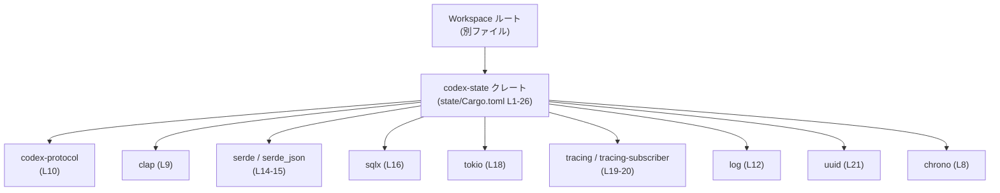
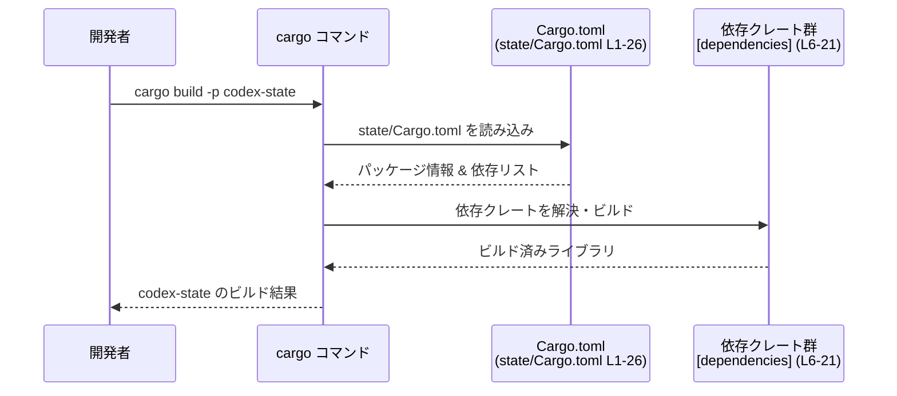

# state/Cargo.toml コード解説

## 0. ざっくり一言

このファイルは、`codex-state` クレートの Cargo マニフェストであり、パッケージ名とワークスペース共通設定、依存クレート、開発用依存、lint 設定を定義しています（state/Cargo.toml:L1-26）。Rust の関数や構造体などの実装は含まれていません。

---

## 1. このモジュールの役割

### 1.1 概要

- Rust パッケージマネージャ Cargo に対し、`codex-state` クレートのメタデータと依存関係を伝える設定ファイルです（L1-2）。
- バージョン、エディション、ライセンスはワークスペース共通設定を参照しており（`*.workspace = true`、L3-5）、依存クレートもほぼすべてワークスペース側でバージョン管理されています（L7-21, L23-24）。
- lint 設定もワークスペース共通とし、静的解析ポリシーをワークスペース全体で統一しています（L25-26）。

### 1.2 アーキテクチャ内での位置づけ

- `version.workspace = true` などから、このクレートは Cargo ワークスペースの一員であることが分かります（L3-5, L26）。
- 依存クレートはすべて `workspace = true` 指定で、バージョンや一部 feature の定義をワークスペースルートの `Cargo.toml` に委譲しています（L7-21, L23-24）。
- `codex-protocol`（L10）や `codex-git-utils`（L23）など、同じワークスペース内と推測される内部クレートに依存しています。

主要な依存関係に絞ったアーキテクチャ図です。



### 1.3 設計上のポイント

コードから読み取れる設計上の特徴は次のとおりです。

- **ワークスペース集中管理**  
  - バージョン、エディション、ライセンス、lint がすべて `workspace = true` で指定されています（L3-5, L26）。  
    これにより、依存バージョンやコーディング規約をワークスペースルートで一元管理する設計になっています。
- **エラー処理用クレート `anyhow`**  
  - `anyhow` が依存に含まれます（L7）。一般的には `anyhow::Result` を用いてエラーを一種類に集約するスタイルで使われますが、このファイルだけからは具体的な利用方法は分かりません。
- **CLI / 設定まわりの典型構成**  
  - `clap`（features: `derive`, `env`、L9）、`dirs`（L11）、`serde` / `serde_json`（L14-15）、`strum`（L17）などは、一般に CLI ツールや設定ファイル処理と組み合わせて使われる構成です。
- **非同期・並行処理前提の依存**  
  - `tokio` に `fs`, `io-util`, `macros`, `rt-multi-thread`, `sync`, `time` などの feature が有効です（L18）。  
    これにより、マルチスレッドな非同期ランタイム上で I/O やタイマーを扱うコードが存在することが示唆されます。
- **DB / ID / 日時関連**  
  - `sqlx`（L16）, `uuid`（L21）, `chrono`（L8）の組み合わせから、一般的には DB 永続化と UUID を使った識別子、日時処理が行われるケースが多い構成です。
- **観測性（ログ・トレース）**  
  - `log`（L12）と `tracing` / `tracing-subscriber`（L19-20）が同時に依存に入っており、従来のログ API と構造化トレースの両方を利用可能な設計になっています。

> 実際の公開 API・コアロジック・並行性の扱い・エラー処理の詳細は Rust ソースコード側にあり、このファイルには現れません。

---

## 2. 主要な機能一覧（コンポーネントインベントリー）

`Cargo.toml` 自体は実行時機能を持ちませんが、このクレートがビルド時にリンクする「コンポーネント（依存クレート）」の一覧を示します。

### 2.1 コンポーネント一覧

| コンポーネント | 種別 | 一般的な用途（参考） | 定義位置 |
|----------------|------|----------------------|----------|
| `codex-state` | パッケージ（本クレート） | ワークスペース内の 1 クレート。具体的なロジックは `src/` 以下にあると考えられます。 | L1-5 |
| `anyhow` | 依存クレート | 汎用エラー型によるエラー処理の単純化。 | L7 |
| `chrono` | 依存クレート | 日付・時刻の表現と操作。 | L8 |
| `clap`（`derive`, `env`） | 依存クレート | CLI 引数と環境変数のパース、構造体へのマッピング。 | L9 |
| `codex-protocol` | 内部クレート（推測） | プロジェクト固有のプロトコル・ドメイン定義など（詳細は別ファイル）。 | L10 |
| `dirs` | 依存クレート | OS ごとのユーザディレクトリ・設定ディレクトリ取得。 | L11 |
| `log` | 依存クレート | 伝統的な logging API（`info!`, `warn!` など）。 | L12 |
| `owo-colors` | 依存クレート | ターミナル出力への色付け。 | L13 |
| `serde`（`derive`） / `serde_json` | 依存クレート | シリアライズ／デシリアライズと JSON 処理。 | L14-15 |
| `sqlx` | 依存クレート | 非同期・型安全な SQL クライアント。 | L16 |
| `strum`（`derive`） | 依存クレート | enum のためのユーティリティ derive（文字列⇔enum 変換など）。 | L17 |
| `tokio`（fs, io-util, macros, rt-multi-thread, sync, time） | 依存クレート | マルチスレッド非同期ランタイムと関連ユーティリティ。 | L18 |
| `tracing` / `tracing-subscriber` | 依存クレート | 構造化ログや分散トレース、subscriber によるログ出力。 | L19-20 |
| `uuid` | 依存クレート | UUID の生成・パース。 | L21 |
| `codex-git-utils` | 開発用依存 | Git 操作ユーティリティ（推測）。テストや開発ツールから利用。 | L23 |
| `pretty_assertions` | 開発用依存 | テストでの差分を見やすく表示するアサーション。 | L24 |

> 用途欄は各クレートの一般的な機能の説明であり、`codex-state` がこれらをどう組み合わせているかは、このチャンクからは分かりません。

---

## 3. 公開 API と詳細解説

このファイルは Rust ソースコードではなく、関数・構造体・モジュール定義は一切含みません。

### 3.1 型一覧（構造体・列挙体など）

- `state/Cargo.toml`（L1-26）には、Rust の構造体・列挙体・型エイリアスの定義は存在しません。

| 名前 | 種別 | 役割 / 用途 | 定義位置 |
|------|------|-------------|----------|
| なし | — | — | — |

### 3.2 関数詳細

- このチャンクには関数・メソッド定義がないため、詳細解説の対象となる公開 API はありません。
- 公開 API やコアロジックは、別ファイル（通常は `src/lib.rs` や `src/main.rs` など）に定義されており、このチャンクには現れません。

### 3.3 その他の関数

- 該当なしです（state/Cargo.toml には関数が含まれません）。

---

## 4. データフロー

実行時ロジックのデータフローはこのファイルからは分かりませんが、**ビルド時に Cargo がどのように `Cargo.toml` を扱うか** という観点のフローを示します。

1. 開発者が `cargo build` や `cargo test` を実行する。
2. Cargo は `state/Cargo.toml`（L1-26）を読み込み、パッケージ名・依存・lint 設定を取得する。
3. `[dependencies]` と `[dev-dependencies]` のエントリ（L6-21, L22-24）に基づき、ワークスペースルートの設定と組み合わせて各クレートを解決・ビルドする。
4. 依存クレートがビルドされたあとで、`codex-state` の Rust コードをコンパイル・リンクする。



この図で扱っている情報は、すべて本チャンク（state/Cargo.toml:L1-26）に含まれる設定だけに基づいています。

---

## 5. 使い方（How to Use）

### 5.1 基本的な使用方法（ビルド・テスト）

`codex-state` クレートの Rust コードがすでに存在すると仮定すると、この `Cargo.toml` は次のように利用されます。

```bash
# ワークスペースルートから codex-state のみをビルド
cargo build -p codex-state

# codex-state のテストを実行
cargo test -p codex-state
```

- `-p codex-state` のパッケージ名は、このファイルの `name = "codex-state"` に一致します（L2）。

### 5.2 他クレートからの依存例（一般的な形）

同じワークスペース内の別クレートから `codex-state` を利用する場合の、一般的な `Cargo.toml` 例です。実際のパスや設定はこのチャンクからは分からないため、あくまで一例です。

```toml
[dependencies]
codex-state = { path = "../state" }  # 実際のパスはプロジェクト構成に依存
```

- ここで指定する crate 名は、`name = "codex-state"`（L2）に対応します。

### 5.3 よくある間違い（想定）

`Cargo.toml` 編集時に発生しがちな問題と、このファイルのスタイルに合わせた修正例です。

```toml
# 誤った例: ワークスペース管理を無視して個別にバージョンを指定
[dependencies]
tokio = "1.39"

# このファイルの方針に沿った例: ワークスペース管理に委譲
[dependencies]
tokio = { workspace = true }  # state/Cargo.toml:L18
```

- 本ファイルではすべての依存が `workspace = true` で統一されています（L7-21, L23-24）。  
  個別にバージョン文字列を指定すると、ワークスペース側と競合し、ビルドエラーやバージョン不整合の原因になり得ます。

### 5.4 使用上の注意点（まとめ）

- **ワークスペースとの整合性**  
  - `version.workspace = true` などにより、`codex-state` のバージョンや依存のバージョンはワークスペースルートの設定と密接に結びついています（L3-5, L7-21, L23-24, L26）。  
    ルート側の変更がこのクレートにも波及することを前提に運用する必要があります。
- **非同期・並行性に関する前提**  
  - `tokio` の `rt-multi-thread` や `sync` feature が有効のため（L18）、実装側では `Send` / `Sync` 制約や非同期 API の正しい利用が重要になります。  
    ただし、どの関数が `async` でどのようなスレッドモデルを取っているかは、本チャンクからは分かりません。
- **エラー処理スタイルの一貫性**  
  - `anyhow` 依存があるため（L7）、`Result<T, anyhow::Error>` あるいは `anyhow::Result<T>` ベースのエラー処理が採用されている可能性があります。  
    ソースコード側でスタイルを統一していない場合、エラーの扱いが分散しやすくなる点に注意が必要です。
- **観測性（ログ・トレース）の利用**  
  - `log` と `tracing` の両方が利用可能な構成です（L12, L19-20）。  
    実際にどちらをメインに使うのか、あるいは `tracing` を使いつつ `tracing-log` のようなブリッジを用いるのかはソースコード側の設計次第です。

---

## 6. 変更の仕方（How to Modify）

### 6.1 新しい機能を追加する場合（依存の追加）

新しい機能を追加するために依存クレートを増やす場合の一般的な手順です。

1. **ワークスペースルートの `Cargo.toml` を確認**  
   - 既存方針に合わせるなら、新しい依存もワークスペースルート側の `[workspace.dependencies]` 等に追加し、そこでバージョンを管理します。
2. **`state/Cargo.toml` への追記**  
   - 本ファイルの `[dependencies]` あるいは `[dev-dependencies]` に、`{ workspace = true }` を付けて依存名を追加します（L6-21, L22-24 と同じ形式）。
3. **ソースコード側の実装**  
   - `src/` 以下の Rust ファイルに実際の機能を実装し、新しい依存を `use` して利用します。  
     この部分は本チャンクには含まれていません。
4. **ビルド・テストの確認**  
   - `cargo build -p codex-state` / `cargo test -p codex-state` で新依存が正しく解決されるか確認します。

### 6.2 既存の機能を変更する場合（依存の変更・削除）

- **依存クレートの削除**  
  - 例: 実装から `dirs` を完全に排除した場合は、ソースコードから `dirs` の利用箇所を削除した後、この `Cargo.toml` の該当行（L11）とワークスペースルート側の依存宣言も削除する必要があります。
- **feature 構成の変更**  
  - `tokio` や `sqlx` の feature を減らす／増やす場合（例: L16, L18）、ソースコードがその feature に依存していないか事前に検索しておく必要があります。  
    不要な feature を外すことでバイナリサイズ削減やコンパイル時間短縮が期待できますが、足りないとコンパイルエラーやランタイムエラーが発生します。
- **内部クレートの変更影響**  
  - `codex-protocol` や `codex-git-utils`（L10, L23）の API を変更する場合、`codex-state` のソースコード側でそれらを参照している箇所の影響を確認する必要があります。  
    どの関数・構造体が使われているかは、本チャンクには現れず、ソースコード側を検索する必要があります。

---

## 7. 関連ファイル

この `Cargo.toml` と密接に関係すると考えられるファイル・クレートをまとめます。

| パス / クレート名 | 役割 / 関係 |
|-------------------|------------|
| ワークスペースルートの `Cargo.toml`（別ファイル） | `version.workspace = true` や各依存の `workspace = true`（L3-5, L7-21, L23-24, L26）が参照する設定元です。依存バージョンや共通 lints を定義しています。 |
| `codex-protocol` クレート | 本ファイルから依存している内部クレートです（L10）。プロトコルやドメインモデルなどを提供している可能性がありますが、このチャンクには定義が現れません。 |
| `codex-git-utils` クレート | 開発用依存として宣言されている内部クレートです（L23）。テストや開発用ツールから利用されると考えられますが、詳細は別ファイルです。 |
| `src/` ディレクトリ配下の Rust ファイル群 | `codex-state` の公開 API（関数・構造体）とコアロジックの実装本体です。このチャンクには含まれていません。 |
| テストコード（例: `tests/` や `src/*_test.rs`） | `pretty_assertions`（L24）や `codex-git-utils`（L23）を利用していると考えられるテスト群です。パスや内容はこのチャンクには現れません。 |

このチャンクはあくまでビルド設定のみを記述しており、公開 API、コアロジック、エッジケース、並行性の詳細な扱い、安全性に関する実装方針などは、別の Rust ソースコードファイルを確認する必要があります。
