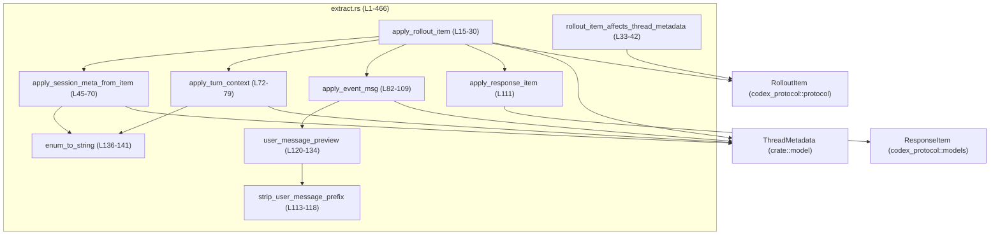
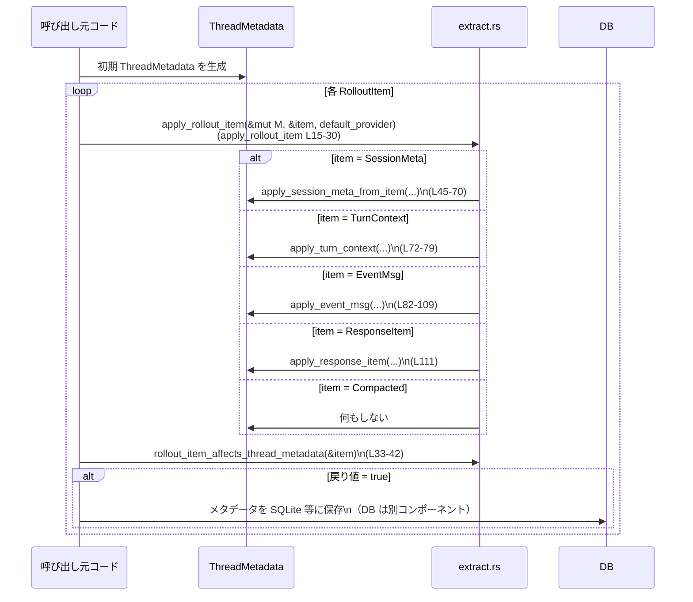

# state\src\extract.rs コード解説

## 0. ざっくり一言

`RolloutItem` のストリームを 1 本の `ThreadMetadata` 構造体に集約するためのユーティリティです。  
セッションメタ情報・ターンコンテキスト・イベントメッセージから、スレッドのタイトルやモデル情報・作業ディレクトリなどを抽出・更新します。

---

## 1. このモジュールの役割

### 1.1 概要

- このモジュールは **ロールアウトログから読み取ったイベント列**（`RolloutItem`）を解釈し、  
  **スレッド単位のメタデータ (`ThreadMetadata`) を更新する**ために存在しています。
- 具体的には:
  - `SessionMetaLine` からスレッド起点情報（ID, CWD, CLI 版, Git 情報など）を適用
  - `TurnContextItem` からモデル名・推論努力度・サンドボックス/承認ポリシーなどを適用
  - `EventMsg` からトークン使用量、最初のユーザメッセージ、スレッドタイトルを設定/更新
  - どの `RolloutItem` が永続化対象か判断するブール値を返す (`rollout_item_affects_thread_metadata`)

### 1.2 アーキテクチャ内での位置づけ

このファイルは、外部のプロトコル型を扱いながら内部モデル `ThreadMetadata` を更新する **境界レイヤ** に位置していると解釈できます（型名ベースの事実）。

- 外部入力:
  - `codex_protocol::protocol::RolloutItem`（セッションメタ、ターンコンテキスト、イベント）
  - `codex_protocol::models::ResponseItem`
- 内部モデル:
  - `crate::model::ThreadMetadata`
- 補助:
  - `serde_json::Value` で enum 等を文字列化する (`enum_to_string`)

依存関係の概略は次の通りです。



※ モジュール名はコード先頭の `use` から推測していますが、関数呼び出し関係は関数本体から直接読み取れる事実です（`state\src\extract.rs:L15-30`, `L45-70`, `L72-79`, `L82-109` など）。

### 1.3 設計上のポイント

- **明示的なディスパッチ**
  - すべてのロールアウト処理の入口は `apply_rollout_item` 1 箇所で、`RolloutItem` のバリアントごとに内部の専用関数へ振り分けています（`state\src\extract.rs:L20-25`）。
- **ID によるセッション整合性チェック**
  - `apply_session_meta_from_item` は `ThreadMetadata.id` と `SessionMetaLine.meta.id` が一致しない場合、セッションメタを無視します（`L45-50`）。  
    これにより、フォーク元セッションのメタが混入するのを防ぎます（コメント参照）。
- **「空」の判定に基づく上書き制御**
  - CWD は、セッションメタで設定済みならターンコンテキストでは上書きしない、というルールになっています（`L72-75` とテスト `L263-325`）。
  - モデルと推論 Effort は、セッションメタでは設定せず、ターンコンテキストからのみ設定します（`L72-79`, テスト `L393-423`）。
- **安全なデフォルトとフォールバック**
  - `metadata.model_provider` が空のままなら `default_provider` で埋めます（`L27-29`）。
  - enum の文字列化に失敗した場合は空文字列を返す (`enum_to_string`, `L136-141`) ことでパニックを避けます。
- **副作用箇所の明示**
  - `rollout_item_affects_thread_metadata` で「永続化対象となりうる item」を真偽値で判別可能にしています（`L33-42`）。  
    これにより、呼び出し側は SQLite などへの書き込み頻度をコントロールできます。

---

## 2. 主要な機能一覧（コンポーネントインベントリー）

### 2.1 関数・定数インベントリー

| 名前 | 種別 | 役割 / 用途 | 定義位置 |
|------|------|-------------|----------|
| `IMAGE_ONLY_USER_MESSAGE_PLACEHOLDER` | 定数 | 画像のみのユーザメッセージのプレビュー文字列（`"[Image]"`） | `state\src\extract.rs:L12` |
| `apply_rollout_item` | 関数 (pub) | 1 つの `RolloutItem` を `ThreadMetadata` に適用する入口関数 | `state\src\extract.rs:L15-30` |
| `rollout_item_affects_thread_metadata` | 関数 (pub) | 指定 `RolloutItem` がスレッドメタデータを変更しうるか判定 | `state\src\extract.rs:L33-42` |
| `apply_session_meta_from_item` | 関数 (private) | `SessionMetaLine` を `ThreadMetadata` に適用 | `state\src\extract.rs:L45-70` |
| `apply_turn_context` | 関数 (private) | `TurnContextItem` を `ThreadMetadata` に適用 | `state\src\extract.rs:L72-79` |
| `apply_event_msg` | 関数 (private) | `EventMsg` からトークン数・タイトル・最初のユーザメッセージを更新 | `state\src\extract.rs:L82-109` |
| `apply_response_item` | 関数 (private) | 将来の拡張用。現状は `ResponseItem` を無視 | `state\src\extract.rs:L111` |
| `strip_user_message_prefix` | 関数 (private) | `USER_MESSAGE_BEGIN` プリフィックスを除去しトリム | `state\src\extract.rs:L113-118` |
| `user_message_preview` | 関数 (private) | ユーザメッセージからプレビュー文字列を生成 | `state\src\extract.rs:L120-134` |
| `enum_to_string` | 関数 (pub(crate)) | 任意の `Serialize` 値を JSON 経由で文字列化 | `state\src\extract.rs:L136-141` |
| `tests` モジュール | モジュール | 上記ロジックの振る舞いをカバーする単体テスト群 | `state\src\extract.rs:L144-465` |

### 2.2 テストインベントリー

| テスト名 | 概要 | 関連する本体関数 | 定義位置 |
|---------|------|------------------|----------|
| `response_item_user_messages_do_not_set_title_or_first_user_message` | `ResponseItem::Message` がタイトル/first_user_message を変更しないことを検証 | `apply_rollout_item`, `apply_response_item` | `L171-188` |
| `event_msg_user_messages_set_title_and_first_user_message` | `EventMsg::UserMessage` が initial title と first_user_message をセットする | `apply_rollout_item`, `apply_event_msg`, `user_message_preview`, `strip_user_message_prefix` | `L190-207` |
| `thread_name_update_replaces_title_without_changing_first_user_message` | `ThreadNameUpdated` でタイトルのみ更新されること | `apply_event_msg` | `L209-225` |
| `event_msg_image_only_user_message_sets_image_placeholder_preview` | 画像のみユーザメッセージで `[Image]` プレースホルダが設定されること | `user_message_preview` | `L228-245` |
| `event_msg_blank_user_message_without_images_keeps_first_user_message_empty` | 空白のみ & 画像なしの場合、プレビューを設定しないこと | `user_message_preview` | `L247-261` |
| `turn_context_does_not_override_session_cwd` | session meta でセットした CWD を turn context が上書きしないこと | `apply_session_meta_from_item`, `apply_turn_context` | `L263-325` |
| `turn_context_sets_cwd_when_session_cwd_missing` | セッション側 CWD が空のときのみ turn context が CWD をセットすること | `apply_turn_context` | `L327-358` |
| `turn_context_sets_model_and_reasoning_effort` | モデル名と ReasoningEffort が turn context から設定されること | `apply_turn_context` | `L360-390` |
| `session_meta_does_not_set_model_or_reasoning_effort` | session meta では model/reasoning_effort を変更しないこと | `apply_session_meta_from_item` | `L393-423` |
| `diff_fields_detects_changes` | `ThreadMetadata::diff_fields` の振る舞い検証（実装は他ファイル） | `ThreadMetadata::diff_fields`（このチャンクには定義なし） | `L455-464` |

---

## 3. 公開 API と詳細解説

### 3.1 型一覧（このファイル内で定義されないが重要なもの）

このファイル内で新たな構造体・列挙体は定義されていませんが、外部の主要型を整理します。

| 名前 | 種別 | 役割 / 用途 | このチャンクでの扱い |
|------|------|-------------|----------------------|
| `ThreadMetadata` | 構造体 | 1 スレッドのメタ情報（ID, CWD, モデル, タイトル等） | 更新対象の内部モデル（`apply_*` 系関数の第一引数） |
| `RolloutItem` | 列挙体 | セッションメタ・ターンコンテキスト・イベント・レスポンスなどの 1 レコード | `apply_rollout_item` と `rollout_item_affects_thread_metadata` の入力 |
| `SessionMetaLine` | 構造体 | セッション起動時のメタ情報+Git 情報 | `apply_session_meta_from_item` の入力 |
| `TurnContextItem` | 構造体 | あるターンにおけるモデルや CWD 等のコンテキスト | `apply_turn_context` の入力 |
| `EventMsg` | 列挙体 | トークン数、ユーザメッセージ、スレッド名更新などのイベント | `apply_event_msg` の入力 |
| `ResponseItem` | 列挙体 | モデルからの出力メッセージなど | `apply_response_item` の入力 |
| `UserMessageEvent` | 構造体 | ユーザからのメッセージ（テキスト・画像） | `user_message_preview` の入力 |

これらの定義は他ファイルにあり、このチャンクには出現しません（`use` のみ）。

---

### 3.2 関数詳細（重要な 7 件）

#### 3.2.1 `apply_rollout_item(metadata: &mut ThreadMetadata, item: &RolloutItem, default_provider: &str)`

**定義位置**

- `state\src\extract.rs:L15-30`

```rust
pub fn apply_rollout_item(
    metadata: &mut ThreadMetadata,
    item: &RolloutItem,
    default_provider: &str,
) { ... }
```

**概要**

1 つの `RolloutItem` を `ThreadMetadata` に適用する入口関数です。  
`RolloutItem` のバリアントに応じて専用の処理関数を呼び出し、最後に `model_provider` が空なら `default_provider` で補います。

**引数**

| 引数名 | 型 | 説明 |
|--------|----|------|
| `metadata` | `&mut ThreadMetadata` | 更新対象のスレッドメタデータ。可変参照で渡され、その場で更新されます。 |
| `item` | `&RolloutItem` | ロールアウトから取り出した 1 レコード。バリアントに応じて処理が分岐します。 |
| `default_provider` | `&str` | `metadata.model_provider` が空だった場合に使われるデフォルトのモデルプロバイダ名。 |

**戻り値**

- 戻り値はありません。副作用として `metadata` を更新します。

**内部処理の流れ**

1. `match item` で `RolloutItem` のバリアントを判定（`L20-25`）。
   - `SessionMeta(meta_line)` → `apply_session_meta_from_item(metadata, meta_line)` を呼び出し（`L21`）。
   - `TurnContext(turn_ctx)` → `apply_turn_context(metadata, turn_ctx)`（`L22`）。
   - `EventMsg(event)` → `apply_event_msg(metadata, event)`（`L23`）。
   - `ResponseItem(item)` → `apply_response_item(metadata, item)`（`L24`）。
   - `Compacted(_)` → 何もしない（`L25`）。
2. ディスパッチ後、`metadata.model_provider` が空文字列であれば `default_provider.to_string()` を代入（`L27-29`）。

**Examples（使用例）**

ロールアウトファイルの各行を読み込みながらメタデータを更新するイメージです。

```rust
use crate::model::ThreadMetadata;
use codex_protocol::protocol::RolloutItem;

fn rebuild_metadata_from_rollout(items: &[RolloutItem], default_provider: &str) -> ThreadMetadata {
    let mut meta = initial_thread_metadata();           // 事前に ThreadMetadata を用意
    for item in items {                                 // 各 RolloutItem を順に適用
        apply_rollout_item(&mut meta, item, default_provider);
    }
    meta
}
```

**Errors / Panics**

- この関数自体は `Result` を返さず、内部でも `unwrap` や `expect` は使用していません。
- `enum_to_string` の失敗は `""` として処理されるため、ここから直接パニックする可能性は読み取れません。

**Edge cases（エッジケース）**

- `RolloutItem::Compacted(_)` の場合: メタデータは一切変更されません（`L25`）。
- `default_provider` が空文字列の場合:
  - `metadata.model_provider` が空のときに空文字列が代入され、そのまま残る可能性があります（`L27-29`）。  
    これはコード上許容されていますが、意味のあるデフォルト設定を期待している場合は呼び出し側注意点になります。
- すでに `metadata.model_provider` がセット済みの場合:
  - `default_provider` は無視されます（`L27` の条件）。

**使用上の注意点**

- **順序の前提**:
  - `apply_session_meta_from_item` と `apply_turn_context` のロジックから、セッションメタとターンコンテキストの適用順序はメタデータの結果に影響します（例: CWD）。  
    テストでは「SessionMeta → TurnContext」の順で適用するケースを検証しています（`L263-317`）。
- **並行性**:
  - `&mut ThreadMetadata` を取るため、1 つの `ThreadMetadata` を複数スレッドから同時に更新する場合は、呼び出し側で `Mutex` などの同期が必要です（このモジュール内では同期手段は提供されていません）。

---

#### 3.2.2 `rollout_item_affects_thread_metadata(item: &RolloutItem) -> bool`

**定義位置**

- `state\src\extract.rs:L33-42`

```rust
pub fn rollout_item_affects_thread_metadata(item: &RolloutItem) -> bool { ... }
```

**概要**

与えられた `RolloutItem` が、`ThreadMetadata` の状態を「変えうる」ものかどうかを返します。  
コメントにあるように、SQLite に保存されているメタデータを変更するかどうかの判定に利用されることを意図しています（`L32`）。

**引数**

| 引数名 | 型 | 説明 |
|--------|----|------|
| `item` | `&RolloutItem` | 判定対象のロールアウトアイテム |

**戻り値**

- `bool`:
  - `true` = メタデータを変えうる（ので永続化処理が必要）と見なされる
  - `false` = メタデータには影響しないとみなされる

**内部処理の流れ**

1. `match item` でバリアントごとに判定（`L34-41`）。
2. 次のケースでは `true` を返す（`L35-38`）。
   - `RolloutItem::SessionMeta(_)`
   - `RolloutItem::TurnContext(_)`
   - `RolloutItem::EventMsg(EventMsg::TokenCount(_))`
   - `RolloutItem::EventMsg(EventMsg::UserMessage(_))`
   - `RolloutItem::EventMsg(EventMsg::ThreadNameUpdated(_))`
3. それ以外（`EventMsg` のその他バリアント、`ResponseItem`, `Compacted`）は `false`（`L39-41`）。

**Examples（使用例）**

```rust
fn should_persist(item: &RolloutItem) -> bool {
    rollout_item_affects_thread_metadata(item)
}

fn apply_and_maybe_persist(meta: &mut ThreadMetadata, item: &RolloutItem, default_provider: &str) {
    if rollout_item_affects_thread_metadata(item) {     // 影響ありなら
        apply_rollout_item(meta, item, default_provider);
        // ここで SQLite に書き戻すなどの処理を行う想定
    }
}
```

**Errors / Panics**

- 単純なマッチングのみで、パニックの可能性は見当たりません。

**Edge cases**

- 実際にはメタデータに変化がないケースでも `true` になりうる:
  - 例えば 2 回目以降の `EventMsg::UserMessage` で、既に `first_user_message` と `title` がセット済みだと実際には何も変わりませんが、ここでは `true` を返します。  
    これはテストからも否定されておらず、設計上許容されている挙動と見なせます。

**使用上の注意点**

- この関数は「変化の可能性」を返すだけであり、実際に変化があったかどうかは見ていません。  
  書き込み頻度を減らしたい場合でも、「true なのに実際は変化無し」というケースは起こりえます。

---

#### 3.2.3 `apply_session_meta_from_item(metadata: &mut ThreadMetadata, meta_line: &SessionMetaLine)`

**定義位置**

- `state\src\extract.rs:L45-70`

```rust
fn apply_session_meta_from_item(metadata: &mut ThreadMetadata, meta_line: &SessionMetaLine) { ... }
```

**概要**

`SessionMetaLine` から、スレッド ID・ソース・エージェント情報・CWD・CLI バージョン・Git 関連情報などを `ThreadMetadata` に適用します。  
スレッド ID が一致しない場合は、セッションメタを無視します。

**引数**

| 引数名 | 型 | 説明 |
|--------|----|------|
| `metadata` | `&mut ThreadMetadata` | 更新対象のメタデータ |
| `meta_line` | `&SessionMetaLine` | ロールアウトに含まれるセッションメタ情報 |

**戻り値**

- なし（`metadata` を更新）。

**内部処理の流れ**

1. スレッド ID の整合性チェック（`L45-50`）。
   - `if metadata.id != meta_line.meta.id { return; }`
   - コメントにより、「フォークされたロールアウトがソース側のメタを含んでいる場合」などを想定し、カノニカルな ID と異なる行を無視していることが明示されています（`L47-48`）。
2. ID, source, agent 系フィールドを更新（`L51-55`）。
   - `metadata.source = enum_to_string(&meta_line.meta.source);`（`L52`）
3. `model_provider` が `Some` のときのみ上書き（`L56-58`）。
4. `cli_version` が空でなければ上書き（`L59-61`）。
5. `cwd` が空でなければ上書き（`L62-64`）。
6. `git` 情報があれば、`git_sha`, `git_branch`, `git_origin_url` を更新（`L65-69`）。

**Examples**

テスト `turn_context_does_not_override_session_cwd` では、この関数を通じて CWD を `/child/worktree` に設定しています（`L269-293`）。

**Errors / Panics**

- `enum_to_string` は内部で `Result` を処理しているため、ここからパニックは発生しません。
- ID 不一致時は黙って `return` するだけです。

**Edge cases**

- `metadata.id` と `meta_line.meta.id` が一致しない:
  - 何も更新されません（`L46-50`）。
- `meta_line.meta.model_provider` が `None`:
  - `metadata.model_provider` は変更されません（`L56-58`）。  
    その後 `apply_rollout_item` 経由で `default_provider` によって補完される可能性があります（`L27-29`）。
- `meta_line.meta.cwd` が空 (`as_os_str().is_empty()`):
  - 既存の `metadata.cwd` を維持します（`L62-64`）。

**使用上の注意点**

- **ID 整合性が前提**:
  - 異なるスレッド ID のセッションメタを同じ `ThreadMetadata` に適用しようとしても無視されます。  
    呼び出し側は `metadata.id` を適切に初期化しておく必要があります（テストでは `metadata_for_test` がそれを行っています: `L426-453`）。
- **モデル情報には触れない**:
  - `metadata.model` と `metadata.reasoning_effort` は一切更新しません。  
    これらは `apply_turn_context` 側の責務であることが `session_meta_does_not_set_model_or_reasoning_effort` テストから確認できます（`L393-423`）。

---

#### 3.2.4 `apply_turn_context(metadata: &mut ThreadMetadata, turn_ctx: &TurnContextItem)`

**定義位置**

- `state\src\extract.rs:L72-79`

```rust
fn apply_turn_context(metadata: &mut ThreadMetadata, turn_ctx: &TurnContextItem) { ... }
```

**概要**

あるターンにおけるコンテキスト情報（CWD, モデル名, 推論 Effort, サンドボックス/承認ポリシー）を `ThreadMetadata` に適用します。

**引数**

| 引数名 | 型 | 説明 |
|--------|----|------|
| `metadata` | `&mut ThreadMetadata` | 更新対象 |
| `turn_ctx` | `&TurnContextItem` | ターンコンテキスト |

**戻り値**

- なし。

**内部処理の流れ**

1. `metadata.cwd` が空 (`as_os_str().is_empty()`) のときに限り、`turn_ctx.cwd` で上書き（`L72-75`）。
2. `metadata.model = Some(turn_ctx.model.clone());`（`L76`）。
3. `metadata.reasoning_effort = turn_ctx.effort;`（`L77`）。
4. `metadata.sandbox_policy = enum_to_string(&turn_ctx.sandbox_policy);`（`L78`）。
5. `metadata.approval_mode = enum_to_string(&turn_ctx.approval_policy);`（`L79`）。

**Examples**

テスト `turn_context_sets_model_and_reasoning_effort`（`L360-390`）では、この関数により:

- `metadata.model` が `"gpt-5"` に更新
- `metadata.reasoning_effort` が `Some(ReasoningEffort::High)` に設定

されることが確認されています。

**Errors / Panics**

- ここでも `enum_to_string` 経由のシリアライズ失敗は空文字列にフォールバックするだけであり、パニックは発生しません。

**Edge cases**

- `metadata.cwd` がすでに非空:
  - `turn_ctx.cwd` は無視されます（`L72-75`）。テスト `turn_context_does_not_override_session_cwd` がこれを確認（`L263-325`）。
- `turn_ctx.effort` が `None`:
  - `metadata.reasoning_effort` も `None` になります（`L77`）。これは `Option` のコピーなので特別な扱いはありません。
- `SandboxPolicy` や `AskForApproval` の enum 形が文字列化できない場合:
  - `enum_to_string` が空文字を返し、`sandbox_policy` や `approval_mode` が `""` になる可能性があります（`L136-141`）。

**使用上の注意点**

- **CWD の優先順位**:
  - セッションメタ（`SessionMetaLine`）からセットされる CWD の方が優先され、ターンコンテキストは「フォールバック用」としてのみ動きます。  
    そのため、ロールアウトの適用順序が「SessionMeta → TurnContext」である前提が実質的に組み込まれています（テスト `L263-317`）。
- **並行性**:
  - `metadata` をミュータブルに更新する点は他関数と同様で、並行使用は呼び出し側の責務です。

---

#### 3.2.5 `apply_event_msg(metadata: &mut ThreadMetadata, event: &EventMsg)`

**定義位置**

- `state\src\extract.rs:L82-109`

```rust
fn apply_event_msg(metadata: &mut ThreadMetadata, event: &EventMsg) { ... }
```

**概要**

`EventMsg` の内容に応じて、`ThreadMetadata` の以下のフィールドを更新します。

- `tokens_used`
- `first_user_message`
- `title`

**引数**

| 引数名 | 型 | 説明 |
|--------|----|------|
| `metadata` | `&mut ThreadMetadata` | 更新対象 |
| `event` | `&EventMsg` | イベントメッセージ |

**戻り値**

- なし。

**内部処理の流れ**

`match event` でバリアントごとに処理（`L83-107`）。

1. `EventMsg::TokenCount(token_count)`（`L84-88`）
   - `token_count.info.as_ref()` が `Some(info)` のとき、
     - `metadata.tokens_used = info.total_token_usage.total_tokens.max(0);`
       - `total_tokens` が 0 未満なら 0 に切り上げ（`max(0)`）。
2. `EventMsg::UserMessage(user)`（`L89-99`）
   - `metadata.first_user_message` が `None` の場合のみ:
     - `metadata.first_user_message = user_message_preview(user);`（`L90-91`）
   - `metadata.title` が空文字の場合のみ:
     - `strip_user_message_prefix(user.message.as_str())` でメッセージ先頭のプリフィックスを除去しトリム（`L94-95`）。
     - 非空ならその文字列を `metadata.title` にセット（`L96-97`）。
3. `EventMsg::ThreadNameUpdated(updated)`（`L100-105`）
   - `updated.thread_name.as_deref()` が `Some(title)` かつ `title.trim()` が非空なら、
     - `metadata.title = title.trim().to_string();`（`L104`）。
4. その他のバリアントは何もしない（`_ => {}`, `L107`）。

**Examples**

- `event_msg_user_messages_set_title_and_first_user_message` テスト（`L190-207`）:
  - `USER_MESSAGE_BEGIN` 付きのメッセージから `"actual user request"` を抽出し、`first_user_message` と `title` を設定。
- `thread_name_update_replaces_title_without_changing_first_user_message` テスト（`L209-225`）:
  - 既存タイトル `"actual user request"` を `"saved-session"` に置き換える一方で、`first_user_message` は保持。

**Errors / Panics**

- パニックを引き起こすような `unwrap` などはありません。
- `TokenCount` の `info` が `None` の場合、何もせずにスキップします（`L85-87`）。

**Edge cases**

- トークン数が負かもしれない場合:
  - `.max(0)` により 0 未満にはなりません（`L86`）。
- ユーザメッセージが空文字または空白のみ:
  - `strip_user_message_prefix` 内で `trim` され、空文字になれば `title` は設定されません（`L94-97`）。
  - `user_message_preview` 側でも空文字として扱われます（詳細は後述）。
- タイトルがすでに設定済みのときの `UserMessage`:
  - `metadata.title.is_empty()` が偽になるため、後続のイベントはタイトルを上書きしません（`L93-98`）。
- `ThreadNameUpdated` の `thread_name` が `Some("   ")` のような空白のみ:
  - `trim().is_empty()` なので無視されます（`L101-103`）。

**使用上の注意点**

- **最初の UserMessage だけを記録する**:
  - `first_user_message` は最初の `UserMessage` のみを記録し、以降は変更されません（`L90-92`）。  
    これは「スレッドの起点となるユーザのリクエスト」を記録する設計と解釈できます。
- **タイトル更新の優先順位**:
  - 最初に `UserMessage` からタイトルを推測し、その後 `ThreadNameUpdated` イベントが来た場合に上書きされます（テスト `L190-207`, `L209-225`）。  
    呼び出し順はロールアウト上の出現順に依存します。

---

#### 3.2.6 `user_message_preview(user: &UserMessageEvent) -> Option<String>`

**定義位置**

- `state\src\extract.rs:L120-134`

```rust
fn user_message_preview(user: &UserMessageEvent) -> Option<String> { ... }
```

**概要**

`UserMessageEvent` から、スレッドプレビュー用の文字列を生成します。

- テキスト部分があれば、その内容（プレフィックス除去＋トリム）を返す。
- テキストが空だが画像があれば、`"[Image]"` プレースホルダを返す。
- どちらもなければ `None`。

**引数**

| 引数名 | 型 | 説明 |
|--------|----|------|
| `user` | `&UserMessageEvent` | プレビュー対象のユーザメッセージ |

**戻り値**

- `Option<String>`:
  - `Some(preview)` = プレビュー用文字列
  - `None` = プレビュー不要（空/実質的に情報がない）

**内部処理の流れ**

1. `strip_user_message_prefix(user.message.as_str())` でプレフィックス除去＋トリムし、`message` に格納（`L121`）。
2. `if !message.is_empty()` なら `Some(message.to_string())` を返す（`L122-123`）。
3. そうでなければ、画像有無をチェック（`L125-130`）。
   - `user.images.as_ref().is_some_and(|images| !images.is_empty())` が真
   - または `!user.local_images.is_empty()` が真  
   → `Some("[Image]".to_string())` を返す（`L131`）。
4. いずれも該当しなければ `None`（`L133-134`）。

**Examples**

- `event_msg_image_only_user_message_sets_image_placeholder_preview` テスト（`L228-245`）:
  - `message: ""`, `images: Some(vec!["https://example.com/image.png"])` のケースで `Some("[Image]")` が返され、`first_user_message` に設定されることを確認。
- `event_msg_blank_user_message_without_images_keeps_first_user_message_empty`（`L247-261`）:
  - `message: "   "`, `images: Some(vec![])`, `local_images: []` の場合、`None` が返され `first_user_message` は `None` のまま。

**Errors / Panics**

- パニックを引き起こす操作はありません。

**Edge cases**

- `USER_MESSAGE_BEGIN` が中間に含まれるテキスト:
  - `strip_user_message_prefix` は最初の出現位置以降を返す仕様なので、先頭以外に現れた場合もそこから後ろが採用されます（`L113-116`）。  
    ただしテストからは主にプレフィックス用途で使われる前提が読み取れます（`L193-200`）。
- `images: None` と `images: Some(vec![])` の違い:
  - `images: None` → `is_some_and` が `false`
  - `images: Some(vec![])` → `is_some_and(|images| !images.is_empty())` が `false`  
    いずれも「画像なし」とみなされます。

**使用上の注意点**

- この関数はタイトルではなく「プレビュー」専用であり、空白のみのテキストは情報がないものとして扱われます。  
  プレビューに何を表示するかの方針を変えたい場合は、この関数が入口になります。

---

#### 3.2.7 `enum_to_string<T: Serialize>(value: &T) -> String`

**定義位置**

- `state\src\extract.rs:L136-141`

```rust
pub(crate) fn enum_to_string<T: Serialize>(value: &T) -> String { ... }
```

**概要**

任意の `Serialize` 実装型（主に enum を想定）を JSON にシリアライズし、以下のルールで `String` に変換します。

- JSON が `Value::String(s)` なら、その文字列 `s` を返す。
- それ以外（オブジェクト・数値など）は `Value` の `to_string()`（JSON 文字列）を返す。
- シリアライズに失敗した場合は空文字 `""` を返す。

**引数**

| 引数名 | 型 | 説明 |
|--------|----|------|
| `value` | `&T` where `T: Serialize` | 文字列化したい値 |

**戻り値**

- `String`:
  - 期待されるケースでは enum のバリアント名や文字列表現。
  - シリアライズ失敗時は空文字。

**内部処理の流れ**

1. `serde_json::to_value(value)` を呼び出し（`L137`）。
2. `match` で結果を分岐（`L137-140`）。
   - `Ok(Value::String(s))` → `s`
   - `Ok(other)` → `other.to_string()`
   - `Err(_)` → `String::new()`（空文字）

**Examples**

テスト `turn_context_does_not_override_session_cwd`（`L263-325`）で、`SandboxPolicy::DangerFullAccess` を文字列化した結果と `metadata.sandbox_policy` を比較しています（`L320-323`）。  
このことから、`SandboxPolicy` は `Serialize` を実装しており、`enum_to_string` で適切な文字列が得られていることが確認できます。

**Errors / Panics**

- シリアライズ失敗は `Err(_)` でキャッチし、空文字にフォールバックするため、パニックは発生しません。

**Edge cases**

- 複雑な構造体やオブジェクトを渡した場合:
  - `Value::String` でないため、`other.to_string()` で JSON 文字列（`{"field":"value"}` のような形式）が返されます。
- シリアライズ不能（`Serialize` 実装にバグがあるなど）:
  - 空文字が返り、呼び出し側からは「値なし」のように見えます。

**使用上の注意点**

- **エラーが静かに無視される**:
  - シリアライズ失敗を知る手段がなく、空文字と区別できません。  
    厳密な検証が必要な場面では、別途ログや検証を行う必要があります（このモジュールではログ出力はしていません）。
- **型ごとの表現**:
  - enum が `serde(rename)` などでカスタムラベルを持っている場合、そのラベルが返されます。  
    仕様変更時には `enum_to_string` を利用しているフィールド（`source`, `sandbox_policy`, `approval_mode` など）の変更影響を確認する必要があります。

---

### 3.3 その他の関数

| 関数名 | 役割（1 行） | 定義位置 |
|--------|--------------|----------|
| `apply_response_item(_metadata: &mut ThreadMetadata, _item: &ResponseItem)` | 現状は何もせず、`ResponseItem` によってスレッドメタが変化しないことを保証している（テスト `L171-188` 参照）。 | `L111` |
| `strip_user_message_prefix(text: &str) -> &str` | `USER_MESSAGE_BEGIN` の出現位置から後ろを取り出しトリムする。なければ全体をトリム。 | `L113-118` |

---

## 4. データフロー

ここでは、代表的な処理シナリオとして「ロールアウトログからメタデータを再構築する」フローを示します。

### 4.1 処理の要点

1. 呼び出し元が空の `ThreadMetadata` を用意する。
2. ロールアウトファイル（JSON Lines など）を行単位で読み込み、それぞれを `RolloutItem` にデシリアライズする（この部分は他ファイル）。
3. 各 `RolloutItem` について `apply_rollout_item` を呼ぶ。
4. 必要なら `rollout_item_affects_thread_metadata` を用いて永続化の要否を判定し、SQLite などに書き戻す。

### 4.2 シーケンス図



※ DB やロールアウト読み込み部分はこのチャンクには現れないため、名前を抽象化して表現しています。

---

## 5. 使い方（How to Use）

### 5.1 基本的な使用方法

最小限の例として、メモリ上で `RolloutItem` の配列から `ThreadMetadata` を構築するコードです。

```rust
use crate::model::ThreadMetadata;
use codex_protocol::protocol::RolloutItem;
use state::extract::{apply_rollout_item, rollout_item_affects_thread_metadata};

// 初期メタデータを構築する（詳細は crate::model 側の定義に依存）
fn initial_metadata() -> ThreadMetadata {
    // テストの metadata_for_test と同様に、必要な初期値を設定する
    // （このチャンクには ThreadMetadata の定義がないため詳細は不明）
    unimplemented!()
}

fn build_metadata(items: &[RolloutItem], default_provider: &str) -> ThreadMetadata {
    let mut meta = initial_metadata();                       // スレッドメタデータを初期化
    for item in items {
        apply_rollout_item(&mut meta, item, default_provider); // 各 RolloutItem を適用
        if rollout_item_affects_thread_metadata(item) {
            // 必要に応じてここで DB 永続化などを行う
        }
    }
    meta
}
```

### 5.2 よくある使用パターン

1. **ロールアウト再生時の逐次更新**

   - ロールアウトファイルを先頭から順に読み、1 レコードごとに `apply_rollout_item` を呼ぶ。
   - タイトル・最初のユーザメッセージ・トークン数が自然に蓄積される。

2. **差分検出と更新**

   テスト `diff_fields_detects_changes`（`L455-464`）から、`ThreadMetadata::diff_fields` というメソッドが存在することが読み取れます（定義は他ファイル）。

   - 2 つの `ThreadMetadata` を比較して、変更されたフィールド名を抽出。
   - 実際に変更があったフィールドだけを DB に反映する、といった用途が想定できます。

### 5.3 よくある間違い

```rust
// 間違い例: default_provider を空にしてしまう
let default_provider = "";
apply_rollout_item(&mut meta, &item, default_provider);
// → SessionMeta に model_provider が無い場合、meta.model_provider が "" のままになる

// 正しい例: 意味のあるデフォルトプロバイダ名を渡す
let default_provider = "openai";
apply_rollout_item(&mut meta, &item, default_provider);
```

```rust
// 間違い例: SessionMetaLine の id と ThreadMetadata の id が一致していない
meta.id = some_thread_id;
let meta_line = SessionMetaLine {
    meta: SessionMeta { id: other_id, /* ... */ },
    git: None,
};
apply_rollout_item(&mut meta, &RolloutItem::SessionMeta(meta_line), "openai");
// → apply_session_meta_from_item 内で早期 return となり、何も更新されない

// 正しい例: 同じスレッド ID を使う
let meta_line = SessionMetaLine {
    meta: SessionMeta { id: meta.id, /* ... */ },
    git: None,
};
```

### 5.4 使用上の注意点（まとめ）

- **スレッド ID の整合性**  
  `apply_session_meta_from_item` は ID 不一致を黙って無視します（`L45-50`）。  
  想定外にメタが更新されない場合は、`ThreadMetadata.id` と `SessionMeta.meta.id` の確認が必要です。

- **CWD の優先順位と順序依存**  
  一度 `metadata.cwd` が非空になると、以後の `TurnContextItem` では変更されません（`L72-75`）。  
  CWD を SessionMeta ではなく TurnContext から決めたい場合は、適用順や初期値に注意が必要です。

- **タイトル・プレビューの一貫性**
  - `first_user_message` は最初の `UserMessage` からのみ設定されます（`L90-92`）。
  - タイトルは:
    1. 最初の `UserMessage` で空なら設定
    2. `ThreadNameUpdated` で非空名が来たら上書き  
    という優先順位です（`L93-98`, `L100-105`）。

- **セキュリティ観点**
  - 文字列の加工は `trim` や `serde_json::to_value` のみで、`unsafe` は一切使用していません。
  - ID 整合性チェックにより、他スレッドのセッションメタが誤って混入することを防止しています（`L45-50`）。

- **エラー処理**
  - すべての内部処理は `Result` を返さず、失敗時は「何もしない」または「空文字」という挙動になります。
  - 重要な enum の文字列化が空文字になると、後続のロジックが誤解する可能性があるため、必要に応じて周辺でログ出力などを追加する余地があります。

- **並行性**
  - モジュール内はすべて同期コードであり、`async` やスレッド関連の型は使用していません。
  - `ThreadMetadata` を複数スレッドから更新する場合は、外側でロックなどを行う必要があります。

---

## 6. 変更の仕方（How to Modify）

### 6.1 新しい機能を追加する場合

例: 新しいイベント `EventMsg::SomethingNew` からメタデータを更新したい場合。

1. **`RolloutItem` / `EventMsg` の拡張**  
   - これは `codex_protocol` 側の変更であり、このチャンクには現れません。

2. **`apply_event_msg` の拡張**（`L82-109` を編集）
   - `match event` に新バリアントを追加し、`metadata` の適切なフィールドを更新します。

3. **`rollout_item_affects_thread_metadata` の更新**（`L33-42`）
   - 新イベントがメタデータを変更しうるなら、`true` を返す分岐に加えます。

4. **テスト追加**  
   - `#[cfg(test)] mod tests` 内に、新バリアントに対する振る舞いを検証するテストを追加します（`L144-465` を参照）。

### 6.2 既存の機能を変更する場合

- **契約の確認**
  - `apply_session_meta_from_item` が「ID 不一致を無視する」「model/reasoning_effort を設定しない」などの契約を持っていることは、テスト `session_meta_does_not_set_model_or_reasoning_effort`（`L393-423`）が示しています。
  - これらを変更すると既存呼び出し元の期待を壊す可能性があるため、テストを更新するか、挙動変更を慎重に評価する必要があります。

- **影響範囲の確認**
  - `enum_to_string` の仕様を変えると、`source`, `sandbox_policy`, `approval_mode` など複数フィールドに影響します（`L52`, `L78-79`）。
  - `strip_user_message_prefix` の仕様を変えると、タイトル生成とプレビュー生成の両方に影響します（`L94-95`, `L121`）。

- **テストの見直し**
  - このファイルのテストは挙動をかなりピンポイントに検証しているため、変更した箇所に対応するテストを更新または追加することが推奨されます。

---

## 7. 関連ファイル

このファイルと密接に関係するが、このチャンクには定義が現れないものを列挙します。

| パス / 型 | 役割 / 関係 |
|----------|------------|
| `crate::model::ThreadMetadata` | スレッドメタデータの本体構造体。ここでフィールド更新を行います（`L1`, `L147`, `L426-453`）。`diff_fields` メソッドもここに定義されていると推測されますが、このチャンクには実装は現れません。 |
| `codex_protocol::protocol::RolloutItem` | ロールアウトログ 1 行に対応するイベント列挙体（`L4`, テスト中多数）。 |
| `codex_protocol::protocol::SessionMetaLine`, `SessionMeta`, `SessionSource` | セッション起動時のメタ情報型。`apply_session_meta_from_item` で使用（`L5`, テスト `L271-291`, `L400-417`）。 |
| `codex_protocol::protocol::TurnContextItem`, `SandboxPolicy`, `AskForApproval` | ターンごとのコンテキスト情報。`apply_turn_context` および関連テストで使用（`L6`, `L155`, `L158`, `L263-325` など）。 |
| `codex_protocol::protocol::EventMsg`, `UserMessageEvent`, `ThreadNameUpdatedEvent`, `USER_MESSAGE_BEGIN` | イベントメッセージ型とユーザメッセージ用のプリフィックス定数。`apply_event_msg`, `user_message_preview` の入力として使用（`L3`, `L7-8`, `L156`, `L162-165`）。 |
| `codex_protocol::models::ResponseItem` | レスポンスメッセージ型。現状 `apply_response_item` では無視され、テストで「メタデータに影響がない」ことが検証されています（`L2`, `L152-153`, `L171-188`）。 |

このチャンクだけでは、これら外部型のフィールド詳細や追加メソッドは分かりません。  
必要に応じて、それぞれの定義ファイルを参照する必要があります。
