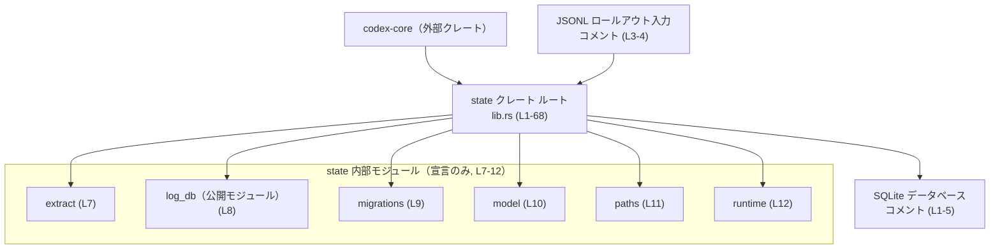
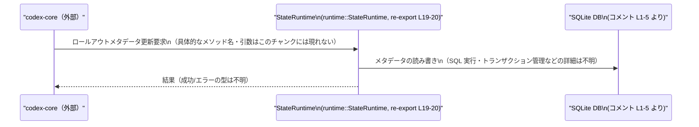

# state/src/lib.rs コード解説

## 0. ざっくり一言

`state/src/lib.rs` は、**ロールアウトメタデータを SQLite に保存する小さな crate のルートモジュール**で、内部モジュール（`extract`, `log_db`, `model`, `runtime` など）の公開 API をまとめて再輸出し、SQLite のファイル名・バージョンやメトリクス名といった定数を集中管理する役割を持っています（`state/src/lib.rs:L1-5`, `L7-12`, `L55-68`）。

---

## 1. このモジュールの役割

### 1.1 概要

ドキュメントコメントから、crate 全体の役割は次のように整理できます。

> この crate は、JSONL 形式のロールアウトからロールアウトメタデータを抽出し（extract）、それをローカルの SQLite データベースに反映（mirror）するためのものです。バックフィル（backfill）のオーケストレーションとロールアウトのスキャン自体は `codex-core` にあり、この crate は「状態ストア」として特化しています（`state/src/lib.rs:L1-5`）。

`lib.rs` 自体はロジックをほとんど持たず、

- 内部モジュールの宣言（`mod extract;` など、`L7-12`）
- それらからの主要な型・関数の再輸出（`pub use model::...;`, `pub use runtime::...;`, `L14-53`）
- SQLite ファイル名やスキーマバージョン、メトリクス名の定数定義（`L55-68`）

を提供する、**API の入口および定数の集約点**になっています。

### 1.2 アーキテクチャ内での位置づけ

crate レベルで見たときの、外部コンポーネントと内部モジュールの関係は次のように整理できます。



- `Core → state` は、「バックフィルのオーケストレーションとロールアウトスキャンは `codex-core` にある」というコメントから導かれます（`L3-5`）。
- `state → JSONL/SQLite` は、「JSONL rollouts からメタデータを抽出し、ローカル SQLite にミラーする」という記述から導かれます（`L1-4`）。
- 内部モジュールへの依存は、`mod` 宣言から確実に読み取れます（`L7-12`）。
- どの内部モジュールが JSONL/SQLite と実際にやり取りするかはこのチャンクには現れないため、詳細な責務分担は不明です。

### 1.3 設計上のポイント

このファイルから読み取れる設計上の特徴を列挙します。

- **責務の分割**（`L7-12`）
  - `extract`, `log_db`, `migrations`, `model`, `paths`, `runtime` といったモジュールに分割され、抽出ロジック・DB アクセス・マイグレーション・ドメインモデル・パス計算・ランタイム管理といった関心ごとを分けていると推測されます（モジュール名と crate コメントからの推定であり、厳密な責務は各モジュールの実装を確認する必要があります）。
- **フラットな公開 API**（`L14-53`）
  - 利用側は `state::StateRuntime` や `state::ThreadMetadata` のように `state` 直下から各種型・関数にアクセスできます。内部モジュール名を意識せず使えるように、`pub use` によりインターフェースをフラット化しています。
- **推奨エントリポイントの明示**（`L19-20`, `L22-25`）
  - `StateRuntime` について「Preferred entrypoint: owns configuration and metrics.」（構成とメトリクスを所有する推奨エントリポイント）とコメントされています（`L19-20`）。
  - `apply_rollout_item` については「Low-level storage engine: useful for focused tests. Most consumers should prefer [`StateRuntime`]」とあり、テスト向けの低レベル API であること、通常は `StateRuntime` を使うべきことが明示されています（`L22-25`）。
- **定数による契約の集中管理**（`L55-68`）
  - SQLite のホームディレクトリを上書きする環境変数名 `SQLITE_HOME_ENV`（`L55-56`）
  - ログ DB／ステート DB のファイル名とスキーマバージョン（`LOGS_DB_FILENAME`, `LOGS_DB_VERSION`, `STATE_DB_FILENAME`, `STATE_DB_VERSION`, `L58-61`）
  - DB エラーやバックフィルに関するメトリクス名（`DB_ERROR_METRIC`, `DB_METRIC_BACKFILL`, `DB_METRIC_BACKFILL_DURATION_MS`, `L63-68`）
  - これらは他モジュールや外部監視との「契約」として機能します。
- **安全性・並行性**
  - このファイル内には `unsafe` ブロックやスレッド関連の API は登場せず、定数定義と再輸出のみで状態を持ちません。実際の DB アクセスや並行性の扱いは下位モジュール側で行われており、このチャンクからは評価できません。

---

## 2. 主要な機能一覧

この crate の機能のうち、`lib.rs` から見える範囲を箇条書きでまとめます（いずれも再輸出を通じた公開機能です）。

- **ロールアウトメタデータの永続化**
  - `StateRuntime`: 構成とメトリクスを保持する推奨エントリポイント（`L19-20`）。
  - `apply_rollout_item`: 低レベルなストレージエンジン（`L22-25`）。
- **ログ・スレッド関連のドメインモデル**
  - `LogEntry`, `LogQuery`, `LogRow`, `ThreadsPage`, `ThreadMetadata`, `ThreadMetadataBuilder` などの型を再輸出（`L14-18`, `L46-48`）。
- **ジョブ／バックフィル関連のドメインモデル**
  - `AgentJob`, `AgentJobItem`, `AgentJobStatus`, `BackfillState`, `BackfillStats`, `BackfillStatus` などを再輸出（`L27-37`）。
  - フェーズごとのジョブ・クレーム・アウトカムを表す型群（`Phase2InputSelection`, `Phase2JobClaimOutcome`, `Stage1JobClaim`, `Stage1JobClaimOutcome`, `Stage1Output`, `Stage1OutputRef`, `Stage1StartupClaimParams`, `L17-18`, `L41-45`）。
- **ログ DB／ステート DB のパス関連**
  - `logs_db_filename`, `logs_db_path`, `state_db_filename`, `state_db_path` といった関数（または値）を再輸出（`L49-53`）。
- **環境変数・ファイル名・バージョン定数**
  - `SQLITE_HOME_ENV`, `LOGS_DB_FILENAME`, `LOGS_DB_VERSION`, `STATE_DB_FILENAME`, `STATE_DB_VERSION`（`L55-61`）。
- **メトリクス名定数**
  - DB エラー、バックフィルの状態・処理時間を表すメトリクスキー（`DB_ERROR_METRIC`, `DB_METRIC_BACKFILL`, `DB_METRIC_BACKFILL_DURATION_MS`, `L63-68`）。

---

## 3. 公開 API と詳細解説

### 3.1 コンポーネントインベントリー（型・関数・定数）

このチャンクに現れるコンポーネント（モジュール、再輸出された型・関数、定数）の一覧です。  
種別が「型」のものは、Rust の一般的な命名規約（先頭大文字の UpperCamelCase）からの推定であり、構造体か列挙体か type alias かはこのチャンクには現れません。

#### 3.1.1 モジュール一覧

| 名前 | 種別 | 公開範囲 | 役割 / 用途 | 根拠 |
|------|------|----------|-------------|------|
| `extract` | モジュール | 非公開 | ロールアウト項目の適用など、低レベルストレージエンジンを含むとコメントから推測されます（`apply_rollout_item` がここから再輸出されているため）。具体的な実装はこのチャンクには現れません。 | `state/src/lib.rs:L7`, `L22-26` |
| `log_db` | モジュール | 公開（`pub mod`） | ログ DB 周りの API を提供するとモジュール名から推測されます。`lib.rs` からモジュール単位で直接公開されています。 | `state/src/lib.rs:L8` |
| `migrations` | モジュール | 非公開 | スキーママイグレーションのロジックを含むとモジュール名から推測されます。 | `state/src/lib.rs:L9` |
| `model` | モジュール | 非公開 | ジョブ・スレッド・ステージなどのドメインモデルを定義するモジュールであることが、ここから多数の型が再輸出されていることから分かります。 | `state/src/lib.rs:L10`, `L14-18`, `L27-48` |
| `paths` | モジュール | 非公開 | SQLite のファイルパス構築など、パス関連のヘルパを含むとモジュール名から推測されます。 | `state/src/lib.rs:L11` |
| `runtime` | モジュール | 非公開 | `StateRuntime` や DB パス関連の関数を定義するランタイムモジュールです。 | `state/src/lib.rs:L12`, `L19-20`, `L49-53` |

#### 3.1.2 主な型（再輸出）

※いずれも `model` または `runtime` モジュールで定義されている型であり、詳細なフィールド構成やメソッドはこのチャンクには現れません。

| 名前 | 種別（推定） | 元モジュール | 役割 / 用途（推定を含む） | 根拠 |
|------|--------------|-------------|----------------------------|------|
| `LogEntry` | 型 | `model` | ログの1エントリを表す型と推定されます。 | `state/src/lib.rs:L14` |
| `LogQuery` | 型 | `model` | ログ検索に使うクエリ条件を表す型と推定されます。 | `L15` |
| `LogRow` | 型 | `model` | ログ DB の1行を表す型と推定されます。 | `L16` |
| `Phase2InputSelection` | 型 | `model` | フェーズ2の入力選択状態を表す型と推定されます。 | `L17` |
| `Phase2JobClaimOutcome` | 型 | `model` | フェーズ2のジョブクレーム結果を表す型と推定されます。 | `L18` |
| `StateRuntime` | 型 | `runtime` | 「Preferred entrypoint: owns configuration and metrics」とコメントされており、構成とメトリクスを所有する高レベルランタイムです。 | `L19-20` |
| `AgentJob` | 型 | `model` | エージェントが処理するジョブ本体を表す型と推定されます。 | `L27` |
| `AgentJobCreateParams` | 型 | `model` | エージェントジョブの作成パラメータ。 | `L28` |
| `AgentJobItem` | 型 | `model` | ジョブを構成する個々のアイテム。 | `L29` |
| `AgentJobItemCreateParams` | 型 | `model` | ジョブアイテム作成パラメータ。 | `L30` |
| `AgentJobItemStatus` | 型 | `model` | ジョブアイテムの状態（列挙体と推定）。 | `L31` |
| `AgentJobProgress` | 型 | `model` | ジョブの進捗状況。 | `L32` |
| `AgentJobStatus` | 型 | `model` | ジョブ全体の状態。 | `L33` |
| `Anchor` | 型 | `model` | スレッドやロールアウトに紐づく基準点のような概念と推定されますが、詳細は不明です。 | `L34` |
| `BackfillState` | 型 | `model` | バックフィルの状態。 | `L35` |
| `BackfillStats` | 型 | `model` | バックフィルに関する統計情報。 | `L36` |
| `BackfillStatus` | 型 | `model` | バックフィルのステータス。 | `L37` |
| `DirectionalThreadSpawnEdgeStatus` | 型 | `model` | スレッド生成の向き付きエッジとそのステータスを表す型と推定されます。 | `L38` |
| `ExtractionOutcome` | 型 | `model` | ロールアウトメタデータ抽出の結果。 | `L39` |
| `SortKey` | 型 | `model` | 並び順を指定するソートキー。 | `L40` |
| `Stage1JobClaim` | 型 | `model` | ステージ1でのジョブクレーム。 | `L41` |
| `Stage1JobClaimOutcome` | 型 | `model` | ステージ1ジョブクレームの結果。 | `L42` |
| `Stage1Output` | 型 | `model` | ステージ1の出力。 | `L43` |
| `Stage1OutputRef` | 型 | `model` | ステージ1出力への参照（ID 等）と推定。 | `L44` |
| `Stage1StartupClaimParams` | 型 | `model` | ステージ1スタートアップ時のクレームに必要なパラメータ。 | `L45` |
| `ThreadMetadata` | 型 | `model` | スレッドに関するメタデータ。 | `L46` |
| `ThreadMetadataBuilder` | 型 | `model` | `ThreadMetadata` を構築するビルダー型。 | `L47` |
| `ThreadsPage` | 型 | `model` | スレッドリストのページネーション結果。 | `L48` |
| `RemoteControlEnrollmentRecord` | 型 | `runtime` | リモートコントロールへの登録情報を表す型と推定されます。 | `L49` |

#### 3.1.3 主な関数／値（再輸出）

関数か定数かはこのチャンクだけでは確定できませんが、snake_case から関数である可能性が高いもの、UpperCamelCase から型であるものに分けています。

| 名前 | 種別（推定） | 元モジュール | 役割 / 用途 | 根拠 |
|------|--------------|-------------|-------------|------|
| `apply_rollout_item` | 関数 | `extract` | 「Low-level storage engine: useful for focused tests」とコメントされており、ロールアウトアイテムを DB に適用する低レベル API で、主にテスト向けとされています。 | `state/src/lib.rs:L22-25` |
| `rollout_item_affects_thread_metadata` | 関数 | `extract` | 名前から、あるロールアウトアイテムがスレッドメタデータに影響を与えるかを判定する関数と推定されますが、実装はこのチャンクには現れません。 | `L26` |
| `logs_db_filename` | 関数/値 | `runtime` | ログ DB のファイル名を取得するヘルパと推定されます。 | `L50` |
| `logs_db_path` | 関数/値 | `runtime` | ログ DB のパス（`Path` / `PathBuf` 等）を返す関数と推定されます。 | `L51` |
| `state_db_filename` | 関数/値 | `runtime` | ステート DB のファイル名を取得するヘルパと推定されます。 | `L52` |
| `state_db_path` | 関数/値 | `runtime` | ステート DB のパスを返す関数と推定されます。 | `L53` |

#### 3.1.4 定数

| 名前 | 種別 | 値 | 説明 | 根拠 |
|------|------|----|------|------|
| `SQLITE_HOME_ENV` | `&'static str` 定数 | `"CODEX_SQLITE_HOME"` | SQLite 状態 DB のホームディレクトリを上書きするための環境変数名。 | `state/src/lib.rs:L55-56` |
| `LOGS_DB_FILENAME` | `&'static str` 定数 | `"logs"` | ログ DB のベースファイル名。拡張子やディレクトリは他モジュールで付与されると推定されます。 | `L58` |
| `LOGS_DB_VERSION` | `u32` 定数 | `2` | ログ DB のスキーマバージョン。マイグレーションロジックと契約している値です。 | `L59` |
| `STATE_DB_FILENAME` | `&'static str` 定数 | `"state"` | ステート DB のベースファイル名。 | `L60` |
| `STATE_DB_VERSION` | `u32` 定数 | `5` | ステート DB のスキーマバージョン。 | `L61` |
| `DB_ERROR_METRIC` | `&'static str` 定数 | `"codex.db.error"` | DB 操作中のエラー数を計測するメトリクス名。コメントに「Tags: [stage]」とあり、ステージ情報をタグに持つことが意図されています。 | `L63-64` |
| `DB_METRIC_BACKFILL` | `&'static str` 定数 | `"codex.db.backfill"` | バックフィルプロセスに関するメトリクス名。「Tags: [status]」とコメントされています。 | `L65-66` |
| `DB_METRIC_BACKFILL_DURATION_MS` | `&'static str` 定数 | `"codex.db.backfill.duration_ms"` | バックフィル処理時間（ミリ秒）のメトリクス名。「Tags: [status]」。 | `L67-68` |

---

### 3.2 重要な関数の詳細（このチャンクから分かる範囲）

このファイルには関数本体やシグネチャは含まれていないため、**挙動の詳細やエラー型は不明**です。ここでは、コメントや命名から分かる範囲を明示し、それ以上は「不明」と記載します。

#### `apply_rollout_item(...) -> ...` （extract モジュール由来）

**概要**

- コメントより、「Low-level storage engine: useful for focused tests. Most consumers should prefer [`StateRuntime`]」（`L22-25`）と説明されています。
- これにより、**ロールアウトアイテムを SQLite バックエンドに適用する低レベル API であり、主に集中的なテストで利用するための関数**であると解釈できます（ただし、具体的な引数・返り値の型や副作用はこのチャンクには現れません）。

**引数**

- このファイルには関数シグネチャが含まれていないため、引数名・型は不明です。
- 「rollout_item」という名前から、ロールアウト JSONL から抽出した1件分の構造体などを受け取る可能性がありますが、これは命名からの推測であり、コード上の確証はありません。

**戻り値**

- 型・意味ともにこのチャンクには現れません。
- ローレベルなストレージエンジンであること、`DB_ERROR_METRIC` などの存在から、DB エラーを `Result` で返す設計である可能性はありますが、ここでは断定できません。

**内部処理の流れ**

- 関数本体が存在しないため、処理のステップは分かりません。
- SQLite を用いた状態 DB への書き込みを行うことだけがコメントと crate レベル説明から推測されます。

**Examples（使用例）**

- このチャンクだけでは正確なシグネチャが分からないため、コンパイル可能な使用例を提示することはできません。
- コメントに「focused tests」とあるため、ユニットテストで「特定のロールアウト項目を適用した結果、スレッドメタデータやジョブ状態がどう変化するか」を検証する用途で呼び出されると考えられます。

**Errors / Panics**

- DB に対する書き込み時のエラー（接続エラー、制約違反など）をハンドリングしていると考えられますが、`DB_ERROR_METRIC` との関係も含め、具体的な挙動は不明です。
- panic の有無もこのチャンクには現れません。

**Edge cases（エッジケース）**

- 空のロールアウトアイテムや既存データとの競合などの扱いは、実装がないため不明です。

**使用上の注意点**

- コメントに明示的に「Most consumers should prefer [`StateRuntime`]」とあるため（`L22-25`）、**通常のアプリケーションコードでは `StateRuntime` を利用し、この関数はテストや特殊用途に限定する**ことが推奨されています。
- 低レベル API であるため、トランザクション管理やメトリクス送信などの責務を呼び出し側が負う可能性があります（推定）。実際の契約は `extract` モジュールの実装を確認する必要があります。

#### `rollout_item_affects_thread_metadata(...) -> bool`（推定, extract モジュール由来）

**概要**

- 名前から、「与えられたロールアウト項目がスレッドメタデータに影響を与えるかどうか」を判定する関数であると推測されます（`L26`）。
- 実際のシグネチャや戻り値の型（`bool` であるかなど）はこのチャンクには現れません。

**引数 / 戻り値 / 内部処理 / エラー / エッジケース**

- すべて実装が存在せず、不明です。
- スレッドメタデータを表す `ThreadMetadata` 型（`L46`）や、そのビルダー（`ThreadMetadataBuilder`, `L47`）と関連している可能性がありますが、これは命名からの推定であり、コードからは断定できません。

**使用上の注意点**

- 低レベルな分析ヘルパとして `apply_rollout_item` と組み合わせて用いる関数である可能性があります。
- 実際の使用方法や契約は `extract` モジュール側の定義を参照する必要があります。

#### `logs_db_path(...) -> ...` / `state_db_path(...) -> ...`（runtime モジュール由来）

これらをまとめて扱います。

**概要**

- 名前と近接する定数（`LOGS_DB_FILENAME`, `STATE_DB_FILENAME`, `SQLITE_HOME_ENV`）から、**SQLite のログ／ステート DB のパスを計算するヘルパ関数**と推定されます（`L49-53`, `L55-61`）。
- おそらく、環境変数 `CODEX_SQLITE_HOME`（`SQLITE_HOME_ENV`, `L55-56`）やファイル名定数を用いて `PathBuf` を構築する役割と考えられます。

**引数 / 戻り値**

- このチャンクにシグネチャがないため、引数や戻り値の型は不明です。
- 一般的には「基準ディレクトリ」や「ロールアウト ID」などを受け取るか、あるいは内部で設定を参照するかのどちらかが考えられますが、推測にとどまります。

**内部処理 / エラー / エッジケース**

- 実装がないため不明です。
- 環境変数が未設定の場合のデフォルトパス、パスが存在しない／作成できない場合のエラー処理などは、`runtime` モジュールで定義されていますが、このチャンクには現れません。

**使用上の注意点**

- パス決定ロジックの単一の入口になる可能性があるため、**DB 位置を変更したい場合はこれらの関数と `SQLITE_HOME_ENV` / ファイル名定数の両方の影響範囲を確認する必要があります**。
- 並行性・スレッド安全性については、単にパス文字列を生成するだけであれば問題になりにくいですが、実際にファイルシステム操作を行うかどうかは不明です。

---

### 3.3 その他の関数 / ヘルパ（再輸出）

このチャンクにはシグネチャが現れず、役割だけしか分からないものを一覧にします。

| 名前 | 役割（1 行） | 根拠 |
|------|--------------|------|
| `logs_db_filename` | ログ DB のファイル名を返すヘルパ／定数へのラッパと推定されます。`LOGS_DB_FILENAME` と組み合わせて利用される可能性があります。 | `state/src/lib.rs:L50`, `L58` |
| `state_db_filename` | ステート DB のファイル名を返すヘルパ／定数へのラッパと推定されます。 | `L52`, `L60` |

`StateRuntime` 自体（型）は 3.1 で列挙したとおりですが、コンストラクタメソッド（例: `StateRuntime::new`）や個々のメソッドはこのチャンクには現れません。

---

## 4. データフロー

### 4.1 代表的なシナリオ（概念レベル）

crate コメントから読み取れる代表的なデータフローは次のようになります（`state/src/lib.rs:L1-5`）。

1. `codex-core` がロールアウトの JSONL ファイルをスキャンする（実際のスキャンロジックは `codex-core` 側にあると明言されています）。
2. 1 行ごとのロールアウトレコードからメタデータを抽出し、この `state` crate に渡す。
   - 通常は `StateRuntime` を介して呼び出されることが推奨されています（`L19-20`）。
   - テストなどでは `apply_rollout_item` を直接呼ぶこともできる、とコメントされています（`L22-25`）。
3. `state` crate 側では、抽出されたメタデータをローカルの SQLite データベースに保存し、スレッドメタデータやジョブ状態などのモデル（`ThreadMetadata`, `AgentJob`, `BackfillStats` 等）として管理します（`L27-48`）。
4. バックフィル処理やそのエラーは、`DB_METRIC_BACKFILL` や `DB_ERROR_METRIC` などのメトリクスを通じて観測されます（`L63-68`）。

このフローを、`StateRuntime` を経由する形で概念的なシーケンス図にすると次のようになります。



> 注意: 上記の呼び出し名や戻り値の型は、このチャンクには現れず、概念的なフローを示すためのものです。実際の API は `runtime` モジュールの実装を確認する必要があります。

---

## 5. 使い方（How to Use）

### 5.1 基本的な使用方法（概念レベル）

`lib.rs` からは、外部クレートが `state` をどのように使うかの詳細なコードは分かりませんが、公開されている API とコメントから次のような利用イメージが推測されます。

```rust
// 擬似コード: 実際の API 名・引数・エラー型は runtime モジュールなどの実装を確認する必要があります。
use state::{StateRuntime, SQLITE_HOME_ENV}; // L19-20, L55-56

fn main() -> Result<(), Box<dyn std::error::Error>> {
    // 例: 環境変数で SQLite のホームディレクトリを上書きする（実際の利用は別コードで定義）
    std::env::set_var(SQLITE_HOME_ENV, "/var/lib/codex/sqlite");

    // StateRuntime の構築（構成やメトリクスオブジェクトなどを引数に取ると推定されます）
    // let config = ...;
    // let metrics = ...;
    // let runtime = StateRuntime::new(config, metrics)?; // ← 実際のシグネチャはこのチャンクには現れません

    // JSONL ロールアウトを 1 行ずつ処理するイメージ
    // for jsonl_line in rollout_lines {
    //     runtime.ingest_rollout_line(jsonl_line)?; // 仮のメソッド名
    // }

    Ok(())
}
```

上記は **利用イメージの擬似コード**であり、実際のメソッド名や引数は `runtime` モジュールの定義を確認する必要があります。

### 5.2 よくある使用パターン（推奨パターン vs 低レベル）

コメントから読み取れる使用パターンは次の 2 つです。

1. **推奨パターン: `StateRuntime` を用いた高レベル API 利用**
   - 構成（DB パスやマイグレーション戦略など）とメトリクスを `StateRuntime` が所有し（`L19-20`）、アプリケーションコードはそのメソッドを通じてロールアウトメタデータの読み書きを行う。
   - エラー計測（`DB_ERROR_METRIC`）、バックフィルの統計（`DB_METRIC_BACKFILL`）なども内部で処理されることが期待されますが、このチャンクには具体的な呼び出しは現れません。

2. **低レベルパターン: `apply_rollout_item` を直接呼ぶ**
   - コメントに「Low-level storage engine: useful for focused tests. Most consumers should prefer [`StateRuntime`]」とあるため（`L22-25`）、ユニットテストなどで「ロールアウトアイテムを1件だけ適用する」シナリオで使われることが想定されます。
   - 高レベルな `StateRuntime` をバイパスするため、メトリクス送信やマイグレーションチェックなどを自前で行う必要が生じる可能性があります。

### 5.3 よくある間違い（起こりうる誤用の例）

このチャンクには実コードがないため「実際に起きているバグ」を特定することはできませんが、コメントと構造から、次のような誤用が起こりやすいと考えられます。

```rust
// （誤用の可能性がある例）: 本番コードで低レベル API を直接使う
use state::apply_rollout_item; // L25

fn handle_rollout_item(/* ... */) {
    // 低レベル API に直接依存すると、構成やメトリクス、マイグレーション処理などを
    // 呼び出し側がすべて担う必要がある可能性があります。
    // apply_rollout_item(...); // 実際のシグネチャは不明
}

// （推奨されると考えられる例）: StateRuntime を経由する
use state::StateRuntime; // L19-20

fn handle_with_runtime(runtime: &StateRuntime /* 実際の型・ライフタイムは不明 */) {
    // runtime 側のメソッドを介してロールアウトアイテムを適用することが推奨されます。
    // runtime.apply_rollout_item(...); // 仮
}
```

- 上記はコメントに基づいた**方針レベルの話**であり、実際のメソッド名やシグネチャは `runtime` / `extract` モジュールを確認しないと判断できません。

### 5.4 使用上の注意点（まとめ）

このファイルから読み取れる範囲での注意点をまとめます。

- **エントリポイントの選択**
  - 通常の利用では `StateRuntime` を介することが明示的に推奨されています（`L19-20`, `L22-25`）。
  - `apply_rollout_item` はテストなどの「focused」な用途に限定するのが安全です。
- **DB ファイル名・バージョンの扱い**
  - `LOGS_DB_FILENAME`, `LOGS_DB_VERSION`, `STATE_DB_FILENAME`, `STATE_DB_VERSION` はスキーママイグレーションやファイル配置と強く結びつく契約です（`L58-61`）。変更する場合は `migrations` や `log_db`, `runtime` の実装も必ず確認する必要があります。
- **環境変数 `SQLITE_HOME_ENV`**
  - SQLite のホームディレクトリを上書きする環境変数名を固定値として公開しています（`L55-56`）。
  - 環境変数が未設定・不正なパスを指す場合にどう振る舞うかは、このチャンクには現れません。`runtime` 側での検証ロジックを確認する必要があります。
- **安全性・並行性**
  - このファイルには共有可変状態や `unsafe` は登場せず、再輸出と定数のみであるため、**このレベルでのメモリ安全性やスレッド安全性上の問題は見当たりません**。
  - 実際の DB アクセスのスレッド安全性やトランザクション分離レベルなどは、`log_db`, `runtime`, `extract` の実装に依存し、このチャンクからは判断できません。

---

## 6. 変更の仕方（How to Modify）

### 6.1 新しい機能を追加する場合

この crate に新しい機能（型や関数）を追加し、外部から利用可能にする場合、`lib.rs` は次のような「入口」として機能します。

1. **適切な内部モジュールを選ぶ**
   - ドメインモデルなら `model` に、DB 操作なら `log_db` や `runtime` に、パス計算なら `paths` に追加するのが自然です（`L7-12` のモジュール構成を参考）。
2. **内部モジュールに実装を追加**
   - 例: `model::NewType` や `runtime::new_function` などを定義する（実際のファイルは `state/src/model.rs` または `state/src/model/mod.rs` など。Rust のモジュール規約に従います）。
3. **必要に応じて `lib.rs` から再輸出**
   - 外部クレートから直接使わせたい場合は `pub use model::NewType;` のような行を `lib.rs` に追加します。
   - これにより、利用側は `state::NewType` のようにフラットなインターフェースでアクセスできます。

### 6.2 既存の機能を変更する場合

特に DB 関連の定数を変更する際は注意が必要です。

- **スキーマバージョン（`LOGS_DB_VERSION`, `STATE_DB_VERSION`）を変更する**
  - これらの値は `migrations` モジュールおよび DB 初期化ロジックと整合している必要があります（`L59`, `L61`）。
  - 変更時には:
    - `migrations` 内の対応するマイグレーションコードが存在するか
    - 旧バージョンからのアップグレードパスが定義されているか
    - 監視やアラート（メトリクス）との整合性
    を確認する必要があります。
- **メトリクス名（`DB_ERROR_METRIC` など）を変更する**
  - 監視ダッシュボードやアラート設定がこれらのキーに依存している可能性が高いため（`L63-68`）、変更の影響範囲は広くなりがちです。
- **再輸出の整理**
  - 特定の型や関数を公開したくなくなった場合は、`pub use` 行を削除または非公開モジュールに移すことになります（`L14-53`）。
  - その際、外部クレートでの利用箇所をすべて洗い出し、ビルドエラーやランタイムエラーが出ないことを確認する必要があります。

---

## 7. 関連ファイル

このファイルから参照されているモジュールは、以下のファイル（または対応する `mod.rs` ディレクトリ）に存在すると考えられます。正確なパスはプロジェクトのレイアウトによりますが、Rust の規約上は以下のいずれかです。

| パス（候補） | 役割 / 関係 |
|-------------|------------|
| `state/src/extract.rs` または `state/src/extract/mod.rs` | `mod extract;`（`L7`）で宣言されるモジュール。`apply_rollout_item` と `rollout_item_affects_thread_metadata` の実装が含まれ、ロールアウトアイテムの適用ロジックやスレッドメタデータへの影響判定を行うと推定されます（`L22-26`）。 |
| `state/src/log_db.rs` または `state/src/log_db/mod.rs` | 公開モジュール `log_db`（`L8`）。ログ DB の CRUD やクエリ API を提供する可能性があります。 |
| `state/src/migrations.rs` または `state/src/migrations/mod.rs` | `migrations` モジュール（`L9`）。`LOGS_DB_VERSION`, `STATE_DB_VERSION` と連動するスキーママイグレーションロジックを持つと推定されます（`L59`, `L61`）。 |
| `state/src/model.rs` または `state/src/model/mod.rs` | `model` モジュール（`L10`）。`LogEntry`, `AgentJob`, `ThreadMetadata` など多数のドメインモデル型（`L14-18, L27-48`）の定義を含みます。 |
| `state/src/paths.rs` または `state/src/paths/mod.rs` | `paths` モジュール（`L11`）。SQLite ファイルのパス計算や `SQLITE_HOME_ENV` の解釈などのヘルパを提供する可能性があります（`L55-61`）。 |
| `state/src/runtime.rs` または `state/src/runtime/mod.rs` | `runtime` モジュール（`L12`）。`StateRuntime` や `RemoteControlEnrollmentRecord`、DB パス関連関数（`logs_db_filename`, `logs_db_path`, `state_db_filename`, `state_db_path`, `L49-53`）の実装を含むと推定されます。 |

> これらのファイルの中に、実際の SQLite アクセスロジック、エラー処理、並行性制御（非同期実行、コネクションプールなど）が実装されているはずですが、**このチャンク（`lib.rs`）だけからは詳細は分かりません**。
