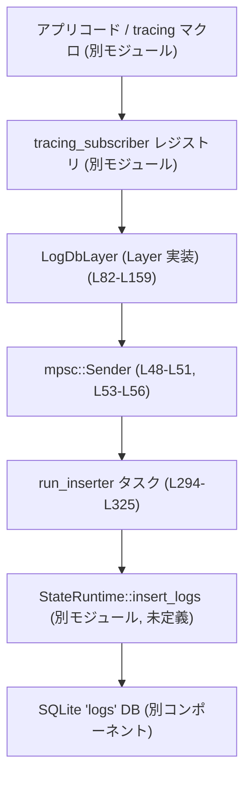
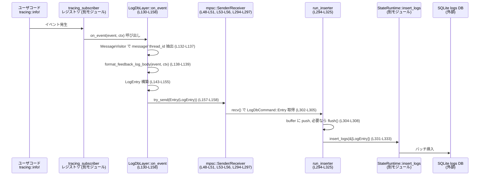

# state\src\log_db.rs

## 0. ざっくり一言

`tracing` のイベントを非同期にキューイングし、`StateRuntime` が管理する SQLite ベースの `logs` データベースへバッチ挿入するための `tracing_subscriber::Layer` 実装です（`LogDbLayer` と `start` が公開 API）。  
（`LogDbLayer` 定義: `state\src\log_db.rs:L48-L51`, `start` 定義: `state\src\log_db.rs:L53-L62`）

---

## 1. このモジュールの役割

### 1.1 概要

- このモジュールは **`tracing` のログイベントを永続化しつつ、アプリ本体のオーバーヘッドを低く保つ** ことを目的としています。
- `tracing_subscriber::Layer` を実装した `LogDbLayer` がイベントを受け取り、`tokio::mpsc` チャネルでバックグラウンドタスク `run_inserter` に送信します（`state\src\log_db.rs:L48-L51`, `L53-L57`, `L294-L325`）。
- バックグラウンドタスクは **一定件数（128件）または一定時間（2秒）ごとにバッチ挿入** を行い、SQLite への書き込み回数を削減します（`LOG_BATCH_SIZE`, `LOG_FLUSH_INTERVAL`: `state\src\log_db.rs:L45-L47`, `run_inserter`: `state\src\log_db.rs:L294-L325`）。

### 1.2 アーキテクチャ内での位置づけ

アプリケーションコードから SQLite ログ DB までの流れは次のようになります。



※ 括弧内の `Lxx-Lyy` は `state\src\log_db.rs` 上の行範囲です。

- `LogDbLayer` は `tracing_subscriber` のレイヤとして登録され、`on_new_span` / `on_record` / `on_event` コールバックで情報を収集します（`state\src\log_db.rs:L82-L159`）。
- `run_inserter` は `tokio::spawn` によりバックグラウンドで起動され、チャネルから `LogDbCommand` を受信して `StateRuntime::insert_logs` を呼び出します（`state\src\log_db.rs:L53-L57`, `L294-L333`）。
- `StateRuntime` や DB スキーマ（`insert_logs`, `query_logs`, `query_feedback_logs` など）は、このチャンクには定義がなく詳細は不明です（`state\src\log_db.rs:L42-L43`, `L441-L443`, `L522-L525`）。

### 1.3 設計上のポイント

コードから読み取れる特徴を列挙します。

- **責務の分割**
  - `LogDbLayer`: `tracing` のイベント/スパンから情報を抽出し、`LogEntry` を作成して非同期キューに積む責務（`state\src\log_db.rs:L48-L51`, `L82-L159`）。
  - `run_inserter` + `flush`: キューから `LogEntry` をまとめて取り出し、DB へバッチ挿入する責務（`state\src\log_db.rs:L294-L333`）。
  - `SpanLogContext`, `SpanFieldVisitor`, `MessageVisitor`, `format_feedback_log_body`: スパンやイベントのフィールドを整形・連結する責務（`state\src\log_db.rs:L166-L214`, `L335-L380`, `L237-L266`）。
- **状態管理**
  - プロセス単位の UUID を `OnceLock<String>` にキャッシュし、`start` 呼び出しごとに文字列コピーのみで済むようになっています（`current_process_log_uuid`: `state\src\log_db.rs:L285-L292`）。
  - バックグラウンド挿入タスクは内部バッファ `buffer: Vec<LogEntry>` を持ち、バッチ処理の単位として利用します（`state\src\log_db.rs:L298-L308`）。
- **エラーハンドリング方針**
  - `LogDbLayer::on_event` では `sender.try_send(...)` の結果を無視し、キューが一杯・チャネルクローズ時はログを黙って捨てます（`state\src\log_db.rs:L157-L158`）。
  - `flush` では `state_db.insert_logs(...).await` の `Result` を無視し、書き込み失敗時もエラーを表面化しません（`state\src\log_db.rs:L331-L333`）。
  - 時刻取得に失敗した場合（システムクロックが Unix epoch より前）には、タイムスタンプを 0 秒にフォールバックします（`state\src\log_db.rs:L140-L142`）。
- **並行性**
  - ログ収集は複数タスクから `LogDbLayer` が呼ばれることを想定し、`tokio::mpsc::Sender` 経由で一つの `run_inserter` タスクに集約しています（`state\src\log_db.rs:L48-L51`, `L294-L325`）。
  - フラッシュ要求は `oneshot::channel` を使って、バッファが実際に DB に書かれたタイミングまで `flush()` 呼び出し側を同期させます（`state\src\log_db.rs:L73-L79`, `L310-L313`）。

---

## 2. 主要な機能一覧

このモジュールが提供する主な機能です。

- `LogDbLayer`: `tracing_subscriber::Layer` として `tracing` のイベントを捕捉し、`LogEntry` としてキューに送る（`state\src\log_db.rs:L48-L51`, `L82-L159`）。
- `start(Arc<StateRuntime>) -> LogDbLayer`: `LogDbLayer` とバックグラウンド挿入タスクをセットアップするファクトリ関数（`state\src\log_db.rs:L53-L62`）。
- 非同期バッチ挿入:
  - `run_inserter`: キューから `LogDbCommand` を読み取り、バッチ単位で `insert_logs` を呼ぶ（`state\src\log_db.rs:L294-L325`）。
  - `flush`: バッファ内容を DB に書き出す内部関数（`state\src\log_db.rs:L327-L333`）。
  - `LogDbLayer::flush`: 呼び出し側から明示的にバッファをフラッシュする公開メソッド（`state\src\log_db.rs:L73-L79`）。
- フィードバックログ整形:
  - `format_feedback_log_body`: スパン階層とイベントフィールドを「feedback ログ」文字列に整形（`state\src\log_db.rs:L237-L266`）。
  - `SpanLogContext`, `SpanFieldVisitor`, `MessageVisitor`, `event_thread_id`: スパン/イベントから `thread_id` とメッセージを抽出し、スコープを復元（`state\src\log_db.rs:L166-L214`, `L216-L235`, `L335-L380`）。
- プロセス識別:
  - `current_process_log_uuid`: `pid` とランダム UUID を組み合わせたプロセス識別子を生成し、静的にキャッシュ（`state\src\log_db.rs:L285-L292`）。
- テスト:
  - SQLite に保存された「フィードバックログ」の整形が `tracing_subscriber::fmt` と一致することの検証（`sqlite_feedback_logs_match_feedback_formatter_shape`: `state\src\log_db.rs:L437-L498`）。
  - `LogDbLayer::flush` によりバッファされたログが確実にクエリ可能になることの検証（`flush_persists_logs_for_query`: `state\src\log_db.rs:L500-L529`）。

---

## 3. 公開 API と詳細解説

### 3.1 型一覧（構造体・列挙体など）

#### ランタイムで利用される主な型

| 名前 | 種別 | 公開性 | 役割 / 用途 | 定義位置 |
|------|------|--------|-------------|----------|
| `LogDbLayer` | 構造体 | `pub` | `tracing_subscriber::Layer` 実装。ログイベントを `LogEntry` に変換してキューへ送る。内部に `mpsc::Sender<LogDbCommand>` と `process_uuid` を持つ。 | `state\src\log_db.rs:L48-L51` |
| `LogDbCommand` | enum | private | 挿入タスクへのコマンド。`Entry(Box<LogEntry>)` と `Flush(oneshot::Sender<()>)` を持つ。 | `state\src\log_db.rs:L161-L164` |
| `SpanLogContext` | 構造体 | private | スパンに紐づくログコンテキスト（スパン名、整形済みフィールド、`thread_id`）。`Span` の `extensions` に格納される。 | `state\src\log_db.rs:L166-L171` |
| `SpanFieldVisitor` | 構造体 | private | スパンフィールドから `thread_id` を抽出するための `Visit` 実装。 | `state\src\log_db.rs:L173-L176`, `L178-L214` |
| `MessageVisitor` | 構造体 | private | イベントフィールドから `message` と `thread_id` を抽出する `Visit` 実装。 | `state\src\log_db.rs:L335-L339`, `L341-L380` |

#### テスト専用の型

| 名前 | 種別 | 公開性 | 役割 / 用途 | 定義位置 |
|------|------|--------|-------------|----------|
| `SharedWriter` | 構造体 | private (tests) | `Arc<Mutex<Vec<u8>>>` を共有し、`tracing_subscriber::fmt::Layer` の出力をテスト用にバッファする。 | `state\src\log_db.rs:L397-L400`, `L402-L407` |
| `SharedWriterGuard` | 構造体 | private (tests) | `MakeWriter` が返す実際のライタ。`io::Write` を実装し、バッファに書き込む。 | `state\src\log_db.rs:L409-L411`, `L423-L435` |

### 3.1.1 コンポーネント（関数）インベントリー

主な関数とその役割・位置です（テスト関数を含む）。

| 関数名 / メソッド名 | 種別 | 役割（1行） | 定義位置 |
|---------------------|------|-------------|----------|
| `start` | `fn` | `StateRuntime` を受け取り、`LogDbLayer` とバックグラウンド挿入タスクを起動して返す。 | `state\src\log_db.rs:L53-L62` |
| `LogDbLayer::flush` | `async fn` | バックグラウンドタスクに `Flush` コマンドを送り、DB への書き込み完了を待つ。 | `state\src\log_db.rs:L73-L79` |
| `Layer::on_new_span` | メソッド | 新規スパン作成時に `SpanLogContext` を構築し、スパン拡張に保存。 | `state\src\log_db.rs:L86-L102` |
| `Layer::on_record` | メソッド | 既存スパンのフィールド更新時に `SpanLogContext` を更新。 | `state\src\log_db.rs:L104-L128` |
| `Layer::on_event` | メソッド | イベントを `LogEntry` に変換し、キューに非同期送信。 | `state\src\log_db.rs:L130-L158` |
| `event_thread_id` | `fn` | イベントのスコープ内スパンから `thread_id` を探索して返す。 | `state\src\log_db.rs:L216-L235` |
| `format_feedback_log_body` | `fn` | スパン名/フィールドとイベントフィールドからフィードバックログ文字列を生成。 | `state\src\log_db.rs:L237-L266` |
| `format_fields` | `fn` | `RecordFields` を `DefaultFields` フォーマッタで文字列化。 | `state\src\log_db.rs:L268-L276` |
| `append_fields` | `fn` | 既存のフィールド文字列に、イベントの追加フィールドを追記。 | `state\src\log_db.rs:L278-L283` |
| `current_process_log_uuid` | `fn` | `pid` とランダム UUID に基づくプロセス識別子を生成し、`OnceLock` にキャッシュ。 | `state\src\log_db.rs:L285-L292` |
| `run_inserter` | `async fn` | `LogDbCommand` を受信し、バッファしつつ定期的に `flush` を呼ぶメインループ。 | `state\src\log_db.rs:L294-L325` |
| `flush` | `async fn` | バッファの `LogEntry` をすべて `state_db.insert_logs` に渡す。 | `state\src\log_db.rs:L327-L333` |
| `SpanFieldVisitor::record_field` | `fn` | スパンフィールドから `thread_id` を一度だけ記録。 | `state\src\log_db.rs:L178-L183` |
| `MessageVisitor::record_field` | `fn` | イベントフィールドから `message` と `thread_id` を一度だけ記録。 | `state\src\log_db.rs:L341-L349` |
| `sqlite_feedback_logs_match_feedback_formatter_shape` | `#[tokio::test]` | DB のフィードバックログ表現が `fmt` ログの出力形状と一致することを検証。 | `state\src\log_db.rs:L437-L498` |
| `flush_persists_logs_for_query` | `#[tokio::test]` | `LogDbLayer::flush` 実行後、`query_logs` でログ取得できることを検証。 | `state\src\log_db.rs:L500-L529` |

---

### 3.2 関数詳細（7件）

#### 3.2.1 `start(state_db: std::sync::Arc<StateRuntime>) -> LogDbLayer`

**概要**

- `StateRuntime` への参照を受け取り、ログ挿入専用のバックグラウンドタスク `run_inserter` と、それにコマンドを送る `LogDbLayer` を構築して返します（`state\src\log_db.rs:L53-L62`）。

**引数**

| 引数名 | 型 | 説明 |
|--------|----|------|
| `state_db` | `std::sync::Arc<StateRuntime>` | ログを挿入する先のランタイム。内部で `Arc::clone` され、挿入タスクに渡されます。 |

**戻り値**

- `LogDbLayer`: `tracing_subscriber::Layer` として利用できるレイヤ。内部に `mpsc::Sender<LogDbCommand>` と `process_uuid` を保持します（`state\src\log_db.rs:L48-L51`, `L53-L62`）。

**内部処理の流れ**

1. `current_process_log_uuid()` を呼び出して、プロセス固有の UUID 文字列を取得し、`String` にコピーします（`state\src\log_db.rs:L54`, `L285-L292`）。
2. バッファ容量 512 の `tokio::mpsc::channel` を作成し、`sender` / `receiver` を得ます（`LOG_QUEUE_CAPACITY`: `state\src\log_db.rs:L45`, `L55`）。
3. `tokio::spawn` で `run_inserter(Arc::clone(&state_db), receiver)` をバックグラウンドタスクとして起動します（`state\src\log_db.rs:L56`, `L294-L325`）。
4. `LogDbLayer { sender, process_uuid }` を生成して返します（`state\src\log_db.rs:L58-L61`）。

**Examples（使用例）**

モジュール先頭のドキュメントコメントとほぼ同じ形です。

```rust
use std::sync::Arc;
use codex_state::{StateRuntime, log_db};
use tracing_subscriber::prelude::*;

# async fn example() -> anyhow::Result<()> {
let state_db = Arc::new(
    StateRuntime::init("/path/to/codex-home".into(), "provider".to_string()).await?
);
let layer = log_db::start(state_db); // バックグラウンドタスク起動 (`start`: L53-L62)

tracing_subscriber::registry()
    .with(layer)
    .try_init()?;

// 以降、tracing のイベントが SQLite に書き込まれる
tracing::info!("hello sqlite logs");

Ok(())
# }
```

**Errors / Panics**

- 関数自体は `Result` を返さず、内部でエラーを返す可能性のある呼び出しはありません。
- `tokio::spawn` はパニックしません（非同期ランタイムが存在する前提）。
- ランタイムが存在しないスレッドで `start` を呼ぶと、実行時に `tokio::spawn` がパニックになる可能性がありますが、それは Tokio の仕様であり、このファイルからは詳細は分かりません。

**Edge cases（エッジケース）**

- `state_db` が他の部分でクローズされていても、この関数自体は成功します。後続の `insert_logs` が失敗するかどうかは `StateRuntime` 側の実装に依存し、このチャンクからは不明です。
- `start` は複数回呼び出すことが可能であり、そのたびに独立した `LogDbLayer` と `run_inserter` タスクが生成されます（`state\src\log_db.rs:L53-L62`, `L294-L325`）。

**使用上の注意点**

- `tokio::spawn` を利用しているため、**Tokio ランタイムの中で呼び出す必要があります**（`state\src\log_db.rs:L56`）。
- `LogDbLayer` は後述のようにログをベストエフォートで捨てる設計なので、**ログロスを絶対に避けたい用途には適しません**（`try_send` 利用: `state\src\log_db.rs:L157-L158`）。

---

#### 3.2.2 `impl LogDbLayer { pub async fn flush(&self) }`

**概要**

- バックグラウンドタスクにフラッシュコマンドを送り、DB への書き込み完了を待ちます（`state\src\log_db.rs:L73-L79`）。
- テストでは、ログがバッファにある状態で `flush()` を呼び出した後に `query_logs` すると 1 件だけ取得できることを確認しています（`state\src\log_db.rs:L517-L527`）。

**引数**

| 引数名 | 型 | 説明 |
|--------|----|------|
| `&self` | `&LogDbLayer` | 送信用チャネル `sender` を保持するレイヤインスタンス。 |

**戻り値**

- `()`（ユニット型）。エラー情報は返り値では提供されません（`state\src\log_db.rs:L73-L79`）。

**内部処理の流れ**

1. `oneshot::channel::<()>()` を作成し、送信側 `tx` と受信側 `rx` を得ます（`state\src\log_db.rs:L75`）。
2. `LogDbCommand::Flush(tx)` を `self.sender.send(...).await` で送信し、その `Result` が `Ok` の場合だけ `rx.await` でバックグラウンドタスクからの返信を待ちます（`state\src\log_db.rs:L76-L77`）。
3. `send` が `Err`（チャネルクローズなど）の場合は `rx` を待たずにそのまま終了します（`state\src\log_db.rs:L76-L79`）。

**内部でのフラッシュ処理との連携**

- `run_inserter` 側では `Some(LogDbCommand::Flush(reply))` を受け取ったときに `flush(&state_db, &mut buffer).await` を呼び、その後 `reply.send(())` で完了を通知します（`state\src\log_db.rs:L310-L313`）。

**Examples（使用例）**

テスト `flush_persists_logs_for_query` を元にした例です。

```rust
# use std::sync::Arc;
# use codex_state::{StateRuntime, log_db};
# use tracing_subscriber::prelude::*;
# use tracing_subscriber::filter::Targets;

# async fn example() -> anyhow::Result<()> {
let runtime = Arc::new(StateRuntime::init("/tmp/codex".into(), "provider".to_string()).await?);
let layer = log_db::start(runtime.clone());

let guard = tracing_subscriber::registry()
    .with(layer.clone().with_filter(Targets::new().with_default(tracing::Level::INFO)))
    .set_default();

tracing::info!("buffered-log");

// ここでバッファに溜まっているログを DB へ同期的にフラッシュ
layer.flush().await;

drop(guard); // subscriber を落としても、すでにフラッシュ済みなのでクエリできる
# Ok(())
# }
```

**Errors / Panics**

- `send(LogDbCommand::Flush(tx)).await` がエラーを返した場合（チャネルクローズ）、**何も待たずに終了**します（`state\src\log_db.rs:L76-L79`）。エラーは表に出ません。
- `rx.await` 自体は `oneshot::Receiver` のエラーを `Result` で返しますが、`let _ = rx.await` として無視されています（`state\src\log_db.rs:L77`）。
- 従って、「実際にフラッシュされたかどうか」をプログラム側で厳密に知る手段はこのメソッドからは提供されません。

**Edge cases（エッジケース）**

- すでに全ての `LogDbLayer` がドロップされ、チャネルがクローズされている場合、`send` が失敗し、即座に戻ります。バッファの残りや DB への書き込み状態は不明です（`state\src\log_db.rs:L76-L79`, `L315-L317`）。
- 挿入タスクが大量のログを処理中で、チャネルが一杯の場合、`send` は空きが出るまで `await` し、その後フラッシュコマンドが処理されます（Tokio MPSC の仕様）。

**使用上の注意点**

- `flush()` は **ベストエフォート** であり、「必ずディスクに書かれる」ことを保証するものではありません。チャネルのクローズや DB エラーはすべて無視されます（`state\src\log_db.rs:L76-L79`, `L331-L333`）。
- テストでも、`flush` 呼び出し後に `query_logs` して期待件数が得られることを前提にしていますが、これは通常ケースの検証であり、障害時の挙動まではカバーしていません（`state\src\log_db.rs:L522-L527`）。

---

#### 3.2.3 `fn on_event(&self, event: &Event<'_>, ctx: Context<'_, S>)` （`Layer` 実装）

**概要**

- `tracing` のイベント発生時に呼ばれ、イベントから `LogEntry` を構築し、非同期キューに投入します（`state\src\log_db.rs:L130-L158`）。
- `thread_id` や「フィードバックログ文字列」をスパン情報から補完する点が特徴です。

**引数**

| 引数名 | 型 | 説明 |
|--------|----|------|
| `&self` | `&LogDbLayer` | ログ送信用のチャネルと `process_uuid` を持つレイヤ。 |
| `event` | `&tracing::Event<'_>` | ログイベント。メッセージやフィールド、メタデータを含みます。 |
| `ctx` | `tracing_subscriber::layer::Context<'_, S>` | 現在の subscriber コンテキスト。スパンスコープやメタデータにアクセスするために使用します。 |

**戻り値**

- なし（`()`）。ログ送信の成否は返されません（`state\src\log_db.rs:L130-L158`）。

**内部処理の流れ**

1. `event.metadata()` でログレベル・ターゲット・ファイル/行番号などのメタデータを取得（`state\src\log_db.rs:L131`）。
2. `MessageVisitor::default()` を生成し、`event.record(&mut visitor)` でフィールドを走査し、`message` と `thread_id` を抽出（`state\src\log_db.rs:L132-L133`, `L335-L349`）。
3. `thread_id` を決定:
   - まず `visitor.thread_id` を使い（イベント自身のフィールド）、存在しない場合は `event_thread_id(event, &ctx)` でスパンスコープ内の `SpanLogContext.thread_id` を探索します（`state\src\log_db.rs:L134-L137`, `L216-L235`）。
4. `format_feedback_log_body(event, &ctx)` を呼び出し、スパン名 + 整形済みフィールド + イベントフィールドからフィードバックログ文字列を構成します（`state\src\log_db.rs:L138-L139`, `L237-L266`）。
5. `SystemTime::now().duration_since(UNIX_EPOCH)` により秒・ナノ秒のタイムスタンプを取得し、失敗した場合は 0 秒にフォールバックします（`state\src\log_db.rs:L140-L145`）。
6. `LogEntry` 構造体を組み立てます（`state\src\log_db.rs:L143-L155`）。
   - `message` は `Option<String>` として `visitor.message` をそのまま使用。
   - `feedback_log_body` は `Some(feedback_log_body)` として必ずセット。
   - `thread_id`, `process_uuid`, `module_path`, `file`, `line` もメタデータから設定。
7. `self.sender.try_send(LogDbCommand::Entry(Box::new(entry)))` を呼び出し、チャネルに non-blocking で送信。結果は `let _ =` で無視され、失敗時はログが破棄されます（`state\src\log_db.rs:L157-L158`）。

**Examples（使用例）**

直接 `on_event` を呼び出すことは通常ありませんが、`tracing::info!` などを通じて間接的に実行されます。

```rust
# use std::sync::Arc;
# use codex_state::{StateRuntime, log_db};
# use tracing_subscriber::prelude::*;
# use tracing_subscriber::filter::Targets;

# async fn example() -> anyhow::Result<()> {
let runtime = Arc::new(StateRuntime::init("/tmp/codex".into(), "provider".to_string()).await?);
let layer = log_db::start(runtime.clone());

let _guard = tracing_subscriber::registry()
    .with(layer.with_filter(Targets::new().with_default(tracing::Level::TRACE)))
    .set_default();

// thread_id を持つスパンスコープ内でイベントを発生させる
tracing::info_span!("feedback-thread", thread_id = "thread-1", turn = 1).in_scope(|| {
    tracing::info!(foo = 2, "thread-scoped");
});

// 上記イベントは on_event 内で LogEntry に変換され、キューに送られる
# Ok(())
# }
```

**Errors / Panics**

- `SystemTime::now().duration_since(UNIX_EPOCH)` がエラーを返した場合でも `unwrap_or_else` で `Duration::from_secs(0)` にフォールバックするため、パニックしません（`state\src\log_db.rs:L140-L142`）。
- `try_send` の失敗（バッファフルまたはチャネルクローズ）も `let _ =` により無視され、パニックはしません（`state\src\log_db.rs:L157-L158`）。

**Edge cases（エッジケース）**

- **高負荷時のログロス**:
  - チャネルが満杯の場合、`try_send` は即座にエラーを返し、そのログは捨てられます。この挙動はコードに明示的に現れています（`state\src\log_db.rs:L157-L158`）。
- **`thread_id` が無い場合**:
  - イベントフィールドにもスコープ内スパンにも `thread_id` が存在しない場合は `thread_id: None` のまま `LogEntry` に記録されます（`state\src\log_db.rs:L134-L137`, `L216-L235`）。
- **タイムスタンプ underflow**:
  - システム時間が Unix epoch より前を指している極端な環境では、タイムスタンプは 0 秒として保存されます（`state\src\log_db.rs:L140-L142`）。

**使用上の注意点**

- このメソッドは `tracing` インフラから自動で呼ばれるため、利用者側が直接触ることは通常ありませんが、**ログがドロップされうる**という前提でモニタリングや解析を行う必要があります（`state\src\log_db.rs:L157-L158`）。

---

#### 3.2.4 `async fn run_inserter(state_db: Arc<StateRuntime>, receiver: mpsc::Receiver<LogDbCommand>)`

**概要**

- チャネルから `LogDbCommand` を受信し、ログエントリをバッファリングしながら、バッチサイズまたは一定時間経過で DB に書き込むバックグラウンドタスクです（`state\src\log_db.rs:L294-L325`）。

**引数**

| 引数名 | 型 | 説明 |
|--------|----|------|
| `state_db` | `Arc<StateRuntime>` | ログ挿入を行うランタイム。`insert_logs` を呼び出します。 |
| `receiver` | `mpsc::Receiver<LogDbCommand>` | `LogDbLayer` から送信されたコマンドを受け取る受信側。 |

**戻り値**

- `()`（非公開の async 関数として `tokio::spawn` から利用される）。戻り値は使われません（`state\src\log_db.rs:L294-L325`）。

**内部処理の流れ**

1. `Vec::with_capacity(LOG_BATCH_SIZE)` でバッファを初期化（`state\src\log_db.rs:L298`, `L46`）。
2. `tokio::time::interval(LOG_FLUSH_INTERVAL)` で 2 秒ごとのタイマー `ticker` を作成（`state\src\log_db.rs:L299`, `L47`）。
3. 無限ループ内で `tokio::select!` により「チャネルからの受信」と「タイマー tick」を待機（`state\src\log_db.rs:L300-L323`）。
4. `receiver.recv()` の結果 `maybe_command` に対して:
   - `Some(LogDbCommand::Entry(entry))`:
     - `*entry` をバッファに push。
     - バッファ長が `LOG_BATCH_SIZE` 以上なら `flush(&state_db, &mut buffer).await` を呼んでバッファをクリア（`state\src\log_db.rs:L304-L308`）。
   - `Some(LogDbCommand::Flush(reply))`:
     - 即座に `flush(&state_db, &mut buffer).await` を呼び、その後で `reply.send(())` を試みる（`state\src\log_db.rs:L310-L313`）。
   - `None`（全 `Sender` がドロップされた状態）:
     - 最後に `flush(&state_db, &mut buffer).await` を呼び、ループを `break` してタスク終了（`state\src\log_db.rs:L314-L317`）。
5. タイマー `ticker.tick()` が発火した場合:
   - 毎回 `flush(&state_db, &mut buffer).await` を呼ぶ（バッファが空の場合は内部で早期 return）（`state\src\log_db.rs:L320-L322`, `L327-L330`）。

**Examples（使用例）**

- 直接呼び出すのではなく、`start` 内部から `tokio::spawn(run_inserter(...))` で起動されます（`state\src\log_db.rs:L56`）。

**Errors / Panics**

- `flush` 内の DB 書き込み (`insert_logs`) のエラーは `let _ =` により無視されます（`state\src\log_db.rs:L331-L333`）。
- チャネルがクローズされた場合は `None` を検知して正常にループを抜けるため、パニックしません（`state\src\log_db.rs:L314-L317`）。

**Edge cases（エッジケース）**

- **低頻度のログ**:
  - バッファが `LOG_BATCH_SIZE` に達しなくても、最大 2 秒ごとにタイマー発火で `flush` が呼ばれます。`flush` は空バッファを即座に return するため、empty flush 自体のコストは小さいです（`state\src\log_db.rs:L320-L322`, `L327-L330`）。
- **終了時のフラッシュ**:
  - すべての `LogDbLayer` がドロップされる（全ての `Sender` が解放される）と `receiver.recv()` が `None` を返し、最後に一度 `flush` を行ってからループを抜けます。これにより終了直前のログも書き込まれる設計です（`state\src\log_db.rs:L314-L317`）。

**使用上の注意点**

- 同期的な `flush()` を呼ぶ場合でも、このタスクが動作していることが前提になるため、**Tokio ランタイムが停止していない状態で利用する必要があります**。
- ログ書き込みに時間がかかる場合（DB のスローダウンなど）、`flush` が戻るまで `LogDbLayer::flush()` 呼び出しもブロックされます。

---

#### 3.2.5 `async fn flush(state_db: &Arc<StateRuntime>, buffer: &mut Vec<LogEntry>)`

**概要**

- 現在のバッファ内容をすべて `StateRuntime::insert_logs` に渡して挿入し、バッファを空にする内部関数です（`state\src\log_db.rs:L327-L333`）。

**引数**

| 引数名 | 型 | 説明 |
|--------|----|------|
| `state_db` | `&Arc<StateRuntime>` | ログ挿入対象のランタイム。 |
| `buffer` | `&mut Vec<LogEntry>` | 挿入待ちのバッファ。 |

**戻り値**

- `()`（挿入結果は返さない）。`insert_logs` の `Result` は破棄されています（`state\src\log_db.rs:L331-L333`）。

**内部処理の流れ**

1. バッファが空の場合は何もせず早期 return（`state\src\log_db.rs:L328-L330`）。
2. `buffer.split_off(0)` でバッファの全要素を新しい `entries` ベクタに移動し、元の `buffer` を空にする（`state\src\log_db.rs:L331`）。
3. `state_db.insert_logs(entries.as_slice()).await` を呼び出し、結果を `let _ =` で無視（`state\src\log_db.rs:L332-L333`）。

**Errors / Panics**

- `insert_logs` 実行時のエラーは完全に無視されます。
  - これにより、DB 書き込みが失敗してもアプリ側に通知されず、エントリは失われます（`state\src\log_db.rs:L331-L333`）。
- バッファ操作におけるパニック要因は見当たりません（`split_off(0)` は常に成功）。

**Edge cases（エッジケース）**

- **バッファが空**のとき、多数回呼び出されても単に return するだけで副作用はありません（`state\src\log_db.rs:L328-L330`）。
- **大きなバッチ**:
  - `entries.as_slice()` で連続領域として DB に渡すため、バッチが大きいほど単一呼び出しで挿入されるが、挿入時間も増加します（`state\src\log_db.rs:L331-L332`）。

**使用上の注意点**

- 内部関数であり、利用者が直接呼び出すことは想定されていません。
- 書き込み失敗時のリトライやログ出力を行っていないため、信頼性を高めたい場合は、この関数または `insert_logs` 呼び出し部分にエラーハンドリングを追加する変更が考えられます。

---

#### 3.2.6 `fn format_feedback_log_body<S>(event: &Event<'_>, ctx: &Context<'_, S>) -> String`

**概要**

- イベントが属するスパン階層と、そのスパンフィールド・イベントフィールドを文字列化し、フィードバックログ用の「文脈付きメッセージ」を生成します（`state\src\log_db.rs:L237-L266`）。
- テストにより、この文字列が `tracing_subscriber::fmt::Layer` の出力形式と整合することが検証されています（`state\src\log_db.rs:L437-L498`）。

**引数**

| 引数名 | 型 | 説明 |
|--------|----|------|
| `event` | `&tracing::Event<'_>` | 対象イベント。フィールドを `format_fields(event)` で整形します。 |
| `ctx` | `&tracing_subscriber::layer::Context<'_, S>` | イベントスコープ（スパン階層）を取得するために使用されます。 |

**戻り値**

- `String`: スパン名とフィールド、およびイベントフィールドを組み合わせた文字列。

**内部処理の流れ**

1. からの `String` を初期化（`state\src\log_db.rs:L244`）。
2. `ctx.event_scope(event)` でイベントのスコープ（ルートからのスパン列）を取得し、存在する場合はルートから順に走査（`state\src\log_db.rs:L245-L246`）。
3. 各 `span` について:
   - `span.extensions()` から `SpanLogContext` を取得できれば、`name` を追加し、`formatted_fields` が空でなければ `{fields}` の形で付加（`state\src\log_db.rs:L247-L253`）。
   - `SpanLogContext` が無ければメタデータのスパン名を追加（`state\src\log_db.rs:L255-L257`）。
   - 最後に `':'` を追加（`state\src\log_db.rs:L258`）。
4. 少なくとも一つスパンがあれば末尾に空白 `' '` を追加して区切りとする（`state\src\log_db.rs:L260-L262`）。
5. 最後に `format_fields(event)` の結果を付加し、完成した文字列を返す（`state\src\log_db.rs:L264-L265`, `L268-L276`）。

**Examples（使用例）**

テストでは `fmt::Layer` の出力と比較するために間接的に使用されています。

```rust
// スパン "feedback-thread" の下でイベントを発生させる場合の概念的な出力例:
//
// feedback-thread{thread_id="thread-1" turn=1}: foo=2 message="thread-scoped"
//
// 実際の正確なフォーマットは DefaultFields フォーマッタに依存します。
```

**Errors / Panics**

- `ctx.event_scope(event)` が `None` の場合、単にスパン情報なしでイベントフィールドだけが出力されます（`state\src\log_db.rs:L245-L263`）。
- `format_fields(event)` の `Result` は内部で無視されていますが、`String` ベースのフォーマッタでは `fmt::Error` は通常発生しないため、パニックにはつながりません（`state\src\log_db.rs:L268-L275`）。

**Edge cases（エッジケース）**

- スパンが一つもない場合、前置のスパン名部分がなく、イベントフィールドのみの文字列になります（`state\src\log_db.rs:L245-L263`）。
- 複数スパンがある場合、`root:child: ...` のように `:` 区切りで連結されます。

**使用上の注意点**

- この関数は `on_event` 内部でのみ利用され、返り値は `LogEntry.feedback_log_body` に格納されます（`state\src\log_db.rs:L138-L139`, `L149`）。
- フォーマット仕様を変更すると、テスト `sqlite_feedback_logs_match_feedback_formatter_shape` が失敗する可能性があります（`state\src\log_db.rs:L437-L498`）。

---

#### 3.2.7 `fn event_thread_id<S>(event: &Event<'_>, ctx: &Context<'_, S>) -> Option<String>`

**概要**

- イベントのスコープ内にあるスパンのうち、`SpanLogContext.thread_id` を持つスパンを探索し、その `thread_id` を返します（`state\src\log_db.rs:L216-L235`）。
- イベントに直接 `thread_id` フィールドがない場合の補完に使われます（`state\src\log_db.rs:L134-L137`）。

**引数**

| 引数名 | 型 | 説明 |
|--------|----|------|
| `event` | `&tracing::Event<'_>` | `thread_id` を補完したいイベント。 |
| `ctx` | `&tracing_subscriber::layer::Context<'_, S>` | イベントのスコープ（スパン階層）へアクセスするためのコンテキスト。 |

**戻り値**

- `Option<String>`: 見つかった `thread_id`。スパンにも存在しない場合は `None`。

**内部処理の流れ**

1. `let mut thread_id = None;` で変数を初期化（`state\src\log_db.rs:L223`）。
2. `ctx.event_scope(event)` でスコープを取得し、存在する場合は `scope.from_root()` でルートから順にスパンを走査（`state\src\log_db.rs:L224-L225`）。
3. 各 `span` について:
   - `span.extensions()` から `SpanLogContext` を取得し、かつその `thread_id` が `Some` であれば `thread_id = log_context.thread_id.clone()` を設定（`state\src\log_db.rs:L226-L231`）。
   - これにより、最後に見つかった `thread_id` で上書きされます。
4. 最後に `thread_id` を返す（`state\src\log_db.rs:L234`）。

**Errors / Panics**

- `event_scope` が `None` の場合や、`SpanLogContext` が存在しない場合でも単に `None` を返すだけで、パニックしません（`state\src\log_db.rs:L224-L235`）。

**Edge cases（エッジケース）**

- スコープ内に複数スパンがあり、それぞれが `thread_id` を持つ場合、**最も下流（ルートから見て一番後ろ）のスパンの `thread_id`** が最終的に返されます（`state\src\log_db.rs:L225-L231`）。
- スパンのいずれにも `SpanLogContext` が設定されていない場合（`on_new_span` や `on_record` が働いていないなど）、`None` になります（`state\src\log_db.rs:L226-L233`）。

**使用上の注意点**

- イベントの `thread_id` をスパンから補完する仕組みのため、`thread_id` 自体をスパンのフィールドとして記録する運用が前提になっています（`SpanFieldVisitor`: `state\src\log_db.rs:L178-L183`, `L186-L214`）。

---

### 3.3 その他の関数

補助的な関数の一覧です。

| 関数名 | 役割（1 行） | 定義位置 |
|--------|--------------|----------|
| `impl Layer<S> for LogDbLayer::on_new_span` | スパン作成時に `SpanLogContext` を初期化し、スパン名とフィールド・`thread_id` を保存する。 | `state\src\log_db.rs:L86-L102` |
| `impl Layer<S> for LogDbLayer::on_record` | スパンのレコード更新時に `SpanLogContext` を更新し、フィールドを追記する。 | `state\src\log_db.rs:L104-L128` |
| `format_fields<R>` | `DefaultFields` フォーマッタでフィールド集合を文字列に整形する。 | `state\src\log_db.rs:L268-L276` |
| `append_fields` | 既存のフィールド文字列に、追加のフィールドを `DefaultFields` 形式で追記する。 | `state\src\log_db.rs:L278-L283` |
| `current_process_log_uuid` | `OnceLock` を使い、`"pid:{pid}:{uuid}"` 形式のプロセス識別子を一度だけ生成し共有する。 | `state\src\log_db.rs:L285-L292` |
| `SpanFieldVisitor::{record_i64,...}` | 各型のフィールド値を文字列化し、`record_field` 経由で `thread_id` を抽出する。 | `state\src\log_db.rs:L186-L213` |
| `MessageVisitor::{record_i64,...}` | イベントフィールドを文字列化し、`record_field` 経由で `message` と `thread_id` を抽出する。 | `state\src\log_db.rs:L352-L379` |

---

## 4. データフロー

### 4.1 代表シナリオ：`tracing::info!` から SQLite まで

`tracing::info!` 呼び出しで生成されたイベントが SQLite DB に保存されるまでのシーケンスです。



- `LogDbLayer::on_event` は CPU バウンドな処理（フィールドフォーマットと `try_send`）のみを行い、DB I/O はすべて `run_inserter` にオフロードされます（`state\src\log_db.rs:L130-L158`, `L294-L333`）。
- `run_inserter` は **単一タスク** で DB への書き込みを直列化するため、DB アクセスの競合やトランザクション管理がシンプルになります（`state\src\log_db.rs:L294-L325`）。

---

## 5. 使い方（How to Use）

### 5.1 基本的な使用方法

1. `StateRuntime` を初期化し、`Arc` に包む（テストを参照: `state\src\log_db.rs:L441-L443`, `L504-L506`）。
2. `start(runtime.clone())` で `LogDbLayer` を取得する（`state\src\log_db.rs:L53-L62`）。
3. `tracing_subscriber::registry()` に他のレイヤとともに `.with(layer)` で追加し、`set_default` などで有効化する（`state\src\log_db.rs:L446-L457`, `L509-L515`）。

```rust
use std::sync::Arc;
use codex_state::{StateRuntime, log_db};
use tracing_subscriber::prelude::*;
use tracing_subscriber::filter::Targets;

#[tokio::main]
async fn main() -> anyhow::Result<()> {
    // 1. StateRuntime を初期化
    let codex_home = std::env::temp_dir().join("codex-state-log-db-example");
    let runtime = Arc::new(StateRuntime::init(codex_home, "provider".to_string()).await?);

    // 2. LogDbLayer を開始
    let layer = log_db::start(runtime.clone());

    // 3. tracing_subscriber に登録
    let _guard = tracing_subscriber::registry()
        .with(
            tracing_subscriber::fmt::layer()
                .with_ansi(false)
                .with_target(false)
                .with_filter(Targets::new().with_default(tracing::Level::INFO)),
        )
        .with(
            layer.clone()
                .with_filter(Targets::new().with_default(tracing::Level::INFO)),
        )
        .set_default();

    // 以降の tracing 呼び出しが SQLite に記録される
    tracing::info!("hello sqlite");

    // 任意でフラッシュしてから終了
    layer.flush().await;

    Ok(())
}
```

### 5.2 よくある使用パターン

- **フィードバックログの形状検証用**  
  テスト `sqlite_feedback_logs_match_feedback_formatter_shape` が示すように、`fmt::layer` の出力ログと DB 側の `feedback_log_body` を比較することで、一貫したログフォーマットを保証できます（`state\src\log_db.rs:L437-L498`）。

- **テストでの同期フラッシュ**  
  `flush_persists_logs_for_query` のように、テストではログを出した直後に `layer.flush().await` を呼び、その後 `query_logs` などで状態を検証するパターンが使われています（`state\src\log_db.rs:L517-L527`）。

### 5.3 よくある間違い

想定される誤用と正しい例です。

```rust
// 誤り例: Tokio ランタイム外で start を呼ぶ
// fn main() {
//     let runtime = Arc::new(StateRuntime::init(...).await.unwrap()); // そもそも await 不可
//     let layer = log_db::start(runtime); // tokio::spawn でパニックする可能性
// }

// 正しい例: Tokio ランタイム内で呼び出す
#[tokio::main]
async fn main() {
    let runtime = Arc::new(StateRuntime::init(...).await.unwrap());
    let layer = log_db::start(runtime);
    // ...
}
```

```rust
// 誤り例: ログを出した直後にプロセスを即終了し、フラッシュしない。
// 高頻度なログでない場合、LOG_FLUSH_INTERVAL (2秒) を待つ前にプロセスが終了してしまい、
// 最後のログが DB に書き込まれない可能性がある (L47, L294-L325).

// 正しい例: 終了前に flush する
tracing::info!("last-log-before-exit");
layer.flush().await;
```

### 5.4 使用上の注意点（まとめ）

- **Tokio ランタイムが必須**  
  `start` は内部で `tokio::spawn` と `tokio::time::interval` を使うため、Tokio ランタイムのコンテキスト内で呼び出す必要があります（`state\src\log_db.rs:L56`, `L299`）。

- **ログロスの可能性**  
  - `on_event` での送信に `try_send` を使用しており、キューが満杯またはクローズされている場合はログが黙って捨てられます（`state\src\log_db.rs:L157-L158`）。
  - DB 書き込み失敗 (`insert_logs`) も無視されるため、障害時にログが欠落してもエラーには現れません（`state\src\log_db.rs:L331-L333`）。

- **フラッシュの保証レベル**  
  `LogDbLayer::flush` は「フラッシュリクエストを送信し、その応答を待つ」だけで、結果の成否は返さない設計です（`state\src\log_db.rs:L73-L79`, `L310-L313`, `L331-L333`）。

- **スパンに `thread_id` を付与する前提**  
  `event_thread_id` はスパンの `thread_id` フィールドに依存しており、フィードバックログのスレッド紐づけにはスパンでの `thread_id` 設定が前提になります（`state\src\log_db.rs:L178-L183`, `L216-L235`, `L461-L463`）。

---

## 6. 変更の仕方（How to Modify）

### 6.1 新しい機能を追加する場合

例として、「ログに追加のフィールド（例: セッション ID）を保存したい」ケースを考えます。

1. **`LogEntry` の拡張**  
   - このモジュールからは `LogEntry` の定義は見えませんが、`LogEntry { ... }` の初期化フィールド名から、構造体に対応フィールドが存在することが分かります（`state\src\log_db.rs:L143-L155`）。
   - 新しい DB カラムを追加する場合は、`LogEntry` 定義と SQLite スキーマの両方を修正する必要があります（定義場所はこのチャンクには現れません）。

2. **`on_event` によるフィールド設定**  
   - 新フィールド値がイベントのフィールドから来るなら、`MessageVisitor` に対応フィールド名の抽出ロジックを追加し（`state\src\log_db.rs:L341-L349`）、`LogEntry` 初期化時にその値を挿入します（`state\src\log_db.rs:L143-L155`）。

3. **フィードバックログへの反映**  
   - 新フィールドをフィードバックログにも含めたい場合は、`format_feedback_log_body` が呼ぶ `format_fields(event)` に任せるか、スパンフィールドとして `SpanLogContext.formatted_fields` に含めるかを選択します（`state\src\log_db.rs:L237-L266`, `L268-L276`, `L166-L171`）。

4. **テストの更新**  
   - フォーマットやフィールドが変わる場合、`sqlite_feedback_logs_match_feedback_formatter_shape` の期待値（`fmt::layer` 出力と一致すること）に影響するため、テストロジックや比較方法の見直しが必要になる可能性があります（`state\src\log_db.rs:L437-L498`）。

### 6.2 既存の機能を変更する場合

変更時に意識すべき点をいくつか挙げます。

- **ログロスを減らしたい場合**
  - `try_send` を `send().await` に変更すると、キューが満杯のときにイベント側が待つようになります（`state\src\log_db.rs:L157-L158`）。
  - ただし、これはアプリケーションのレイテンシに影響を与えるため、要件に応じてトレードオフを検討する必要があります。

- **エラー報告を強化したい場合**
  - `flush` 内の `insert_logs` の結果を返り値として表に出すか、少なくともログに記録するように変更できます（`state\src\log_db.rs:L331-L333`）。
  - それに伴い、`run_inserter` や `LogDbLayer::flush` のシグネチャも `Result` を返す形に変更する必要が出てきます（`state\src\log_db.rs:L73-L79`, `L294-L325`）。

- **バッチサイズやフラッシュ間隔の調整**
  - 現状 `LOG_BATCH_SIZE` と `LOG_FLUSH_INTERVAL` は定数としてモジュール内で固定されています（`state\src\log_db.rs:L45-L47`）。
  - これらを設定値として外部から渡せるようにする場合は、`LogDbLayer` に設定フィールドを追加し、`start` の引数と `run_inserter` のロジックを拡張する必要があります（`state\src\log_db.rs:L48-L51`, `L53-L62`, `L294-L325`）。

- **影響範囲の確認**
  - テスト `flush_persists_logs_for_query` や `sqlite_feedback_logs_match_feedback_formatter_shape` は、このモジュールの動作を前提に書かれているため、仕様変更時には必ず実行して挙動が意図通りか確認する必要があります（`state\src\log_db.rs:L437-L498`, `L500-L529`）。

---

## 7. 関連ファイル

このモジュールと密接に関係する型や関数は crate ルートに定義されているようですが、具体的なファイルパスはこのチャンクからは分かりません。そのため、型名ベースで列挙します。

| 型 / 関数 | 推定される役割 / 関係 | 根拠 |
|-----------|------------------------|------|
| `crate::StateRuntime` | SQLite ベースの state DB へのアクセス（`init`, `insert_logs`, `query_logs`, `query_feedback_logs` など）を提供するランタイム。 | `start` で `Arc<StateRuntime>` を受け取り（`state\src\log_db.rs:L53-L56`）、`flush` で `insert_logs` を呼び出し（`state\src\log_db.rs:L332`）、テストで `init`, `query_logs`, `query_feedback_logs` を使用していることから（`state\src\log_db.rs:L441-L443`, `L481-L485`, `L522-L525`）。 |
| `crate::LogEntry` | ログ 1 件を表す構造体。タイムスタンプ、レベル、ターゲット、メッセージ、`feedback_log_body`, `thread_id`, `process_uuid`, ファイル/行情報などを含む。 | `LogEntry { ... }` 初期化時のフィールド名から推測（`state\src\log_db.rs:L143-L155`）。 |
| `crate::LogQuery` | `query_logs` の検索条件を表す型。 | テスト `flush_persists_logs_for_query` で `LogQuery::default()` が使われていることから（`state\src\log_db.rs:L522-L524`）。 |

---

## バグ・セキュリティなどの観点（まとめ）

※ 専用見出しは禁止されていないため、ここで簡潔に整理します。

- **潜在的なログ喪失**
  - `on_event` が `try_send` の結果を無視しているため、バッファフルやチャネルクローズ時にログが静かに失われます（`state\src\log_db.rs:L157-L158`）。
  - `flush` も `insert_logs` のエラーを無視しており、DB 障害に起因するログ喪失が検出できません（`state\src\log_db.rs:L331-L333`）。

- **安全性（スレッド・メモリ）**
  - `OnceLock<String>` はスレッドセーフに初期化され、`current_process_log_uuid` から `'static` 参照として安全に共有されています（`state\src\log_db.rs:L285-L292`）。
  - ログ書き込みは単一の `run_inserter` タスクで直列化されており、`StateRuntime::insert_logs` への並行アクセスは発生しません（`state\src\log_db.rs:L294-L325`）。
  - テストで利用される `SharedWriter` は `Arc<Mutex<Vec<u8>>>` を使い、スレッドセーフに書き込みをシリアライズしています（`state\src\log_db.rs:L397-L407`, `L423-L435`）。

- **セキュリティ**
  - このチャンクからは、ログ内容のマスキングや暗号化などセキュリティ関連の処理は確認できません。`LogEntry` の内容はそのまま SQLite に書き込まれると推測されますが、実際の扱いは `StateRuntime::insert_logs` の実装に依存します（`state\src\log_db.rs:L143-L155`, `L331-L333`）。

- **テストによる保証**
  - フィードバックログの形状とフラッシュ動作の 2 点についてはテストが用意されており、通常運用時の仕様はこれらのテストで検証されています（`state\src\log_db.rs:L437-L498`, `L500-L529`）。

このモジュールを利用・変更する際は、特に「ログ喪失が許容されるか」「エラーをどのレイヤで扱うか」という観点を意識することが重要です。
