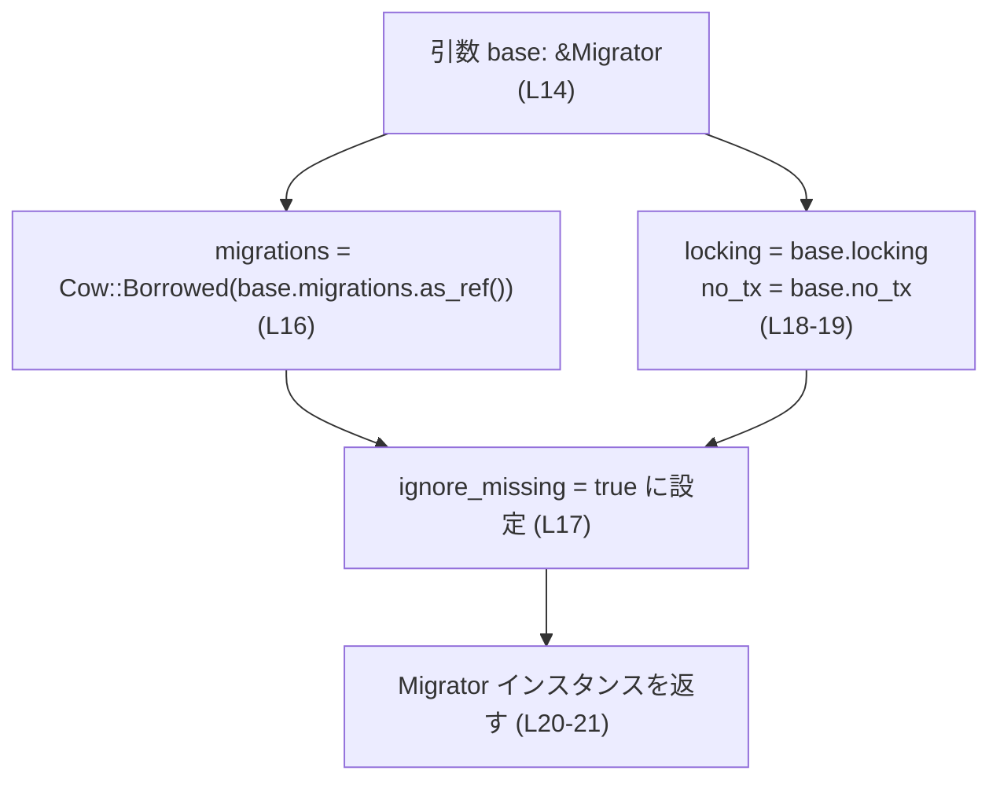
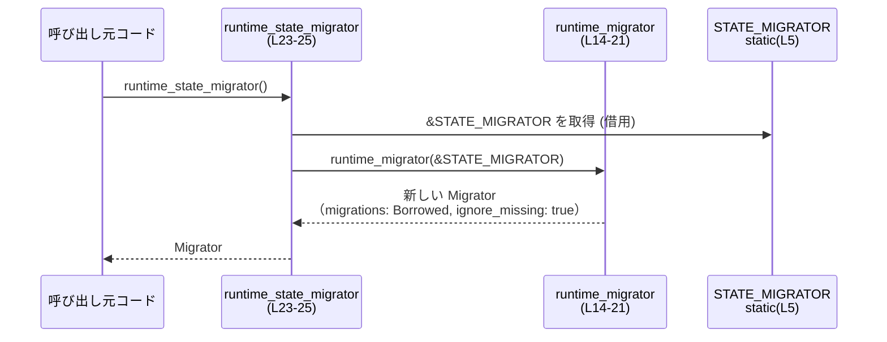

# state/src/migrations.rs コード解説

## 0. ざっくり一言

Codex の状態 DB とログ DB のマイグレーション定義（`sqlx::migrate::Migrator`）を静的に埋め込み、その上に「自分より新しいマイグレーションが DB に既に適用済みでもエラーにしない」ランタイム向け `Migrator` を生成するユーティリティです（`state/src/migrations.rs:L5-6, L14-29`）。

---

## 1. このモジュールの役割

### 1.1 概要

- このモジュールは **データベースマイグレーションの定義をバイナリに埋め込み**、さらに
- **古いバイナリが新しいマイグレーション済み DB を開けるようにするための `Migrator` ラッパ**を提供します  
  （`runtime_migrator` のドキュコメントより、`state/src/migrations.rs:L8-13`）。

### 1.2 アーキテクチャ内での位置づけ

このモジュール内コンポーネントと外部依存関係の関係を示します。

```mermaid
graph TD
    subgraph "このファイル state/src/migrations.rs (L1-29)"
        SM["STATE_MIGRATOR<br/>(静的 Migrator, L5)"]
        LM["LOGS_MIGRATOR<br/>(静的 Migrator, L6)"]
        RM["runtime_migrator<br/>(L14-21)"]
        RSM["runtime_state_migrator<br/>(L23-25)"]
        RLM["runtime_logs_migrator<br/>(L27-29)"]
    end

    subgraph "外部クレート / 標準ライブラリ"
        SQLX["sqlx::migrate::Migrator<br/>(L3)"]
        COW["std::borrow::Cow<br/>(L1)"]
        MIGDIR["\"./migrations\"<br/>(ビルド時に使用, L5)"]
        LOGDIR["\"./logs_migrations\"<br/>(ビルド時に使用, L6)"]
    end

    SQLX --> SM
    SQLX --> LM

    SM --> RSM
    LM --> RLM

    RSM --> RM
    RLM --> RM

    COW --> RM
    MIGDIR --> SM
    LOGDIR --> LM
```

- `STATE_MIGRATOR` / `LOGS_MIGRATOR` は `sqlx::migrate!` マクロにより、ディレクトリ (`"./migrations"`, `"./logs_migrations"`) からビルド時にマイグレーション情報を読み込む静的値です（`state/src/migrations.rs:L3, L5-6`）。
- ランタイム時には `runtime_state_migrator` / `runtime_logs_migrator` が `runtime_migrator` を通じて、設定を少し変更した `Migrator` を生成します（`state/src/migrations.rs:L14-21, L23-29`）。

### 1.3 設計上のポイント

- **静的なマイグレーション定義**  
  - `STATE_MIGRATOR` と `LOGS_MIGRATOR` は `pub(crate) static` として定義されており、クレート内どこからでも共有されます（`state/src/migrations.rs:L5-6`）。
- **ランタイム用ラッパでの挙動変更**  
  - `runtime_migrator` は `ignore_missing: true` にセットし、その他の設定 (`locking`, `no_tx`) はベースからコピーしています（`state/src/migrations.rs:L16-19`）。  
  - これにより、「DB にはあるが、このバイナリに埋め込まれていないマイグレーション」を無視する挙動になります（ドキュコメント, `state/src/migrations.rs:L8-13`）。
- **コピーオンライト（Cow）による参照共有**  
  - 新しい `Migrator` の `migrations` フィールドは `Cow::Borrowed(base.migrations.as_ref())` で設定され、ベースのマイグレーション配列を借用しています（`state/src/migrations.rs:L16`）。  
  - これにより、マイグレーション定義を複製せず共有します。
- **安全性 / 並行性**  
  - 関数内では共有可変状態は使われておらず、`static` へのアクセスもイミュータブル参照のみです（`state/src/migrations.rs:L14-19, L23-28`）。  
  - `static` 変数に格納するには型が `Sync` である必要があるため、コンパイルが通っている前提では `Migrator` はスレッド間で安全に共有できる型です。

---

## 2. 主要な機能一覧

- 状態 DB 用の静的マイグレーション定義: `STATE_MIGRATOR`（`state/src/migrations.rs:L5`）
- ログ DB 用の静的マイグレーション定義: `LOGS_MIGRATOR`（`state/src/migrations.rs:L6`）
- 任意の `Migrator` から「未知のマイグレーションを許容する」ランタイム用 `Migrator` を生成: `runtime_migrator`（`state/src/migrations.rs:L14-21`）
- 状態 DB 用ランタイム `Migrator` の取得: `runtime_state_migrator`（`state/src/migrations.rs:L23-25`）
- ログ DB 用ランタイム `Migrator` の取得: `runtime_logs_migrator`（`state/src/migrations.rs:L27-29`）

### 2.1 コンポーネント一覧（インベントリー）

| 名前 | 種別 | 型 | 役割 / 用途 | 定義位置 |
|------|------|----|------------|----------|
| `STATE_MIGRATOR` | 静的変数 | `Migrator` | 状態 DB 用マイグレーションをビルド時に埋め込んだ `Migrator` | `state/src/migrations.rs:L5` |
| `LOGS_MIGRATOR` | 静的変数 | `Migrator` | ログ DB 用マイグレーションをビルド時に埋め込んだ `Migrator` | `state/src/migrations.rs:L6` |
| `runtime_migrator` | 関数（非公開） | `fn(&'static Migrator) -> Migrator` | ベース `Migrator` を元に `ignore_missing: true` なランタイム用 `Migrator` を生成 | `state/src/migrations.rs:L14-21` |
| `runtime_state_migrator` | 関数（`pub(crate)`） | `fn() -> Migrator` | `STATE_MIGRATOR` をベースにランタイム用 `Migrator` を返す | `state/src/migrations.rs:L23-25` |
| `runtime_logs_migrator` | 関数（`pub(crate)`） | `fn() -> Migrator` | `LOGS_MIGRATOR` をベースにランタイム用 `Migrator` を返す | `state/src/migrations.rs:L27-29` |

---

## 3. 公開 API と詳細解説

### 3.1 型一覧（構造体・列挙体など）

このファイル内で直接利用される主な型です（自前定義はありません）。

| 名前 | 種別 | 役割 / 用途 | 根拠 |
|------|------|-------------|------|
| `Migrator` | 構造体（外部クレート `sqlx`） | マイグレーション定義と実行のための型。ここでは `migrations`, `ignore_missing`, `locking`, `no_tx` フィールドを持つことが分かります。 | `state/src/migrations.rs:L3, L14-19` |
| `Cow<'a, T>` | 列挙体（標準ライブラリ） | 借用または所有のいずれかを表すコピーオンライト型。ここでは `Cow::Borrowed` を使い、マイグレーション配列を借用しています。 | `state/src/migrations.rs:L1, L16` |

> `Migrator` のその他のフィールドやメソッドについては、このファイルからは分かりません。

### 3.2 関数詳細

#### `runtime_migrator(base: &'static Migrator) -> Migrator`

**概要**

与えられたベース `Migrator` を元に、マイグレーション定義を共有しつつ `ignore_missing: true` を設定した新しい `Migrator` を生成します（`state/src/migrations.rs:L14-19`）。

**引数**

| 引数名 | 型 | 説明 |
|--------|----|------|
| `base` | `&'static Migrator` | ベースとなる `Migrator` への `'static` な参照。通常は `STATE_MIGRATOR` や `LOGS_MIGRATOR` が渡されます（`state/src/migrations.rs:L14, L23-24, L27-28`）。 |

**戻り値**

- 型: `Migrator`  
- 内容:
  - `migrations`: `base.migrations` を `Cow::Borrowed` で借用した値（`state/src/migrations.rs:L16`）
  - `ignore_missing`: `true` に強制設定（`state/src/migrations.rs:L17`）
  - `locking`: `base.locking` をコピー（`state/src/migrations.rs:L18`）
  - `no_tx`: `base.no_tx` をコピー（`state/src/migrations.rs:L19`）

**内部処理の流れ**

1. ベース `Migrator` を引数として受け取る（`state/src/migrations.rs:L14`）。
2. 構造体リテラルで新しい `Migrator` を生成する（`state/src/migrations.rs:L15-20`）。
3. `migrations` フィールドには `Cow::Borrowed(base.migrations.as_ref())` を設定し、ベースのマイグレーション配列を借用する（`state/src/migrations.rs:L16`）。
4. `ignore_missing` を `true` に設定し、ベースよりも緩いチェックにする（`state/src/migrations.rs:L17`）。
5. `locking` と `no_tx` をベースの値からコピーする（`state/src/migrations.rs:L18-19`）。
6. 新しい `Migrator` を返す（`state/src/migrations.rs:L20-21`）。

**簡易フローチャート**



**Examples（使用例）**

この関数はファイル内では直接呼び出されず、`runtime_state_migrator` / `runtime_logs_migrator` 経由で使われます。

```rust
// 状態DB用のランタイムMigratorを生成する例
let migrator = runtime_state_migrator();  // 内部で runtime_migrator(&STATE_MIGRATOR) を呼び出す
```

※ 返された `migrator` をどう使うか（どのメソッドを呼ぶか）は、このファイルでは定義されていません。

**Errors / Panics**

- 本関数内で `panic!`, `unwrap`, `?` などは使用されておらず、明示的なエラー分岐もありません（`state/src/migrations.rs:L14-21`）。
- `base.migrations.as_ref()` は通常安全な参照取得であり、このファイルから見える範囲ではパニックの可能性は示されていません。

**Edge cases（エッジケース）**

- `base.migrations` が空配列の場合  
  - `as_ref()` は空スライスへの参照を返すだけなので、そのまま空のマイグレーションセットを共有する形になります（`state/src/migrations.rs:L16`）。
- `base` がどのような設定を持っていても、この関数は `ignore_missing` を `true` に上書きします（`state/src/migrations.rs:L17`）。

**使用上の注意点**

- **契約（前提条件）**  
  - `base` は `'static` ライフタイムである必要があります（関数シグネチャ, `state/src/migrations.rs:L14`）。これは `migrations` を `Cow::Borrowed` で借用するため、返された `Migrator` も `'static` なマイグレーション定義に依存することを意味します。
- **挙動上の注意**  
  - `ignore_missing: true` に設定されるため、「DB に存在するが、このバイナリに埋め込まれていないマイグレーション」があってもエラーにならない前提で動作します（ドキュコメント, `state/src/migrations.rs:L8-13`）。  
    - スキーマの不一致がアプリケーションロジックに影響しないかは、呼び出し側で確認する必要があります。
- **並行性**  
  - 関数内では `base` をイミュータブルに借用しているだけであり、共有可変状態は扱っていません（`state/src/migrations.rs:L14-19`）。  
  - 従って、この関数自体は複数スレッドから同時に呼び出しても問題になりません。

---

#### `runtime_state_migrator() -> Migrator`

**概要**

状態 DB 用に埋め込まれた `STATE_MIGRATOR` をベースとして、`runtime_migrator` によりランタイム用 `Migrator` を生成して返します（`state/src/migrations.rs:L23-25`）。

**引数**

- なし

**戻り値**

- 型: `Migrator`  
- 内容: `runtime_migrator(&STATE_MIGRATOR)` の結果。`STATE_MIGRATOR` の設定を引き継ぎつつ、`ignore_missing: true` に設定された `Migrator` です（`state/src/migrations.rs:L5, L23-25`）。

**内部処理の流れ**

1. グローバル静的な `STATE_MIGRATOR` を `&STATE_MIGRATOR` として借用する（`state/src/migrations.rs:L23-24`）。
2. それを `runtime_migrator` に渡して新しい `Migrator` を生成する（`state/src/migrations.rs:L14-21, L24`）。
3. 生成された `Migrator` をそのまま返す（`state/src/migrations.rs:L23-25`）。

**Examples（使用例）**

```rust
// 状態DB用のMigratorを取得する
let state_migrator = runtime_state_migrator();  // L23-25

// ここで state_migrator を使ってDBマイグレーションを実行することが想定されますが、
// 具体的なメソッド呼び出しはこのファイルには現れません。
```

**Errors / Panics**

- 内部で呼び出す `runtime_migrator` がエラーを返さない設計であるため、この関数もエラーやパニックを発生させるコードは含みません（`state/src/migrations.rs:L14-21, L23-25`）。

**Edge cases（エッジケース）**

- `STATE_MIGRATOR` のマイグレーションセットが空の場合  
  - 返される `Migrator` も空のマイグレーションセットを持ちます（`state/src/migrations.rs:L5, L16`）。
- `STATE_MIGRATOR` によっては `locking` や `no_tx` が特別な値になっている可能性がありますが、そのまま引き継がれます（`state/src/migrations.rs:L18-19`）。

**使用上の注意点**

- **契約**  
  - `STATE_MIGRATOR` はビルド時に `sqlx::migrate!("./migrations")` で埋め込まれており、アプリケーションの状態 DB スキーマを表している前提です（`state/src/migrations.rs:L5`）。
- **スキーマの前提**  
  - `ignore_missing: true` により、DB 側に存在する最新マイグレーションの一部を認識しない状態で動く可能性があります（`state/src/migrations.rs:L8-13, L17`）。  
    - アプリケーションコードが「自分が知らないスキーマ変更」に依存していないことを前提に利用する必要があります。
- **並行性**  
  - `STATE_MIGRATOR` は `static` であり、`&STATE_MIGRATOR` の取得と `runtime_migrator` の呼び出しは読み取り専用です（`state/src/migrations.rs:L5, L23-24`）。  
  - そのため、複数スレッドから同時に `runtime_state_migrator` を呼び出しても、このファイルの範囲では競合状態は発生しません。

---

#### `runtime_logs_migrator() -> Migrator`

**概要**

ログ DB 用に埋め込まれた `LOGS_MIGRATOR` をベースとして、`runtime_migrator` によりランタイム用 `Migrator` を生成して返します（`state/src/migrations.rs:L27-29`）。

**引数**

- なし

**戻り値**

- 型: `Migrator`  
- 内容: `runtime_migrator(&LOGS_MIGRATOR)` の結果。ログ DB 用のマイグレーション定義を持ち、`ignore_missing: true` に設定された `Migrator` です（`state/src/migrations.rs:L6, L27-29`）。

**内部処理の流れ**

1. 静的な `LOGS_MIGRATOR` を `&LOGS_MIGRATOR` として借用する（`state/src/migrations.rs:L27-28`）。
2. それを `runtime_migrator` に渡して新しい `Migrator` を生成する（`state/src/migrations.rs:L14-21, L28`）。
3. 生成された `Migrator` を返す（`state/src/migrations.rs:L27-29`）。

**Examples（使用例）**

```rust
// ログDB用のMigratorを取得する
let logs_migrator = runtime_logs_migrator();  // L27-29

// logs_migrator の具体的な使用方法は、このファイルには現れません。
```

**Errors / Panics**

- `runtime_state_migrator` と同様に、明示的なエラーやパニックを発生させるコードは含みません（`state/src/migrations.rs:L27-29`）。

**Edge cases（エッジケース）**

- ログ DB 用マイグレーションが存在しない場合、空のマイグレーションセットの `Migrator` が返されることになります（`state/src/migrations.rs:L6, L16`）。

**使用上の注意点**

- 状態 DB 用との違いは、元になる静的 `Migrator` が `LOGS_MIGRATOR` である点のみです（`state/src/migrations.rs:L6, L27-28`）。  
- ログ DB のスキーマにも、未知のマイグレーションがあっても許容する設計になるため、ログ解析や保存形式との整合性に注意が必要です。

---

### 3.3 その他の関数

- このファイルには上記 3 つ以外の関数は定義されていません（`state/src/migrations.rs:L14-21, L23-29`）。

---

## 4. データフロー

ここでは、「呼び出し元が状態 DB 用のランタイム `Migrator` を取得する」ケースのデータフローを示します。



- 呼び出し元は `runtime_state_migrator()` を呼ぶだけで、`STATE_MIGRATOR` をベースにしたランタイム用 `Migrator` を取得できます（`state/src/migrations.rs:L23-25`）。
- `runtime_migrator` 内ではベースの `migrations` を借用し、`ignore_missing` を `true` に変更した新しい `Migrator` を構築します（`state/src/migrations.rs:L16-17`）。
- `STATE_MIGRATOR` は `static` のため、`&STATE_MIGRATOR` は `'static` ライフタイムを持ち、返される `Migrator` も `'static` なマイグレーション定義を参照します（`state/src/migrations.rs:L5, L14`）。

---

## 5. 使い方（How to Use）

### 5.1 基本的な使用方法

このファイルだけから分かる範囲での、典型的な利用パターンです。

```rust
use state::migrations::{runtime_state_migrator, runtime_logs_migrator}; // 実際のモジュールパスはこのファイルからは不明

fn main() {
    // 状態DB用のランタイムMigratorを取得する                           // L23-25
    let state_migrator = runtime_state_migrator();

    // ログDB用のランタイムMigratorを取得する                            // L27-29
    let logs_migrator = runtime_logs_migrator();

    // ここで state_migrator / logs_migrator を使ってマイグレーションを実行する想定ですが、
    // 具体的なAPI（どのメソッドを呼ぶか）はこのファイルには現れません。
}
```

> `use state::migrations::...` の正確なパスは、このチャンクのみからは分かりません。上記はイメージです。

### 5.2 よくある使用パターン

このファイルから読み取れる範囲での使い分けです。

1. **通常運用（最新バイナリ単独）**  
   - おそらく `STATE_MIGRATOR` / `LOGS_MIGRATOR` のどちらか、または `runtime_*_migrator` のどちらを使うかは設計に依存します。  
   - このファイルのコメントからは、「古いバイナリとの共存運用」時に `runtime_*_migrator` を使う意図が読み取れます（`state/src/migrations.rs:L8-13`）。

2. **ロールアウト中の混在運用**  
   - 新旧バイナリが並行稼働し、DB スキーマが新バイナリで先に進むケースでは、古いバイナリ側が `runtime_*_migrator` を通じて `ignore_missing: true` な `Migrator` を使用することが想定されます（`state/src/migrations.rs:L8-13, L17`）。

### 5.3 よくある間違い（想定）

コードから推測できる範囲での誤用例です。

```rust
// （想定される誤用例）古いバイナリで STATE_MIGRATOR を直接使用する
// これにより、DB が「自分の知っているマイグレーションより先」に進んでいるときに
// エラーになる可能性があります（コメントより推測）。
// let migrator = STATE_MIGRATOR; // L5

// （推奨される使い方）古いバイナリでは runtime_state_migrator を経由する
let migrator = runtime_state_migrator(); // L23-25
```

- ドキュコメントには「古い Codex バイナリが、新しいバイナリにより既にマイグレーションされた DB を開けるようにする」という目的が明示されています（`state/src/migrations.rs:L8-9`）。
- そのため、「古いバイナリ側が `runtime_*_migrator` を通さず静的 `Migrator` を直接使う」ことは、意図された使い方から外れる可能性があります。

### 5.4 使用上の注意点（まとめ）

- **未知マイグレーションの許容**  
  - `runtime_*_migrator` が返す `Migrator` は、DB 側にあってバイナリに埋め込まれていないマイグレーションをエラーにしない設計です（`state/src/migrations.rs:L11-13, L17`）。  
  - スキーマの差異が安全に無視できるかどうかは、アプリケーション全体の設計に依存します。
- **安全性 / セキュリティ上の懸念**  
  - スキーマの差異により、アプリケーションロジックの前提と実 DB スキーマがずれる可能性があります。認可や制約チェックをスキーマに依存している場合は特に注意が必要です。  
  - このファイル単体からは、そうした整合性チェックがどこで行われているかは分かりません。
- **並行性**  
  - 関数はいずれも副作用のない純粋関数であり、内部で共有可変状態を扱いません（`state/src/migrations.rs:L14-21, L23-29`）。  
  - `static` な `Migrator` へのアクセスはイミュータブル参照のみであるため、このファイルの範囲ではスレッドセーフです。
- **エラー処理**  
  - このモジュールは `Result` などのエラー型を返さず、`Migrator` を構築するだけです。  
  - 実際のマイグレーション実行時のエラー処理は、`Migrator` を使う側に委ねられています（呼び出し側コードはこのチャンクには現れません）。

---

## 6. 変更の仕方（How to Modify）

### 6.1 新しい機能を追加する場合

例えば、別の DB（監査ログ用など）向けのマイグレーションを追加したい場合の手順イメージです。

1. **新しい静的 Migrator の追加**  
   - 既存の定義に倣って、新しい `pub(crate) static` を追加します。

   ```rust
   pub(crate) static AUDIT_MIGRATOR: Migrator = sqlx::migrate!("./audit_migrations"); // パスは例
   // 根拠: STATE_MIGRATOR / LOGS_MIGRATOR の定義パターン (L5-6)
   ```

2. **ランタイム用関数の追加**  

   ```rust
   pub(crate) fn runtime_audit_migrator() -> Migrator {
       runtime_migrator(&AUDIT_MIGRATOR) // L14-21 のパターンに倣う
   }
   ```

3. **呼び出し側から利用**  
   - 他モジュールで新しい `runtime_audit_migrator` を呼び出すようにします。  
   - 呼び出し側のコードはこのチャンクには存在しないため、変更箇所の特定は本レポートからはできません。

### 6.2 既存の機能を変更する場合

- **`ignore_missing` の挙動を変えたい場合**  
  - `runtime_migrator` 内の `ignore_missing: true` を変更します（`state/src/migrations.rs:L17`）。  
  - 影響範囲: `runtime_state_migrator` / `runtime_logs_migrator` が返す全ての `Migrator` の挙動が変わります（`state/src/migrations.rs:L23-25, L27-29`）。
- **`LOCKING` やトランザクション設定の扱いを変えたい場合**  
  - `locking` / `no_tx` フィールドの設定を変更します（`state/src/migrations.rs:L18-19`）。  
  - これにより、マイグレーション実行時のロック戦略やトランザクション有無が変わることになりますが、具体的な意味は `sqlx::Migrator` の仕様に依存します（このファイルからは詳細不明）。
- **影響範囲の確認**  
  - このファイルは `pub(crate)` な API を提供しているため、同一クレート内のどこからでも呼び出されている可能性があります。  
  - 実際の呼び出し箇所はこのチャンクには現れないため、IDE や `rg`, `grep` などで `runtime_state_migrator` / `runtime_logs_migrator` を参照検索する必要があります。

---

## 7. 関連ファイル

このモジュールと密接に関係するパス・ディレクトリです（推論が必要な部分は明示します）。

| パス | 役割 / 関係 |
|------|------------|
| `state/src/migrations.rs` | 本レポート対象のファイル。静的 `Migrator` とランタイム用 `Migrator` 生成関数を定義。 |
| `"./migrations"` | `sqlx::migrate!` マクロに渡されるパス。状態 DB 用マイグレーションファイル群のディレクトリと推測されますが、このチャンクから実在は確認できません（`state/src/migrations.rs:L5`）。 |
| `"./logs_migrations"` | `sqlx::migrate!` マクロに渡されるパス。ログ DB 用マイグレーションファイル群のディレクトリと推測されます（`state/src/migrations.rs:L6`）。 |
| `sqlx::migrate` モジュール | 外部クレート `sqlx` のマイグレーションモジュール。`Migrator` 型と `migrate!` マクロを提供します（`state/src/migrations.rs:L3, L5-6`）。 |
| テストコード | このチャンクにはテストモジュールやテストファイルへの参照は現れません。別ファイルに存在する場合でも、このレポートからは特定できません。 |

このファイル単体では、マイグレーションの実行ロジックや DB 接続設定などは定義されていません。それらは別モジュールに存在するはずですが、このチャンクだけからは位置を特定できないため、「不明」とします。
