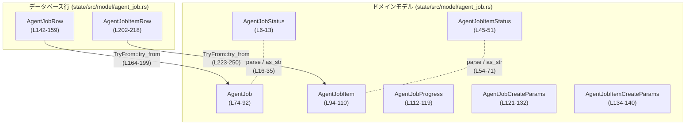
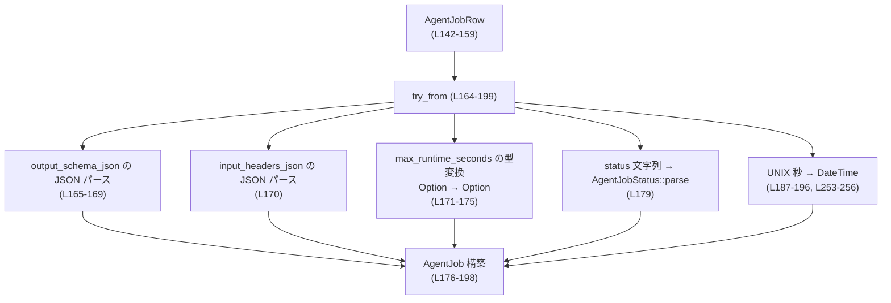
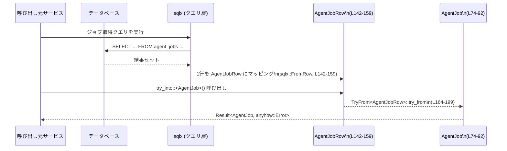

# state/src/model/agent_job.rs コード解説

## 0. ざっくり一言

エージェントによるバッチ処理ジョブと、そのジョブ内の各アイテムを表現するドメインモデルと、データベース行との変換ロジックをまとめたモジュールです。ジョブ/アイテムのステータス管理と、JSON・UNIX 時刻のパースを担います。  
（state/src/model/agent_job.rs:L6-256）

---

## 1. このモジュールの役割

### 1.1 概要

- このモジュールは **エージェントジョブの状態管理と永続化との橋渡し** を行うために存在し、次の機能を提供します。
  - ジョブ・ジョブアイテム・進捗などの **ドメイン構造体の定義**（AgentJob, AgentJobItem, AgentJobProgress など）  
    （L74-140, L112-119）
  - ステータスを表す **列挙体と文字列表現との相互変換**（AgentJobStatus / AgentJobItemStatus）  
    （L6-43, L45-72）
  - SQLx で取得した **DB 行（AgentJobRow / AgentJobItemRow）からドメインモデルへの変換処理**  
    （L142-159, L161-199, L202-218, L220-250）
  - UNIX 秒から `DateTime<Utc>` への安全な変換ユーティリティ  
    （L253-256）

### 1.2 アーキテクチャ内での位置づけ

このファイルだけから読み取れる範囲では、主に「DB 層」と「ドメインモデル層」の間に位置するコンバータとして機能しています。



- 上位レイヤー（サービスやユースケース層）は、`AgentJob` / `AgentJobItem` を直接扱うと考えられますが、具体的な呼び出し元はこのチャンクには現れません。
- DB からの取得は `sqlx::FromRow` 派生を持つ `AgentJobRow` / `AgentJobItemRow` 経由で行われ、その後 `TryFrom` 実装によりドメイン型へ変換されます。（L142, L202, L161-199, L220-250）

### 1.3 設計上のポイント

コードから読み取れる設計上の特徴は次の通りです。

- **ステータスの型安全化**  
  - ステータスを文字列ではなく列挙体（`AgentJobStatus`, `AgentJobItemStatus`）で表現し、`parse`/`as_str` で文字列と相互変換します。（L6-43, L45-72）
- **DB スキーマとの明確な分離**
  - DB 行用の構造体（`AgentJobRow`, `AgentJobItemRow`）とドメインモデル（`AgentJob`, `AgentJobItem`）を分離し、`TryFrom` で変換しています。（L74-110, L142-159, L161-199, L202-218, L220-250）
- **エラー処理の方針**
  - 変換処理やパースには `anyhow::Result` / `anyhow::Error` を用い、エラー時は `Err` を返すスタイルです。（L1, L26-35, L63-70, L161-176, L220-250, L253-255）
- **時刻の表現**
  - DB では `i64` の UNIX 秒、ドメインモデルでは `DateTime<Utc>` を使用し、`epoch_seconds_to_datetime` で変換します。（L154-157, L187-188, L239-241, L253-256）
- **JSON の扱い**
  - スキーマ・入力行・結果はすべて `serde_json::Value` として保持し、DB とは JSON 文字列としてやりとりします。（L4, L82-83, L100, L104, L150-151, L165-170, L208-213, L229-237）
- **状態管理用フィールド**
  - `attempt_count` や `last_error`, `assigned_thread_id` など、リトライやスレッド割り当て状況のトラッキングに使えるフィールドを持ちます。（L101-105）

---

## 2. 主要な機能一覧

このモジュールが提供する主な機能は次の通りです。

- ジョブステータス管理: `AgentJobStatus` の定義と `parse` / `as_str` / `is_final` による状態判定（L6-43）
- ジョブアイテムステータス管理: `AgentJobItemStatus` の定義と `parse` / `as_str`（L45-72）
- ジョブモデル: `AgentJob` 構造体によるジョブのメタ情報・入出力パス・ステータス・タイムスタンプの保持（L74-92）
- ジョブアイテムモデル: `AgentJobItem` 構造体による各行データ・結果・ステータスの保持（L94-110）
- 進捗情報: `AgentJobProgress` によるジョブ内アイテム数の集計値保持（L112-119）
- 作成パラメータ: ジョブ/アイテム作成時の入力専用構造体（`AgentJobCreateParams`, `AgentJobItemCreateParams`）（L121-140）
- DB 行からの変換: `AgentJobRow` / `AgentJobItemRow` から `AgentJob` / `AgentJobItem` への `TryFrom` 実装（L142-159, L161-199, L202-218, L220-250）
- 時刻変換ユーティリティ: UNIX 秒から `DateTime<Utc>` への安全な変換（L253-256）

---

## 3. 公開 API と詳細解説

### 3.1 型一覧（構造体・列挙体など）

| 名前 | 種別 | 公開範囲 | 役割 / 用途 | 定義 |
|------|------|----------|-------------|------|
| `AgentJobStatus` | 列挙体 | `pub` | ジョブ全体のステータスを表現（pending/running/completed/failed/cancelled） | state/src/model/agent_job.rs:L6-13 |
| `AgentJobItemStatus` | 列挙体 | `pub` | 各ジョブアイテムのステータスを表現（pending/running/completed/failed） | L45-51 |
| `AgentJob` | 構造体 | `pub` | 1 つのジョブのメタデータと I/O 設定・状態・タイムスタンプを保持 | L74-92 |
| `AgentJobItem` | 構造体 | `pub` | ジョブに属する 1 行分の入力データ・結果・ステータス等を保持 | L94-110 |
| `AgentJobProgress` | 構造体 | `pub` | ジョブ内アイテム数の集計値（合計・ステータス別件数）を保持 | L112-119 |
| `AgentJobCreateParams` | 構造体 | `pub` | ジョブ作成時の入力パラメータ用 DTO（Data Transfer Object） | L121-132 |
| `AgentJobItemCreateParams` | 構造体 | `pub` | ジョブアイテム作成時の入力パラメータ用 DTO | L134-140 |
| `AgentJobRow` | 構造体 | `pub(crate)` | SQLx が DB 行をマッピングするときに使う内部用構造体 | L142-159 |
| `AgentJobItemRow` | 構造体 | `pub(crate)` | `AgentJobItem` 用の DB 行構造体 | L202-218 |

※ `sqlx::FromRow` は `AgentJobRow` / `AgentJobItemRow` に derive されています。（L142, L202）

---

### 3.2 関数詳細（主要 7 件）

#### `AgentJobStatus::as_str(self) -> &'static str`

**概要**

`AgentJobStatus` 列挙体の各バリアントを、それに対応する英小文字の文字列 (`&'static str`) に変換します。（L16-24）

**引数**

| 引数名 | 型 | 説明 |
|--------|----|------|
| `self` | `AgentJobStatus` | 変換対象のステータス |

**戻り値**

- `&'static str`  
  - `"pending"`, `"running"`, `"completed"`, `"failed"`, `"cancelled"` のいずれかです。（L18-22）

**内部処理の流れ**

1. `match self` でバリアントごとに分岐します。（L17-23）
2. 各バリアントに対して対応するリテラル文字列を返します。

**Examples（使用例）**

```rust
use crate::model::agent_job::AgentJobStatus; // 同一クレート内を想定

fn print_status(status: AgentJobStatus) {
    // AgentJobStatus を文字列に変換して表示する
    println!("status = {}", status.as_str());
}

fn example() {
    let status = AgentJobStatus::Running;      // 実行中ステータス
    print_status(status);                      // "status = running" が出力される
}
```

**Errors / Panics**

- エラーや panic は発生しません。すべてのバリアントに対して網羅的にマッチしています。（L17-23）

**Edge cases（エッジケース）**

- 列挙体に将来バリアントが追加された場合は、この関数も更新が必要です。  
  そうでないとコンパイルエラーになります（網羅性チェック）。

**使用上の注意点**

- DB や API にステータスを保存する際、**永続化される値はこの関数の戻り値**になる前提で設計されていると解釈できます。  
  文字列との互換性を保つため、値の変更は慎重に行う必要があります。（L26-35 で逆変換を実装）

---

#### `AgentJobStatus::parse(value: &str) -> Result<AgentJobStatus>`

**概要**

文字列から `AgentJobStatus` を生成します。想定外の文字列が渡された場合はエラーを返します。（L26-35）

**引数**

| 引数名 | 型 | 説明 |
|--------|----|------|
| `value` | `&str` | ステータスを表す文字列（例: `"pending"`） |

**戻り値**

- `anyhow::Result<AgentJobStatus>`  
  - 成功時: 対応する `AgentJobStatus` バリアント  
  - 失敗時: `anyhow::Error`（メッセージ: `"invalid agent job status: {value}"`）（L33）

**内部処理の流れ**

1. `match value` で渡された文字列に応じて分岐します。（L27-33）
2. `"pending"`/`"running"`/`"completed"`/`"failed"`/`"cancelled"` のいずれかなら、対応するバリアントを `Ok` で返します。（L28-32）
3. それ以外は `anyhow::anyhow!` でエラーを生成し、`Err` として返します。（L33-34）

**Examples（使用例）**

```rust
use crate::model::agent_job::AgentJobStatus;
use anyhow::Result;

fn parse_status_from_db(value: &str) -> Result<AgentJobStatus> {
    // DB などから取得した文字列を列挙体に変換する
    AgentJobStatus::parse(value)
}

fn example() -> Result<()> {
    let s1 = AgentJobStatus::parse("pending")?;   // Ok(Pending)
    assert_eq!(s1, AgentJobStatus::Pending);

    // 想定外の文字列は Err になる
    let err = AgentJobStatus::parse("PENDING").unwrap_err();
    println!("error = {err}"); // "invalid agent job status: PENDING" など

    Ok(())
}
```

**Errors / Panics**

- 想定外の文字列の場合に `Err(anyhow::Error)` を返します。（L33-34）
- panic しません。

**Edge cases（エッジケース）**

- 大文字・小文字の違い: `"PENDING"` や `"Pending"` はすべてエラーになります（完全一致のみ）。（L27-32）
- 前後に空白がある場合（`"pending "` など）も同様にエラーです。必要であれば、呼び出し側で `trim()` する必要があります。
- 空文字 `""` や `null` 相当もエラーです。

**使用上の注意点**

- DB スキーマや外部 API と連携する場合、保存されるステータス文字列はこの関数が受け取る形と一致している必要があります。
- エラーを無視するとステータスが不明になりうるため、`?` 演算子などで呼び出し元に伝播させるか、明示的にログなどに出す設計が望まれます。

---

#### `AgentJobStatus::is_final(self) -> bool`

**概要**

ステータスが「最終状態」（完了・失敗・キャンセル）のいずれかかどうかを判定するヘルパーです。（L37-42）

**引数**

| 引数名 | 型 | 説明 |
|--------|----|------|
| `self` | `AgentJobStatus` | 判定対象のステータス |

**戻り値**

- `bool`  
  - `true`: `Completed` / `Failed` / `Cancelled` のいずれか  
  - `false`: それ以外（`Pending` / `Running`）

**内部処理の流れ**

1. `matches!` マクロを使用して、`self` が `Completed` / `Failed` / `Cancelled` のいずれかかどうかをチェックします。（L38-41）

**Examples（使用例）**

```rust
use crate::model::agent_job::AgentJobStatus;

fn can_modify_job(status: AgentJobStatus) -> bool {
    // 最終状態になっていなければ変更可能、といった判定に使える
    !status.is_final()
}

fn example() {
    assert!(!AgentJobStatus::Pending.is_final());      // false
    assert!(AgentJobStatus::Completed.is_final());     // true
}
```

**Errors / Panics**

- エラーや panic は発生しません。

**Edge cases（エッジケース）**

- 新しいステータスを追加した場合、「最終状態」に含めるかどうかを判断し、必要なら `matches!` の条件を更新する必要があります。（L38-41）

**使用上の注意点**

- ワークフロー制御（再実行可否、結果の確定など）の分岐に利用すると、呼び出し側の条件式を簡潔にできます。

---

#### `AgentJobItemStatus::parse(value: &str) -> Result<AgentJobItemStatus>`

**概要**

ジョブアイテム用ステータス文字列から `AgentJobItemStatus` を生成します。`AgentJobStatus::parse` のアイテム版です。（L63-71）

**引数 / 戻り値**

`AgentJobStatus::parse` と同様ですが、`Cancelled` はサポートされず、バリアントは `Pending` / `Running` / `Completed` / `Failed` の 4 種です。（L46-50, L63-69）

**内部処理の流れ**

1. `match value` で 4 つの文字列にマッチさせ、対応するバリアントを返します。（L64-69）
2. それ以外の文字列は `Err(anyhow::Error)` になります。（L69-70）

**Examples（使用例）**

```rust
use crate::model::agent_job::AgentJobItemStatus;

fn example() {
    let status = AgentJobItemStatus::parse("running").unwrap();
    assert_eq!(status, AgentJobItemStatus::Running);

    let err = AgentJobItemStatus::parse("cancelled").unwrap_err();
    println!("error = {err}");
}
```

**Errors / Panics / Edge cases / 使用上の注意点**

- 振る舞いは `AgentJobStatus::parse` とほぼ同じです。  
- `"cancelled"` はジョブアイテムステータスには存在しないため、常にエラーになります。  
  ジョブレベルのキャンセルは `AgentJobStatus` で表現され、アイテム側は `Failed` などにマップする設計が想定されますが、このチャンクだけでは詳細は不明です。

---

#### `impl TryFrom<AgentJobRow> for AgentJob { fn try_from(value: AgentJobRow) -> Result<AgentJob> }`

**概要**

DB から取得した `AgentJobRow` を、アプリケーションで扱いやすい `AgentJob` 構造体へ変換します。（L161-199）

**引数**

| 引数名 | 型 | 説明 |
|--------|----|------|
| `value` | `AgentJobRow` | SQLx により DB 行からマッピングされたレコード |

**戻り値**

- `anyhow::Result<AgentJob>`  
  - 成功時: すべてのフィールドを変換済みの `AgentJob`  
  - 失敗時: パースや変換に失敗した場合の `anyhow::Error`

**内部処理の流れ（アルゴリズム）**

1. **`output_schema_json` のパース**  
   - `Option<String>` を `Option<Value>` に変換します。  
     - `as_deref()` で `Option<&str>` にし、`map(serde_json::from_str)` で `Option<Result<Value, _>>` に変換。（L165-169）  
     - `transpose()?` により、JSON パース失敗時には `Err` を返します。
2. **`input_headers_json` のパース**  
   - `String` を `Vec<String>` に JSON から復元します。（L170）  
   - 失敗時には `Err` が返されます。
3. **`max_runtime_seconds` の型変換**  
   - `Option<i64>` を `Option<u64>` に変換します。（L171-175）  
   - `map(u64::try_from).transpose()` により、負の値が入っていた場合などには変換エラーが発生します。  
   - エラー時は `map_err` で `"invalid max_runtime_seconds value"` というメッセージの `anyhow::Error` に変換されます。
4. **フィールドの組み立て**（`Ok(Self { ... })`）  
   - `id`, `name`, `instruction`, `last_error`, `input_csv_path`, `output_csv_path` はそのままコピー。（L177-181, L185-187, L197-198）
   - `status` は文字列から `AgentJobStatus::parse` で構造化。（L179）
   - `auto_export` は `i64` を `!= 0` で `bool` に変換。（L181）
   - `created_at`, `updated_at`, `started_at`, `completed_at` は `epoch_seconds_to_datetime` で `DateTime<Utc>` に変換。（L187-196）

**内部フローダイアグラム**



**Examples（使用例）**

```rust
use crate::model::agent_job::{AgentJobRow, AgentJob};
use anyhow::Result;

fn map_row_to_job(row: AgentJobRow) -> Result<AgentJob> {
    // TryFrom 実装により、try_into() でも呼び出せる
    let job: AgentJob = row.try_into()?;        // ここで JSON / 時刻 / ステータスが検証される
    Ok(job)
}

fn example() -> Result<()> {
    let row = AgentJobRow {
        id: "job1".to_string(),
        name: "demo".to_string(),
        status: "pending".to_string(),
        instruction: "do something".to_string(),
        auto_export: 1,
        max_runtime_seconds: Some(60),
        output_schema_json: None,
        input_headers_json: r#"["col1","col2"]"#.to_string(),
        input_csv_path: "in.csv".to_string(),
        output_csv_path: "out.csv".to_string(),
        created_at: 1_700_000_000,
        updated_at: 1_700_000_000,
        started_at: None,
        completed_at: None,
        last_error: None,
    };

    let job: AgentJob = row.try_into()?;        // 変換成功
    assert_eq!(job.status.as_str(), "pending");
    Ok(())
}
```

**Errors / Panics**

次の条件で `Err(anyhow::Error)` になります。

- `output_schema_json` の中身が不正な JSON 文字列だった場合（L165-169）
- `input_headers_json` が不正な JSON（`Vec<String>` として解釈できない）だった場合（L170）
- `max_runtime_seconds` が負の値など `u64::try_from` に失敗する値だった場合（L171-175）
- `status` が `AgentJobStatus::parse` で解釈できない文字列だった場合（L179, L26-35）
- 任意のタイムスタンプ（`created_at` 等）が `epoch_seconds_to_datetime` で無効と判断された場合（L187-196, L253-255）

panic は使っておらず、すべて `Result` で表現されます。

**Edge cases（エッジケース）**

- JSON 文字列が非常に大きい場合、パースコストが高くなります（性能面の注意点）。
- `max_runtime_seconds` に `i64::MAX` など非常に大きな値を入れると、`u64` への変換には成功しても、その後の利用箇所によってはオーバーフローの危険があります（このファイルから先の利用方法は不明）。
- UNIX 秒が chrono の扱えない範囲（非常に大きい年など）の場合は `invalid unix timestamp` エラーになります。（L253-255）

**使用上の注意点**

- DB スキーマの変更（カラム型や JSON の構造変更）を行った場合、この変換ロジックも合わせて更新する必要があります。
- 変換処理が **入力検証の役割** を兼ねているため、「ここを通らずに直接 `AgentJob` を構築する」コードを増やすと、一貫した検証が保てなくなる可能性があります。
- `anyhow::Error` は型が緩やかなため、呼び出し元で具体的な原因を判別する場合はエラーメッセージや `downcast_ref` の利用が必要です。

---

#### `impl TryFrom<AgentJobItemRow> for AgentJobItem { fn try_from(value: AgentJobItemRow) -> Result<AgentJobItem> }`

**概要**

`AgentJobItemRow` を `AgentJobItem` に変換する処理です。JSON パース・ステータスパース・時刻変換を行います。（L220-250）

**引数 / 戻り値**

`AgentJobRow` → `AgentJob` のケースと同様ですが、アイテム固有フィールドを扱います。

**内部処理の流れ**

1. `job_id`, `item_id`, `row_index`, `source_id`, `assigned_thread_id`, `attempt_count`, `last_error` はそのままコピー。（L225-233, L238）
2. `row_json` を `serde_json::from_str` で `Value` に変換。（L229-230）
3. `status` を `AgentJobItemStatus::parse` で構造化。（L230）
4. `result_json` を `Option<String>` から `Option<Value>` に変換（`as_deref().map(serde_json::from_str).transpose()?`）。（L233-237）
5. タイムスタンプ (`created_at`, `updated_at`, `completed_at`, `reported_at`) を `epoch_seconds_to_datetime` で変換。（L239-247）

**Examples（使用例）**

```rust
use crate::model::agent_job::{AgentJobItemRow, AgentJobItem};
use anyhow::Result;

fn map_row_to_item(row: AgentJobItemRow) -> Result<AgentJobItem> {
    let item: AgentJobItem = row.try_into()?;   // JSON, ステータス, 日時を検証
    Ok(item)
}
```

**Errors / Panics**

- `row_json` や `result_json` が不正な JSON の場合にエラー。（L229-230, L233-237）
- `status` が `AgentJobItemStatus::parse` で認識されない文字列の場合にエラー。（L230, L63-70）
- タイムスタンプが無効な UNIX 秒の場合にエラー。（L239-247, L253-255）
- panic はありません。

**Edge cases**

- `row_index` や `attempt_count` は `i64` ですが、負の値に対する扱いはこのファイルでは特に制限されておらず、呼び出し側の前提に依存します。
- `reported_at` が `None` の場合は「まだ外部に報告されていない」といった意味に使えると考えられますが、具体的な意味はこのチャンクからは分かりません。

**使用上の注意点**

- `row_json` / `result_json` に格納される JSON の型（オブジェクト／配列／プリミティブ）は拘束されていません。後続処理でのパターンマッチが必要です。
- エラーはすべて `anyhow::Error` に集約されるため、「どのフィールドのパースに失敗したか」を区別したい場合は、エラーに追加情報を付与する必要があります（この実装ではメッセージのみ）。

---

#### `epoch_seconds_to_datetime(secs: i64) -> Result<DateTime<Utc>>`

**概要**

UNIX epoch（1970-01-01 UTC）からの経過秒数を `DateTime<Utc>` に変換する小さなユーティリティです。（L253-256）

**引数**

| 引数名 | 型 | 説明 |
|--------|----|------|
| `secs` | `i64` | UNIX epoch からの経過秒数 |

**戻り値**

- `anyhow::Result<DateTime<Utc>>`  
  - 成功時: 与えられた秒数を表す `DateTime<Utc>`  
  - 失敗時: `"invalid unix timestamp: {secs}"` というメッセージの `anyhow::Error`（L255）

**内部処理の流れ**

1. `DateTime::<Utc>::from_timestamp(secs, 0)` を呼び出します。（L254）
2. 返り値は `Option<DateTime<Utc>>` であり、`ok_or_else` により `None` の場合は `Err(anyhow::Error)` に変換されます。（L254-255）

**Examples（使用例）**

```rust
use chrono::{DateTime, Utc};
use crate::model::agent_job::epoch_seconds_to_datetime; // 同モジュール内を想定
use anyhow::Result;

fn example() -> Result<()> {
    let dt: DateTime<Utc> = epoch_seconds_to_datetime(1_700_000_000)?; // 有効なタイムスタンプ
    println!("datetime = {dt}");

    // 非常に大きな値など、chrono が扱えない範囲だとエラーになる
    let err = epoch_seconds_to_datetime(i64::MAX).unwrap_err();
    println!("error = {err}");
    Ok(())
}
```

**Errors / Panics**

- 与えられた秒数が `chrono` が表現可能な範囲を超えている場合、`Err(anyhow::Error)` が返ります。（L254-255）
- panic はしません。

**Edge cases**

- 負の秒数（1970 年以前）は、`chrono` がサポートしている範囲であれば正常に変換されますが、具体的な範囲は `chrono` の仕様に依存します。このファイルからは詳細は分かりません。
- ナノ秒部分は常に `0` 固定で生成されます。（L254）

**使用上の注意点**

- DB 側のタイムスタンプがミリ秒やマイクロ秒単位で保存されている場合は、呼び出し前に秒単位に変換する必要があります。
- エラー時のメッセージには秒数が埋め込まれるため、ログに出すことでどの値が不正だったかを特定しやすくなっています。（L255）

---

### 3.3 その他の関数

| 関数名 | 定義 | 役割（1 行） |
|--------|------|--------------|
| `AgentJobItemStatus::as_str(self) -> &'static str` | L54-61 | ジョブアイテムステータスを `"pending"` 等の文字列に変換します。 |

---

## 4. データフロー

ここでは「DB からジョブを読み込み、ドメインモデルに変換する」典型的なフローを説明します。

1. 上位レイヤーが SQLx を使って DB にクエリを発行します（このファイルには具体的なクエリは登場しません）。
2. SQLx が結果行を `AgentJobRow` にマッピングします（`sqlx::FromRow` 派生、L142-159）。
3. 呼び出し側が `try_into::<AgentJob>()` などを通じて `TryFrom<AgentJobRow>` を呼び出します。（L161-199）
4. 変換処理の中で JSON・ステータス・タイムスタンプがパースされ、`AgentJob` が返されます。



- ジョブアイテムについても同様に、`AgentJobItemRow` → `AgentJobItem` への変換が行われます。（L202-218, L220-250）
- 変換過程で JSON やステータス文字列に問題があると、`Result` が `Err` となって呼び出し元に返されるため、呼び出し側はそれを元にリトライやロギング、補正などを行えます。

---

## 5. 使い方（How to Use）

### 5.1 基本的な使用方法

このモジュール内の型と関数のみを使った、簡単な利用例です。

#### 例1: DB 行を `AgentJob` に変換してステータスを表示する

```rust
use anyhow::Result;
use serde_json::json;
use crate::model::agent_job::{
    AgentJobRow,
    AgentJob,
    AgentJobStatus,
};

fn load_job_from_row(row: AgentJobRow) -> Result<AgentJob> {
    // TryFrom 実装により、? でエラーを伝播できる
    let job: AgentJob = row.try_into()?;               // L161-199
    Ok(job)
}

fn example() -> Result<()> {
    // 実際には sqlx のクエリ結果から生成されることを想定
    let row = AgentJobRow {
        id: "job1".to_string(),
        name: "demo".to_string(),
        status: "pending".to_string(),                 // AgentJobStatus::parse で解釈される (L26-35, L179)
        instruction: "do something".to_string(),
        auto_export: 1,
        max_runtime_seconds: Some(60),
        output_schema_json: Some(json!({ "type": "object" }).to_string()),
        input_headers_json: r#"["col1","col2"]"#.to_string(),
        input_csv_path: "in.csv".to_string(),
        output_csv_path: "out.csv".to_string(),
        created_at: 1_700_000_000,
        updated_at: 1_700_000_000,
        started_at: None,
        completed_at: None,
        last_error: None,
    };

    let job = load_job_from_row(row)?;                 // JSON / 日時 / ステータスが検証される
    println!("job status = {}", job.status.as_str());  // "pending" (L16-24)
    Ok(())
}
```

#### 例2: ステータス文字列から最終状態かどうかを判定する

```rust
use anyhow::Result;
use crate::model::agent_job::AgentJobStatus;

fn is_final_status_str(value: &str) -> Result<bool> {
    let status = AgentJobStatus::parse(value)?;  // 文字列 → 列挙体 (L26-35)
    Ok(status.is_final())                       // 最終状態かどうか (L37-42)
}
```

### 5.2 よくある使用パターン

- **ステータスの永続化と復元**
  - 永続化時: `status.as_str()` で文字列にして保存。（L16-24）
  - 復元時: `AgentJobStatus::parse(db_value)` / `AgentJobItemStatus::parse(db_value)`（L26-35, L63-70）
- **進捗の集計**
  - `AgentJobProgress` はジョブアイテムの件数を集計した結果を保持するための構造体であり、別の処理（ループ等）で数えた結果を詰める用途に向きます。（L112-119）
- **JSON フィールドの利用**
  - `AgentJob.output_schema_json` に JSON スキーマを格納し（TODO コメントあり、L82-83）、`AgentJobItem.row_json` / `result_json` に実際の入力・出力を保持します。（L100, L104）

### 5.3 よくある間違い

```rust
use crate::model::agent_job::{AgentJobStatus, AgentJobRow};

// 間違い例: ステータス文字列をそのまま比較している
fn is_completed_bad(status_str: &str) -> bool {
    status_str == "completed"   // 大文字小文字や typo に弱い
}

// 正しい例: 列挙体にパースしてから判定する
fn is_completed_good(status_str: &str) -> anyhow::Result<bool> {
    let status = AgentJobStatus::parse(status_str)?;  // L26-35
    Ok(matches!(status, AgentJobStatus::Completed))
}
```

```rust
// 間違い例: epoch_seconds_to_datetime を使わずに i64 を直接 DateTime に詰め替えようとする
// （実際にはコンパイルエラーになるが、意図として）
fn wrong_time_handling(created_at: i64) {
    // DateTime::<Utc>::from_timestamp(...) の結果を検証していない
}

// 正しい例: epoch_seconds_to_datetime を通して検証する
use crate::model::agent_job::epoch_seconds_to_datetime;
use anyhow::Result;

fn correct_time_handling(created_at: i64) -> Result<()> {
    let dt = epoch_seconds_to_datetime(created_at)?;  // L253-256
    println!("created_at={dt}");
    Ok(())
}
```

### 5.4 使用上の注意点（まとめ）

- **エラー処理**
  - JSON パース・ステータスパース・時刻変換など、多くの処理が `anyhow::Result` でエラーを返します。必ず `?` や `match` 等でエラーを処理する必要があります。（L26-35, L63-70, L161-199, L220-250, L253-255）
- **JSON の構造**
  - `serde_json::Value` として保持される JSON の構造はこのファイルでは検証されていません。コメントに「JSON Schema に変換して構造化出力を強制する TODO」が記載されており（L82-83）、構造の妥当性チェックは別途行う前提です。
- **型の整合性**
  - DB カラム型（`i64`, `String`, `Option<String>` など）とドメイン型（`u64`, `DateTime<Utc>`, `Value` など）の間で暗黙の前提があるため、スキーマ変更時にはこのファイルを必ず確認する必要があります。
- **並行性**
  - このモジュール自体にはスレッド同期や非同期処理は含まれておらず、すべてのデータ構造は所有データ（`String`, `i64`, `DateTime<Utc>` など）だけで構成されています。  
    フィールドに内部可変性を持つ型は含まれていないため、コンパイラが許す範囲でスレッド間共有が行いやすい設計です。

---

## 6. 変更の仕方（How to Modify）

### 6.1 新しい機能を追加する場合

例として、「ジョブに新しいステータス `Paused` を追加したい」ケースを考えます。

1. **列挙体の拡張**
   - `AgentJobStatus` に新しいバリアントを追加します。（L7-12）
   - `as_str` に `"paused"` を対応付けます。（L16-24）
   - `parse` に `"paused"` → `AgentJobStatus::Paused` を追加します。（L26-35）
   - 必要であれば `is_final` での扱いを決めて追加します。（L37-42）
2. **DB スキーマの確認**
   - `AgentJobRow.status` カラムに `"paused"` が保存される設計か確認します。（L146）
3. **ドメインロジックの追加**
   - 実際に `Paused` 状態をどう扱うか（再開可否など）は、他ファイルのサービス層やユースケース層側で実装します（このチャンクには現れません）。

同様に、ジョブアイテムステータスや進捗型にフィールドを追加する場合も、「列挙体・構造体 → as_str/parse → DB Row → TryFrom」の流れで影響箇所を追うと安全に変更しやすくなります。

### 6.2 既存の機能を変更する場合

- **影響範囲の確認**
  - ステータス文字列 (`"pending"` など) を変更する場合は、`parse` / `as_str` の両方と、DB や他サービスとのインターフェースに影響します。（L16-24, L26-35, L54-61, L63-70, L146, L209）
  - タイムスタンプの型や単位を変更する場合は、`AgentJobRow` / `AgentJobItemRow` のフィールド（`i64`）と `epoch_seconds_to_datetime` を利用している箇所（TryFrom 実装）を確認する必要があります。（L154-157, L214-217, L187-196, L239-247, L253-255）
- **契約（前提条件）の保持**
  - `max_runtime_seconds` は `Option<u64>` として扱われており、「負の値は許容しない」という前提が `TryFrom` 実装に埋め込まれています。（L171-175）  
    ここを緩める／厳しくする場合は、呼び出し側の期待とも整合させる必要があります。
- **テストの観点**
  - このファイルにはテストコードは含まれていません。このため、変更を行う際には少なくとも次をカバーするテストを書くことが望ましいです（テストファイルはこのチャンクには現れません）。
    - 各 `parse` 関数の正常系・異常系
    - `TryFrom<AgentJobRow>` / `TryFrom<AgentJobItemRow>` の JSON / 時刻 / ステータスに関する正常系・異常系
    - `epoch_seconds_to_datetime` の境界値（非常に大きい値・小さい値）

---

## 7. 関連ファイル / 依存コンポーネント

このモジュールと密接に関係する外部コンポーネント（クレート）および、このチャンクから読み取れる範囲の関連をまとめます。

| パス / クレート | 役割 / 関係 |
|-----------------|------------|
| `anyhow` | 汎用エラー型 `anyhow::Error` と `Result` エイリアスにより、パース/変換の失敗を表現します。（L1, L26-35, L63-70, L161-176, L220-250, L253-255） |
| `chrono` | `DateTime<Utc>` 型と `from_timestamp` 関数を提供し、UNIX 秒の時刻を表現・変換します。（L2-3, L87-90, L106-109, L154-157, L214-217, L253-255） |
| `serde_json` | JSON 文字列と `serde_json::Value` の相互変換に使用されます。`row_json`・`result_json`・`output_schema_json`・`input_headers_json` のパースを担当します。（L4, L82-83, L100, L104, L150-151, L165-170, L208-213, L229-237） |
| `sqlx` | `FromRow` 派生により、DB 行から `AgentJobRow` / `AgentJobItemRow` へのマッピングを行います。（L142, L202） |

このチャンクだけからは、同一リポジトリ内の他ファイル（リポジトリ・サービス層・API 層など）の具体的なパスは分かりません。そのため、ジョブの作成・更新・実行などのロジックがどこにあるかは、このモジュールからは特定できません。
