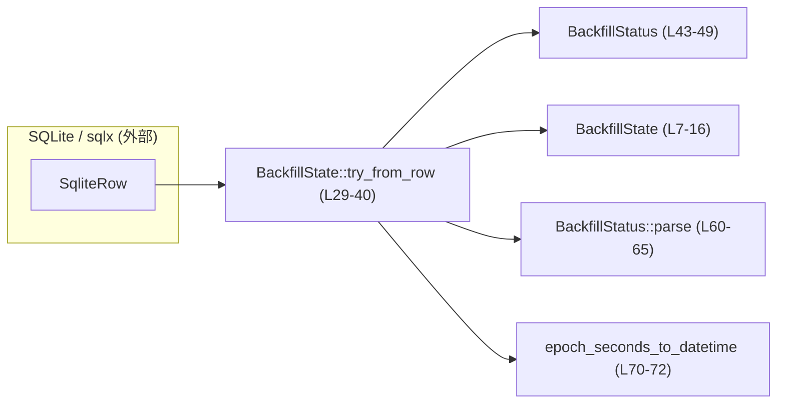
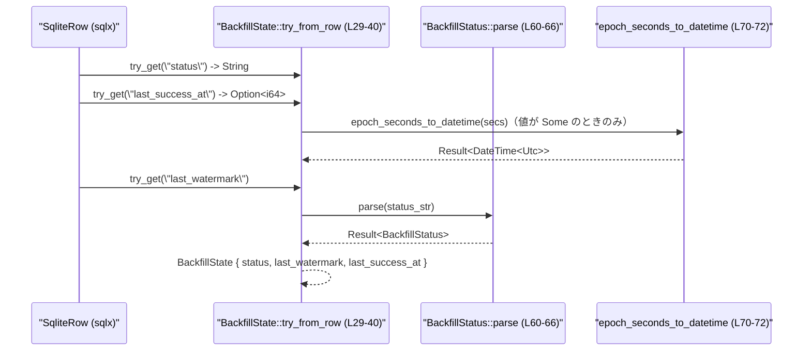

# state\src\model\backfill_state.rs

## 0. ざっくり一言

ロールアウトメタデータの「バックフィル処理」の状態を表現し、  
SQLx の `SqliteRow` からその状態を安全に復元するための小さなモデルモジュールです  
（state\src\model\backfill_state.rs:L7-16, L28-40）。

---

## 1. このモジュールの役割

### 1.1 概要

- バックフィル処理のライフサイクル状態（Pending / Running / Complete）を `BackfillStatus` で表現します（L43-49）。
- 状態・ウォーターマーク・最終成功時刻をまとめた `BackfillState` を定義します（L7-16）。
- SQLx の `SqliteRow` から `BackfillState` を組み立てる変換関数を提供します（L28-40）。
- Unix エポック秒から `DateTime<Utc>` への変換ヘルパーで、タイムスタンプの妥当性を検証します（L70-72）。

### 1.2 アーキテクチャ内での位置づけ

このモジュールは「状態モデル層」に属し、DB アクセス層（sqlx）とアプリケーションロジックの間で、  
バックフィル状態の表現・変換を担当している構成と解釈できます。



### 1.3 設計上のポイント

- **状態の明示的な型表現**  
  状態は文字列ではなく `BackfillStatus` enum で表現され、`parse`/`as_str` で DB との橋渡しをします（L45-49, L51-58, L60-66）。
- **エラーは例外ではなく `Result` で返却**  
  すべての失敗可能な操作は `anyhow::Result` を返し、`?` 演算子で伝播されます（L29-40, L60-66, L70-72）。
- **タイムスタンプの妥当性チェック**  
  Unix 秒から `DateTime` への変換で、範囲外などの不正値はエラーとして扱います（L70-72）。
- **状態のデフォルト値**  
  `Default` 実装で、未処理状態（Pending）かつウォーターマーク・成功時刻なしを標準状態としています（L18-25）。
- **並行性**  
  このファイル内にはスレッド・async・ロックなどの並行処理関連コードは存在しません（全体）。  
  関数はいずれも副作用のない純粋な変換であり、共有可変状態を扱っていません。

### 1.4 コンポーネント一覧（インベントリー）

| 名前 | 種別 | 公開範囲 | 役割 / 用途 | 定義位置（根拠） |
|------|------|----------|------------|------------------|
| `BackfillState` | 構造体 | `pub` | バックフィルの状態・ウォーターマーク・最終成功時刻を保持するモデル | state\src\model\backfill_state.rs:L7-16 |
| `impl Default for BackfillState::default` | メソッド | パブリック（`Default` 実装） | Pending で初期化された状態を返す | L18-25 |
| `BackfillState::try_from_row` | 関数（関連関数） | `pub(crate)` | `SqliteRow` から `BackfillState` を復元する | L28-40 |
| `BackfillStatus` | 列挙体 | `pub` | バックフィルのライフサイクル状態（Pending / Running / Complete）を表現 | L43-49 |
| `BackfillStatus::as_str` | メソッド | `pub const` | 状態を `"pending"` などの静的文字列に変換する | L51-58 |
| `BackfillStatus::parse` | 関数（関連関数） | `pub` | 文字列から `BackfillStatus` を復元する | L60-66 |
| `epoch_seconds_to_datetime` | 関数（自由関数） | 非公開（モジュール内のみ） | エポック秒から `DateTime<Utc>` を生成し妥当性を検証する | L70-72 |

---

## 2. 主要な機能一覧

- バックフィル状態モデル: 状態・ウォーターマーク・最終成功時刻をまとめた `BackfillState` を提供します（L7-16）。
- デフォルト状態の構築: これからバックフィルを開始するための初期状態（Pending）を `Default` 実装で提供します（L18-25）。
- DB 行からの状態復元: `SqliteRow` から `BackfillState` への変換とバリデーションを行います（L28-40）。
- 状態の文字列 ↔ enum 変換: `BackfillStatus` と `"pending"` などの文字列表現の相互変換を行います（L51-58, L60-66）。
- Unix 秒から日時への変換と検証: `i64` のエポック秒を `DateTime<Utc>` に変換し、不正値をエラーとします（L70-72）。

---

## 3. 公開 API と詳細解説

### 3.1 型一覧（構造体・列挙体など）

| 名前 | 種別 | フィールド / バリアント | 役割 / 用途 | 根拠 |
|------|------|------------------------|------------|------|
| `BackfillState` | 構造体 | `status: BackfillStatus`, `last_watermark: Option<String>`, `last_success_at: Option<DateTime<Utc>>` | バックフィルの現在状態と、処理位置・最後の成功時刻を保持 | L7-15 |
| `BackfillStatus` | 列挙体 | `Pending`, `Running`, `Complete` | バックフィルが未実行／実行中／完了のどこにあるかを表す | L43-49 |

---

### 3.2 関数詳細

#### `BackfillState::try_from_row(row: &SqliteRow) -> Result<BackfillState>`

**概要**

- SQLite の行（`SqliteRow`）から `BackfillState` を組み立てる変換関数です（L28-40）。
- `status` / `last_watermark` / `last_success_at` カラムを読み出し、バリデーションを行います。

**引数**

| 引数名 | 型 | 説明 |
|--------|----|------|
| `row` | `&SqliteRow` | sqlx が返す SQLite の 1 行分の結果 |

**戻り値**

- `Result<BackfillState>`  
  - `Ok(BackfillState)` : 正常に全フィールドが読み取られ、変換に成功した場合。  
  - `Err(anyhow::Error)` : カラム欠如・型不整合・不正な status 文字列・不正なタイムスタンプなど、いずれかのバリデーションに失敗した場合。

**内部処理の流れ**

1. `status` カラムを `String` として取得します（`row.try_get("status")?`）（L29-30）。
2. `last_success_at` カラムを `Option<i64>` として取得します（L31-32）。
3. `Option<i64>` に対し `map(epoch_seconds_to_datetime)` を適用し、`Option<Result<DateTime<Utc>>>` を `transpose()` で `Result<Option<DateTime<Utc>>>` に変換します（L31-34）。  
   - これにより、値が存在しない場合は `None`、存在してかつ妥当なら `Some(DateTime)`, 不正値なら `Err` になります。
4. `BackfillStatus::parse(status.as_str())?` で文字列ステータスを enum に変換します（L35-37）。
5. `last_watermark` カラムを読み出し（型は `Option<String>` と推定されますが、実際には `Row::try_get` の型推論に依存）（L37）。
6. 以上をフィールドにセットして `BackfillState` を返します（L35-39）。

**Examples（使用例）**

`sqlx` を用いたクエリ結果から `BackfillState` を取り出す例です。  
（クエリ文字列内のテーブル名などは実際のスキーマに合わせる必要があります。）

```rust
use anyhow::Result;
use sqlx::sqlite::{SqlitePool, SqliteRow};
use state::model::backfill_state::BackfillState; // 実際のモジュール階層に合わせて修正する

async fn load_backfill_state(pool: &SqlitePool) -> Result<BackfillState> {
    // status, last_watermark, last_success_at を返すクエリ
    let row: SqliteRow = sqlx::query("SELECT status, last_watermark, last_success_at FROM backfill_state LIMIT 1")
        .fetch_one(pool)
        .await?;

    // SqliteRow から BackfillState に変換
    let state = BackfillState::try_from_row(&row)?; // ここで status や timestamp の妥当性チェックも行われる

    Ok(state)
}
```

**Errors / Panics**

この関数は `panic` を発生させず、すべて `Result` 経由でエラーを返します。

エラーになる代表的な条件（いずれも `?` で伝播されます）:

- `row.try_get("status")` で  
  - カラム `status` が存在しない、または型が `String` にデコードできない（L29-30）。
- `row.try_get::<Option<i64>, _>("last_success_at")` で  
  - カラムが存在しない、または `i64` として読み取れない（L31-32）。
- `epoch_seconds_to_datetime` がエラーを返すとき  
  - `last_success_at` に入っている秒数が `DateTime::<Utc>::from_timestamp` の範囲外など不正（L33-34, L70-72）。
- `BackfillStatus::parse(status.as_str())` がエラーを返すとき  
  - `status` 文字列が `"pending"`, `"running"`, `"complete"` のいずれでもない（L35-37, L60-66）。
- `row.try_get("last_watermark")` で  
  - `last_watermark` カラムが存在しない、または想定型にデコードできない場合（L37）。

**Edge cases（エッジケース）**

- `last_success_at` カラムが `NULL` の場合  
  - `Option<i64>` として `None` になり、結果の `BackfillState.last_success_at` も `None` になります（L31-34）。
- `last_success_at` に不正な秒数（極端な大値など）が格納されている場合  
  - `epoch_seconds_to_datetime` が `Err` を返し、この関数も `Err` を返します（L33-34, L70-72）。
- `status` に未知の値（例: `"paused"`）が入っている場合  
  - `BackfillStatus::parse` が `Err` を返します（L35-37, L60-66）。
- 必須カラムが欠如したクエリ（`SELECT last_watermark` のみ等）で呼ぶと  
  - `try_get` の段階でエラーになり変換に失敗します。

**使用上の注意点**

- 事前に SQL クエリで `status`, `last_watermark`, `last_success_at` を選択しておく必要があります（カラム名はコードに固定されています。L29-32, L37）。
- 本関数は `pub(crate)` なので、同一クレート内からのみ直接呼び出せます（L28-29）。外部クレートから利用する場合はラッパー関数が必要になる設計です。
- 例外（`panic`）ではなく `Result` で失敗を通知するため、呼び出し側で `?` などを用いてエラー処理を行う必要があります。
- 並行実行について特別な制約はこのファイルからは読み取れませんが、副作用がないため複数タスクから独立に呼んでも同じ行に対しては同じ結果を返します。

---

#### `impl Default for BackfillState::default() -> BackfillState`

**概要**

- バックフィル状態の「初期値」として、`Pending` 状態かつウォーターマーク・成功時刻なしの `BackfillState` を生成します（L18-25）。

**内部処理**

- `status: BackfillStatus::Pending`（L21）。
- `last_watermark: None`（L22）。
- `last_success_at: None`（L23）。

**Examples（使用例）**

```rust
use state::model::backfill_state::BackfillState;

fn new_state() -> BackfillState {
    // Default::default で Pending かつ watermark/timestamp なしの状態が得られる
    BackfillState::default()
}
```

**Edge cases / 注意点**

- デフォルトが `Pending` であることは、他の処理との契約になります。  
  状態遷移ロジックが「未保存状態＝Pending」を前提としている可能性があるため、変更する場合は依存箇所の確認が必要です（L21）。
- `Default` は公開トレイト実装なので、`BackfillState` を `Option` やコレクションで利用する際などにも暗黙に使われる可能性があります。

---

#### `BackfillStatus::as_str(self) -> &'static str`

**概要**

- `BackfillStatus` の各バリアントを `"pending"` / `"running"` / `"complete"` という静的文字列に変換します（L51-58）。
- データベース保存やログ出力などで利用することが想定されます。

**戻り値**

- `&'static str`  
  - `Pending` → `"pending"`（L54）  
  - `Running` → `"running"`（L55）  
  - `Complete` → `"complete"`（L56）

**Examples（使用例）**

```rust
use state::model::backfill_state::BackfillStatus;

fn status_to_string(status: BackfillStatus) -> String {
    status.as_str().to_string() // &str を String に変換して別の場所に保存する例
}
```

**Edge cases / 注意点**

- `match` ですべてのバリアントを網羅しているため（L53-57）、将来バリアントを追加した場合、コンパイルエラーで対応漏れを検知できます。
- 返り値が `&'static str` なので、メモリ確保を伴わず高速です。

---

#### `BackfillStatus::parse(value: &str) -> Result<BackfillStatus>`

**概要**

- 文字列から `BackfillStatus` を復元します（L60-66）。
- DB から読み出したステータスや外部入力からのテキストを enum に変換するための関数です。

**引数**

| 引数名 | 型 | 説明 |
|--------|----|------|
| `value` | `&str` | `"pending"`, `"running"`, `"complete"` のいずれかを想定した文字列 |

**戻り値**

- `Result<BackfillStatus>`  
  - 対応する文字列なら `Ok(BackfillStatus::Xxx)`  
  - 未知の文字列なら `Err(anyhow::Error)` で `"invalid backfill status: {value}"` を返します（L65）。

**内部処理**

- `match value { ... }` で 3 つの既知値と `_`（その他）を分岐しています（L61-65）。

**Examples（使用例）**

```rust
use anyhow::Result;
use state::model::backfill_state::BackfillStatus;

fn parse_user_input(input: &str) -> Result<BackfillStatus> {
    BackfillStatus::parse(input.trim())
}
```

**Errors / Edge cases**

- `"pending"` / `"running"` / `"complete"` 以外の文字列はすべてエラーになります（L61-65）。
- 大文字小文字の違いは吸収されません。`"Pending"` や `"PENDING"` はエラーです。
- エラー内容は `anyhow::anyhow!` により `"invalid backfill status: {value}"` というメッセージになります（L65）。

**使用上の注意点**

- 入力を受ける前に `trim()` や小文字化などの前処理を行うかどうかは、この関数の外側で決める必要があります。
- 失敗が `Result` で返るため、ユーザー入力などに対しては `match` や `?` を使ったハンドリングが必須です。

---

#### `epoch_seconds_to_datetime(secs: i64) -> Result<DateTime<Utc>>`

**概要**

- Unix エポック秒から `DateTime<Utc>` を生成するヘルパー関数です（L70-72）。
- `DateTime::<Utc>::from_timestamp` が `None` を返すような不正な秒数に対してはエラーを返します。

**引数**

| 引数名 | 型 | 説明 |
|--------|----|------|
| `secs` | `i64` | Unix エポック（1970-01-01 00:00:00 UTC）からの経過秒数 |

**戻り値**

- `Result<DateTime<Utc>>`  
  - 妥当な範囲の秒数であれば `Ok(DateTime<Utc>)`  
  - 不正な値（範囲外など）の場合は `Err(anyhow::Error)` で `"invalid unix timestamp: {secs}"` を返します。

**内部処理**

- `DateTime::<Utc>::from_timestamp(secs, 0)` を呼び出し（L71）、  
  `Option<DateTime<Utc>>` を `ok_or_else` で `Result<DateTime<Utc>>` に変換しています（L71-72）。

**Examples（使用例）**

```rust
use anyhow::Result;
use chrono::Utc;
use state::model::backfill_state::epoch_seconds_to_datetime; // 実際にはこの関数は非公開なので同モジュール内で使用される

fn convert_example() -> Result<()> {
    let now = Utc::now();
    let secs = now.timestamp(); // i64 のエポック秒
    let dt = epoch_seconds_to_datetime(secs)?; // 成功する想定
    assert_eq!(dt.timestamp(), secs);
    Ok(())
}
```

※ 実際にはこの関数は非公開のため、モジュール外から直接呼び出すことはできません（L70）。

**Edge cases / 注意点**

- `i64` の範囲内でも、`DateTime::<Utc>::from_timestamp` がサポートしない範囲の値は `Err` になります（L71-72）。
- ナノ秒部分は常に 0 固定で呼ばれているため、秒未満の精度は保存されません（L71）。

---

### 3.3 その他の関数

このチャンクには、上記以外の補助関数や単純なラッパー関数は現れません。

---

## 4. データフロー

### 4.1 SQL 行から BackfillState への変換フロー

`SqliteRow` から `BackfillState` を生成する典型的なフローです（L28-40, L51-58, L60-66, L70-72）。



要点:

- `try_from_row` は SQL 行を起点に、ステータスとタイムスタンプの両方を検証します。
- エラーはどのステップでも `Result` 経由で呼び出し側に伝播します。
- 成功時には `BackfillState` という、アプリケーション側で扱いやすい構造体に正規化されます。

---

## 5. 使い方（How to Use）

### 5.1 基本的な使用方法

バックフィル状態を DB から読み込み、状態に応じて処理を分岐する例です。

```rust
use anyhow::Result;
use sqlx::sqlite::{SqlitePool, SqliteRow};
use state::model::backfill_state::{BackfillState, BackfillStatus};

async fn handle_backfill(pool: &SqlitePool) -> Result<()> {
    let row: SqliteRow = sqlx::query(
        "SELECT status, last_watermark, last_success_at FROM backfill_state LIMIT 1",
    )
    .fetch_one(pool)
    .await?;

    let state = BackfillState::try_from_row(&row)?; // 状態・ウォーターマーク・日時を取得

    match state.status {
        BackfillStatus::Pending => {
            // バックフィルを新規に開始する処理
        }
        BackfillStatus::Running => {
            // 中断から再開する処理など
        }
        BackfillStatus::Complete => {
            // すでに完了している場合の処理
        }
    }

    Ok(())
}
```

### 5.2 よくある使用パターン

1. **状態の永続化時に `as_str` を使用**

```rust
use state::model::backfill_state::BackfillStatus;

// 状態を保存する際に文字列に変換する例
fn status_to_db_value(status: BackfillStatus) -> &'static str {
    status.as_str()
}
```

1. **外部入力からの状態パース**

```rust
use anyhow::Result;
use state::model::backfill_state::BackfillStatus;

fn from_config(value: &str) -> Result<BackfillStatus> {
    // 必要に応じて小文字化などの前処理を行う
    BackfillStatus::parse(value)
}
```

### 5.3 よくある間違いと正しい使い方

```rust
use state::model::backfill_state::BackfillStatus;

// 間違い例: 自前で文字列を比較して状態を判定している
fn is_complete_wrong(value: &str) -> bool {
    value == "complete" // 新しい状態が追加された場合に対応漏れしやすい
}

// 正しい例: BackfillStatus::parse を経由して enum に正規化してから判定する
fn is_complete(value: &str) -> bool {
    BackfillStatus::parse(value)
        .map(|status| matches!(status, BackfillStatus::Complete))
        .unwrap_or(false) // 失敗時の扱いは要件に応じて決める
}
```

```rust
use sqlx::sqlite::SqliteRow;
use state::model::backfill_state::BackfillState;

// 間違い例: カラム名がコードと一致していない
async fn wrong_query(pool: &sqlx::SqlitePool) {
    let row: SqliteRow = sqlx::query(
        "SELECT state, watermark, success_at FROM backfill_state LIMIT 1",
    )
    .fetch_one(pool)
    .await
    .unwrap();

    // BackfillState::try_from_row は "status" など固定のカラム名を前提としているため失敗する
    let _ = BackfillState::try_from_row(&row).unwrap(); // 実行時エラーになる可能性
}

// 正しい例: コードが期待するカラム名で SELECT する
async fn correct_query(pool: &sqlx::SqlitePool) {
    let row: SqliteRow = sqlx::query(
        "SELECT status, last_watermark, last_success_at FROM backfill_state LIMIT 1",
    )
    .fetch_one(pool)
    .await
    .unwrap();

    let _ = BackfillState::try_from_row(&row).unwrap(); // カラム名が一致していれば成功する
}
```

### 5.4 使用上の注意点（まとめ）

- **カラム名の契約**  
  - `status`, `last_watermark`, `last_success_at` というカラム名はコードにハードコードされています（L29-32, L37）。  
    DB スキーマ側で名前を変えるとこの変換は失敗します。
- **状態文字列の契約**  
  - 文字列表現は `"pending"`, `"running"`, `"complete"` の 3 種類のみを受け付けます（L61-64）。  
    他の値を保存すると読み出し時にエラーとなります。
- **タイムスタンプの範囲**  
  - `last_success_at` は「秒単位の Unix エポック秒」として保存されている前提です（L31-32, L70-72）。  
    ミリ秒など別単位で保存すると誤った日付になります。
- **エラー処理**  
  - すべての変換は `Result` を返すため、`.await?` / `?` などでエラーを的確に処理する必要があります。
- **並行性**  
  - このモジュール自体には共有可変状態やグローバル状態はなく、関数は純粋な変換です。  
    そのため、複数スレッド・複数タスクから同時に呼び出しても、このファイル内のロジックが原因のデータ競合は発生しません。

---

## 6. 変更の仕方（How to Modify）

### 6.1 新しい機能を追加する場合

例: 新しい状態 `Failed` を追加したい場合

1. **`BackfillStatus` にバリアントを追加**  
   - `pub enum BackfillStatus { Pending, Running, Complete, Failed }` のように変更する（L45-48 付近）。
2. **`BackfillStatus::as_str` を更新**  
   - `match` に `BackfillStatus::Failed => "failed"` を追加する（L53-57）。
3. **`BackfillStatus::parse` を更新**  
   - `match value` に `"failed" => Ok(Self::Failed)` を追加する（L61-65）。
4. **DB 側のスキーマ・データを整合させる**  
   - 状態を保存するカラムに `"failed"` が入る可能性を考慮し、既存値との整合性を確認する必要があります。
5. **状態遷移ロジックを更新**  
   - `BackfillStatus` を使っている他の箇所で、新バリアントに対する分岐を追加する必要があります（このチャンクには現れません）。

### 6.2 既存の機能を変更する場合の注意点

- **フィールドを追加・削除する場合**  
  - `BackfillState` のフィールドを変更した場合（L7-15）、`try_from_row` による読み出し処理も合わせて更新する必要があります（L28-40）。
- **カラム名を変更する場合**  
  - SQL クエリと `try_get("<name>")` の両方を変更し、一致させる必要があります（L29-32, L37）。
- **タイムスタンプの扱いを変える場合**  
  - ミリ秒など別単位に変更する場合は、`epoch_seconds_to_datetime` の引数・型・ロジックを見直し（L70-72）、  
    それを呼び出している `try_from_row` の変換部分も連動して修正します（L31-34）。
- **エラー型を変える場合**  
  - 現在は `anyhow::Result` を使用しています（L1, L28, L60, L70）。別のエラー型へ変更する場合は、すべての `Result` と `anyhow::anyhow!` 呼び出しを見直す必要があります。

---

## 7. 関連ファイル

このチャンクから直接参照できるのは外部クレートの型のみです。  
同一クレート内の別ファイルとの関係はこのチャンクには現れません。

| パス / 型 | 役割 / 関係 |
|-----------|------------|
| `anyhow::Result`, `anyhow::anyhow!`（L1, L65, L72） | 失敗時にコンテキスト付きエラーを返すために使用 |
| `chrono::DateTime`, `chrono::Utc`（L2-3, L15, L70-71） | UTC タイムスタンプ表現として使用 |
| `sqlx::Row`, `sqlx::sqlite::SqliteRow`（L4-5, L28-29） | SQLx による SQLite の行表現。`try_from_row` の入力として利用 |

### Bugs / Security / Tests に関する補足

- **潜在的なバグ要因**  
  - DB スキーマとカラム名・型の不整合（`status`, `last_success_at`, `last_watermark`）に依存しています。  
    変更時にコード側が更新されていないと、実行時エラーになります（L29-32, L37）。
- **セキュリティ観点**  
  - このモジュールは SQL を生成せず、`SqliteRow` から値を読むだけなので、このコード単体から SQL インジェクション等は発生しません。
  - 外部からの入力値（例えば HTTP 経由）を `BackfillStatus::parse` に渡す場合、未知の文字列はエラーとして扱われ、パニックを起こさない設計です（L60-66）。
- **テストに関して**  
  - このチャンクにはテストコードは現れません。  
    望ましいテストとしては、以下のようなケースが考えられます（提案レベル）：  
    - `BackfillStatus::parse` に対する既知値 / 未知値のテスト（L60-66）。  
    - 妥当・不正なエポック秒に対する `epoch_seconds_to_datetime` のテスト（L70-72）。  
    - 正常 / 不正な行に対する `BackfillState::try_from_row` の統合テスト（L28-40）。

このファイル内のロジックは単純であり、パフォーマンスやスケーラビリティ上の大きな懸念は読み取れませんが、  
バックフィル処理全体の負荷特性は、このチャンクには現れない他のコンポーネントに依存します。
