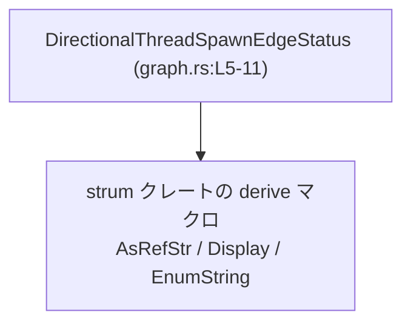
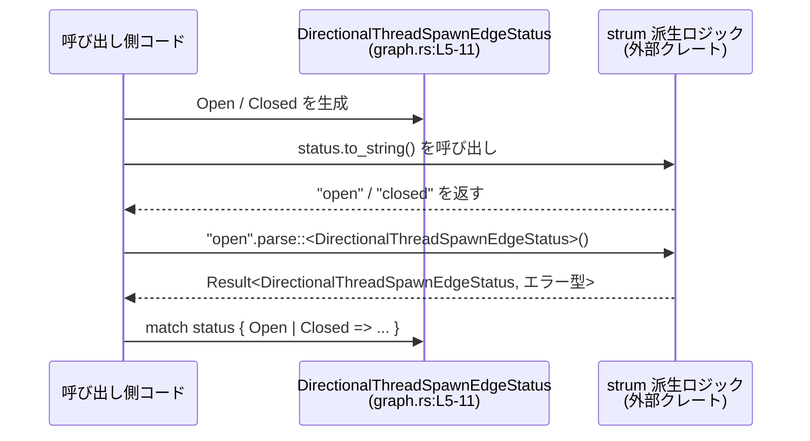

# state/src/model/graph.rs

## 0. ざっくり一言

スレッド生成（thread spawn）の「有向エッジ」に付与される状態を表す、2 値の列挙型 `DirectionalThreadSpawnEdgeStatus` を定義し、文字列との相互変換などを行えるようにしているファイルです（`graph.rs:L5-11`）。

---

## 1. このモジュールの役割

### 1.1 概要

- このモジュールは、**スレッド間の有向な「スレッド生成エッジ」の状態**を表現するために存在し、`Open` / `Closed` の 2 状態を持つ列挙型を提供します（`graph.rs:L5,8-10`）。
- `Debug`, `Clone`, `Copy`, `PartialEq`, `Eq` などの標準的なトレイトと、`strum` クレートの `AsRefStr`, `Display`, `EnumString` を derive することで、**コピー・比較・ログ出力・文字列との相互変換**などを簡潔に利用できるようになっています（`graph.rs:L1-3,6-7`）。

### 1.2 アーキテクチャ内での位置づけ

このチャンクには、この型をどこから利用しているかは記載されていません。そのため、**利用側モジュールとの具体的な依存関係は不明**です（「このチャンクには現れない」）。

分かっている範囲だけで依存関係を図示すると、次のようになります。



- `DirectionalThreadSpawnEdgeStatus` は `strum` の derive マクロに依存しており（`use strum::AsRefStr; use strum::Display; use strum::EnumString;` および `#[derive(...)]`、`#[strum(...)]`、`graph.rs:L1-3,6-7`）、  
  文字列関連の機能は `strum` 側の実装に委ねられています。
- この型を利用する「グラフ構造」や「スレッド生成ロジック」は、このチャンクには現れていません。

### 1.3 設計上のポイント

- **状態表現の単純さ**
  - 状態は `Open` / `Closed` の 2 値だけで表現されます（`graph.rs:L8-10`）。
  - 状態の追加・変更があった場合は列挙子を増やすだけでよく、表現が明示的です。

- **コピー可能で比較可能な軽量値**
  - `Clone`, `Copy`, `PartialEq`, `Eq` を derive しているため（`graph.rs:L6`）、
    - スレッド間の状態管理に使うときも、値を自由にコピー・比較できます。
    - 所有権の移動を意識せずに値渡しで扱える軽量な値オブジェクトとして設計されています。

- **デバッグとログ出力を意識した設計**
  - `Debug` を derive しているため `{:?}` 形式での出力が可能です（`graph.rs:L6`）。
  - `strum` 由来の `Display` 派生により、ユーザーフレンドリーな文字列表現でログやメトリクスに出力しやすくなります（`graph.rs:L1-3,6-7`）。

- **文字列との相互変換**
  - `strum` の `AsRefStr` / `EnumString` により、列挙値と文字列を相互に変換する用途（設定値・シリアライズ・ログ出力など）を想定した設計になっています（`graph.rs:L1-3,6-7`）。
  - `#[strum(serialize_all = "snake_case")]` により、文字列表現が `open`, `closed` のような snake_case になるよう指定されています（`graph.rs:L7`）。

- **並行性を前提とした意味づけ**
  - ドキュメントコメントで「Status attached to a directional thread-spawn edge」と明記されており（`graph.rs:L5`）、
    - **スレッド生成グラフの一部**として利用されることが示唆されています。
    - ただし、実際にどのようなスレッド制御を行うかは、このチャンクからは分かりません。

---

## 2. 主要な機能一覧

このファイルが提供する主な機能は、次の 1 型とその派生トレイトに集約されています。

- `DirectionalThreadSpawnEdgeStatus`: スレッド生成グラフ上の「有向エッジ」の状態（`Open` / `Closed`）を表現する列挙型（`graph.rs:L5,8-10`）。
- `Debug` 派生: 状態をデバッグ出力 (`{:?}`) できるようにする（`graph.rs:L6`）。
- `Clone` / `Copy` 派生: 状態値を所有権移動なしでコピーして再利用できるようにする（`graph.rs:L6`）。
- `PartialEq` / `Eq` 派生: 状態値同士を `==` / `!=` で比較できるようにする（`graph.rs:L6`）。
- `strum::AsRefStr` 派生: 列挙値から対応する文字列表現を参照として取得できるようにする（`graph.rs:L1,6`）。
- `strum::Display` 派生: `Display` 実装を自動生成し、`to_string` や `{}` フォーマットで人間向けな文字列表現を得られるようにする（`graph.rs:L2,6`）。
- `strum::EnumString` 派生＋`#[strum(serialize_all = "snake_case")]`: 文字列（例: `"open"`, `"closed"`）から列挙値へのパースを支援する（`graph.rs:L3,6-7`）。

---

## 3. 公開 API と詳細解説

### 3.1 型一覧（構造体・列挙体など）

| 名前 | 種別 | 役割 / 用途 | 主なバリアント | 定義位置 |
|------|------|------------|----------------|---------|
| `DirectionalThreadSpawnEdgeStatus` | 列挙体 (`enum`) | スレッド生成グラフの「有向エッジ」の状態を表現する。エッジが有効かどうかなどの状態に使われることが想定される。 | `Open`, `Closed` | `graph.rs:L5-11` |

- バリアントの定義（`graph.rs:L8-10`）:
  - `Open`: エッジが「開いている」状態を表します。
  - `Closed`: エッジが「閉じている」状態を表します。

#### 派生トレイト一覧（根拠: `graph.rs:L6-7`）

- 標準トレイト
  - `Debug`
  - `Clone`
  - `Copy`
  - `PartialEq`
  - `Eq`
- `strum` クレートの derive マクロ（外部依存）
  - `AsRefStr`
  - `Display`
  - `EnumString`
  - 属性 `#[strum(serialize_all = "snake_case")]`

これらにより、**コピー可能・比較可能・文字列表現への変換が容易な状態値**となっています。

### 3.2 関数詳細（派生トレイト経由で利用される主な操作）

このファイル内で明示的に定義された関数はありません（`graph.rs` の内容は型定義のみ、`L1-11`）。  
ただし、derive によって以下のようなメソッド／操作が**自動生成されることが一般的**です（外部 crate `strum` と Rust 標準の挙動に基づく説明です）。

> 注: エラー型や細かい実装は `strum` クレート側にあり、このチャンクだけからは型名などを特定できない部分があります。その場合は「詳細不明」と明示します。

---

#### 1. `DirectionalThreadSpawnEdgeStatus` のコピーと比較（`Clone` / `Copy` / `PartialEq` / `Eq`）

**概要**

- 状態値を簡単にコピーしたり、`==` / `!=` で比較したりできるようにするための自動実装です（`graph.rs:L6`）。

**利用イメージ**

```rust
// 状態値を生成                                      // Open 状態を生成
let s1 = DirectionalThreadSpawnEdgeStatus::Open;      // Copy トレイトにより軽量な値オブジェクト

// Copy のため、単純代入でコピー可能               // s2 に s1 のコピーを代入
let s2 = s1;                                          // 所有権の移動ではなくコピー

// PartialEq / Eq により比較が可能                   // 状態同士の比較
if s1 == s2 {                                         // s1 と s2 が同じ状態かどうか判定
    // ...
}
```

**Errors / Panics**

- これらのトレイト実装は通常、エラーや panic を発生しません（値コピー・比較のみ）。

**Edge cases（エッジケース）**

- 列挙子が 2 つ（`Open` / `Closed`）しかないため、比較による値の組み合わせは明確です。
- 追加のバリアントが将来増えた場合、比較ロジックや `match` 式の網羅性チェックに影響が出ます。

**使用上の注意点**

- `Copy` であるため、所有権の移動を想定した設計（例えば「一度だけ消費されるトークン」）には向きません。  
  この型はあくまで**状態のラベル**として使うことを前提とした設計になっています。

---

#### 2. 状態値から文字列への変換（`AsRefStr` / `Display`）

**概要**

- `AsRefStr` と `Display` の derive（`graph.rs:L1-2,6-7`）により、列挙値を人間可読な文字列に変換することが可能になります。
- `#[strum(serialize_all = "snake_case")]` によって、文字列表現は snake_case (`"open"`, `"closed"`) になるように設定されていると解釈できます（strum の一般的な仕様に基づく）。

**利用イメージ（代表例）**

```rust
// 状態の生成                                   // Open 状態を生成
let status = DirectionalThreadSpawnEdgeStatus::Open;

// Display 実装（strum により derive）を利用  // "{}" で人間向けの文字列に変換
let s1 = status.to_string();                    // 期待される例: "open"

// AsRefStr を利用                               // &str として参照
let s2: &str = status.as_ref();                 // 期待される例: "open"

// ログ出力                                     // ログなどでの利用
println!("edge status = {}", status);           // "{}" フォーマット
println!("edge status (debug) = {:?}", status); // Debug フォーマット
```

**戻り値**

- `to_string()` は `String` を返します。
- `as_ref()`（`AsRefStr` トレイト）は `&str` を返すことが一般的です。
- 実際の実装詳細は `strum` クレートに依存しますが、このチャンクからは型シグネチャまでは確認できません。

**Errors / Panics**

- 文字列への変換は通常エラーを返さず、panic もしない想定です（一般的な `Display` / `AsRefStr` の挙動）。

**Edge cases（エッジケース）**

- `serialize_all = "snake_case"` により、将来新しいバリアントを追加した場合も、自動的に snake_case 化された名前になると考えられます（例: `HalfOpen` → `"half_open"`）。
- バリアント名を変更すると、文字列表現も変わるため、**外部とのインターフェースとして文字列を使っている場合は互換性に注意が必要**です。

**使用上の注意点**

- 文字列表現はログ・設定・シリアライズなどに使われるケースが多く、**バリアント名の変更がそのまま外部仕様の変更になる**可能性があります。
- 外部仕様として固定したい場合は、`strum` の個別属性（`#[strum(serialize = "...")]` など）で明示的に文字列を指定することも検討対象です。このファイルにはそのような個別指定はありません（`graph.rs:L7` からは `serialize_all` のみが分かります）。

---

#### 3. 文字列から状態値へのパース（`EnumString`）

**概要**

- `EnumString` の derive (`graph.rs:L3,6-7`) により、文字列から `DirectionalThreadSpawnEdgeStatus` への変換（パース）が可能になります。
- 一般には `std::str::FromStr` がこの derive によって実装され、`"open".parse::<DirectionalThreadSpawnEdgeStatus>()` のようなコードが利用できます（strum のドキュメントに基づく一般的説明）。

**利用イメージ**

```rust
use std::str::FromStr; // FromStr トレイト（標準ライブラリ）

// 文字列から状態値へパース                      // snake_case 文字列からの変換
let status = DirectionalThreadSpawnEdgeStatus::from_str("open")?;
// あるいは
let status2: DirectionalThreadSpawnEdgeStatus = "closed".parse()?;

// match で状態に応じた処理                     // 状態に応じて分岐
match status {
    DirectionalThreadSpawnEdgeStatus::Open => {
        // エッジが開いている場合の処理
    }
    DirectionalThreadSpawnEdgeStatus::Closed => {
        // エッジが閉じている場合の処理
    }
}
```

**戻り値**

- 一般的には `Result<DirectionalThreadSpawnEdgeStatus, E>` の形を取り、`E` は `strum` 側が定義するエラー型です。
- このチャンクからエラー型名を特定することはできません（詳細不明）。

**Errors / Panics**

- 想定されるエラー条件（strum の一般的仕様に基づく）:
  - `"open"` / `"closed"` 以外の文字列が与えられた場合。
  - 大文字・小文字やフォーマットが `serialize_all` に反している場合（例: `"Open"` や `"CLOSED"`）。
- これらの場合、`Result` は `Err` になります。
- `unwrap()` や `expect()` で結果を強制的に取り出すと、`Err` のときに panic が発生します。  
  この panic は利用側の書き方に依存し、このファイル自体には panic を起こすコードはありません。

**Edge cases（エッジケース）**

- 空文字列 `""`、未知の文字列 `"unknown"` などからのパースは失敗し、`Err` になることが一般的です。
- 将来バリアントを追加した場合、そのバリアントに対応した文字列もパース対象に自動的に含まれますが、
  既存コードがそれを意識していない場合、`match` の網羅性に影響が出ます。

**使用上の注意点**

- ユーザー入力や外部システムから渡される文字列をパースする場合は、`match` / `if let` / `?` などで `Result` を安全に扱う必要があります。
- `unwrap()` の多用は不正入力に対してアプリケーションをクラッシュさせる原因となるため、特に外部入力では避けるのが安全です。

---

### 3.3 その他の関数

- このファイルには、自前で定義した補助関数やメソッドは存在しません（`graph.rs:L1-11`）。

---

## 4. データフロー

このファイル単体では、どのようなコンポーネント間で `DirectionalThreadSpawnEdgeStatus` が受け渡しされているかは不明です。  
ここでは、**この型を用いた典型的なデータフローの一例**を、型自身とそのトレイトに限定して示します。



- この図は、**型と文字列との変換操作に限ったデータフロー**を表し、実際のスレッド生成ロジックやグラフ構築処理は含んでいません（このチャンクには現れないため不明）。
- 並行性の観点では、`DirectionalThreadSpawnEdgeStatus` はフィールドを持たない単純な `Copy` 型であり、値のコピーを通じてスレッド間で安全に共有する設計に適しています（`graph.rs:L6-10`）。

---

## 5. 使い方（How to Use）

### 5.1 基本的な使用方法

ここでは、このファイルで定義される型を使って「エッジ状態を文字列から読み取り、処理に利用する」という代表的なパターンを示します。

```rust
use std::str::FromStr;                                         // FromStr トレイトをインポートする
use state::model::graph::DirectionalThreadSpawnEdgeStatus;     // 本ファイルの型をインポートする（モジュールパスは想定）

fn handle_edge_status(status_str: &str) {                       // 文字列で渡されたエッジ状態を処理する関数
    // 文字列から DirectionalThreadSpawnEdgeStatus へパースする
    let status = DirectionalThreadSpawnEdgeStatus::from_str(status_str); 

    match status {
        Ok(DirectionalThreadSpawnEdgeStatus::Open) => {         // パース成功 & Open の場合
            println!("edge is open");                           // Open 状態の処理
        }
        Ok(DirectionalThreadSpawnEdgeStatus::Closed) => {       // パース成功 & Closed の場合
            println!("edge is closed");                         // Closed 状態の処理
        }
        Err(e) => {                                             // パースに失敗した場合
            eprintln!("invalid edge status '{}': {:?}",         // エラー内容をログ出力
                      status_str, e);
        }
    }
}
```

> 注: `state::model::graph` というモジュールパスは、ディレクトリ名から推測したものであり、**実際のクレート構成はこのチャンクからは分かりません**。

### 5.2 よくある使用パターン

1. **グラフエッジのフィルタリング**

```rust
// エッジの状態を持つデータ構造があると仮定する             // ここでは単純なタプルのベクタを例にする
let edges: Vec<(u32, u32, DirectionalThreadSpawnEdgeStatus)> = vec![
    (1, 2, DirectionalThreadSpawnEdgeStatus::Open),             // ノード 1 → 2 の Open エッジ
    (2, 3, DirectionalThreadSpawnEdgeStatus::Closed),           // ノード 2 → 3 の Closed エッジ
];

// Open のエッジだけを抽出する                                 // Copy + PartialEq を利用したフィルタ
let open_edges: Vec<_> = edges
    .iter()
    .filter(|(_, _, status)| **status == DirectionalThreadSpawnEdgeStatus::Open)
    .collect();
```

1. **設定ファイルとの連携（文字列との相互変換）**

```rust
// 設定値から読み取った文字列                              // 例: 設定ファイルに書かれていた文字列
let status_str = "closed";

// 文字列を列挙値に変換                                     // EnumString derive により FromStr が実装されている想定
let status: DirectionalThreadSpawnEdgeStatus = status_str.parse()?;

// ログなどでの出力                                        // strum::Display 派生により "{}" で出力可能
println!("edge status from config: {}", status);              // 期待される例: "closed"
```

### 5.3 よくある間違い

```rust
use std::str::FromStr;

// 間違い例: パース結果を無条件に unwrap している
fn parse_status_unchecked(s: &str) -> DirectionalThreadSpawnEdgeStatus {
    // 無効な文字列が来るとここで panic する可能性がある
    DirectionalThreadSpawnEdgeStatus::from_str(s).unwrap()
}

// 正しい例: Result を明示的に扱い、不正入力に対処する
fn parse_status_safe(s: &str) -> Result<DirectionalThreadSpawnEdgeStatus, impl std::fmt::Debug> {
    let status = DirectionalThreadSpawnEdgeStatus::from_str(s);   // パース結果（Result）を取得
    status                                                         // 呼び出し元に Result として返す
}
```

- **誤りのポイント**
  - `.unwrap()` を直接呼び出すと、不正な文字列で簡単に panic します。
- **推奨**
  - 呼び出し元に `Result` を返して扱わせるか、`match` で `Err` を明示的に処理する方が安全です。

### 5.4 使用上の注意点（まとめ）

- **文字列表現の互換性**
  - `serialize_all = "snake_case"` とバリアント名に依存した文字列表現のため、バリアント名の変更や削除は外部仕様の変更につながります（`graph.rs:L7-10`）。
- **パース時のエラー処理**
  - 不正な文字列が来る可能性を常に考慮し、`Result` を適切に扱う必要があります。
- **並行性**
  - `Copy` かつフィールドを持たない enum であるため、スレッド間でコピーして扱うことは安全な設計になっています（`graph.rs:L6-10`）。
  - ただし、どのスレッドがどの状態を設定するかといったロジックはこのファイルには含まれておらず、利用側の同期設計に依存します。

---

## 6. 変更の仕方（How to Modify）

### 6.1 新しい機能を追加する場合（状態を増やす）

例: `Suspended` のような中間状態を追加したい場合。

1. **列挙子の追加**
   - `pub enum DirectionalThreadSpawnEdgeStatus { ... }` 内に新しいバリアントを追加します（`graph.rs:L8-10` 付近）。
   - 例:

     ```rust
     pub enum DirectionalThreadSpawnEdgeStatus {
         Open,
         Closed,
         Suspended,   // 新バリアント
     }
     ```

2. **影響範囲の確認**
   - 列挙子を exhaustively に `match` している箇所では、コンパイラが網羅性エラーを出すため、追加された `Suspended` に対する処理を実装します。
   - これらの利用箇所は、このチャンクには現れないため、プロジェクト全体の参照検索が必要です。

3. **文字列との対応**
   - `serialize_all = "snake_case"` により、`Suspended` は `"suspended"` として扱われることが一般的です（`graph.rs:L7`）。
   - 既存の設定ファイルや API が文字列として利用している場合、新しい状態をどう扱うかを設計する必要があります。

### 6.2 既存の機能を変更する場合

- **バリアント名の変更**
  - バリアント名を変えると、`Debug` / `Display` / `AsRefStr` / `EnumString` の振る舞いにも影響します（`graph.rs:L6-7`）。
  - 文字列を外部仕様として利用している場合、**後方互換性に注意**が必要です。

- **`strum` 属性の変更**
  - `serialize_all` を `kebab_case` や `SCREAMING_SNAKE_CASE` などに変更すると、文字列表現が一斉に変わります。
  - 設定ファイルや外部 API のパラメータと連動している場合は、影響範囲を慎重に確認する必要があります。

- **トレイト派生の追加・削除**
  - 例: `Hash` を追加したい、`Copy` をやめたい、など。
  - `Copy` を外すと、今まで「気軽にコピーできていた」コードでコンパイルエラーが発生する可能性があります。
  - このような変更は、「状態値のライフサイクルや所有権管理の方針」が変わるため、大きな影響を持つことが多いです。

---

## 7. 関連ファイル

このチャンクには他ファイルへの参照がなく、**どのファイルが `DirectionalThreadSpawnEdgeStatus` を利用しているかは分かりません**。

このため、以下は「このチャンクから分かる範囲」を明示した形での一覧となります。

| パス | 役割 / 関係 |
|------|------------|
| `state/src/model/graph.rs` | 本ファイル。`DirectionalThreadSpawnEdgeStatus` を定義し、スレッド生成エッジの状態表現を提供する（`graph.rs:L5-11`）。 |
| （不明） | この列挙体を利用するグラフ構造やスレッド生成ロジックを実装するファイルは、このチャンクには現れません。 |

---

## Bugs / Security / Contracts / Tests / パフォーマンス（このファイル単体でのまとめ）

- **既知のバグ**
  - このファイル単体からは具体的なバグは確認できません。
- **セキュリティ**
  - 状態値と文字列の相互変換のみであり、直接的なセキュリティリスク（例えばコマンドインジェクションなど）は見当たりません。
  - ただし、外部から渡される文字列をパースする場合、エラー処理を怠ると「不正入力に対する挙動不明瞭」というリスクがあります。
- **Contract / 前提条件**
  - `EnumString` によるパースは、想定フォーマット（`serialize_all = "snake_case"` に対応する文字列）で入力されることを前提としています。
- **Edge cases**
  - 空文字列・未知の文字列はパースに失敗することが一般的です。`Result` を適切に扱う必要があります。
- **Tests**
  - このチャンクにはテストコードは含まれていません（`graph.rs:L1-11` のみ）。  
    パースの成功・失敗や文字列表現を確認するテストは、別ファイルに置かれているか、存在しないかは不明です。
- **Performance / Scalability**
  - フィールドを持たない `Copy` enum であり、メモリフットプリントは非常に小さいです。
  - 文字列との変換は `strum` に依存しますが、一般的には定数テーブル／マッチングによる軽量な処理であり、グラフのノード・エッジ数が増えてもボトルネックになる可能性は低い設計です。

このファイルは、**「状態を表す小さな enum と、その周辺のユーティリティ」**に専念しており、並行性制御やグラフロジックそのものは別モジュールに委ねる構造になっていると解釈できます（ただし、その実装はこのチャンクには現れません）。
